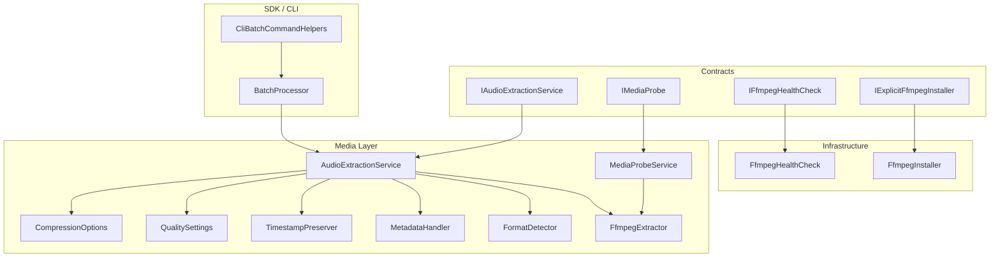
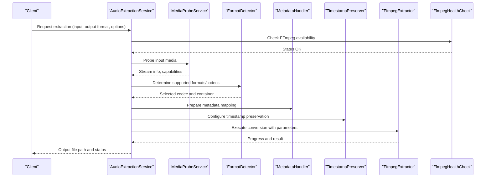
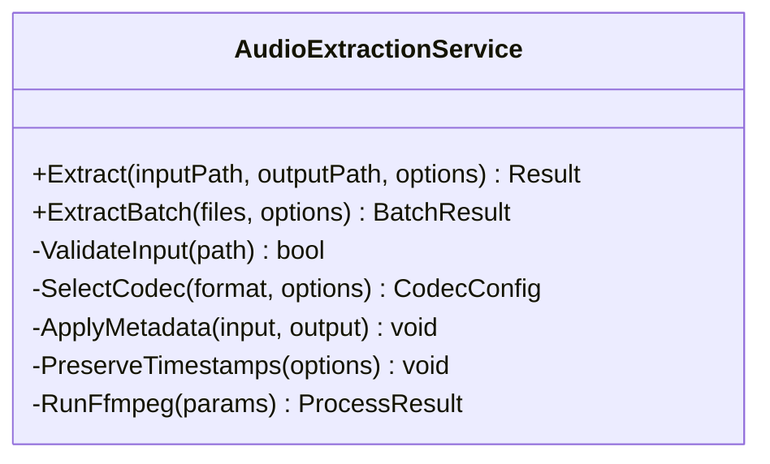
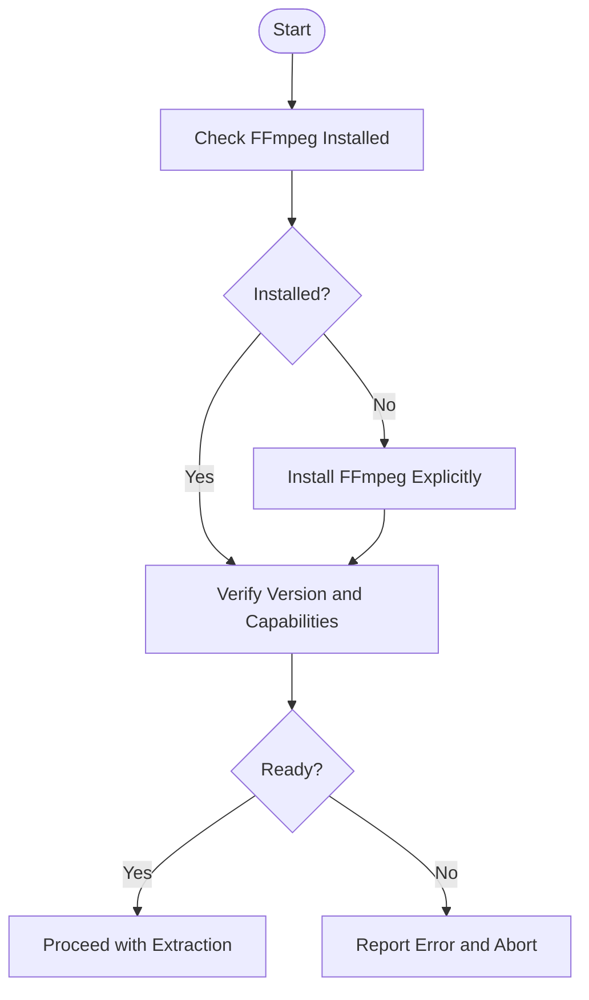
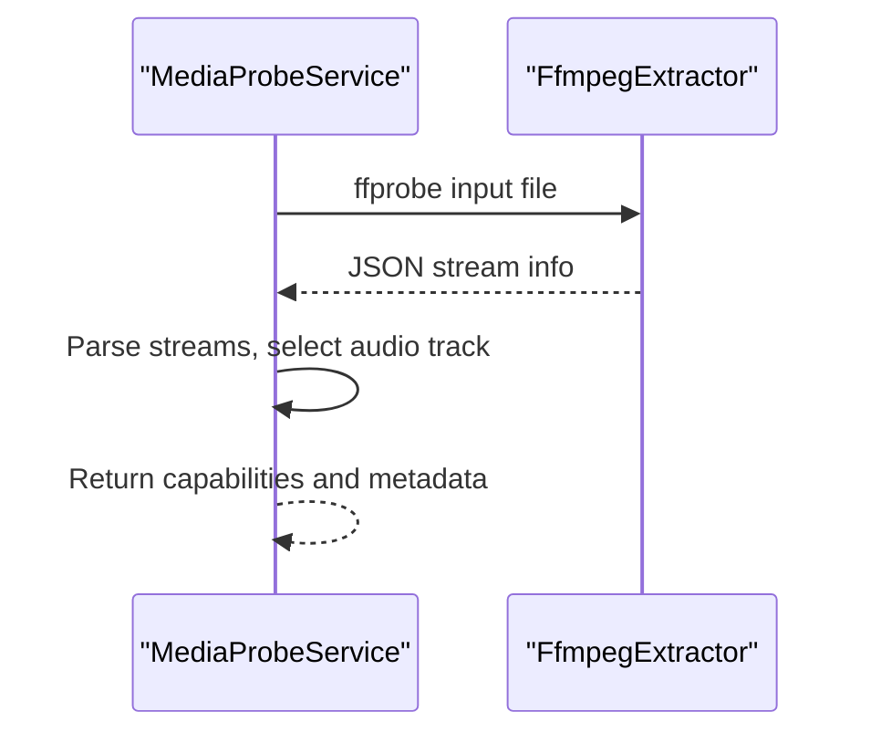
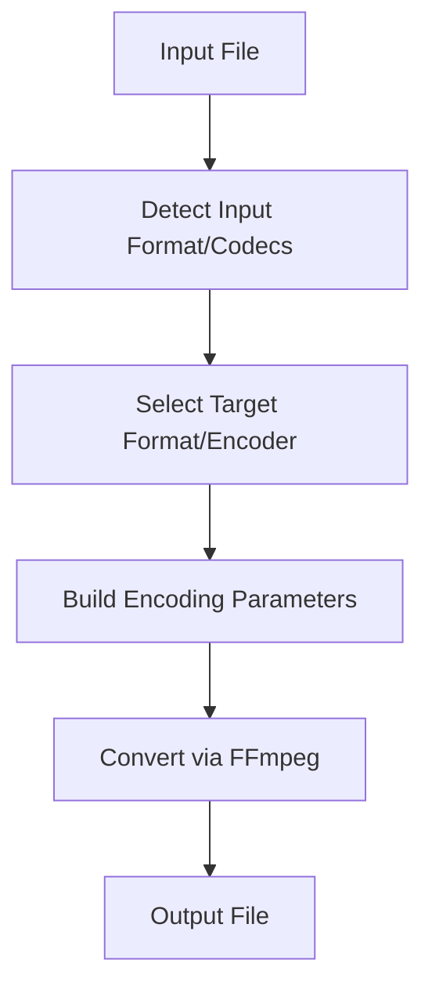
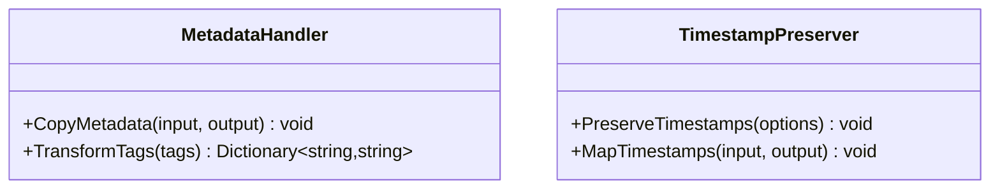
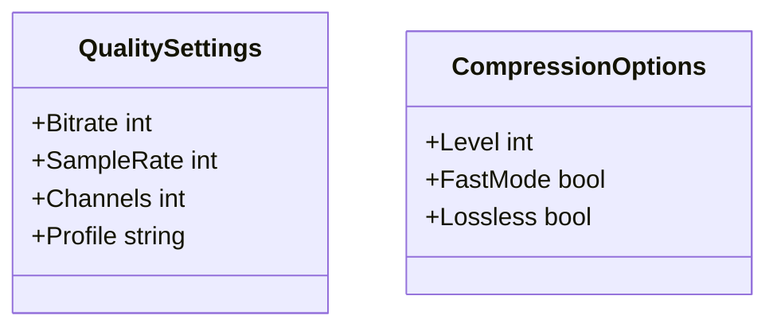
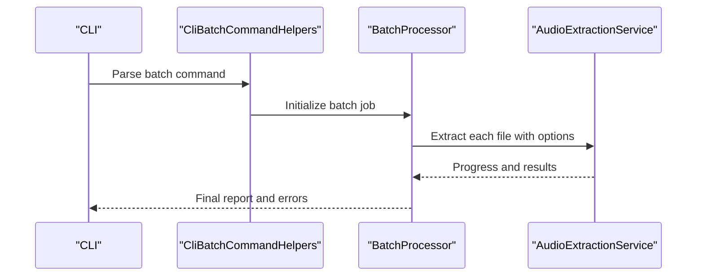
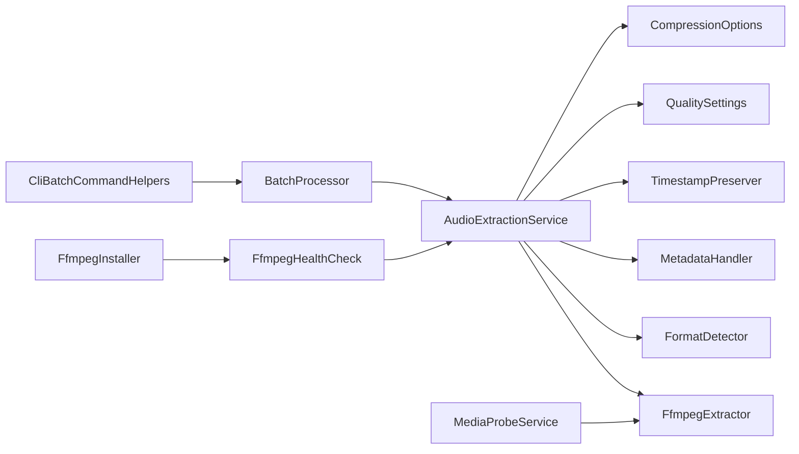

# Audio Extraction & Formats

<cite>
**Referenced Files in This Document**
- [IAudioExtractionService.cs](file://src/Trackdub.Contracts/IAudioExtractionService.cs)
- [IFfmpegHealthCheck.cs](file://src/Trackdub.Contracts/IFfmpegHealthCheck.cs)
- [IExplicitFfmpegInstaller.cs](file://src/Trackdub.Contracts/IExplicitFfmpegInstaller.cs)
- [IMediaProbe.cs](file://src/Trackdub.Contracts/IMediaProbe.cs)
- [MediaProbeService.cs](file://src/Trackdub.Media/Probe/MediaProbeService.cs)
- [FfmpegHealthCheck.cs](file://src/Trackdub.Infrastructure/Runtime/FfmpegHealthCheck.cs)
- [FfmpegInstaller.cs](file://src/Trackdub.Infrastructure/Runtime/FfmpegInstaller.cs)
- [AudioExtractionService.cs](file://src/Trackdub.Media/Services/AudioExtractionService.cs)
- [FfmpegExtractor.cs](file://src/Trackdub.Media/Extraction/FfmpegExtractor.cs)
- [FormatDetector.cs](file://src/Trackdub.Media/Extraction/FormatDetector.cs)
- [MetadataHandler.cs](file://src/Trackdub.Media/Extraction/MetadataHandler.cs)
- [TimestampPreserver.cs](file://src/Trackdub.Media/Timing/TimestampPreserver.cs)
- [QualitySettings.cs](file://src/Trackdub.Media/Quality/QualitySettings.cs)
- [CompressionOptions.cs](file://src/Trackdub.Media/Quality/CompressionOptions.cs)
- [BatchProcessor.cs](file://src/Trackdub.Sdk/BatchProcessor.cs)
- [CliBatchCommandHelpers.cs](file://src/Trackdub.Cli/CliBatchCommandHelpers.cs)
- [ErrorCode.cs](file://src/Trackdub.Sdk/ErrorCode.cs)
- [FfmpegHelpers.cs](file://src/Trackdub.Tools/FfmpegHelpers/FfmpegHelpers.cs)
</cite>

## Table of Contents
1. [Introduction](#introduction)
2. [Project Structure](#project-structure)
3. [Core Components](#core-components)
4. [Architecture Overview](#architecture-overview)
5. [Detailed Component Analysis](#detailed-component-analysis)
6. [Dependency Analysis](#dependency-analysis)
7. [Performance Considerations](#performance-considerations)
8. [Troubleshooting Guide](#troubleshooting-guide)
9. [Conclusion](#conclusion)

## Introduction
This document explains Trackdub’s audio extraction and format support capabilities, focusing on how media is probed, decoded, and converted to target audio formats such as MP3, WAV, FLAC, AAC, and OGG. It covers FFmpeg integration, codec detection, conversion pipelines, metadata handling, timestamp preservation, quality and compression options, batch processing, error handling for unsupported formats, and performance considerations for large files.

## Project Structure
The audio extraction subsystem spans several layers:
- Contracts define interfaces for extraction, probing, and FFmpeg lifecycle management.
- Media layer implements extraction, format detection, metadata handling, timing, and quality controls.
- Infrastructure provides FFmpeg health checks and installation utilities.
- SDK and CLI provide batch orchestration and user-facing commands.

**Diagram sources**
- [IAudioExtractionService.cs](file://src/Trackdub.Contracts/IAudioExtractionService.cs)
- [IMediaProbe.cs](file://src/Trackdub.Contracts/IMediaProbe.cs)
- [IFfmpegHealthCheck.cs](file://src/Trackdub.Contracts/IFfmpegHealthCheck.cs)
- [IExplicitFfmpegInstaller.cs](file://src/Trackdub.Contracts/IExplicitFfmpegInstaller.cs)
- [AudioExtractionService.cs](file://src/Trackdub.Media/Services/AudioExtractionService.cs)
- [FfmpegExtractor.cs](file://src/Trackdub.Media/Extraction/FfmpegExtractor.cs)
- [FormatDetector.cs](file://src/Trackdub.Media/Extraction/FormatDetector.cs)
- [MetadataHandler.cs](file://src/Trackdub.Media/Extraction/MetadataHandler.cs)
- [TimestampPreserver.cs](file://src/Trackdub.Media/Timing/TimestampPreserver.cs)
- [QualitySettings.cs](file://src/Trackdub.Media/Quality/QualitySettings.cs)
- [CompressionOptions.cs](file://src/Trackdub.Media/Quality/CompressionOptions.cs)
- [MediaProbeService.cs](file://src/Trackdub.Media/Probe/MediaProbeService.cs)
- [FfmpegHealthCheck.cs](file://src/Trackdub.Infrastructure/Runtime/FfmpegHealthCheck.cs)
- [FfmpegInstaller.cs](file://src/Trackdub.Infrastructure/Runtime/FfmpegInstaller.cs)
- [BatchProcessor.cs](file://src/Trackdub.Sdk/BatchProcessor.cs)
- [CliBatchCommandHelpers.cs](file://src/Trackdub.Cli/CliBatchCommandHelpers.cs)

**Section sources**
- [IAudioExtractionService.cs](file://src/Trackdub.Contracts/IAudioExtractionService.cs)
- [IMediaProbe.cs](file://src/Trackdub.Contracts/IMediaProbe.cs)
- [IFfmpegHealthCheck.cs](file://src/Trackdub.Contracts/IFfmpegHealthCheck.cs)
- [IExplicitFfmpegInstaller.cs](file://src/Trackdub.Contracts/IExplicitFfmpegInstaller.cs)
- [AudioExtractionService.cs](file://src/Trackdub.Media/Services/AudioExtractionService.cs)
- [FfmpegExtractor.cs](file://src/Trackdub.Media/Extraction/FfmpegExtractor.cs)
- [FormatDetector.cs](file://src/Trackdub.Media/Extraction/FormatDetector.cs)
- [MetadataHandler.cs](file://src/Trackdub.Media/Extraction/MetadataHandler.cs)
- [TimestampPreserver.cs](file://src/Trackdub.Media/Timing/TimestampPreserver.cs)
- [QualitySettings.cs](file://src/Trackdub.Media/Quality/QualitySettings.cs)
- [CompressionOptions.cs](file://src/Trackdub.Media/Quality/CompressionOptions.cs)
- [MediaProbeService.cs](file://src/Trackdub.Media/Probe/MediaProbeService.cs)
- [FfmpegHealthCheck.cs](file://src/Trackdub.Infrastructure/Runtime/FfmpegHealthCheck.cs)
- [FfmpegInstaller.cs](file://src/Trackdub.Infrastructure/Runtime/FfmpegInstaller.cs)
- [BatchProcessor.cs](file://src/Trackdub.Sdk/BatchProcessor.cs)
- [CliBatchCommandHelpers.cs](file://src/Trackdub.Cli/CliBatchCommandHelpers.cs)

## Core Components
- IAudioExtractionService: Defines the contract for extracting audio from media assets, including input validation, output format selection, and progress reporting.
- IMediaProbe: Provides capability assessment and automatic format detection for input media.
- IFfmpegHealthCheck and IExplicitFfmpegInstaller: Manage FFmpeg availability, version checks, and optional explicit installation flows.
- AudioExtractionService: Orchestrates extraction by combining probing, format detection, metadata handling, timestamp preservation, and FFmpeg-based conversion.
- FfmpegExtractor: Executes FFmpeg commands with appropriate codecs, filters, and parameters based on target format and quality settings.
- FormatDetector: Determines supported input/output formats and selects optimal codecs.
- MetadataHandler: Copies or transforms metadata during conversion.
- TimestampPreserver: Ensures timestamps are preserved across conversions.
- QualitySettings and CompressionOptions: Control encoding parameters like bitrate, sample rate, and compression levels.
- MediaProbeService: Implements probing using FFmpeg to gather stream info and capabilities.
- BatchProcessor and CliBatchCommandHelpers: Enable batch workflows and CLI-driven operations.

**Section sources**
- [IAudioExtractionService.cs](file://src/Trackdub.Contracts/IAudioExtractionService.cs)
- [IMediaProbe.cs](file://src/Trackdub.Contracts/IMediaProbe.cs)
- [IFfmpegHealthCheck.cs](file://src/Trackdub.Contracts/IFfmpegHealthCheck.cs)
- [IExplicitFfmpegInstaller.cs](file://src/Trackdub.Contracts/IExplicitFfmpegInstaller.cs)
- [AudioExtractionService.cs](file://src/Trackdub.Media/Services/AudioExtractionService.cs)
- [FfmpegExtractor.cs](file://src/Trackdub.Media/Extraction/FfmpegExtractor.cs)
- [FormatDetector.cs](file://src/Trackdub.Media/Extraction/FormatDetector.cs)
- [MetadataHandler.cs](file://src/Trackdub.Media/Extraction/MetadataHandler.cs)
- [TimestampPreserver.cs](file://src/Trackdub.Media/Timing/TimestampPreserver.cs)
- [QualitySettings.cs](file://src/Trackdub.Media/Quality/QualitySettings.cs)
- [CompressionOptions.cs](file://src/Trackdub.Media/Quality/CompressionOptions.cs)
- [MediaProbeService.cs](file://src/Trackdub.Media/Probe/MediaProbeService.cs)
- [BatchProcessor.cs](file://src/Trackdub.Sdk/BatchProcessor.cs)
- [CliBatchCommandHelpers.cs](file://src/Trackdub.Cli/CliBatchCommandHelpers.cs)

## Architecture Overview
The extraction pipeline integrates probing, format detection, and FFmpeg-based conversion with robust metadata and timestamp handling.

**Diagram sources**
- [AudioExtractionService.cs](file://src/Trackdub.Media/Services/AudioExtractionService.cs)
- [MediaProbeService.cs](file://src/Trackdub.Media/Probe/MediaProbeService.cs)
- [FormatDetector.cs](file://src/Trackdub.Media/Extraction/FormatDetector.cs)
- [MetadataHandler.cs](file://src/Trackdub.Media/Extraction/MetadataHandler.cs)
- [TimestampPreserver.cs](file://src/Trackdub.Media/Timing/TimestampPreserver.cs)
- [FfmpegExtractor.cs](file://src/Trackdub.Media/Extraction/FfmpegExtractor.cs)
- [FfmpegHealthCheck.cs](file://src/Trackdub.Infrastructure/Runtime/FfmpegHealthCheck.cs)

## Detailed Component Analysis

### Audio Extraction Service
Orchestrates the full extraction workflow: validates inputs, probes media, selects codecs, handles metadata and timestamps, and delegates conversion to FFmpeg. It exposes methods for single-file and batch extraction, progress callbacks, and error propagation.

**Diagram sources**
- [AudioExtractionService.cs](file://src/Trackdub.Media/Services/AudioExtractionService.cs)

**Section sources**
- [AudioExtractionService.cs](file://src/Trackdub.Media/Services/AudioExtractionService.cs)

### FFmpeg Integration and Health
FFmpeg is a core dependency for decoding and encoding. The system verifies FFmpeg presence and version, and supports explicit installation when needed.

**Diagram sources**
- [FfmpegHealthCheck.cs](file://src/Trackdub.Infrastructure/Runtime/FfmpegHealthCheck.cs)
- [FfmpegInstaller.cs](file://src/Trackdub.Infrastructure/Runtime/FfmpegInstaller.cs)

**Section sources**
- [IFfmpegHealthCheck.cs](file://src/Trackdub.Contracts/IFfmpegHealthCheck.cs)
- [IExplicitFfmpegInstaller.cs](file://src/Trackdub.Contracts/IExplicitFfmpegInstaller.cs)
- [FfmpegHealthCheck.cs](file://src/Trackdub.Infrastructure/Runtime/FfmpegHealthCheck.cs)
- [FfmpegInstaller.cs](file://src/Trackdub.Infrastructure/Runtime/FfmpegInstaller.cs)

### Media Probing and Capability Assessment
Probing gathers stream information, identifies audio/video tracks, and determines supported codecs for input and output containers.

**Diagram sources**
- [MediaProbeService.cs](file://src/Trackdub.Media/Probe/MediaProbeService.cs)
- [FfmpegExtractor.cs](file://src/Trackdub.Media/Extraction/FfmpegExtractor.cs)

**Section sources**
- [IMediaProbe.cs](file://src/Trackdub.Contracts/IMediaProbe.cs)
- [MediaProbeService.cs](file://src/Trackdub.Media/Probe/MediaProbeService.cs)

### Format Detection and Conversion Pipeline
Format detection maps input containers and codecs to suitable output formats and encoders. The pipeline ensures compatibility and optimal quality.

**Diagram sources**
- [FormatDetector.cs](file://src/Trackdub.Media/Extraction/FormatDetector.cs)
- [FfmpegExtractor.cs](file://src/Trackdub.Media/Extraction/FfmpegExtractor.cs)

**Section sources**
- [FormatDetector.cs](file://src/Trackdub.Media/Extraction/FormatDetector.cs)
- [FfmpegExtractor.cs](file://src/Trackdub.Media/Extraction/FfmpegExtractor.cs)

### Metadata Handling and Timestamp Preservation
Metadata is copied or transformed during conversion to maintain artist, title, album, and other tags. Timestamps are preserved to ensure accurate playback and alignment.

**Diagram sources**
- [MetadataHandler.cs](file://src/Trackdub.Media/Extraction/MetadataHandler.cs)
- [TimestampPreserver.cs](file://src/Trackdub.Media/Timing/TimestampPreserver.cs)

**Section sources**
- [MetadataHandler.cs](file://src/Trackdub.Media/Extraction/MetadataHandler.cs)
- [TimestampPreserver.cs](file://src/Trackdub.Media/Timing/TimestampPreserver.cs)

### Quality Settings and Compression Options
Quality and compression control encoding parameters such as bitrate, sample rate, and compression level per format.

**Diagram sources**
- [QualitySettings.cs](file://src/Trackdub.Media/Quality/QualitySettings.cs)
- [CompressionOptions.cs](file://src/Trackdub.Media/Quality/CompressionOptions.cs)

**Section sources**
- [QualitySettings.cs](file://src/Trackdub.Media/Quality/QualitySettings.cs)
- [CompressionOptions.cs](file://src/Trackdub.Media/Quality/CompressionOptions.cs)

### Batch Processing and CLI Workflows
Batch processing enables multiple file extractions with consistent options and reporting. CLI helpers provide command-line access to batch operations.

**Diagram sources**
- [CliBatchCommandHelpers.cs](file://src/Trackdub.Cli/CliBatchCommandHelpers.cs)
- [BatchProcessor.cs](file://src/Trackdub.Sdk/BatchProcessor.cs)
- [AudioExtractionService.cs](file://src/Trackdub.Media/Services/AudioExtractionService.cs)

**Section sources**
- [CliBatchCommandHelpers.cs](file://src/Trackdub.Cli/CliBatchCommandHelpers.cs)
- [BatchProcessor.cs](file://src/Trackdub.Sdk/BatchProcessor.cs)

## Dependency Analysis
Key dependencies include FFmpeg for media processing, probing, and conversion; internal services for orchestration; and SDK/CLI components for batch and user interaction.

**Diagram sources**
- [AudioExtractionService.cs](file://src/Trackdub.Media/Services/AudioExtractionService.cs)
- [FfmpegExtractor.cs](file://src/Trackdub.Media/Extraction/FfmpegExtractor.cs)
- [FormatDetector.cs](file://src/Trackdub.Media/Extraction/FormatDetector.cs)
- [MetadataHandler.cs](file://src/Trackdub.Media/Extraction/MetadataHandler.cs)
- [TimestampPreserver.cs](file://src/Trackdub.Media/Timing/TimestampPreserver.cs)
- [QualitySettings.cs](file://src/Trackdub.Media/Quality/QualitySettings.cs)
- [CompressionOptions.cs](file://src/Trackdub.Media/Quality/CompressionOptions.cs)
- [MediaProbeService.cs](file://src/Trackdub.Media/Probe/MediaProbeService.cs)
- [FfmpegHealthCheck.cs](file://src/Trackdub.Infrastructure/Runtime/FfmpegHealthCheck.cs)
- [FfmpegInstaller.cs](file://src/Trackdub.Infrastructure/Runtime/FfmpegInstaller.cs)
- [BatchProcessor.cs](file://src/Trackdub.Sdk/BatchProcessor.cs)
- [CliBatchCommandHelpers.cs](file://src/Trackdub.Cli/CliBatchCommandHelpers.cs)

**Section sources**
- [AudioExtractionService.cs](file://src/Trackdub.Media/Services/AudioExtractionService.cs)
- [FfmpegExtractor.cs](file://src/Trackdub.Media/Extraction/FfmpegExtractor.cs)
- [FormatDetector.cs](file://src/Trackdub.Media/Extraction/FormatDetector.cs)
- [MetadataHandler.cs](file://src/Trackdub.Media/Extraction/MetadataHandler.cs)
- [TimestampPreserver.cs](file://src/Trackdub.Media/Timing/TimestampPreserver.cs)
- [QualitySettings.cs](file://src/Trackdub.Media/Quality/QualitySettings.cs)
- [CompressionOptions.cs](file://src/Trackdub.Media/Quality/CompressionOptions.cs)
- [MediaProbeService.cs](file://src/Trackdub.Media/Probe/MediaProbeService.cs)
- [FfmpegHealthCheck.cs](file://src/Trackdub.Infrastructure/Runtime/FfmpegHealthCheck.cs)
- [FfmpegInstaller.cs](file://src/Trackdub.Infrastructure/Runtime/FfmpegInstaller.cs)
- [BatchProcessor.cs](file://src/Trackdub.Sdk/BatchProcessor.cs)
- [CliBatchCommandHelpers.cs](file://src/Trackdub.Cli/CliBatchCommandHelpers.cs)

## Performance Considerations
- Large file processing: Use streaming where possible, avoid loading entire files into memory, and leverage FFmpeg’s efficient decoding/encoding pipelines.
- Memory management: Reuse buffers, limit concurrent conversions, and monitor memory usage during batch jobs.
- Parallelism: Process independent files concurrently while respecting CPU/GPU constraints.
- I/O optimization: Prefer fast storage, minimize temporary files, and use direct paths when feasible.
- Codec selection: Choose hardware-accelerated codecs when available; otherwise, tune software encoder settings for speed vs. quality trade-offs.

[No sources needed since this section provides general guidance]

## Troubleshooting Guide
Common issues and resolutions:
- Unsupported input format: Verify FFmpeg build includes required decoders; check format detection logs.
- Missing FFmpeg: Run health check and install explicitly if necessary.
- Metadata loss: Ensure metadata handler is configured to copy tags; verify source metadata validity.
- Timestamp drift: Confirm timestamp preservation is enabled; check input timestamps integrity.
- Quality artifacts: Adjust bitrate, sample rate, and compression options; consider lossless mode for critical content.
- Batch failures: Inspect per-file error codes and reports; isolate problematic files.

Relevant error codes and diagnostics are exposed through SDK error types and CLI reporting.

**Section sources**
- [ErrorCode.cs](file://src/Trackdub.Sdk/ErrorCode.cs)
- [FfmpegHelpers.cs](file://src/Trackdub.Tools/FfmpegHelpers/FfmpegHelpers.cs)

## Conclusion
Trackdub’s audio extraction system combines robust probing, flexible format detection, and reliable FFmpeg-based conversion to support a wide range of audio formats and video containers. With comprehensive metadata handling, timestamp preservation, configurable quality and compression, and scalable batch processing, it provides a solid foundation for high-quality audio extraction workflows. Proper configuration and attention to performance considerations ensure efficient processing even for large media files.

[No sources needed since this section summarizes without analyzing specific files]