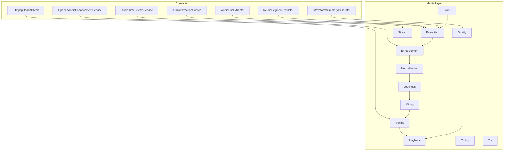
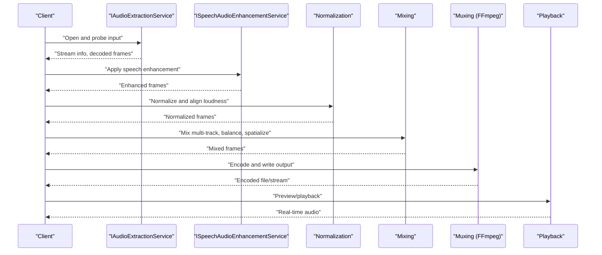
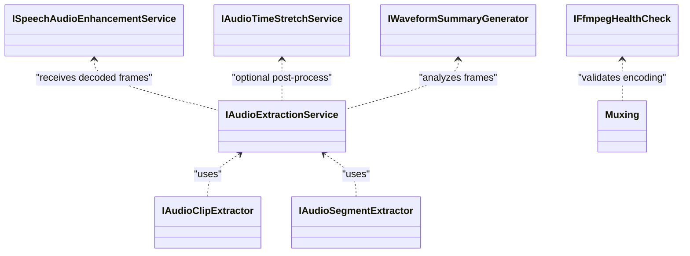

# Audio Processing & Enhancement

<cite>
**Referenced Files in This Document**
- [Trackdub.Media.csproj](file://src/Trackdub.Media/Trackdub.Media.csproj)
- [README.md](file://src/Trackdub.Media/README.md)
- [IAudioExtractionService.cs](file://src/Trackdub.Contracts/IAudioExtractionService.cs)
- [ISpeechAudioEnhancementService.cs](file://src/Trackdub.Contracts/ISpeechAudioEnhancementService.cs)
- [IFfmpegHealthCheck.cs](file://src/Trackdub.Contracts/IFfmpegHealthCheck.cs)
- [IAudioClipExtractor.cs](file://src/Trackdub.Contracts/IAudioClipExtractor.cs)
- [IAudioSegmentExtractor.cs](file://src/Trackdub.Contracts/IAudioSegmentExtractor.cs)
- [IAudioTimeStretchService.cs](file://src/Trackdub.Contracts/IAudioTimeStretchService.cs)
- [IWaveformSummaryGenerator.cs](file://src/Trackdub.Contracts/IWaveformSummaryGenerator.cs)
- [Mixing](file://src/Trackdub.Domain/Mixing)
- [Enhancement](file://src/Trackdub.Media/Enhancement)
- [Extraction](file://src/Trackdub.Media/Extraction)
- [Normalization](file://src/Trackdub.Media/Normalization)
- [Loudness](file://src/Trackdub.Media/Loudness)
- [Waveforms](file://src/Trackdub.Media/Waveforms)
- [Process](file://src/Trackdub.Media/Process)
- [Muxing](file://src/Trackdub.Media/Muxing)
- [Playback](file://src/Trackdub.Media/Playback)
- [Probe](file://src/Trackdub.Media/Probe)
- [Quality](file://src/Trackdub.Media/Quality)
- [Services](file://src/Trackdub.Media/Services)
- [Stretch](file://src/Trackdub.Media/Stretch)
- [Timing](file://src/Trackdub.Media/Timing)
- [Tts](file://src/Trackdub.Media/Tts)
</cite>

## Table of Contents
1. [Introduction](#introduction)
2. [Project Structure](#project-structure)
3. [Core Components](#core-components)
4. [Architecture Overview](#architecture-overview)
5. [Detailed Component Analysis](#detailed-component-analysis)
6. [Dependency Analysis](#dependency-analysis)
7. [Performance Considerations](#performance-considerations)
8. [Troubleshooting Guide](#troubleshooting-guide)
9. [Conclusion](#conclusion)

## Introduction
This document explains Trackdub’s audio processing capabilities across extraction, enhancement, mixing, normalization, quality optimization, and streaming. It covers supported formats and codecs, FFmpeg integration, custom pipelines, real-time playback, analysis and visualization, performance strategies for large files, and troubleshooting guidance.

## Project Structure
Trackdub organizes audio functionality into focused modules under the Media layer and related contracts:
- Contracts define service interfaces for extraction, enhancement, time-stretching, waveform generation, and FFmpeg health checks.
- The Media layer implements extraction, enhancement, normalization, loudness control, mixing, muxing, probing, quality metrics, playback, stretching, timing, and TTS-related utilities.
- Domain models provide mixing abstractions and shared types used by higher layers.

**Diagram sources**
- [IAudioExtractionService.cs](file://src/Trackdub.Contracts/IAudioExtractionService.cs)
- [ISpeechAudioEnhancementService.cs](file://src/Trackdub.Contracts/ISpeechAudioEnhancementService.cs)
- [IFfmpegHealthCheck.cs](file://src/Trackdub.Contracts/IFfmpegHealthCheck.cs)
- [IAudioClipExtractor.cs](file://src/Trackdub.Contracts/IAudioClipExtractor.cs)
- [IAudioSegmentExtractor.cs](file://src/Trackdub.Contracts/IAudioSegmentExtractor.cs)
- [IAudioTimeStretchService.cs](file://src/Trackdub.Contracts/IAudioTimeStretchService.cs)
- [IWaveformSummaryGenerator.cs](file://src/Trackdub.Contracts/IWaveformSummaryGenerator.cs)

**Section sources**
- [Trackdub.Media.csproj](file://src/Trackdub.Media/Trackdub.Media.csproj)
- [README.md](file://src/Trackdub.Media/README.md)

## Core Components
- Extraction: Reads source media, decodes streams, and produces PCM or intermediate formats suitable for processing.
- Enhancement: Applies speech-focused enhancements such as noise reduction, dereverberation, and clarity improvements.
- Normalization: Aligns perceived loudness and peak levels across tracks and sessions.
- Loudness: Measures and adjusts loudness according to industry standards (e.g., LUFS-based targets).
- Mixing: Combines multiple tracks, balances volumes, applies panning/spatialization, and renders final mixes.
- Muxing: Encodes and writes final outputs using FFmpeg-backed encoders.
- Probe: Inspects input metadata, codec info, and stream topology.
- Quality: Computes metrics and generates summaries for objective assessment.
- Playback: Streams and plays processed audio in real time.
- Stretch: Time-stretches and pitch-adjusts without artifacts where possible.
- Timing: Synchronizes audio segments with transcripts or other media timelines.
- TTS: Integrates text-to-speech outputs into the pipeline.

**Section sources**
- [IAudioExtractionService.cs](file://src/Trackdub.Contracts/IAudioExtractionService.cs)
- [ISpeechAudioEnhancementService.cs](file://src/Trackdub.Contracts/ISpeechAudioEnhancementService.cs)
- [IFfmpegHealthCheck.cs](file://src/Trackdub.Contracts/IFfmpegHealthCheck.cs)
- [IAudioClipExtractor.cs](file://src/Trackdub.Contracts/IAudioClipExtractor.cs)
- [IAudioSegmentExtractor.cs](file://src/Trackdub.Contracts/IAudioSegmentExtractor.cs)
- [IAudioTimeStretchService.cs](file://src/Trackdub.Contracts/IAudioTimeStretchService.cs)
- [IWaveformSummaryGenerator.cs](file://src/Trackdub.Contracts/IWaveformSummaryGenerator.cs)

## Architecture Overview
The audio pipeline follows a staged flow:
- Input probing and decoding
- Speech enhancement and noise reduction
- Normalization and loudness alignment
- Multi-track mixing and spatial processing
- Encoding and muxing via FFmpeg
- Real-time playback and preview

**Diagram sources**
- [IAudioExtractionService.cs](file://src/Trackdub.Contracts/IAudioExtractionService.cs)
- [ISpeechAudioEnhancementService.cs](file://src/Trackdub.Contracts/ISpeechAudioEnhancementService.cs)
- [IFfmpegHealthCheck.cs](file://src/Trackdub.Contracts/IFfmpegHealthCheck.cs)

## Detailed Component Analysis

### Extraction and Decoding
- Responsibilities:
  - Probe inputs for format, codec, sample rate, channels, duration.
  - Decode to a consistent internal format (e.g., PCM) for downstream processing.
  - Support segmented extraction for large files and memory efficiency.
- Key interfaces:
  - IAudioExtractionService: orchestrates extraction and decoding.
  - IAudioClipExtractor and IAudioSegmentExtractor: targeted extraction APIs.
- Performance considerations:
  - Chunked reading and streaming decode to avoid loading entire files into memory.
  - Reuse buffers and minimize allocations during decode loops.

**Section sources**
- [IAudioExtractionService.cs](file://src/Trackdub.Contracts/IAudioExtractionService.cs)
- [IAudioClipExtractor.cs](file://src/Trackdub.Contracts/IAudioClipExtractor.cs)
- [IAudioSegmentExtractor.cs](file://src/Trackdub.Contracts/IAudioSegmentExtractor.cs)

### Speech Enhancement and Noise Reduction
- Capabilities:
  - Noise suppression, dereverberation, and clarity enhancement tailored for speech.
  - Configurable strength and algorithm selection per use case.
- Interfaces:
  - ISpeechAudioEnhancementService: exposes enhancement operations and configuration.
- Typical pipeline placement:
  - After decoding and before normalization to ensure consistent input characteristics.

**Section sources**
- [ISpeechAudioEnhancementService.cs](file://src/Trackdub.Contracts/ISpeechAudioEnhancementService.cs)

### Normalization and Loudness Control
- Goals:
  - Consistent perceived loudness across tracks and sessions.
  - Peak limiting to prevent clipping while preserving dynamics.
- Techniques:
  - Loudness measurement (e.g., integrated LUFS), true peak detection, gain staging.
  - Per-channel and global normalization strategies.
- Placement:
  - Post-enhancement and pre-mixing to standardize levels before combination.

**Section sources**
- [Normalization](file://src/Trackdub.Media/Normalization)
- [Loudness](file://src/Trackdub.Media/Loudness)

### Multi-Track Mixing and Spatial Audio
- Features:
  - Combine multiple tracks with volume balancing, panning, and spatial effects.
  - Apply per-track EQ, compression, and reverb as needed.
  - Render stereo or immersive outputs depending on target.
- Implementation focus:
  - Efficient frame-wise mixing with headroom management.
  - Spatialization parameters mapped to channel layouts.

**Section sources**
- [Mixing](file://src/Trackdub.Domain/Mixing)

### FFmpeg Integration and Muxing
- Role:
  - Encode and write final outputs; validate FFmpeg availability and capabilities.
- Health checks:
  - IFfmpegHealthCheck ensures runtime readiness and feature detection.
- Supported formats and codecs:
  - Determined by FFmpeg build; typically includes common audio containers and codecs.
- Best practices:
  - Use streaming encode to reduce memory footprint.
  - Validate encoder options and container compatibility.

**Section sources**
- [IFfmpegHealthCheck.cs](file://src/Trackdub.Contracts/IFfmpegHealthCheck.cs)
- [Muxing](file://src/Trackdub.Media/Muxing)

### Waveform Visualization and Quality Assessment
- Waveform generation:
  - IWaveformSummaryGenerator provides summaries for visualization and UI rendering.
- Quality metrics:
  - Objective measures (e.g., SNR, PESQ-like scores if available) and summary statistics.
- Usage:
  - Feed summaries to UI for waveforms and quality dashboards.

**Section sources**
- [IWaveformSummaryGenerator.cs](file://src/Trackdub.Contracts/IWaveformSummaryGenerator.cs)
- [Waveforms](file://src/Trackdub.Media/Waveforms)
- [Quality](file://src/Trackdub.Media/Quality)

### Real-Time Streaming and Playback
- Playback backends:
  - Stream decoded or mixed frames to audio devices with low latency.
- Options:
  - Buffer sizing, device selection, and synchronization settings.
- Integration:
  - Connects to mixing and normalization outputs for live previews.

**Section sources**
- [Playback](file://src/Trackdub.Media/Playback)

### Time Stretching and Pitch Adjustment
- Services:
  - IAudioTimeStretchService supports tempo/pitch adjustments while maintaining quality.
- Use cases:
  - Syncing dialogue length, adjusting pacing, or creative effects.

**Section sources**
- [IAudioTimeStretchService.cs](file://src/Trackdub.Contracts/IAudioTimeStretchService.cs)
- [Stretch](file://src/Trackdub.Media/Stretch)

### Timing and Synchronization
- Purpose:
  - Align audio segments with transcripts, subtitles, or video timelines.
- Methods:
  - Segment-level timestamps, drift correction, and resampling when necessary.

**Section sources**
- [Timing](file://src/Trackdub.Media/Timing)

### Text-to-Speech Integration
- Scope:
  - Ingest TTS outputs, normalize levels, and integrate into the mix pipeline.
- Considerations:
  - Latency, voice consistency, and post-processing (EQ, compression).

**Section sources**
- [Tts](file://src/Trackdub.Media/Tts)

## Dependency Analysis
High-level dependencies among core services:

**Diagram sources**
- [IAudioExtractionService.cs](file://src/Trackdub.Contracts/IAudioExtractionService.cs)
- [IAudioClipExtractor.cs](file://src/Trackdub.Contracts/IAudioClipExtractor.cs)
- [IAudioSegmentExtractor.cs](file://src/Trackdub.Contracts/IAudioSegmentExtractor.cs)
- [ISpeechAudioEnhancementService.cs](file://src/Trackdub.Contracts/ISpeechAudioEnhancementService.cs)
- [IAudioTimeStretchService.cs](file://src/Trackdub.Contracts/IAudioTimeStretchService.cs)
- [IWaveformSummaryGenerator.cs](file://src/Trackdub.Contracts/IWaveformSummaryGenerator.cs)
- [IFfmpegHealthCheck.cs](file://src/Trackdub.Contracts/IFfmpegHealthCheck.cs)

**Section sources**
- [Trackdub.Media.csproj](file://src/Trackdub.Media/Trackdub.Media.csproj)

## Performance Considerations
- Large file handling:
  - Stream decode and encode; avoid full-file loads.
  - Use chunked processing and reusable buffers.
- Parallelism:
  - Process independent tracks or segments concurrently where safe.
  - Avoid contention on shared resources (FFmpeg instances, GPU/CPU pools).
- Memory management:
  - Limit buffer sizes; release frames promptly.
  - Prefer zero-copy paths between stages when possible.
- CPU/GPU utilization:
  - Offload heavy DSP to optimized libraries or accelerators.
  - Monitor thermal throttling and adjust batch sizes accordingly.
- I/O throughput:
  - Use fast storage and sequential reads/writes.
  - Minimize random access patterns.

[No sources needed since this section provides general guidance]

## Troubleshooting Guide
Common issues and resolutions:
- FFmpeg not found or incompatible:
  - Verify installation path and version; run health check diagnostics.
- Unsupported input format or codec:
  - Convert to a widely supported format first; confirm decoder availability.
- Excessive memory usage:
  - Reduce chunk size; enable streaming mode; close handles promptly.
- Clipping or distortion:
  - Adjust normalization targets; apply peak limiting; review gain staging.
- Latency spikes in playback:
  - Increase buffer size; prioritize audio thread; reduce background tasks.
- Mixed track imbalance:
  - Normalize per-track levels; verify panning and spatial settings.

**Section sources**
- [IFfmpegHealthCheck.cs](file://src/Trackdub.Contracts/IFfmpegHealthCheck.cs)
- [Playback](file://src/Trackdub.Media/Playback)
- [Normalization](file://src/Trackdub.Media/Normalization)
- [Loudness](file://src/Trackdub.Media/Loudness)
- [Mixing](file://src/Trackdub.Domain/Mixing)

## Conclusion
Trackdub’s audio subsystem provides a robust, modular pipeline for extraction, enhancement, normalization, mixing, and encoding. With clear service boundaries, FFmpeg-backed muxing, and real-time playback, it supports both offline processing and live workflows. Proper configuration of quality settings, compression ratios, and format-specific options ensures optimal results across diverse content and platforms.

[No sources needed since this section summarizes without analyzing specific files]