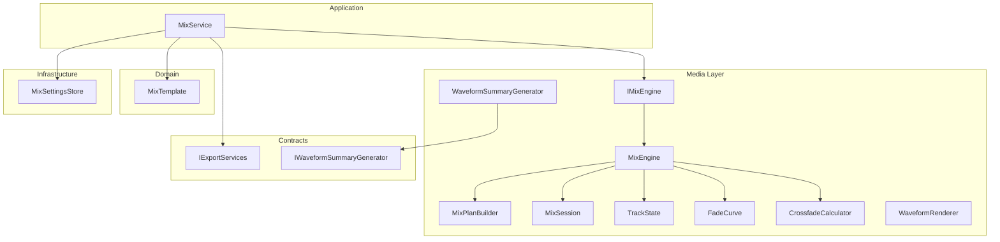
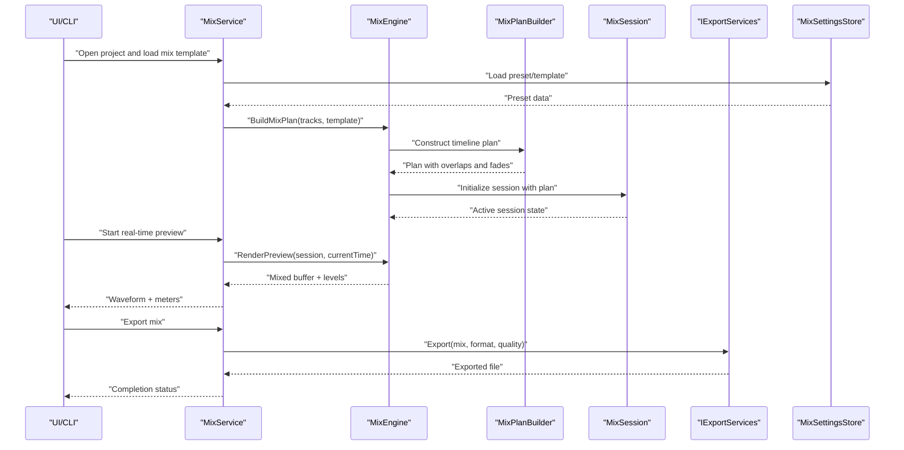
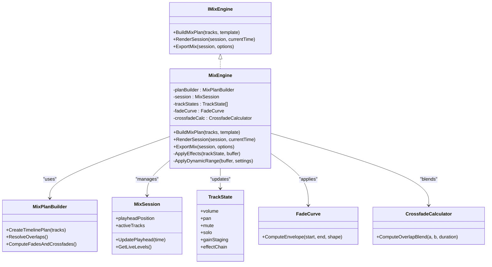
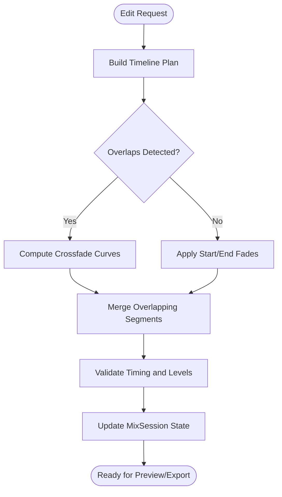
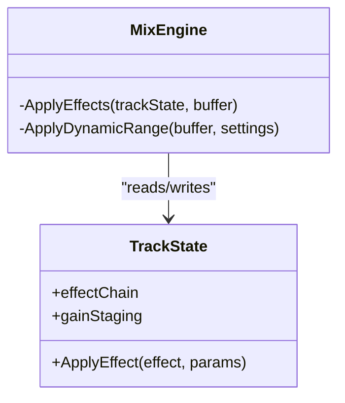
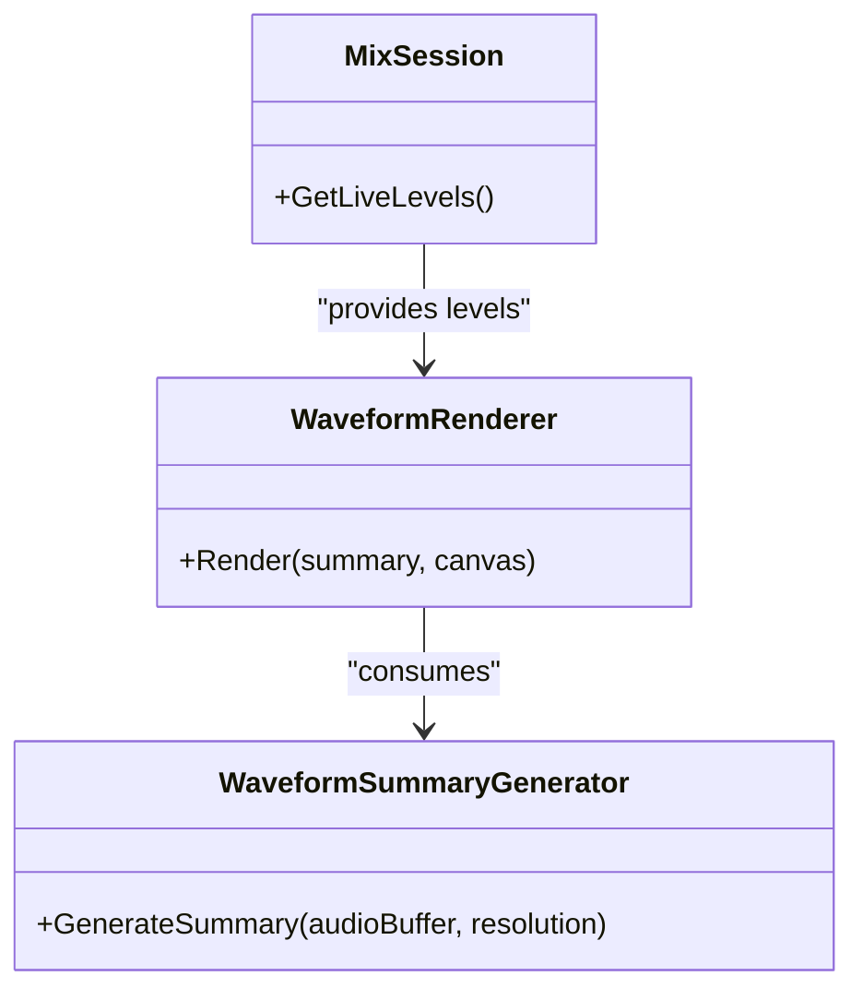
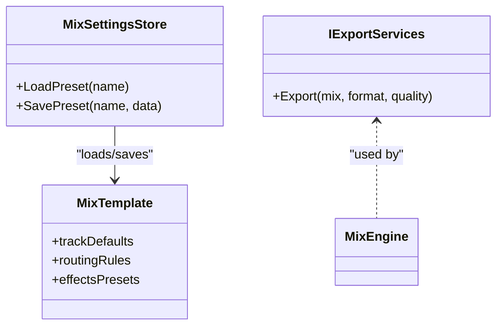
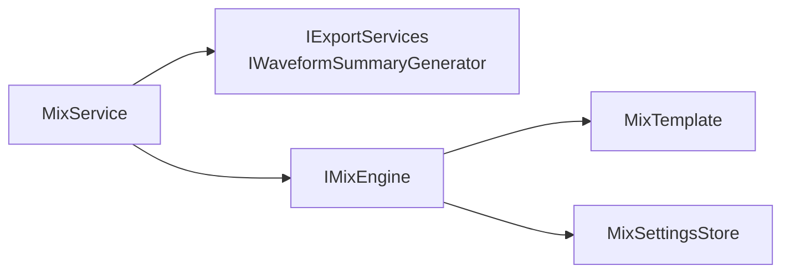

# Multi-Track Audio Mixing

<cite>
**Referenced Files in This Document**
- [Trackdub.Media/Mixing/IMixEngine.cs](file://src/Trackdub.Media/Mixing/IMixEngine.cs)
- [Trackdub.Media/Mixing/MixEngine.cs](file://src/Trackdub.Media/Mixing/MixEngine.cs)
- [Trackdub.Media/Mixing/MixPlanBuilder.cs](file://src/Trackdub.Media/Mixing/MixPlanBuilder.cs)
- [Trackdub.Media/Mixing/MixSession.cs](file://src/Trackdub.Media/Mixing/MixSession.cs)
- [Trackdub.Media/Mixing/TrackState.cs](file://src/Trackdub.Media/Mixing/TrackState.cs)
- [Trackdub.Media/Mixing/FadeCurve.cs](file://src/Trackdub.Media/Mixing/FadeCurve.cs)
- [Trackdub.Media/Mixing/CrossfadeCalculator.cs](file://src/Trackdub.Media/Mixing/CrossfadeCalculator.cs)
- [Trackdub.Media/Waveforms/WaveformSummaryGenerator.cs](file://src/Trackdub.Media/Waveforms/WaveformSummaryGenerator.cs)
- [Trackdub.Media/Waveforms/WaveformRenderer.cs](file://src/Trackdub.Media/Waveforms/WaveformRenderer.cs)
- [Trackdub.Application/Mixing/MixService.cs](file://src/Trackdub.Application/Mixing/MixService.cs)
- [Trackdub.Contracts/IExportServices.cs](file://src/Trackdub.Contracts/IExportServices.cs)
- [Trackdub.Contracts/IWaveformSummaryGenerator.cs](file://src/Trackdub.Contracts/IWaveformSummaryGenerator.cs)
- [Trackdub.Domain/Mixing/MixTemplate.cs](file://src/Trackdub.Domain/Mixing/MixTemplate.cs)
- [Trackdub.Infrastructure/Settings/MixSettingsStore.cs](file://src/Trackdub.Infrastructure/Settings/MixSettingsStore.cs)
</cite>

## Table of Contents
1. [Introduction](#introduction)
2. [Project Structure](#project-structure)
3. [Core Components](#core-components)
4. [Architecture Overview](#architecture-overview)
5. [Detailed Component Analysis](#detailed-component-analysis)
6. [Dependency Analysis](#dependency-analysis)
7. [Performance Considerations](#performance-considerations)
8. [Troubleshooting Guide](#troubleshooting-guide)
9. [Conclusion](#conclusion)
10. [Appendices](#appendices)

## Introduction
This document explains Trackdub’s multi-track audio mixing capabilities, focusing on track management, volume balancing, spatial positioning, and the mixing pipeline architecture. It covers timeline-based editing features such as crossfades and fades, effects processing, dynamic range control, concurrent track handling, real-time preview, and non-destructive editing. Configuration options for mix templates, presets, and export settings are documented alongside visualization tools like waveform display and level monitoring. Performance optimization strategies for complex mixes, memory management for large projects, and export quality settings are also addressed.

## Project Structure
The mixing subsystem spans multiple layers:
- Domain models define core entities like MixTemplate and related structures.
- Application services orchestrate user workflows and coordinate with infrastructure.
- Media layer implements the mixing engine, waveform generation, and playback utilities.
- Contracts expose interfaces for export and waveform summary generation.
- Infrastructure provides persistent storage for settings and presets.

**Diagram sources**
- [Trackdub.Application/Mixing/MixService.cs](file://src/Trackdub.Application/Mixing/MixService.cs)
- [Trackdub.Media/Mixing/IMixEngine.cs](file://src/Trackdub.Media/Mixing/IMixEngine.cs)
- [Trackdub.Media/Mixing/MixEngine.cs](file://src/Trackdub.Media/Mixing/MixEngine.cs)
- [Trackdub.Media/Mixing/MixPlanBuilder.cs](file://src/Trackdub.Media/Mixing/MixPlanBuilder.cs)
- [Trackdub.Media/Mixing/MixSession.cs](file://src/Trackdub.Media/Mixing/MixSession.cs)
- [Trackdub.Media/Mixing/TrackState.cs](file://src/Trackdub.Media/Mixing/TrackState.cs)
- [Trackdub.Media/Mixing/FadeCurve.cs](file://src/Trackdub.Media/Mixing/FadeCurve.cs)
- [Trackdub.Media/Mixing/CrossfadeCalculator.cs](file://src/Trackdub.Media/Mixing/CrossfadeCalculator.cs)
- [Trackdub.Media/Waveforms/WaveformSummaryGenerator.cs](file://src/Trackdub.Media/Waveforms/WaveformSummaryGenerator.cs)
- [Trackdub.Media/Waveforms/WaveformRenderer.cs](file://src/Trackdub.Media/Waveforms/WaveformRenderer.cs)
- [Trackdub.Contracts/IExportServices.cs](file://src/Trackdub.Contracts/IExportServices.cs)
- [Trackdub.Contracts/IWaveformSummaryGenerator.cs](file://src/Trackdub.Contracts/IWaveformSummaryGenerator.cs)
- [Trackdub.Domain/Mixing/MixTemplate.cs](file://src/Trackdub.Domain/Mixing/MixTemplate.cs)
- [Trackdub.Infrastructure/Settings/MixSettingsStore.cs](file://src/Trackdub.Infrastructure/Settings/MixSettingsStore.cs)

**Section sources**
- [Trackdub.Application/Mixing/MixService.cs](file://src/Trackdub.Application/Mixing/MixService.cs)
- [Trackdub.Media/Mixing/IMixEngine.cs](file://src/Trackdub.Media/Mixing/IMixEngine.cs)
- [Trackdub.Media/Mixing/MixEngine.cs](file://src/Trackdub.Media/Mixing/MixEngine.cs)
- [Trackdub.Media/Mixing/MixPlanBuilder.cs](file://src/Trackdub.Media/Mixing/MixPlanBuilder.cs)
- [Trackdub.Media/Mixing/MixSession.cs](file://src/Trackdub.Media/Mixing/MixSession.cs)
- [Trackdub.Media/Mixing/TrackState.cs](file://src/Trackdub.Media/Mixing/TrackState.cs)
- [Trackdub.Media/Mixing/FadeCurve.cs](file://src/Trackdub.Media/Mixing/FadeCurve.cs)
- [Trackdub.Media/Mixing/CrossfadeCalculator.cs](file://src/Trackdub.Media/Mixing/CrossfadeCalculator.cs)
- [Trackdub.Media/Waveforms/WaveformSummaryGenerator.cs](file://src/Trackdub.Media/Waveforms/WaveformSummaryGenerator.cs)
- [Trackdub.Media/Waveforms/WaveformRenderer.cs](file://src/Trackdub.Media/Waveforms/WaveformRenderer.cs)
- [Trackdub.Contracts/IExportServices.cs](file://src/Trackdub.Contracts/IExportServices.cs)
- [Trackdub.Contracts/IWaveformSummaryGenerator.cs](file://src/Trackdub.Contracts/IWaveformSummaryGenerator.cs)
- [Trackdub.Domain/Mixing/MixTemplate.cs](file://src/Trackdub.Domain/Mixing/MixTemplate.cs)
- [Trackdub.Infrastructure/Settings/MixSettingsStore.cs](file://src/Trackdub.Infrastructure/Settings/MixSettingsStore.cs)

## Core Components
- IMixEngine: Defines the mixing interface used by application services to build plans, render sessions, and manage tracks.
- MixEngine: Implements the mixing pipeline, scheduling concurrent tracks, applying volume and spatial parameters, and orchestrating effects and dynamic range control.
- MixPlanBuilder: Constructs a time-aligned plan from track segments, handles overlaps, and prepares regions for crossfades and fades.
- MixSession: Represents an active mix session with current playhead position, active tracks, and live state updates for real-time preview.
- TrackState: Encapsulates per-track properties including volume, pan, mute/solo, gain staging, and effect chain state.
- FadeCurve: Models fade shapes (linear, exponential, logarithmic) and computes amplitude envelopes over time.
- CrossfadeCalculator: Computes overlap blending curves between adjacent or overlapping tracks to ensure seamless transitions.
- WaveformSummaryGenerator: Generates compact waveform summaries for UI rendering and level monitoring.
- WaveformRenderer: Renders waveforms into visual representations for timeline display.
- MixService: Application-level service coordinating user actions, template/preset loading, and export requests.
- IExportServices: Abstraction for exporting mixed audio to various formats and quality settings.
- IWaveformSummaryGenerator: Contract for generating waveform summaries consumed by UI components.
- MixTemplate: Domain model defining reusable mix configurations (track defaults, routing, effects presets).
- MixSettingsStore: Persistent store for mix presets, templates, and user preferences.

**Section sources**
- [Trackdub.Media/Mixing/IMixEngine.cs](file://src/Trackdub.Media/Mixing/IMixEngine.cs)
- [Trackdub.Media/Mixing/MixEngine.cs](file://src/Trackdub.Media/Mixing/MixEngine.cs)
- [Trackdub.Media/Mixing/MixPlanBuilder.cs](file://src/Trackdub.Media/Mixing/MixPlanBuilder.cs)
- [Trackdub.Media/Mixing/MixSession.cs](file://src/Trackdub.Media/Mixing/MixSession.cs)
- [Trackdub.Media/Mixing/TrackState.cs](file://src/Trackdub.Media/Mixing/TrackState.cs)
- [Trackdub.Media/Mixing/FadeCurve.cs](file://src/Trackdub.Media/Mixing/FadeCurve.cs)
- [Trackdub.Media/Mixing/CrossfadeCalculator.cs](file://src/Trackdub.Media/Mixing/CrossfadeCalculator.cs)
- [Trackdub.Media/Waveforms/WaveformSummaryGenerator.cs](file://src/Trackdub.Media/Waveforms/WaveformSummaryGenerator.cs)
- [Trackdub.Media/Waveforms/WaveformRenderer.cs](file://src/Trackdub.Media/Waveforms/WaveformRenderer.cs)
- [Trackdub.Application/Mixing/MixService.cs](file://src/Trackdub.Application/Mixing/MixService.cs)
- [Trackdub.Contracts/IExportServices.cs](file://src/Trackdub.Contracts/IExportServices.cs)
- [Trackdub.Contracts/IWaveformSummaryGenerator.cs](file://src/Trackdub.Contracts/IWaveformSummaryGenerator.cs)
- [Trackdub.Domain/Mixing/MixTemplate.cs](file://src/Trackdub.Domain/Mixing/MixTemplate.cs)
- [Trackdub.Infrastructure/Settings/MixSettingsStore.cs](file://src/Trackdub.Infrastructure/Settings/MixSettingsStore.cs)

## Architecture Overview
The mixing architecture separates concerns across layers:
- Application layer (MixService) exposes high-level operations to the UI and CLI.
- Media layer (MixEngine, MixPlanBuilder, MixSession, TrackState, FadeCurve, CrossfadeCalculator) performs the heavy lifting of mixing, scheduling, and rendering.
- Contracts (IExportServices, IWaveformSummaryGenerator) decouple export and visualization from implementation details.
- Domain (MixTemplate) defines reusable configuration models.
- Infrastructure (MixSettingsStore) persists settings and presets.

**Diagram sources**
- [Trackdub.Application/Mixing/MixService.cs](file://src/Trackdub.Application/Mixing/MixService.cs)
- [Trackdub.Media/Mixing/MixEngine.cs](file://src/Trackdub.Media/Mixing/MixEngine.cs)
- [Trackdub.Media/Mixing/MixPlanBuilder.cs](file://src/Trackdub.Media/Mixing/MixPlanBuilder.cs)
- [Trackdub.Media/Mixing/MixSession.cs](file://src/Trackdub.Media/Mixing/MixSession.cs)
- [Trackdub.Contracts/IExportServices.cs](file://src/Trackdub.Contracts/IExportServices.cs)
- [Trackdub.Infrastructure/Settings/MixSettingsStore.cs](file://src/Trackdub.Infrastructure/Settings/MixSettingsStore.cs)

## Detailed Component Analysis

### MixEngine and Mixing Pipeline
MixEngine coordinates the mixing pipeline:
- Builds a time-aligned plan using MixPlanBuilder.
- Schedules concurrent track rendering based on sample-accurate timing.
- Applies per-track volume, pan, mute/solo, and effect chain.
- Integrates dynamic range control (e.g., limiter/compressor) at bus or track level.
- Produces mixed buffers for preview and export.

**Diagram sources**
- [Trackdub.Media/Mixing/IMixEngine.cs](file://src/Trackdub.Media/Mixing/IMixEngine.cs)
- [Trackdub.Media/Mixing/MixEngine.cs](file://src/Trackdub.Media/Mixing/MixEngine.cs)
- [Trackdub.Media/Mixing/MixPlanBuilder.cs](file://src/Trackdub.Media/Mixing/MixPlanBuilder.cs)
- [Trackdub.Media/Mixing/MixSession.cs](file://src/Trackdub.Media/Mixing/MixSession.cs)
- [Trackdub.Media/Mixing/TrackState.cs](file://src/Trackdub.Media/Mixing/TrackState.cs)
- [Trackdub.Media/Mixing/FadeCurve.cs](file://src/Trackdub.Media/Mixing/FadeCurve.cs)
- [Trackdub.Media/Mixing/CrossfadeCalculator.cs](file://src/Trackdub.Media/Mixing/CrossfadeCalculator.cs)

**Section sources**
- [Trackdub.Media/Mixing/IMixEngine.cs](file://src/Trackdub.Media/Mixing/IMixEngine.cs)
- [Trackdub.Media/Mixing/MixEngine.cs](file://src/Trackdub.Media/Mixing/MixEngine.cs)
- [Trackdub.Media/Mixing/MixPlanBuilder.cs](file://src/Trackdub.Media/Mixing/MixPlanBuilder.cs)
- [Trackdub.Media/Mixing/MixSession.cs](file://src/Trackdub.Media/Mixing/MixSession.cs)
- [Trackdub.Media/Mixing/TrackState.cs](file://src/Trackdub.Media/Mixing/TrackState.cs)
- [Trackdub.Media/Mixing/FadeCurve.cs](file://src/Trackdub.Media/Mixing/FadeCurve.cs)
- [Trackdub.Media/Mixing/CrossfadeCalculator.cs](file://src/Trackdub.Media/Mixing/CrossfadeCalculator.cs)

### Timeline-Based Editing: Fades and Crossfades
Timeline editing relies on precise envelope computation and overlap blending:
- FadeCurve generates amplitude envelopes for start/end fades.
- CrossfadeCalculator blends overlapping segments to avoid clicks and maintain continuity.
- MixPlanBuilder resolves overlaps and schedules fade/crossfade regions.

**Diagram sources**
- [Trackdub.Media/Mixing/MixPlanBuilder.cs](file://src/Trackdub.Media/Mixing/MixPlanBuilder.cs)
- [Trackdub.Media/Mixing/FadeCurve.cs](file://src/Trackdub.Media/Mixing/FadeCurve.cs)
- [Trackdub.Media/Mixing/CrossfadeCalculator.cs](file://src/Trackdub.Media/Mixing/CrossfadeCalculator.cs)

**Section sources**
- [Trackdub.Media/Mixing/MixPlanBuilder.cs](file://src/Trackdub.Media/Mixing/MixPlanBuilder.cs)
- [Trackdub.Media/Mixing/FadeCurve.cs](file://src/Trackdub.Media/Mixing/FadeCurve.cs)
- [Trackdub.Media/Mixing/CrossfadeCalculator.cs](file://src/Trackdub.Media/Mixing/CrossfadeCalculator.cs)

### Effects Processing and Dynamic Range Control
- TrackState holds per-track effect chain parameters (EQ, reverb, delay, etc.).
- MixEngine applies effects during rendering, ensuring order and latency considerations.
- Dynamic range control (compressor/limiter) is applied to prevent clipping and maintain consistent loudness.

**Diagram sources**
- [Trackdub.Media/Mixing/TrackState.cs](file://src/Trackdub.Media/Mixing/TrackState.cs)
- [Trackdub.Media/Mixing/MixEngine.cs](file://src/Trackdub.Media/Mixing/MixEngine.cs)

**Section sources**
- [Trackdub.Media/Mixing/TrackState.cs](file://src/Trackdub.Media/Mixing/TrackState.cs)
- [Trackdub.Media/Mixing/MixEngine.cs](file://src/Trackdub.Media/Mixing/MixEngine.cs)

### Visualization Tools: Waveform Display and Level Monitoring
- WaveformSummaryGenerator produces compact summaries for efficient UI rendering.
- WaveformRenderer converts summaries into visual representations for timelines.
- MixSession exposes live levels for meters and peak detection.

**Diagram sources**
- [Trackdub.Media/Waveforms/WaveformSummaryGenerator.cs](file://src/Trackdub.Media/Waveforms/WaveformSummaryGenerator.cs)
- [Trackdub.Media/Waveforms/WaveformRenderer.cs](file://src/Trackdub.Media/Waveforms/WaveformRenderer.cs)
- [Trackdub.Media/Mixing/MixSession.cs](file://src/Trackdub.Media/Mixing/MixSession.cs)

**Section sources**
- [Trackdub.Media/Waveforms/WaveformSummaryGenerator.cs](file://src/Trackdub.Media/Waveforms/WaveformSummaryGenerator.cs)
- [Trackdub.Media/Waveforms/WaveformRenderer.cs](file://src/Trackdub.Media/Waveforms/WaveformRenderer.cs)
- [Trackdub.Media/Mixing/MixSession.cs](file://src/Trackdub.Media/Mixing/MixSession.cs)

### Configuration: Mix Templates, Presets, and Export Settings
- MixTemplate defines reusable configurations for track defaults, routing, and effects presets.
- MixSettingsStore persists presets and user preferences.
- IExportServices abstracts export formats, quality, and metadata.

**Diagram sources**
- [Trackdub.Domain/Mixing/MixTemplate.cs](file://src/Trackdub.Domain/Mixing/MixTemplate.cs)
- [Trackdub.Infrastructure/Settings/MixSettingsStore.cs](file://src/Trackdub.Infrastructure/Settings/MixSettingsStore.cs)
- [Trackdub.Contracts/IExportServices.cs](file://src/Trackdub.Contracts/IExportServices.cs)

**Section sources**
- [Trackdub.Domain/Mixing/MixTemplate.cs](file://src/Trackdub.Domain/Mixing/MixTemplate.cs)
- [Trackdub.Infrastructure/Settings/MixSettingsStore.cs](file://src/Trackdub.Infrastructure/Settings/MixSettingsStore.cs)
- [Trackdub.Contracts/IExportServices.cs](file://src/Trackdub.Contracts/IExportServices.cs)

## Dependency Analysis
The mixing system exhibits clear separation of concerns:
- Application layer depends on contracts and media layer interfaces.
- Media layer depends on domain models and infrastructure stores via abstractions.
- Contracts provide stable boundaries for export and visualization.

**Diagram sources**
- [Trackdub.Application/Mixing/MixService.cs](file://src/Trackdub.Application/Mixing/MixService.cs)
- [Trackdub.Contracts/IExportServices.cs](file://src/Trackdub.Contracts/IExportServices.cs)
- [Trackdub.Contracts/IWaveformSummaryGenerator.cs](file://src/Trackdub.Contracts/IWaveformSummaryGenerator.cs)
- [Trackdub.Media/Mixing/IMixEngine.cs](file://src/Trackdub.Media/Mixing/IMixEngine.cs)
- [Trackdub.Domain/Mixing/MixTemplate.cs](file://src/Trackdub.Domain/Mixing/MixTemplate.cs)
- [Trackdub.Infrastructure/Settings/MixSettingsStore.cs](file://src/Trackdub.Infrastructure/Settings/MixSettingsStore.cs)

**Section sources**
- [Trackdub.Application/Mixing/MixService.cs](file://src/Trackdub.Application/Mixing/MixService.cs)
- [Trackdub.Contracts/IExportServices.cs](file://src/Trackdub.Contracts/IExportServices.cs)
- [Trackdub.Contracts/IWaveformSummaryGenerator.cs](file://src/Trackdub.Contracts/IWaveformSummaryGenerator.cs)
- [Trackdub.Media/Mixing/IMixEngine.cs](file://src/Trackdub.Media/Mixing/IMixEngine.cs)
- [Trackdub.Domain/Mixing/MixTemplate.cs](file://src/Trackdub.Domain/Mixing/MixTemplate.cs)
- [Trackdub.Infrastructure/Settings/MixSettingsStore.cs](file://src/Trackdub.Infrastructure/Settings/MixSettingsStore.cs)

## Performance Considerations
- Concurrent track rendering: Use thread-safe buffers and minimize allocations; leverage parallelism where safe.
- Memory management: Stream large audio segments; reuse buffers; avoid copying when possible.
- Real-time preview: Limit effect complexity; precompute waveforms; throttle UI updates.
- Export quality: Choose appropriate bit depth and sample rate; use lossless formats for archiving; apply dithering if needed.
- Dynamic range control: Set thresholds carefully to avoid pumping; monitor peaks to prevent clipping.

[No sources needed since this section provides general guidance]

## Troubleshooting Guide
Common issues and resolutions:
- Clicks or pops during crossfades: Verify overlap durations and curve shapes; ensure smooth transitions.
- Latency in preview: Reduce effect chain complexity; increase buffer size; disable unnecessary tracks.
- Memory spikes: Check for unbounded buffering; implement streaming; profile allocations.
- Export artifacts: Validate sample rates and formats; check for clipping; review limiter settings.

**Section sources**
- [Trackdub.Media/Mixing/CrossfadeCalculator.cs](file://src/Trackdub.Media/Mixing/CrossfadeCalculator.cs)
- [Trackdub.Media/Mixing/MixEngine.cs](file://src/Trackdub.Media/Mixing/MixEngine.cs)
- [Trackdub.Media/Waveforms/WaveformSummaryGenerator.cs](file://src/Trackdub.Media/Waveforms/WaveformSummaryGenerator.cs)

## Conclusion
Trackdub’s mixing subsystem provides a robust, extensible framework for multi-track audio mixing. Its layered architecture supports advanced features like crossfades, fades, effects processing, and dynamic range control while maintaining performance through concurrent rendering and efficient memory usage. Visualization tools and configuration options enable professional-grade workflows, and export services ensure high-quality outputs.

[No sources needed since this section summarizes without analyzing specific files]

## Appendices
- Best practices for track organization and naming.
- Recommended settings for different project types (podcast, music, film).
- Tips for optimizing effect chains and managing CPU usage.

[No sources needed since this section provides general guidance]