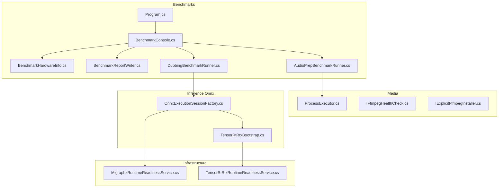
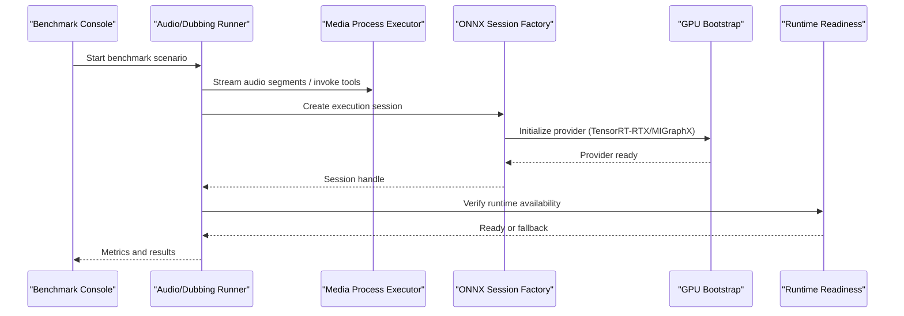
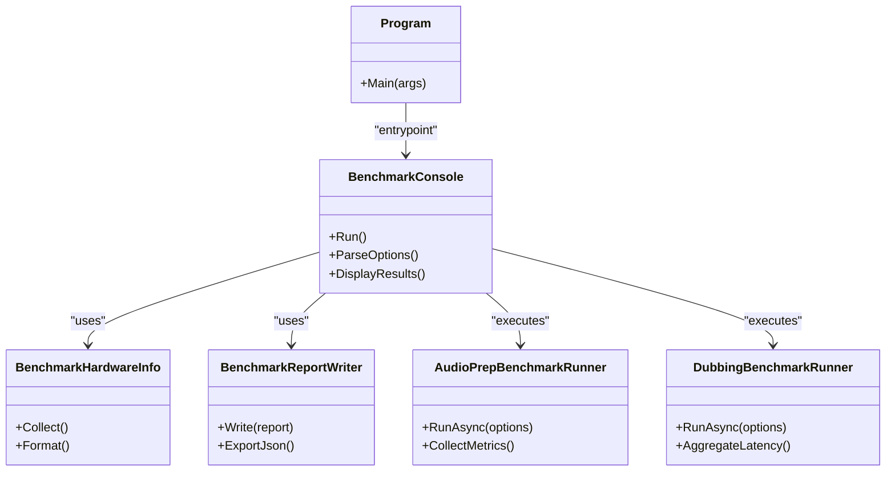
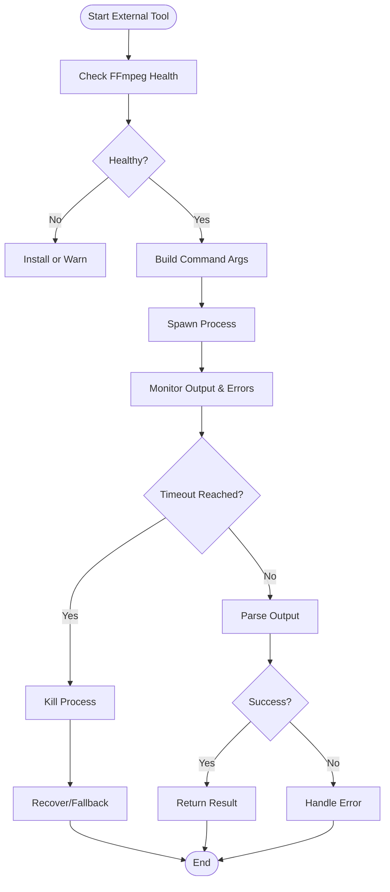
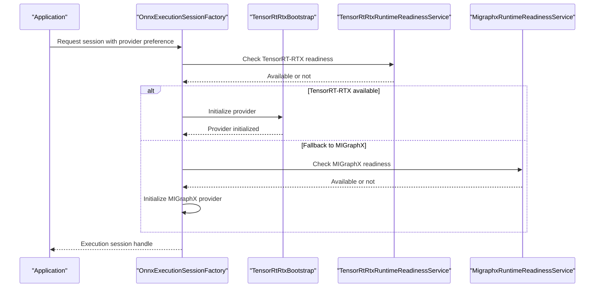
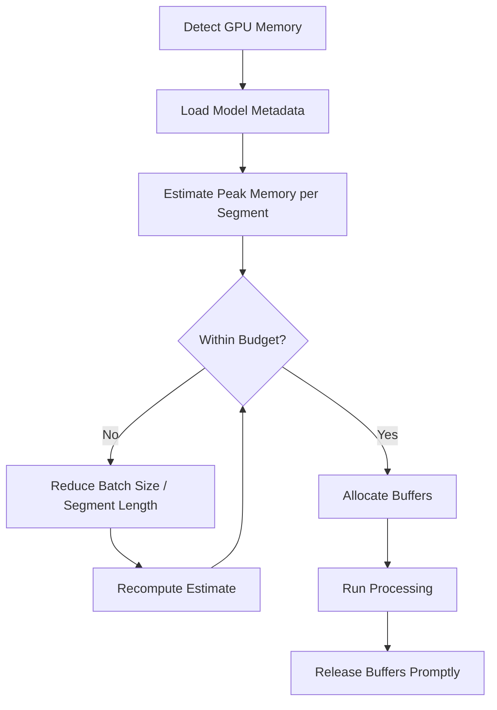
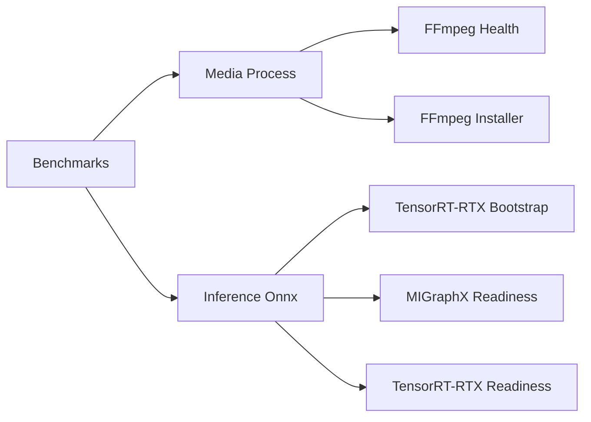

# Performance Tuning & Memory Management

<cite>
**Referenced Files in This Document**
- [Trackdub.Benchmarks.csproj](file://src/Trackdub.Benchmarks/Trackdub.Benchmarks.csproj)
- [BenchmarkConsole.cs](file://src/Trackdub.Benchmarks/BenchmarkConsole.cs)
- [BenchmarkHardwareInfo.cs](file://src/Trackdub.Benchmarks/BenchmarkHardwareInfo.cs)
- [BenchmarkReportWriter.cs](file://src/Trackdub.Benchmarks/BenchmarkReportWriter.cs)
- [AudioPrepBenchmarkRunner.cs](file://src/Trackdub.Benchmarks/AudioPrepBenchmarkRunner.cs)
- [DubbingBenchmarkRunner.cs](file://src/Trackdub.Benchmarks/DubbingBenchmarkRunner.cs)
- [Program.cs](file://src/Trackdub.Benchmarks/Program.cs)
- [README.md](file://src/Trackdub.Benchmarks/README.md)
- [Trackdub.Media.csproj](file://src/Trackdub.Media/Trackdub.Media.csproj)
- [ProcessExecutor.cs](file://src/Trackdub.Media/Process/ProcessExecutor.cs)
- [FfmpegHealthCheck.cs](file://src/Trackdub.Contracts/IFfmpegHealthCheck.cs)
- [IExplicitFfmpegInstaller.cs](file://src/Trackdub.Contracts/IExplicitFfmpegInstaller.cs)
- [NvidiaAfxProfile.cs](file://src/Trackdub.Contracts/NvidiaAfxProfile.cs)
- [Trackdub.Inference.Onnx.csproj](file://src/Trackdub.Inference.Onnx/Trackdub.Inference.Onnx.csproj)
- [OnnxExecutionSessionFactory.cs](file://src/Trackdub.Inference.Onnx/OnnxExecutionSessionFactory.cs)
- [TensorRtRtxBootstrap.cs](file://src/Trackdub.Inference.Onnx/TensorRtRtx/TensorRtRtxBootstrap.cs)
- [MigraphxRuntimeReadinessService.cs](file://src/Trackdub.Infrastructure/Runtime/MigraphxRuntimeReadinessService.cs)
- [TensorRtRtxRuntimeReadinessService.cs](file://src/Trackdub.Infrastructure/Runtime/TensorRtRtxRuntimeReadinessService.cs)
- [ADR-0009-gpu-memory-budget-planner.md](file://docs/decisions/ADR-0009-gpu-memory-budget-planner.md)
- [profiling-report.md](file://docs/reference/profiling-report.md)
- [TROUBLESHOOTING.md](file://docs/development/TROUBLESHOOTING.md)
</cite>

## Table of Contents
1. [Introduction](#introduction)
2. [Project Structure](#project-structure)
3. [Core Components](#core-components)
4. [Architecture Overview](#architecture-overview)
5. [Detailed Component Analysis](#detailed-component-analysis)
6. [Dependency Analysis](#dependency-analysis)
7. [Performance Considerations](#performance-considerations)
8. [Troubleshooting Guide](#troubleshooting-guide)
9. [Conclusion](#conclusion)
10. [Appendices](#appendices)

## Introduction
This document provides a comprehensive guide to optimizing Trackdub’s audio processing performance and memory management. It focuses on streaming audio processing, buffer management, memory mapping for large files, parallel processing strategies, GPU acceleration, CPU utilization tuning, memory leak prevention, garbage collection tuning, resource cleanup, external tool process management (including timeouts and error recovery), profiling and bottleneck identification, caching and lazy loading, monitoring, and scaling considerations for high-throughput scenarios. The guidance is grounded in the repository’s benchmarking infrastructure, media processing components, inference runtime integrations, and operational documentation.

## Project Structure
Trackdub organizes performance-critical code across several projects:
- Benchmarks project for end-to-end and component-level performance measurement
- Media project for file I/O, process orchestration, and audio pipeline primitives
- Inference Onnx project for ONNX execution providers and GPU backends
- Infrastructure services for runtime readiness and diagnostics
- Decision records and reference documents that codify performance and memory policies

**Diagram sources**
- [Program.cs](file://src/Trackdub.Benchmarks/Program.cs)
- [BenchmarkConsole.cs](file://src/Trackdub.Benchmarks/BenchmarkConsole.cs)
- [BenchmarkHardwareInfo.cs](file://src/Trackdub.Benchmarks/BenchmarkHardwareInfo.cs)
- [BenchmarkReportWriter.cs](file://src/Trackdub.Benchmarks/BenchmarkReportWriter.cs)
- [AudioPrepBenchmarkRunner.cs](file://src/Trackdub.Benchmarks/AudioPrepBenchmarkRunner.cs)
- [DubbingBenchmarkRunner.cs](file://src/Trackdub.Benchmarks/DubbingBenchmarkRunner.cs)
- [ProcessExecutor.cs](file://src/Trackdub.Media/Process/ProcessExecutor.cs)
- [IFfmpegHealthCheck.cs](file://src/Trackdub.Contracts/IFfmpegHealthCheck.cs)
- [IExplicitFfmpegInstaller.cs](file://src/Trackdub.Contracts/IExplicitFfmpegInstaller.cs)
- [OnnxExecutionSessionFactory.cs](file://src/Trackdub.Inference.Onnx/OnnxExecutionSessionFactory.cs)
- [TensorRtRtxBootstrap.cs](file://src/Trackdub.Inference.Onnx/TensorRtRtx/TensorRtRtxBootstrap.cs)
- [MigraphxRuntimeReadinessService.cs](file://src/Trackdub.Infrastructure/Runtime/MigraphxRuntimeReadinessService.cs)
- [TensorRtRtxRuntimeReadinessService.cs](file://src/Trackdub.Infrastructure/Runtime/TensorRtRtxRuntimeReadinessService.cs)

**Section sources**
- [README.md](file://src/Trackdub.Benchmarks/README.md)
- [Trackdub.Benchmarks.csproj](file://src/Trackdub.Benchmarks/Trackdub.Benchmarks.csproj)
- [Trackdub.Media.csproj](file://src/Trackdub.Media/Trackdub.Media.csproj)
- [Trackdub.Inference.Onnx.csproj](file://src/Trackdub.Inference.Onnx/Trackdub.Inference.Onnx.csproj)

## Core Components
- Benchmark harness and runners: Provide structured performance measurement for audio preparation and dubbing pipelines, including hardware discovery and report generation.
- Media process executor: Orchestrates external tools (e.g., FFmpeg) with robust lifecycle and error handling.
- Inference session factory and GPU bootstrap: Manages ONNX execution sessions and initializes GPU-backed providers (TensorRT-RTX, MIGraphX).
- Runtime readiness services: Validate availability and health of GPU runtimes before use.
- Contracts for FFmpeg health and installation: Ensure external dependencies are present and healthy.

Key responsibilities:
- Measure throughput and latency across stages
- Discover and report device capabilities
- Manage long-running or short-lived processes safely
- Initialize and validate GPU runtimes
- Enforce health checks for external toolchains

**Section sources**
- [BenchmarkConsole.cs](file://src/Trackdub.Benchmarks/BenchmarkConsole.cs)
- [BenchmarkHardwareInfo.cs](file://src/Trackdub.Benchmarks/BenchmarkHardwareInfo.cs)
- [BenchmarkReportWriter.cs](file://src/Trackdub.Benchmarks/BenchmarkReportWriter.cs)
- [AudioPrepBenchmarkRunner.cs](file://src/Trackdub.Benchmarks/AudioPrepBenchmarkRunner.cs)
- [DubbingBenchmarkRunner.cs](file://src/Trackdub.Benchmarks/DubbingBenchmarkRunner.cs)
- [ProcessExecutor.cs](file://src/Trackdub.Media/Process/ProcessExecutor.cs)
- [IFfmpegHealthCheck.cs](file://src/Trackdub.Contracts/IFfmpegHealthCheck.cs)
- [IExplicitFfmpegInstaller.cs](file://src/Trackdub.Contracts/IExplicitFfmpegInstaller.cs)
- [OnnxExecutionSessionFactory.cs](file://src/Trackdub.Inference.Onnx/OnnxExecutionSessionFactory.cs)
- [TensorRtRtxBootstrap.cs](file://src/Trackdub.Inference.Onnx/TensorRtRtx/TensorRtRtxBootstrap.cs)
- [MigraphxRuntimeReadinessService.cs](file://src/Trackdub.Infrastructure/Runtime/MigraphxRuntimeReadinessService.cs)
- [TensorRtRtxRuntimeReadinessService.cs](file://src/Trackdub.Infrastructure/Runtime/TensorRtRtxRuntimeReadinessService.cs)

## Architecture Overview
The performance architecture integrates benchmarking, media processing, and inference execution:
- Benchmarks drive end-to-end scenarios and collect metrics
- Media layer orchestrates streaming and external tool invocations
- Inference layer selects and initializes appropriate execution providers based on hardware
- Readiness services gate operations until GPUs and runtimes are available

**Diagram sources**
- [BenchmarkConsole.cs](file://src/Trackdub.Benchmarks/BenchmarkConsole.cs)
- [AudioPrepBenchmarkRunner.cs](file://src/Trackdub.Benchmarks/AudioPrepBenchmarkRunner.cs)
- [DubbingBenchmarkRunner.cs](file://src/Trackdub.Benchmarks/DubbingBenchmarkRunner.cs)
- [ProcessExecutor.cs](file://src/Trackdub.Media/Process/ProcessExecutor.cs)
- [OnnxExecutionSessionFactory.cs](file://src/Trackdub.Inference.Onnx/OnnxExecutionSessionFactory.cs)
- [TensorRtRtxBootstrap.cs](file://src/Trackdub.Inference.Onnx/TensorRtRtx/TensorRtRtxBootstrap.cs)
- [MigraphxRuntimeReadinessService.cs](file://src/Trackdub.Infrastructure/Runtime/MigraphxRuntimeReadinessService.cs)
- [TensorRtRtxRuntimeReadinessService.cs](file://src/Trackdub.Infrastructure/Runtime/TensorRtRtxRuntimeReadinessService.cs)

## Detailed Component Analysis

### Benchmark Harness and Runners
The benchmarks provide structured measurement for audio preparation and dubbing workflows. They discover hardware, execute scenarios, and write reports.

**Diagram sources**
- [Program.cs](file://src/Trackdub.Benchmarks/Program.cs)
- [BenchmarkConsole.cs](file://src/Trackdub.Benchmarks/BenchmarkConsole.cs)
- [BenchmarkHardwareInfo.cs](file://src/Trackdub.Benchmarks/BenchmarkHardwareInfo.cs)
- [BenchmarkReportWriter.cs](file://src/Trackdub.Benchmarks/BenchmarkReportWriter.cs)
- [AudioPrepBenchmarkRunner.cs](file://src/Trackdub.Benchmarks/AudioPrepBenchmarkRunner.cs)
- [DubbingBenchmarkRunner.cs](file://src/Trackdub.Benchmarks/DubbingBenchmarkRunner.cs)

**Section sources**
- [README.md](file://src/Trackdub.Benchmarks/README.md)
- [Program.cs](file://src/Trackdub.Benchmarks/Program.cs)
- [BenchmarkConsole.cs](file://src/Trackdub.Benchmarks/BenchmarkConsole.cs)
- [BenchmarkHardwareInfo.cs](file://src/Trackdub.Benchmarks/BenchmarkHardwareInfo.cs)
- [BenchmarkReportWriter.cs](file://src/Trackdub.Benchmarks/BenchmarkReportWriter.cs)
- [AudioPrepBenchmarkRunner.cs](file://src/Trackdub.Benchmarks/AudioPrepBenchmarkRunner.cs)
- [DubbingBenchmarkRunner.cs](file://src/Trackdub.Benchmarks/DubbingBenchmarkRunner.cs)

### Media Process Orchestration
External audio tools (e.g., FFmpeg) are orchestrated via a process executor with health checks and explicit installation support. This ensures reliable invocation, timeout handling, and error recovery.

**Diagram sources**
- [ProcessExecutor.cs](file://src/Trackdub.Media/Process/ProcessExecutor.cs)
- [IFfmpegHealthCheck.cs](file://src/Trackdub.Contracts/IFfmpegHealthCheck.cs)
- [IExplicitFfmpegInstaller.cs](file://src/Trackdub.Contracts/IExplicitFfmpegInstaller.cs)

**Section sources**
- [ProcessExecutor.cs](file://src/Trackdub.Media/Process/ProcessExecutor.cs)
- [IFfmpegHealthCheck.cs](file://src/Trackdub.Contracts/IFfmpegHealthCheck.cs)
- [IExplicitFfmpegInstaller.cs](file://src/Trackdub.Contracts/IExplicitFfmpegInstaller.cs)

### Inference Session Factory and GPU Bootstrap
The ONNX execution session factory creates optimized inference sessions and bootstraps GPU providers. Readiness services ensure the environment supports the selected backend.

**Diagram sources**
- [OnnxExecutionSessionFactory.cs](file://src/Trackdub.Inference.Onnx/OnnxExecutionSessionFactory.cs)
- [TensorRtRtxBootstrap.cs](file://src/Trackdub.Inference.Onnx/TensorRtRtx/TensorRtRtxBootstrap.cs)
- [TensorRtRtxRuntimeReadinessService.cs](file://src/Trackdub.Infrastructure/Runtime/TensorRtRtxRuntimeReadinessService.cs)
- [MigraphxRuntimeReadinessService.cs](file://src/Trackdub.Infrastructure/Runtime/MigraphxRuntimeReadinessService.cs)

**Section sources**
- [OnnxExecutionSessionFactory.cs](file://src/Trackdub.Inference.Onnx/OnnxExecutionSessionFactory.cs)
- [TensorRtRtxBootstrap.cs](file://src/Trackdub.Inference.Onnx/TensorRtRtx/TensorRtRtxBootstrap.cs)
- [TensorRtRtxRuntimeReadinessService.cs](file://src/Trackdub.Infrastructure/Runtime/TensorRtRtxRuntimeReadinessService.cs)
- [MigraphxRuntimeReadinessService.cs](file://src/Trackdub.Infrastructure/Runtime/MigraphxRuntimeReadinessService.cs)

### GPU Memory Budget Planning
GPU memory budget planning is documented to balance model size, batch size, and concurrency while preventing out-of-memory conditions.

**Diagram sources**
- [NvidiaAfxProfile.cs](file://src/Trackdub.Contracts/NvidiaAfxProfile.cs)
- [ADR-0009-gpu-memory-budget-planner.md](file://docs/decisions/ADR-0009-gpu-memory-budget-planner.md)

**Section sources**
- [NvidiaAfxProfile.cs](file://src/Trackdub.Contracts/NvidiaAfxProfile.cs)
- [ADR-0009-gpu-memory-budget-planner.md](file://docs/decisions/ADR-0009-gpu-memory-budget-planner.md)

## Dependency Analysis
The following diagram highlights key dependencies among performance-related components:

**Diagram sources**
- [Trackdub.Benchmarks.csproj](file://src/Trackdub.Benchmarks/Trackdub.Benchmarks.csproj)
- [Trackdub.Media.csproj](file://src/Trackdub.Media/Trackdub.Media.csproj)
- [Trackdub.Inference.Onnx.csproj](file://src/Trackdub.Inference.Onnx/Trackdub.Inference.Onnx.csproj)
- [IFfmpegHealthCheck.cs](file://src/Trackdub.Contracts/IFfmpegHealthCheck.cs)
- [IExplicitFfmpegInstaller.cs](file://src/Trackdub.Contracts/IExplicitFfmpegInstaller.cs)
- [TensorRtRtxBootstrap.cs](file://src/Trackdub.Inference.Onnx/TensorRtRtx/TensorRtRtxBootstrap.cs)
- [MigraphxRuntimeReadinessService.cs](file://src/Trackdub.Infrastructure/Runtime/MigraphxRuntimeReadinessService.cs)
- [TensorRtRtxRuntimeReadinessService.cs](file://src/Trackdub.Infrastructure/Runtime/TensorRtRtxRuntimeReadinessService.cs)

**Section sources**
- [Trackdub.Benchmarks.csproj](file://src/Trackdub.Benchmarks/Trackdub.Benchmarks.csproj)
- [Trackdub.Media.csproj](file://src/Trackdub.Media/Trackdub.Media.csproj)
- [Trackdub.Inference.Onnx.csproj](file://src/Trackdub.Inference.Onnx/Trackdub.Inference.Onnx.csproj)

## Performance Considerations
- Streaming audio processing:
  - Use chunked reading and pipelined processing to minimize peak memory
  - Employ ring buffers and zero-copy techniques where possible
- Buffer management:
  - Reuse buffers across segments to reduce allocations
  - Align buffer sizes to provider requirements (e.g., ONNX input shapes)
- Memory mapping:
  - Map large audio files instead of loading entirely into RAM
  - Unmap promptly after processing to free OS page cache
- Parallel processing:
  - Segment-based parallelism with bounded concurrency
  - Avoid contention on shared resources (e.g., GPU memory)
- GPU acceleration:
  - Prefer TensorRT-RTX for NVIDIA GPUs; fall back to MIGraphX when unavailable
  - Tune precision (FP16/INT8) and batch sizes according to memory budgets
- CPU utilization:
  - Pin threads to cores for predictable latency
  - Adjust thread pools to match physical cores and avoid oversubscription
- Memory leak prevention:
  - Ensure deterministic disposal of unmanaged resources (handles, streams)
  - Use object pooling for frequently allocated types
- Garbage collection tuning:
  - Configure GC server mode and concurrent settings for throughput workloads
  - Monitor Gen0/Gen1/Gen2 collections and adjust heap sizing
- Resource cleanup:
  - Implement try/finally or using patterns for all I/O and native handles
  - Centralize cleanup in lifecycle managers
- External tool management:
  - Enforce timeouts and kill orphaned processes
  - Log stderr/stdout for diagnostics and retry logic
- Profiling and bottleneck identification:
  - Use built-in benchmark runners to capture stage latencies
  - Profile CPU hotspots and GPU kernel times
- Caching and lazy loading:
  - Cache processed segments keyed by content hash
  - Lazy-load models and assets on demand
- Monitoring and scaling:
  - Track memory pressure, GC pauses, and queue lengths
  - Scale horizontally by partitioning audio files across workers

[No sources needed since this section provides general guidance]

## Troubleshooting Guide
Common issues and resolutions:
- GPU runtime not available:
  - Verify TensorRT-RTX or MIGraphX readiness services return success
  - Check driver versions and CUDA/OpenCL dependencies
- FFmpeg health failures:
  - Confirm installation path and executable permissions
  - Retry with explicit installer if missing
- Out-of-memory during processing:
  - Reduce segment length or batch size
  - Enable memory budget planner and monitor peak usage
- High CPU utilization:
  - Inspect thread pool configuration and affinity settings
  - Profile hot paths and optimize loops or conversions
- Slow inference:
  - Validate provider selection and precision settings
  - Warm up providers and reuse sessions

Operational references:
- General troubleshooting steps and diagnostics
- Profiling report format and interpretation
- GPU memory budget policy decisions

**Section sources**
- [TROUBLESHOOTING.md](file://docs/development/TROUBLESHOOTING.md)
- [profiling-report.md](file://docs/reference/profiling-report.md)
- [ADR-0009-gpu-memory-budget-planner.md](file://docs/decisions/ADR-0009-gpu-memory-budget-planner.md)

## Conclusion
Optimizing Trackdub’s audio processing requires a coordinated approach spanning streaming I/O, buffer reuse, memory mapping, parallel segmentation, GPU acceleration, and robust external tool orchestration. The benchmark harness enables continuous measurement, while readiness services and runtime bootstraps ensure reliable GPU utilization. Adhering to memory budget planning, disciplined resource cleanup, and proactive monitoring will sustain high throughput and stability under varying hardware configurations.

[No sources needed since this section summarizes without analyzing specific files]

## Appendices
- Benchmark entrypoints and options
- Media process executor parameters
- Inference provider configuration matrices
- GPU memory budget thresholds and recommendations

[No sources needed since this section lists topics without analyzing specific files]