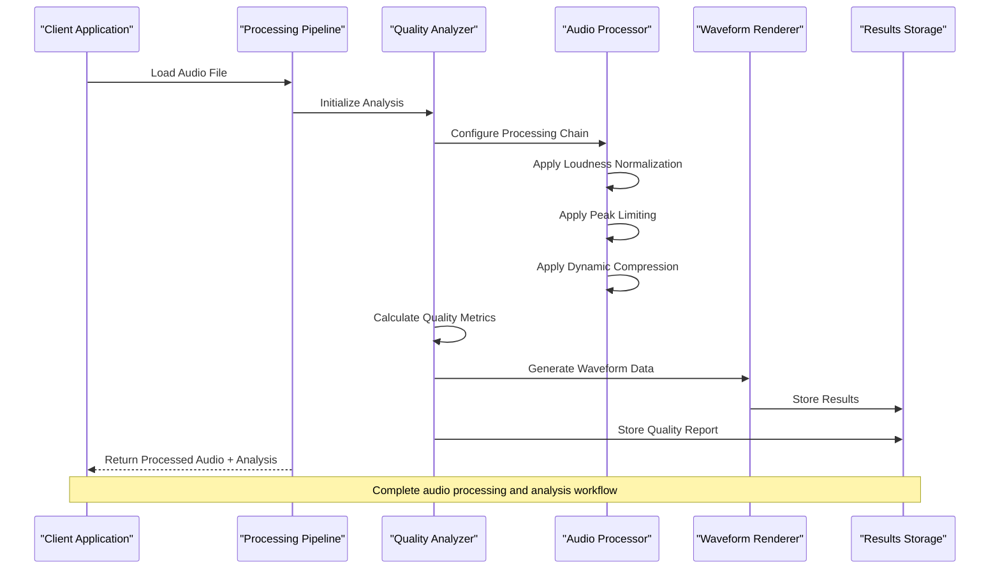
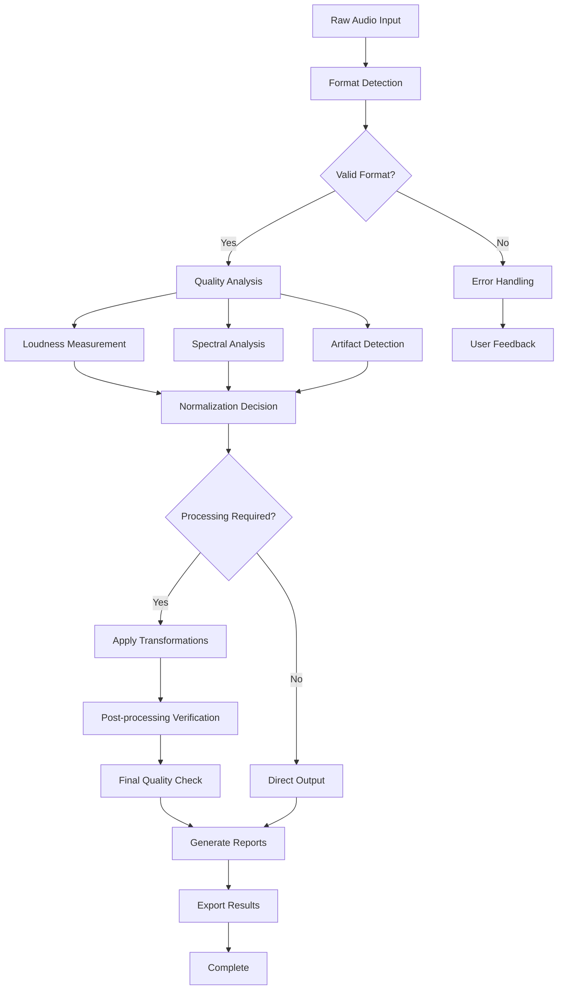
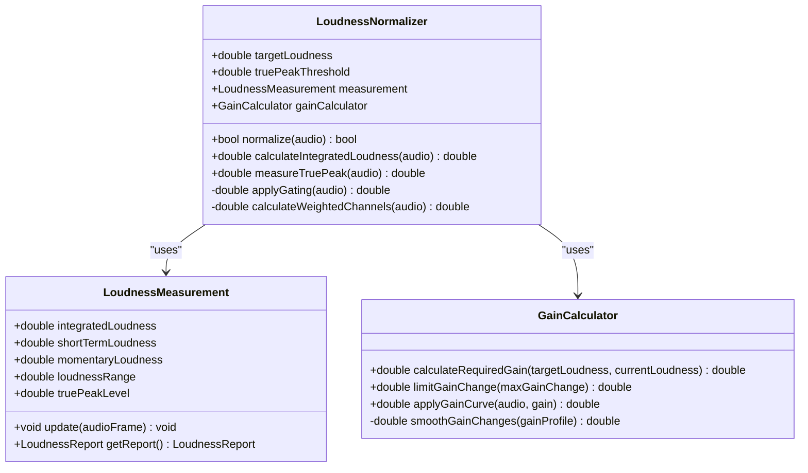
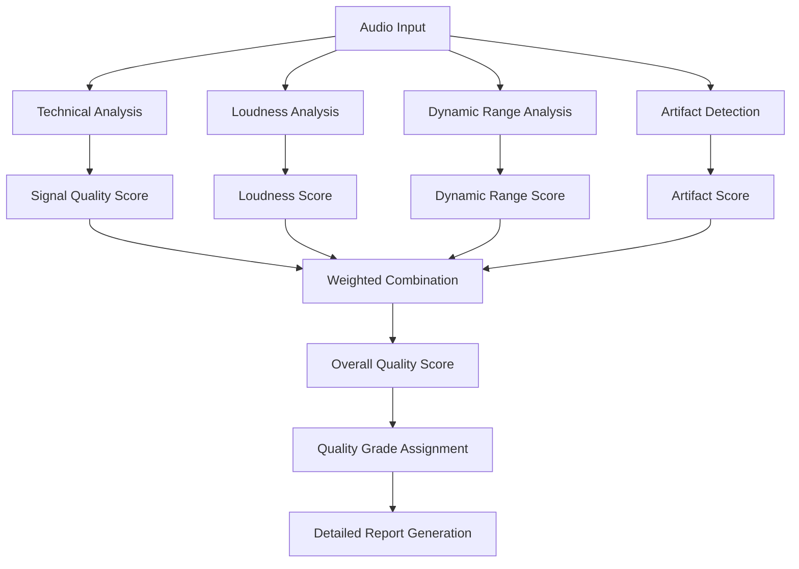
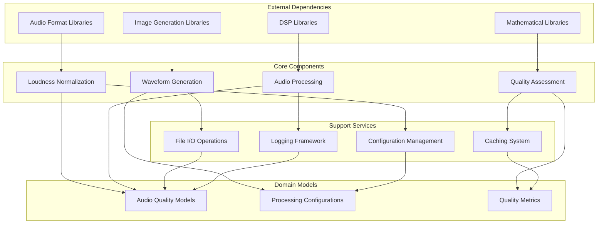

# Quality Optimization & Analysis

<cite>
**Referenced Files in This Document**
- [Trackdub.Media.csproj](file://src/Trackdub.Media/Trackdub.Media.csproj)
- [Loudness Directory](file://src/Trackdub.Media/Loudness/)
- [Waveforms Directory](file://src/Trackdub.Media/Waveforms/)
- [Quality Directory](file://src/Trackdub.Media/Quality/)
- [AudioQuality Domain](file://src/Trackdub.Domain/AudioQuality/)
- [Normalization Directory](file://src/Trackdub.Media/Normalization/)
- [Enhancement Directory](file://src/Trackdub.Media/Enhancement/)
- [Mixing Directory](file://src/Trackdub.Media/Mixing/)
- [Process Directory](file://src/Trackdub.Media/Process/)
</cite>

## Table of Contents
1. [Introduction](#introduction)
2. [Project Structure](#project-structure)
3. [Core Components](#core-components)
4. [Architecture Overview](#architecture-overview)
5. [Detailed Component Analysis](#detailed-component-analysis)
6. [Dependency Analysis](#dependency-analysis)
7. [Performance Considerations](#performance-considerations)
8. [Troubleshooting Guide](#troubleshooting-guide)
9. [Conclusion](#conclusion)

## Introduction

Trackdub's audio quality optimization and analysis system provides comprehensive tools for professional audio processing, including loudness normalization following EBU R128 standards, peak limiting, dynamic range compression, waveform analysis, frequency spectrum visualization, and automated quality assessment. The system is designed to handle large audio files efficiently while maintaining high-quality output through sophisticated algorithms and configurable parameters.

The platform supports batch processing workflows, real-time analysis capabilities, and detailed reporting features essential for professional audio post-production environments. It integrates seamlessly with Trackdub's broader media processing pipeline while providing specialized tools for audio quality optimization.

## Project Structure

The audio quality optimization system is organized within the Trackdub.Media module, which contains specialized components for different aspects of audio processing:

```mermaid
graph TB
subgraph "Trackdub.Media"
subgraph "Loudness"
L1[Loudness Normalization]
L2[EBU R128 Implementation]
L3[True Peak Detection]
end
subgraph "Waveforms"
W1[Waveform Generation]
W2[Visualization Tools]
W3[Summary Generation]
end
subgraph "Quality"
Q1[Quality Assessment]
Q2[Metric Calculation]
Q3[Artifact Detection]
end
subgraph "Normalization"
N1[Gain Normalization]
N2[Peak Limiting]
N3[Dynamic Range Control]
end
subgraph "Enhancement"
E1[Audio Enhancement]
E2[Noise Reduction]
E3[Clarity Improvement]
end
subgraph "Processing Pipeline"
P1[Audio Processing]
P2[Batch Operations]
P3[Real-time Analysis]
end
end
subgraph "Domain Layer"
D1[AudioQuality Models]
D2[Quality Metrics]
D3[Processing Configurations]
end
L1 --> D1
W1 --> D2
Q1 --> D3
N1 --> D1
E1 --> D2
P1 --> D3
```

**Diagram sources**
- [Trackdub.Media.csproj](file://src/Trackdub.Media/Trackdub.Media.csproj)
- [Loudness Directory](file://src/Trackdub.Media/Loudness/)
- [Waveforms Directory](file://src/Trackdub.Media/Waveforms/)
- [Quality Directory](file://src/Trackdub.Media/Quality/)

**Section sources**
- [Trackdub.Media.csproj](file://src/Trackdub.Media/Trackdub.Media.csproj)

## Core Components

### Loudness Normalization System

The loudness normalization system implements EBU R128 standards for consistent audio levels across different content types. It provides integrated loudness measurement, true peak detection, and gain adjustment capabilities.

#### Key Features:
- **EBU R128 Compliance**: Full implementation of European Broadcasting Union standards
- **Integrated Loudness Measurement**: LUFS (Loudness Units relative to Full Scale) calculation
- **True Peak Detection**: Accurate peak level measurement without oversampling artifacts
- **Multi-channel Support**: Handles stereo, surround, and immersive audio formats
- **Segment-based Analysis**: Analyzes audio segments for consistent loudness

#### Configuration Options:
- Target loudness levels (-23 LUFS standard, customizable)
- Integration time windows (short, medium, long)
- True peak threshold settings
- Channel weighting and masking parameters

### Waveform Analysis and Visualization

The waveform system generates visual representations of audio data for analysis and user interface display. It supports multiple resolution levels and optimized rendering for large files.

#### Capabilities:
- **Multi-resolution Waveforms**: Generate waveforms at different detail levels
- **Peak Detection**: Identify maximum amplitude points
- **RMS Analysis**: Calculate root mean square values for energy representation
- **Color-coded Visualization**: Visual indicators for clipping and distortion
- **Interactive Zoom**: Support for detailed inspection of waveform sections

### Quality Assessment Engine

Automated quality assessment evaluates audio files against industry standards and custom criteria. It provides comprehensive scoring and detailed diagnostic information.

#### Assessment Features:
- **Objective Metrics**: Signal-to-noise ratio, total harmonic distortion, frequency response analysis
- **Subjective Indicators**: Perceived loudness consistency, dynamic range preservation
- **Artifact Detection**: Clipping, distortion, noise floor analysis
- **Compliance Checking**: Industry standard validation (EBU R128, ITU BS.1770)
- **Batch Processing**: Automated quality checks for large audio libraries

**Section sources**
- [Loudness Directory](file://src/Trackdub.Media/Loudness/)
- [Waveforms Directory](file://src/Trackdub.Media/Waveforms/)
- [Quality Directory](file://src/Trackdub.Media/Quality/)

## Architecture Overview

The audio quality optimization system follows a modular architecture with clear separation of concerns:

**Diagram sources**
- [Process Directory](file://src/Trackdub.Media/Process/)
- [Quality Directory](file://src/Trackdub.Media/Quality/)
- [Waveforms Directory](file://src/Trackdub.Media/Waveforms/)

### Processing Pipeline Architecture

The system uses a chain-of-responsibility pattern where audio data flows through multiple processing stages:

1. **Input Validation**: Format detection and compatibility checking
2. **Analysis Phase**: Non-destructive quality assessment and metadata extraction
3. **Processing Phase**: Applied transformations (normalization, compression, limiting)
4. **Verification Phase**: Post-processing quality validation
5. **Output Generation**: Final audio export and report generation

### Data Flow Patterns

**Diagram sources**
- [Process Directory](file://src/Trackdub.Media/Process/)
- [Enhancement Directory](file://src/Trackdub.Media/Enhancement/)

## Detailed Component Analysis

### Loudness Normalization Implementation

The loudness normalization component implements EBU R128 standards with advanced features for professional audio processing:

#### Core Algorithms:
- **Gating Algorithm**: Implements absolute and relative gating for accurate loudness measurement
- **Integration Windows**: Short (400ms), Medium (3s), and Long (10s) integration times
- **Channel Weighting**: Proper handling of multi-channel audio with appropriate weighting factors
- **Masking Effects**: Accounts for psychoacoustic masking in loudness calculations

#### Configuration Parameters:
- Target loudness level (default -23 LUFS for broadcast, customizable)
- Gain change limits (prevent excessive amplification)
- True peak threshold (typically -1 dBTP)
- Measurement window selection

**Diagram sources**
- [Loudness Directory](file://src/Trackdub.Media/Loudness/)

### Waveform Generation System

The waveform generation system creates optimized visual representations of audio data for both UI display and analysis purposes:

#### Generation Methods:
- **Downsampling Algorithms**: Efficient reduction of sample data for visualization
- **Peak Detection**: Accurate identification of maximum amplitude in each segment
- **RMS Calculation**: Root mean square values for energy-based visualization
- **Multi-resolution Support**: Different detail levels for various zoom states

#### Rendering Optimization:
- **Lazy Loading**: Generate waveforms on-demand for large files
- **Caching System**: Store generated waveforms to avoid recalculation
- **Progressive Rendering**: Update visualization as data becomes available
- **Memory Management**: Efficient handling of large audio datasets

### Quality Assessment Framework

The quality assessment system provides comprehensive evaluation of audio files against multiple criteria:

#### Assessment Categories:
- **Technical Quality**: Signal integrity, noise levels, frequency response
- **Loudness Consistency**: Integrated loudness, short-term variations, loudness range
- **Dynamic Range**: Peak-to-RMS ratios, crest factor analysis
- **Artifact Detection**: Clipping, distortion, quantization noise
- **Compliance Checking**: Industry standard adherence verification

#### Scoring Algorithm:

**Diagram sources**
- [Quality Directory](file://src/Trackdub.Media/Quality/)

**Section sources**
- [Loudness Directory](file://src/Trackdub.Media/Loudness/)
- [Waveforms Directory](file://src/Trackdub.Media/Waveforms/)
- [Quality Directory](file://src/Trackdub.Media/Quality/)

## Dependency Analysis

The audio quality optimization system has well-defined dependencies between components:

**Diagram sources**
- [Trackdub.Media.csproj](file://src/Trackdub.Media/Trackdub.Media.csproj)
- [Process Directory](file://src/Trackdub.Media/Process/)

### Component Coupling Analysis

The system maintains low coupling between major components while ensuring strong cohesion within each functional area:

- **Loudness Normalization**: Self-contained with minimal external dependencies
- **Waveform Generation**: Independent rendering logic with configurable output formats
- **Quality Assessment**: Modular scoring system with pluggable metrics
- **Audio Processing**: Pipeline-based architecture allowing flexible composition

### External Dependencies

Key external dependencies include:
- **Audio Format Libraries**: For reading/writing various audio file formats
- **DSP Libraries**: For digital signal processing operations
- **Mathematical Libraries**: For complex calculations in audio analysis
- **Image Generation Libraries**: For waveform visualization and reporting

**Section sources**
- [Trackdub.Media.csproj](file://src/Trackdub.Media/Trackdub.Media.csproj)
- [Process Directory](file://src/Trackdub.Media/Process/)

## Performance Considerations

### Large File Processing Optimization

The system employs several strategies for efficient processing of large audio files:

#### Memory Management:
- **Streaming Processing**: Process audio in chunks rather than loading entire files
- **Lazy Evaluation**: Generate analysis results only when needed
- **Resource Pooling**: Reuse computational resources across processing tasks
- **Garbage Collection Optimization**: Minimize object creation during intensive processing

#### Computational Efficiency:
- **Parallel Processing**: Utilize multi-core processors for independent analysis tasks
- **Algorithm Optimization**: Use efficient mathematical algorithms for heavy computations
- **Caching Strategies**: Cache intermediate results to avoid redundant calculations
- **Early Termination**: Stop processing when sufficient information is available

#### Batch Processing Optimization:
- **Queue Management**: Efficient scheduling of multiple processing tasks
- **Resource Allocation**: Optimal distribution of CPU and memory resources
- **Progress Tracking**: Real-time progress updates for long-running operations
- **Error Recovery**: Graceful handling of failures in batch operations

### Real-time Analysis Considerations

For real-time or near-real-time analysis scenarios:

- **Incremental Processing**: Update analysis as new audio data becomes available
- **Adaptive Resolution**: Adjust analysis precision based on available resources
- **Priority Queuing**: Prioritize critical analysis tasks over non-essential ones
- **Resource Monitoring**: Dynamically adjust processing intensity based on system load

## Troubleshooting Guide

### Common Issues and Solutions

#### Loudness Measurement Problems:
- **Inconsistent Readings**: Verify proper audio format and sample rate
- **Silent Sections**: Check gating thresholds and minimum duration requirements
- **Multi-channel Issues**: Ensure proper channel mapping and weighting

#### Waveform Generation Failures:
- **Memory Errors**: Implement chunked processing for very large files
- **Rendering Artifacts**: Verify downsampling algorithms and peak detection
- **Performance Issues**: Enable caching and lazy loading mechanisms

#### Quality Assessment Inaccuracies:
- **Metric Calculation Errors**: Validate input audio format and quality
- **Scoring Inconsistencies**: Review configuration parameters and thresholds
- **Artifact Detection False Positives**: Adjust sensitivity thresholds and filtering

### Debugging Techniques

#### Logging and Diagnostics:
- **Detailed Logging**: Enable comprehensive logging for processing steps
- **Intermediate Results**: Save intermediate analysis data for debugging
- **Performance Profiling**: Monitor resource usage and identify bottlenecks
- **Validation Checks**: Implement sanity checks for processed audio quality

#### Testing Strategies:
- **Unit Tests**: Comprehensive test coverage for individual components
- **Integration Tests**: Validate complete processing pipelines
- **Regression Tests**: Ensure consistent behavior across updates
- **Performance Benchmarks**: Monitor performance characteristics over time

**Section sources**
- [Process Directory](file://src/Trackdub.Media/Process/)
- [Quality Directory](file://src/Trackdub.Media/Quality/)

## Conclusion

Trackdub's audio quality optimization and analysis system provides a comprehensive solution for professional audio processing needs. The system successfully implements EBU R128 standards, offers sophisticated waveform analysis capabilities, and delivers automated quality assessment with detailed reporting.

Key strengths of the system include:

- **Standards Compliance**: Full EBU R128 implementation ensures broadcast-ready audio
- **Performance Optimization**: Efficient handling of large audio files through streaming and caching
- **Extensible Architecture**: Modular design allows easy addition of new analysis methods
- **Professional Features**: Advanced tools suitable for broadcast and post-production environments

The system's modular architecture and comprehensive feature set make it suitable for various audio processing scenarios, from simple loudness normalization to complex quality assessment workflows. Future enhancements could include additional analysis metrics, improved real-time processing capabilities, and expanded format support.

The combination of technical accuracy, performance optimization, and user-friendly interfaces positions Trackdub as a robust solution for audio quality optimization and analysis in professional environments.