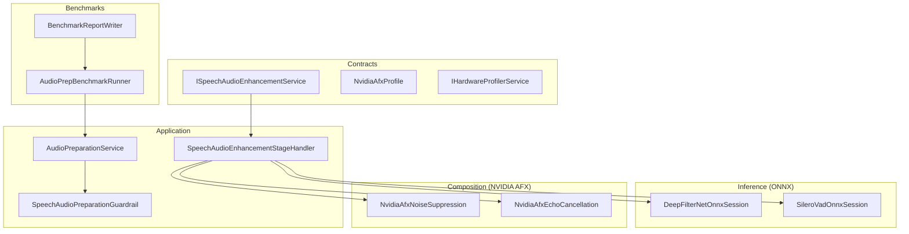
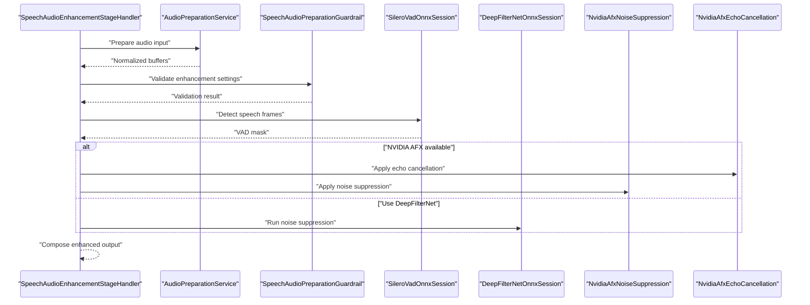
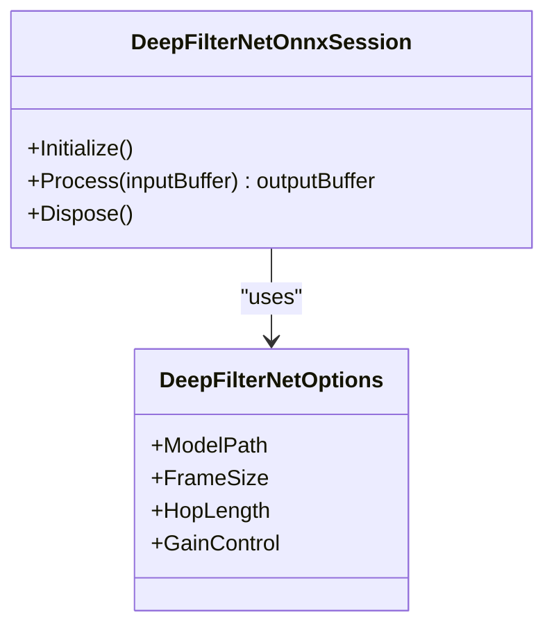
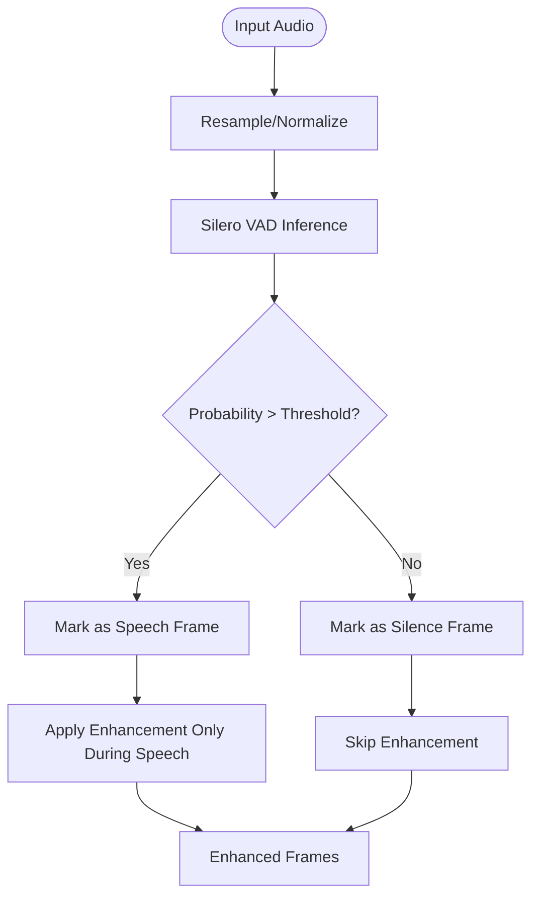
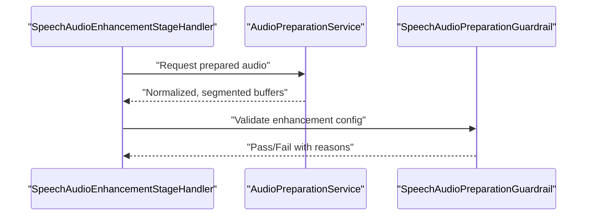
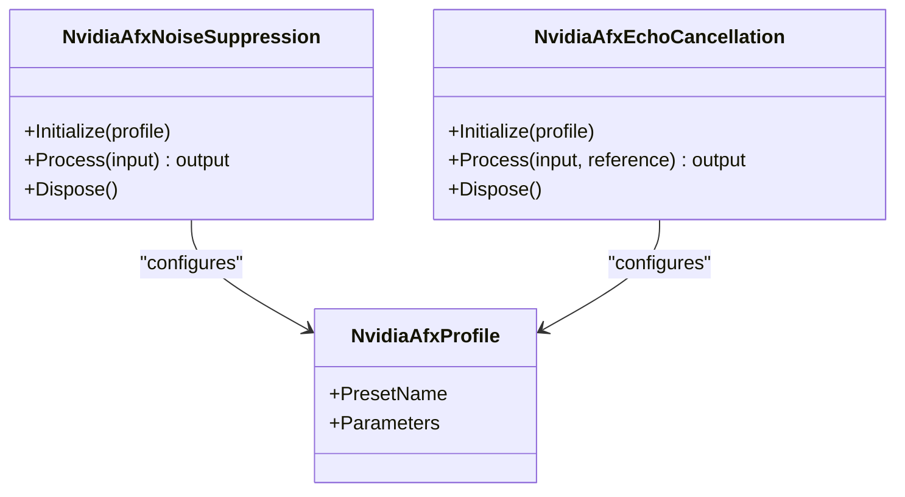
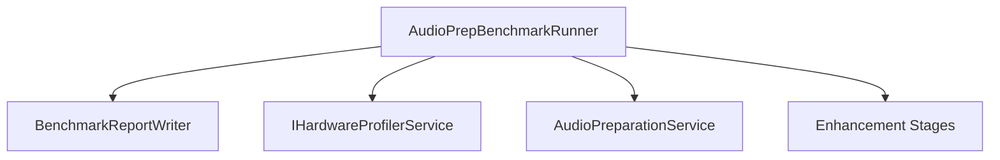
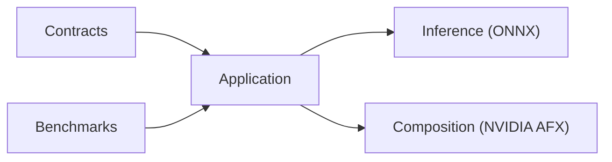

# Speech Enhancement Algorithms

<cite>
**Referenced Files in This Document**
- [ISpeechAudioEnhancementService.cs](file://src/Trackdub.Contracts/ISpeechAudioEnhancementService.cs)
- [SpeechAudioEnhancementStageHandler.cs](file://src/Trackdub.Application/Pipeline/Stages/SpeechAudioEnhancementStageHandler.cs)
- [DeepFilterNetOnnxSession.cs](file://src/Trackdub.Inference.Onnx/DeepFilterNet/DeepFilterNetOnnxSession.cs)
- [DeepFilterNetOptions.cs](file://src/Trackdub.Inference.Onnx/DeepFilterNet/DeepFilterNetOptions.cs)
- [SileroVadOnnxSession.cs](file://src/Trackdub.Inference.Onnx/SileroVad/SileroVadOnnxSession.cs)
- [SileroVadOptions.cs](file://src/Trackdub.Inference.Onnx/SileroVad/SileroVadOptions.cs)
- [AudioPreparationService.cs](file://src/Trackdub.Application/Services/AudioPreparationService.cs)
- [SpeechAudioPreparationGuardrail.cs](file://src/Trackdub.Application/Pipeline/Guardrails/SpeechAudioPreparationGuardrail.cs)
- [NvidiaAfxNoiseSuppression.cs](file://src/Trackdub.Composition/NvidiaAfx/NvidiaAfxNoiseSuppression.cs)
- [NvidiaAfxEchoCancellation.cs](file://src/Trackdub.Composition/NvidiaAfx/NvidiaAfxEchoCancellation.cs)
- [NvidiaAfxProfile.cs](file://src/Trackdub.Contracts/NvidiaAfxProfile.cs)
- [IHardwareProfilerService.cs](file://src/Trackdub.Contracts/IHardwareProfilerService.cs)
- [BenchmarkReportWriter.cs](file://src/Trackdub.Benchmarks/BenchmarkReportWriter.cs)
- [AudioPrepBenchmarkRunner.cs](file://src/Trackdub.Benchmarks/AudioPrepBenchmarkRunner.cs)
- [TROUBLESHOOTING.md](file://docs/development/TROUBLESHOOTING.md)
</cite>

## Table of Contents
1. [Introduction](#introduction)
2. [Project Structure](#project-structure)
3. [Core Components](#core-components)
4. [Architecture Overview](#architecture-overview)
5. [Detailed Component Analysis](#detailed-component-analysis)
6. [Dependency Analysis](#dependency-analysis)
7. [Performance Considerations](#performance-considerations)
8. [Troubleshooting Guide](#troubleshooting-guide)
9. [Conclusion](#conclusion)
10. [Appendices](#appendices)

## Introduction
This document explains Trackdub’s speech enhancement algorithms and noise reduction techniques, focusing on real-time noise suppression via DeepFilterNet integration, voice activity detection (VAD) with Silero VAD, audio preparation and segmentation, quality assessment, and optional NVIDIA AFX-based echo cancellation and noise suppression. It also covers configuration options for different enhancement levels, custom noise profiles, thresholds, performance benchmarks, memory usage patterns, and troubleshooting guidance for artifacts and over-processing.

## Project Structure
The speech enhancement pipeline is implemented across several layers:
- Contracts define the enhancement service interface and hardware profiling contracts.
- Application layer orchestrates stages, guardrails, and preparation services.
- Inference layer provides ONNX-based sessions for DeepFilterNet and Silero VAD.
- Composition layer integrates NVIDIA AFX components for echo cancellation and noise suppression.
- Benchmarks provide measurement utilities for latency and throughput.

**Diagram sources**
- [ISpeechAudioEnhancementService.cs](file://src/Trackdub.Contracts/ISpeechAudioEnhancementService.cs)
- [SpeechAudioEnhancementStageHandler.cs](file://src/Trackdub.Application/Pipeline/Stages/SpeechAudioEnhancementStageHandler.cs)
- [DeepFilterNetOnnxSession.cs](file://src/Trackdub.Inference.Onnx/DeepFilterNet/DeepFilterNetOnnxSession.cs)
- [SileroVadOnnxSession.cs](file://src/Trackdub.Inference.Onnx/SileroVad/SileroVadOnnxSession.cs)
- [NvidiaAfxNoiseSuppression.cs](file://src/Trackdub.Composition/NvidiaAfx/NvidiaAfxNoiseSuppression.cs)
- [NvidiaAfxEchoCancellation.cs](file://src/Trackdub.Composition/NvidiaAfx/NvidiaAfxEchoCancellation.cs)
- [AudioPreparationService.cs](file://src/Trackdub.Application/Services/AudioPreparationService.cs)
- [SpeechAudioPreparationGuardrail.cs](file://src/Trackdub.Application/Pipeline/Guardrails/SpeechAudioPreparationGuardrail.cs)
- [AudioPrepBenchmarkRunner.cs](file://src/Trackdub.Benchmarks/AudioPrepBenchmarkRunner.cs)
- [BenchmarkReportWriter.cs](file://src/Trackdub.Benchmarks/BenchmarkReportWriter.cs)

**Section sources**
- [ISpeechAudioEnhancementService.cs](file://src/Trackdub.Contracts/ISpeechAudioEnhancementService.cs)
- [SpeechAudioEnhancementStageHandler.cs](file://src/Trackdub.Application/Pipeline/Stages/SpeechAudioEnhancementStageHandler.cs)
- [DeepFilterNetOnnxSession.cs](file://src/Trackdub.Inference.Onnx/DeepFilterNet/DeepFilterNetOnnxSession.cs)
- [SileroVadOnnxSession.cs](file://src/Trackdub.Inference.Onnx/SileroVad/SileroVadOnnxSession.cs)
- [NvidiaAfxNoiseSuppression.cs](file://src/Trackdub.Composition/NvidiaAfx/NvidiaAfxNoiseSuppression.cs)
- [NvidiaAfxEchoCancellation.cs](file://src/Trackdub.Composition/NvidiaAfx/NvidiaAfxEchoCancellation.cs)
- [AudioPreparationService.cs](file://src/Trackdub.Application/Services/AudioPreparationService.cs)
- [SpeechAudioPreparationGuardrail.cs](file://src/Trackdub.Application/Pipeline/Guardrails/SpeechAudioPreparationGuardrail.cs)
- [AudioPrepBenchmarkRunner.cs](file://src/Trackdub.Benchmarks/AudioPrepBenchmarkRunner.cs)
- [BenchmarkReportWriter.cs](file://src/Trackdub.Benchmarks/BenchmarkReportWriter.cs)

## Core Components
- ISpeechAudioEnhancementService: Defines the contract for speech enhancement operations used by the pipeline.
- SpeechAudioEnhancementStageHandler: Orchestrates enhancement steps within the processing stage, integrating VAD, noise suppression, and optional echo cancellation.
- DeepFilterNetOnnxSession: Provides ONNX runtime integration for DeepFilterNet-based noise suppression.
- SileroVadOnnxSession: Implements VAD using a Silero model to detect speech segments.
- NvidiaAfxNoiseSuppression and NvidiaAfxEchoCancellation: Optional acceleration paths leveraging NVIDIA AFX for real-time noise suppression and echo cancellation.
- AudioPreparationService and SpeechAudioPreparationGuardrail: Prepare audio inputs and enforce constraints before enhancement.

Key responsibilities:
- Real-time or near-real-time noise suppression via DeepFilterNet.
- Voice activity detection to gate enhancement only during speech frames.
- Optional echo cancellation and additional noise suppression through NVIDIA AFX.
- Input validation and guardrails to prevent over-processing.

**Section sources**
- [ISpeechAudioEnhancementService.cs](file://src/Trackdub.Contracts/ISpeechAudioEnhancementService.cs)
- [SpeechAudioEnhancementStageHandler.cs](file://src/Trackdub.Application/Pipeline/Stages/SpeechAudioEnhancementStageHandler.cs)
- [DeepFilterNetOnnxSession.cs](file://src/Trackdub.Inference.Onnx/DeepFilterNet/DeepFilterNetOnnxSession.cs)
- [SileroVadOnnxSession.cs](file://src/Trackdub.Inference.Onnx/SileroVad/SileroVadOnnxSession.cs)
- [NvidiaAfxNoiseSuppression.cs](file://src/Trackdub.Composition/NvidiaAfx/NvidiaAfxNoiseSuppression.cs)
- [NvidiaAfxEchoCancellation.cs](file://src/Trackdub.Composition/NvidiaAfx/NvidiaAfxEchoCancellation.cs)
- [AudioPreparationService.cs](file://src/Trackdub.Application/Services/AudioPreparationService.cs)
- [SpeechAudioPreparationGuardrail.cs](file://src/Trackdub.Application/Pipeline/Guardrails/SpeechAudioPreparationGuardrail.cs)

## Architecture Overview
The enhancement pipeline composes multiple stages and services:
- The stage handler coordinates input preparation, VAD gating, and enhancement passes.
- DeepFilterNet performs spectral-domain noise suppression.
- Silero VAD determines active speech regions to reduce artifacts during silence.
- NVIDIA AFX can be enabled for accelerated noise suppression and echo cancellation when available.
- Guardrails ensure that enhancement parameters stay within safe bounds.

**Diagram sources**
- [SpeechAudioEnhancementStageHandler.cs](file://src/Trackdub.Application/Pipeline/Stages/SpeechAudioEnhancementStageHandler.cs)
- [AudioPreparationService.cs](file://src/Trackdub.Application/Services/AudioPreparationService.cs)
- [SpeechAudioPreparationGuardrail.cs](file://src/Trackdub.Application/Pipeline/Guardrails/SpeechAudioPreparationGuardrail.cs)
- [SileroVadOnnxSession.cs](file://src/Trackdub.Inference.Onnx/SileroVad/SileroVadOnnxSession.cs)
- [DeepFilterNetOnnxSession.cs](file://src/Trackdub.Inference.Onnx/DeepFilterNet/DeepFilterNetOnnxSession.cs)
- [NvidiaAfxNoiseSuppression.cs](file://src/Trackdub.Composition/NvidiaAfx/NvidiaAfxNoiseSuppression.cs)
- [NvidiaAfxEchoCancellation.cs](file://src/Trackdub.Composition/NvidiaAfx/NvidiaAfxEchoCancellation.cs)

## Detailed Component Analysis

### DeepFilterNet Integration (Real-Time Noise Suppression)
DeepFilterNet is integrated via an ONNX session to perform frame-wise noise suppression. Key aspects:
- Session initialization and model loading are handled within the inference component.
- Options control model selection, buffer sizes, and processing parameters.
- Processing typically involves framing, FFT/ISTFT or equivalent transforms, and per-frame suppression masks.

Configuration highlights:
- Model path and execution provider selection.
- Frame size and hop length aligned with the model’s expectations.
- Gain shaping and post-processing to avoid artifacts.

**Diagram sources**
- [DeepFilterNetOnnxSession.cs](file://src/Trackdub.Inference.Onnx/DeepFilterNet/DeepFilterNetOnnxSession.cs)
- [DeepFilterNetOptions.cs](file://src/Trackdub.Inference.Onnx/DeepFilterNet/DeepFilterNetOptions.cs)

**Section sources**
- [DeepFilterNetOnnxSession.cs](file://src/Trackdub.Inference.Onnx/DeepFilterNet/DeepFilterNetOnnxSession.cs)
- [DeepFilterNetOptions.cs](file://src/Trackdub.Inference.Onnx/DeepFilterNet/DeepFilterNetOptions.cs)

### Voice Activity Detection (Silero VAD)
Silero VAD identifies speech vs. non-speech frames to gate enhancement and reduce artifacts during silence.
- ONNX session manages model inference for VAD probabilities.
- Thresholds determine speech presence; smoothing can be applied to avoid chattering.
- VAD masks are used to selectively apply enhancement only during speech segments.

**Diagram sources**
- [SileroVadOnnxSession.cs](file://src/Trackdub.Inference.Onnx/SileroVad/SileroVadOnnxSession.cs)
- [SileroVadOptions.cs](file://src/Trackdub.Inference.Onnx/SileroVad/SileroVadOptions.cs)

**Section sources**
- [SileroVadOnnxSession.cs](file://src/Trackdub.Inference.Onnx/SileroVad/SileroVadOnnxSession.cs)
- [SileroVadOptions.cs](file://src/Trackdub.Inference.Onnx/SileroVad/SileroVadOptions.cs)

### Audio Preparation and Segmentation
Audio preparation ensures consistent input format and quality before enhancement:
- Resampling to target sample rate.
- Normalization and clipping prevention.
- Segmentation into frames suitable for VAD and enhancement models.

Guardrails validate enhancement parameters to prevent over-processing:
- Bounds checking for gains and thresholds.
- Minimum/maximum frame durations.
- Compatibility checks for input formats.

**Diagram sources**
- [AudioPreparationService.cs](file://src/Trackdub.Application/Services/AudioPreparationService.cs)
- [SpeechAudioPreparationGuardrail.cs](file://src/Trackdub.Application/Pipeline/Guardrails/SpeechAudioPreparationGuardrail.cs)

**Section sources**
- [AudioPreparationService.cs](file://src/Trackdub.Application/Services/AudioPreparationService.cs)
- [SpeechAudioPreparationGuardrail.cs](file://src/Trackdub.Application/Pipeline/Guardrails/SpeechAudioPreparationGuardrail.cs)

### NVIDIA AFX Noise Suppression and Echo Cancellation
When NVIDIA AFX is available, the pipeline can leverage accelerated components:
- NvidiaAfxNoiseSuppression: Real-time noise suppression optimized for GPU/CPU backends.
- NvidiaAfxEchoCancellation: Acoustic echo cancellation for live capture scenarios.
- Profile management via NvidiaAfxProfile to select presets and tune parameters.

**Diagram sources**
- [NvidiaAfxNoiseSuppression.cs](file://src/Trackdub.Composition/NvidiaAfx/NvidiaAfxNoiseSuppression.cs)
- [NvidiaAfxEchoCancellation.cs](file://src/Trackdub.Composition/NvidiaAfx/NvidiaAfxEchoCancellation.cs)
- [NvidiaAfxProfile.cs](file://src/Trackdub.Contracts/NvidiaAfxProfile.cs)

**Section sources**
- [NvidiaAfxNoiseSuppression.cs](file://src/Trackdub.Composition/NvidiaAfx/NvidiaAfxNoiseSuppression.cs)
- [NvidiaAfxEchoCancellation.cs](file://src/Trackdub.Composition/NvidiaAfx/NvidiaAfxEchoCancellation.cs)
- [NvidiaAfxProfile.cs](file://src/Trackdub.Contracts/NvidiaAfxProfile.cs)

### Quality Assessment and Metrics
Quality assessment is supported through benchmarking and metrics collection:
- Benchmark runners measure latency, throughput, and resource usage.
- Report writers aggregate results for analysis and regression tracking.
- Hardware profiling helps identify bottlenecks and device-specific behavior.

**Diagram sources**
- [AudioPrepBenchmarkRunner.cs](file://src/Trackdub.Benchmarks/AudioPrepBenchmarkRunner.cs)
- [BenchmarkReportWriter.cs](file://src/Trackdub.Benchmarks/BenchmarkReportWriter.cs)
- [IHardwareProfilerService.cs](file://src/Trackdub.Contracts/IHardwareProfilerService.cs)
- [AudioPreparationService.cs](file://src/Trackdub.Application/Services/AudioPreparationService.cs)

**Section sources**
- [AudioPrepBenchmarkRunner.cs](file://src/Trackdub.Benchmarks/AudioPrepBenchmarkRunner.cs)
- [BenchmarkReportWriter.cs](file://src/Trackdub.Benchmarks/BenchmarkReportWriter.cs)
- [IHardwareProfilerService.cs](file://src/Trackdub.Contracts/IHardwareProfilerService.cs)

## Dependency Analysis
The enhancement system exhibits clear separation of concerns:
- Contracts isolate interfaces from implementations.
- Application layer orchestrates services without exposing low-level details.
- Inference components encapsulate ONNX runtime specifics.
- Composition layer wires external accelerators conditionally.

**Diagram sources**
- [ISpeechAudioEnhancementService.cs](file://src/Trackdub.Contracts/ISpeechAudioEnhancementService.cs)
- [SpeechAudioEnhancementStageHandler.cs](file://src/Trackdub.Application/Pipeline/Stages/SpeechAudioEnhancementStageHandler.cs)
- [DeepFilterNetOnnxSession.cs](file://src/Trackdub.Inference.Onnx/DeepFilterNet/DeepFilterNetOnnxSession.cs)
- [SileroVadOnnxSession.cs](file://src/Trackdub.Inference.Onnx/SileroVad/SileroVadOnnxSession.cs)
- [NvidiaAfxNoiseSuppression.cs](file://src/Trackdub.Composition/NvidiaAfx/NvidiaAfxNoiseSuppression.cs)
- [NvidiaAfxEchoCancellation.cs](file://src/Trackdub.Composition/NvidiaAfx/NvidiaAfxEchoCancellation.cs)
- [AudioPrepBenchmarkRunner.cs](file://src/Trackdub.Benchmarks/AudioPrepBenchmarkRunner.cs)

**Section sources**
- [ISpeechAudioEnhancementService.cs](file://src/Trackdub.Contracts/ISpeechAudioEnhancementService.cs)
- [SpeechAudioEnhancementStageHandler.cs](file://src/Trackdub.Application/Pipeline/Stages/SpeechAudioEnhancementStageHandler.cs)
- [DeepFilterNetOnnxSession.cs](file://src/Trackdub.Inference.Onnx/DeepFilterNet/DeepFilterNetOnnxSession.cs)
- [SileroVadOnnxSession.cs](file://src/Trackdub.Inference.Onnx/SileroVad/SileroVadOnnxSession.cs)
- [NvidiaAfxNoiseSuppression.cs](file://src/Trackdub.Composition/NvidiaAfx/NvidiaAfxNoiseSuppression.cs)
- [NvidiaAfxEchoCancellation.cs](file://src/Trackdub.Composition/NvidiaAfx/NvidiaAfxEchoCancellation.cs)
- [AudioPrepBenchmarkRunner.cs](file://src/Trackdub.Benchmarks/AudioPrepBenchmarkRunner.cs)

## Performance Considerations
- Real-time capability depends on frame size, hop length, and model complexity. Smaller frames reduce latency but increase overhead.
- ONNX execution provider selection (CPU, CUDA, TensorRT) impacts throughput and memory footprint.
- VAD gating reduces unnecessary processing during silence, improving efficiency.
- NVIDIA AFX components can offer lower latency and higher throughput on compatible hardware.
- Memory usage is dominated by model weights and intermediate buffers; reuse buffers where possible.
- Benchmarking should include warm-up runs and measure p95/p99 latencies for stability.

[No sources needed since this section provides general guidance]

## Troubleshooting Guide
Common issues and resolutions:
- Enhancement artifacts: Reduce gain or adjust VAD threshold; ensure proper framing and overlap-add.
- Over-processing: Tighten guardrail bounds; disable aggressive suppression if speech sounds unnatural.
- Compatibility with audio sources: Verify sample rate and channel layout; normalize inputs consistently.
- Latency spikes: Check execution provider availability; prefer GPU-accelerated providers when possible.
- Echo not removed: Ensure reference signal is available and properly aligned; verify AFX echo cancellation is enabled.

For detailed diagnostics and known pitfalls, consult the development troubleshooting guide.

**Section sources**
- [TROUBLESHOOTING.md](file://docs/development/TROUBLESHOOTING.md)

## Conclusion
Trackdub’s speech enhancement pipeline combines robust ONNX-based models (DeepFilterNet, Silero VAD) with optional NVIDIA AFX acceleration to deliver real-time noise suppression, echo cancellation, and high-quality speech processing. Proper configuration, guardrails, and benchmarking ensure reliable performance across diverse audio sources and environments.

[No sources needed since this section summarizes without analyzing specific files]

## Appendices

### Configuration Options Summary
- DeepFilterNet: Model path, frame size, hop length, gain control.
- Silero VAD: Probability threshold, smoothing parameters.
- NVIDIA AFX: Preset name, parameter overrides, profile selection.
- Enhancement levels: Combine VAD gating, suppression strength, and echo cancellation based on use case.

[No sources needed since this section provides general guidance]