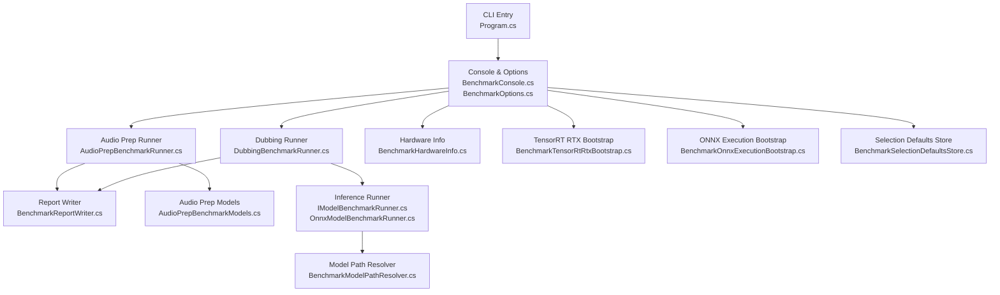
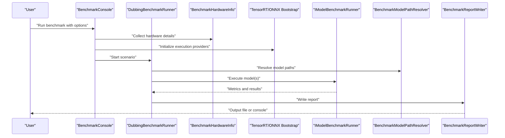
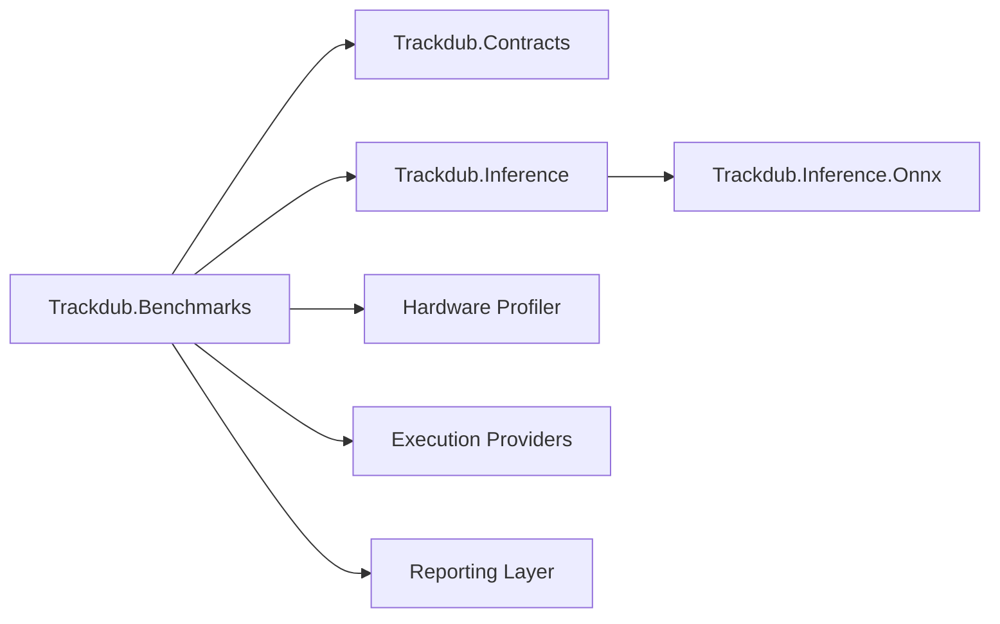

# Benchmarking Commands

<cite>
**Referenced Files in This Document**
- [Program.cs](file://src/Trackdub.Benchmarks/Program.cs)
- [README.md](file://src/Trackdub.Benchmarks/README.md)
- [BenchmarkConsole.cs](file://src/Trackdub.Benchmarks/BenchmarkConsole.cs)
- [BenchmarkOptions.cs](file://src/Trackdub.Benchmarks/BenchmarkOptions.cs)
- [AudioPrepBenchmarkRunner.cs](file://src/Trackdub.Benchmarks/AudioPrepBenchmarkRunner.cs)
- [DubbingBenchmarkRunner.cs](file://src/Trackdub.Benchmarks/DubbingBenchmarkRunner.cs)
- [BenchmarkReportWriter.cs](file://src/Trackdub.Benchmarks/BenchmarkReportWriter.cs)
- [BenchmarkHardwareInfo.cs](file://src/Trackdub.Benchmarks/BenchmarkHardwareInfo.cs)
- [BenchmarkTensorRtRtxBootstrap.cs](file://src/Trackdub.Benchmarks/BenchmarkTensorRtRtxBootstrap.cs)
- [BenchmarkOnnxExecutionBootstrap.cs](file://src/Trackdub.Benchmarks/BenchmarkOnnxExecutionBootstrap.cs)
- [BenchmarkSelectionDefaultsStore.cs](file://src/Trackdub.Benchmarks/BenchmarkSelectionDefaultsStore.cs)
- [AudioPrepBenchmarkModels.cs](file://src/Trackdub.Benchmarks/AudioPrepBenchmarkModels.cs)
- [AudioPrepBenchmarkOptions.cs](file://src/Trackdub.Benchmarks/AudioPrepBenchmarkOptions.cs)
- [DubbingBatchOptions.cs](file://src/Trackdub.Benchmarks/DubbingBatchOptions.cs)
- [DubbingBenchmarkOptions.cs](file://src/Trackdub.Benchmarks/DubbingBenchmarkOptions.cs)
- [BenchmarkBatchReport.cs](file://src/Trackdub.Benchmarks/BenchmarkBatchReport.cs)
- [DubbingBenchmarkReport.cs](file://src/Trackdub.Benchmarks/DubbingBenchmarkReport.cs)
- [IModelBenchmarkRunner.cs](file://src/Trackdub.Inference/IModelBenchmarkRunner.cs)
- [OnnxModelBenchmarkRunner.cs](file://src/Trackdub.Inference.Onnx/OnnxModelBenchmarkRunner.cs)
- [BenchmarkModelPathResolver.cs](file://src/Trackdub.Inference.Onnx/BenchmarkModelPathResolver.cs)
- [Trackdub.Contracts.csproj](file://src/Trackdub.Contracts/Trackdub.Contracts.csproj)
- [Trackdub.Benchmarks.csproj](file://src/Trackdub.Benchmarks/Trackdub.Benchmarks.csproj)
- [GITHUB_ACTIONS.md](file://docs/operations/GITHUB_ACTIONS.md)
</cite>

## Table of Contents
1. [Introduction](#introduction)
2. [Project Structure](#project-structure)
3. [Core Components](#core-components)
4. [Architecture Overview](#architecture-overview)
5. [Detailed Component Analysis](#detailed-component-analysis)
6. [Dependency Analysis](#dependency-analysis)
7. [Performance Considerations](#performance-considerations)
8. [Troubleshooting Guide](#troubleshooting-guide)
9. [Conclusion](#conclusion)
10. [Appendices](#appendices)

## Introduction
This document explains Trackdub’s benchmarking commands and how to use them for performance testing across ASR accuracy, TTS quality, hardware utilization, and pipeline throughput. It covers configuration options, test scenarios, result interpretation, examples for running hardware benchmarks, comparing model performance, generating reports, and setting up continuous integration for automated performance testing and regression detection.

## Project Structure
The benchmarking subsystem is implemented as a standalone .NET console application under the Benchmarks project. It provides:
- A CLI entry point and command parsing
- Runners for audio preparation and full dubbing pipelines
- Hardware profiling and execution provider bootstrapping
- Report generation and batch orchestration
- Integration with inference runners and ONNX model resolution

**Diagram sources**
- [Program.cs](file://src/Trackdub.Benchmarks/Program.cs)
- [BenchmarkConsole.cs](file://src/Trackdub.Benchmarks/BenchmarkConsole.cs)
- [BenchmarkOptions.cs](file://src/Trackdub.Benchmarks/BenchmarkOptions.cs)
- [AudioPrepBenchmarkRunner.cs](file://src/Trackdub.Benchmarks/AudioPrepBenchmarkRunner.cs)
- [DubbingBenchmarkRunner.cs](file://src/Trackdub.Benchmarks/DubbingBenchmarkRunner.cs)
- [BenchmarkReportWriter.cs](file://src/Trackdub.Benchmarks/BenchmarkReportWriter.cs)
- [BenchmarkHardwareInfo.cs](file://src/Trackdub.Benchmarks/BenchmarkHardwareInfo.cs)
- [BenchmarkTensorRtRtxBootstrap.cs](file://src/Trackdub.Benchmarks/BenchmarkTensorRtRtxBootstrap.cs)
- [BenchmarkOnnxExecutionBootstrap.cs](file://src/Trackdub.Benchmarks/BenchmarkOnnxExecutionBootstrap.cs)
- [BenchmarkSelectionDefaultsStore.cs](file://src/Trackdub.Benchmarks/BenchmarkSelectionDefaultsStore.cs)
- [AudioPrepBenchmarkModels.cs](file://src/Trackdub.Benchmarks/AudioPrepBenchmarkModels.cs)
- [IModelBenchmarkRunner.cs](file://src/Trackdub.Inference/IModelBenchmarkRunner.cs)
- [OnnxModelBenchmarkRunner.cs](file://src/Trackdub.Inference.Onnx/OnnxModelBenchmarkRunner.cs)
- [BenchmarkModelPathResolver.cs](file://src/Trackdub.Inference.Onnx/BenchmarkModelPathResolver.cs)

**Section sources**
- [Program.cs](file://src/Trackdub.Benchmarks/Program.cs)
- [README.md](file://src/Trackdub.Benchmarks/README.md)

## Core Components
- CLI and Options
  - The console app parses commands and binds options for runs, datasets, providers, and reporting.
  - Key files: Program.cs, BenchmarkConsole.cs, BenchmarkOptions.cs.
- Runners
  - Audio Preparation Runner: measures preprocessing steps (e.g., resampling, VAD, enhancement).
  - Dubbing Runner: executes end-to-end dubbing pipeline stages for throughput and latency.
  - Key files: AudioPrepBenchmarkRunner.cs, DubbingBenchmarkRunner.cs.
- Hardware and Runtime Bootstraps
  - Collects device info and initializes execution providers (TensorRT RTX, ONNX runtime).
  - Key files: BenchmarkHardwareInfo.cs, BenchmarkTensorRtRtxBootstrap.cs, BenchmarkOnnxExecutionBootstrap.cs.
- Reporting and Batch
  - Aggregates metrics and writes structured reports; supports batch runs and default selection strategies.
  - Key files: BenchmarkReportWriter.cs, BenchmarkBatchReport.cs, BenchmarkSelectionDefaultsStore.cs.
- Inference Integration
  - Uses IModelBenchmarkRunner and OnnxModelBenchmarkRunner to execute models and resolve paths.
  - Key files: IModelBenchmarkRunner.cs, OnnxModelBenchmarkRunner.cs, BenchmarkModelPathResolver.cs.

**Section sources**
- [BenchmarkConsole.cs](file://src/Trackdub.Benchmarks/BenchmarkConsole.cs)
- [BenchmarkOptions.cs](file://src/Trackdub.Benchmarks/BenchmarkOptions.cs)
- [AudioPrepBenchmarkRunner.cs](file://src/Trackdub.Benchmarks/AudioPrepBenchmarkRunner.cs)
- [DubbingBenchmarkRunner.cs](file://src/Trackdub.Benchmarks/DubbingBenchmarkRunner.cs)
- [BenchmarkHardwareInfo.cs](file://src/Trackdub.Benchmarks/BenchmarkHardwareInfo.cs)
- [BenchmarkTensorRtRtxBootstrap.cs](file://src/Trackdub.Benchmarks/BenchmarkTensorRtRtxBootstrap.cs)
- [BenchmarkOnnxExecutionBootstrap.cs](file://src/Trackdub.Benchmarks/BenchmarkOnnxExecutionBootstrap.cs)
- [BenchmarkReportWriter.cs](file://src/Trackdub.Benchmarks/BenchmarkReportWriter.cs)
- [BenchmarkBatchReport.cs](file://src/Trackdub.Benchmarks/BenchmarkBatchReport.cs)
- [BenchmarkSelectionDefaultsStore.cs](file://src/Trackdub.Benchmarks/BenchmarkSelectionDefaultsStore.cs)
- [IModelBenchmarkRunner.cs](file://src/Trackdub.Inference/IModelBenchmarkRunner.cs)
- [OnnxModelBenchmarkRunner.cs](file://src/Trackdub.Inference.Onnx/OnnxModelBenchmarkRunner.cs)
- [BenchmarkModelPathResolver.cs](file://src/Trackdub.Inference.Onnx/BenchmarkModelPathResolver.cs)

## Architecture Overview
The benchmarking system follows a layered architecture:
- CLI layer: command parsing and option binding
- Orchestration layer: runner selection and scenario composition
- Execution layer: hardware probing, provider initialization, and model execution
- Reporting layer: metrics aggregation and output formatting

**Diagram sources**
- [BenchmarkConsole.cs](file://src/Trackdub.Benchmarks/BenchmarkConsole.cs)
- [DubbingBenchmarkRunner.cs](file://src/Trackdub.Benchmarks/DubbingBenchmarkRunner.cs)
- [BenchmarkHardwareInfo.cs](file://src/Trackdub.Benchmarks/BenchmarkHardwareInfo.cs)
- [BenchmarkTensorRtRtxBootstrap.cs](file://src/Trackdub.Benchmarks/BenchmarkTensorRtRtxBootstrap.cs)
- [BenchmarkOnnxExecutionBootstrap.cs](file://src/Trackdub.Benchmarks/BenchmarkOnnxExecutionBootstrap.cs)
- [IModelBenchmarkRunner.cs](file://src/Trackdub.Inference/IModelBenchmarkRunner.cs)
- [BenchmarkModelPathResolver.cs](file://src/Trackdub.Inference.Onnx/BenchmarkModelPathResolver.cs)
- [BenchmarkReportWriter.cs](file://src/Trackdub.Benchmarks/BenchmarkReportWriter.cs)

## Detailed Component Analysis

### CLI and Options
- Purpose: Parse commands, bind options, and dispatch to appropriate runners.
- Key behaviors:
  - Accepts flags for dataset paths, model identifiers, execution providers, and output directories.
  - Supports selecting scenarios (audio prep vs. full dubbing).
  - Integrates logging and progress reporting via CLI helpers.
- Relevant files:
  - Program.cs
  - BenchmarkConsole.cs
  - BenchmarkOptions.cs

**Section sources**
- [Program.cs](file://src/Trackdub.Benchmarks/Program.cs)
- [BenchmarkConsole.cs](file://src/Trackdub.Benchmarks/BenchmarkConsole.cs)
- [BenchmarkOptions.cs](file://src/Trackdub.Benchmarks/BenchmarkOptions.cs)

### Audio Preparation Benchmark Runner
- Purpose: Measure preprocessing performance (resampling, VAD, noise suppression, etc.).
- Inputs:
  - Audio dataset paths and configuration options.
  - Optional model presets for specific preprocessing steps.
- Outputs:
  - Latency and throughput metrics per stage.
  - Intermediate artifacts for inspection if enabled.
- Relevant files:
  - AudioPrepBenchmarkRunner.cs
  - AudioPrepBenchmarkOptions.cs
  - AudioPrepBenchmarkModels.cs

**Section sources**
- [AudioPrepBenchmarkRunner.cs](file://src/Trackdub.Benchmarks/AudioPrepBenchmarkRunner.cs)
- [AudioPrepBenchmarkOptions.cs](file://src/Trackdub.Benchmarks/AudioPrepBenchmarkOptions.cs)
- [AudioPrepBenchmarkModels.cs](file://src/Trackdub.Benchmarks/AudioPrepBenchmarkModels.cs)

### Dubbing Benchmark Runner
- Purpose: Execute end-to-end dubbing pipeline stages to measure throughput, latency, and resource usage.
- Inputs:
  - Media assets, transcript data, and dubbing options.
  - Model selections and execution provider preferences.
- Outputs:
  - Stage-level timings, memory usage, and overall pipeline metrics.
  - Reports suitable for CI comparisons.
- Relevant files:
  - DubbingBenchmarkRunner.cs
  - DubbingBenchmarkOptions.cs
  - DubbingBatchOptions.cs
  - DubbingBenchmarkReport.cs

**Section sources**
- [DubbingBenchmarkRunner.cs](file://src/Trackdub.Benchmarks/DubbingBenchmarkRunner.cs)
- [DubbingBenchmarkOptions.cs](file://src/Trackdub.Benchmarks/DubbingBenchmarkOptions.cs)
- [DubbingBatchOptions.cs](file://src/Trackdub.Benchmarks/DubbingBatchOptions.cs)
- [DubbingBenchmarkReport.cs](file://src/Trackdub.Benchmarks/DubbingBenchmarkReport.cs)

### Hardware Profiling and Provider Bootstrapping
- Purpose: Gather hardware capabilities and initialize execution providers for optimal performance.
- Features:
  - Device enumeration and capability detection.
  - TensorRT RTX bootstrap for GPU-accelerated inference where available.
  - ONNX runtime bootstrap for cross-platform execution.
- Relevant files:
  - BenchmarkHardwareInfo.cs
  - BenchmarkTensorRtRtxBootstrap.cs
  - BenchmarkOnnxExecutionBootstrap.cs

**Section sources**
- [BenchmarkHardwareInfo.cs](file://src/Trackdun.Benchmarks/BenchmarkHardwareInfo.cs)
- [BenchmarkTensorRtRtxBootstrap.cs](file://src/Trackdub.Benchmarks/BenchmarkTensorRtRtxBootstrap.cs)
- [BenchmarkOnnxExecutionBootstrap.cs](file://src/Trackdub.Benchmarks/BenchmarkOnnxExecutionBootstrap.cs)

### Reporting and Batch Orchestration
- Purpose: Aggregate metrics into structured reports and support batch runs for multiple configurations.
- Capabilities:
  - JSON or other structured formats for downstream analysis.
  - Default selection strategies for model and provider choices.
  - Batch manifest handling for repeatable runs.
- Relevant files:
  - BenchmarkReportWriter.cs
  - BenchmarkBatchReport.cs
  - BenchmarkSelectionDefaultsStore.cs

**Section sources**
- [BenchmarkReportWriter.cs](file://src/Trackdub.Benchmarks/BenchmarkReportWriter.cs)
- [BenchmarkBatchReport.cs](file://src/Trackdub.Benchmarks/BenchmarkBatchReport.cs)
- [BenchmarkSelectionDefaultsStore.cs](file://src/Trackdub.Benchmarks/BenchmarkSelectionDefaultsStore.cs)

### Inference Integration
- Purpose: Execute models using standardized interfaces and resolve model paths consistently.
- Interfaces:
  - IModelBenchmarkRunner defines the contract for benchmark execution.
  - OnnxModelBenchmarkRunner implements ONNX-specific execution logic.
  - BenchmarkModelPathResolver ensures correct model discovery and caching.
- Relevant files:
  - IModelBenchmarkRunner.cs
  - OnnxModelBenchmarkRunner.cs
  - BenchmarkModelPathResolver.cs

**Section sources**
- [IModelBenchmarkRunner.cs](file://src/Trackdub.Inference/IModelBenchmarkRunner.cs)
- [OnnxModelBenchmarkRunner.cs](file://src/Trackdub.Inference.Onnx/OnnxModelBenchmarkRunner.cs)
- [BenchmarkModelPathResolver.cs](file://src/Trackdub.Inference.Onnx/BenchmarkModelPathResolver.cs)

## Dependency Analysis
The benchmarking components depend on contracts and inference layers to ensure consistent behavior across environments.

**Diagram sources**
- [Trackdub.Benchmarks.csproj](file://src/Trackdub.Benchmarks/Trackdub.Benchmarks.csproj)
- [Trackdub.Contracts.csproj](file://src/Trackdub.Contracts/Trackdub.Contracts.csproj)

**Section sources**
- [Trackdub.Benchmarks.csproj](file://src/Trackdub.Benchmarks/Trackdub.Benchmarks.csproj)
- [Trackdub.Contracts.csproj](file://src/Trackdub.Contracts/Trackdub.Contracts.csproj)

## Performance Considerations
- Execution Provider Selection
  - Prefer GPU-backed providers (TensorRT RTX) when available for significant speedups.
  - Fall back to CPU-based ONNX runtime on systems without compatible GPUs.
- Model Resolution and Caching
  - Use centralized model path resolution to avoid redundant downloads and improve repeatability.
- Dataset Sizing and Warm-up
  - Include warm-up runs to stabilize JIT and provider initialization overhead.
  - Scale dataset size to reflect production workloads for meaningful throughput measurements.
- Resource Monitoring
  - Capture CPU, GPU, and memory usage during runs to identify bottlenecks.
- Concurrency and Parallelism
  - Tune parallelism settings based on hardware capabilities to maximize throughput without saturation.

[No sources needed since this section provides general guidance]

## Troubleshooting Guide
Common issues and resolutions:
- Execution Provider Initialization Failures
  - Ensure required dependencies are installed and compatible with the OS and GPU drivers.
  - Verify provider-specific environment variables and manifests.
- Model Path Resolution Errors
  - Confirm model IDs or paths match expected locations and naming conventions.
  - Check network access for remote model retrieval if applicable.
- Report Generation Problems
  - Validate output directory permissions and disk space.
  - Inspect intermediate logs for errors during metric collection.
- Regression Detection in CI
  - Compare current run metrics against baseline thresholds.
  - Flag failures when latency exceeds acceptable limits or accuracy drops below targets.

**Section sources**
- [BenchmarkTensorRtRtxBootstrap.cs](file://src/Trackdub.Benchmarks/BenchmarkTensorRtRtxBootstrap.cs)
- [BenchmarkOnnxExecutionBootstrap.cs](file://src/Trackdub.Benchmarks/BenchmarkOnnxExecutionBootstrap.cs)
- [BenchmarkModelPathResolver.cs](file://src/Trackdub.Inference.Onnx/BenchmarkModelPathResolver.cs)
- [BenchmarkReportWriter.cs](file://src/Trackdub.Benchmarks/BenchmarkReportWriter.cs)

## Conclusion
Trackdub’s benchmarking commands provide a robust framework for measuring ASR accuracy, TTS quality, hardware utilization, and pipeline throughput. By leveraging configurable scenarios, execution provider bootstrapping, and structured reporting, teams can perform reliable performance tests, compare model variants, and integrate automated regression checks into CI pipelines.

[No sources needed since this section summarizes without analyzing specific files]

## Appendices

### Benchmark Configuration Options
- General Options
  - Dataset paths, model identifiers, execution provider preferences, output directories.
- Scenario-Specific Options
  - Audio preparation parameters (resampling rates, VAD thresholds, enhancement settings).
  - Dubbing pipeline parameters (transcript format, voice cloning settings, mixing options).
- Reporting Options
  - Output formats (JSON, CSV), inclusion of raw artifacts, verbosity levels.

**Section sources**
- [BenchmarkOptions.cs](file://src/Trackdub.Benchmarks/BenchmarkOptions.cs)
- [AudioPrepBenchmarkOptions.cs](file://src/Trackdub.Benchmarks/AudioPrepBenchmarkOptions.cs)
- [DubbingBenchmarkOptions.cs](file://src/Trackdub.Benchmarks/DubbingBenchmarkOptions.cs)

### Test Scenarios
- ASR Accuracy Testing
  - Use reference transcripts and compute WER/CER metrics.
- TTS Quality Evaluation
  - Generate synthetic speech and assess intelligibility and naturalness.
- Hardware Utilization Profiling
  - Monitor CPU/GPU usage, memory consumption, and thermal throttling.
- Pipeline Throughput Measurement
  - End-to-end timing for media processing, transcription, translation, and synthesis.

**Section sources**
- [AudioPrepBenchmarkRunner.cs](file://src/Trackdub.Benchmarks/AudioPrepBenchmarkRunner.cs)
- [DubbingBenchmarkRunner.cs](file://src/Trackdub.Benchmarks/DubbingBenchmarkRunner.cs)

### Result Interpretation
- Metrics to Review
  - Latency percentiles (P50, P95, P99), throughput (items/sec), error rates.
  - Resource utilization peaks and averages.
- Baseline Comparison
  - Establish baselines per platform and model variant.
  - Track regressions over time using CI dashboards.
- Actionable Insights
  - Identify slow stages and optimize accordingly.
  - Adjust provider settings or model quantization for better performance.

**Section sources**
- [BenchmarkReportWriter.cs](file://src/Trackdub.Benchmarks/BenchmarkReportWriter.cs)
- [BenchmarkBatchReport.cs](file://src/Trackdub.Benchmarks/BenchmarkBatchReport.cs)

### Examples
- Running Hardware Benchmarks
  - Execute hardware profiling to collect device capabilities and performance characteristics.
- Comparing Model Performance
  - Run identical scenarios across different models and compare metrics.
- Generating Performance Reports
  - Produce structured reports for analysis and sharing with stakeholders.

**Section sources**
- [BenchmarkHardwareInfo.cs](file://src/Trackdub.Benchmarks/BenchmarkHardwareInfo.cs)
- [BenchmarkReportWriter.cs](file://src/Trackdub.Benchmarks/BenchmarkReportWriter.cs)

### Continuous Integration Setup
- Automated Performance Testing
  - Configure GitHub Actions to run benchmarks on pull requests and merges.
- Regression Detection
  - Define thresholds for key metrics and fail builds when exceeded.
- Artifact Storage
  - Upload benchmark reports and logs for historical analysis.

**Section sources**
- [GITHUB_ACTIONS.md](file://docs/operations/GITHUB_ACTIONS.md)