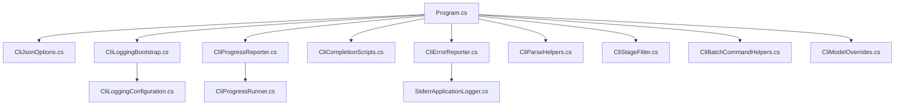
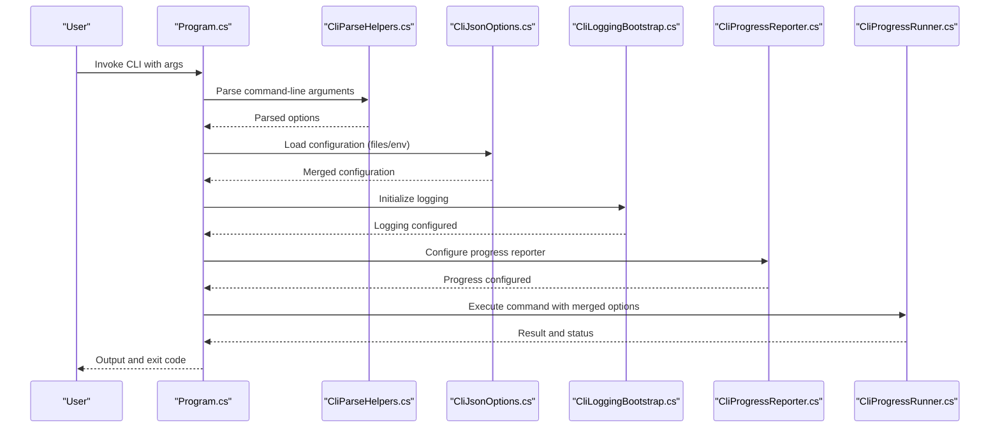
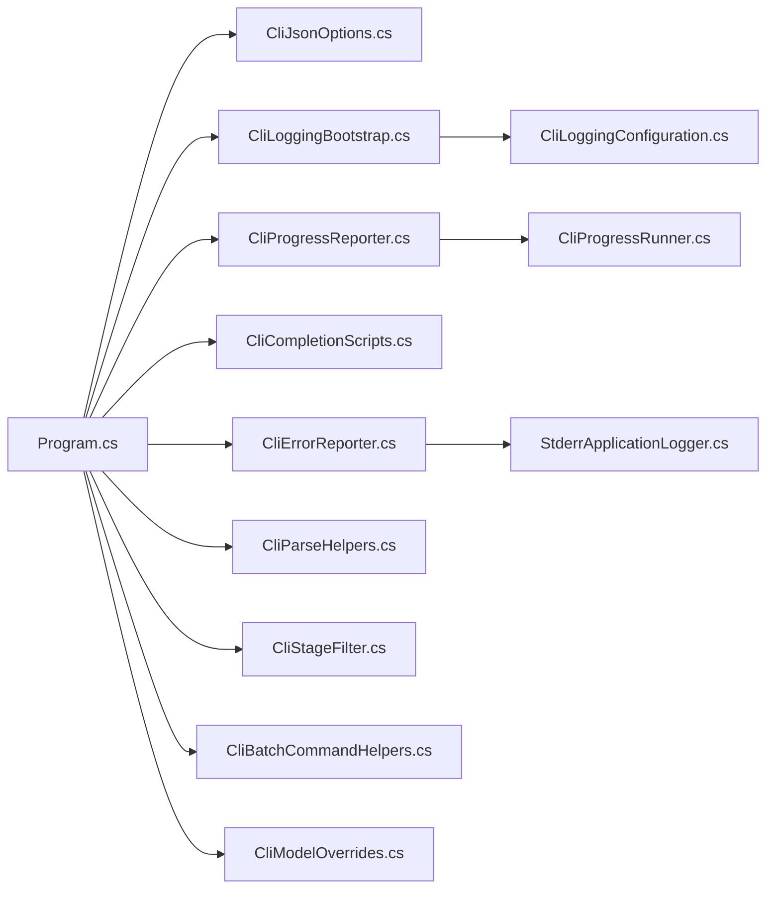

# CLI Configuration & Options

<cite>
**Referenced Files in This Document**
- [Program.cs](file://src/Trackdub.Cli/Program.cs)
- [CliJsonOptions.cs](file://src/Trackdub.Cli/CliJsonOptions.cs)
- [CliLoggingBootstrap.cs](file://src/Trackdub.Cli/CliLoggingBootstrap.cs)
- [CliLoggingConfiguration.cs](file://src/Trackdub.Cli/CliLoggingConfiguration.cs)
- [CliProgressReporter.cs](file://src/Trackdub.Cli/CliProgressReporter.cs)
- [CliCompletionScripts.cs](file://src/Trackdub.Cli/CliCompletionScripts.cs)
- [CliErrorReporter.cs](file://src/Trackdub.Cli/CliErrorReporter.cs)
- [CliParseHelpers.cs](file://src/Trackdub.Cli/CliParseHelpers.cs)
- [CliStageFilter.cs](file://src/Trackdub.Cli/CliStageFilter.cs)
- [CliBatchCommandHelpers.cs](file://src/Trackdub.Cli/CliBatchCommandHelpers.cs)
- [CliModelOverrides.cs](file://src/Trackdub.Cli/CliModelOverrides.cs)
- [StderrApplicationLogger.cs](file://src/Trackdub.Cli/StderrApplicationLogger.cs)
- [CliProgressRunner.cs](file://src/Trackdub.Cli/CliProgressRunner.cs)
</cite>

## Table of Contents
1. [Introduction](#introduction)
2. [Project Structure](#project-structure)
3. [Core Components](#core-components)
4. [Architecture Overview](#architecture-overview)
5. [Detailed Component Analysis](#detailed-component-analysis)
6. [Dependency Analysis](#dependency-analysis)
7. [Performance Considerations](#performance-considerations)
8. [Troubleshooting Guide](#troubleshooting-guide)
9. [Conclusion](#conclusion)
10. [Appendices](#appendices)

## Introduction
This document explains how Trackdub’s command-line interface (CLI) is configured and controlled. It covers:
- Command-line argument parsing and global options
- Configuration file formats and precedence
- Environment variable settings
- Logging configuration and output formatting
- Progress reporting options
- Shell completion scripts and aliasing
- Security considerations for sensitive data and credentials
- Examples ranging from simple interactive usage to complex automated setups

The goal is to help both new users and automation engineers configure, operate, and integrate the CLI reliably and securely.

## Project Structure
The CLI entry point and configuration logic live under the Trackdub.Cli project. Key responsibilities are split across focused files:
- Program.cs: application bootstrap and command routing
- CliJsonOptions.cs: JSON-based configuration model and loading
- CliLoggingBootstrap.cs and CliLoggingConfiguration.cs: logging setup and configuration
- CliProgressReporter.cs and CliProgressRunner.cs: progress reporting and execution orchestration
- CliCompletionScripts.cs: shell completion script generation
- CliErrorReporter.cs and StderrApplicationLogger.cs: error and log output handling
- CliParseHelpers.cs, CliStageFilter.cs, CliBatchCommandHelpers.cs, CliModelOverrides.cs: parsing utilities, stage filtering, batch helpers, and model overrides

**Diagram sources**
- [Program.cs](file://src/Trackdub.Cli/Program.cs)
- [CliJsonOptions.cs](file://src/Trackdub.Cli/CliJsonOptions.cs)
- [CliLoggingBootstrap.cs](file://src/Trackdub.Cli/CliLoggingBootstrap.cs)
- [CliLoggingConfiguration.cs](file://src/Trackdub.Cli/CliLoggingConfiguration.cs)
- [CliProgressReporter.cs](file://src/Trackdub.Cli/CliProgressReporter.cs)
- [CliCompletionScripts.cs](file://src/Trackdub.Cli/CliCompletionScripts.cs)
- [CliErrorReporter.cs](file://src/Trackdub.Cli/CliErrorReporter.cs)
- [CliParseHelpers.cs](file://src/Trackdub.Cli/CliParseHelpers.cs)
- [CliStageFilter.cs](file://src/Trackdub.Cli/CliStageFilter.cs)
- [CliBatchCommandHelpers.cs](file://src/Trackdub.Cli/CliBatchCommandHelpers.cs)
- [CliModelOverrides.cs](file://src/Trackdub.Cli/CliModelOverrides.cs)
- [StderrApplicationLogger.cs](file://src/Trackdub.Cli/StderrApplicationLogger.cs)
- [CliProgressRunner.cs](file://src/Trackdub.Cli/CliProgressRunner.cs)

**Section sources**
- [Program.cs](file://src/Trackdub.Cli/Program.cs)
- [CliJsonOptions.cs](file://src/Trackdub.Cli/CliJsonOptions.cs)
- [CliLoggingBootstrap.cs](file://src/Trackdub.Cli/CliLoggingBootstrap.cs)
- [CliLoggingConfiguration.cs](file://src/Trackdub.Cli/CliLoggingConfiguration.cs)
- [CliProgressReporter.cs](file://src/Trackdub.Cli/CliProgressReporter.cs)
- [CliCompletionScripts.cs](file://src/Trackdub.Cli/CliCompletionScripts.cs)
- [CliErrorReporter.cs](file://src/Trackdub.Cli/CliErrorReporter.cs)
- [CliParseHelpers.cs](file://src/Trackdub.Cli/CliParseHelpers.cs)
- [CliStageFilter.cs](file://src/Trackdub.Cli/CliStageFilter.cs)
- [CliBatchCommandHelpers.cs](file://src/Trackdub.Cli/CliBatchCommandHelpers.cs)
- [CliModelOverrides.cs](file://src/Trackdub.Cli/CliModelOverrides.cs)
- [StderrApplicationLogger.cs](file://src/Trackdub.Cli/StderrApplicationLogger.cs)
- [CliProgressRunner.cs](file://src/Trackdub.Cli/CliProgressRunner.cs)

## Core Components
- Argument parsing and options: The CLI parses flags and positional arguments, merges them with configuration from files and environment variables, and validates inputs before executing commands.
- Configuration file format: A JSON-based configuration model supports defaults, profiles, and per-command overrides.
- Logging configuration: Centralized logging bootstrap configures sinks, levels, and formatting based on CLI flags and configuration.
- Progress reporting: Configurable progress output for long-running operations, including human-readable and machine-friendly modes.
- Completion scripts: Built-in support to generate shell completions for common shells.
- Error reporting: Consistent error messages and structured outputs suitable for scripting and CI.

Key implementation references:
- Argument parsing and option models: [CliJsonOptions.cs](file://src/Trackdub.Cli/CliJsonOptions.cs), [CliParseHelpers.cs](file://src/Trackdub.Cli/CliParseHelpers.cs)
- Configuration loading: [CliJsonOptions.cs](file://src/Trackdub.Cli/CliJsonOptions.cs)
- Logging setup: [CliLoggingBootstrap.cs](file://src/Trackdub.Cli/CliLoggingBootstrap.cs), [CliLoggingConfiguration.cs](file://src/Trackdub.Cli/CliLoggingConfiguration.cs)
- Progress reporting: [CliProgressReporter.cs](file://src/Trackdub.Cli/CliProgressReporter.cs), [CliProgressRunner.cs](file://src/Trackdub.Cli/CliProgressRunner.cs)
- Completion scripts: [CliCompletionScripts.cs](file://src/Trackdub.Cli/CliCompletionScripts.cs)
- Error handling: [CliErrorReporter.cs](file://src/Trackdub.Cli/CliErrorReporter.cs), [StderrApplicationLogger.cs](file://src/Trackdub.Cli/StderrApplicationLogger.cs)

**Section sources**
- [CliJsonOptions.cs](file://src/Trackdub.Cli/CliJsonOptions.cs)
- [CliParseHelpers.cs](file://src/Trackdub.Cli/CliParseHelpers.cs)
- [CliLoggingBootstrap.cs](file://src/Trackdub.Cli/CliLoggingBootstrap.cs)
- [CliLoggingConfiguration.cs](file://src/Trackdub.Cli/CliLoggingConfiguration.cs)
- [CliProgressReporter.cs](file://src/Trackdub.Cli/CliProgressReporter.cs)
- [CliProgressRunner.cs](file://src/Trackdub.Cli/CliProgressRunner.cs)
- [CliCompletionScripts.cs](file://src/Trackdub.Cli/CliCompletionScripts.cs)
- [CliErrorReporter.cs](file://src/Trackdub.Cli/CliErrorReporter.cs)
- [StderrApplicationLogger.cs](file://src/Trackdub.Cli/StderrApplicationLogger.cs)

## Architecture Overview
At runtime, the CLI bootstraps configuration, logging, and progress reporters, then routes commands to handlers. Configuration can come from multiple sources with a defined precedence.

**Diagram sources**
- [Program.cs](file://src/Trackdub.Cli/Program.cs)
- [CliParseHelpers.cs](file://src/Trackdub.Cli/CliParseHelpers.cs)
- [CliJsonOptions.cs](file://src/Trackdub.Cli/CliJsonOptions.cs)
- [CliLoggingBootstrap.cs](file://src/Trackdub.Cli/CliLoggingBootstrap.cs)
- [CliProgressReporter.cs](file://src/Trackdub.Cli/CliProgressReporter.cs)
- [CliProgressRunner.cs](file://src/Trackdub.Cli/CliProgressRunner.cs)

## Detailed Component Analysis

### Command-Line Argument Parsing and Global Options
- Parsing strategy: Arguments are parsed into strongly-typed options, validated, and merged with configuration from files and environment variables.
- Global options: Common flags such as verbosity, output format, and configuration file paths are supported at the top level.
- Validation: Invalid or conflicting options produce clear errors via the error reporter.

References:
- [CliParseHelpers.cs](file://src/Trackdub.Cli/CliParseHelpers.cs)
- [CliJsonOptions.cs](file://src/Trackdub.Cli/CliJsonOptions.cs)
- [CliErrorReporter.cs](file://src/Trackdub.Cli/CliErrorReporter.cs)

**Section sources**
- [CliParseHelpers.cs](file://src/Trackdub.Cli/CliParseHelpers.cs)
- [CliJsonOptions.cs](file://src/Trackdub.Cli/CliJsonOptions.cs)
- [CliErrorReporter.cs](file://src/Trackdub.Cli/CliErrorReporter.cs)

### Configuration File Formats and Precedence
- Format: JSON-based configuration model defines default values, profiles, and per-command overrides.
- Precedence: Command-line flags override configuration files; environment variables can further override file-based settings where applicable.
- Profiles: Multiple named profiles allow switching between environments (e.g., development vs production).

References:
- [CliJsonOptions.cs](file://src/Trackdub.Cli/CliJsonOptions.cs)

**Section sources**
- [CliJsonOptions.cs](file://src/Trackdub.Cli/CliJsonOptions.cs)

### Environment Variable Settings
- Purpose: Provide secure and flexible configuration for automation and CI environments.
- Scope: Environment variables typically override file-based configuration and may be used for secrets like API keys.
- Best practices: Avoid logging sensitive environment values; use dedicated secret stores when possible.

References:
- [CliJsonOptions.cs](file://src/Trackdub.Cli/CliJsonOptions.cs)

**Section sources**
- [CliJsonOptions.cs](file://src/Trackdub.Cli/CliJsonOptions.cs)

### Logging Configuration and Output Formatting
- Bootstrap: Logging is initialized early to capture startup diagnostics.
- Levels and sinks: Verbosity controls log level; sinks include console and optional file outputs.
- Formatting: Structured logs for machines; human-readable logs for interactive use.

References:
- [CliLoggingBootstrap.cs](file://src/Trackdub.Cli/CliLoggingBootstrap.cs)
- [CliLoggingConfiguration.cs](file://src/Trackdub.Cli/CliLoggingConfiguration.cs)
- [StderrApplicationLogger.cs](file://src/Trackdub.Cli/StderrApplicationLogger.cs)

**Section sources**
- [CliLoggingBootstrap.cs](file://src/Trackdub.Cli/CliLoggingBootstrap.cs)
- [CliLoggingConfiguration.cs](file://src/Trackdub.Cli/CliLoggingConfiguration.cs)
- [StderrApplicationLogger.cs](file://src/Trackdub.Cli/StderrApplicationLogger.cs)

### Progress Reporting Options
- Modes: Human-friendly progress bars for interactive sessions; concise, parseable output for automation.
- Controls: Flags to enable/disable progress, set update frequency, and choose output destination.
- Orchestration: Progress runner coordinates updates during long-running tasks.

References:
- [CliProgressReporter.cs](file://src/Trackdub.Cli/CliProgressReporter.cs)
- [CliProgressRunner.cs](file://src/Trackdub.Cli/CliProgressRunner.cs)

**Section sources**
- [CliProgressReporter.cs](file://src/Trackdub.Cli/CliProgressReporter.cs)
- [CliProgressRunner.cs](file://src/Trackdub.Cli/CliProgressRunner.cs)

### Shell Completion Scripts and Aliases
- Generation: Built-in command to emit completion scripts for popular shells.
- Installation: Follow shell-specific instructions to source or install generated scripts.
- Aliases: Create aliases for common workflows (e.g., default verbosity, output directory).

References:
- [CliCompletionScripts.cs](file://src/Trackdub.Cli/CliCompletionScripts.cs)

**Section sources**
- [CliCompletionScripts.cs](file://src/Trackdub.Cli/CliCompletionScripts.cs)

### Stage Filtering and Batch Helpers
- Stage filtering: Select specific pipeline stages to run or skip others for targeted operations.
- Batch helpers: Utilities to process multiple inputs efficiently in automated pipelines.

References:
- [CliStageFilter.cs](file://src/Trackdub.Cli/CliStageFilter.cs)
- [CliBatchCommandHelpers.cs](file://src/Trackdub.Cli/CliBatchCommandHelpers.cs)

**Section sources**
- [CliStageFilter.cs](file://src/Trackdub.Cli/CliStageFilter.cs)
- [CliBatchCommandHelpers.cs](file://src/Trackdub.Cli/CliBatchCommandHelpers.cs)

### Model Overrides
- Purpose: Override model selection or behavior per command without changing configuration files.
- Use cases: Testing different models, enforcing constraints in CI, or targeting specific hardware backends.

References:
- [CliModelOverrides.cs](file://src/Trackdub.Cli/CliModelOverrides.cs)

**Section sources**
- [CliModelOverrides.cs](file://src/Trackdub.Cli/CliModelOverrides.cs)

## Dependency Analysis
The CLI components have clear separation of concerns:
- Program orchestrates initialization and command dispatch.
- Configuration is centralized in a JSON model with helpers for parsing and validation.
- Logging and progress are independent subsystems configured early and consumed by runners.
- Completion scripts are self-contained generators.

**Diagram sources**
- [Program.cs](file://src/Trackdub.Cli/Program.cs)
- [CliJsonOptions.cs](file://src/Trackdub.Cli/CliJsonOptions.cs)
- [CliLoggingBootstrap.cs](file://src/Trackdub.Cli/CliLoggingBootstrap.cs)
- [CliLoggingConfiguration.cs](file://src/Trackdub.Cli/CliLoggingConfiguration.cs)
- [CliProgressReporter.cs](file://src/Trackdub.Cli/CliProgressReporter.cs)
- [CliCompletionScripts.cs](file://src/Trackdub.Cli/CliCompletionScripts.cs)
- [CliErrorReporter.cs](file://src/Trackdub.Cli/CliErrorReporter.cs)
- [CliParseHelpers.cs](file://src/Trackdub.Cli/CliParseHelpers.cs)
- [CliStageFilter.cs](file://src/Trackdub.Cli/CliStageFilter.cs)
- [CliBatchCommandHelpers.cs](file://src/Trackdub.Cli/CliBatchCommandHelpers.cs)
- [CliModelOverrides.cs](file://src/Trackdub.Cli/CliModelOverrides.cs)
- [StderrApplicationLogger.cs](file://src/Trackdub.Cli/StderrApplicationLogger.cs)
- [CliProgressRunner.cs](file://src/Trackdub.Cli/CliProgressRunner.cs)

**Section sources**
- [Program.cs](file://src/Trackdub.Cli/Program.cs)
- [CliJsonOptions.cs](file://src/Trackdub.Cli/CliJsonOptions.cs)
- [CliLoggingBootstrap.cs](file://src/Trackdub.Cli/CliLoggingBootstrap.cs)
- [CliLoggingConfiguration.cs](file://src/Trackdub.Cli/CliLoggingConfiguration.cs)
- [CliProgressReporter.cs](file://src/Trackdub.Cli/CliProgressReporter.cs)
- [CliCompletionScripts.cs](file://src/Trackdub.Cli/CliCompletionScripts.cs)
- [CliErrorReporter.cs](file://src/Trackdub.Cli/CliErrorReporter.cs)
- [CliParseHelpers.cs](file://src/Trackdub.Cli/CliParseHelpers.cs)
- [CliStageFilter.cs](file://src/Trackdub.Cli/CliStageFilter.cs)
- [CliBatchCommandHelpers.cs](file://src/Trackdub.Cli/CliBatchCommandHelpers.cs)
- [CliModelOverrides.cs](file://src/Trackdub.Cli/CliModelOverrides.cs)
- [StderrApplicationLogger.cs](file://src/Trackdub.Cli/StderrApplicationLogger.cs)
- [CliProgressRunner.cs](file://src/Trackdub.Cli/CliProgressRunner.cs)

## Performance Considerations
- Logging overhead: Reduce verbosity in high-throughput scenarios; prefer structured logs for post-processing.
- Progress updates: Adjust update frequency to balance responsiveness and CPU usage.
- Batch processing: Use batch helpers to minimize startup costs and optimize resource utilization.
- Model overrides: Choose lighter models or appropriate execution providers for constrained environments.

[No sources needed since this section provides general guidance]

## Troubleshooting Guide
Common issues and resolutions:
- Invalid arguments: Review error messages from the error reporter; ensure required flags are present.
- Configuration conflicts: Verify precedence rules; command-line flags take priority over files and environment variables.
- Logging not capturing: Check verbosity settings and sink configurations; confirm file paths exist and are writable.
- Progress not visible: Ensure progress mode is enabled and output is not redirected to non-TTY destinations.
- Completion not working: Regenerate completion scripts for your shell version; source or install as instructed.

References:
- [CliErrorReporter.cs](file://src/Trackdub.Cli/CliErrorReporter.cs)
- [StderrApplicationLogger.cs](file://src/Trackdub.Cli/StderrApplicationLogger.cs)
- [CliLoggingBootstrap.cs](file://src/Trackdub.Cli/CliLoggingBootstrap.cs)
- [CliLoggingConfiguration.cs](file://src/Trackdub.Cli/CliLoggingConfiguration.cs)
- [CliProgressReporter.cs](file://src/Trackdub.Cli/CliProgressReporter.cs)
- [CliCompletionScripts.cs](file://src/Trackdub.Cli/CliCompletionScripts.cs)

**Section sources**
- [CliErrorReporter.cs](file://src/Trackdub.Cli/CliErrorReporter.cs)
- [StderrApplicationLogger.cs](file://src/Trackdub.Cli/StderrApplicationLogger.cs)
- [CliLoggingBootstrap.cs](file://src/Trackdub.Cli/CliLoggingBootstrap.cs)
- [CliLoggingConfiguration.cs](file://src/Trackdub.Cli/CliLoggingConfiguration.cs)
- [CliProgressReporter.cs](file://src/Trackdub.Cli/CliProgressReporter.cs)
- [CliCompletionScripts.cs](file://src/Trackdub.Cli/CliCompletionScripts.cs)

## Conclusion
Trackdub’s CLI provides a robust configuration system with clear precedence, flexible logging, and adaptable progress reporting. By leveraging JSON configuration, environment variables, and shell completions, users can move seamlessly from interactive use to fully automated pipelines while maintaining security and performance.

[No sources needed since this section summarizes without analyzing specific files]

## Appendices

### Example Scenarios

- Simple interactive usage
  - Set verbosity and output directory via flags.
  - Enable human-readable progress.
  - References: [CliParseHelpers.cs](file://src/Trackdub.Cli/CliParseHelpers.cs), [CliProgressReporter.cs](file://src/Trackdub.Cli/CliProgressReporter.cs)

- Automated CI pipeline
  - Use JSON configuration for defaults; override with environment variables for secrets.
  - Disable interactive progress; enable structured logs.
  - References: [CliJsonOptions.cs](file://src/Trackdub.Cli/CliJsonOptions.cs), [CliLoggingConfiguration.cs](file://src/Trackdub.Cli/CliLoggingConfiguration.cs)

- Complex multi-stage workflow
  - Filter stages to run only necessary steps.
  - Apply model overrides for testing or hardware constraints.
  - References: [CliStageFilter.cs](file://src/Trackdub.Cli/CliStageFilter.cs), [CliModelOverrides.cs](file://src/Trackdub.Cli/CliModelOverrides.cs)

- Shell integration
  - Generate and install completion scripts for your shell.
  - Create aliases for frequent commands with preset options.
  - References: [CliCompletionScripts.cs](file://src/Trackdub.Cli/CliCompletionScripts.cs)

[No sources needed since this section provides general guidance]

### Security Considerations
- Sensitive configuration: Prefer environment variables or secret managers for credentials; avoid hardcoding secrets in configuration files.
- Logging safety: Ensure no secrets are logged; configure log levels and filters accordingly.
- File permissions: Restrict access to configuration files containing sensitive data.
- Auditability: Use structured logs and consistent error reporting for traceability in automated environments.

[No sources needed since this section provides general guidance]