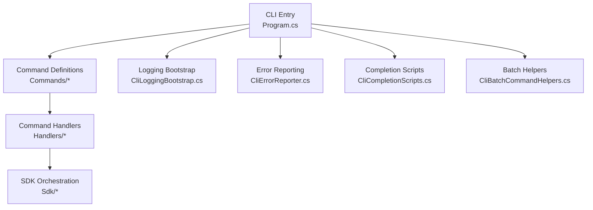
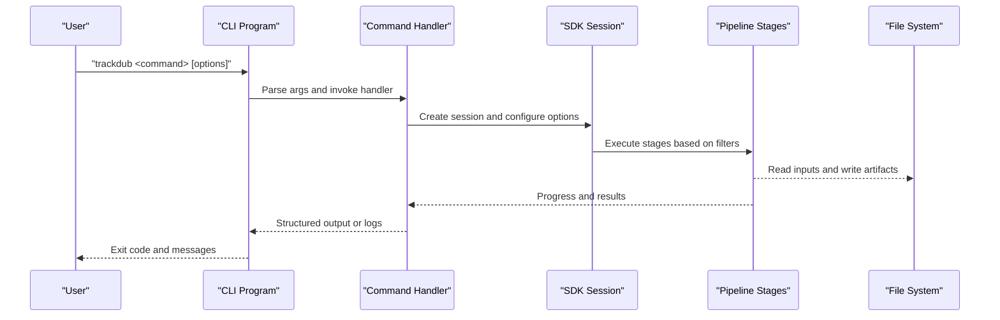
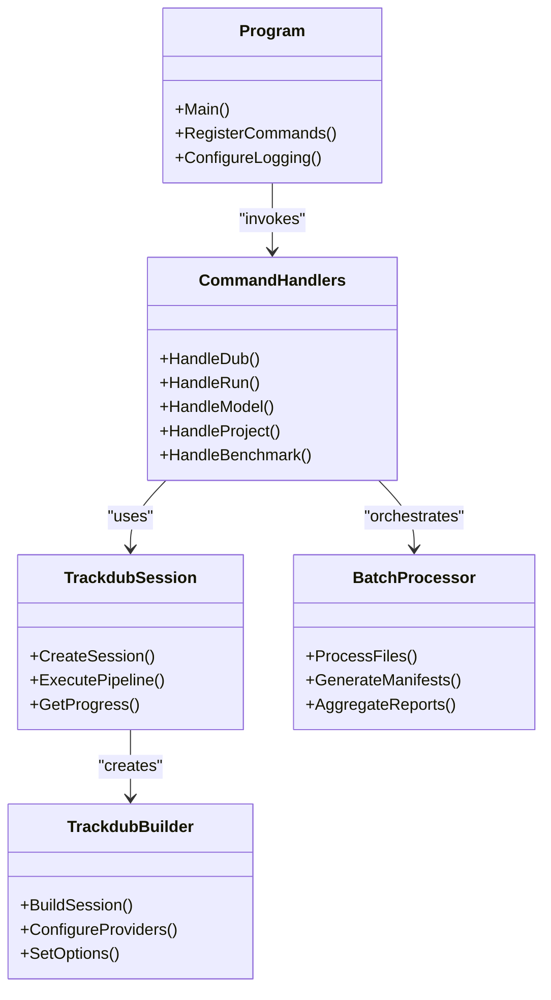

# Command Line Interface

<cite>
**Referenced Files in This Document**
- [Program.cs](file://src/Trackdub.Cli/Program.cs)
- [CliBatchCommandHelpers.cs](file://src/Trackdub.Cli/CliBatchCommandHelpers.cs)
- [CliCompletionScripts.cs](file://src/Trackdub.Cli/CliCompletionScripts.cs)
- [CliErrorReporter.cs](file://src/Trackdub.Cli/CliErrorReporter.cs)
- [CliJsonOptions.cs](file://src/Trackdub.Cli/CliJsonOptions.cs)
- [CliLoggingBootstrap.cs](file://src/Trackdub.Cli/CliLoggingBootstrap.cs)
- [CliLoggingConfiguration.cs](file://src/Trackdub.Cli/CliLoggingConfiguration.cs)
- [CliModelOverrides.cs](file://src/Trackdub.Cli/CliModelOverrides.cs)
- [CliParseHelpers.cs](file://src/Trackdub.Cli/CliParseHelpers.cs)
- [CliProgressReporter.cs](file://src/Trackdub.Cli/CliProgressReporter.cs)
- [CliProgressRunner.cs](file://src/Trackdub.Cli/CliProgressRunner.cs)
- [CliStageFilter.cs](file://src/Trackdub.Cli/CliStageFilter.cs)
- [DubSetupWizard.cs](file://src/Trackdub.Cli/DubSetupWizard.cs)
- [Commands/dub_command.cs](file://src/Trackdub.Cli/Commands/dub_command.cs)
- [Commands/run_command.cs](file://src/Trackdub.Cli/Commands/run_command.cs)
- [Commands/model_command.cs](file://src/Trackdub.Cli/Commands/model_command.cs)
- [Commands/project_command.cs](file://src/Trackdub.Cli/Commands/project_command.cs)
- [Commands/benchmark_command.cs](file://src/Trackdub.Cli/Commands/benchmark_command.cs)
- [Handlers/dub_handler.cs](file://src/Trackdub.Cli/Handlers/dub_handler.cs)
- [Handlers/run_handler.cs](file://src/Trackdub.Cli/Handlers/run_handler.cs)
- [Handlers/model_handler.cs](file://src/Trackdub.Cli/Handlers/model_handler.cs)
- [Handlers/project_handler.cs](file://src/Trackdub.Cli/Handlers/project_handler.cs)
- [Handlers/benchmark_handler.cs](file://src/Trackdub.Cli/Handlers/benchmark_handler.cs)
- [Sdk/TrackdubBuilder.cs](file://src/Trackdub.Sdk/TrackdubBuilder.cs)
- [Sdk/TrackdubSession.cs](file://src/Trackdub.Sdk/TrackdubSession.cs)
- [Sdk/BatchProcessor.cs](file://src/Trackdub.Sdk/BatchProcessor.cs)
- [Sdk/RunManifestWriter.cs](file://src/Trackdub.Sdk/RunManifestWriter.cs)
</cite>

## Table of Contents
1. Introduction
2. Project Structure
3. Core Components
4. Architecture Overview
5. Detailed Component Analysis
6. Dependency Analysis
7. Performance Considerations
8. Troubleshooting Guide
9. Conclusion
10. Appendices

## Introduction
This document provides a comprehensive command-line interface reference for Trackdub. It covers all primary commands (dub, run, model, project, benchmark) and utility features such as batch processing, completion scripts, logging, and environment configuration. The goal is to support both interactive workflows and automated scripting scenarios, including CI/CD integration.

## Project Structure
The CLI is implemented under the Trackdub.Cli project with a clear separation between command definitions, handlers, progress/reporting, and utilities. High-level entry points and bootstrapping are centralized, while business logic is delegated to Sdk components.

**Diagram sources**
- [Program.cs](file://src/Trackdub.Cli/Program.cs)
- [CliLoggingBootstrap.cs](file://src/Trackdub.Cli/CliLoggingBootstrap.cs)
- [CliErrorReporter.cs](file://src/Trackdub.Cli/CliErrorReporter.cs)
- [CliCompletionScripts.cs](file://src/Trackdub.Cli/CliCompletionScripts.cs)
- [CliBatchCommandHelpers.cs](file://src/Trackdub.Cli/CliBatchCommandHelpers.cs)
- [Commands/dub_command.cs](file://src/Trackdub.Cli/Commands/dub_command.cs)
- [Handlers/dub_handler.cs](file://src/Trackdub.Cli/Handlers/dub_handler.cs)
- [Sdk/TrackdubBuilder.cs](file://src/Trackdub.Sdk/TrackdubBuilder.cs)

**Section sources**
- [Program.cs](file://src/Trackdub.Cli/Program.cs)
- [CliLoggingBootstrap.cs](file://src/Trackdub.Cli/CliLoggingBootstrap.cs)
- [CliErrorReporter.cs](file://src/Trackdub.Cli/CliErrorReporter.cs)
- [CliCompletionScripts.cs](file://src/Trackdub.Cli/CliCompletionScripts.cs)
- [CliBatchCommandHelpers.cs](file://src/Trackdub.Cli/CliBatchCommandHelpers.cs)

## Core Components
- Program: Bootstraps logging, error handling, and registers commands and handlers.
- Commands: Define CLI surface area (subcommands, options, flags).
- Handlers: Implement command behavior, orchestrate SDK sessions, and manage I/O.
- SDK: Provides session management, pipeline execution, and batch processing.
- Utilities: Logging bootstrap, error reporting, progress reporting, parsing helpers, stage filtering, JSON options, model overrides, and completion scripts.

Key responsibilities:
- Input validation and normalization
- Environment-driven configuration
- Progress and structured output
- Batch orchestration and manifest generation
- Completion script generation for shells

**Section sources**
- [Program.cs](file://src/Trackdub.Cli/Program.cs)
- [CliJsonOptions.cs](file://src/Trackdub.Cli/CliJsonOptions.cs)
- [CliParseHelpers.cs](file://src/Trackdub.Cli/CliParseHelpers.cs)
- [CliStageFilter.cs](file://src/Trackdub.Cli/CliStageFilter.cs)
- [CliModelOverrides.cs](file://src/Trackdub.Cli/CliModelOverrides.cs)
- [CliProgressReporter.cs](file://src/Trackdub.Cli/CliProgressReporter.cs)
- [CliProgressRunner.cs](file://src/Trackdub.Cli/CliProgressRunner.cs)
- [CliBatchCommandHelpers.cs](file://src/Trackdub.Cli/CliBatchCommandHelpers.cs)

## Architecture Overview
The CLI follows a layered architecture:
- Presentation layer: Commands and handlers define user-facing options and behaviors.
- Orchestration layer: SDK builds sessions, manages pipelines, and executes stages.
- Infrastructure layer: Logging, error reporting, and file system interactions.

**Diagram sources**
- [Program.cs](file://src/Trackdub.Cli/Program.cs)
- [Handlers/dub_handler.cs](file://src/Trackdub.Cli/Handlers/dub_handler.cs)
- [Sdk/TrackdubSession.cs](file://src/Trackdub.Sdk/TrackdubSession.cs)
- [Sdk/TrackdubBuilder.cs](file://src/Trackdub.Sdk/TrackdubBuilder.cs)

## Detailed Component Analysis

### Command: dub
Purpose: Perform end-to-end dubbing operations with full pipeline control.

Common options and flags:
- Input media path(s)
- Output directory
- Target language(s)
- Model selection and overrides
- Execution provider preferences
- Stage filters to limit pipeline phases
- Progress verbosity and structured output modes
- Retry and timeout settings
- GPU memory budget and device affinity

Usage examples:
- Interactive dubbing with wizard guidance
- Non-interactive batch mode with JSON options
- Selective stage execution for debugging

Batch processing:
- Use batch helpers to process multiple files
- Generate run manifests for reproducible runs
- Aggregate reports across batches

Environment variables:
- Configure logging level, output formats, and feature toggles
- Set execution provider preferences and device selection

Completion scripts:
- Generate shell completions for bash, zsh, and PowerShell

**Section sources**
- [Commands/dub_command.cs](file://src/Trackdub.Cli/Commands/dub_command.cs)
- [Handlers/dub_handler.cs](file://src/Trackdub.Cli/Handlers/dub_handler.cs)
- [CliBatchCommandHelpers.cs](file://src/Trackdub.Cli/CliBatchCommandHelpers.cs)
- [CliStageFilter.cs](file://src/Trackdub.Cli/CliStageFilter.cs)
- [CliModelOverrides.cs](file://src/Trackdub.Cli/CliModelOverrides.cs)
- [CliJsonOptions.cs](file://src/Trackdub.Cli/CliJsonOptions.cs)
- [CliCompletionScripts.cs](file://src/Trackdub.Cli/CliCompletionScripts.cs)

### Command: run
Purpose: Execute specific pipeline stages or custom runs without full dubbing workflow.

Common options and flags:
- Stage selection via filter expressions
- Input artifact paths and expected outputs
- Model overrides and runtime options
- Progress reporting and structured output
- Dry-run mode to validate configuration

Usage examples:
- Run transcription only
- Execute translation and TTS stages
- Validate pipeline readiness before full run

Batch processing:
- Chain run commands with different stage filters
- Use manifests to replay runs deterministically

**Section sources**
- [Commands/run_command.cs](file://src/Trackdub.Cli/Commands/run_command.cs)
- [Handlers/run_handler.cs](file://src/Trackdub.Cli/Handlers/run_handler.cs)
- [CliStageFilter.cs](file://src/Trackdub.Cli/CliStageFilter.cs)
- [Sdk/RunManifestWriter.cs](file://src/Trackdub.Sdk/RunManifestWriter.cs)

### Command: model
Purpose: Manage models, including discovery, verification, optimization, and caching.

Common options and flags:
- List available models and their metadata
- Verify model integrity and compatibility
- Optimize models for target execution providers
- Cache management and cleanup

Usage examples:
- Inspect model capabilities
- Prepare optimized models for deployment
- Validate model paths and permissions

**Section sources**
- [Commands/model_command.cs](file://src/Trackdub.Cli/Commands/model_command.cs)
- [Handlers/model_handler.cs](file://src/Trackdub.Cli/Handlers/model_handler.cs)
- [CliModelOverrides.cs](file://src/Trackdub.Cli/CliModelOverrides.cs)

### Command: project
Purpose: Manage projects, including initialization, configuration, and artifact management.

Common options and flags:
- Initialize new projects with templates
- Configure project settings and presets
- Import/export project configurations
- Manage project artifacts and dependencies

Usage examples:
- Create a new project from a starter pack
- Update project settings for batch processing
- Export project configuration for CI/CD

**Section sources**
- [Commands/project_command.cs](file://src/Trackdub.Cli/Commands/project_command.cs)
- [Handlers/project_handler.cs](file://src/Trackdub.Cli/Handlers/project_handler.cs)

### Command: benchmark
Purpose: Measure performance of models and pipeline stages across different configurations.

Common options and flags:
- Select benchmark scenarios and metrics
- Configure hardware targets and execution providers
- Generate detailed performance reports
- Compare results across runs

Usage examples:
- Benchmark ASR models on different devices
- Evaluate TTS latency and quality metrics
- Generate comparative reports for model selection

**Section sources**
- [Commands/benchmark_command.cs](file://src/Trackdub.Cli/Commands/benchmark_command.cs)
- [Handlers/benchmark_handler.cs](file://src/Trackdub.Cli/Handlers/benchmark_handler.cs)

### Utility Commands and Features
- Setup wizard: Interactive configuration for first-time users
- Completion scripts: Shell-specific tab completion
- Error reporting: Structured error messages and diagnostics
- Progress reporting: Real-time feedback during long-running operations
- JSON options: Configuration via JSON files for automation

**Section sources**
- [DubSetupWizard.cs](file://src/Trackdub.Cli/DubSetupWizard.cs)
- [CliCompletionScripts.cs](file://src/Trackdub.Cli/CliCompletionScripts.cs)
- [CliErrorReporter.cs](file://src/Trackdub.Cli/CliErrorReporter.cs)
- [CliProgressReporter.cs](file://src/Trackdub.Cli/CliProgressReporter.cs)
- [CliJsonOptions.cs](file://src/Trackdub.Cli/CliJsonOptions.cs)

## Dependency Analysis
The CLI depends on several core subsystems:

**Diagram sources**
- [Program.cs](file://src/Trackdub.Cli/Program.cs)
- [Handlers/dub_handler.cs](file://src/Trackdub.Cli/Handlers/dub_handler.cs)
- [Sdk/TrackdubSession.cs](file://src/Trackdub.Sdk/TrackdubSession.cs)
- [Sdk/TrackdubBuilder.cs](file://src/Trackdub.Sdk/TrackdubBuilder.cs)
- [Sdk/BatchProcessor.cs](file://src/Trackdub.Sdk/BatchProcessor.cs)

**Section sources**
- [Program.cs](file://src/Trackdub.Cli/Program.cs)
- [Sdk/TrackdubSession.cs](file://src/Trackdub.Sdk/TrackdubSession.cs)
- [Sdk/TrackdubBuilder.cs](file://src/Trackdub.Sdk/TrackdubBuilder.cs)
- [Sdk/BatchProcessor.cs](file://src/Trackdub.Sdk/BatchProcessor.cs)

## Performance Considerations
- Execution provider selection impacts performance significantly
- GPU memory budget affects throughput and stability
- Stage filtering reduces unnecessary processing
- Batch processing optimizes resource utilization
- Model optimization reduces inference time
- Logging verbosity can impact performance in high-throughput scenarios

## Troubleshooting Guide
Common issues and solutions:
- Model loading failures: Verify model paths and permissions
- Execution provider errors: Check hardware compatibility and drivers
- Memory issues: Adjust GPU memory budget and batch sizes
- Permission errors: Ensure proper file system access rights
- Network timeouts: Configure retry policies and timeouts

Debugging techniques:
- Enable verbose logging with appropriate log levels
- Use dry-run mode to validate configurations
- Inspect generated manifests and reports
- Monitor progress output for bottlenecks
- Use completion scripts to verify command syntax

**Section sources**
- [CliErrorReporter.cs](file://src/Trackdub.Cli/CliErrorReporter.cs)
- [CliLoggingBootstrap.cs](file://src/Trackdub.Cli/CliLoggingBootstrap.cs)
- [CliProgressReporter.cs](file://src/Trackdub.Cli/CliProgressReporter.cs)

## Conclusion
The Trackdub CLI provides a comprehensive interface for audio dubbing, model management, and performance benchmarking. With support for batch processing, completion scripts, and extensive configuration options, it serves both interactive users and automated workflows. The modular architecture enables easy extension and customization for specific use cases.

## Appendices

### Environment Variables
- LOG_LEVEL: Controls logging verbosity
- OUTPUT_FORMAT: Specifies output format (text, json)
- EXECUTION_PROVIDER: Sets preferred execution provider
- DEVICE_SELECTION: Configures device affinity
- FEATURE_FLAGS: Enables/disables experimental features

### File Path Specifications
- Relative paths resolved from current working directory
- Absolute paths supported across platforms
- Wildcard patterns for batch operations
- Environment variable expansion in paths

### CI/CD Integration Examples
- Docker container setup with required dependencies
- GitHub Actions workflow for automated dubbing
- Jenkins pipeline for batch processing
- Azure DevOps tasks for model optimization

### Scripting Patterns
- Command chaining with pipes and redirects
- Loop processing for batch operations
- Conditional execution based on exit codes
- Parameter substitution from configuration files