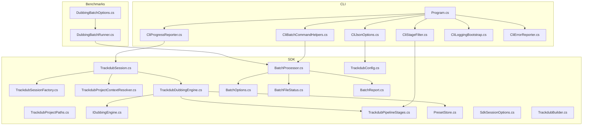
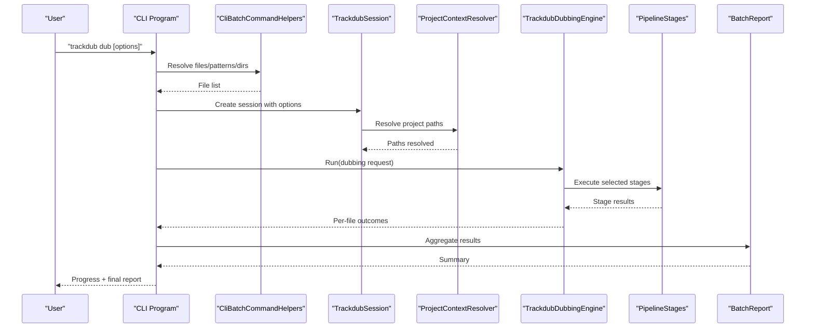
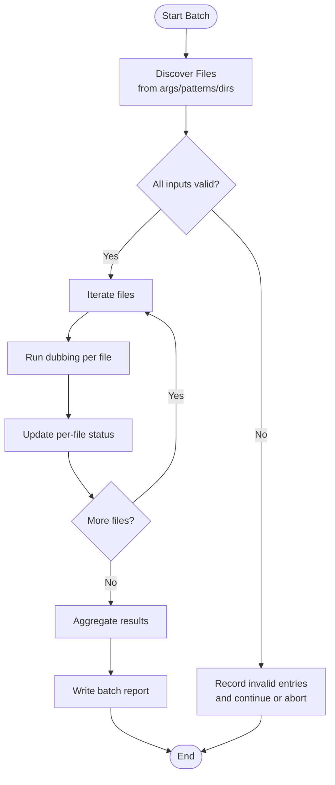
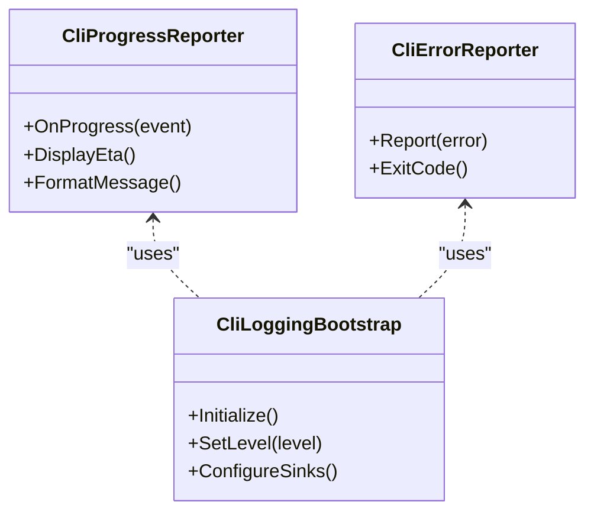
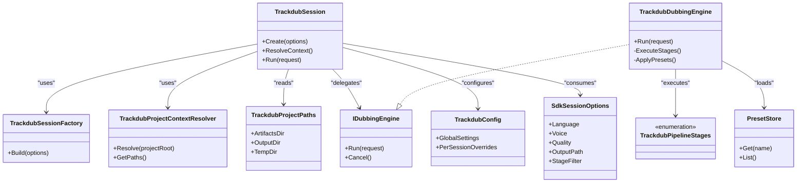
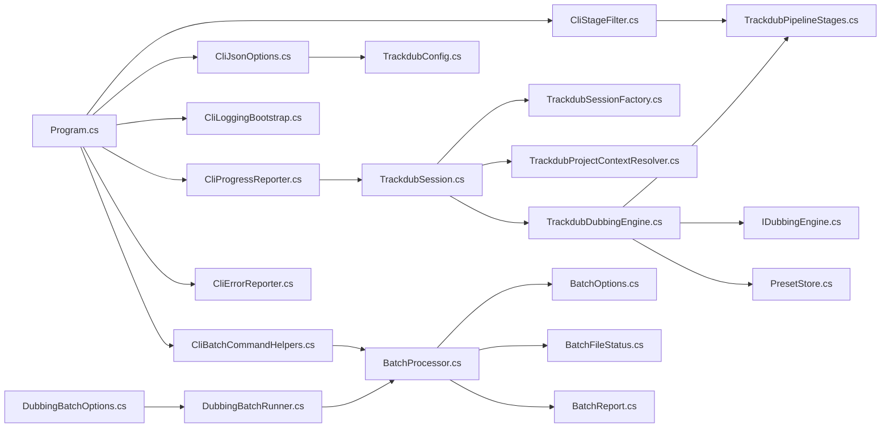

# Dubbing Commands

<cite>
**Referenced Files in This Document**
- [Program.cs](file://src/Trackdub.Cli/Program.cs)
- [CliBatchCommandHelpers.cs](file://src/Trackdub.Cli/CliBatchCommandHelpers.cs)
- [CliProgressReporter.cs](file://src/Trackdub.Cli/CliProgressReporter.cs)
- [CliStageFilter.cs](file://src/Trackdub.Cli/CliStageFilter.cs)
- [CliJsonOptions.cs](file://src/Trackdub.Cli/CliJsonOptions.cs)
- [CliLoggingBootstrap.cs](file://src/Trackdub.Cli/CliLoggingBootstrap.cs)
- [CliErrorReporter.cs](file://src/Trackdub.Cli/CliErrorReporter.cs)
- [DubbingBatchOptions.cs](file://src/Trackdub.Benchmarks/DubbingBatchOptions.cs)
- [DubbingBatchRunner.cs](file://src/Trackdub.Benchmarks/DubbingBatchRunner.cs)
- [IDubbingEngine.cs](file://src/Trackdub.Sdk/IDubbingEngine.cs)
- [TrackdubDubbingEngine.cs](file://src/Trackdub.Sdk/TrackdubDubbingEngine.cs)
- [BatchProcessor.cs](file://src/Trackdub.Sdk/BatchProcessor.cs)
- [BatchOptions.cs](file://src/Trackdub.Sdk/BatchOptions.cs)
- [BatchFileStatus.cs](file://src/Trackdub.Sdk/BatchFileStatus.cs)
- [BatchReport.cs](file://src/Trackdub.Sdk/BatchReport.cs)
- [TrackdubPipelineStages.cs](file://src/Trackdub.Sdk/TrackdubPipelineStages.cs)
- [TrackdubSession.cs](file://src/Trackdub.Sdk/TrackdubSession.cs)
- [TrackdubSessionFactory.cs](file://src/Trackdub.Sdk/TrackdubSessionFactory.cs)
- [TrackdubProjectContextResolver.cs](file://src/Trackdub.Sdk/TrackdubProjectContextResolver.cs)
- [TrackdubProjectPaths.cs](file://src/Trackdub.Sdk/TrackdubProjectPaths.cs)
- [TrackdubBuilder.cs](file://src/Trackdub.Sdk/TrackdubBuilder.cs)
- [TrackdubConfig.cs](file://src/Trackdub.Sdk/TrackdubConfig.cs)
- [SdkSessionOptions.cs](file://src/Trackdub.Sdk/SdkSessionOptions.cs)
- [PresetStore.cs](file://src/Trackdub.Sdk/PresetStore.cs)
- [PipelinePreset.cs](file://src/Trackdub.Sdk/PipelinePreset.cs)
</cite>

## Table of Contents
1. [Introduction](#introduction)
2. [Project Structure](#project-structure)
3. [Core Components](#core-components)
4. [Architecture Overview](#architecture-overview)
5. [Detailed Component Analysis](#detailed-component-analysis)
6. [Dependency Analysis](#dependency-analysis)
7. [Performance Considerations](#performance-considerations)
8. [Troubleshooting Guide](#troubleshooting-guide)
9. [Conclusion](#conclusion)
10. [Appendices](#appendices)

## Introduction
This document explains Trackdub’s dubbing commands and workflows, focusing on the “dub” command surface exposed by the CLI and SDK. It covers input file specifications, target language options, voice selection, quality settings, output configuration, batch processing with file patterns and directory operations, progress tracking, error handling, logging, and practical examples ranging from single-file dubbing to automated pipelines.

## Project Structure
The dubbing functionality spans several layers:
- CLI layer: command parsing, progress reporting, stage filtering, JSON options, logging bootstrap, and error reporting.
- SDK layer: session management, project context resolution, pipeline stages, preset store, and batch processing.
- Engine layer: concrete dubbing engine implementation and orchestration.
- Benchmarks layer: reusable batch options and runner for dubbing scenarios.

**Diagram sources**
- [Program.cs](file://src/Trackdub.Cli/Program.cs)
- [CliBatchCommandHelpers.cs](file://src/Trackdub.Cli/CliBatchCommandHelpers.cs)
- [CliProgressReporter.cs](file://src/Trackdub.Cli/CliProgressReporter.cs)
- [CliStageFilter.cs](file://src/Trackdub.Cli/CliStageFilter.cs)
- [CliJsonOptions.cs](file://src/Trackdub.Cli/CliJsonOptions.cs)
- [CliLoggingBootstrap.cs](file://src/Trackdub.Cli/CliLoggingBootstrap.cs)
- [CliErrorReporter.cs](file://src/Trackdub.Cli/CliErrorReporter.cs)
- [TrackdubSession.cs](file://src/Trackdub.Sdk/TrackdubSession.cs)
- [TrackdubSessionFactory.cs](file://src/Trackdub.Sdk/TrackdubSessionFactory.cs)
- [TrackdubProjectContextResolver.cs](file://src/Trackdub.Sdk/TrackdubProjectContextResolver.cs)
- [TrackdubProjectPaths.cs](file://src/Trackdub.Sdk/TrackdubProjectPaths.cs)
- [TrackdubDubbingEngine.cs](file://src/Trackdub.Sdk/TrackdubDubbingEngine.cs)
- [IDubbingEngine.cs](file://src/Trackdub.Sdk/IDubbingEngine.cs)
- [TrackdubPipelineStages.cs](file://src/Trackdub.Sdk/TrackdubPipelineStages.cs)
- [PresetStore.cs](file://src/Trackdub.Sdk/PresetStore.cs)
- [BatchProcessor.cs](file://src/Trackdub.Sdk/BatchProcessor.cs)
- [BatchOptions.cs](file://src/Trackdub.Sdk/BatchOptions.cs)
- [BatchFileStatus.cs](file://src/Trackdub.Sdk/BatchFileStatus.cs)
- [BatchReport.cs](file://src/Trackdub.Sdk/BatchReport.cs)
- [TrackdubConfig.cs](file://src/Trackdub.Sdk/TrackdubConfig.cs)
- [SdkSessionOptions.cs](file://src/Trackdub.Sdk/SdkSessionOptions.cs)
- [TrackdubBuilder.cs](file://src/Trackdub.Sdk/TrackdubBuilder.cs)
- [DubbingBatchOptions.cs](file://src/Trackdub.Benchmarks/DubbingBatchOptions.cs)
- [DubbingBatchRunner.cs](file://src/Trackdub.Benchmarks/DubbingBatchRunner.cs)

**Section sources**
- [Program.cs](file://src/Trackdub.Cli/Program.cs)
- [CliBatchCommandHelpers.cs](file://src/Trackdub.Cli/CliBatchCommandHelpers.cs)
- [CliProgressReporter.cs](file://src/Trackdub.Cli/CliProgressReporter.cs)
- [CliStageFilter.cs](file://src/Trackdub.Cli/CliStageFilter.cs)
- [CliJsonOptions.cs](file://src/Trackdub.Cli/CliJsonOptions.cs)
- [CliLoggingBootstrap.cs](file://src/Trackdub.Cli/CliLoggingBootstrap.cs)
- [CliErrorReporter.cs](file://src/Trackdub.Cli/CliErrorReporter.cs)
- [TrackdubSession.cs](file://src/Trackdub.Sdk/TrackdubSession.cs)
- [TrackdubSessionFactory.cs](file://src/Trackdub.Sdk/TrackdubSessionFactory.cs)
- [TrackdubProjectContextResolver.cs](file://src/Trackdub.Sdk/TrackdubProjectContextResolver.cs)
- [TrackdubProjectPaths.cs](file://src/Trackdub.Sdk/TrackdubProjectPaths.cs)
- [TrackdubDubbingEngine.cs](file://src/Trackdub.Sdk/TrackdubDubbingEngine.cs)
- [IDubbingEngine.cs](file://src/Trackdub.Sdk/IDubbingEngine.cs)
- [TrackdubPipelineStages.cs](file://src/Trackdub.Sdk/TrackdubPipelineStages.cs)
- [PresetStore.cs](file://src/Trackdub.Sdk/PresetStore.cs)
- [BatchProcessor.cs](file://src/Trackdub.Sdk/BatchProcessor.cs)
- [BatchOptions.cs](file://src/Trackdub.Sdk/BatchOptions.cs)
- [BatchFileStatus.cs](file://src/Trackdub.Sdk/BatchFileStatus.cs)
- [BatchReport.cs](file://src/Trackdub.Sdk/BatchReport.cs)
- [TrackdubConfig.cs](file://src/Trackdub.Sdk/TrackdubConfig.cs)
- [SdkSessionOptions.cs](file://src/Trackdub.Sdk/SdkSessionOptions.cs)
- [TrackdubBuilder.cs](file://src/Trackdub.Sdk/TrackdubBuilder.cs)
- [DubbingBatchOptions.cs](file://src/Trackdub.Benchmarks/DubbingBatchOptions.cs)
- [DubbingBatchRunner.cs](file://src/Trackdub.Benchmarks/DubbingBatchRunner.cs)

## Core Components
- CLI entrypoint and helpers:
  - Program.cs: command registration and invocation flow.
  - CliBatchCommandHelpers.cs: batch discovery and iteration helpers for file patterns and directories.
  - CliProgressReporter.cs: progress events and ETA display.
  - CliStageFilter.cs: stage selection and filtering for pipeline execution.
  - CliJsonOptions.cs: JSON-based configuration loading for dubbing options.
  - CliLoggingBootstrap.cs: initialization of logging sinks and levels.
  - CliErrorReporter.cs: standardized error formatting and exit codes.

- SDK session and engine:
  - TrackdubSession.cs and TrackdubSessionFactory.cs: lifecycle and configuration of a dubbing session.
  - TrackdubProjectContextResolver.cs and TrackdubProjectPaths.cs: resolve project root, artifacts, and output paths.
  - IDubbingEngine.cs and TrackdubDubbingEngine.cs: interface and implementation for running dubbing pipelines.
  - TrackdubPipelineStages.cs: enumerated stages (e.g., transcription, translation, TTS, mixing).
  - PresetStore.cs and PipelinePreset.cs: named presets for common configurations.
  - BatchProcessor.cs, BatchOptions.cs, BatchFileStatus.cs, BatchReport.cs: batch orchestration and reporting.
  - TrackdubConfig.cs and SdkSessionOptions.cs: global and per-session configuration.
  - TrackdubBuilder.cs: fluent builder for composing sessions and engines.

- Benchmarks reuse:
  - DubbingBatchOptions.cs and DubbingBatchRunner.cs: reusable batch options and runner used by CLI and tests.

**Section sources**
- [Program.cs](file://src/Trackdub.Cli/Program.cs)
- [CliBatchCommandHelpers.cs](file://src/Trackdub.Cli/CliBatchCommandHelpers.cs)
- [CliProgressReporter.cs](file://src/Trackdub.Cli/CliProgressReporter.cs)
- [CliStageFilter.cs](file://src/Trackdub.Cli/CliStageFilter.cs)
- [CliJsonOptions.cs](file://src/Trackdub.Cli/CliJsonOptions.cs)
- [CliLoggingBootstrap.cs](file://src/Trackdub.Cli/CliLoggingBootstrap.cs)
- [CliErrorReporter.cs](file://src/Trackdub.Cli/CliErrorReporter.cs)
- [TrackdubSession.cs](file://src/Trackdub.Sdk/TrackdubSession.cs)
- [TrackdubSessionFactory.cs](file://src/Trackdub.Sdk/TrackdubSessionFactory.cs)
- [TrackdubProjectContextResolver.cs](file://src/Trackdub.Sdk/TrackdubProjectContextResolver.cs)
- [TrackdubProjectPaths.cs](file://src/Trackdub.Sdk/TrackdubProjectPaths.cs)
- [IDubbingEngine.cs](file://src/Trackdub.Sdk/IDubbingEngine.cs)
- [TrackdubDubbingEngine.cs](file://src/Trackdub.Sdk/TrackdubDubbingEngine.cs)
- [TrackdubPipelineStages.cs](file://src/Trackdub.Sdk/TrackdubPipelineStages.cs)
- [PresetStore.cs](file://src/Trackdub.Sdk/PresetStore.cs)
- [PipelinePreset.cs](file://src/Trackdub.Sdk/PipelinePreset.cs)
- [BatchProcessor.cs](file://src/Trackdub.Sdk/BatchProcessor.cs)
- [BatchOptions.cs](file://src/Trackdub.Sdk/BatchOptions.cs)
- [BatchFileStatus.cs](file://src/Trackdub.Sdk/BatchFileStatus.cs)
- [BatchReport.cs](file://src/Trackdub.Sdk/BatchReport.cs)
- [TrackdubConfig.cs](file://src/Trackdub.Sdk/TrackdubConfig.cs)
- [SdkSessionOptions.cs](file://src/Trackdub.Sdk/SdkSessionOptions.cs)
- [TrackdubBuilder.cs](file://src/Trackdub.Sdk/TrackdubBuilder.cs)
- [DubbingBatchOptions.cs](file://src/Trackdub.Benchmarks/DubbingBatchOptions.cs)
- [DubbingBatchRunner.cs](file://src/Trackdub.Benchmarks/DubbingBatchRunner.cs)

## Architecture Overview
The “dub” command flows through CLI parsing into an SDK session that resolves project context, configures the engine, and executes selected pipeline stages. Batch mode leverages file pattern discovery and a processor that reports status and aggregated results.

**Diagram sources**
- [Program.cs](file://src/Trackdub.Cli/Program.cs)
- [CliBatchCommandHelpers.cs](file://src/Trackdub.Cli/CliBatchCommandHelpers.cs)
- [TrackdubSession.cs](file://src/Trackdub.Sdk/TrackdubSession.cs)
- [TrackdubProjectContextResolver.cs](file://src/Trackdub.Sdk/TrackdubProjectContextResolver.cs)
- [TrackdubDubbingEngine.cs](file://src/Trackdub.Sdk/TrackdubDubbingEngine.cs)
- [TrackdubPipelineStages.cs](file://src/Trackdub.Sdk/TrackdubPipelineStages.cs)
- [BatchReport.cs](file://src/Trackdub.Sdk/BatchReport.cs)

## Detailed Component Analysis

### CLI Command Surface and Options
- Input specification:
  - Single file path or multiple file arguments.
  - Directory recursion and glob-like patterns via batch helpers.
- Target language:
  - Language code option passed into session/engine configuration.
- Voice selection:
  - Voice identifier or name mapped by the engine; may be overridden per file or globally.
- Quality settings:
  - Audio quality flags influencing ASR/TTS/mixing parameters.
- Output configuration:
  - Output directory, naming templates, overwrite behavior, and artifact retention.
- Stage filtering:
  - Select or skip specific pipeline stages using stage filter.
- Logging and progress:
  - Log level, console verbosity, structured logs, and progress callbacks.

Practical usage patterns:
- Single file dubbing: specify one media file and target language.
- Batch processing: pass a directory or pattern to process all matching files.
- Custom pipeline: select only required stages (e.g., skip lip-sync).

**Section sources**
- [Program.cs](file://src/Trackdub.Cli/Program.cs)
- [CliBatchCommandHelpers.cs](file://src/Trackdub.Cli/CliBatchCommandHelpers.cs)
- [CliStageFilter.cs](file://src/Trackdub.Cli/CliStageFilter.cs)
- [CliJsonOptions.cs](file://src/Trackdub.Cli/CliJsonOptions.cs)
- [CliLoggingBootstrap.cs](file://src/Trackdub.Cli/CliLoggingBootstrap.cs)
- [CliProgressReporter.cs](file://src/Trackdub.Cli/CliProgressReporter.cs)

### Batch Processing Capabilities
- File discovery:
  - Supports explicit file lists, directories, and pattern matching.
- Concurrency:
  - Controlled by batch options; can limit parallelism based on hardware.
- Status and reporting:
  - Per-file status enumeration and aggregated batch report.
- Error resilience:
  - Fail-fast or continue-on-error policies; detailed per-file errors.

**Diagram sources**
- [CliBatchCommandHelpers.cs](file://src/Trackdub.Cli/CliBatchCommandHelpers.cs)
- [BatchProcessor.cs](file://src/Trackdub.Sdk/BatchProcessor.cs)
- [BatchOptions.cs](file://src/Trackdub.Sdk/BatchOptions.cs)
- [BatchFileStatus.cs](file://src/Trackdub.Sdk/BatchFileStatus.cs)
- [BatchReport.cs](file://src/Trackdub.Sdk/BatchReport.cs)

**Section sources**
- [CliBatchCommandHelpers.cs](file://src/Trackdub.Cli/CliBatchCommandHelpers.cs)
- [BatchProcessor.cs](file://src/Trackdub.Sdk/BatchProcessor.cs)
- [BatchOptions.cs](file://src/Trackdub.Sdk/BatchOptions.cs)
- [BatchFileStatus.cs](file://src/Trackdub.Sdk/BatchFileStatus.cs)
- [BatchReport.cs](file://src/Trackdub.Sdk/BatchReport.cs)

### Progress Tracking and Logging
- Progress:
  - Real-time updates per stage and per file; ETA estimates where available.
- Logging:
  - Bootstrap sets log sinks, levels, and optional structured output.
- Error reporting:
  - Standardized messages and exit codes for automation-friendly scripts.

**Diagram sources**
- [CliProgressReporter.cs](file://src/Trackdub.Cli/CliProgressReporter.cs)
- [CliLoggingBootstrap.cs](file://src/Trackdub.Cli/CliLoggingBootstrap.cs)
- [CliErrorReporter.cs](file://src/Trackdub.Cli/CliErrorReporter.cs)

**Section sources**
- [CliProgressReporter.cs](file://src/Trackdub.Cli/CliProgressReporter.cs)
- [CliLoggingBootstrap.cs](file://src/Trackdub.Cli/CliLoggingBootstrap.cs)
- [CliErrorReporter.cs](file://src/Trackdub.Cli/CliErrorReporter.cs)

### SDK Session, Engine, and Pipeline Stages
- Session lifecycle:
  - Creation via factory with options; resolves project context and paths.
- Engine execution:
  - Invokes pipeline stages in order; supports skipping or re-running stages.
- Presets:
  - Named configurations for quick setup (e.g., “fast”, “high-quality”).
- Configuration:
  - Global config and per-session overrides for model selection, device preferences, and output behavior.

**Diagram sources**
- [TrackdubSession.cs](file://src/Trackdub.Sdk/TrackdubSession.cs)
- [TrackdubSessionFactory.cs](file://src/Trackdub.Sdk/TrackdubSessionFactory.cs)
- [TrackdubProjectContextResolver.cs](file://src/Trackdub.Sdk/TrackdubProjectContextResolver.cs)
- [TrackdubProjectPaths.cs](file://src/Trackdub.Sdk/TrackdubProjectPaths.cs)
- [IDubbingEngine.cs](file://src/Trackdub.Sdk/IDubbingEngine.cs)
- [TrackdubDubbingEngine.cs](file://src/Trackdub.Sdk/TrackdubDubbingEngine.cs)
- [TrackdubPipelineStages.cs](file://src/Trackdub.Sdk/TrackdubPipelineStages.cs)
- [PresetStore.cs](file://src/Trackdub.Sdk/PresetStore.cs)
- [TrackdubConfig.cs](file://src/Trackdub.Sdk/TrackdubConfig.cs)
- [SdkSessionOptions.cs](file://src/Trackdub.Sdk/SdkSessionOptions.cs)

**Section sources**
- [TrackdubSession.cs](file://src/Trackdub.Sdk/TrackdubSession.cs)
- [TrackdubSessionFactory.cs](file://src/Trackdub.Sdk/TrackdubSessionFactory.cs)
- [TrackdubProjectContextResolver.cs](file://src/Trackdub.Sdk/TrackdubProjectContextResolver.cs)
- [TrackdubProjectPaths.cs](file://src/Trackdub.Sdk/TrackdubProjectPaths.cs)
- [IDubbingEngine.cs](file://src/Trackdub.Sdk/IDubbingEngine.cs)
- [TrackdubDubbingEngine.cs](file://src/Trackdub.Sdk/TrackdubDubbingEngine.cs)
- [TrackdubPipelineStages.cs](file://src/Trackdub.Sdk/TrackdubPipelineStages.cs)
- [PresetStore.cs](file://src/Trackdub.Sdk/PresetStore.cs)
- [TrackdubConfig.cs](file://src/Trackdub.Sdk/TrackdubConfig.cs)
- [SdkSessionOptions.cs](file://src/Trackdub.Sdk/SdkSessionOptions.cs)

### Practical Examples and Workflows
- Single file dubbing:
  - Provide one media file, set target language, choose voice, and run default stages.
- Batch processing multiple files:
  - Pass a directory or pattern; configure concurrency and failure policy; review batch report.
- Customizing pipeline stages:
  - Skip unnecessary stages (e.g., lip-sync) to speed up processing; use presets for common setups.
- Automated pipelines:
  - Use JSON options for reproducible runs; integrate with CI/CD; capture logs and reports.

[No sources needed since this section provides general guidance]

## Dependency Analysis
The CLI depends on SDK components for session management, engine execution, and batch processing. The engine relies on pipeline stages and presets. Benchmarks reuse SDK batch utilities.

**Diagram sources**
- [Program.cs](file://src/Trackdub.Cli/Program.cs)
- [CliBatchCommandHelpers.cs](file://src/Trackdub.Cli/CliBatchCommandHelpers.cs)
- [CliStageFilter.cs](file://src/Trackdub.Cli/CliStageFilter.cs)
- [CliJsonOptions.cs](file://src/Trackdub.Cli/CliJsonOptions.cs)
- [CliLoggingBootstrap.cs](file://src/Trackdub.Cli/CliLoggingBootstrap.cs)
- [CliProgressReporter.cs](file://src/Trackdub.Cli/CliProgressReporter.cs)
- [CliErrorReporter.cs](file://src/Trackdub.Cli/CliErrorReporter.cs)
- [BatchProcessor.cs](file://src/Trackdub.Sdk/BatchProcessor.cs)
- [TrackdubPipelineStages.cs](file://src/Trackdub.Sdk/TrackdubPipelineStages.cs)
- [TrackdubConfig.cs](file://src/Trackdub.Sdk/TrackdubConfig.cs)
- [TrackdubSession.cs](file://src/Trackdub.Sdk/TrackdubSession.cs)
- [TrackdubSessionFactory.cs](file://src/Trackdub.Sdk/TrackdubSessionFactory.cs)
- [TrackdubProjectContextResolver.cs](file://src/Trackdub.Sdk/TrackdubProjectContextResolver.cs)
- [TrackdubDubbingEngine.cs](file://src/Trackdub.Sdk/TrackdubDubbingEngine.cs)
- [IDubbingEngine.cs](file://src/Trackdub.Sdk/IDubbingEngine.cs)
- [PresetStore.cs](file://src/Trackdub.Sdk/PresetStore.cs)
- [BatchOptions.cs](file://src/Trackdub.Sdk/BatchOptions.cs)
- [BatchFileStatus.cs](file://src/Trackdub.Sdk/BatchFileStatus.cs)
- [BatchReport.cs](file://src/Trackdub.Sdk/BatchReport.cs)
- [DubbingBatchOptions.cs](file://src/Trackdub.Benchmarks/DubbingBatchOptions.cs)
- [DubbingBatchRunner.cs](file://src/Trackdub.Benchmarks/DubbingBatchRunner.cs)

**Section sources**
- [Program.cs](file://src/Trackdub.Cli/Program.cs)
- [CliBatchCommandHelpers.cs](file://src/Trackdub.Cli/CliBatchCommandHelpers.cs)
- [CliStageFilter.cs](file://src/Trackdub.Cli/CliStageFilter.cs)
- [CliJsonOptions.cs](file://src/Trackdub.Cli/CliJsonOptions.cs)
- [CliLoggingBootstrap.cs](file://src/Trackdub.Cli/CliLoggingBootstrap.cs)
- [CliProgressReporter.cs](file://src/Trackdub.Cli/CliProgressReporter.cs)
- [CliErrorReporter.cs](file://src/Trackdub.Cli/CliErrorReporter.cs)
- [BatchProcessor.cs](file://src/Trackdub.Sdk/BatchProcessor.cs)
- [TrackdubPipelineStages.cs](file://src/Trackdub.Sdk/TrackdubPipelineStages.cs)
- [TrackdubConfig.cs](file://src/Trackdub.Sdk/TrackdubConfig.cs)
- [TrackdubSession.cs](file://src/Trackdub.Sdk/TrackdubSession.cs)
- [TrackdubSessionFactory.cs](file://src/Trackdub.Sdk/TrackdubSessionFactory.cs)
- [TrackdubProjectContextResolver.cs](file://src/Trackdub.Sdk/TrackdubProjectContextResolver.cs)
- [TrackdubDubbingEngine.cs](file://src/Trackdub.Sdk/TrackdubDubbingEngine.cs)
- [IDubbingEngine.cs](file://src/Trackdub.Sdk/IDubbingEngine.cs)
- [PresetStore.cs](file://src/Trackdub.Sdk/PresetStore.cs)
- [BatchOptions.cs](file://src/Trackdub.Sdk/BatchOptions.cs)
- [BatchFileStatus.cs](file://src/Trackdub.Sdk/BatchFileStatus.cs)
- [BatchReport.cs](file://src/Trackdub.Sdk/BatchReport.cs)
- [DubbingBatchOptions.cs](file://src/Trackdub.Benchmarks/DubbingBatchOptions.cs)
- [DubbingBatchRunner.cs](file://src/Trackdub.Benchmarks/DubbingBatchRunner.cs)

## Performance Considerations
- Concurrency tuning:
  - Adjust batch parallelism to match CPU/GPU capacity; avoid oversubscription.
- Stage selection:
  - Skip non-essential stages for faster turnaround; use presets optimized for speed.
- Model and device preferences:
  - Prefer GPU acceleration when available; ensure models are pre-cached.
- I/O optimization:
  - Use fast storage for temp and output directories; minimize disk thrashing.
- Memory budgeting:
  - Limit concurrent large model loads; monitor memory usage during long batches.

[No sources needed since this section provides general guidance]

## Troubleshooting Guide
- Common issues:
  - Invalid input paths or unsupported formats: verify file existence and format support.
  - Missing models or voices: ensure models are downloaded and voices are configured.
  - Permission errors: check write permissions for output directories.
  - Stage failures: inspect per-file error details and retry with reduced concurrency.
- Diagnostics:
  - Increase log verbosity; enable structured logs for automation.
  - Review batch report for failed files and reasons.
- Recovery:
  - Resume partial runs by skipping completed stages; clean temp artifacts if corrupted.

**Section sources**
- [CliErrorReporter.cs](file://src/Trackdub.Cli/CliErrorReporter.cs)
- [CliLoggingBootstrap.cs](file://src/Trackdub.Cli/CliLoggingBootstrap.cs)
- [BatchReport.cs](file://src/Trackdub.Sdk/BatchReport.cs)
- [BatchFileStatus.cs](file://src/Trackdub.Sdk/BatchFileStatus.cs)

## Conclusion
Trackdub’s “dub” command provides a flexible, powerful interface for single-file and batch dubbing workflows. With robust session management, configurable pipeline stages, presets, and comprehensive progress/logging/reporting, it supports both ad-hoc tasks and automated pipelines. Properly tuning concurrency, stage selection, and model/device preferences yields optimal performance across diverse environments.

[No sources needed since this section summarizes without analyzing specific files]

## Appendices
- Quick reference:
  - Input: file path(s), directory, or pattern.
  - Target language: ISO code or friendly name.
  - Voice: identifier or name; per-file override supported.
  - Quality: audio quality flag affecting ASR/TTS/mixing.
  - Output: directory, naming template, overwrite policy.
  - Stages: select/skip pipeline stages.
  - Logging: level, structured output, verbosity.
  - Batch: concurrency, failure policy, report location.

[No sources needed since this section provides general guidance]