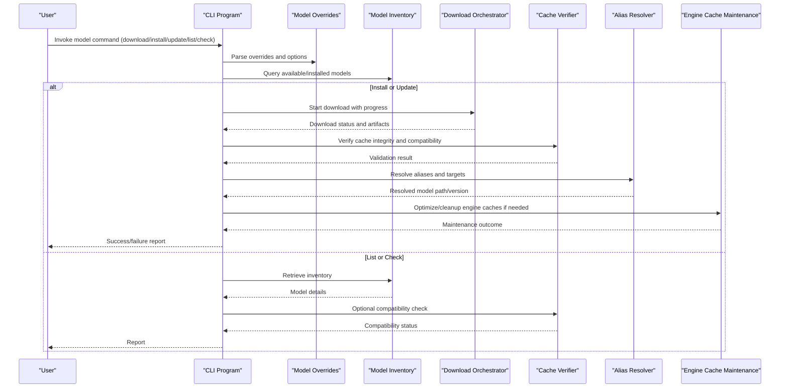
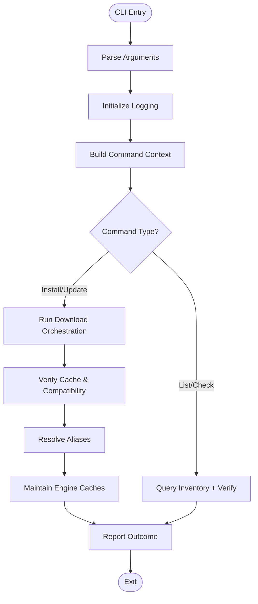
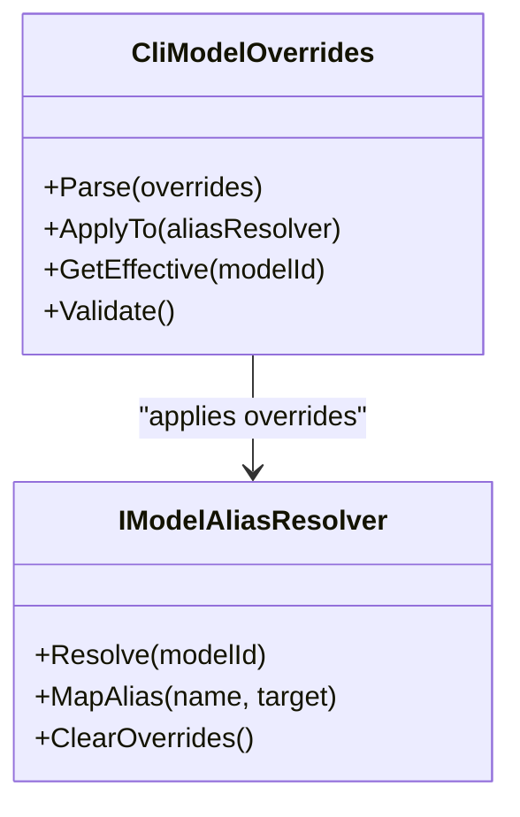
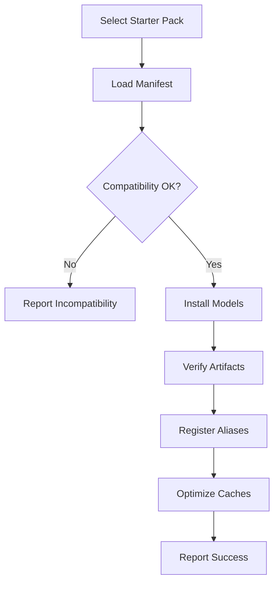
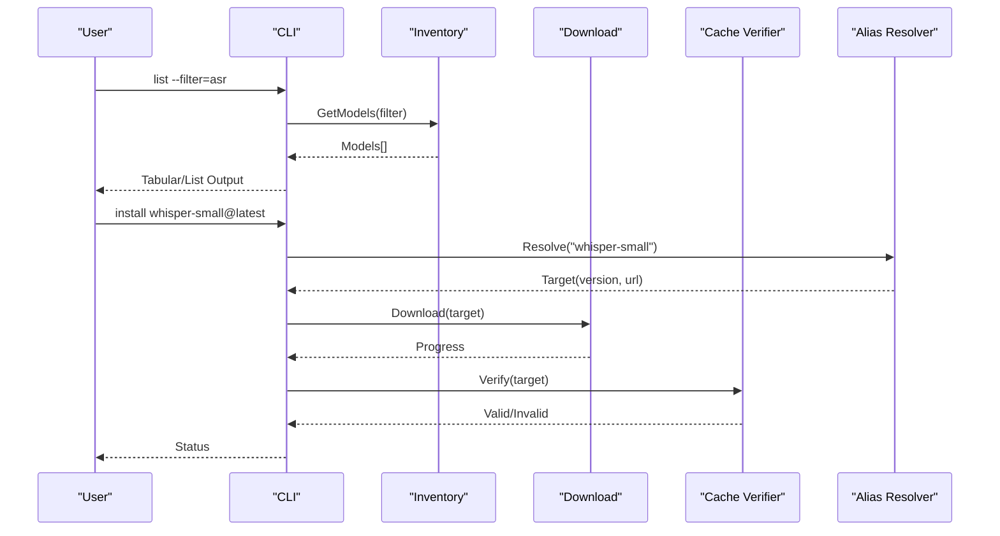
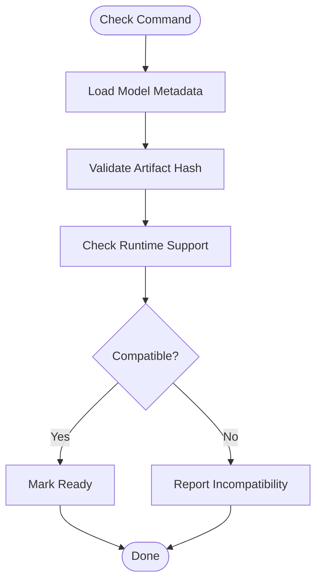
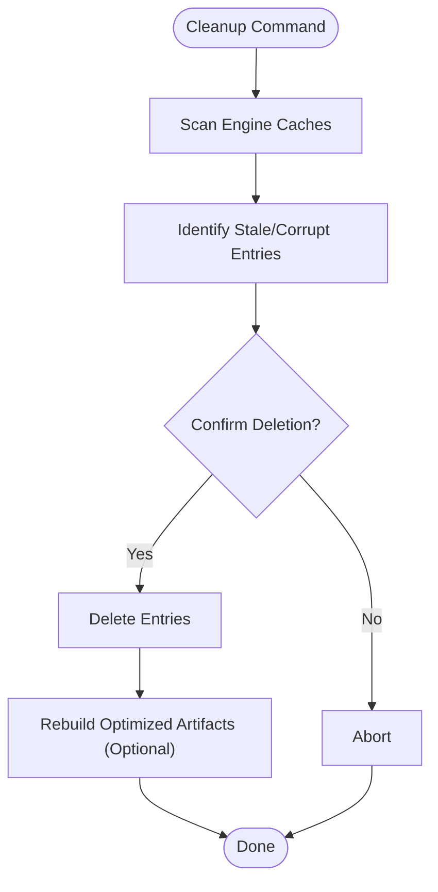
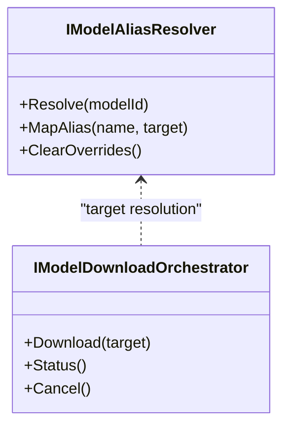
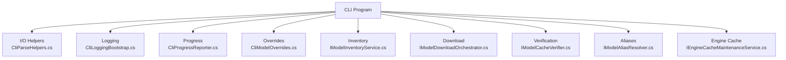

# Model Management Commands

<cite>
**Referenced Files in This Document**
- [Program.cs](file://src/Trackdub.Cli/Program.cs)
- [CliModelOverrides.cs](file://src/Trackdub.Cli/CliModelOverrides.cs)
- [CliProgressReporter.cs](file://src/Trackdub.Cli/CliProgressReporter.cs)
- [CliBatchCommandHelpers.cs](file://src/Trackdub.Cli/CliBatchCommandHelpers.cs)
- [CliParseHelpers.cs](file://src/Trackdub.Cli/CliParseHelpers.cs)
- [CliStageFilter.cs](file://src/Trackdub.Cli/CliStageFilter.cs)
- [CliJsonOptions.cs](file://src/Trackdub.Cli/CliJsonOptions.cs)
- [CliErrorReporter.cs](file://src/Trackdub.Cli/CliErrorReporter.cs)
- [CliLoggingConfiguration.cs](file://src/Trackdub.Cli/CliLoggingConfiguration.cs)
- [CliLoggingBootstrap.cs](file://src/Trackdub.Cli/CliLoggingBootstrap.cs)
- [CliCompletionScripts.cs](file://src/Trackdub.Cli/CliCompletionScripts.cs)
- [CliCompletionLineNormalizer.cs](file://src/Trackdub.Cli/CliCompletionLineNormalizer.cs)
- [CliBatchCommandHelpers.cs](file://src/Trackdub.Cli/CliBatchCommandHelpers.cs)
- [IModelInventoryService.cs](file://src/Trackdub.Contracts/IModelInventoryService.cs)
- [IModelDownloadOrchestrator.cs](file://src/Trackdub.Contracts/IModelDownloadOrchestrator.cs)
- [IModelCacheVerifier.cs](file://src/Trackdub.Contracts/IModelCacheVerifier.cs)
- [IModelAliasResolver.cs](file://src/Trackdub.Contracts/IModelAliasResolver.cs)
- [IEngineCacheMaintenanceService.cs](file://src/Trackdub.Contracts/IEngineCacheMaintenanceService.cs)
- [StarterPacks-v1-design.md](file://docs/specs/starter-packs-v1-design.md)
- [bundled-models-manifest-architecture.md](file://docs/specs/bundled-models-manifest-architecture.md)
- [starter-packs-v1-design.md](file://docs/specs/starter-packs-v1-design.md)
- [MODEL_LICENSE_POLICY.md](file://docs/legal/MODEL_LICENSE_POLICY.md)
- [THIRD_PARTY_NOTICES.md](file://docs/legal/THIRD_PARTY_NOTICES.md)
- [TROUBLESHOOTING.md](file://docs/development/TROUBLESHOOTING.md)
- [README.md](file://README.md)
</cite>

## Table of Contents
1. [Introduction](#introduction)
2. [Project Structure](#project-structure)
3. [Core Components](#core-components)
4. [Architecture Overview](#architecture-overview)
5. [Detailed Component Analysis](#detailed-component-analysis)
6. [Dependency Analysis](#dependency-analysis)
7. [Performance Considerations](#performance-considerations)
8. [Troubleshooting Guide](#troubleshooting-guide)
9. [Conclusion](#conclusion)
10. [Appendices](#appendices)

## Introduction
This document explains Trackdub’s model management commands and workflows for downloading, installing, updating, and managing AI models used across Automatic Speech Recognition (ASR), Text-to-Speech (TTS), translation, and lip-sync pipelines. It covers model discovery, version management, compatibility checks, starter pack installation, model overrides, caching strategies, storage locations, cleanup operations, custom model integration, and optimization workflows. The goal is to help both new users and advanced operators configure and maintain a reliable model ecosystem.

## Project Structure
Trackdub exposes model management through its CLI layer and supports it via contracts and domain services. Key areas include:
- CLI entry point and command wiring
- Model override configuration parsing
- Progress reporting and logging bootstrap
- Batch helpers and stage filtering for long-running model operations
- Contract interfaces defining model inventory, download orchestration, cache verification, alias resolution, and engine cache maintenance

```mermaid
graph TB
CLI["CLI Entry<br/>Program.cs"] --> Overrides["Model Overrides Parser<br/>CliModelOverrides.cs"]
CLI --> Logging["Logging Bootstrap<br/>CliLoggingBootstrap.cs"]
CLI --> Progress["Progress Reporter<br/>CliProgressReporter.cs"]
CLI --> Helpers["Batch Helpers<br/>CliBatchCommandHelpers.cs"]
CLI --> StageFilter["Stage Filter<br/>CliStageFilter.cs"]
CLI --> JsonOpts["JSON Options<br/>CliJsonOptions.cs"]
CLI --> ErrorReporter["Error Reporter<br/>CliErrorReporter.cs"]
CLI --> Completion["Completion Scripts<br/>CliCompletionScripts.cs"]
CLI --> ParseHelpers["Parse Helpers<br/>CliParseHelpers.cs"]
subgraph "Contracts"
MI["IModelInventoryService"]
MD["IModelDownloadOrchestrator"]
MC["IModelCacheVerifier"]
MA["IModelAliasResolver"]
EC["IEngineCacheMaintenanceService"]
end
CLI --> MI
CLI --> MD
CLI --> MC
CLI --> MA
CLI --> EC
```



**Diagram sources**
- [Program.cs](file://src/Trackdub.Cli/Program.cs)
- [CliModelOverrides.cs](file://src/Trackdub.Cli/CliModelOverrides.cs)
- [CliLoggingBootstrap.cs](file://src/Trackdub.Cli/CliLoggingBootstrap.cs)
- [CliProgressReporter.cs](file://src/Trackdub.Cli/CliProgressReporter.cs)
- [CliBatchCommandHelpers.cs](file://src/Trackdub.Cli/CliBatchCommandHelpers.cs)
- [CliStageFilter.cs](file://src/Trackdub.Cli/CliStageFilter.cs)
- [CliJsonOptions.cs](file://src/Trackdub.Cli/CliJsonOptions.cs)
- [CliErrorReporter.cs](file://src/Trackdub.Cli/CliErrorReporter.cs)
- [CliCompletionScripts.cs](file://src/Trackdub.Cli/CliCompletionScripts.cs)
- [CliParseHelpers.cs](file://src/Trackdub.Cli/CliParseHelpers.cs)
- [IModelInventoryService.cs](file://src/Trackdub.Contracts/IModelInventoryService.cs)
- [IModelDownloadOrchestrator.cs](file://src/Trackdub.Contracts/IModelDownloadOrchestrator.cs)
- [IModelCacheVerifier.cs](file://src/Trackdub.Contracts/IModelCacheVerifier.cs)
- [IModelAliasResolver.cs](file://src/Trackdub.Contracts/IModelAliasResolver.cs)
- [IEngineCacheMaintenanceService.cs](file://src/Trackdub.Contracts/IEngineCacheMaintenanceService.cs)

**Section sources**
- [Program.cs](file://src/Trackdub.Cli/Program.cs)
- [CliModelOverrides.cs](file://src/Trackdub.Cli/CliModelOverrides.cs)
- [CliLoggingBootstrap.cs](file://src/Trackdub.Cli/CliLoggingBootstrap.cs)
- [CliProgressReporter.cs](file://src/Trackdub.Cli/CliProgressReporter.cs)
- [CliBatchCommandHelpers.cs](file://src/Trackdub.Cli/CliBatchCommandHelpers.cs)
- [CliStageFilter.cs](file://src/Trackdub.Cli/CliStageFilter.cs)
- [CliJsonOptions.cs](file://src/Trackdub.Cli/CliJsonOptions.cs)
- [CliErrorReporter.cs](file://src/Trackdub.Cli/CliErrorReporter.cs)
- [CliCompletionScripts.cs](file://src/Trackdub.Cli/CliCompletionScripts.cs)
- [CliParseHelpers.cs](file://src/Trackdub.Cli/CliParseHelpers.cs)
- [IModelInventoryService.cs](file://src/Trackdub.Contracts/IModelInventoryService.cs)
- [IModelDownloadOrchestrator.cs](file://src/Trackdub.Contracts/IModelDownloadOrchestrator.cs)
- [IModelCacheVerifier.cs](file://src/Trackdub.Contracts/IModelCacheVerifier.cs)
- [IModelAliasResolver.cs](file://src/Trackdub.Contracts/IModelAliasResolver.cs)
- [IEngineCacheMaintenanceService.cs](file://src/Trackdub.Contracts/IEngineCacheMaintenanceService.cs)

## Core Components
- Model Inventory Service: Provides listing, querying, and metadata access for installed models.
- Download Orchestrator: Manages fetching models from repositories or local sources with progress and retry semantics.
- Cache Verifier: Validates cached artifacts, checksums, and compatibility against runtime requirements.
- Alias Resolver: Maps logical model names to concrete versions or paths, supporting overrides and presets.
- Engine Cache Maintenance: Handles cleanup, pruning, and optimization of execution provider caches.

These components are exposed to the CLI through typed options and helpers that support batch operations, stage filtering, JSON output, and robust error reporting.

**Section sources**
- [IModelInventoryService.cs](file://src/Trackdub.Contracts/IModelInventoryService.cs)
- [IModelDownloadOrchestrator.cs](file://src/Trackdub.Contracts/IModelDownloadOrchestrator.cs)
- [IModelCacheVerifier.cs](file://src/Trackdub.Contracts/IModelCacheVerifier.cs)
- [IModelAliasResolver.cs](file://src/Trackdub.Contracts/IModelAliasResolver.cs)
- [IEngineCacheMaintenanceService.cs](file://src/Trackdub.Contracts/IEngineCacheMaintenanceService.cs)

## Architecture Overview
The model management flow integrates CLI commands with contract services to ensure consistent behavior across ASR, TTS, translation, and lip-sync model lifecycles.



**Diagram sources**
- [Program.cs](file://src/Trackdub.Cli/Program.cs)
- [CliModelOverrides.cs](file://src/Trackdub.Cli/CliModelOverrides.cs)
- [IModelInventoryService.cs](file://src/Trackdub.Contracts/IModelInventoryService.cs)
- [IModelDownloadOrchestrator.cs](file://src/Trackdub.Contracts/IModelDownloadOrchestrator.cs)
- [IModelCacheVerifier.cs](file://src/Trackdub.Contracts/IModelCacheVerifier.cs)
- [IModelAliasResolver.cs](file://src/Trackdub.Contracts/IModelAliasResolver.cs)
- [IEngineCacheMaintenanceService.cs](file://src/Trackdub.Contracts/IEngineCacheMaintenanceService.cs)

## Detailed Component Analysis

### CLI Command Wiring and Execution
- Program orchestrates command registration, argument parsing, and service composition.
- Logging bootstrap initializes structured logs and severity levels for model operations.
- Progress reporter streams real-time updates for downloads and installations.
- Batch helpers enable running model tasks across multiple items with controlled concurrency.
- Stage filter allows selecting specific pipeline stages when validating or optimizing models.
- JSON options provide machine-readable outputs for automation.
- Error reporter centralizes user-friendly messages and diagnostics.
- Completion scripts and line normalizers improve shell experience.



**Diagram sources**
- [Program.cs](file://src/Trackdub.Cli/Program.cs)
- [CliLoggingBootstrap.cs](file://src/Trackdub.Cli/CliLoggingBootstrap.cs)
- [CliProgressReporter.cs](file://src/Trackdub.Cli/CliProgressReporter.cs)
- [CliBatchCommandHelpers.cs](file://src/Trackdub.Cli/CliBatchCommandHelpers.cs)
- [CliStageFilter.cs](file://src/Trackdub.Cli/CliStageFilter.cs)
- [CliJsonOptions.cs](file://src/Trackdub.Cli/CliJsonOptions.cs)
- [CliErrorReporter.cs](file://src/Trackdub.Cli/CliErrorReporter.cs)
- [CliCompletionScripts.cs](file://src/Trackdub.Cli/CliCompletionScripts.cs)
- [CliParseHelpers.cs](file://src/Trackdub.Cli/CliParseHelpers.cs)

**Section sources**
- [Program.cs](file://src/Trackdub.Cli/Program.cs)
- [CliLoggingBootstrap.cs](file://src/Trackdub.Cli/CliLoggingBootstrap.cs)
- [CliProgressReporter.cs](file://src/Trackdub.Cli/CliProgressReporter.cs)
- [CliBatchCommandHelpers.cs](file://src/Trackdub.Cli/CliBatchCommandHelpers.cs)
- [CliStageFilter.cs](file://src/Trackdub.Cli/CliStageFilter.cs)
- [CliJsonOptions.cs](file://src/Trackdub.Cli/CliJsonOptions.cs)
- [CliErrorReporter.cs](file://src/Trackdub.Cli/CliErrorReporter.cs)
- [CliCompletionScripts.cs](file://src/Trackdub.Cli/CliCompletionScripts.cs)
- [CliParseHelpers.cs](file://src/Trackdub.Cli/CliParseHelpers.cs)

### Model Overrides Configuration
- CliModelOverrides parses user-provided overrides for model selection, version pinning, and path remapping.
- Overrides integrate with alias resolution to prioritize explicit configurations over defaults.
- Supports per-command and global override scopes depending on CLI context.



**Diagram sources**
- [CliModelOverrides.cs](file://src/Trackdub.Cli/CliModelOverrides.cs)
- [IModelAliasResolver.cs](file://src/Trackdub.Contracts/IModelAliasResolver.cs)

**Section sources**
- [CliModelOverrides.cs](file://src/Trackdub.Cli/CliModelOverrides.cs)
- [IModelAliasResolver.cs](file://src/Trackdub.Contracts/IModelAliasResolver.cs)

### Starter Packs Installation
- Starter packs bundle recommended models for common workflows (ASR, TTS, translation, lip-sync).
- The design specifies manifest structure, component selection, and compatibility constraints.
- CLI commands can install starter packs, verify included models, and update them as a group.



**Diagram sources**
- [StarterPacks-v1-design.md](file://docs/specs/starter-packs-v1-design.md)
- [bundled-models-manifest-architecture.md](file://docs/specs/bundled-models-manifest-architecture.md)

**Section sources**
- [StarterPacks-v1-design.md](file://docs/specs/starter-packs-v1-design.md)
- [bundled-models-manifest-architecture.md](file://docs/specs/bundled-models-manifest-architecture.md)

### Model Discovery and Version Management
- Inventory service lists installed and available models, including metadata like version, size, and supported runtimes.
- Download orchestrator supports semantic versioning, tags, and pinned releases.
- Cache verifier ensures artifact integrity and runtime compatibility before activation.
- Alias resolver maps friendly names to concrete model identifiers and versions.



**Diagram sources**
- [IModelInventoryService.cs](file://src/Trackdub.Contracts/IModelInventoryService.cs)
- [IModelDownloadOrchestrator.cs](file://src/Trackdub.Contracts/IModelDownloadOrchestrator.cs)
- [IModelCacheVerifier.cs](file://src/Trackdub.Contracts/IModelCacheVerifier.cs)
- [IModelAliasResolver.cs](file://src/Trackdub.Contracts/IModelAliasResolver.cs)

**Section sources**
- [IModelInventoryService.cs](file://src/Trackdub.Contracts/IModelInventoryService.cs)
- [IModelDownloadOrchestrator.cs](file://src/Trackdub.Contracts/IModelDownloadOrchestrator.cs)
- [IModelCacheVerifier.cs](file://src/Trackdub.Contracts/IModelCacheVerifier.cs)
- [IModelAliasResolver.cs](file://src/Trackdub.Contracts/IModelAliasResolver.cs)

### Compatibility Checking
- Cache verifier validates model artifacts against expected hashes and runtime capabilities.
- Alias resolver enforces compatibility rules defined by manifests and overrides.
- CLI provides explicit check commands to validate readiness before pipeline runs.



**Diagram sources**
- [IModelCacheVerifier.cs](file://src/Trackdub.Contracts/IModelCacheVerifier.cs)
- [IModelAliasResolver.cs](file://src/Trackdub.Contracts/IModelAliasResolver.cs)

**Section sources**
- [IModelCacheVerifier.cs](file://src/Trackdub.Contracts/IModelCacheVerifier.cs)
- [IModelAliasResolver.cs](file://src/Trackdub.Contracts/IModelAliasResolver.cs)

### Model Caching Strategies and Storage Locations
- Cached artifacts are validated and reused to avoid redundant downloads.
- Storage locations are organized by model type and version to support parallel usage and isolation.
- Engine caches store optimized execution provider artifacts; maintenance routines prune unused entries.

[No sources needed since this section provides general guidance]

### Cleanup Operations
- Engine cache maintenance service supports pruning stale or corrupted caches.
- CLI exposes cleanup commands to reclaim disk space and refresh optimized artifacts.
- Batch helpers allow selective cleanup based on filters (e.g., by model family or age).



**Diagram sources**
- [IEngineCacheMaintenanceService.cs](file://src/Trackdub.Contracts/IEngineCacheMaintenanceService.cs)

**Section sources**
- [IEngineCacheMaintenanceService.cs](file://src/Trackdub.Contracts/IEngineCacheMaintenanceService.cs)

### Custom Model Integration
- Use alias resolver to map custom model paths or repository URLs to logical names.
- Provide manifests or metadata files to describe model capabilities and versions.
- Integrate with download orchestrator for automated retrieval and validation.



**Diagram sources**
- [IModelAliasResolver.cs](file://src/Trackdub.Contracts/IModelAliasResolver.cs)
- [IModelDownloadOrchestrator.cs](file://src/Trackdub.Contracts/IModelDownloadOrchestrator.cs)

**Section sources**
- [IModelAliasResolver.cs](file://src/Trackdub.Contracts/IModelAliasResolver.cs)
- [IModelDownloadOrchestrator.cs](file://src/Trackdub.Contracts/IModelDownloadOrchestrator.cs)

### Model Optimization Workflows
- After installation, optimize models for target execution providers (e.g., CUDA, WebGPU, CPU).
- Use stage filter to limit optimization to relevant pipeline stages.
- Monitor progress and validate results with cache verifier.

```mermaid
sequenceDiagram
participant U as "User"
participant CLI as "CLI"
participant DL as "Download"
participant OPT as "Optimizer"
participant CV as "Cache Verifier"
U->>CLI : optimize --model=asr-small --provider=cuda
CLI->>DL : Ensure base model present
DL-->>CLI : Ready
CLI->>OPT : Optimize(model, provider)
OPT-->>CLI : Progress
CLI->>CV : Validate optimized artifacts
CV-->>CLI : Valid
CLI-->>U : Optimization complete
```

**Diagram sources**
- [IModelDownloadOrchestrator.cs](file://src/Trackdub.Contracts/IModelDownloadOrchestrator.cs)
- [IModelCacheVerifier.cs](file://src/Trackdub.Contracts/IModelCacheVerifier.cs)

**Section sources**
- [IModelDownloadOrchestrator.cs](file://src/Trackdub.Contracts/IModelDownloadOrchestrator.cs)
- [IModelCacheVerifier.cs](file://src/Trackdub.Contracts/IModelCacheVerifier.cs)

## Dependency Analysis
The CLI depends on contract services to abstract model lifecycle operations. This decoupling enables testing, replacement, and extension without changing command wiring.



**Diagram sources**
- [Program.cs](file://src/Trackdub.Cli/Program.cs)
- [CliParseHelpers.cs](file://src/Trackdub.Cli/CliParseHelpers.cs)
- [CliLoggingBootstrap.cs](file://src/Trackdub.Cli/CliLoggingBootstrap.cs)
- [CliProgressReporter.cs](file://src/Trackdub.Cli/CliProgressReporter.cs)
- [CliModelOverrides.cs](file://src/Trackdub.Cli/CliModelOverrides.cs)
- [IModelInventoryService.cs](file://src/Trackdub.Contracts/IModelInventoryService.cs)
- [IModelDownloadOrchestrator.cs](file://src/Trackdub.Contracts/IModelDownloadOrchestrator.cs)
- [IModelCacheVerifier.cs](file://src/Trackdub.Contracts/IModelCacheVerifier.cs)
- [IModelAliasResolver.cs](file://src/Trackdub.Contracts/IModelAliasResolver.cs)
- [IEngineCacheMaintenanceService.cs](file://src/Trackdub.Contracts/IEngineCacheMaintenanceService.cs)

**Section sources**
- [Program.cs](file://src/Trackdub.Cli/Program.cs)
- [CliParseHelpers.cs](file://src/Trackdub.Cli/CliParseHelpers.cs)
- [CliLoggingBootstrap.cs](file://src/Trackdub.Cli/CliLoggingBootstrap.cs)
- [CliProgressReporter.cs](file://src/Trackdub.Cli/CliProgressReporter.cs)
- [CliModelOverrides.cs](file://src/Trackdub.Cli/CliModelOverrides.cs)
- [IModelInventoryService.cs](file://src/Trackdub.Contracts/IModelInventoryService.cs)
- [IModelDownloadOrchestrator.cs](file://src/Trackdub.Contracts/IModelDownloadOrchestrator.cs)
- [IModelCacheVerifier.cs](file://src/Trackdub.Contracts/IModelCacheVerifier.cs)
- [IModelAliasResolver.cs](file://src/Trackdub.Contracts/IModelAliasResolver.cs)
- [IEngineCacheMaintenanceService.cs](file://src/Trackdub.Contracts/IEngineCacheMaintenanceService.cs)

## Performance Considerations
- Prefer using cached artifacts to minimize network overhead and repeated downloads.
- Limit concurrent downloads and optimizations to avoid saturating I/O and GPU memory.
- Validate compatibility early to prevent costly failures late in the pipeline.
- Use targeted filters for list/check/optimize commands to reduce processing time.
- Regularly clean engine caches to free space and ensure optimal performance.

[No sources needed since this section provides general guidance]

## Troubleshooting Guide
Common issues and resolutions:
- Model loading fails due to incompatible runtime: Run compatibility checks and verify execution provider availability.
- Download interruptions: Use retry flags and ensure stable connectivity; inspect logs for errors.
- Corrupted cache artifacts: Trigger cache verification and re-download affected models.
- License restrictions: Review model license policies and third-party notices to ensure compliance.
- Insufficient disk space: Perform cleanup operations and remove unused models or optimized artifacts.

For detailed steps, consult the development troubleshooting guide and legal policy documents.

**Section sources**
- [TROUBLESHOOTING.md](file://docs/development/TROUBLESHOOTING.md)
- [MODEL_LICENSE_POLICY.md](file://docs/legal/MODEL_LICENSE_POLICY.md)
- [THIRD_PARTY_NOTICES.md](file://docs/legal/THIRD_PARTY_NOTICES.md)

## Conclusion
Trackdub’s model management commands provide a robust, extensible framework for handling AI models across multiple domains. By leveraging inventory, download orchestration, cache verification, alias resolution, and engine cache maintenance, users can reliably discover, install, update, and optimize models while maintaining compatibility and performance. Starter packs simplify initial setup, and overrides enable fine-grained control for advanced scenarios.

[No sources needed since this section summarizes without analyzing specific files]

## Appendices
- Refer to the README for high-level project overview and quick start instructions.
- Consult specs for starter packs and bundled models manifest architecture for deeper understanding.

**Section sources**
- [README.md](file://README.md)
- [StarterPacks-v1-design.md](file://docs/specs/starter-packs-v1-design.md)
- [bundled-models-manifest-architecture.md](file://docs/specs/bundled-models-manifest-architecture.md)