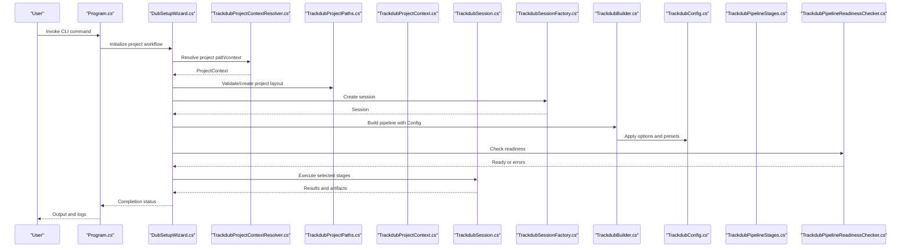
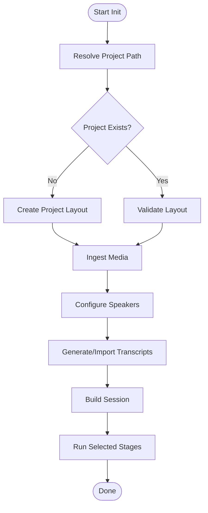
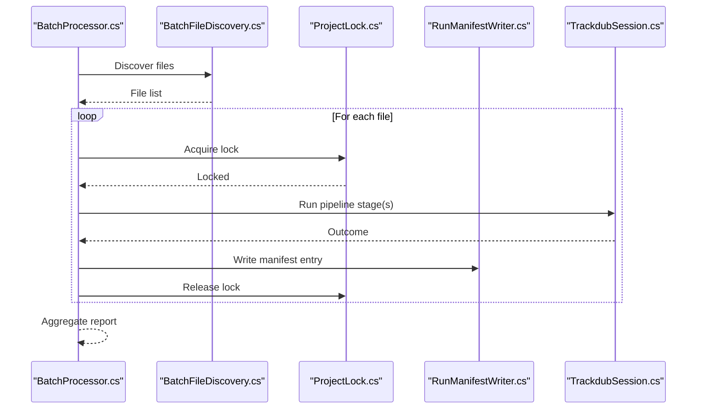
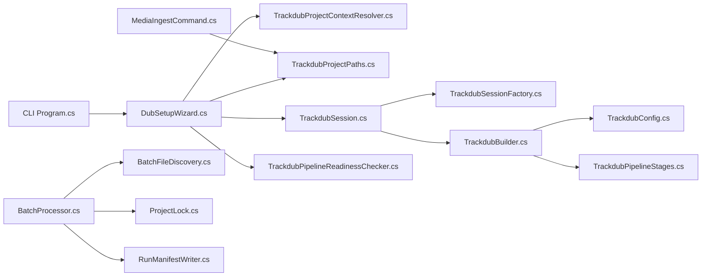

# Project Operations Commands

<cite>
**Referenced Files in This Document**
- [Program.cs](file://src/Trackdub.Cli/Program.cs)
- [CliBatchCommandHelpers.cs](file://src/Trackdub.Cli/CliBatchCommandHelpers.cs)
- [DubSetupWizard.cs](file://src/Trackdub.Cli/DubSetupWizard.cs)
- [CliProgressRunner.cs](file://src/Trackdub.Cli/CliProgressRunner.cs)
- [CliJsonOptions.cs](file://src/Trackdub.Cli/CliJsonOptions.cs)
- [CliErrorReporter.cs](file://src/Trackdub.Cli/CliErrorReporter.cs)
- [CliLoggingBootstrap.cs](file://src/Trackdub.Cli/CliLoggingBootstrap.cs)
- [CliModelOverrides.cs](file://src/Trackdub.Cli/CliModelOverrides.cs)
- [CliParseHelpers.cs](file://src/Trackdub.Cli/CliParseHelpers.cs)
- [CliStageFilter.cs](file://src/Trackdub.Cli/CliStageFilter.cs)
- [TrackdubProjectContextResolver.cs](file://src/Trackdub.Sdk/TrackdubProjectContextResolver.cs)
- [TrackdubProjectPaths.cs](file://src/Trackdub.Sdk/TrackdubProjectPaths.cs)
- [TrackdubProjectContext.cs](file://src/Trackdub.Sdk/TrackdubProjectContext.cs)
- [TrackdubSession.cs](file://src/Trackdub.Sdk/TrackdubSession.cs)
- [TrackdubSessionFactory.cs](file://src/Trackdub.Sdk/TrackdubSessionFactory.cs)
- [TrackdubBuilder.cs](file://src/Trackdub.Sdk/TrackdubBuilder.cs)
- [TrackdubConfig.cs](file://src/Trackdub.Sdk/TrackdubConfig.cs)
- [TrackdubOptions.cs](file://src/Trackdub.Sdk/TrackdubOptions.cs)
- [BatchProcessor.cs](file://src/Trackdub.Sdk/BatchProcessor.cs)
- [BatchFileDiscovery.cs](file://src/Trackdub.Sdk/BatchFileDiscovery.cs)
- [RunManifestWriter.cs](file://src/Trackdub.Sdk/RunManifestWriter.cs)
- [ProjectLock.cs](file://src/Trackdub.Sdk/ProjectLock.cs)
- [TrackdubPipelineStages.cs](file://src/Trackdub.Sdk/TrackdubPipelineStages.cs)
- [TrackdubPipelineReadinessChecker.cs](file://src/Trackdub.Sdk/TrackdubPipelineReadinessChecker.cs)
- [MediaIngestCommand.cs](file://src/Trackdub.Tools/MediaIngestCommand.cs)
- [README.md](file://src/Trackdub.Cli/README.md)
- [README.md](file://src/Trackdub.Sdk/README.md)
</cite>

## Table of Contents
1. [Introduction](#introduction)
2. [Project Structure](#project-structure)
3. [Core Components](#core-components)
4. [Architecture Overview](#architecture-overview)
5. [Detailed Component Analysis](#detailed-component-analysis)
6. [Dependency Analysis](#dependency-analysis)
7. [Performance Considerations](#performance-considerations)
8. [Troubleshooting Guide](#troubleshooting-guide)
9. [Conclusion](#conclusion)
10. [Appendices](#appendices)

## Introduction
This document explains Trackdub’s project operation commands and workflows for creating, initializing, and managing dubbing projects. It covers project structure setup, media ingestion, configuration management, lifecycle operations (importing media, setting up speakers, managing transcripts), exporting results, batch operations, automation scripts, serialization formats, backup procedures, and migration between versions. The goal is to help both new users and operators run projects reliably and efficiently via CLI or SDK.

## Project Structure
Trackdub exposes a CLI entry point that wires command handlers, progress reporting, logging, and model overrides. The SDK provides the project context, session lifecycle, pipeline stages, and batch processing utilities. Tools include specialized commands such as media ingestion.

```mermaid
graph TB
subgraph "CLI"
P["Program.cs"]
W["DubSetupWizard.cs"]
PR["CliProgressRunner.cs"]
JO["CliJsonOptions.cs"]
ER["CliErrorReporter.cs"]
LB["CliLoggingBootstrap.cs"]
MO["CliModelOverrides.cs"]
PH["CliParseHelpers.cs"]
SF["CliStageFilter.cs"]
end
subgraph "SDK"
PCR["TrackdubProjectContextResolver.cs"]
PP["TrackdubProjectPaths.cs"]
PC["TrackdubProjectContext.cs"]
SS["TrackdubSession.cs"]
SFACT["TrackdubSessionFactory.cs"]
BLD["TrackdubBuilder.cs"]
CFG["TrackdubConfig.cs"]
OPT["TrackdubOptions.cs"]
BP["BatchProcessor.cs"]
BFD["BatchFileDiscovery.cs"]
RMW["RunManifestWriter.cs"]
PL["ProjectLock.cs"]
STAGES["TrackdubPipelineStages.cs"]
RC["TrackdubPipelineReadinessChecker.cs"]
end
subgraph "Tools"
MIC["MediaIngestCommand.cs"]
end
P --> W
P --> PR
P --> JO
P --> ER
P --> LB
P --> MO
P --> PH
P --> SF
W --> PCR
W --> PP
W --> PC
W --> SS
W --> SFACT
W --> BLD
W --> CFG
W --> OPT
W --> STAGES
W --> RC
BP --> BFD
BP --> RMW
BP --> PL
BP --> SS
```

**Diagram sources**
- [Program.cs](file://src/Trackdub.Cli/Program.cs)
- [DubSetupWizard.cs](file://src/Trackdub.Cli/DubSetupWizard.cs)
- [CliProgressRunner.cs](file://src/Trackdub.Cli/CliProgressRunner.cs)
- [CliJsonOptions.cs](file://src/Trackdub.Cli/CliJsonOptions.cs)
- [CliErrorReporter.cs](file://src/Trackdub.Cli/CliErrorReporter.cs)
- [CliLoggingBootstrap.cs](file://src/Trackdub.Cli/CliLoggingBootstrap.cs)
- [CliModelOverrides.cs](file://src/Trackdub.Cli/CliModelOverrides.cs)
- [CliParseHelpers.cs](file://src/Trackdub.Cli/CliParseHelpers.cs)
- [CliStageFilter.cs](file://src/Trackdub.Cli/CliStageFilter.cs)
- [TrackdubProjectContextResolver.cs](file://src/Trackdub.Sdk/TrackdubProjectContextResolver.cs)
- [TrackdubProjectPaths.cs](file://src/Trackdub.Sdk/TrackdubProjectPaths.cs)
- [TrackdubProjectContext.cs](file://src/Trackdub.Sdk/TrackdubProjectContext.cs)
- [TrackdubSession.cs](file://src/Trackdub.Sdk/TrackdubSession.cs)
- [TrackdubSessionFactory.cs](file://src/Trackdub.Sdk/TrackdubSessionFactory.cs)
- [TrackdubBuilder.cs](file://src/Trackdub.Sdk/TrackdubBuilder.cs)
- [TrackdubConfig.cs](file://src/Trackdub.Sdk/TrackdubConfig.cs)
- [TrackdubOptions.cs](file://src/Trackdub.Sdk/TrackdubOptions.cs)
- [BatchProcessor.cs](file://src/Trackdub.Sdk/BatchProcessor.cs)
- [BatchFileDiscovery.cs](file://src/Trackdub.Sdk/BatchFileDiscovery.cs)
- [RunManifestWriter.cs](file://src/Trackdub.Sdk/RunManifestWriter.cs)
- [ProjectLock.cs](file://src/Trackdub.Sdk/ProjectLock.cs)
- [TrackdubPipelineStages.cs](file://src/Trackdub.Sdk/TrackdubPipelineStages.cs)
- [TrackdubPipelineReadinessChecker.cs](file://src/Trackdub.Sdk/TrackdubPipelineReadinessChecker.cs)
- [MediaIngestCommand.cs](file://src/Trackdub.Tools/MediaIngestCommand.cs)

**Section sources**
- [Program.cs](file://src/Trackdub.Cli/Program.cs)
- [README.md](file://src/Trackdub.Cli/README.md)
- [README.md](file://src/Trackdub.Sdk/README.md)

## Core Components
- CLI Entry and Command Wiring: Program orchestrates command registration, parsing, and execution flow.
- Setup Wizard: Guides interactive project initialization, media import, speaker setup, and transcript creation.
- Progress and Reporting: CliProgressRunner provides consistent progress output across commands.
- JSON Options and Parsing: CliJsonOptions and CliParseHelpers enable structured input/output and robust parsing.
- Error Reporting: CliErrorReporter centralizes error formatting and exit codes.
- Logging Bootstrap: CliLoggingBootstrap configures logging for CLI runs.
- Model Overrides: CliModelOverrides allows runtime model selection and tuning.
- Stage Filtering: CliStageFilter supports running specific pipeline stages.
- SDK Project Context: TrackdubProjectContextResolver and TrackdubProjectPaths resolve and manage project locations and metadata.
- Session Lifecycle: TrackdubSession and TrackdubSessionFactory manage long-running sessions and resource cleanup.
- Builder and Configuration: TrackdubBuilder and TrackdubConfig assemble pipelines and apply options.
- Batch Processing: BatchProcessor, BatchFileDiscovery, RunManifestWriter, and ProjectLock support automated multi-file runs.
- Pipeline Stages and Readiness: TrackdubPipelineStages enumerates stages; TrackdubPipelineReadinessChecker validates environment readiness.
- Tools: MediaIngestCommand assists with importing and validating media assets.

**Section sources**
- [Program.cs](file://src/Trackdub.Cli/Program.cs)
- [DubSetupWizard.cs](file://src/Trackdub.Cli/DubSetupWizard.cs)
- [CliProgressRunner.cs](file://src/Trackdub.Cli/CliProgressRunner.cs)
- [CliJsonOptions.cs](file://src/Trackdub.Cli/CliJsonOptions.cs)
- [CliErrorReporter.cs](file://src/Trackdub.Cli/CliErrorReporter.cs)
- [CliLoggingBootstrap.cs](file://src/Trackdub.Cli/CliLoggingBootstrap.cs)
- [CliModelOverrides.cs](file://src/Trackdub.Cli/CliModelOverrides.cs)
- [CliParseHelpers.cs](file://src/Trackdub.Cli/CliParseHelpers.cs)
- [CliStageFilter.cs](file://src/Trackdub.Cli/CliStageFilter.cs)
- [TrackdubProjectContextResolver.cs](file://src/Trackdub.Sdk/TrackdubProjectContextResolver.cs)
- [TrackdubProjectPaths.cs](file://src/Trackdub.Sdk/TrackdubProjectPaths.cs)
- [TrackdubProjectContext.cs](file://src/Trackdub.Sdk/TrackdubProjectContext.cs)
- [TrackdubSession.cs](file://src/Trackdub.Sdk/TrackdubSession.cs)
- [TrackdubSessionFactory.cs](file://src/Trackdub.Sdk/TrackdubSessionFactory.cs)
- [TrackdubBuilder.cs](file://src/Trackdub.Sdk/TrackdubBuilder.cs)
- [TrackdubConfig.cs](file://src/Trackdub.Sdk/TrackdubConfig.cs)
- [TrackdubOptions.cs](file://src/Trackdub.Sdk/TrackdubOptions.cs)
- [BatchProcessor.cs](file://src/Trackdub.Sdk/BatchProcessor.cs)
- [BatchFileDiscovery.cs](file://src/Trackdub.Sdk/BatchFileDiscovery.cs)
- [RunManifestWriter.cs](file://src/Trackdub.Sdk/RunManifestWriter.cs)
- [ProjectLock.cs](file://src/Trackdub.Sdk/ProjectLock.cs)
- [TrackdubPipelineStages.cs](file://src/Trackdub.Sdk/TrackdubPipelineStages.cs)
- [TrackdubPipelineReadinessChecker.cs](file://src/Trackdub.Sdk/TrackdubPipelineReadinessChecker.cs)
- [MediaIngestCommand.cs](file://src/Trackdub.Tools/MediaIngestCommand.cs)

## Architecture Overview
The CLI bootstraps logging, parses options, and delegates to command handlers. For project operations, the Setup Wizard resolves project paths, constructs a project context, initializes a session, and executes pipeline stages. Batch operations use discovery, locking, and manifest writing to coordinate multiple files.

**Diagram sources**
- [Program.cs](file://src/Trackdub.Cli/Program.cs)
- [DubSetupWizard.cs](file://src/Trackdub.Cli/DubSetupWizard.cs)
- [TrackdubProjectContextResolver.cs](file://src/Trackdub.Sdk/TrackdubProjectContextResolver.cs)
- [TrackdubProjectPaths.cs](file://src/Trackdub.Sdk/TrackdubProjectPaths.cs)
- [TrackdubProjectContext.cs](file://src/Trackdub.Sdk/TrackdubProjectContext.cs)
- [TrackdubSession.cs](file://src/Trackdub.Sdk/TrackdubSession.cs)
- [TrackdubSessionFactory.cs](file://src/Trackdub.Sdk/TrackdubSessionFactory.cs)
- [TrackdubBuilder.cs](file://src/Trackdub.Sdk/TrackdubBuilder.cs)
- [TrackdubConfig.cs](file://src/Trackdub.Sdk/TrackdubConfig.cs)
- [TrackdubPipelineStages.cs](file://src/Trackdub.Sdk/TrackdubPipelineStages.cs)
- [TrackdubPipelineReadinessChecker.cs](file://src/Trackdub.Sdk/TrackdubPipelineReadinessChecker.cs)

## Detailed Component Analysis

### CLI Command Entry and Execution
- Program registers commands, parses arguments, and invokes handlers. It integrates logging bootstrap, error reporting, and progress runners.
- Use this component to understand how CLI flags map to internal options and how outputs are formatted.

**Section sources**
- [Program.cs](file://src/Trackdub.Cli/Program.cs)
- [CliLoggingBootstrap.cs](file://src/Trackdub.Cli/CliLoggingBootstrap.cs)
- [CliErrorReporter.cs](file://src/Trackdub.Cli/CliErrorReporter.cs)
- [CliProgressRunner.cs](file://src/Trackdub.Cli/CliProgressRunner.cs)

### Project Initialization Workflow
- DubSetupWizard guides users through creating a project directory, ingesting media, configuring speakers, and generating initial transcripts.
- It uses TrackdubProjectContextResolver to locate or create a project context and TrackdubProjectPaths to enforce a consistent layout.
- After setup, it builds a session via TrackdubSessionFactory and executes pipeline stages defined by TrackdubPipelineStages.

**Diagram sources**
- [DubSetupWizard.cs](file://src/Trackdub.Cli/DubSetupWizard.cs)
- [TrackdubProjectContextResolver.cs](file://src/Trackdub.Sdk/TrackdubProjectContextResolver.cs)
- [TrackdubProjectPaths.cs](file://src/Trackdub.Sdk/TrackdubProjectPaths.cs)
- [TrackdubSession.cs](file://src/Trackdub.Sdk/TrackdubSession.cs)
- [TrackdubPipelineStages.cs](file://src/Trackdub.Sdk/TrackdubPipelineStages.cs)

**Section sources**
- [DubSetupWizard.cs](file://src/Trackdub.Cli/DubSetupWizard.cs)
- [TrackdubProjectContextResolver.cs](file://src/Trackdub.Sdk/TrackdubProjectContextResolver.cs)
- [TrackdubProjectPaths.cs](file://src/Trackdub.Sdk/TrackdubProjectPaths.cs)
- [TrackdubSession.cs](file://src/Trackdub.Sdk/TrackdubSession.cs)
- [TrackdubPipelineStages.cs](file://src/Trackdub.Sdk/TrackdubPipelineStages.cs)

### Media Ingestion
- MediaIngestCommand provides utilities to import and validate media assets into a project. It ensures supported formats and prepares audio streams for downstream stages.
- Integration points include project paths validation and artifact storage conventions.

**Section sources**
- [MediaIngestCommand.cs](file://src/Trackdub.Tools/MediaIngestCommand.cs)
- [TrackdubProjectPaths.cs](file://src/Trackdub.Sdk/TrackdubProjectPaths.cs)

### Speaker Setup and Transcript Management
- During initialization, speakers are configured and linked to media segments. Transcripts can be generated or imported.
- The wizard coordinates with the session to persist speaker assignments and transcript metadata.

**Section sources**
- [DubSetupWizard.cs](file://src/Trackdub.Cli/DubSetupWizard.cs)
- [TrackdubSession.cs](file://src/Trackdub.Sdk/TrackdubSession.cs)

### Exporting Results
- After pipeline completion, results are written to project artifacts. Export stages produce final dubs, subtitles, and manifests.
- Use the session’s export capabilities to generate deliverables according to project configuration.

**Section sources**
- [TrackdubSession.cs](file://src/Trackdub.Sdk/TrackdubSession.cs)
- [TrackdubPipelineStages.cs](file://src/Trackdub.Sdk/TrackdubPipelineStages.cs)

### Batch Project Operations
- BatchProcessor orchestrates multi-file runs using BatchFileDiscovery to find inputs, ProjectLock to prevent concurrent modifications, and RunManifestWriter to record outcomes.
- Ideal for automation scripts and CI pipelines.

**Diagram sources**
- [BatchProcessor.cs](file://src/Trackdub.Sdk/BatchProcessor.cs)
- [BatchFileDiscovery.cs](file://src/Trackdub.Sdk/BatchFileDiscovery.cs)
- [ProjectLock.cs](file://src/Trackdub.Sdk/ProjectLock.cs)
- [RunManifestWriter.cs](file://src/Trackdub.Sdk/RunManifestWriter.cs)
- [TrackdubSession.cs](file://src/Trackdub.Sdk/TrackdubSession.cs)

**Section sources**
- [BatchProcessor.cs](file://src/Trackdub.Sdk/BatchProcessor.cs)
- [BatchFileDiscovery.cs](file://src/Trackdub.Sdk/BatchFileDiscovery.cs)
- [ProjectLock.cs](file://src/Trackdub.Sdk/ProjectLock.cs)
- [RunManifestWriter.cs](file://src/Trackdub.Sdk/RunManifestWriter.cs)
- [TrackdubSession.cs](file://src/Trackdub.Sdk/TrackdubSession.cs)

### Automation Scripts and JSON Options
- CliJsonOptions and CliParseHelpers enable passing structured options via JSON or command-line flags for repeatable runs.
- Combine with BatchProcessor for scripting batch jobs and CI tasks.

**Section sources**
- [CliJsonOptions.cs](file://src/Trackdub.Cli/CliJsonOptions.cs)
- [CliParseHelpers.cs](file://src/Trackdub.Cli/CliParseHelpers.cs)
- [BatchProcessor.cs](file://src/Trackdub.Sdk/BatchProcessor.cs)

### Project Serialization Formats
- Project metadata and state are managed via TrackdubProjectContext and persisted through the session and builder.
- Typical artifacts include project manifests, speaker configurations, and transcript records. Refer to the SDK README for format details.

**Section sources**
- [TrackdubProjectContext.cs](file://src/Trackdub.Sdk/TrackdubProjectContext.cs)
- [TrackdubSession.cs](file://src/Trackdub.Sdk/TrackdubSession.cs)
- [README.md](file://src/Trackdub.Sdk/README.md)

### Backup Procedures
- Backups should capture the entire project directory, including media, transcripts, speaker configs, and artifacts.
- Ensure locks are released before backup to avoid partial writes.

[No sources needed since this section provides general guidance]

### Migration Between Versions
- Use TrackdubPipelineReadinessChecker to validate environment compatibility.
- Update TrackdubConfig and TrackdubOptions as needed when migrating project settings across versions.

**Section sources**
- [TrackdubPipelineReadinessChecker.cs](file://src/Trackdub.Sdk/TrackdubPipelineReadinessChecker.cs)
- [TrackdubConfig.cs](file://src/Trackdub.Sdk/TrackdubConfig.cs)
- [TrackdubOptions.cs](file://src/Trackdub.Sdk/TrackdubOptions.cs)

## Dependency Analysis
The CLI depends on SDK components for project context, session management, and pipeline orchestration. Tools extend functionality for media ingestion. Batch operations rely on discovery, locking, and manifest writing.

**Diagram sources**
- [Program.cs](file://src/Trackdub.Cli/Program.cs)
- [DubSetupWizard.cs](file://src/Trackdub.Cli/DubSetupWizard.cs)
- [TrackdubProjectContextResolver.cs](file://src/Trackdub.Sdk/TrackdubProjectContextResolver.cs)
- [TrackdubProjectPaths.cs](file://src/Trackdub.Sdk/TrackdubProjectPaths.cs)
- [TrackdubSession.cs](file://src/Trackdub.Sdk/TrackdubSession.cs)
- [TrackdubSessionFactory.cs](file://src/Trackdub.Sdk/TrackdubSessionFactory.cs)
- [TrackdubBuilder.cs](file://src/Trackdub.Sdk/TrackdubBuilder.cs)
- [TrackdubConfig.cs](file://src/Trackdub.Sdk/TrackdubConfig.cs)
- [TrackdubPipelineStages.cs](file://src/Trackdub.Sdk/TrackdubPipelineStages.cs)
- [TrackdubPipelineReadinessChecker.cs](file://src/Trackdub.Sdk/TrackdubPipelineReadinessChecker.cs)
- [MediaIngestCommand.cs](file://src/Trackdub.Tools/MediaIngestCommand.cs)
- [BatchProcessor.cs](file://src/Trackdub.Sdk/BatchProcessor.cs)
- [BatchFileDiscovery.cs](file://src/Trackdub.Sdk/BatchFileDiscovery.cs)
- [ProjectLock.cs](file://src/Trackdub.Sdk/ProjectLock.cs)
- [RunManifestWriter.cs](file://src/Trackdub.Sdk/RunManifestWriter.cs)

**Section sources**
- [Program.cs](file://src/Trackdub.Cli/Program.cs)
- [BatchProcessor.cs](file://src/Trackdub.Sdk/BatchProcessor.cs)
- [MediaIngestCommand.cs](file://src/Trackdub.Tools/MediaIngestCommand.cs)

## Performance Considerations
- Prefer batch operations for large media sets to reduce overhead and improve throughput.
- Use stage filtering to run only necessary pipeline steps during development or debugging.
- Ensure hardware readiness checks pass to avoid runtime failures and retries.
- Configure model overrides judiciously to balance quality and performance.

[No sources needed since this section provides general guidance]

## Troubleshooting Guide
- Logging: Enable detailed logs via CliLoggingBootstrap to diagnose initialization and pipeline issues.
- Errors: CliErrorReporter standardizes error messages and exit codes for automation.
- Progress: CliProgressRunner helps track long-running operations and identify stalls.
- Readiness: Use TrackdubPipelineReadinessChecker to confirm environment prerequisites.
- Parsing: CliParseHelpers and CliJsonOptions assist with validating input structures.

**Section sources**
- [CliLoggingBootstrap.cs](file://src/Trackdub.Cli/CliLoggingBootstrap.cs)
- [CliErrorReporter.cs](file://src/Trackdub.Cli/CliErrorReporter.cs)
- [CliProgressRunner.cs](file://src/Trackdub.Cli/CliProgressRunner.cs)
- [TrackdubPipelineReadinessChecker.cs](file://src/Trackdub.Sdk/TrackdubPipelineReadinessChecker.cs)
- [CliParseHelpers.cs](file://src/Trackdub.Cli/CliParseHelpers.cs)
- [CliJsonOptions.cs](file://src/Trackdub.Cli/CliJsonOptions.cs)

## Conclusion
Trackdub’s CLI and SDK provide a robust framework for project operations, from initialization and media ingestion to batch processing and export. By leveraging the setup wizard, stage filtering, and batch utilities, users can automate complex dubbing workflows reliably. Adhering to project structure conventions and using readiness checks ensures smooth migrations and consistent performance.

[No sources needed since this section summarizes without analyzing specific files]

## Appendices

### Example Workflows
- Project Initialization: Use the setup wizard to create a project, ingest media, configure speakers, and generate transcripts.
- Batch Runs: Discover files, lock projects, execute stages, and write manifests for automated pipelines.
- Automation Scripts: Pass JSON options and stage filters to script repeatable operations.

[No sources needed since this section provides general guidance]