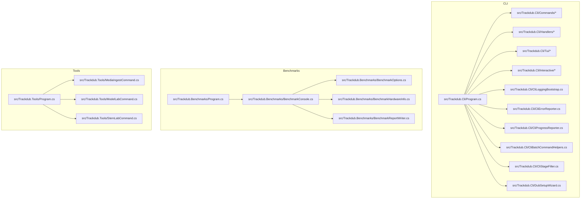
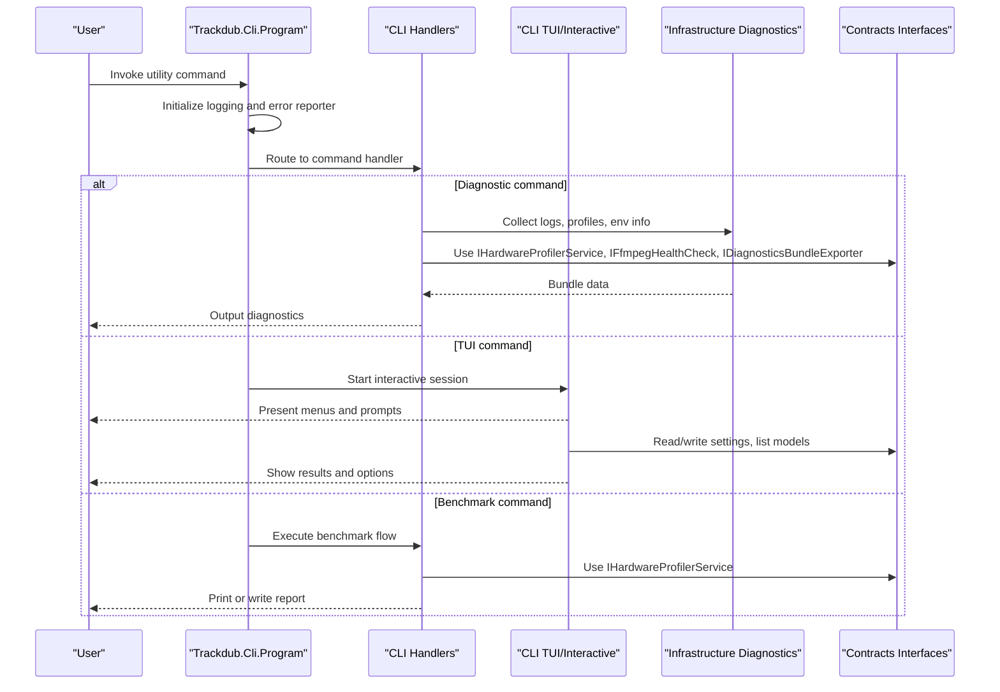
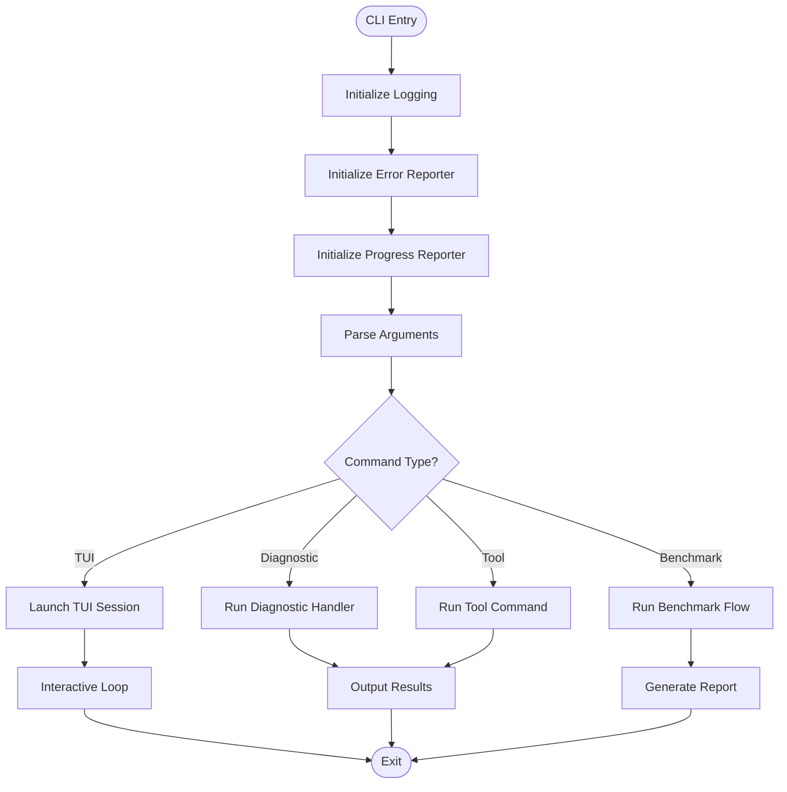
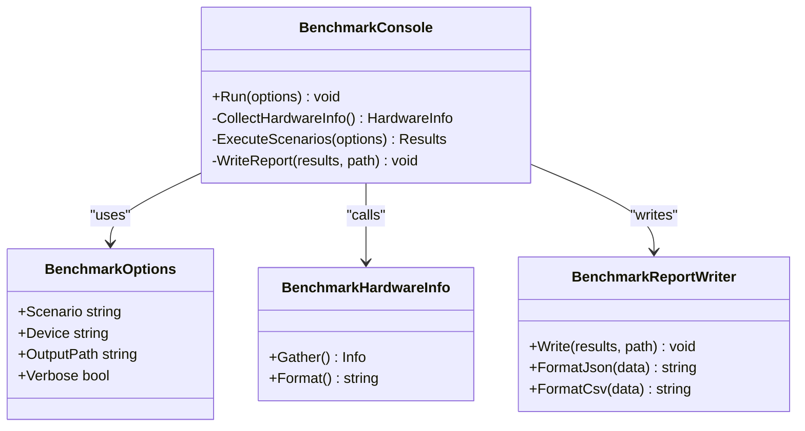
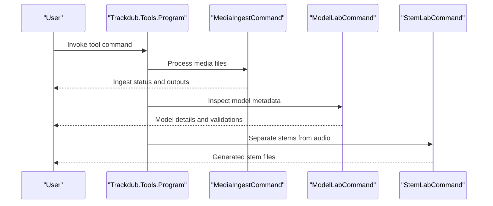
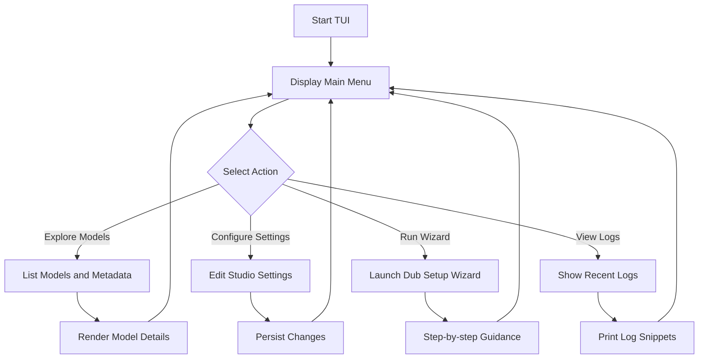
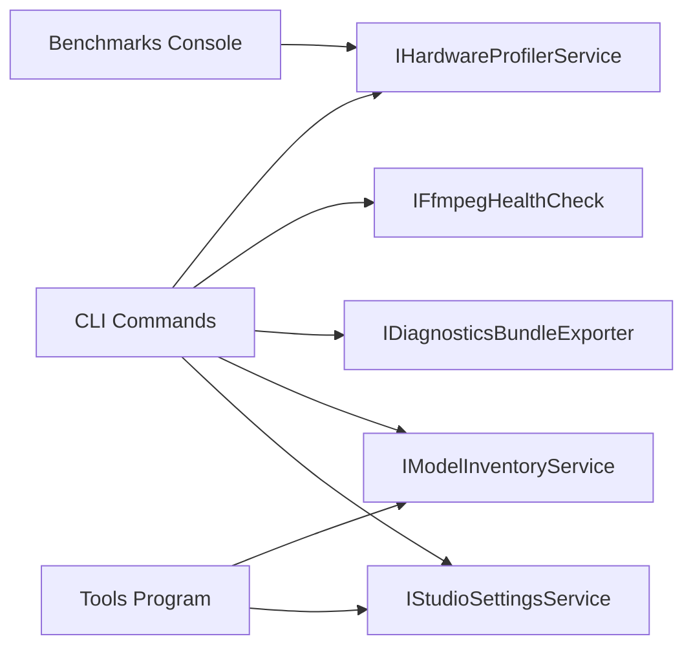
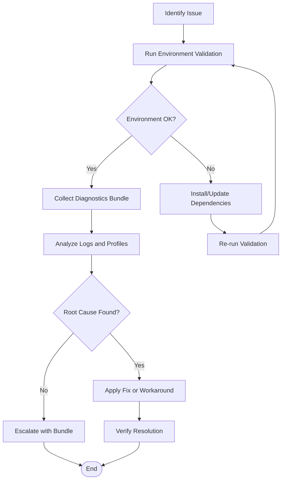

# Utility Commands

<cite>
**Referenced Files in This Document**
- [Program.cs](file://src/Trackdub.Cli/Program.cs)
- [CliLoggingBootstrap.cs](file://src/Trackdub.Cli/CliLoggingBootstrap.cs)
- [CliErrorReporter.cs](file://src/Trackdub.Cli/CliErrorReporter.cs)
- [CliProgressReporter.cs](file://src/Trackdub.Cli/CliProgressReporter.cs)
- [CliBatchCommandHelpers.cs](file://src/Trackdub.Cli/CliBatchCommandHelpers.cs)
- [CliStageFilter.cs](file://src/Trackdub.Cli/CliStageFilter.cs)
- [DubSetupWizard.cs](file://src/Trackdub.Cli/DubSetupWizard.cs)
- [Commands/](file://src/Trackdub.Cli/Commands)
- [Handlers/](file://src/Trackdub.Cli/Handlers)
- [Tui/](file://src/Trackdub.Cli/Tui)
- [Interactive/](file://src/Trackdub.Cli/Interactive)
- [BenchmarkConsole.cs](file://src/Trackdub.Benchmarks/BenchmarkConsole.cs)
- [BenchmarkOptions.cs](file://src/Trackdub.Benchmarks/BenchmarkOptions.cs)
- [BenchmarkHardwareInfo.cs](file://src/Trackdub.Benchmarks/BenchmarkHardwareInfo.cs)
- [BenchmarkReportWriter.cs](file://src/Trackdub.Benchmarks/BenchmarkReportWriter.cs)
- [Program.cs](file://src/Trackdub.Benchmarks/Program.cs)
- [README.md](file://src/Trackdub.Benchmarks/README.md)
- [Program.cs](file://src/Trackdub.Tools/Program.cs)
- [MediaIngestCommand.cs](file://src/Trackdub.Tools/MediaIngestCommand.cs)
- [ModelLabCommand.cs](file://src/Trackdub.Tools/ModelLabCommand.cs)
- [StemLabCommand.cs](file://src/Trackdub.Tools/StemLabCommand.cs)
- [IHardwareProfilerService.cs](file://src/Trackdub.Contracts/IHardwareProfilerService.cs)
- [IFfmpegHealthCheck.cs](file://src/Trackdub.Contracts/IFfmpegHealthCheck.cs)
- [IDiagnosticsBundleExporter.cs](file://src/Trackdub.Contracts/IDiagnosticsBundleExporter.cs)
- [IModelInventoryService.cs](file://src/Trackdub.Contracts/IModelInventoryService.cs)
- [IStudioSettingsService.cs](file://src/Trackdub.Contracts/IStudioSettingsService.cs)
- [Diagnostics/](file://src/Trackdub.Infrastructure/Diagnostics)
- [Diagnostics/](file://src/Trackdub.Contracts/Diagnostics)
</cite>

## Table of Contents
1. [Introduction](#introduction)
2. [Project Structure](#project-structure)
3. [Core Components](#core-components)
4. [Architecture Overview](#architecture-overview)
5. [Detailed Component Analysis](#detailed-component-analysis)
6. [Dependency Analysis](#dependency-analysis)
7. [Performance Considerations](#performance-considerations)
8. [Troubleshooting Guide](#troubleshooting-guide)
9. [Conclusion](#conclusion)
10. [Appendices](#appendices)

## Introduction
This document explains Trackdub’s utility commands for system diagnostics, configuration management, and interactive tools. It covers hardware profiling, environment validation, log analysis, and troubleshooting utilities. It also documents the text-based user interface (TUI) commands for interactive model exploration and configuration, along with diagnostic collection workflows, system health checks, and common administrative tasks.

## Project Structure
Trackdub exposes utility functionality through several entry points:
- CLI application for command-line operations and TUI sessions
- Benchmarks tool for performance profiling and reporting
- Tools application for media/model/stem lab operations

**Diagram sources**
- [Program.cs](file://src/Trackdub.Cli/Program.cs)
- [CliLoggingBootstrap.cs](file://src/Trackdub.Cli/CliLoggingBootstrap.cs)
- [CliErrorReporter.cs](file://src/Trackdub.Cli/CliErrorReporter.cs)
- [CliProgressReporter.cs](file://src/Trackdub.Cli/CliProgressReporter.cs)
- [CliBatchCommandHelpers.cs](file://src/Trackdub.Cli/CliBatchCommandHelpers.cs)
- [CliStageFilter.cs](file://src/Trackdub.Cli/CliStageFilter.cs)
- [DubSetupWizard.cs](file://src/Trackdub.Cli/DubSetupWizard.cs)
- [BenchmarkConsole.cs](file://src/Trackdub.Benchmarks/BenchmarkConsole.cs)
- [BenchmarkOptions.cs](file://src/Trackdub.Benchmarks/BenchmarkOptions.cs)
- [BenchmarkHardwareInfo.cs](file://src/Trackdub.Benchmarks/BenchmarkHardwareInfo.cs)
- [BenchmarkReportWriter.cs](file://src/Trackdub.Benchmarks/BenchmarkReportWriter.cs)
- [Program.cs](file://src/Trackdub.Benchmarks/Program.cs)
- [Program.cs](file://src/Trackdub.Tools/Program.cs)
- [MediaIngestCommand.cs](file://src/Trackdub.Tools/MediaIngestCommand.cs)
- [ModelLabCommand.cs](file://src/Trackdub.Tools/ModelLabCommand.cs)
- [StemLabCommand.cs](file://src/Trackdub.Tools/StemLabCommand.cs)

**Section sources**
- [Program.cs](file://src/Trackdub.Cli/Program.cs)
- [Program.cs](file://src/Trackdub.Benchmarks/Program.cs)
- [Program.cs](file://src/Trackdub.Tools/Program.cs)

## Core Components
- CLI bootstrap and logging: initializes logging, error reporting, progress reporting, and batch helpers to support all CLI commands.
- Command routing: maps CLI commands to handlers and TUI/interactive modules.
- Benchmarks console: orchestrates hardware info gathering, benchmark execution, and report generation.
- Tools program: provides media ingestion, model lab, and stem separation utilities.
- Contracts: defines interfaces for hardware profiling, ffmpeg health checks, diagnostics bundle export, model inventory, and studio settings.

Key responsibilities:
- System diagnostics: collect logs, profiles, and environment details; validate dependencies like ffmpeg.
- Configuration management: read/write studio settings; manage model inventory and presets.
- Interactive tools: TUI for exploring models and configuring pipelines; wizard-driven setup flows.
- Performance profiling: run benchmarks across devices and produce reports.

**Section sources**
- [CliLoggingBootstrap.cs](file://src/Trackdub.Cli/CliLoggingBootstrap.cs)
- [CliErrorReporter.cs](file://src/Trackdub.Cli/CliErrorReporter.cs)
- [CliProgressReporter.cs](file://src/Trackdub.Cli/CliProgressReporter.cs)
- [CliBatchCommandHelpers.cs](file://src/Trackdub.Cli/CliBatchCommandHelpers.cs)
- [CliStageFilter.cs](file://src/Trackdub.Cli/CliStageFilter.cs)
- [DubSetupWizard.cs](file://src/Trackdub.Cli/DubSetupWizard.cs)
- [BenchmarkConsole.cs](file://src/Trackdub.Benchmarks/BenchmarkConsole.cs)
- [BenchmarkOptions.cs](file://src/Trackdub.Benchmarks/BenchmarkOptions.cs)
- [BenchmarkHardwareInfo.cs](file://src/Trackdub.Benchmarks/BenchmarkHardwareInfo.cs)
- [BenchmarkReportWriter.cs](file://src/Trackdub.Benchmarks/BenchmarkReportWriter.cs)
- [Program.cs](file://src/Trackdub.Benchmarks/Program.cs)
- [Program.cs](file://src/Trackdub.Tools/Program.cs)
- [MediaIngestCommand.cs](file://src/Trackdub.Tools/MediaIngestCommand.cs)
- [ModelLabCommand.cs](file://src/Trackdub.Tools/ModelLabCommand.cs)
- [StemLabCommand.cs](file://src/Trackdub.Tools/StemLabCommand.cs)
- [IHardwareProfilerService.cs](file://src/Trackdub.Contracts/IHardwareProfilerService.cs)
- [IFfmpegHealthCheck.cs](file://src/Trackdub.Contracts/IFfmpegHealthCheck.cs)
- [IDiagnosticsBundleExporter.cs](file://src/Trackdub.Contracts/IDiagnosticsBundleExporter.cs)
- [IModelInventoryService.cs](file://src/Trackdub.Contracts/IModelInventoryService.cs)
- [IStudioSettingsService.cs](file://src/Trackdub.Contracts/IStudioSettingsService.cs)

## Architecture Overview
The utility layer is organized into three primary programs that share contracts and infrastructure:
- CLI: command parsing, handler dispatch, TUI/interactive sessions, logging, progress, and batch orchestration.
- Benchmarks: hardware discovery, benchmark execution, and report writing.
- Tools: focused utilities for media, models, and stems.

**Diagram sources**
- [Program.cs](file://src/Trackdub.Cli/Program.cs)
- [CliLoggingBootstrap.cs](file://src/Trackdub.Cli/CliLoggingBootstrap.cs)
- [CliErrorReporter.cs](file://src/Trackdub.Cli/CliErrorReporter.cs)
- [IHardwareProfilerService.cs](file://src/Trackdub.Contracts/IHardwareProfilerService.cs)
- [IFfmpegHealthCheck.cs](file://src/Trackdub.Contracts/IFfmpegHealthCheck.cs)
- [IDiagnosticsBundleExporter.cs](file://src/Trackdub.Contracts/IDiagnosticsBundleExporter.cs)

## Detailed Component Analysis

### CLI Bootstrap and Utilities
- Logging bootstrap configures structured logging for CLI sessions.
- Error reporter standardizes error output and exit codes.
- Progress reporter provides consistent progress feedback for long-running tasks.
- Batch helpers enable running multiple commands or stages efficiently.
- Stage filter allows selecting specific pipeline stages for targeted operations.
- Setup wizard guides users through initial configuration and model selection.

**Diagram sources**
- [CliLoggingBootstrap.cs](file://src/Trackdub.Cli/CliLoggingBootstrap.cs)
- [CliErrorReporter.cs](file://src/Trackdub.Cli/CliErrorReporter.cs)
- [CliProgressReporter.cs](file://src/Trackdub.Cli/CliProgressReporter.cs)
- [CliBatchCommandHelpers.cs](file://src/Trackdub.Cli/CliBatchCommandHelpers.cs)
- [CliStageFilter.cs](file://src/Trackdub.Cli/CliStageFilter.cs)
- [DubSetupWizard.cs](file://src/Trackdub.Cli/DubSetupWizard.cs)

**Section sources**
- [CliLoggingBootstrap.cs](file://src/Trackdub.Cli/CliLoggingBootstrap.cs)
- [CliErrorReporter.cs](file://src/Trackdub.Cli/CliErrorReporter.cs)
- [CliProgressReporter.cs](file://src/Trackdub.Cli/CliProgressReporter.cs)
- [CliBatchCommandHelpers.cs](file://src/Trackdub.Cli/CliBatchCommandHelpers.cs)
- [CliStageFilter.cs](file://src/Trackdub.Cli/CliStageFilter.cs)
- [DubSetupWizard.cs](file://src/Trackdub.Cli/DubSetupWizard.cs)

### Benchmarks Console
The benchmarks console coordinates hardware information gathering, benchmark execution, and report generation. It supports options for selecting scenarios, devices, and output formats.

**Diagram sources**
- [BenchmarkConsole.cs](file://src/Trackdub.Benchmarks/BenchmarkConsole.cs)
- [BenchmarkOptions.cs](file://src/Trackdub.Benchmarks/BenchmarkOptions.cs)
- [BenchmarkHardwareInfo.cs](file://src/Trackdub.Benchmarks/BenchmarkHardwareInfo.cs)
- [BenchmarkReportWriter.cs](file://src/Trackdub.Benchmarks/BenchmarkReportWriter.cs)

**Section sources**
- [BenchmarkConsole.cs](file://src/Trackdub.Benchmarks/BenchmarkConsole.cs)
- [BenchmarkOptions.cs](file://src/Trackdub.Benchmarks/BenchmarkOptions.cs)
- [BenchmarkHardwareInfo.cs](file://src/Trackdub.Benchmarks/BenchmarkHardwareInfo.cs)
- [BenchmarkReportWriter.cs](file://src/Trackdub.Benchmarks/BenchmarkReportWriter.cs)
- [Program.cs](file://src/Trackdub.Benchmarks/Program.cs)
- [README.md](file://src/Trackdub.Benchmarks/README.md)

### Tools Program
The tools program provides focused utilities:
- Media ingest: import and preprocess media assets.
- Model lab: inspect, validate, and experiment with models.
- Stem lab: separate audio stems for analysis or processing.

**Diagram sources**
- [Program.cs](file://src/Trackdub.Tools/Program.cs)
- [MediaIngestCommand.cs](file://src/Trackdub.Tools/MediaIngestCommand.cs)
- [ModelLabCommand.cs](file://src/Trackdub.Tools/ModelLabCommand.cs)
- [StemLabCommand.cs](file://src/Trackdub.Tools/StemLabCommand.cs)

**Section sources**
- [Program.cs](file://src/Trackdub.Tools/Program.cs)
- [MediaIngestCommand.cs](file://src/Trackdub.Tools/MediaIngestCommand.cs)
- [ModelLabCommand.cs](file://src/Trackdub.Tools/ModelLabCommand.cs)
- [StemLabCommand.cs](file://src/Trackdub.Tools/StemLabCommand.cs)

### TUI and Interactive Commands
The TUI module offers an interactive text-based interface for:
- Exploring available models and their capabilities
- Configuring pipeline settings and presets
- Running guided setup wizards
- Viewing real-time progress and results

Interactive commands complement TUI by enabling scripted or semi-automated workflows for model exploration and configuration.

**Diagram sources**
- [Tui/](file://src/Trackdub.Cli/Tui)
- [Interactive/](file://src/Trackdub.Cli/Interactive)
- [DubSetupWizard.cs](file://src/Trackdub.Cli/DubSetupWizard.cs)

**Section sources**
- [Tui/](file://src/Trackdub.Cli/Tui)
- [Interactive/](file://src/Trackdub.Cli/Interactive)
- [DubSetupWizard.cs](file://src/Trackdub.Cli/DubSetupWizard.cs)

## Dependency Analysis
Utility commands rely on well-defined contracts for cross-cutting concerns:
- Hardware profiling service abstracts device detection and capability queries.
- FFMPEG health check validates external dependencies required for media processing.
- Diagnostics bundle exporter aggregates logs, profiles, and environment details.
- Model inventory service manages available models and metadata.
- Studio settings service persists and retrieves configuration values.

**Diagram sources**
- [IHardwareProfilerService.cs](file://src/Trackdub.Contracts/IHardwareProfilerService.cs)
- [IFfmpegHealthCheck.cs](file://src/Trackdub.Contracts/IFfmpegHealthCheck.cs)
- [IDiagnosticsBundleExporter.cs](file://src/Trackdub.Contracts/IDiagnosticsBundleExporter.cs)
- [IModelInventoryService.cs](file://src/Trackdub.Contracts/IModelInventoryService.cs)
- [IStudioSettingsService.cs](file://src/Trackdub.Contracts/IStudioSettingsService.cs)

**Section sources**
- [IHardwareProfilerService.cs](file://src/Trackdub.Contracts/IHardwareProfilerService.cs)
- [IFfmpegHealthCheck.cs](file://src/Trackdub.Contracts/IFfmpegHealthCheck.cs)
- [IDiagnosticsBundleExporter.cs](file://src/Trackdub.Contracts/IDiagnosticsBundleExporter.cs)
- [IModelInventoryService.cs](file://src/Trackdub.Contracts/IModelInventoryService.cs)
- [IStudioSettingsService.cs](file://src/Trackdub.Contracts/IStudioSettingsService.cs)

## Performance Considerations
- Use stage filters to limit operations to relevant pipeline stages, reducing overhead during diagnostics and troubleshooting.
- Prefer batch helpers for repetitive tasks to minimize startup costs and improve throughput.
- Configure verbose logging selectively to avoid excessive I/O during performance-sensitive runs.
- For benchmarks, select appropriate scenarios and devices to match target environments and ensure representative results.

[No sources needed since this section provides general guidance]

## Troubleshooting Guide
Common diagnostic and troubleshooting workflows:
- Validate environment: use ffmpeg health checks to confirm external dependencies are installed and accessible.
- Collect diagnostics: generate a diagnostics bundle including logs, hardware profiles, and environment details for sharing or analysis.
- Analyze logs: review recent logs via TUI or CLI to identify errors and warnings.
- Profile hardware: run hardware profiling to detect bottlenecks or unsupported features.
- Explore models: use TUI or model lab commands to verify model availability and metadata integrity.

**Diagram sources**
- [IFfmpegHealthCheck.cs](file://src/Trackdub.Contracts/IFfmpegHealthCheck.cs)
- [IDiagnosticsBundleExporter.cs](file://src/Trackdub.Contracts/IDiagnosticsBundleExporter.cs)
- [IHardwareProfilerService.cs](file://src/Trackdub.Contracts/IHardwareProfilerService.cs)

**Section sources**
- [IFfmpegHealthCheck.cs](file://src/Trackdub.Contracts/IFfmpegHealthCheck.cs)
- [IDiagnosticsBundleExporter.cs](file://src/Trackdub.Contracts/IDiagnosticsBundleExporter.cs)
- [IHardwareProfilerService.cs](file://src/Trackdub.Contracts/IHardwareProfilerService.cs)

## Conclusion
Trackdub’s utility commands provide comprehensive support for diagnostics, configuration management, and interactive exploration. The CLI, benchmarks, and tools programs work together with well-defined contracts to deliver robust operational capabilities. By leveraging stage filtering, batch helpers, and TUI workflows, administrators can efficiently maintain and troubleshoot systems while ensuring reliable performance and configuration.

[No sources needed since this section summarizes without analyzing specific files]

## Appendices

### Common Administrative Tasks and Maintenance Operations
- Validate environment readiness before running pipelines or benchmarks.
- Generate diagnostics bundles when encountering issues or preparing support tickets.
- Use TUI to explore models, adjust settings, and run guided setup wizards.
- Perform hardware profiling to optimize resource allocation and detect limitations.
- Review logs and apply fixes based on identified root causes.

[No sources needed since this section provides general guidance]