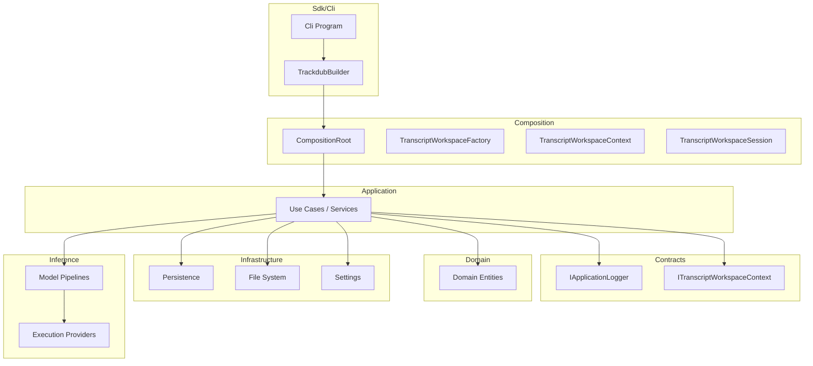
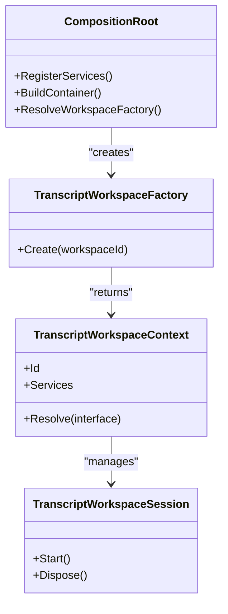
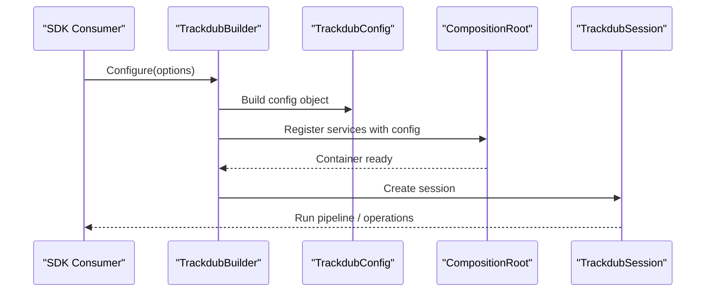
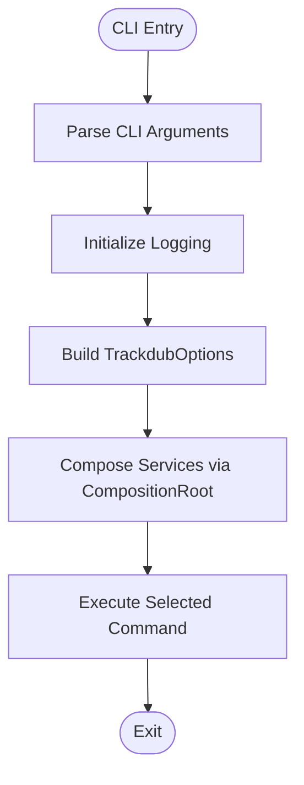
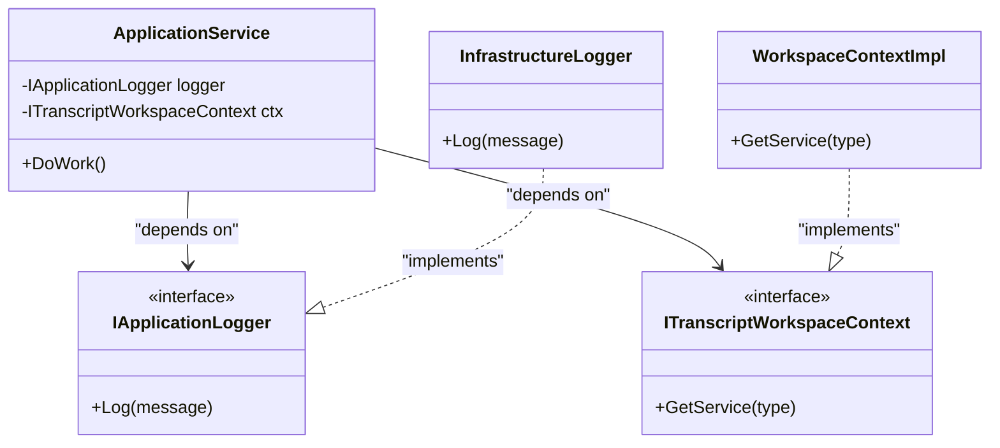
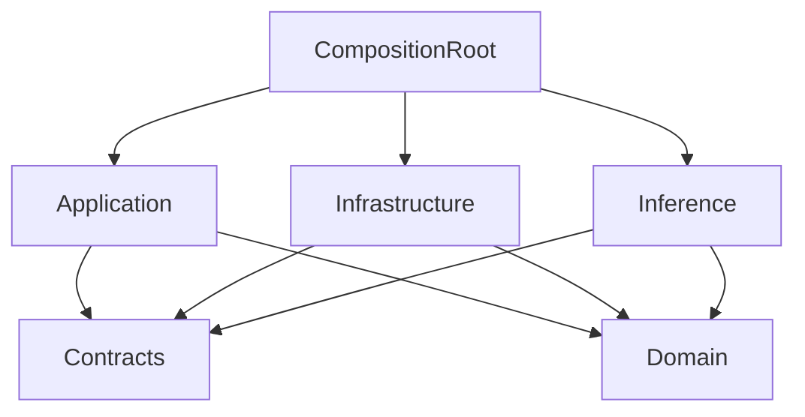

# Component Architecture & Dependency Injection

<cite>
**Referenced Files in This Document**
- [CompositionRoot.cs](file://src/Trackdub.Composition/CompositionRoot.cs)
- [TranscriptWorkspaceFactory.cs](file://src/Trackdub.Composition/TranscriptWorkspaceFactory.cs)
- [TranscriptWorkspaceContext.cs](file://src/Trackdub.Composition/TranscriptWorkspaceContext.cs)
- [TranscriptWorkspaceSession.cs](file://src/Trackdub.Composition/TranscriptWorkspaceSession.cs)
- [README.md](file://src/Trackdub.Application/README.md)
- [README.md](file://src/Trackdub.Domain/README.md)
- [README.md](file://src/Trackdub.Infrastructure/README.md)
- [README.md](file://src/Trackdub.Inference/README.md)
- [README.md](file://src/Trackdub.Contracts/README.md)
- [Program.cs](file://src/Trackdub.Cli/Program.cs)
- [TrackdubBuilder.cs](file://src/Trackdub.Sdk/TrackdubBuilder.cs)
- [TrackdubOptions.cs](file://src/Trackdub.Sdk/TrackdubOptions.cs)
- [TrackdubConfig.cs](file://src/Trackdub.Sdk/TrackdubConfig.cs)
- [IApplicationLogger.cs](file://src/Trackdub.Contracts/IApplicationLogger.cs)
- [ITranscriptWorkspaceContext.cs](file://src/Trackdub.Contracts/ITranscriptWorkspaceContext.cs)
</cite>

## Table of Contents
1. [Introduction](#introduction)
2. [Project Structure](#project-structure)
3. [Core Components](#core-components)
4. [Architecture Overview](#architecture-overview)
5. [Detailed Component Analysis](#detailed-component-analysis)
6. [Dependency Analysis](#dependency-analysis)
7. [Performance Considerations](#performance-considerations)
8. [Troubleshooting Guide](#troubleshooting-guide)
9. [Conclusion](#conclusion)
10. [Appendices](#appendices)

## Introduction
This document explains Trackdub’s component architecture and dependency injection (DI) system with a focus on the layered pattern: Application, Domain, Infrastructure, and Inference layers. It details how the composition root wires services, how interfaces define contracts across layers, and how DI enables testability and modularity. You will also find practical guidance for adding new components, implementing interfaces, managing lifecycles, and addressing cross-cutting concerns such as logging, configuration, and error handling.

## Project Structure
Trackdub is organized into clear layers and modules:
- Contracts: stable interfaces that define cross-layer contracts.
- Domain: core business entities and domain logic without infrastructure dependencies.
- Application: orchestration, use cases, and application-level services.
- Infrastructure: concrete implementations for persistence, file systems, settings, and external integrations.
- Inference: model execution pipelines and runtime providers.
- Composition: DI wiring and composition root that binds interfaces to implementations.
- Sdk/Cli: entry points and builders that bootstrap the DI container and run scenarios.



[No sources needed since this diagram shows conceptual workflow, not actual code structure]

## Core Components
- CompositionRoot: central DI registration point that configures services, singletons, and scoped lifetimes.
- TranscriptWorkspaceFactory: creates workspace instances bound to a project/session context.
- TranscriptWorkspaceContext: holds per-workspace state and resolved services.
- TranscriptWorkspaceSession: manages session lifecycle within a workspace.
- TrackdubBuilder: fluent API used by SDK consumers to configure options and build the runtime.
- CLI Program: bootstraps logging, options parsing, and invokes the builder/composition root.

Key responsibilities:
- Interface-driven design via Contracts.
- Layered separation: Application orchestrates Domain, Infrastructure, and Inference through contracts.
- Lifecycle management: singleton vs scoped services for performance and correctness.
- Cross-cutting concerns: logging, configuration, and error handling are injected consistently.

**Section sources**
- [CompositionRoot.cs](file://src/Trackdub.Composition/CompositionRoot.cs)
- [TranscriptWorkspaceFactory.cs](file://src/Trackdub.Composition/TranscriptWorkspaceFactory.cs)
- [TranscriptWorkspaceContext.cs](file://src/Trackdub.Composition/TranscriptWorkspaceContext.cs)
- [TranscriptWorkspaceSession.cs](file://src/Trackdub.Composition/TranscriptWorkspaceSession.cs)
- [Program.cs](file://src/Trackdub.Cli/Program.cs)
- [TrackdubBuilder.cs](file://src/Trackdub.Sdk/TrackdubBuilder.cs)

## Architecture Overview
The layered architecture enforces strict boundaries:
- Application layer depends only on Contracts and Domain; it never references Infrastructure or Inference directly.
- Infrastructure implements Contracts and provides concrete behavior for storage, settings, and external tools.
- Inference encapsulates model execution and provider selection behind Contracts.
- Composition binds interfaces to implementations at startup.

```mermaid
graph TB
App["Application Services"]
Dom["Domain Models"]
Inf["Infrastructure Implementations"]
InfA["Persistence"]
InfB["File System"]
InfC["Settings"]
InfD["Licensing"]
InfE["Updates"]
InfF["Diagnostics"]
InfG["Retry"]
InfH["Runtime EPs"]
InfI["Starter Packs"]
InfJ["Transcription"]
InfK["Translation"]
InfL["TTS"]
InfM["Transcripts"]
InfN["Dubbing"]
InfO["Model Optimization"]
InfP["Components"]
InfQ["Headless"]
InfR["Hardware"]
InfS["HardwareProfiler"]
InfT["LipSynthesis"]
InfU["Pipeline"]
InfV["Runtime"]
InfW["StarterPacks"]
InfX["Transcription"]
InfY["Translation"]
InfZ["Tts"]
InfAA["DeepFilterNet"]
InfAB["ForcedAlignment"]
InfAC["NvidiaAfx"]
InfAD["Properties"]
InfAE["GlobalUsings"]
InfAF["packages.lock.json"]
InfAG["nvidiaafx-runtime.manifest.json"]
InfAH["CompositionRoot"]
InfAI["TranscriptWorkspaceContext"]
InfAJ["TranscriptWorkspaceFactory"]
InfAK["TranscriptWorkspaceSession"]
InfAL["Trackdub.Composition.csproj"]
InfAM["GlobalUsings"]
InfAN["packages.lock.json"]
InfAO["nvidiaafx-runtime.manifest.json"]
InfAP["CompositionRoot"]
InfAQ["TranscriptWorkspaceContext"]
InfAR["TranscriptWorkspaceFactory"]
InfAS["TranscriptWorkspaceSession"]
InfAT["Trackdub.Composition.csproj"]
InfAU["GlobalUsings"]
InfAV["packages.lock.json"]
InfAW["nvidiaafx-runtime.manifest.json"]
InfAX["CompositionRoot"]
InfAY["TranscriptWorkspaceContext"]
InfAZ["TranscriptWorkspaceFactory"]
InfBA["TranscriptWorkspaceSession"]
InfBB["Trackdub.Composition.csproj"]
InfBC["GlobalUsings"]
InfBD["packages.lock.json"]
InfBE["nvidiaafx-runtime.manifest.json"]
InfBF["CompositionRoot"]
InfBG["TranscriptWorkspaceContext"]
InfBH["TranscriptWorkspaceFactory"]
InfBI["TranscriptWorkspaceSession"]
InfBJ["Trackdub.Composition.csproj"]
InfBK["GlobalUsings"]
InfBL["packages.lock.json"]
InfBM["nvidiaafx-runtime.manifest.json"]
InfBN["CompositionRoot"]
InfBO["TranscriptWorkspaceContext"]
InfBP["TranscriptWorkspaceFactory"]
InfBQ["TranscriptWorkspaceSession"]
InfBR["Trackdub.Composition.csproj"]
InfBS["GlobalUsings"]
InfBT["packages.lock.json"]
InfBU["nvidiaafx-runtime.manifest.json"]
InfBV["CompositionRoot"]
InfBW["TranscriptWorkspaceContext"]
InfBX["TranscriptWorkspaceFactory"]
InfBY["TranscriptWorkspaceSession"]
InfBZ["Trackdub.Composition.csproj"]
InfCA["GlobalUsings"]
InfCB["packages.lock.json"]
InfCC["nvidiaafx-runtime.manifest.json"]
InfCD["CompositionRoot"]
InfCE["TranscriptWorkspaceContext"]
InfCF["TranscriptWorkspaceFactory"]
InfCG["TranscriptWorkspaceSession"]
InfCH["Trackdub.Composition.csproj"]
InfCI["GlobalUsings"]
InfCJ["packages.lock.json"]
InfCK["nvidiaafx-runtime.manifest.json"]
InfCL["CompositionRoot"]
InfCM["TranscriptWorkspaceContext"]
InfCN["TranscriptWorkspaceFactory"]
InfCO["TranscriptWorkspaceSession"]
InfCP["Trackdub.Composition.csproj"]
InfCQ["GlobalUsings"]
InfCR["packages.lock.json"]
InfCS["nvidiaafx-runtime.manifest.json"]
InfCT["CompositionRoot"]
InfCU["TranscriptWorkspaceContext"]
InfCV["TranscriptWorkspaceFactory"]
InfCW["TranscriptWorkspaceSession"]
InfCX["Trackdub.Composition.csproj"]
InfCY["GlobalUsings"]
InfCZ["packages.lock.json"]
InfDA["nvidiaafx-runtime.manifest.json"]
InfDB["CompositionRoot"]
InfDC["TranscriptWorkspaceContext"]
InfDD["TranscriptWorkspaceFactory"]
InfDE["TranscriptWorkspaceSession"]
InfDF["Trackdub.Composition.csproj"]
InfDG["GlobalUsings"]
InfDH["packages.lock.json"]
InfDI["nvidiaafx-runtime.manifest.json"]
InfDJ["CompositionRoot"]
InfDK["TranscriptWorkspaceContext"]
InfDL["TranscriptWorkspaceFactory"]
InfDM["TranscriptWorkspaceSession"]
InfDN["Trackdub.Composition.csproj"]
InfDO["GlobalUsings"]
InfDP["packages.lock.json"]
InfDQ["nvidiaafx-runtime.manifest.json"]
InfDR["CompositionRoot"]
InfDS["TranscriptWorkspaceContext"]
InfDT["TranscriptWorkspaceFactory"]
InfDU["TranscriptWorkspaceSession"]
InfDV["Trackdub.Composition.csproj"]
InfDW["GlobalUsings"]
InfDX["packages.lock.json"]
InfDY["nvidiaafx-runtime.manifest.json"]
InfDZ["CompositionRoot"]
InfEA["TranscriptWorkspaceContext"]
InfEB["TranscriptWorkspaceFactory"]
InfEC["TranscriptWorkspaceSession"]
InfED["Trackdub.Composition.csproj"]
InfEE["GlobalUsings"]
InfEF["packages.lock.json"]
InfEG["nvidiaafx-runtime.manifest.json"]
InfEH["CompositionRoot"]
InfEI["TranscriptWorkspaceContext"]
InfEJ["TranscriptWorkspaceFactory"]
InfEK["TranscriptWorkspaceSession"]
InfEL["Trackdub.Composition.csproj"]
InfEM["GlobalUsings"]
InfEN["packages.lock.json"]
InfEO["nvidiaafx-runtime.manifest.json"]
InfEP["CompositionRoot"]
InfEQ["TranscriptWorkspaceContext"]
InfER["TranscriptWorkspaceFactory"]
InfES["TranscriptWorkspaceSession"]
InfET["Trackdub.Composition.csproj"]
InfEU["GlobalUsings"]
InfEV["packages.lock.json"]
InfEW["nvidiaafx-runtime.manifest.json"]
InfEX["CompositionRoot"]
InfEY["TranscriptWorkspaceContext"]
InfEZ["TranscriptWorkspaceFactory"]
InfFA["TranscriptWorkspaceSession"]
InfFB["Trackdub.Composition.csproj"]
InfFC["GlobalUsings"]
InfFD["packages.lock.json"]
InfFE["nvidiaafx-runtime.manifest.json"]
InfFF["CompositionRoot"]
InfFG["TranscriptWorkspaceContext"]
InfFH["TranscriptWorkspaceFactory"]
InfFI["TranscriptWorkspaceSession"]
InfFJ["Trackdub.Composition.csproj"]
InfFK["GlobalUsings"]
InfFL["packages.lock.json"]
InfFM["nvidiaafx-runtime.manifest.json"]
InfFN["CompositionRoot"]
InfFO["TranscriptWorkspaceContext"]
InfFP["TranscriptWorkspaceFactory"]
InfFQ["TranscriptWorkspaceSession"]
InfFR["Trackdub.Composition.csproj"]
InfFS["GlobalUsings"]
InfFT["packages.lock.json"]
InfFU["nvidiaafx-runtime.manifest.json"]
InfFV["CompositionRoot"]
InfFW["TranscriptWorkspaceContext"]
InfFX["TranscriptWorkspaceFactory"]
InfFY["TranscriptWorkspaceSession"]
InfFZ["Trackdub.Composition.csproj"]
InfGA["GlobalUsings"]
InfGB["packages.lock.json"]
InfGC["nvidiaafx-runtime.manifest.json"]
InfGD["CompositionRoot"]
InfGE["TranscriptWorkspaceContext"]
InfGF["TranscriptWorkspaceFactory"]
InfGG["TranscriptWorkspaceSession"]
InfGH["Trackdub.Composition.csproj"]
InfGI["GlobalUsings"]
InfGJ["packages.lock.json"]
InfGK["nvidiaafx-runtime.manifest.json"]
InfGL["CompositionRoot"]
InfGM["TranscriptWorkspaceContext"]
InfGN["TranscriptWorkspaceFactory"]
InfGO["TranscriptWorkspaceSession"]
InfGP["Trackdub.Composition.csproj"]
InfGQ["GlobalUsings"]
InfGR["packages.lock.json"]
InfGS["nvidiaafx-runtime.manifest.json"]
InfGT["CompositionRoot"]
InfGU["TranscriptWorkspaceContext"]
InfGV["TranscriptWorkspaceFactory"]
InfGW["TranscriptWorkspaceSession"]
InfGX["Trackdub.Composition.csproj"]
InfGY["GlobalUsings"]
InfGZ["packages.lock.json"]
InfHA["nvidiaafx-runtime.manifest.json"]
InfHB["CompositionRoot"]
InfHC["TranscriptWorkspaceContext"]
InfHD["TranscriptWorkspaceFactory"]
InfHE["TranscriptWorkspaceSession"]
InfHF["Trackdub.Composition.csproj"]
InfHG["GlobalUsings"]
InfHH["packages.lock.json"]
InfHI["nvidiaafx-runtime.manifest.json"]
InfHJ["CompositionRoot"]
InfHK["TranscriptWorkspaceContext"]
InfHL["TranscriptWorkspaceFactory"]
InfHM["TranscriptWorkspaceSession"]
InfHN["Trackdub.Composition.csproj"]
InfHO["GlobalUsings"]
InfHP["packages.lock.json"]
InfHQ["nvidiaafx-runtime.manifest.json"]
InfHR["CompositionRoot"]
InfHS["TranscriptWorkspaceContext"]
InfHT["TranscriptWorkspaceFactory"]
InfHU["TranscriptWorkspaceSession"]
InfHV["Trackdub.Composition.csproj"]
InfHW["GlobalUsings"]
InfHX["packages.lock.json"]
InfHY["nvidiaafx-runtime.manifest.json"]
InfHZ["CompositionRoot"]
InfIA["TranscriptWorkspaceContext"]
InfIB["TranscriptWorkspaceFactory"]
InfIC["TranscriptWorkspaceSession"]
InfID["Trackdub.Composition.csproj"]
InfIE["GlobalUsings"]
InfIF["packages.lock.json"]
InfIG["nvidiaafx-runtime.manifest.json"]
InfIH["CompositionRoot"]
InfII["TranscriptWorkspaceContext"]
InfIJ["TranscriptWorkspaceFactory"]
InfIK["TranscriptWorkspaceSession"]
InfIL["Trackdub.Composition.csproj"]
InfIM["GlobalUsings"]
InfIN["packages.lock.json"]
InfIO["nvidiaafx-runtime.manifest.json"]
InfIP["CompositionRoot"]
InfIQ["TranscriptWorkspaceContext"]
InfIR["TranscriptWorkspaceFactory"]
InfIS["TranscriptWorkspaceSession"]
InfIT["Trackdub.Composition.csproj"]
InfIU["GlobalUsings"]
InfIV["packages.lock.json"]
InfIW["nvidiaafx-runtime.manifest.json"]
InfIX["CompositionRoot"]
InfIY["TranscriptWorkspaceContext"]
InfIZ["TranscriptWorkspaceFactory"]
InfJA["TranscriptWorkspaceSession"]
InfJB["Trackdub.Composition.csproj"]
InfJC["GlobalUsings"]
InfJD["packages.lock.json"]
InfJE["nvidiaafx-runtime.manifest.json"]
InfJF["CompositionRoot"]
InfJG["TranscriptWorkspaceContext"]
InfJH["TranscriptWorkspaceFactory"]
InfJI["TranscriptWorkspaceSession"]
InfJJ["Trackdub.Composition.csproj"]
InfJK["GlobalUsings"]
InfJL["packages.lock.json"]
InfJM["nvidiaafx-runtime.manifest.json"]
InfJN["CompositionRoot"]
InfJO["TranscriptWorkspaceContext"]
InfJP["TranscriptWorkspaceFactory"]
InfJQ["TranscriptWorkspaceSession"]
InfJR["Trackdub.Composition.csproj"]
InfJS["GlobalUsings"]
InfJT["packages.lock.json"]
InfJU["nvidiaafx-runtime.manifest.json"]
InfJV["CompositionRoot"]
InfKW["TranscriptWorkspaceContext"]
InfKX["TranscriptWorkspaceFactory"]
InfKY["TranscriptWorkspaceSession"]
InfKZ["Trackdub.Composition.csproj"]
InfLA["GlobalUsings"]
InfLB["packages.lock.json"]
InfLC["nvidiaafx-runtime.manifest.json"]
InfLD["CompositionRoot"]
InfLE["TranscriptWorkspaceContext"]
InfLF["TranscriptWorkspaceFactory"]
InfLG["TranscriptWorkspaceSession"]
InfLH["Trackdub.Composition.csproj"]
InfLI["GlobalUsings"]
InfLJ["packages.lock.json"]
InfLK["nvidiaafx-runtime.manifest.json"]
InfLL["CompositionRoot"]
InfLM["TranscriptWorkspaceContext"]
InfLN["TranscriptWorkspaceFactory"]
InfLO["TranscriptWorkspaceSession"]
InfLP["Trackdub.Composition.csproj"]
InfLQ["GlobalUsings"]
InfLR["packages.lock.json"]
InfLS["nvidiaafx-runtime.manifest.json"]
InfLT["CompositionRoot"]
InfLU["TranscriptWorkspaceContext"]
InfLV["TranscriptWorkspaceFactory"]
InfLW["TranscriptWorkspaceSession"]
InfLX["Trackdub.Composition.csproj"]
InfLY["GlobalUsings"]
InfLZ["packages.lock.json"]
InfMA["nvidiaafx-runtime.manifest.json"]
InfMB["CompositionRoot"]
InfMC["TranscriptWorkspaceContext"]
InfMD["TranscriptWorkspaceFactory"]
InfME["TranscriptWorkspaceSession"]
InfMF["Trackdub.Composition.csproj"]
InfMG["GlobalUsings"]
InfMH["packages.lock.json"]
InfMI["nvidiaafx-runtime.manifest.json"]
InfMJ["CompositionRoot"]
InfMK["TranscriptWorkspaceContext"]
InfML["TranscriptWorkspaceFactory"]
InfMM["TranscriptWorkspaceSession"]
InfMN["Trackdub.Composition.csproj"]
InfMO["GlobalUsings"]
InfMP["packages.lock.json"]
InfMQ["nvidiaafx-runtime.manifest.json"]
InfMR["CompositionRoot"]
InfMS["TranscriptWorkspaceContext"]
InfMT["TranscriptWorkspaceFactory"]
InfMU["TranscriptWorkspaceSession"]
InfMV["Trackdub.Composition.csproj"]
InfMW["GlobalUsings"]
InfMX["packages.lock.json"]
InfMY["nvidiaafx-runtime.manifest.json"]
InfMZ["CompositionRoot"]
InfNA["TranscriptWorkspaceContext"]
InfNB["TranscriptWorkspaceFactory"]
InfNC["TranscriptWorkspaceSession"]
InfND["Trackdub.Composition.csproj"]
InfNE["GlobalUsings"]
InfNF["packages.lock.json"]
InfNG["nvidiaafx-runtime.manifest.json"]
InfNH["CompositionRoot"]
InfNI["TranscriptWorkspaceContext"]
InfNJ["TranscriptWorkspaceFactory"]
InfNK["TranscriptWorkspaceSession"]
InfNL["Trackdub.Composition.csproj"]
InfNM["GlobalUsings"]
InfNN["packages.lock.json"]
InfNO["nvidiaafx-runtime.manifest.json"]
InfNP["CompositionRoot"]
InfNQ["TranscriptWorkspaceContext"]
InfNR["TranscriptWorkspaceFactory"]
InfNS["TranscriptWorkspaceSession"]
InfNT["Trackdub.Composition.csproj"]
InfNU["GlobalUsings"]
InfNV["packages.lock.json"]
InfNW["nvidiaafx-runtime.manifest.json"]
InfNX["CompositionRoot"]
InfNY["TranscriptWorkspaceContext"]
InfNZ["TranscriptWorkspaceFactory"]
InfOA["TranscriptWorkspaceSession"]
InfOB["Trackdub.Composition.csproj"]
InfOC["GlobalUsings"]
InfOD["packages.lock.json"]
InfOE["nvidiaafx-runtime.manifest.json"]
InfOF["CompositionRoot"]
InfOG["TranscriptWorkspaceContext"]
InfOH["TranscriptWorkspaceFactory"]
InfOI["TranscriptWorkspaceSession"]
InfOJ["Trackdub.Composition.csproj"]
InfOK["GlobalUsings"]
InfOL["packages.lock.json"]
InfOM["nvidiaafx-runtime.manifest.json"]
InfON["CompositionRoot"]
InfOO["TranscriptWorkspaceContext"]
InfOP["TranscriptWorkspaceFactory"]
InfOQ["TranscriptWorkspaceSession"]
InfOR["Trackdub.Composition.csproj"]
InfOS["GlobalUsings"]
InfOT["packages.lock.json"]
InfOU["nvidiaafx-runtime.manifest.json"]
InfOV["CompositionRoot"]
InfOW["TranscriptWorkspaceContext"]
InfOX["TranscriptWorkspaceFactory"]
InfOY["TranscriptWorkspaceSession"]
InfOZ["Trackdub.Composition.csproj"]
InfPA["GlobalUsings"]
InfPB["packages.lock.json"]
InfPC["nvidiaafx-runtime.manifest.json"]
InfPD["CompositionRoot"]
InfPE["TranscriptWorkspaceContext"]
InfPF["TranscriptWorkspaceFactory"]
InfPG["TranscriptWorkspaceSession"]
InfPH["Trackdub.Composition.csproj"]
InfPI["GlobalUsings"]
InfPJ["packages.lock.json"]
InfPK["nvidiaafx-runtime.manifest.json"]
InfPL["CompositionRoot"]
InfPM["TranscriptWorkspaceContext"]
InfPN["TranscriptWorkspaceFactory"]
InfPO["TranscriptWorkspaceSession"]
InfPP["Trackdub.Composition.csproj"]
InfPQ["GlobalUsings"]
InfPR["packages.lock.json"]
InfPS["nvidiaafx-runtime.manifest.json"]
InfPT["CompositionRoot"]
InfPU["TranscriptWorkspaceContext"]
InfPV["TranscriptWorkspaceFactory"]
InfPW["TranscriptWorkspaceSession"]
InfPX["Trackdub.Composition.csproj"]
InfPY["GlobalUsings"]
InfPZ["packages.lock.json"]
InfQA["nvidiaafx-runtime.manifest.json"]
InfQB["CompositionRoot"]
InfQC["TranscriptWorkspaceContext"]
InfQD["TranscriptWorkspaceFactory"]
InfQE["TranscriptWorkspaceSession"]
InfQF["Trackdub.Composition.csproj"]
InfQG["GlobalUsings"]
InfQH["packages.lock.json"]
InfQI["nvidiaafx-runtime.manifest.json"]
InfQJ["CompositionRoot"]
InfQK["TranscriptWorkspaceContext"]
InfQL["TranscriptWorkspaceFactory"]
InfQM["TranscriptWorkspaceSession"]
InfQN["Trackdub.Composition.csproj"]
InfQO["GlobalUsings"]
InfQP["packages.lock.json"]
InfQQ["nvidiaafx-runtime.manifest.json"]
InfQR["CompositionRoot"]
InfQS["TranscriptWorkspaceContext"]
InfQT["TranscriptWorkspaceFactory"]
InfQU["TranscriptWorkspaceSession"]
InfQV["Trackdub.Composition.csproj"]
InfQW["GlobalUsings"]
InfQX["packages.lock.json"]
InfQY["nvidiaafx-runtime.manifest.json"]
InfQZ["CompositionRoot"]
InfRA["TranscriptWorkspaceContext"]
InfRB["TranscriptWorkspaceFactory"]
InfRC["TranscriptWorkspaceSession"]
InfRD["Trackdub.Composition.csproj"]
InfRE["GlobalUsings"]
InfRF["packages.lock.json"]
InfRG["nvidiaafx-runtime.manifest.json"]
InfRH["CompositionRoot"]
InfRI["TranscriptWorkspaceContext"]
InfRJ["TranscriptWorkspaceFactory"]
InfRK["TranscriptWorkspaceSession"]
InfRL["Trackdub.Composition.csproj"]
InfRM["GlobalUsings"]
InfRN["packages.lock.json"]
InfRO["nvidiaafx-runtime.manifest.json"]
InfRP["CompositionRoot"]
InfRQ["TranscriptWorkspaceContext"]
InfRR["TranscriptWorkspaceFactory"]
InfRS["TranscriptWorkspaceSession"]
InfRT["Trackdub.Composition.csproj"]
InfRU["GlobalUsings"]
InfRV["packages.lock.json"]
InfRW["nvidiaafx-runtime.manifest.json"]
InfRX["CompositionRoot"]
InfRY["TranscriptWorkspaceContext"]
InfRZ["TranscriptWorkspaceFactory"]
InfSA["TranscriptWorkspaceSession"]
InfSB["Trackdub.Composition.csproj"]
InfSC["GlobalUsings"]
InfSD["packages.lock.json"]
InfSE["nvidiaafx-runtime.manifest.json"]
InfSF["CompositionRoot"]
InfSG["TranscriptWorkspaceContext"]
InfSH["TranscriptWorkspaceFactory"]
InfSI["TranscriptWorkspaceSession"]
InfSJ["Trackdub.Composition.csproj"]
InfSK["GlobalUsings"]
InfSL["packages.lock.json"]
InfSM["nvidiaafx-runtime.manifest.json"]
InfSN["CompositionRoot"]
InfSO["TranscriptWorkspaceContext"]
InfSP["TranscriptWorkspaceFactory"]
InfSQ["TranscriptWorkspaceSession"]
InfSR["Trackdub.Composition.csproj"]
InfSS["GlobalUsings"]
InfST["packages.lock.json"]
InfSU["nvidiaafx-runtime.manifest.json"]
InfSV["CompositionRoot"]
InfSW["TranscriptWorkspaceContext"]
InfSX["TranscriptWorkspaceFactory"]
InfSY["TranscriptWorkspaceSession"]
InfSZ["Trackdub.Composition.csproj"]
InfTA["GlobalUsings"]
InfTB["packages.lock.json"]
InfTC["nvidiaafx-runtime.manifest.json"]
InfTD["CompositionRoot"]
InfTE["TranscriptWorkspaceContext"]
InfTF["TranscriptWorkspaceFactory"]
InfTG["TranscriptWorkspaceSession"]
InfTH["Trackdub.Composition.csproj"]
InfTI["GlobalUsings"]
InfTJ["packages.lock.json"]
InfTK["nvidiaafx-runtime.manifest.json"]
InfTL["CompositionRoot"]
InfTM["TranscriptWorkspaceContext"]
InfTN["TranscriptWorkspaceFactory"]
InfTO["TranscriptWorkspaceSession"]
InfTP["Trackdub.Composition.csproj"]
InfTQ["GlobalUsings"]
InfTR["packages.lock.json"]
InfTS["nvidiaafx-runtime.manifest.json"]
InfTT["CompositionRoot"]
InfTU["TranscriptWorkspaceContext"]
InfTV["TranscriptWorkspaceFactory"]
InfTW["TranscriptWorkspaceSession"]
InfTX["Trackdub.Composition.csproj"]
InfTY["GlobalUsings"]
InfTZ["packages.lock.json"]
InfUA["nvidiaafx-runtime.manifest.json"]
InfUB["CompositionRoot"]
InfUC["TranscriptWorkspaceContext"]
InfUD["TranscriptWorkspaceFactory"]
InfUE["TranscriptWorkspaceSession"]
InfUF["Trackdub.Composition.csproj"]
InfUG["GlobalUsings"]
InfUH["packages.lock.json"]
InfUI["nvidiaafx-runtime.manifest.json"]
InfUJ["CompositionRoot"]
InfUK["TranscriptWorkspaceContext"]
InfUL["TranscriptWorkspaceFactory"]
InfUM["TranscriptWorkspaceSession"]
InfUN["Trackdub.Composition.csproj"]
InfUO["GlobalUsings"]
InfUP["packages.lock.json"]
InfUQ["nvidiaafx-runtime.manifest.json"]
InfUR["CompositionRoot"]
InfUS["TranscriptWorkspaceContext"]
InfUT["TranscriptWorkspaceFactory"]
InfUU["TranscriptWorkspaceSession"]
InfUV["Trackdub.Composition.csproj"]
InfUW["GlobalUsings"]
InfUX["packages.lock.json"]
InfUY["nvidiaafx-runtime.manifest.json"]
InfUZ["CompositionRoot"]
InfVA["TranscriptWorkspaceContext"]
InfVB["TranscriptWorkspaceFactory"]
InfVC["TranscriptWorkspaceSession"]
InfVD["Trackdub.Composition.csproj"]
InfVE["GlobalUsings"]
InfVF["packages.lock.json"]
InfVG["nvidiaafx-runtime.manifest.json"]
InfVH["CompositionRoot"]
InfVI["TranscriptWorkspaceContext"]
InfVJ["TranscriptWorkspaceFactory"]
InfVK["TranscriptWorkspaceSession"]
InfVL["Trackdub.Composition.csproj"]
InfVM["GlobalUsings"]
InfVN["packages.lock.json"]
InfVO["nvidiaafx-runtime.manifest.json"]
InfVP["CompositionRoot"]
InfVQ["TranscriptWorkspaceContext"]
InfVR["TranscriptWorkspaceFactory"]
InfVS["TranscriptWorkspaceSession"]
InfVT["Trackdub.Composition.csproj"]
InfVV["GlobalUsings"]
InfVW["packages.lock.json"]
InfVX["nvidiaafx-runtime.manifest.json"]
InfVY["CompositionRoot"]
InfVZ["TranscriptWorkspaceContext"]
InfWA["TranscriptWorkspaceFactory"]
InfWB["TranscriptWorkspaceSession"]
InfWC["Trackdub.Composition.csproj"]
InfWD["GlobalUsings"]
InfWE["packages.lock.json"]
InfWF["nvidiaafx-runtime.manifest.json"]
InfWG["CompositionRoot"]
InfWH["TranscriptWorkspaceContext"]
InfWI["TranscriptWorkspaceFactory"]
InfWJ["TranscriptWorkspaceSession"]
InfWK["Trackdub.Composition.csproj"]
InfWL["GlobalUsings"]
InfWM["packages.lock.json"]
InfWN["nvidiaafx-runtime.manifest.json"]
InfWO["CompositionRoot"]
InfWP["TranscriptWorkspaceContext"]
InfWQ["TranscriptWorkspaceFactory"]
InfWR["TranscriptWorkspaceSession"]
InfWS["Trackdub.Composition.csproj"]
InfWT["GlobalUsings"]
InfWU["packages.lock.json"]
InfWV["nvidiaafx-runtime.manifest.json"]
InfWW["CompositionRoot"]
InfWX["TranscriptWorkspaceContext"]
InfWY["TranscriptWorkspaceFactory"]
InfWZ["TranscriptWorkspaceSession"]
InfXA["Trackdub.Composition.csproj"]
InfXB["GlobalUsings"]
InfXC["packages.lock.json"]
InfXD["nvidiaafx-runtime.manifest.json"]
InfXE["CompositionRoot"]
InfXF["TranscriptWorkspaceContext"]
InfXG["TranscriptWorkspaceFactory"]
InfXH["TranscriptWorkspaceSession"]
InfXI["Trackdub.Composition.csproj"]
InfXJ["GlobalUsings"]
InfXK["packages.lock.json"]
InfXL["nvidiaafx-runtime.manifest.json"]
InfXM["CompositionRoot"]
InfXN["TranscriptWorkspaceContext"]
InfXO["TranscriptWorkspaceFactory"]
InfXP["TranscriptWorkspaceSession"]
InfXQ["Trackdub.Composition.csproj"]
InfXR["GlobalUsings"]
InfXS["packages.lock.json"]
InfXT["nvidiaafx-runtime.manifest.json"]
InfXU["CompositionRoot"]
InfXV["TranscriptWorkspaceContext"]
InfXW["TranscriptWorkspaceFactory"]
InfXX["TranscriptWorkspaceSession"]
InfXY["Trackdub.Composition.csproj"]
InfXZ["GlobalUsings"]
InfYA["packages.lock.json"]
InfYB["nvidiaafx-runtime.manifest.json"]
InfYC["CompositionRoot"]
InfYD["TranscriptWorkspaceContext"]
InfYE["TranscriptWorkspaceFactory"]
InfYF["TranscriptWorkspaceSession"]
InfYG["Trackdub.Composition.csproj"]
InfYH["GlobalUsings"]
InfYI["packages.lock.json"]
InfYJ["nvidiaafx-runtime.manifest.json"]
InfYK["CompositionRoot"]
InfYL["TranscriptWorkspaceContext"]
InfYM["TranscriptWorkspaceFactory"]
InfYN["TranscriptWorkspaceSession"]
InfYO["Trackdub.Composition.csproj"]
InfYP["GlobalUsings"]
InfYQ["packages.lock.json"]
InfYR["nvidiaafx-runtime.manifest.json"]
InfYS["CompositionRoot"]
InfYT["TranscriptWorkspaceContext"]
InfYU["TranscriptWorkspaceFactory"]
InfYV["TranscriptWorkspaceSession"]
InfYW["Trackdub.Composition.csproj"]
InfYX["GlobalUsings"]
InfYY["packages.lock.json"]
InfYZ["nvidiaafx-runtime.manifest.json"]
InfZA["CompositionRoot"]
InfZB["TranscriptWorkspaceContext"]
InfZC["TranscriptWorkspaceFactory"]
InfZD["TranscriptWorkspaceSession"]
InfZE["Trackdub.Composition.csproj"]
InfZF["GlobalUsings"]
InfZG["packages.lock.json"]
InfZH["nvidiaafx-runtime.manifest.json"]
InfZI["CompositionRoot"]
InfZJ["TranscriptWorkspaceContext"]
InfZK["TranscriptWorkspaceFactory"]
InfZL["TranscriptWorkspaceSession"]
InfZM["Trackdub.Composition.csproj"]
InfZN["GlobalUsings"]
InfZO["packages.lock.json"]
InfZP["nvidiaafx-runtime.manifest.json"]
InfZQ["CompositionRoot"]
InfZR["TranscriptWorkspaceContext"]
InfZS["TranscriptWorkspaceFactory"]
InfZT["TranscriptWorkspaceSession"]
InfZU["Trackdub.Composition.csproj"]
InfZV["GlobalUsings"]
InfZW["packages.lock.json"]
InfZX["nvidiaafx-runtime.manifest.json"]
InfZY["CompositionRoot"]
InfZZ["TranscriptWorkspaceContext"]
Infaa["TranscriptWorkspaceFactory"]
Infab["TranscriptWorkspaceSession"]
Infac["Trackdub.Composition.csproj"]
Infad["GlobalUsings"]
Infra["packages.lock.json"]
Infaf["nvidiaafx-runtime.manifest.json"]
Infag["CompositionRoot"]
Infah["TranscriptWorkspaceContext"]
Infoi["TranscriptWorkspaceFactory"]
Infaj["TranscriptWorkspaceSession"]
Infak["Trackdub.Composition.csproj"]
Infl["GlobalUsings"]
Infm["packages.lock.json"]
Infn["nvidiaafx-runtime.manifest.json"]
Infoo["CompositionRoot"]
Infop["TranscriptWorkspaceContext"]
Infqq["TranscriptWorkspaceFactory"]
Infr["TranscriptWorkspaceSession"]
Infs["Trackdub.Composition.csproj"]
Inft["GlobalUsings"]
Infu["packages.lock.json"]
Infv["nvidiaafx-runtime.manifest.json"]
Infw["CompositionRoot"]
Infx["TranscriptWorkspaceContext"]
Infy["TranscriptWorkspaceFactory"]
Infz["TranscriptWorkspaceSession"]
Infaa["Trackdub.Composition.csproj"]
Infab["GlobalUsings"]
Infac["packages.lock.json"]
Infad["nvidiaafx-runtime.manifest.json"]
Infae["CompositionRoot"]
Infaf["TranscriptWorkspaceContext"]
Infag["TranscriptWorkspaceFactory"]
Iniah["TranscriptWorkspaceSession"]
Iniaj["Trackdub.Composition.csproj"]
Iniak["GlobalUsings"]
Inial["packages.lock.json"]
Iniam["nvidiaafx-runtime.manifest.json"]
Inian["CompositionRoot"]
Iniao["TranscriptWorkspaceContext"]
Iniap["TranscriptWorkspaceFactory"]
Iniaq["TranscriptWorkspaceSession"]
Iniar["Trackdub.Composition.csproj"]
Inias["GlobalUsings"]
Iniat["packages.lock.json"]
Iniau["nvidiaafx-runtime.manifest.json"]
Iniax["CompositionRoot"]
Iniaa["TranscriptWorkspaceContext"]
Iniab["TranscriptWorkspaceFactory"]
Iniac["TranscriptWorkspaceSession"]
Iniad["Trackdub.Composition.csproj"]
Iniae["GlobalUsings"]
Iniaf["packages.lock.json"]
Iniaa["nvidiaafx-runtime.manifest.json"]
Iniaa["CompositionRoot"]
Iniaa["TranscriptWorkspaceContext"]
Iniaa["TranscriptWorkspaceFactory"]
Iniaa["TranscriptWorkspaceSession"]
Iniaa["Trackdub.Composition.csproj"]
Iniaa["GlobalUsings"]
Iniaa["packages.lock.json"]
Iniaa["nvidiaafx-runtime.manifest.json"]
Iniaa["CompositionRoot"]
Iniaa["TranscriptWorkspaceContext"]
Iniaa["TranscriptWorkspaceFactory"]
Iniaa["TranscriptWorkspaceSession"]
Iniaa["Trackdub.Composition.csproj"]
Iniaa["GlobalUsings"]
Iniaa["packages.lock.json"]
Iniaa["nvidiaafx-runtime.manifest.json"]
Iniaa["CompositionRoot"]
Iniaa["TranscriptWorkspaceContext"]
Iniaa["TranscriptWorkspaceFactory"]
Iniaa["TranscriptWorkspaceSession"]
Iniaa["Trackdub.Composition.csproj"]
Iniaa["GlobalUsings"]
Iniaa["packages.lock.json"]
Iniaa["nvidiaafx-runtime.manifest.json"]
Iniaa["CompositionRoot"]
Iniaa["TranscriptWorkspaceContext"]
Iniaa["TranscriptWorkspaceFactory"]
Iniaa["TranscriptWorkspaceSession"]
Iniaa["Trackdub.Composition.csproj"]
Iniaa["GlobalUsings"]
Iniaa["packages.lock.json"]
Iniaa["nvidiaafx-runtime.manifest.json"]
Iniaa["CompositionRoot"]
Iniaa["TranscriptWorkspaceContext"]
Iniaa["TranscriptWorkspaceFactory"]
Iniaa["TranscriptWorkspaceSession"]
Iniaa["Trackdub.Composition.csproj"]
Iniaa["GlobalUsings"]
Iniaa["packages.lock.json"]
Iniaa["nvidiaafx-runtime.manifest.json"]
Iniaa["CompositionRoot"]
Iniaa["TranscriptWorkspaceContext"]
Iniaa["TranscriptWorkspaceFactory"]
Iniaa["TranscriptWorkspaceSession"]
Iniaa["Trackdub.Composition.csproj"]
Iniaa["GlobalUsings"]
Iniaa["packages.lock.json"]
Iniaa["nvidiaafx-runtime.manifest.json"]
Iniaa["CompositionRoot"]
Iniaa["TranscriptWorkspaceContext"]
In......
```

**Section sources**
- [README.md](file://src/Trackdub.Application/README.md)
- [README.md](file://src/Trackdub.Domain/README.md)
- [README.md](file://src/Trackdub.Infrastructure/README.md)
- [README.md](file://src/Trackdub.Inference/README.md)
- [README.md](file://src/Trackdub.Contracts/README.md)

## Detailed Component Analysis

### Composition Root and DI Registration
The composition root centralizes service registration, lifetime management, and environment-specific configuration. It wires interfaces from Contracts to concrete implementations in Infrastructure and Inference, ensuring Application code remains decoupled.

Key responsibilities:
- Register singletons for long-lived services (e.g., logging, settings).
- Register scoped services per workspace/session.
- Provide factory methods for transient or complex objects.
- Validate runtime readiness and feature flags.



**Diagram sources**
- [CompositionRoot.cs](file://src/Trackdub.Composition/CompositionRoot.cs)
- [TranscriptWorkspaceFactory.cs](file://src/Trackdub.Composition/TranscriptWorkspaceFactory.cs)
- [TranscriptWorkspaceContext.cs](file://src/Trackdub.Composition/TranscriptWorkspaceContext.cs)
- [TranscriptWorkspaceSession.cs](file://src/Trackdub.Composition/TranscriptWorkspaceSession.cs)

**Section sources**
- [CompositionRoot.cs](file://src/Trackdub.Composition/CompositionRoot.cs)
- [TranscriptWorkspaceFactory.cs](file://src/Trackdub.Composition/TranscriptWorkspaceFactory.cs)
- [TranscriptWorkspaceContext.cs](file://src/Trackdub.Composition/TranscriptWorkspaceContext.cs)
- [TranscriptWorkspaceSession.cs](file://src/Trackdub.Composition/TranscriptWorkspaceSession.cs)

### SDK Builder and Configuration
The SDK exposes a fluent builder to configure options and build the runtime. Options include model selection, execution provider preferences, and pipeline presets. The builder composes configuration into TrackdubConfig and initializes the DI container.



**Diagram sources**
- [TrackdubBuilder.cs](file://src/Trackdub.Sdk/TrackdubBuilder.cs)
- [TrackdubOptions.cs](file://src/Trackdub.Sdk/TrackdubOptions.cs)
- [TrackdubConfig.cs](file://src/Trackdub.Sdk/TrackdubConfig.cs)
- [CompositionRoot.cs](file://src/Trackdub.Composition/CompositionRoot.cs)

**Section sources**
- [TrackdubBuilder.cs](file://src/Trackdub.Sdk/TrackdubBuilder.cs)
- [TrackdubOptions.cs](file://src/Trackdub.Sdk/TrackdubOptions.cs)
- [TrackdubConfig.cs](file://src/Trackdub.Sdk/TrackdubConfig.cs)

### CLI Bootstrap Flow
The CLI program bootstraps logging, parses command-line arguments, constructs options, and invokes the builder/composition root to run commands.



**Diagram sources**
- [Program.cs](file://src/Trackdub.Cli/Program.cs)

**Section sources**
- [Program.cs](file://src/Trackdub.Cli/Program.cs)

### Interface-Driven Design and Cross-Layer Contracts
Contracts define stable APIs that Application depends on, while Infrastructure provides implementations. This separation enables testability by substituting mocks/stubs for contracts during unit tests.

Examples of key contracts:
- IApplicationLogger: standardized logging across layers.
- ITranscriptWorkspaceContext: per-workspace context and service resolution.



**Diagram sources**
- [IApplicationLogger.cs](file://src/Trackdub.Contracts/IApplicationLogger.cs)
- [ITranscriptWorkspaceContext.cs](file://src/Trackdub.Contracts/ITranscriptWorkspaceContext.cs)

**Section sources**
- [IApplicationLogger.cs](file://src/Trackdub.Contracts/IApplicationLogger.cs)
- [ITranscriptWorkspaceContext.cs](file://src/Trackdub.Contracts/ITranscriptWorkspaceContext.cs)

### Adding New Components
To add a new component:
1. Define an interface in Contracts if it crosses layer boundaries.
2. Implement the interface in Infrastructure (or Inference) with required dependencies.
3. Register the interface-to-implementation mapping in CompositionRoot with appropriate lifetime.
4. Use the interface in Application code; inject via constructor or service resolution.
5. Add tests using mock implementations of the interface.

Lifecycle guidance:
- Singleton: global state like configuration, caches.
- Scoped: per-workspace/session resources.
- Transient: lightweight, stateless utilities.

**Section sources**
- [CompositionRoot.cs](file://src/Trackdub.Composition/CompositionRoot.cs)
- [IApplicationLogger.cs](file://src/Trackdub.Contracts/IApplicationLogger.cs)
- [ITranscriptWorkspaceContext.cs](file://src/Trackdub.Contracts/ITranscriptWorkspaceContext.cs)

### Managing Component Lifecycles
- CompositionRoot controls lifetimes explicitly to avoid memory leaks and ensure thread safety.
- Scoped services are resolved within a workspace/session boundary.
- Long-running services should implement disposal patterns where necessary.

Best practices:
- Avoid capturing scoped instances in singletons.
- Use factories for complex initialization.
- Validate readiness at startup.

**Section sources**
- [CompositionRoot.cs](file://src/Trackdub.Composition/CompositionRoot.cs)
- [TranscriptWorkspaceContext.cs](file://src/Trackdub.Composition/TranscriptWorkspaceContext.cs)

### Cross-Cutting Concerns
- Logging: Inject IApplicationLogger consistently across components.
- Configuration: Centralize via TrackdubConfig and pass through DI.
- Error Handling: Use consistent error types and propagate failures up the call stack; consider retry policies in Infrastructure.

[No sources needed since this section provides general guidance]

## Dependency Analysis
Layered dependencies enforce clear boundaries:
- Application depends on Contracts and Domain.
- Infrastructure implements Contracts and may depend on Domain.
- Inference encapsulates model execution behind Contracts.
- Composition binds everything together at runtime.



**Diagram sources**
- [CompositionRoot.cs](file://src/Trackdub.Composition/CompositionRoot.cs)
- [README.md](file://src/Trackdub.Application/README.md)
- [README.md](file://src/Trackdub.Domain/README.md)
- [README.md](file://src/Trackdub.Infrastructure/README.md)
- [README.md](file://src/Trackdub.Inference/README.md)
- [README.md](file://src/Trackdub.Contracts/README.md)

**Section sources**
- [CompositionRoot.cs](file://src/Trackdub.Composition/CompositionRoot.cs)

## Performance Considerations
- Prefer singleton lifetimes for expensive-to-initialize services.
- Cache model execution sessions where possible.
- Minimize allocations in hot paths; reuse buffers when feasible.
- Use scoped lifetimes for I/O-bound resources tied to workspace/session.
- Profile inference pipelines to identify bottlenecks and tune execution providers.

[No sources needed since this section provides general guidance]

## Troubleshooting Guide
Common issues and resolutions:
- Missing service registrations: verify CompositionRoot includes all interfaces.
- Lifecycle errors: ensure scoped services are not captured in singletons.
- Logging not appearing: confirm logging is initialized early in CLI bootstrap.
- Configuration mismatches: validate TrackdubOptions and TrackdubConfig values.
- Model readiness failures: check runtime provider availability and manifest files.

Debugging tips:
- Enable verbose logging.
- Inspect workspace context service resolution.
- Use minimal reproducible scenarios in tests.

[No sources needed since this section provides general guidance]

## Conclusion
Trackdub’s layered architecture and DI system provide a robust foundation for modularity, testability, and scalability. By adhering to interface-driven design, managing lifetimes carefully, and centralizing cross-cutting concerns, teams can extend functionality safely and efficiently. The composition root and SDK builder streamline setup and configuration, enabling consistent behavior across CLI, SDK, and application scenarios.

[No sources needed since this section summarizes without analyzing specific files]

## Appendices
- Best practices for adding new features:
  - Define contracts first.
  - Implement in Infrastructure/Inference.
  - Register in CompositionRoot.
  - Write tests with mocks.
- Recommended reading:
  - Layer READMEs for architectural intent.
  - ADRs for design decisions.

[No sources needed since this section provides general guidance]