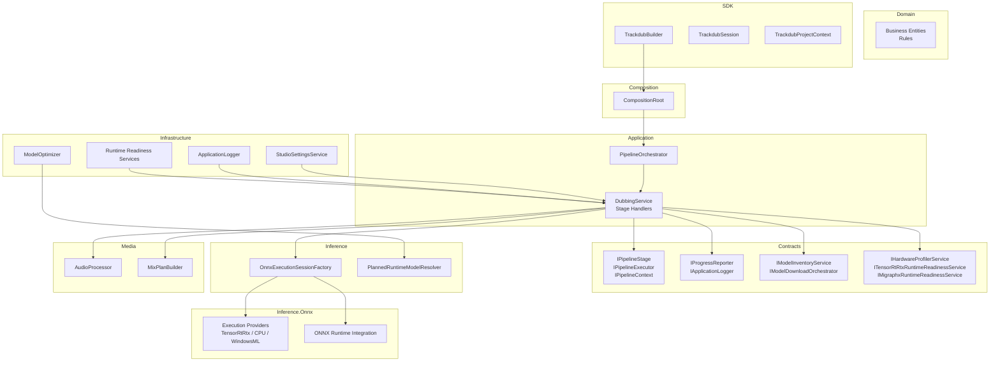
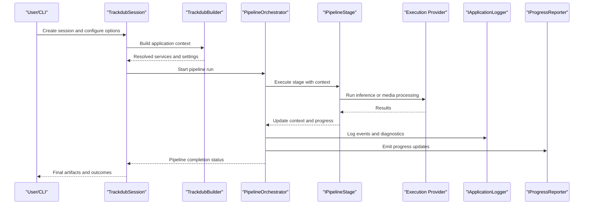
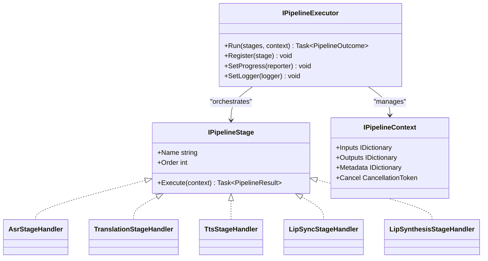
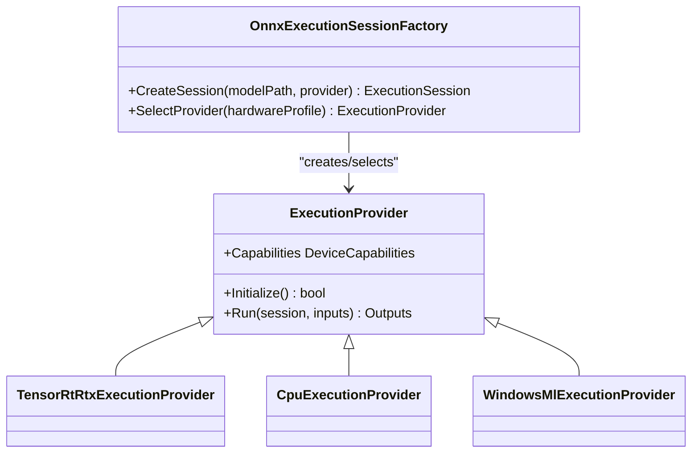
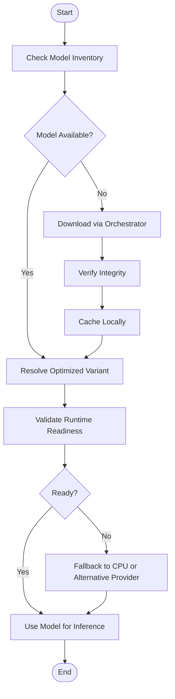
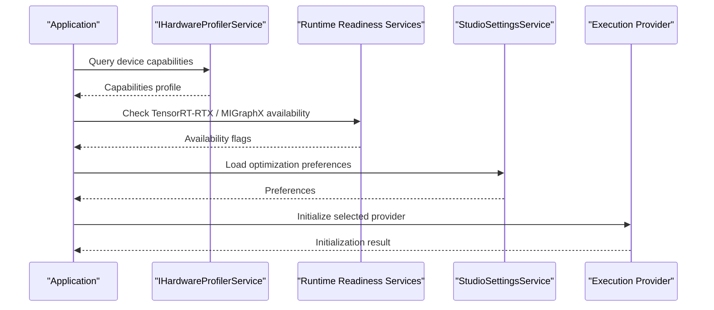
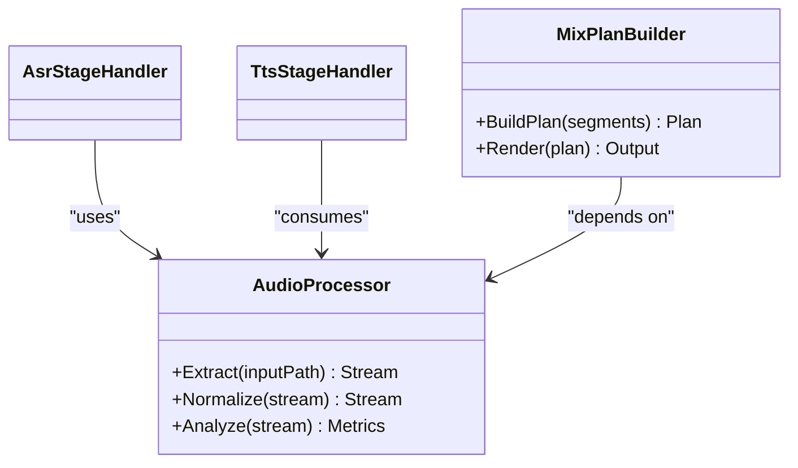
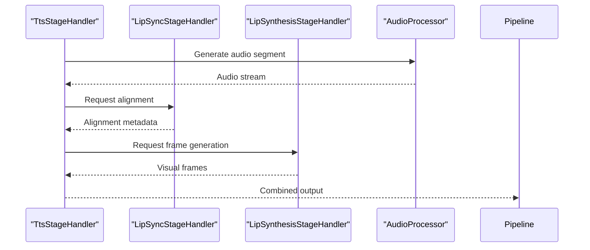
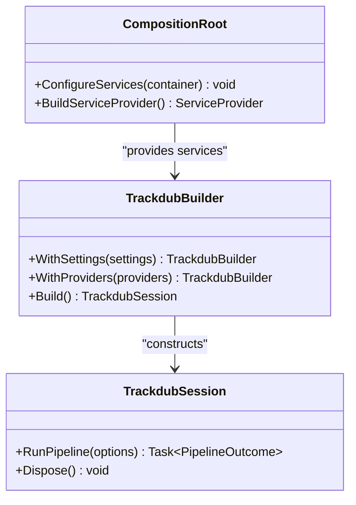
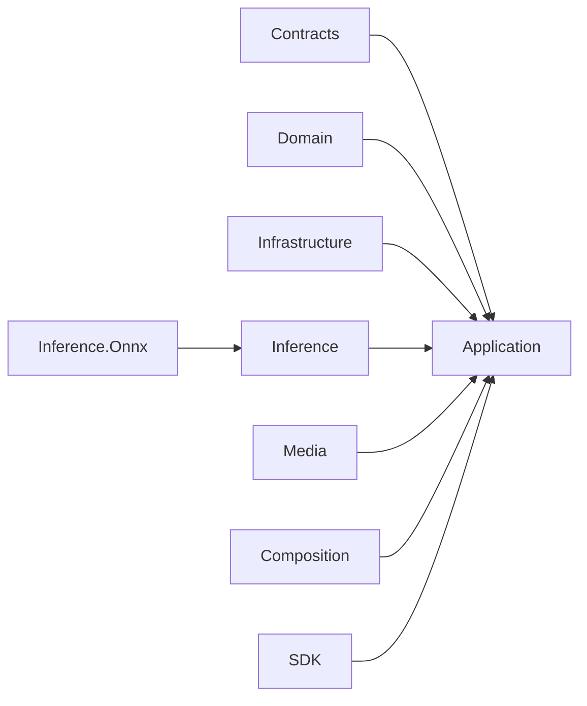

# Core Concepts & Architecture

<cite>
**Referenced Files in This Document**
- [README.md](file://README.md)
- [Trackdub.Application/README.md](file://src/Trackdub.Application/README.md)
- [Trackdub.Domain/README.md](file://src/Trackdub.Domain/README.md)
- [Trackdub.Infrastructure/README.md](file://src/Trackdub.Infrastructure/README.md)
- [Trackdub.Inference/README.md](file://src/Trackdub.Inference/README.md)
- [Trackdub.Inference.Onnx/README.md](file://src/Trackdub.Inference.Onnx/README.md)
- [Trackdub.Media/README.md](file://src/Trackdub.Media/README.md)
- [Trackdub.Sdk/TrackdubBuilder.cs](file://src/Trackdub.Sdk/TrackdubBuilder.cs)
- [Trackdub.Sdk/TrackdubSession.cs](file://src/Trackdub.Sdk/TrackdubSession.cs)
- [Trackdub.Sdk/TrackdubProjectContext.cs](file://src/Trackdub.Sdk/TrackdubProjectContext.cs)
- [Trackdub.Sdk/TrackdubPipelineStages.cs](file://src/Trackdub.Sdk/TrackdubPipelineStages.cs)
- [Trackdub.Composition/CompositionRoot.cs](file://src/Trackdub.Composition/CompositionRoot.cs)
- [Trackdub.Contracts/Pipeline/IPipelineStage.cs](file://src/Trackdub.Contracts/Pipeline/IPipelineStage.cs)
- [Trackdub.Contracts/Pipeline/IPipelineExecutor.cs](file://src/Trackdub.Contracts/Pipeline/IPipelineExecutor.cs)
- [Trackdub.Contracts/Pipeline/IPipelineContext.cs](file://src/Trackdub.Contracts/Pipeline/IPipelineContext.cs)
- [Trackdub.Contracts/Diagnostics/IProgressReporter.cs](file://src/Trackdub.Contracts/Diagnostics/IProgressReporter.cs)
- [Trackdub.Contracts/Diagnostics/IApplicationLogger.cs](file://src/Trackdub.Contracts/Diagnostics/IApplicationLogger.cs)
- [Trackdub.Contracts/IModelInventoryService.cs](file://src/Trackdub.Contracts/IModelInventoryService.cs)
- [Trackdub.Contracts/IModelDownloadOrchestrator.cs](file://src/Trackdub.Contracts/IModelDownloadOrchestrator.cs)
- [Trackdub.Contracts/IHardwareProfilerService.cs](file://src/Trackdub.Contracts/IHardwareProfilerService.cs)
- [Trackdub.Contracts/ITensorRtRtxRuntimeReadinessService.cs](file://src/Trackdub.Contracts/ITensorRtRtxRuntimeReadinessService.cs)
- [Trackdub.Contracts/IMigraphxRuntimeReadinessService.cs](file://src/Trackdub.Contracts/IMigraphxRuntimeReadinessService.cs)
- [Trackdub.Contracts/WinMlCatalogRuntimeReadinessServices.cs](file://src/Trackdub.Contracts/WinMlCatalogRuntimeReadinessServices.cs)
- [Trackdub.Inference/Runtime/OnnxExecutionSessionFactory.cs](file://src/Trackdub.Inference.Runtime/OnnxExecutionSessionFactory.cs)
- [Trackdub.Inference.Onnx/OnnxExecutionSessionFactory.cs](file://src/Trackdub.Inference.Onnx/OnnxExecutionSessionFactory.cs)
- [Trackdub.Inference.Onnx/ExecutionProviders/TensorRtRtxExecutionProvider.cs](file://src/Trackdub.Inference.Onnx/ExecutionProviders/TensorRtRtxExecutionProvider.cs)
- [Trackdub.Inference.Onnx/ExecutionProviders/CpuExecutionProvider.cs](file://src/Trackdub.Inference.Onnx/ExecutionProviders/CpuExecutionProvider.cs)
- [Trackdub.Inference.Onnx/ExecutionProviders/WindowsMlExecutionProvider.cs](file://src/Trackdub.Inference.Onnx/ExecutionProviders/WindowsMlExecutionProvider.cs)
- [Trackdub.Inference.Onnx/PlannedRuntimeModelResolver.cs](file://src/Trackdub.Inference.Onnx/PlannedRuntimeModelResolver.cs)
- [Trackdub.Infrastructure/ModelOptimization/ModelOptimizer.cs](file://src/Trackdub.Infrastructure/ModelOptimization/ModelOptimizer.cs)
- [Trackdub.Infrastructure/Logging/ApplicationLogger.cs](file://src/Trackdub.Infrastructure/Logging/ApplicationLogger.cs)
- [Trackdub.Infrastructure/Settings/StudioSettingsService.cs](file://src/Trackdub.Infrastructure/Settings/StudioSettingsService.cs)
- [Trackdub.Media/Process/AudioProcessor.cs](file://src/Trackdub.Media/Process/AudioProcessor.cs)
- [Trackdub.Media/Mixing/MixPlanBuilder.cs](file://src/Trackdub.Media/Mixing/MixPlanBuilder.cs)
- [Trackdub.Application/Pipeline/PipelineOrchestrator.cs](file://src/Trackdub.Application/Pipeline/PipelineOrchestrator.cs)
- [Trackdub.Application/Dubbing/DubbingService.cs](file://src/Trackdub.Application/Dubbing/DubbingService.cs)
- [Trackdub.Application/LipSync/LipSyncStageHandler.cs](file://src/Trackdub.Application/LipSync/LipSyncStageHandler.cs)
- [Trackdub.Application/LipSynthesis/LipSynthesisStageHandler.cs](file://src/Trackdub.Application/LipSynthesis/LipSynthesisStageHandler.cs)
- [Trackdub.Application/Transcripts/AsrStageHandler.cs](file://src/Trackdub.Application/Transcripts/AsrStageHandler.cs)
- [Trackdub.Application/Translation/TranslationStageHandler.cs](file://src/Trackdub.Application/Translation/TranslationStageHandler.cs)
- [Trackdub.Application/Tts/TtsStageHandler.cs](file://src/Trackdub.Application/Tts/TtsStageHandler.cs)
- [Trackdub.Cli/CliProgressReporter.cs](file://src/Trackdub.Cli/CliProgressReporter.cs)
- [Trackdub.Benchmarks/BenchmarkConsole.cs](file://src/Trackdub.Benchmarks/BenchmarkConsole.cs)
</cite>

## Table of Contents
1. Introduction
2. Project Structure
3. Core Components
4. Architecture Overview
5. Detailed Component Analysis
6. Dependency Analysis
7. Performance Considerations
8. Troubleshooting Guide
9. Conclusion

## Introduction
This document explains Trackdub’s core concepts and system design with a focus on the layered architecture pattern: Application, Domain, Infrastructure, and Inference layers. It describes the pipeline processing model, component composition patterns, dependency injection strategies, and the relationships between Media processing, Speech Recognition (ASR), Translation, TTS synthesis, and Lip-Sync technologies. It also details the execution provider abstraction, model management system, and hardware optimization framework. System context diagrams illustrate data flow between components, integration patterns, and extension points. Cross-cutting concerns such as logging, error handling, progress tracking, and resource management are addressed throughout.

## Project Structure
Trackdub is organized into multiple projects that reflect clear architectural boundaries:
- Contracts define interfaces for cross-layer communication.
- Domain encapsulates business entities and rules.
- Application orchestrates workflows using domain services and contracts.
- Infrastructure provides concrete implementations for storage, settings, logging, and runtime readiness.
- Inference abstracts model execution and pipelines.
- Inference.Onnx implements ONNX-based inference with execution providers and model resolvers.
- Media handles audio/video processing, mixing, and playback.
- Composition wires up dependencies at runtime.
- Sdk exposes a high-level API to build sessions and run pipelines.

**Diagram sources**
- [Trackdub.Contracts/Pipeline/IPipelineStage.cs](file://src/Trackdub.Contracts/Pipeline/IPipelineStage.cs)
- [Trackdub.Contracts/Pipeline/IPipelineExecutor.cs](file://src/Trackdub.Contracts/Pipeline/IPipelineExecutor.cs)
- [Trackdub.Contracts/Pipeline/IPipelineContext.cs](file://src/Trackdub.Contracts/Pipeline/IPipelineContext.cs)
- [Trackdub.Contracts/Diagnostics/IProgressReporter.cs](file://src/Trackdub.Contracts/Diagnostics/IProgressReporter.cs)
- [Trackdub.Contracts/Diagnostics/IApplicationLogger.cs](file://src/Trackdub.Contracts/Diagnostics/IApplicationLogger.cs)
- [Trackdub.Contracts/IModelInventoryService.cs](file://src/Trackdub.Contracts/IModelInventoryService.cs)
- [Trackdub.Contracts/IModelDownloadOrchestrator.cs](file://src/Trackdub.Contracts/IModelDownloadOrchestrator.cs)
- [Trackdub.Contracts/IHardwareProfilerService.cs](file://src/Trackdub.Contracts/IHardwareProfilerService.cs)
- [Trackdub.Contracts/ITensorRtRtxRuntimeReadinessService.cs](file://src/Trackdub.Contracts/ITensorRtRtxRuntimeReadinessService.cs)
- [Trackdub.Contracts/IMigraphxRuntimeReadinessService.cs](file://src/Trackdub.Contracts/IMigraphxRuntimeReadinessService.cs)
- [Trackdub.Inference/Runtime/OnnxExecutionSessionFactory.cs](file://src/Trackdub.Inference.Runtime/OnnxExecutionSessionFactory.cs)
- [Trackdub.Inference.Onnx/OnnxExecutionSessionFactory.cs](file://src/Trackdub.Inference.Onnx/OnnxExecutionSessionFactory.cs)
- [Trackdub.Inference.Onnx/ExecutionProviders/TensorRtRtxExecutionProvider.cs](file://src/Trackdub.Inference.Onnx/ExecutionProviders/TensorRtRtxExecutionProvider.cs)
- [Trackdub.Inference.Onnx/ExecutionProviders/CpuExecutionProvider.cs](file://src/Trackdub.Inference.Onnx/ExecutionProviders/CpuExecutionProvider.cs)
- [Trackdub.Inference.Onnx/ExecutionProviders/WindowsMlExecutionProvider.cs](file://src/Trackdub.Inference.Onnx/ExecutionProviders/WindowsMlExecutionProvider.cs)
- [Trackdub.Inference.Onnx/PlannedRuntimeModelResolver.cs](file://src/Trackdub.Inference.Onnx/PlannedRuntimeModelResolver.cs)
- [Trackdub.Infrastructure/ModelOptimization/ModelOptimizer.cs](file://src/Trackdub.Infrastructure/ModelOptimization/ModelOptimizer.cs)
- [Trackdub.Infrastructure/Logging/ApplicationLogger.cs](file://src/Trackdub.Infrastructure/Logging/ApplicationLogger.cs)
- [Trackdub.Infrastructure/Settings/StudioSettingsService.cs](file://src/Trackdub.Infrastructure/Settings/StudioSettingsService.cs)
- [Trackdub.Media/Process/AudioProcessor.cs](file://src/Trackdub.Media/Process/AudioProcessor.cs)
- [Trackdub.Media/Mixing/MixPlanBuilder.cs](file://src/Trackdub.Media/Mixing/MixPlanBuilder.cs)
- [Trackdub.Application/Pipeline/PipelineOrchestrator.cs](file://src/Trackdub.Application/Pipeline/PipelineOrchestrator.cs)
- [Trackdub.Application/Dubbing/DubbingService.cs](file://src/Trackdub.Application/Dubbing/DubbingService.cs)
- [Trackdub.Composition/CompositionRoot.cs](file://src/Trackdub.Composition/CompositionRoot.cs)
- [Trackdub.Sdk/TrackdubBuilder.cs](file://src/Trackdub.Sdk/TrackdubBuilder.cs)
- [Trackdub.Sdk/TrackdubSession.cs](file://src/Trackdub.Sdk/TrackdubSession.cs)
- [Trackdub.Sdk/TrackdubProjectContext.cs](file://src/Trackdub.Sdk/TrackdubProjectContext.cs)

**Section sources**
- [README.md](file://README.md)
- [Trackdub.Application/README.md](file://src/Trackdub.Application/README.md)
- [Trackdub.Domain/README.md](file://src/Trackdub.Domain/README.md)
- [Trackdub.Infrastructure/README.md](file://src/Trackdub.Infrastructure/README.md)
- [Trackdub.Inference/README.md](file://src/Trackdub.Inference/README.md)
- [Trackdub.Inference.Onnx/README.md](file://src/Trackdub.Inference.Onnx/README.md)
- [Trackdub.Media/README.md](file://src/Trackdub.Media/README.md)

## Core Components
- Pipeline Stages: Encapsulate discrete steps like ASR, translation, TTS, lip-sync, and export. Each stage implements a common interface and receives a shared context.
- Pipeline Executor: Orchestrates stage execution, manages lifecycle, and coordinates progress and errors.
- Execution Session Factory: Creates and configures ONNX execution sessions with appropriate providers based on hardware capabilities.
- Model Resolver: Selects optimal model variants per target runtime and device constraints.
- Hardware Profiler and Readiness Services: Detect devices, evaluate capabilities, and ensure required runtimes are available.
- Settings and Logging: Provide configuration access and structured logging across the system.
- Media Processing: Handles audio extraction, normalization, mixing, and waveform generation.

**Section sources**
- [Trackdub.Contracts/Pipeline/IPipelineStage.cs](file://src/Trackdub.Contracts/Pipeline/IPipelineStage.cs)
- [Trackdub.Contracts/Pipeline/IPipelineExecutor.cs](file://src/Trackdub.Contracts/Pipeline/IPipelineExecutor.cs)
- [Trackdub.Contracts/Pipeline/IPipelineContext.cs](file://src/Trackdub.Contracts/Pipeline/IPipelineContext.cs)
- [Trackdub.Inference.Onnx/OnnxExecutionSessionFactory.cs](file://src/Trackdub.Inference.Onnx/OnnxExecutionSessionFactory.cs)
- [Trackdub.Inference.Onnx/PlannedRuntimeModelResolver.cs](file://src/Trackdub.Inference.Onnx/PlannedRuntimeModelResolver.cs)
- [Trackdub.Contracts/IHardwareProfilerService.cs](file://src/Trackdub.Contracts/IHardwareProfilerService.cs)
- [Trackdub.Infrastructure/Settings/StudioSettingsService.cs](file://src/Trackdub.Infrastructure/Settings/StudioSettingsService.cs)
- [Trackdub.Infrastructure/Logging/ApplicationLogger.cs](file://src/Trackdub.Infrastructure/Logging/ApplicationLogger.cs)
- [Trackdub.Media/Process/AudioProcessor.cs](file://src/Trackdub.Media/Process/AudioProcessor.cs)
- [Trackdub.Media/Mixing/MixPlanBuilder.cs](file://src/Trackdub.Media/Mixing/MixPlanBuilder.cs)

## Architecture Overview
Trackdub follows a layered architecture:
- Application Layer: Composes domain services and orchestrates pipelines.
- Domain Layer: Contains business entities and rules.
- Infrastructure Layer: Implements cross-cutting concerns (logging, settings, model optimization).
- Inference Layer: Abstracts model execution; Onnx implementation provides execution providers and model resolution.

**Diagram sources**
- [Trackdub.Sdk/TrackdubSession.cs](file://src/Trackdub.Sdk/TrackdubSession.cs)
- [Trackdub.Sdk/TrackdubBuilder.cs](file://src/Trackdub.Sdk/TrackdubBuilder.cs)
- [Trackdub.Application/Pipeline/PipelineOrchestrator.cs](file://src/Trackdub.Application/Pipeline/PipelineOrchestrator.cs)
- [Trackdub.Contracts/Pipeline/IPipelineStage.cs](file://src/Trackdub.Contracts/Pipeline/IPipelineStage.cs)
- [Trackdub.Inference.Onnx/ExecutionProviders/TensorRtRtxExecutionProvider.cs](file://src/Trackdub.Inference.Onnx/ExecutionProviders/TensorRtRtxExecutionProvider.cs)
- [Trackdub.Contracts/Diagnostics/IApplicationLogger.cs](file://src/Trackdub.Contracts/Diagnostics/IApplicationLogger.cs)
- [Trackdub.Contracts/Diagnostics/IProgressReporter.cs](file://src/Trackdub.Contracts/Diagnostics/IProgressReporter.cs)

## Detailed Component Analysis

### Pipeline Processing Model
The pipeline model defines stages that transform inputs into outputs while sharing a common context. The executor manages ordering, retries, and progress reporting.

**Diagram sources**
- [Trackdub.Contracts/Pipeline/IPipelineStage.cs](file://src/Trackdub.Contracts/Pipeline/IPipelineStage.cs)
- [Trackdub.Contracts/Pipeline/IPipelineExecutor.cs](file://src/Trackdub.Contracts/Pipeline/IPipelineExecutor.cs)
- [Trackdub.Contracts/Pipeline/IPipelineContext.cs](file://src/Trackdub.Contracts/Pipeline/IPipelineContext.cs)
- [Trackdub.Application/Transcripts/AsrStageHandler.cs](file://src/Trackdub.Application/Transcripts/AsrStageHandler.cs)
- [Trackdub.Application/Translation/TranslationStageHandler.cs](file://src/Trackdub.Application/Translation/TranslationStageHandler.cs)
- [Trackdub.Application/Tts/TtsStageHandler.cs](file://src/Trackdub.Application/Tts/TtsStageHandler.cs)
- [Trackdub.Application/LipSync/LipSyncStageHandler.cs](file://src/Trackdub.Application/LipSync/LipSyncStageHandler.cs)
- [Trackdub.Application/LipSynthesis/LipSynthesisStageHandler.cs](file://src/Trackdub.Application/LipSynthesis/LipSynthesisStageHandler.cs)

**Section sources**
- [Trackdub.Contracts/Pipeline/IPipelineStage.cs](file://src/Trackdub.Contracts/Pipeline/IPipelineStage.cs)
- [Trackdub.Contracts/Pipeline/IPipelineExecutor.cs](file://src/Trackdub.Contracts/Pipeline/IPipelineExecutor.cs)
- [Trackdub.Contracts/Pipeline/IPipelineContext.cs](file://src/Trackdub.Contracts/Pipeline/IPipelineContext.cs)
- [Trackdub.Application/Pipeline/PipelineOrchestrator.cs](file://src/Trackdub.Application/Pipeline/PipelineOrchestrator.cs)

### Execution Provider Abstraction
Execution providers encapsulate backend-specific optimizations (CPU, TensorRT-RTX, Windows ML). The factory selects providers based on hardware and runtime availability.

**Diagram sources**
- [Trackdub.Inference.Onnx/OnnxExecutionSessionFactory.cs](file://src/Trackdub.Inference.Onnx/OnnxExecutionSessionFactory.cs)
- [Trackdub.Inference.Onnx/ExecutionProviders/TensorRtRtxExecutionProvider.cs](file://src/Trackdub.Inference.Onnx/ExecutionProviders/TensorRtRtxExecutionProvider.cs)
- [Trackdub.Inference.Onnx/ExecutionProviders/CpuExecutionProvider.cs](file://src/Trackdub.Inference.Onnx/ExecutionProviders/CpuExecutionProvider.cs)
- [Trackdub.Inference.Onnx/ExecutionProviders/WindowsMlExecutionProvider.cs](file://src/Trackdub.Inference.Onnx/ExecutionProviders/WindowsMlExecutionProvider.cs)

**Section sources**
- [Trackdub.Inference.Onnx/OnnxExecutionSessionFactory.cs](file://src/Trackdub.Inference.Onnx/OnnxExecutionSessionFactory.cs)
- [Trackdub.Inference.Onnx/ExecutionProviders/TensorRtRtxExecutionProvider.cs](file://src/Trackdub.Inference.Onnx/ExecutionProviders/TensorRtRtxExecutionProvider.cs)
- [Trackdub.Inference.Onnx/ExecutionProviders/CpuExecutionProvider.cs](file://src/Trackdub.Inference.Onnx/ExecutionProviders/CpuExecutionProvider.cs)
- [Trackdub.Inference.Onnx/ExecutionProviders/WindowsMlExecutionProvider.cs](file://src/Trackdub.Inference.Onnx/ExecutionProviders/WindowsMlExecutionProvider.cs)

### Model Management System
Model inventory and download orchestration manage availability, caching, and selection of models. The planned runtime model resolver chooses optimized variants per target device.

**Diagram sources**
- [Trackdub.Contracts/IModelInventoryService.cs](file://src/Trackdub.Contracts/IModelInventoryService.cs)
- [Trackdub.Contracts/IModelDownloadOrchestrator.cs](file://src/Trackdub.Contracts/IModelDownloadOrchestrator.cs)
- [Trackdub.Inference.Onnx/PlannedRuntimeModelResolver.cs](file://src/Trackdub.Inference.Onnx/PlannedRuntimeModelResolver.cs)
- [Trackdub.Contracts/ITensorRtRtxRuntimeReadinessService.cs](file://src/Trackdub.Contracts/ITensorRtRtxRuntimeReadinessService.cs)
- [Trackdub.Contracts/IMigraphxRuntimeReadinessService.cs](file://src/Trackdub.Contracts/IMigraphxRuntimeReadinessService.cs)

**Section sources**
- [Trackdub.Contracts/IModelInventoryService.cs](file://src/Trackdub.Contracts/IModelInventoryService.cs)
- [Trackdub.Contracts/IModelDownloadOrchestrator.cs](file://src/Trackdub.Contracts/IModelDownloadOrchestrator.cs)
- [Trackdub.Inference.Onnx/PlannedRuntimeModelResolver.cs](file://src/Trackdub.Inference.Onnx/PlannedRuntimeModelResolver.cs)
- [Trackdub.Contracts/ITensorRtRtxRuntimeReadinessService.cs](file://src/Trackdub.Contracts/ITensorRtRtxRuntimeReadinessService.cs)
- [Trackdub.Contracts/IMigraphxRuntimeReadinessService.cs](file://src/Trackdub.Contracts/IMigraphxRuntimeReadinessService.cs)

### Hardware Optimization Framework
Hardware profiling and readiness services guide provider selection and fallback strategies. Settings influence optimization behavior and performance tuning.

**Diagram sources**
- [Trackdub.Contracts/IHardwareProfilerService.cs](file://src/Trackdub.Contracts/IHardwareProfilerService.cs)
- [Trackdub.Contracts/ITensorRtRtxRuntimeReadinessService.cs](file://src/Trackdub.Contracts/ITensorRtRtxRuntimeReadinessService.cs)
- [Trackdub.Contracts/IMigraphxRuntimeReadinessService.cs](file://src/Trackdub.Contracts/IMigraphxRuntimeReadinessService.cs)
- [Trackdub.Infrastructure/Settings/StudioSettingsService.cs](file://src/Trackdub.Infrastructure/Settings/StudioSettingsService.cs)
- [Trackdub.Inference.Onnx/ExecutionProviders/TensorRtRtxExecutionProvider.cs](file://src/Trackdub.Inference.Onnx/ExecutionProviders/TensorRtRtxExecutionProvider.cs)

**Section sources**
- [Trackdub.Contracts/IHardwareProfilerService.cs](file://src/Trackdub.Contracts/IHardwareProfilerService.cs)
- [Trackdub.Contracts/ITensorRtRtxRuntimeReadinessService.cs](file://src/Trackdub.Contracts/ITensorRtRtxRuntimeReadinessService.cs)
- [Trackdub.Contracts/IMigraphxRuntimeReadinessService.cs](file://src/Trackdub.Contracts/IMigraphxRuntimeReadinessService.cs)
- [Trackdub.Infrastructure/Settings/StudioSettingsService.cs](file://src/Trackdub.Infrastructure/Settings/StudioSettingsService.cs)

### Media Processing Modules
Media modules handle audio extraction, normalization, mixing, and waveform generation. They integrate with pipeline stages to provide preprocessed assets.

**Diagram sources**
- [Trackdub.Media/Process/AudioProcessor.cs](file://src/Trackdub.Media/Process/AudioProcessor.cs)
- [Trackdub.Media/Mixing/MixPlanBuilder.cs](file://src/Trackdub.Media/Mixing/MixPlanBuilder.cs)
- [Trackdub.Application/Transcripts/AsrStageHandler.cs](file://src/Trackdub.Application/Transcripts/AsrStageHandler.cs)
- [Trackdub.Application/Tts/TtsStageHandler.cs](file://src/Trackdub.Application/Tts/TtsStageHandler.cs)

**Section sources**
- [Trackdub.Media/Process/AudioProcessor.cs](file://src/Trackdub.Media/Process/AudioProcessor.cs)
- [Trackdub.Media/Mixing/MixPlanBuilder.cs](file://src/Trackdub.Media/Mixing/MixPlanBuilder.cs)
- [Trackdub.Application/Transcripts/AsrStageHandler.cs](file://src/Trackdub.Application/Transcripts/AsrStageHandler.cs)
- [Trackdub.Application/Tts/TtsStageHandler.cs](file://src/Trackdub.Application/Tts/TtsStageHandler.cs)

### Lip-Sync and Lip Synthesis
Lip-sync aligns generated speech with visual cues, while lip synthesis generates mouth movement frames aligned to audio segments.

**Diagram sources**
- [Trackdub.Application/Tts/TtsStageHandler.cs](file://src/Trackdub.Application/Tts/TtsStageHandler.cs)
- [Trackdub.Application/LipSync/LipSyncStageHandler.cs](file://src/Trackdub.Application/LipSync/LipSyncStageHandler.cs)
- [Trackdub.Application/LipSynthesis/LipSynthesisStageHandler.cs](file://src/Trackdub.Application/LipSynthesis/LipSynthesisStageHandler.cs)
- [Trackdub.Media/Process/AudioProcessor.cs](file://src/Trackdub.Media/Process/AudioProcessor.cs)

**Section sources**
- [Trackdub.Application/Tts/TtsStageHandler.cs](file://src/Trackdub.Application/Tts/TtsStageHandler.cs)
- [Trackdub.Application/LipSync/LipSyncStageHandler.cs](file://src/Trackdub.Application/LipSync/LipSyncStageHandler.cs)
- [Trackdub.Application/LipSynthesis/LipSynthesisStageHandler.cs](file://src/Trackdub.Application/LipSynthesis/LipSynthesisStageHandler.cs)
- [Trackdub.Media/Process/AudioProcessor.cs](file://src/Trackdub.Media/Process/AudioProcessor.cs)

### Dependency Injection and Composition
CompositionRoot wires up services, settings, and providers. The SDK builder constructs sessions with resolved dependencies.

**Diagram sources**
- [Trackdub.Composition/CompositionRoot.cs](file://src/Trackdub.Composition/CompositionRoot.cs)
- [Trackdub.Sdk/TrackdubBuilder.cs](file://src/Trackdub.Sdk/TrackdubBuilder.cs)
- [Trackdub.Sdk/TrackdubSession.cs](file://src/Trackdub.Sdk/TrackdubSession.cs)

**Section sources**
- [Trackdub.Composition/CompositionRoot.cs](file://src/Trackdub.Composition/CompositionRoot.cs)
- [Trackdub.Sdk/TrackdubBuilder.cs](file://src/Trackdub.Sdk/TrackdubBuilder.cs)
- [Trackdub.Sdk/TrackdubSession.cs](file://src/Trackdub.Sdk/TrackdubSession.cs)

## Dependency Analysis
The system exhibits clear separation of concerns:
- Contracts define stable interfaces used by Application and Infrastructure.
- Domain remains free of infrastructure concerns.
- Inference abstracts model execution; Onnx implementation depends on providers and resolvers.
- Media integrates with stages but does not depend on inference directly.

**Diagram sources**
- [Trackdub.Contracts/Pipeline/IPipelineStage.cs](file://src/Trackdub.Contracts/Pipeline/IPipelineStage.cs)
- [Trackdub.Application/Pipeline/PipelineOrchestrator.cs](file://src/Trackdub.Application/Pipeline/PipelineOrchestrator.cs)
- [Trackdub.Infrastructure/ModelOptimization/ModelOptimizer.cs](file://src/Trackdub.Infrastructure/ModelOptimization/ModelOptimizer.cs)
- [Trackdub.Inference.Onnx/OnnxExecutionSessionFactory.cs](file://src/Trackdub.Inference.Onnx/OnnxExecutionSessionFactory.cs)
- [Trackdub.Media/Process/AudioProcessor.cs](file://src/Trackdub.Media/Process/AudioProcessor.cs)
- [Trackdub.Composition/CompositionRoot.cs](file://src/Trackdub.Composition/CompositionRoot.cs)
- [Trackdub.Sdk/TrackdubBuilder.cs](file://src/Trackdub.Sdk/TrackdubBuilder.cs)

**Section sources**
- [Trackdub.Contracts/Pipeline/IPipelineStage.cs](file://src/Trackdub.Contracts/Pipeline/IPipelineStage.cs)
- [Trackdub.Application/Pipeline/PipelineOrchestrator.cs](file://src/Trackdub.Application/Pipeline/PipelineOrchestrator.cs)
- [Trackdub.Infrastructure/ModelOptimization/ModelOptimizer.cs](file://src/Trackdub.Infrastructure/ModelOptimization/ModelOptimizer.cs)
- [Trackdub.Inference.Onnx/OnnxExecutionSessionFactory.cs](file://src/Trackdub.Inference.Onnx/OnnxExecutionSessionFactory.cs)
- [Trackdub.Media/Process/AudioProcessor.cs](file://src/Trackdub.Media/Process/AudioProcessor.cs)
- [Trackdub.Composition/CompositionRoot.cs](file://src/Trackdub.Composition/CompositionRoot.cs)
- [Trackdub.Sdk/TrackdubBuilder.cs](file://src/Trackdub.Sdk/TrackdubBuilder.cs)

## Performance Considerations
- Prefer GPU-accelerated providers when available (TensorRT-RTX, Windows ML).
- Use model optimization tools to select quantized or compiled variants.
- Leverage hardware profiling to choose appropriate providers and batch sizes.
- Monitor memory usage and avoid unnecessary allocations during inference.
- Utilize caching for models and intermediate artifacts to reduce I/O overhead.

[No sources needed since this section provides general guidance]

## Troubleshooting Guide
Common issues and resolutions:
- Provider initialization failures: Verify runtime availability and driver versions; fall back to CPU if necessary.
- Model loading errors: Ensure integrity checks pass and cached copies are valid; re-download if corrupted.
- Progress not updating: Confirm progress reporter is registered and cancellation tokens are respected.
- Logging missing: Ensure application logger is configured and log levels are appropriate.

**Section sources**
- [Trackdub.Contracts/Diagnostics/IProgressReporter.cs](file://src/Trackdub.Contracts/Diagnostics/IProgressReporter.cs)
- [Trackdub.Contracts/Diagnostics/IApplicationLogger.cs](file://src/Trackdub.Contracts/Diagnostics/IApplicationLogger.cs)
- [Trackdub.Infrastructure/Logging/ApplicationLogger.cs](file://src/Trackdub.Infrastructure/Logging/ApplicationLogger.cs)
- [Trackdub.Contracts/ITensorRtRtxRuntimeReadinessService.cs](file://src/Trackdub.Contracts/ITensorRtRtxRuntimeReadinessService.cs)
- [Trackdub.Contracts/IMigraphxRuntimeReadinessService.cs](file://src/Trackdub.Contracts/IMigraphxRuntimeReadinessService.cs)

## Conclusion
Trackdub’s architecture emphasizes modularity, extensibility, and performance through clear layering, robust pipeline abstractions, and flexible execution providers. By separating concerns across Application, Domain, Infrastructure, and Inference layers, the system supports diverse hardware targets and evolving model ecosystems. The provided diagrams and references offer both conceptual clarity and technical depth for developers integrating new features or optimizing existing pipelines.

[No sources needed since this section summarizes without analyzing specific files]