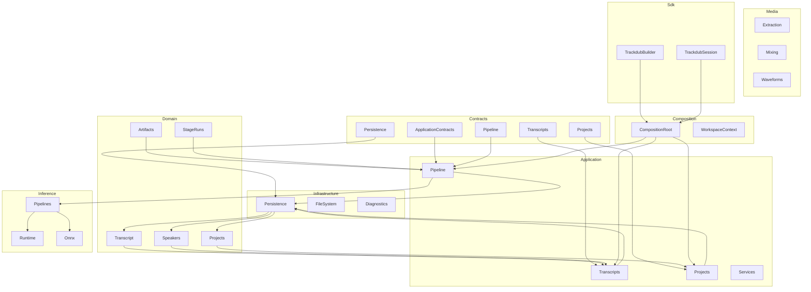
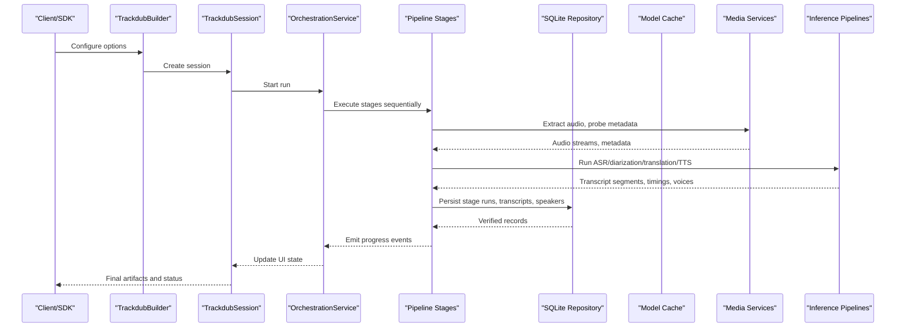
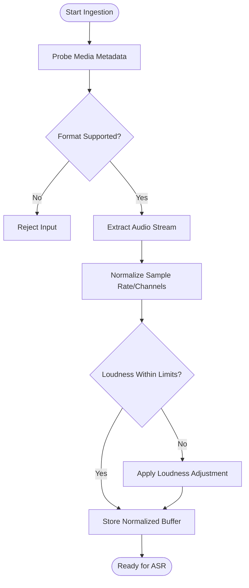
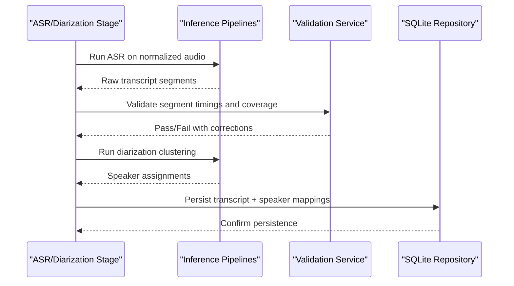
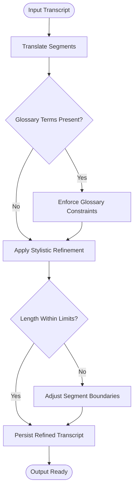
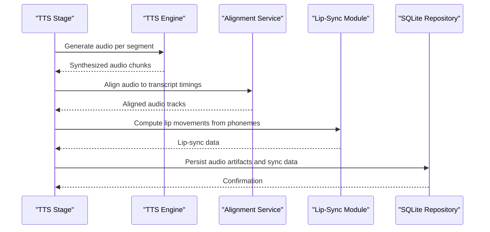
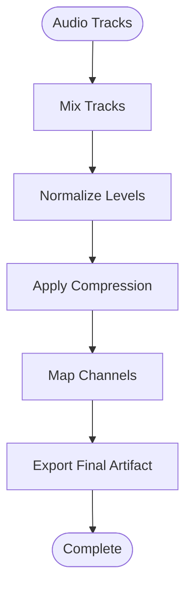
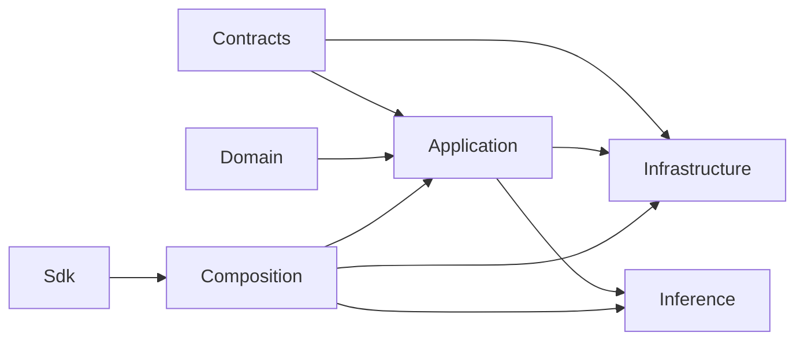

# Data Flow Patterns & State Management

<cite>
**Referenced Files in This Document**
- [Trackdub.Application.csproj](file://src/Trackdub.Application/Trackdub.Application.csproj)
- [Trackdub.Domain.csproj](file://src/Trackdub.Domain/Trackdub.Domain.csproj)
- [Trackdub.Infrastructure.csproj](file://src/Trackdub.Infrastructure/Trackdub.Infrastructure.csproj)
- [Trackdub.Contracts.csproj](file://src/Trackdub.Contracts/Trackdub.Contracts.csproj)
- [Trackdub.Media.csproj](file://src/Trackdub.Media/Trackdub.Media.csproj)
- [Trackdub.Inference.csproj](file://src/Trackdub.Inference/Trackdub.Inference.csproj)
- [Trackdub.Inference.Onnx.csproj](file://src/Trackdub.Inference.Onnx/Trackdub.Inference.Onnx.csproj)
- [Trackdub.Sdk.csproj](file://src/Trackdub.Sdk/Trackdub.Sdk.csproj)
- [Trackdub.Composition.csproj](file://src/Trackdub.Composition/Trackdub.Composition.csproj)
- [ARCHITECTURE.md](file://docs/architecture/ARCHITECTURE.md)
- [ADR-0002-sqlite-project-persistence.md](file://docs/decisions/ADR-0002-sqlite-project-persistence.md)
- [ADR-0010-event-sourced-pipeline.md](file://docs/decisions/ADR-0010-event-sourced-pipeline.md)
- [pipeline-principles-review-grok-2026-07-08.md](file://docs/architecture/pipeline-principles-review-grok-2026-07-08.md)
- [local-pipeline-audit-unified-2026-07-08.md](file://docs/architecture/local-pipeline-audit-unified-2026-07-08.md)
- [ProjectSessionServiceTests.cs](file://tests/Trackdub.Application.Tests/ProjectSessionServiceTests.cs)
- [AsrStageHandlerTests.cs](file://tests/Trackdub.Application.Tests/AsrStageHandlerTests.cs)
- [SpeakerAssignmentAndPersistenceStageTests.cs](file://tests/Trackdub.Application.Tests/SpeakerAssignmentAndPersistenceStageTests.cs)
- [OrchestrationServiceTests.cs](file://tests/Trackdub.Application.Tests/OrchestrationServiceTests.cs)
</cite>

## Table of Contents
1. Introduction
2. Project Structure
3. Core Components
4. Architecture Overview
5. Detailed Component Analysis
6. Dependency Analysis
7. Performance Considerations
8. Troubleshooting Guide
9. Conclusion

## Introduction
This document explains Trackdub’s data flow patterns and state management strategies across the pipeline from media ingestion to final output. It covers domain models for projects, sessions, transcripts, and speakers; persistence using SQLite; caching strategies; synchronization patterns; validation and transformation pipelines; event-driven updates; concurrency and transaction management; and consistency guarantees across components. The goal is to provide a clear mental model for both new contributors and experienced developers working on data-centric features.

## Project Structure
Trackdub is organized into layered packages that separate concerns:
- Contracts define interfaces and shared types used across layers.
- Domain holds core business entities and rules.
- Application orchestrates workflows, stages, and services.
- Infrastructure implements persistence (SQLite), file system access, and other cross-cutting concerns.
- Media provides audio/video processing utilities.
- Inference encapsulates AI runtime orchestration and execution providers.
- Composition wires dependencies and bootstraps contexts.
- Sdk exposes a programmatic API for external automation.

**Diagram sources**
- [Trackdub.Contracts.csproj](file://src/Trackdub.Contracts/Trackdub.Contracts.csproj)
- [Trackdub.Domain.csproj](file://src/Trackdub.Domain/Trackdub.Domain.csproj)
- [Trackdub.Application.csproj](file://src/Trackdub.Application/Trackdub.Application.csproj)
- [Trackdub.Infrastructure.csproj](file://src/Trackdub.Infrastructure/Trackdub.Infrastructure.csproj)
- [Trackdub.Media.csproj](file://src/Trackdub.Media/Trackdub.Media.csproj)
- [Trackdub.Inference.csproj](file://src/Trackdub.Inference/Trackdub.Inference.csproj)
- [Trackdub.Inference.Onnx.csproj](file://src/Trackdub.Inference.Onnx/Trackdub.Inference.Onnx.csproj)
- [Trackdub.Composition.csproj](file://src/Trackdub.Composition/Trackdub.Composition.csproj)
- [Trackdub.Sdk.csproj](file://src/Trackdub.Sdk/Trackdub.Sdk.csproj)

**Section sources**
- [ARCHITECTURE.md](file://docs/architecture/ARCHITECTURE.md)
- [Trackdub.Application.csproj](file://src/Trackdub.Application/Trackdub.Application.csproj)
- [Trackdub.Domain.csproj](file://src/Trackdub.Domain/Trackdub.Domain.csproj)
- [Trackdub.Infrastructure.csproj](file://src/Trackdub.Infrastructure/Trackdub.Infrastructure.csproj)
- [Trackdub.Contracts.csproj](file://src/Trackdub.Contracts/Trackdub.Contracts.csproj)
- [Trackdub.Media.csproj](file://src/Trackdub.Media/Trackdub.Media.csproj)
- [Trackdub.Inference.csproj](file://src/Trackdub.Inference/Trackdub.Inference.csproj)
- [Trackdub.Inference.Onnx.csproj](file://src/Trackdub.Inference.Onnx/Trackdub.Inference.Onnx.csproj)
- [Trackdub.Composition.csproj](file://src/Trackdub.Composition/Trackdub.Composition.csproj)
- [Trackdub.Sdk.csproj](file://src/Trackdub.Sdk/Trackdub.Sdk.csproj)

## Core Components
- Projects: Represent user workspaces containing media assets, sessions, and artifacts.
- Sessions: Scoped units of work within a project, tracking progress and outputs.
- Transcripts: Structured text with timing and speaker assignments derived from ASR and diarization.
- Speakers: Entities representing distinct voice identities linked to transcript segments.
- Stage Runs: Records of individual pipeline stage executions with provenance and outcomes.
- Artifacts: Output files and metadata produced by stages (audio, subtitles, alignments).

These models are persisted via SQLite and updated through event-driven mechanisms during pipeline execution. Validation occurs at ingestion and between stages to ensure integrity.

**Section sources**
- [Trackdub.Domain.csproj](file://src/Trackdub.Domain/Trackdub.Domain.csproj)
- [Trackdub.Contracts.csproj](file://src/Trackdub.Contracts/Trackdub.Contracts.csproj)
- [Trackdub.Application.csproj](file://src/Trackdub.Application/Trackdub.Application.csproj)

## Architecture Overview
The pipeline follows an event-sourced pattern where each stage emits events that drive downstream transformations and UI updates. Data flows from media ingestion through preprocessing, ASR, diarization, translation/refinement, TTS generation, lip-sync, mixing, and export. Each step validates inputs, transforms data, and persists intermediate results.

**Diagram sources**
- [Trackdub.Sdk.csproj](file://src/Trackdub.Sdk/Trackdub.Sdk.csproj)
- [Trackdub.Application.csproj](file://src/Trackdub.Application/Trackdub.Application.csproj)
- [Trackdub.Infrastructure.csproj](file://src/Trackdub.Infrastructure/Trackdub.Infrastructure.csproj)
- [Trackdub.Media.csproj](file://src/Trackdub.Media/Trackdub.Media.csproj)
- [Trackdub.Inference.csproj](file://src/Trackdub.Inference/Trackdub.Inference.csproj)

## Detailed Component Analysis

### Media Ingestion and Validation
- Media ingestion extracts audio streams, probes format/sample rate, and normalizes to a canonical representation.
- Validation checks supported formats, duration limits, and loudness thresholds before proceeding.
- Intermediate artifacts include normalized PCM buffers and waveform summaries.

**Diagram sources**
- [Trackdub.Media.csproj](file://src/Trackdub.Media/Trackdub.Media.csproj)
- [Trackdub.Application.csproj](file://src/Trackdub.Application/Trackdub.Application.csproj)

**Section sources**
- [Trackdub.Media.csproj](file://src/Trackdub.Media/Trackdub.Media.csproj)
- [Trackdub.Application.csproj](file://src/Trackdub.Application/Trackdub.Application.csproj)

### ASR and Diarization Pipeline
- ASR converts audio to time-aligned word/phrase segments.
- Diarization clusters speaker turns and assigns speaker IDs.
- Outputs are validated for coverage and overlap constraints.

**Diagram sources**
- [Trackdub.Inference.csproj](file://src/Trackdub.Inference/Trackdub.Inference.csproj)
- [Trackdub.Application.csproj](file://src/Trackdub.Application/Trackdub.Application.csproj)
- [Trackdub.Infrastructure.csproj](file://src/Trackdub.Infrastructure/Trackdub.Infrastructure.csproj)

**Section sources**
- [AsrStageHandlerTests.cs](file://tests/Trackdub.Application.Tests/AsrStageHandlerTests.cs)
- [SpeakerAssignmentAndPersistenceStageTests.cs](file://tests/Trackdub.Application.Tests/SpeakerAssignmentAndPersistenceStageTests.cs)

### Translation and Text Refinement
- Translates source transcript to target language while preserving timing.
- Applies glossary enforcement and stylistic refinement rules.
- Validates semantic fidelity and length constraints relative to original segments.

**Diagram sources**
- [Trackdub.Application.csproj](file://src/Trackdub.Application/Trackdub.Application.csproj)
- [Trackdub.Contracts.csproj](file://src/Trackdub.Contracts/Trackdub.Contracts.csproj)

**Section sources**
- [Trackdub.Application.csproj](file://src/Trackdub.Application/Trackdub.Application.csproj)
- [Trackdub.Contracts.csproj](file://src/Trackdub.Contracts/Trackdub.Contracts.csproj)

### TTS Generation and Lip-Sync
- Generates speech audio per speaker using selected TTS engine.
- Aligns generated audio with transcript timings and applies prosody adjustments.
- Lip-sync synthesizes visual cues based on phoneme timing.

**Diagram sources**
- [Trackdub.Application.csproj](file://src/Trackdub.Application/Trackdub.Application.csproj)
- [Trackdub.Inference.csproj](file://src/Trackdub.Inference/Trackdub.Inference.csproj)
- [Trackdub.Infrastructure.csproj](file://src/Trackdub.Infrastructure/Trackdub.Infrastructure.csproj)

**Section sources**
- [Trackdub.Application.csproj](file://src/Trackdub.Application/Trackdub.Application.csproj)
- [Trackdub.Inference.csproj](file://src/Trackdub.Inference/Trackdub.Inference.csproj)

### Mixing and Export
- Mixes multiple audio tracks (original, TTS, effects) into final output.
- Applies normalization, compression, and channel mapping.
- Exports video/audio artifacts with embedded subtitles and metadata.

**Diagram sources**
- [Trackdub.Media.csproj](file://src/Trackdub.Media/Trackdub.Media.csproj)
- [Trackdub.Application.csproj](file://src/Trackdub.Application/Trackdub.Application.csproj)

**Section sources**
- [Trackdub.Media.csproj](file://src/Trackdub.Media/Trackdub.Media.csproj)
- [Trackdub.Application.csproj](file://src/Trackdub.Application/Trackdub.Application.csproj)

## Dependency Analysis
Trackdub enforces strict layering:
- Contracts define interfaces consumed by Application and Infrastructure.
- Domain models are immutable and referenced by Application services.
- Infrastructure implements persistence and file system operations.
- Inference encapsulates AI runtime dependencies.
- Composition wires all components together.

**Diagram sources**
- [Trackdub.Contracts.csproj](file://src/Trackdub.Contracts/Trackdub.Contracts.csproj)
- [Trackdub.Domain.csproj](file://src/Trackdub.Domain/Trackdub.Domain.csproj)
- [Trackdub.Application.csproj](file://src/Trackdub.Application/Trackdub.Application.csproj)
- [Trackdub.Infrastructure.csproj](file://src/Trackdub.Infrastructure/Trackdub.Infrastructure.csproj)
- [Trackdub.Inference.csproj](file://src/Trackdub.Inference/Trackdub.Inference.csproj)
- [Trackdub.Composition.csproj](file://src/Trackdub.Composition/Trackdub.Composition.csproj)
- [Trackdub.Sdk.csproj](file://src/Trackdub.Sdk/Trackdub.Sdk.csproj)

**Section sources**
- [Trackdub.Contracts.csproj](file://src/Trackdub.Contracts/Trackdub.Contracts.csproj)
- [Trackdub.Domain.csproj](file://src/Trackdub.Domain/Trackdub.Domain.csproj)
- [Trackdub.Application.csproj](file://src/Trackdub.Application/Trackdub.Application.csproj)
- [Trackdub.Infrastructure.csproj](file://src/Trackdub.Infrastructure/Trackdub.Infrastructure.csproj)
- [Trackdub.Inference.csproj](file://src/Trackdub.Inference/Trackdub.Inference.csproj)
- [Trackdub.Composition.csproj](file://src/Trackdub.Composition/Trackdub.Composition.csproj)
- [Trackdub.Sdk.csproj](file://src/Trackdub.Sdk/Trackdub.Sdk.csproj)

## Performance Considerations
- Model caching reduces startup latency and repeated downloads.
- Batched inference minimizes overhead for large transcripts.
- Streaming audio processing avoids loading entire files into memory.
- SQLite transactions group writes to reduce disk I/O.
- GPU acceleration via execution providers improves ASR/TTS throughput.

[No sources needed since this section provides general guidance]

## Troubleshooting Guide
Common issues and resolutions:
- Invalid media format: Ensure input conforms to supported codecs and sample rates.
- ASR failures: Check audio quality, noise levels, and model availability.
- Diarization errors: Verify sufficient speaker separation and audio clarity.
- Persistence conflicts: Use proper transaction boundaries and retry logic.
- Event synchronization: Monitor pipeline events for stalled stages.

**Section sources**
- [ProjectSessionServiceTests.cs](file://tests/Trackdub.Application.Tests/ProjectSessionServiceTests.cs)
- [OrchestrationServiceTests.cs](file://tests/Trackdub.Application.Tests/OrchestrationServiceTests.cs)

## Conclusion
Trackdub’s data flow combines robust validation, event-driven orchestration, and persistent state management to deliver reliable transcription, translation, and dubbing workflows. By adhering to layered architecture principles and leveraging SQLite for consistent storage, the system ensures scalability and maintainability while supporting complex media processing tasks.

[No sources needed since this section summarizes without analyzing specific files]