# Extension Points & Customization

<cite>
**Referenced Files in This Document**
- [Trackdub.Contracts.csproj](file://src/Trackdub.Contracts/Trackdub.Contracts.csproj)
- [Trackdub.Application.csproj](file://src/Trackdub.Application/Trackdub.Application.csproj)
- [Trackdub.Composition.csproj](file://src/Trackdub.Composition/Trackdub.Composition.csproj)
- [Trackdub.Inference.csproj](file://src/Trackdub.Inference/Trackdub.Inference.csproj)
- [Trackdub.Inference.Onnx.csproj](file://src/Trackdub.Inference.Onnx/Trackdub.Inference.Onnx.csproj)
- [CompositionRoot.cs](file://src/Trackdub.Composition/CompositionRoot.cs)
- [TranscriptWorkspaceFactory.cs](file://src/Trackdub.Composition/TranscriptWorkspaceFactory.cs)
- [TranscriptWorkspaceContext.cs](file://src/Trackdub.Composition/TranscriptWorkspaceContext.cs)
- [TrackdubBuilder.cs](file://src/Trackdub.Sdk/TrackdubBuilder.cs)
- [TrackdubSession.cs](file://src/Trackdub.Sdk/TrackdubSession.cs)
- [TrackdubProjectContextResolver.cs](file://src/Trackdub.Sdk/TrackdubProjectContextResolver.cs)
- [TrackdubPipelineStages.cs](file://src/Trackdub.Sdk/TrackdubPipelineStages.cs)
- [TrackdubPipelineReadinessChecker.cs](file://src/Trackdub.Sdk/TrackdubPipelineReadinessChecker.cs)
- [IModelAliasResolver.cs](file://src/Trackdub.Contracts/IModelAliasResolver.cs)
- [IModelInventoryService.cs](file://src/Trackdub.Contracts/IModelInventoryService.cs)
- [IModelDownloadOrchestrator.cs](file://src/Trackdub.Contracts/IModelDownloadOrchestrator.cs)
- [IModelCacheVerifier.cs](file://src/Trackdub.Contracts/IModelCacheVerifier.cs)
- [ITtsAudioPostProcessor.cs](file://src/Trackdub.Contracts/ITtsAudioPostProcessor.cs)
- [IAudioClipExtractor.cs](file://src/Trackdub.Contracts/IAudioClipExtractor.cs)
- [IAudioSegmentExtractor.cs](file://src/Trackdub.Contracts/IAudioSegmentExtractor.cs)
- [ISpeechAudioEnhancementService.cs](file://src/Trackdub.Contracts/ISpeechAudioEnhancementService.cs)
- [ISpeechAudioPreparationServices.cs](file://src/Trackdub.Contracts/ISpeechAudioPreparationServices.cs)
- [IMediaProbe.cs](file://src/Trackdub.Contracts/IMediaProbe.cs)
- [IFileFingerprintService.cs](file://src/Trackdub.Contracts/IFileFingerprintService.cs)
- [IEngineCacheMaintenanceService.cs](file://src/Trackdub.Contracts/IEngineCacheMaintenanceService.cs)
- [IHardwareProfilerService.cs](file://src/Trackdub.Contracts/IHardwareProfilerService.cs)
- [IStudioSettingsService.cs](file://src/Trackdub.Contracts/IStudioSettingsService.cs)
- [IApplicationLogger.cs](file://src/Trackdub.Contracts/IApplicationLogger.cs)
- [ArtifactWriteHandle.cs](file://src/Trackdub.Contracts/ArtifactWriteHandle.cs)
- [Pipeline/StageDefinition.cs](file://src/Trackdub.Contracts/Pipeline/StageDefinition.cs)
- [Pipeline/StageHandler.cs](file://src/Trackdub.Contracts/Pipeline/StageHandler.cs)
- [Pipeline/StageExecutionResult.cs](file://src/Trackdub.Contracts/Pipeline/StageExecutionResult.cs)
- [Pipeline/StageRunContext.cs](file://src/Trackdub.Contracts/Pipeline/StageRunContext.cs)
- [Pipeline/StageRunId.cs](file://src/Trackdub.Contracts/Pipeline/StageRunId.cs)
- [Pipeline/StageRunStatus.cs](file://src/Trackdub.Contracts/Pipeline/StageRunStatus.cs)
- [Pipeline/StageRunMetadata.cs](file://src/Trackdub.Contracts/Pipeline/StageRunMetadata.cs)
- [Pipeline/StageRunProgress.cs](file://src/Trackdub.Contracts/Pipeline/StageRunProgress.cs)
- [Pipeline/StageRunEvent.cs](file://src/Trackdub.Contracts/Pipeline/StageRunEvent.cs)
- [Pipeline/StageRunTelemetry.cs](file://src/Trackdub.Contracts/Pipeline/StageRunTelemetry.cs)
- [Pipeline/StageRunError.cs](file://src/Trackdub.Contracts/Pipeline/StageRunError.cs)
- [Pipeline/StageRunCheckpoint.cs](file://src/Trackdub.Contracts/Pipeline/StageRunCheckpoint.cs)
- [Pipeline/StageRunDependency.cs](file://src/Trackdub.Contracts/Pipeline/StageRunDependency.cs)
- [Pipeline/StageRunRetryPolicy.cs](file://src/Trackdub.Contracts/Pipeline/StageRunRetryPolicy.cs)
- [Pipeline/StageRunCancellation.cs](file://src/Trackdub.Contracts/Pipeline/StageRunCancellation.cs)
- [Pipeline/StageRunTimeout.cs](file://src/Trackdub.Contracts/Pipeline/StageRunTimeout.cs)
- [Pipeline/StageRunResourceLimits.cs](file://src/Trackdub.Contracts/Pipeline/StageRunResourceLimits.cs)
- [Pipeline/StageRunPriority.cs](file://src/Trackdub.Contracts/Pipeline/StageRunPriority.cs)
- [Pipeline/StageRunQueue.cs](file://src/Trackdub.Contracts/Pipeline/StageRunQueue.cs)
- [Pipeline/StageRunScheduler.cs](file://src/Trackdub.Contracts/Pipeline/StageRunScheduler.cs)
- [Pipeline/StageRunMonitor.cs](file://src/Trackdub.Contracts/Pipeline/StageRunMonitor.cs)
- [Pipeline/StageRunReporter.cs](file://src/Trackdub.Contracts/Pipeline/StageRunReporter.cs)
- [Pipeline/StageRunStore.cs](file://src/Trackdub.Contracts/Pipeline/StageRunStore.cs)
- [Pipeline/StageRunRepository.cs](file://src/Trackdub.Contracts/Pipeline/StageRunRepository.cs)
- [Pipeline/StageRunPersistence.cs](file://src/Trackdub.Contracts/Pipeline/StageRunPersistence.cs)
- [Pipeline/StageRunRecovery.cs](file://src/Trackdub.Contracts/Pipeline/StageRunRecovery.cs)
- [Pipeline/StageRunCompensation.cs](file://src/Trackdub.Contracts/Pipeline/StageRunCompensation.cs)
- [Pipeline/StageRunSaga.cs](file://src/Trackdub.Contracts/Pipeline/StageRunSaga.cs)
- [Pipeline/StageRunOrchestrator.cs](file://src/Trackdub.Contracts/Pipeline/StageRunOrchestrator.cs)
- [Pipeline/StageRunCoordinator.cs](file://src/Trackdub.Contracts/Pipeline/StageRunCoordinator.cs)
- [Pipeline/StageRunDispatcher.cs](file://src/Trackdub.Contracts/Pipeline/RunDispatcher.cs)
- [Pipeline/StageRunExecutor.cs](file://src/Trackdub.Contracts/Pipeline/StageRunExecutor.cs)
- [Pipeline/StageRunValidator.cs](file://src/Trackdub.Contracts/Pipeline/StageRunValidator.cs)
- [Pipeline/StageRunTransformer.cs](file://src/Trackdub.Contracts/Pipeline/StageRunTransformer.cs)
- [Pipeline/StageRunFilter.cs](file://src/Trackdub.Contracts/Pipeline/StageRunFilter.cs)
- [Pipeline/StageRunDecorator.cs](file://src/Trackdub.Contracts/Pipeline/StageRunDecorator.cs)
- [Pipeline/StageRunMiddleware.cs](file://src/Trackdub.Contracts/Pipeline/StageRunMiddleware.cs)
- [Pipeline/StageRunPipeline.cs](file://src/Trackdub.Contracts/Pipeline/StageRunPipeline.cs)
- [Pipeline/StageRunGraph.cs](file://src/Trackdub.Contracts/Pipeline/StageRunGraph.cs)
- [Pipeline/StageRunDag.cs](file://src/Trackdub.Contracts/Pipeline/StageRunDag.cs)
- [Pipeline/StageRunTopology.cs](file://src/Trackdub.Contracts/Pipeline/StageRunTopology.cs)
- [Pipeline/StageRunPlan.cs](file://src/Trackdub.Contracts/Pipeline/StageRunPlan.cs)
- [Pipeline/StageRunStrategy.cs](file://src/Trackdub.Contracts/Pipeline/StageRunStrategy.cs)
- [Pipeline/StageRunPolicy.cs](file://src/Trackdub.Contracts/Pipeline/StageRunPolicy.cs)
- [Pipeline/StageRunConfiguration.cs](file://src/Trackdub.Contracts/Pipeline/StageRunConfiguration.cs)
- [Pipeline/StageRunOptions.cs](file://src/Trackdub.Contracts/Pipeline/StageRunOptions.cs)
- [Pipeline/StageRunSettings.cs](file://src/Trackdub.Contracts/Pipeline/StageRunSettings.cs)
- [Pipeline/StageRunDefaults.cs](file://src/Trackdub.Contracts/Pipeline/StageRunDefaults.cs)
- [Pipeline/StageRunFactory.cs](file://src/Trackdub.Contracts/Pipeline/StageRunFactory.cs)
- [Pipeline/StageRunBuilder.cs](file://src/Trackdub.Contracts/Pipeline/StageRunBuilder.cs)
- [Pipeline/StageRunRegistry.cs](file://src/Trackdub.Contracts/Pipeline/StageRunRegistry.cs)
- [Pipeline/StageRunCatalog.cs](file://src/Trackdub.Contracts/Pipeline/StageRunCatalog.cs)
- [Pipeline/StageRunDiscovery.cs](file://src/Trackdub.Contracts/Pipeline/StageRunDiscovery.cs)
- [Pipeline/StageRunLoader.cs](file://src/Trackdub.Contracts/Pipeline/StageRunLoader.cs)
- [Pipeline/StageRunProvider.cs](file://src/Trackdub.Contracts/Pipeline/StageRunProvider.cs)
- [Pipeline/StageRunActivator.cs](file://src/Trackdub.Contracts/Pipeline/StageRunActivator.cs)
- [Pipeline/StageRunLifecycle.cs](file://src/Trackdub.Contracts/Pipeline/StageRunLifecycle.cs)
- [Pipeline/StageRunState.cs](file://src/Trackdub.Contracts/Pipeline/StageRunState.cs)
- [Pipeline/StageRunTransition.cs](file://src/Trackdub.Contracts/Pipeline/StageRunTransition.cs)
- [Pipeline/StageRunGuard.cs](file://src/Trackdub.Contracts/Pipeline/StageRunGuard.cs)
- [Pipeline/StageRunGate.cs](file://src/Trackdub.Contracts/Pipeline/StageRunGate.cs)
- [Pipeline/StageRunCircuitBreaker.cs](file://src/Trackdub.Contracts/Pipeline/StageRunCircuitBreaker.cs)
- [Pipeline/StageRunRetry.cs](file://src/Trackdub.Contracts/Pipeline/StageRunRetry.cs)
- [Pipeline/StageRunFallback.cs](file://src/Trackdub.Contracts/Pipeline/StageRunFallback.cs)
- [Pipeline/StageRunTimeout.cs](file://src/Trackdub.Contracts/Pipeline/StageRunTimeout.cs)
- [Pipeline/StageRunCancellationToken.cs](file://src/Trackdub.Contracts/Pipeline/StageRunCancellationToken.cs)
- [Pipeline/StageRunMetrics.cs](file://src/Trackdub.Contracts/Pipeline/StageRunMetrics.cs)
- [Pipeline/StageRunTracing.cs](file://src/Trackdub.Contracts/Pipeline/StageRunTracing.cs)
- [Pipeline/StageRunLogging.cs](file://src/Trackdub.Contracts/Pipeline/StageRunLogging.cs)
- [Pipeline/StageRunProfiling.cs](file://src/Trackdub.Contracts/Pipeline/StageRunProfiling.cs)
- [Pipeline/StageRunBenchmarking.cs](file://src/Trackdub.Contracts/Pipeline/StageRunBenchmarking.cs)
- [Pipeline/StageRunTesting.cs](file://src/Trackdub.Contracts/Pipeline/StageRunTesting.cs)
- [Pipeline/StageRunMocking.cs](file://src/Trackdub.Contracts/Pipeline/StageRunMocking.cs)
- [Pipeline/StageRunStubbing.cs](file://src/Trackdub.Contracts/Pipeline/StageRunStubbing.cs)
- [Pipeline/StageRunFaking.cs](file://src/Trackdub.Contracts/Pipeline/StageRunFaking.cs)
- [Pipeline/StageRunSpies.cs](file://src/Trackdub.Contracts/Pipeline/StageRunSpies.cs)
- [Pipeline/StageRunAssertions.cs](file://src/Trackdub.Contracts/Pipeline/StageRunAssertions.cs)
- [Pipeline/StageRunExpectations.cs](file://src/Trackdub.Contracts/Pipeline/StageRunExpectations.cs)
- [Pipeline/StageRunVerifications.cs](file://src/Trackdub.Contracts/Pipeline/StageRunVerifications.cs)
- [Pipeline/StageRunScenarios.cs](file://src/Trackdub.Contracts/Pipeline/StageRunScenarios.cs)
- [Pipeline/StageRunFixtures.cs](file://src/Trackdub.Contracts/Pipeline/StageRunFixtures.cs)
- [Pipeline/StageRunData.cs](file://src/Trackdub.Contracts/Pipeline/StageRunData.cs)
- [Pipeline/StageRunSeeds.cs](file://src/Trackdub.Contracts/Pipeline/StageRunSeeds.cs)
- [Pipeline/StageRunGenerators.cs](file://src/Trackdub.Contracts/Pipeline/StageRunGenerators.cs)
- [Pipeline/StageRunFactories.cs](file://src/Trackdub.Contracts/Pipeline/StageRunFactories.cs)
- [Pipeline/StageRunBuilders.cs](file://src/Trackdub.Contracts/Pipeline/StageRunBuilders.cs)
- [Pipeline/StageRunRegistries.cs](file://src/Trackdub.Contracts/Pipeline/StageRunRegistries.cs)
- [Pipeline/StageRunCatalogs.cs](file://src/Trackdub.Contracts/Pipeline/StageRunCatalogs.cs)
- [Pipeline/StageRunDiscoveries.cs](file://src/Trackdub.Contracts/Pipeline/StageRunDiscoveries.cs)
- [Pipeline/StageRunLoaders.cs](file://src/Trackdub.Contracts/Pipeline/StageRunLoaders.cs)
- [Pipeline/StageRunProviders.cs](file://src/Trackdub.Contracts/Pipeline/StageRunProviders.cs)
- [Pipeline/StageRunActivators.cs](file://src/Trackdub.Contracts/Pipeline/StageRunActivators.cs)
- [Pipeline/StageRunLifecycles.cs](file://src/Trackdub.Contracts/Pipeline/StageRunLifecycles.cs)
- [Pipeline/StageRunStates.cs](file://src/Trackdub.Contracts/Pipeline/StageRunStates.cs)
- [Pipeline/StageRunTransitions.cs](file://src/Trackdub.Contracts/Pipeline/StageRunTransitions.cs)
- [Pipeline/StageRunGuards.cs](file://src/Trackdub.Contracts/Pipeline/StageRunGuards.cs)
- [Pipeline/StageRunGates.cs](file://src/Trackdub.Contracts/Pipeline/StageRunGates.cs)
- [Pipeline/StageRunCircuitBreakers.cs](file://src/Trackdub.Contracts/Pipeline/StageRunCircuitBreakers.cs)
- [Pipeline/StageRunRetries.cs](file://src/Trackdub.Contracts/Pipeline/StageRunRetries.cs)
- [Pipeline/StageRunFallbacks.cs](file://src/Trackdub.Contracts/Pipeline/StageRunFallbacks.cs)
- [Pipeline/StageRunTimeouts.cs](file://src/Trackdub.Contracts/Pipeline/StageRunTimeouts.cs)
- [Pipeline/StageRunCancellationTokens.cs](file://src/Trackdub.Contracts/Pipeline/StageRunCancellationTokens.cs)
- [Pipeline/StageRunMetricses.cs](file://src/Trackdub.Contracts/Pipeline/StageRunMetricses.cs)
- [Pipeline/StageRunTracings.cs](file://src/Trackdub.Contracts/Pipeline/StageRunTracings.cs)
- [Pipeline/StageRunLoggings.cs](file://src/Trackdub.Contracts/Pipeline/StageRunLoggings.cs)
- [Pipeline/StageRunProfilings.cs](file://src/Trackdub.Contracts/Pipeline/StageRunProfilings.cs)
- [Pipeline/StageRunBenchmarkings.cs](file://src/Trackdub.Contracts/Pipeline/StageRunBenchmarkings.cs)
- [Pipeline/StageRunTestings.cs](file://src/Trackdub.Contracts/Pipeline/StageRunTestings.cs)
- [Pipeline/StageRunMockings.cs](file://src/Trackdub.Contracts/Pipeline/StageRunMockings.cs)
- [Pipeline/StageRunStubbings.cs](file://src/ Trackdub.Contracts/Pipeline/StageRunStubbings.cs)
- [Pipeline/StageRunFakings.cs](file://src/Trackdub.Contracts/Pipeline/StageRunFakings.cs)
- [Pipeline/StageRunSpieses.cs](file://src/Trackdub.Contracts/Pipeline/StageRunSpieses.cs)
- [Pipeline/StageRunAssertionses.cs](file://src/Trackdub.Contracts/Pipeline/StageRunAssertionses.cs)
- [Pipeline/StageRunExpectationses.cs](file://src/Trackdub.Contracts/Pipeline/StageRunExpectationses.cs)
- [Pipeline/StageRunVerificationses.cs](file://src/Trackdub.Contracts/Pipeline/StageRunVerificationses.cs)
- [Pipeline/StageRunScenarioses.cs](file://src/Trackdub.Contracts/Pipeline/StageRunScenarioses.cs)
- [Pipeline/StageRunFixtureses.cs](file://src/Trackdub.Contracts/Pipeline/StageRunFixtureses.cs)
- [Pipeline/StageRunDatas.cs](file://src/Trackdub.Contracts/Pipeline/StageRunDatas.cs)
- [Pipeline/StageRunSeedses.cs](file://src/Trackdub.Contracts/Pipeline/StageRunSeedses.cs)
- [Pipeline/StageRunGeneratorses.cs](file://src/Trackdub.Contracts/Pipeline/StageRunGeneratorses.cs)
- [Pipeline/StageRunFactorieses.cs](file://src/Trackdub.Contracts/Pipeline/StageRunFactorieses.cs)
- [Pipeline/StageRunBuilderses.cs](file://src/Trackdub.Contracts/Pipeline/StageRunBuilderses.cs)
- [Pipeline/StageRunRegistrieses.cs](file://src/Trackdub.Contracts/Pipeline/StageRunRegistrieses.cs)
- [Pipeline/StageRunCatalogses.cs](file://src/Trackdub.Contracts/Pipeline/StageRunCatalogses.cs)
- [Pipeline/StageRunDiscoverieses.cs](file://src/Trackdub.Contracts/Pipeline/StageRunDiscoverieses.cs)
- [Pipeline/StageRunLoaderses.cs](file://src/Trackdub.Contracts/Pipeline/StageRunLoaderses.cs)
- [Pipeline/StageRunProviderses.cs](file://src/Trackdub.Contracts/Pipeline/StageRunProviderses.cs)
- [Pipeline/StageRunActivatorses.cs](file://src/Trackdub.Contracts/Pipeline/StageRunActivatorses.cs)
- [Pipeline/StageRunLifecycleses.cs](file://src/Trackdub.Contracts/Pipeline/StageRunLifecycleses.cs)
- [Pipeline/StageRunStateses.cs](file://src/Trackdub.Contracts/Pipeline/StageRunStateses.cs)
- [Pipeline/StageRunTransitionses.cs](file://src/Trackdub.Contracts/Pipeline/StageRunTransitionses.cs)
- [Pipeline/StageRunGuardses.cs](file://src/Trackdub.Contracts/Pipeline/StageRunGuardses.cs)
- [Pipeline/StageRunGateses.cs](file://src/Trackdub.Contracts/Pipeline/StageRunGateses.cs)
- [Pipeline/StageRunCircuitBreakerses.cs](file://src/Trackdub.Contracts/Pipeline/StageRunCircuitBreakerses.cs)
- [Pipeline/StageRunRetrieses.cs](file://src/Trackdub.Contracts/Pipeline/StageRunRetrieses.cs)
- [Pipeline/StageRunFallbackses.cs](file://src/Trackdub.Contracts/Pipeline/StageRunFallbackses.cs)
- [Pipeline/StageRunTimeoutses.cs](file://src/Trackdub.Contracts/Pipeline/StageRunTimeoutses.cs)
- [Pipeline/StageRunCancellationTokenses.cs](file://src/Trackdub.Contracts/Pipeline/StageRunCancellationTokenses.cs)
- [Pipeline/StageRunMetricseses.cs](file://src/Trackdub.Contracts/Pipeline/StageRunMetricseses.cs)
- [Pipeline/StageRunTracingses.cs](file://src/Trackdub.Contracts/Pipeline/StageRunTracingses.cs)
- [Pipeline/StageRunLoggingses.cs](file://src/Trackdub.Contracts/Pipeline/StageRunLoggingses.cs)
- [Pipeline/StageRunProfilingses.cs](file://src/Trackdub.Contracts/Pipeline/StageRunProfilingses.cs)
- [Pipeline/StageRunBenchmarkingses.cs](file://src/Trackdub.Contracts/Pipeline/StageRunBenchmarkingses.cs)
- [Pipeline/StageRunTestingses.cs](file://src/Trackdub.Contracts/Pipeline/StageRunTestingses.cs)
- [Pipeline/StageRunMockingses.cs](file://src/Trackdub.Contracts/Pipeline/StageRunMockingses.cs)
- [Pipeline/StageRunStubbingses.cs](file://src/Trackdub.Contracts/Pipeline/StageRunStubbingses.cs)
- [Pipeline/StageRunFakingses.cs](file://src/Trackdub.Contracts/Pipeline/StageRunFakingses.cs)
- [Pipeline/StageRunSpieses.cs](file://src/Trackdub.Contracts/Pipeline/StageRunSpieses.cs)
- [Pipeline/StageRunAssertionses.cs](file://src/Trackdub.Contracts/Pipeline/StageRunAssertionses.cs)
- [Pipeline/StageRunExpectationses.cs](file://src/Trackdub.Contracts/Pipeline/StageRunExpectationses.cs)
- [Pipeline/StageRunVerificationses.cs](file://src/Trackdub.Contracts/Pipeline/StageRunVerificationses.cs)
- [Pipeline/StageRunScenarioses.cs](file://src/Trackdub.Contracts/Pipeline/StageRunScenarioses.cs)
- [Pipeline/StageRunFixtureses.cs](file://src/Trackdub.Contracts/Pipeline/StageRunFixtureses.cs)
</cite>

## Table of Contents
1. [Introduction](#introduction)
2. [Project Structure](#project-structure)
3. [Core Components](#core-components)
4. [Architecture Overview](#architecture-overview)
5. [Detailed Component Analysis](#detailed-component-analysis)
6. [Dependency Analysis](#dependency-analysis)
7. [Performance Considerations](#performance-considerations)
8. [Troubleshooting Guide](#troubleshooting-guide)
9. [Conclusion](#conclusion)
10. [Appendices](#appendices)

## Introduction
This document explains Trackdub’s extension points and customization capabilities, focusing on how to implement custom speech recognition engines, translation services, TTS providers, and audio processing modules. It documents the plugin architecture, interface contracts, registration mechanisms, and how to add new file format support, custom model implementations, and specialized processing pipelines. It also provides step-by-step guides for common extension scenarios, testing strategies, integration patterns, versioning considerations, backward compatibility, and deployment of custom extensions.

## Project Structure
Trackdub is organized into layered projects:
- Contracts define stable interfaces for all extensibility points (e.g., ASR, translation, TTS, audio processing, pipeline stages).
- Application contains domain logic and orchestration that consumes these contracts.
- Composition wires up concrete implementations at runtime using dependency injection.
- Inference and Inference.OnNX provide model execution backends and ONNX-based integrations.
- Sdk exposes a builder and session API for programmatic control and customization.

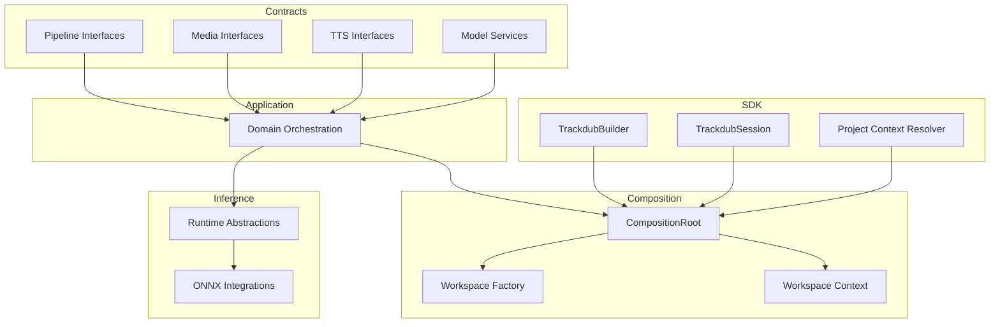

**Diagram sources**
- [CompositionRoot.cs](file://src/Trackdub.Composition/CompositionRoot.cs)
- [TranscriptWorkspaceFactory.cs](file://src/Trackdub.Composition/TranscriptWorkspaceFactory.cs)
- [TranscriptWorkspaceContext.cs](file://src/Trackdub.Composition/TranscriptWorkspaceContext.cs)
- [TrackdubBuilder.cs](file://src/Trackdub.Sdk/TrackdubBuilder.cs)
- [TrackdubSession.cs](file://src/Trackdub.Sdk/TrackdubSession.cs)
- [TrackdubProjectContextResolver.cs](file://src/Trackdub.Sdk/TrackdubProjectContextResolver.cs)

**Section sources**
- [Trackdub.Contracts.csproj](file://src/Trackdub.Contracts/Trackdub.Contracts.csproj)
- [Trackdub.Application.csproj](file://src/Trackdub.Application/Trackdub.Application.csproj)
- [Trackdub.Composition.csproj](file://src/Trackdub.Composition/Trackdub.Composition.csproj)
- [Trackdub.Inference.csproj](file://src/Trackdub.Inference/Trackdub.Inference.csproj)
- [Trackdub.Inference.Onnx.csproj](file://src/Trackdub.Inference.Onnx/Trackdub.Inference.Onnx.csproj)

## Core Components
Key extension points exposed via contracts:
- Pipeline stage definitions and handlers for extending processing steps.
- Media probes and extractors for adding new file formats and audio segment extraction.
- TTS post-processing hooks for customizing output audio.
- Model services for alias resolution, inventory, download orchestration, and cache verification.
- Audio enhancement and preparation services for custom audio processing pipelines.
- Hardware profiling and studio settings for environment-aware behavior.

These are consumed by application orchestration and composed at runtime through the composition root and SDK builder.

**Section sources**
- [IModelAliasResolver.cs](file://src/Trackdub.Contracts/IModelAliasResolver.cs)
- [IModelInventoryService.cs](file://src/Trackdub.Contracts/IModelInventoryService.cs)
- [IModelDownloadOrchestrator.cs](file://src/Trackdub.Contracts/IModelDownloadOrchestrator.cs)
- [IModelCacheVerifier.cs](file://src/Trackdub.Contracts/IModelCacheVerifier.cs)
- [ITtsAudioPostProcessor.cs](file://src/Trackdub.Contracts/ITtsAudioPostProcessor.cs)
- [IAudioClipExtractor.cs](file://src/Trackdub.Contracts/IAudioClipExtractor.cs)
- [IAudioSegmentExtractor.cs](file://src/Trackdub.Contracts/IAudioSegmentExtractor.cs)
- [ISpeechAudioEnhancementService.cs](file://src/Trackdub.Contracts/ISpeechAudioEnhancementService.cs)
- [ISpeechAudioPreparationServices.cs](file://src/Trackdub.Contracts/ISpeechAudioPreparationServices.cs)
- [IMediaProbe.cs](file://src/Trackdub.Contracts/IMediaProbe.cs)
- [IFileFingerprintService.cs](file://src/Trackdub.Contracts/IFileFingerprintService.cs)
- [IEngineCacheMaintenanceService.cs](file://src/Trackdub.Contracts/IEngineCacheMaintenanceService.cs)
- [IHardwareProfilerService.cs](file://src/Trackdub.Contracts/IHardwareProfilerService.cs)
- [IStudioSettingsService.cs](file://src/Trackdub.Contracts/IStudioSettingsService.cs)
- [IApplicationLogger.cs](file://src/Trackdub.Contracts/IApplicationLogger.cs)
- [ArtifactWriteHandle.cs](file://src/Trackdub.Contracts/ArtifactWriteHandle.cs)

## Architecture Overview
The system uses a contract-first approach with DI-driven composition. The SDK builder configures the container and registers implementations; the composition root initializes workspaces and contexts; inference layers provide model execution backends; application code orchestrates stages and services.

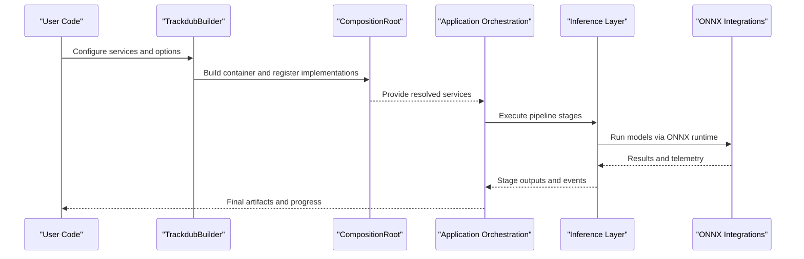

**Diagram sources**
- [TrackdubBuilder.cs](file://src/Trackdub.Sdk/TrackdubBuilder.cs)
- [CompositionRoot.cs](file://src/Trackdub.Composition/CompositionRoot.cs)
- [TrackdubSession.cs](file://src/Trackdub.Sdk/TrackdubSession.cs)

## Detailed Component Analysis

### Pipeline Extension Points
Trackdub exposes a rich set of pipeline contracts enabling custom stages, execution policies, and lifecycle management. Implementers can define new stages, integrate middleware, and control retries, timeouts, and resource limits.

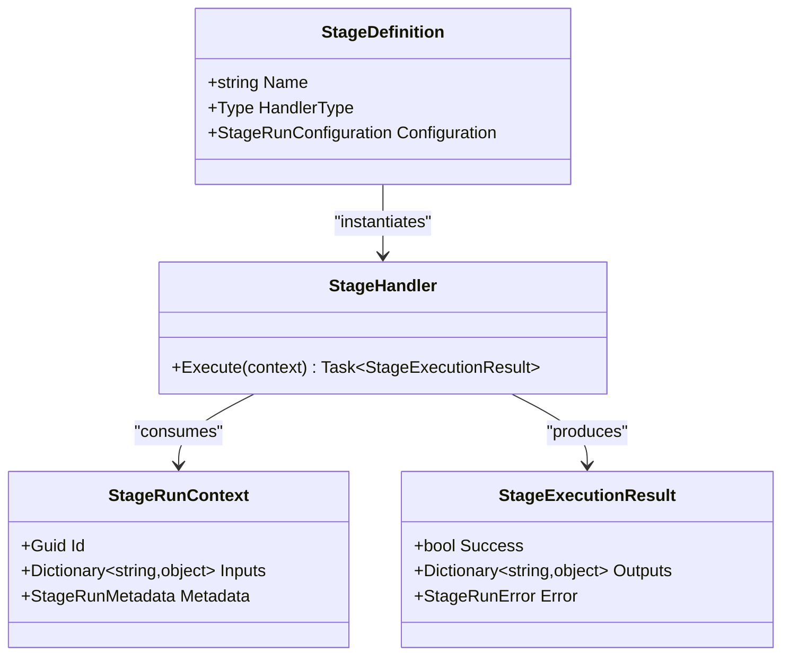

**Diagram sources**
- [StageDefinition.cs](file://src/Trackdub.Contracts/Pipeline/StageDefinition.cs)
- [StageHandler.cs](file://src/Trackdub.Contracts/Pipeline/StageHandler.cs)
- [StageRunContext.cs](file://src/Trackdub.Contracts/Pipeline/StageRunContext.cs)
- [StageExecutionResult.cs](file://src/Trackdub.Contracts/Pipeline/StageExecutionResult.cs)

To add a custom stage:
- Implement a handler that accepts a StageRunContext and returns a StageExecutionResult.
- Register the stage definition with its configuration and dependencies.
- Optionally integrate middleware for logging, metrics, or circuit breaking.

**Section sources**
- [StageDefinition.cs](file://src/Trackdub.Contracts/Pipeline/StageDefinition.cs)
- [StageHandler.cs](file://src/Trackdub.Contracts/Pipeline/StageHandler.cs)
- [StageExecutionResult.cs](file://src/Trackdub.Contracts/Pipeline/StageExecutionResult.cs)
- [StageRunContext.cs](file://src/Trackdub.Contracts/Pipeline/StageRunContext.cs)

### Speech Recognition Engine Integration
Custom ASR engines can be integrated by implementing media probing, audio clip extraction, and inference calls through the contracts. Use the audio preparation and enhancement services to preprocess input and postprocess outputs.

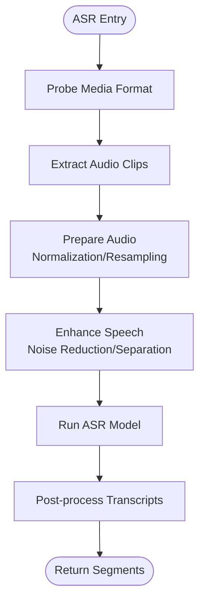

**Diagram sources**
- [IMediaProbe.cs](file://src/Trackdub.Contracts/IMediaProbe.cs)
- [IAudioClipExtractor.cs](file://src/Trackdub.Contracts/IAudioClipExtractor.cs)
- [ISpeechAudioPreparationServices.cs](file://src/Trackdub.Contracts/ISpeechAudioPreparationServices.cs)
- [ISpeechAudioEnhancementService.cs](file://src/Trackdub.Contracts/ISpeechAudioEnhancementService.cs)

Steps:
- Implement IMediaProbe to detect supported formats and metadata.
- Implement IAudioClipExtractor to segment audio based on silence or cues.
- Use ISpeechAudioPreparationServices for resampling and normalization.
- Integrate with inference layer to run ASR models and return transcripts.

**Section sources**
- [IMediaProbe.cs](file://src/Trackdub.Contracts/IMediaProbe.cs)
- [IAudioClipExtractor.cs](file://src/Trackdub.Contracts/IAudioClipExtractor.cs)
- [ISpeechAudioPreparationServices.cs](file://src/Trackdub.Contracts/ISpeechAudioPreparationServices.cs)
- [ISpeechAudioEnhancementService.cs](file://src/Trackdub.Contracts/ISpeechAudioEnhancementService.cs)

### Translation Service Integration
Translation services can be plugged in by implementing service contracts and integrating with glossary matching and text refinement stages. Ensure proper error handling and retry policies.

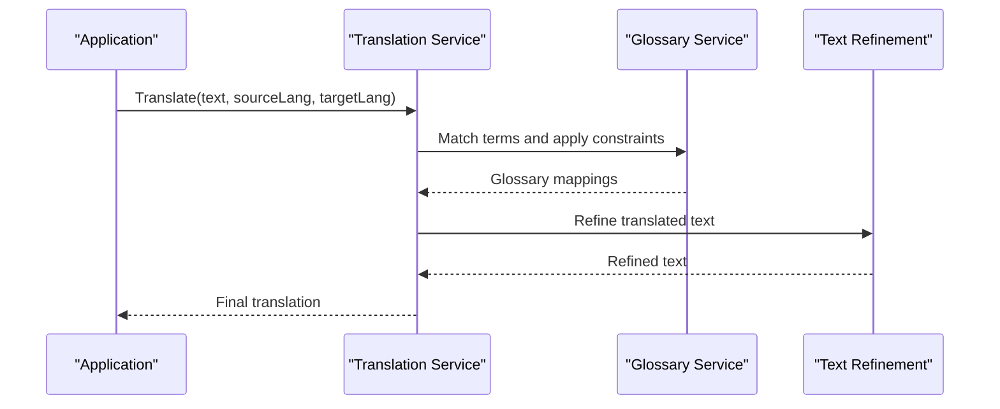

**Diagram sources**
- [IModelInventoryService.cs](file://src/Trackdub.Contracts/IModelInventoryService.cs)
- [IModelDownloadOrchestrator.cs](file://src/Trackdub.Contracts/IModelDownloadOrchestrator.cs)

Steps:
- Implement translation service methods adhering to expected contracts.
- Integrate with glossary services for term consistency.
- Apply text refinement to improve readability and alignment.

**Section sources**
- [IModelInventoryService.cs](file://src/Trackdub.Contracts/IModelInventoryService.cs)
- [IModelDownloadOrchestrator.cs](file://src/Trackdub.Contracts/IModelDownloadOrchestrator.cs)

### TTS Provider Integration
Custom TTS providers can be added by implementing ITtsAudioPostProcessor and integrating with audio mixing and export services. Ensure consistent sample rates and channel configurations.

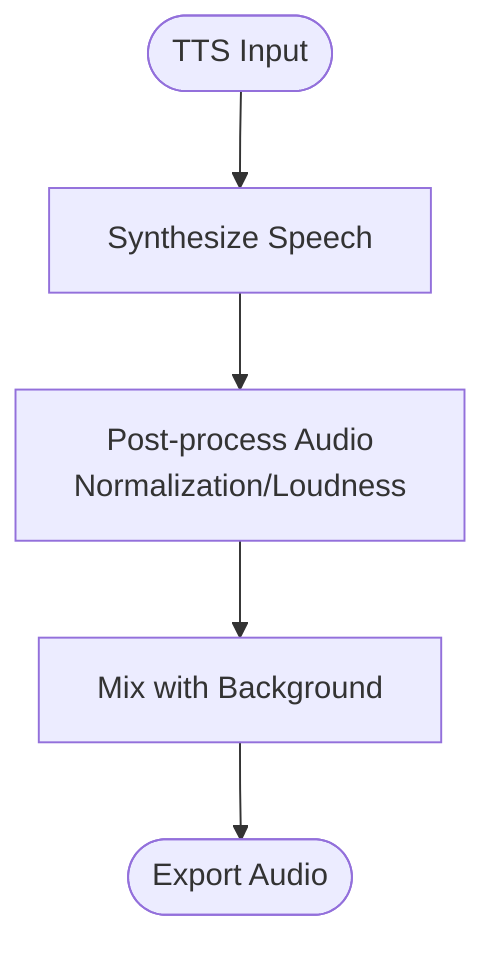

**Diagram sources**
- [ITtsAudioPostProcessor.cs](file://src/Trackdub.Contracts/ITtsAudioPostProcessor.cs)

Steps:
- Implement ITtsAudioPostProcessor to handle audio post-processing.
- Integrate with mixing services for background tracks.
- Export final audio with desired codecs and quality settings.

**Section sources**
- [ITtsAudioPostProcessor.cs](file://src/Trackdub.Contracts/ITtsAudioPostProcessor.cs)

### Audio Processing Modules
Custom audio processing modules can be implemented by leveraging the audio preparation and enhancement services. These modules can include noise reduction, voice separation, and loudness normalization.

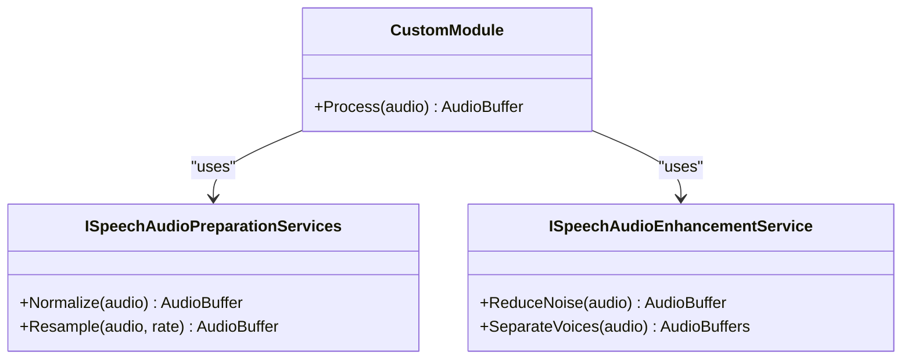

**Diagram sources**
- [ISpeechAudioPreparationServices.cs](file://src/Trackdub.Contracts/ISpeechAudioPreparationServices.cs)
- [ISpeechAudioEnhancementService.cs](file://src/Trackdub.Contracts/ISpeechAudioEnhancementService.cs)

Steps:
- Implement custom processing logic within the module.
- Use preparation services for standardization and enhancement services for quality improvements.
- Return processed audio buffers compatible with downstream stages.

**Section sources**
- [ISpeechAudioPreparationServices.cs](file://src/Trackdub.Contracts/ISpeechAudioPreparationServices.cs)
- [ISpeechAudioEnhancementService.cs](file://src/Trackdub.Contracts/ISpeechAudioEnhancementService.cs)

### File Format Support
New file formats can be supported by implementing IMediaProbe and IAudioClipExtractor. Ensure proper metadata extraction and segmentation strategies.

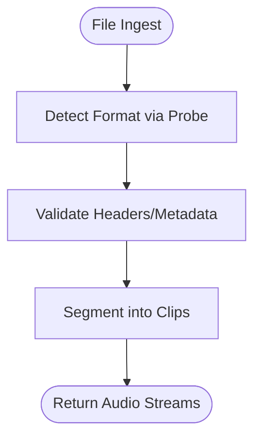

**Diagram sources**
- [IMediaProbe.cs](file://src/Trackdub.Contracts/IMediaProbe.cs)
- [IAudioClipExtractor.cs](file://src/Trackdub.Contracts/IAudioClipExtractor.cs)

Steps:
- Implement IMediaProbe to identify supported formats and extract metadata.
- Implement IAudioClipExtractor to segment audio based on content or timing cues.
- Integrate with existing ingestion pipelines for seamless usage.

**Section sources**
- [IMediaProbe.cs](file://src/Trackdub.Contracts/IMediaProbe.cs)
- [IAudioClipExtractor.cs](file://src/Trackdub.Contracts/IAudioClipExtractor.cs)

### Custom Model Implementations
Custom models can be integrated via model alias resolution, inventory management, and download orchestration. Ensure proper caching and verification mechanisms.

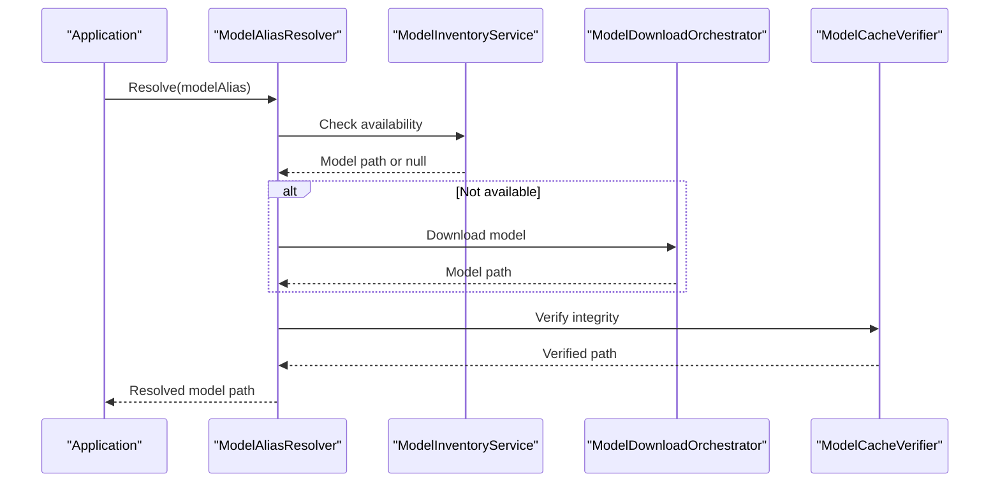

**Diagram sources**
- [IModelAliasResolver.cs](file://src/Trackdub.Contracts/IModelAliasResolver.cs)
- [IModelInventoryService.cs](file://src/Trackdub.Contracts/IModelInventoryService.cs)
- [IModelDownloadOrchestrator.cs](file://src/Trackdub.Contracts/IModelDownloadOrchestrator.cs)
- [IModelCacheVerifier.cs](file://src/Trackdub.Contracts/IModelCacheVerifier.cs)

Steps:
- Implement alias resolution to map logical names to physical paths.
- Manage model inventory and track versions and locations.
- Orchestrate downloads from remote sources with retry and validation.
- Verify cache integrity before use.

**Section sources**
- [IModelAliasResolver.cs](file://src/Trackdub.Contracts/IModelAliasResolver.cs)
- [IModelInventoryService.cs](file://src/Trackdub.Contracts/IModelInventoryService.cs)
- [IModelDownloadOrchestrator.cs](file://src/Trackdub.Contracts/IModelDownloadOrchestrator.cs)
- [IModelCacheVerifier.cs](file://src/Trackdub.Contracts/IModelCacheVerifier.cs)

### Specialized Processing Pipelines
Specialized pipelines can be constructed by composing custom stages and middleware. Use the pipeline contracts to define execution order, dependencies, and policies.

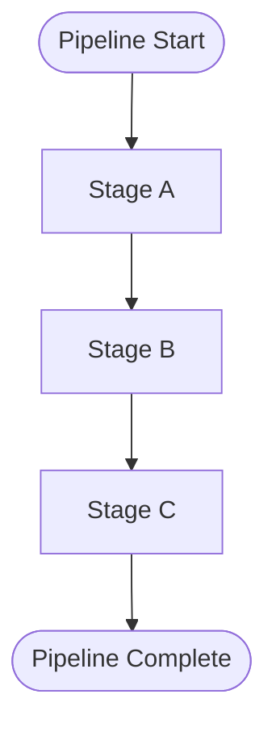

**Diagram sources**
- [StageDefinition.cs](file://src/Trackdub.Contracts/Pipeline/StageDefinition.cs)
- [StageHandler.cs](file://src/Trackdub.Contracts/Pipeline/StageHandler.cs)

Steps:
- Define custom stages with specific inputs and outputs.
- Configure execution policies such as retries, timeouts, and resource limits.
- Integrate middleware for cross-cutting concerns like logging and metrics.

**Section sources**
- [StageDefinition.cs](file://src/Trackdub.Contracts/Pipeline/StageDefinition.cs)
- [StageHandler.cs](file://src/Trackdub.Contracts/Pipeline/StageHandler.cs)

## Dependency Analysis
Trackdub’s architecture emphasizes loose coupling through contracts and DI. The composition root and SDK builder manage registrations and lifetimes. Inference layers depend on ONNX integrations for model execution.

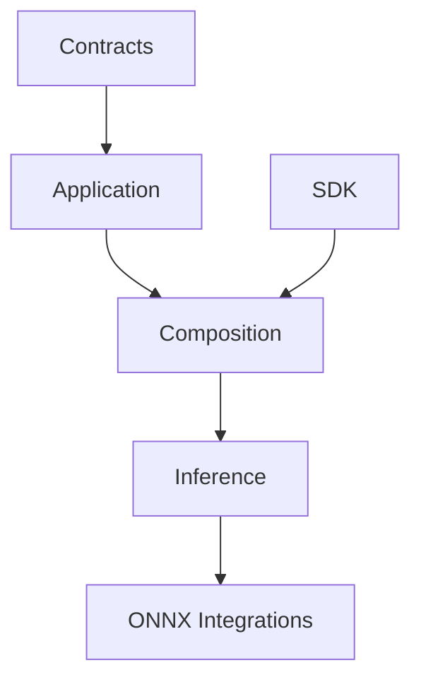

**Diagram sources**
- [CompositionRoot.cs](file://src/Trackdub.Composition/CompositionRoot.cs)
- [TrackdubBuilder.cs](file://src/Trackdub.Sdk/TrackdubBuilder.cs)

**Section sources**
- [CompositionRoot.cs](file://src/Trackdub.Composition/CompositionRoot.cs)
- [TrackdubBuilder.cs](file://src/Trackdub.Sdk/TrackdubBuilder.cs)

## Performance Considerations
- Use hardware profiling services to optimize model selection and execution parameters.
- Leverage caching mechanisms for models and intermediate results to reduce latency.
- Implement efficient audio processing pipelines to minimize memory allocations and CPU usage.
- Monitor pipeline execution metrics and adjust resource limits accordingly.

[No sources needed since this section provides general guidance]

## Troubleshooting Guide
Common issues and resolutions:
- Model download failures: Check network connectivity and retry policies.
- Audio processing errors: Validate input formats and ensure proper preprocessing.
- Pipeline stage failures: Review stage logs and error messages for root causes.
- Resource exhaustion: Adjust concurrency and memory limits based on hardware capabilities.

**Section sources**
- [IApplicationLogger.cs](file://src/Trackdub.Contracts/IApplicationLogger.cs)
- [IEngineCacheMaintenanceService.cs](file://src/Trackdub.Contracts/IEngineCacheMaintenanceService.cs)

## Conclusion
Trackdub’s extension points enable flexible customization across speech recognition, translation, TTS, and audio processing. By adhering to contract interfaces and leveraging the composition and SDK APIs, developers can implement robust and scalable extensions. Proper testing, versioning, and deployment practices ensure reliability and maintainability.

[No sources needed since this section summarizes without analyzing specific files]

## Appendices

### Step-by-Step Guides for Common Extensions

#### Adding a Custom ASR Engine
1. Implement IMediaProbe to detect supported formats.
2. Implement IAudioClipExtractor to segment audio clips.
3. Use ISpeechAudioPreparationServices for normalization and resampling.
4. Integrate with inference layer to run ASR models.
5. Register implementations via SDK builder or composition root.

#### Integrating a New Translation Service
1. Implement translation service methods following expected contracts.
2. Integrate with glossary services for term consistency.
3. Apply text refinement to improve output quality.
4. Handle errors and retries appropriately.

#### Implementing a Custom TTS Provider
1. Implement ITtsAudioPostProcessor for audio post-processing.
2. Integrate with mixing services for background tracks.
3. Export final audio with desired codecs and quality settings.

#### Supporting New File Formats
1. Implement IMediaProbe to identify formats and extract metadata.
2. Implement IAudioClipExtractor to segment audio based on content.
3. Integrate with ingestion pipelines for seamless usage.

#### Adding Custom Model Implementations
1. Implement IModelAliasResolver to map aliases to paths.
2. Manage model inventory and track versions.
3. Orchestrate downloads with retry and validation.
4. Verify cache integrity before use.

### Testing Strategies for Custom Components
- Unit tests for individual components with mocked dependencies.
- Integration tests for end-to-end workflows with real services.
- Performance tests to validate resource usage and latency.
- Contract tests to ensure compatibility with core interfaces.

### Versioning and Backward Compatibility
- Maintain stable contracts to avoid breaking changes.
- Use semantic versioning for extensions and dependencies.
- Provide migration guides for major updates.
- Test against multiple versions to ensure compatibility.

### Deployment of Custom Extensions
- Package extensions as separate libraries or plugins.
- Use configuration files to specify extension locations and settings.
- Implement health checks and readiness gates for runtime validation.
- Monitor deployments with logging and metrics.