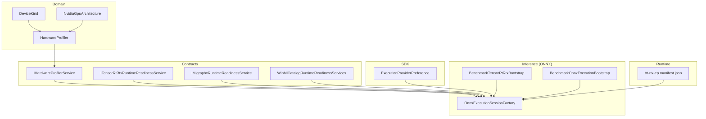
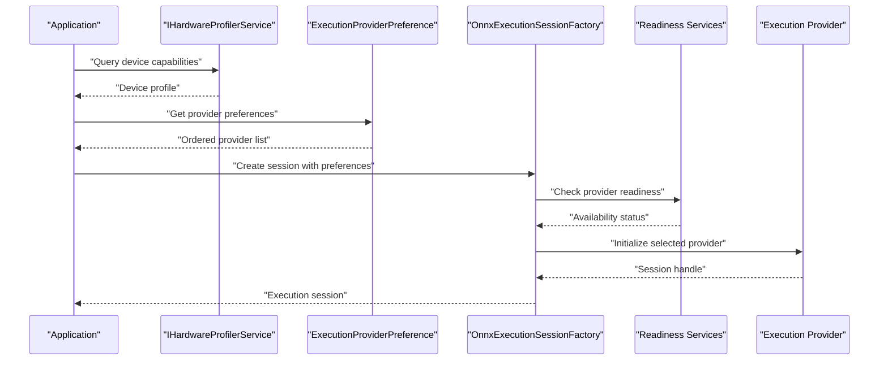
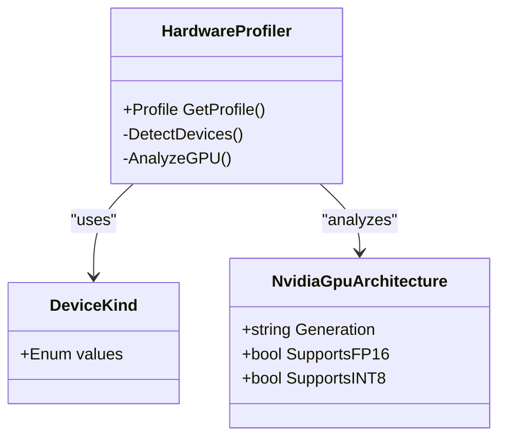
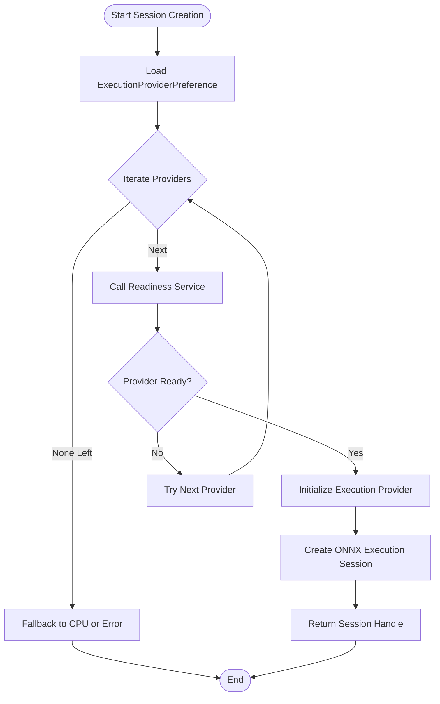
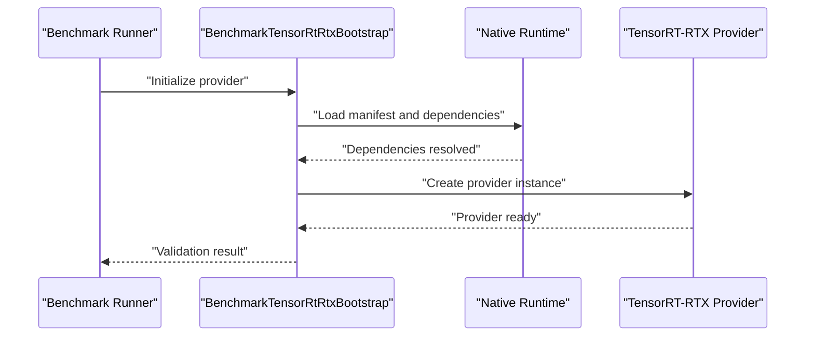
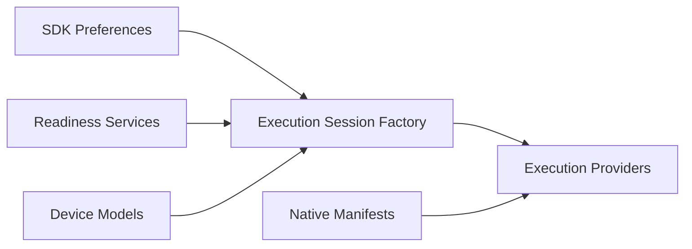

# Hardware Optimization Framework

<cite>
**Referenced Files in This Document**
- [HardwareProfiler.cs](file://src/Trackdub.Domain/HardwareProfiler.cs)
- [DeviceKind.cs](file://src/Trackdub.Domain/DeviceKind.cs)
- [NvidiaGpuArchitecture.cs](file://src/Trackdub.Domain/NvidiaGpuArchitecture.cs)
- [OnnxExecutionSessionFactory.cs](file://src/Trackdub.Inference.Onnx/OnnxExecutionSessionFactory.cs)
- [ExecutionProviderPreference.cs](file://src/Trackdub.Sdk/ExecutionProviderPreference.cs)
- [TensorRtRtxBootstrap.cs](file://src/Trackdub.Benchmarks/BenchmarkTensorRtRtxBootstrap.cs)
- [BenchmarkOnnxExecutionBootstrap.cs](file://src/Trackdub.Benchmarks/BenchmarkOnnxExecutionBootstrap.cs)
- [IHardwareProfilerService.cs](file://src/Trackdub.Contracts/IHardwareProfilerService.cs)
- [ITensorRtRtxRuntimeReadinessService.cs](file://src/Trackdub.Contracts/ITensorRtRtxRuntimeReadinessService.cs)
- [IMigraphxRuntimeReadinessService.cs](file://src/Trackdub.Contracts/IMigraphxRuntimeReadinessService.cs)
- [WinMlCatalogRuntimeReadinessServices.cs](file://src/Trackdub.Contracts/WinMlCatalogRuntimeReadinessServices.cs)
- [trt-rtx-ep.manifest.json](file://runtime/trt-rtx-ep.manifest.json)
- [ADR-0009-gpu-memory-budget-planner.md](file://docs/decisions/ADR-0009-gpu-memory-budget-planner.md)
- [windows-ml-phase-3-device-policies.md](file://docs/reference/windows-ml-phase-3-device-policies.md)
- [tensorrt-rtx-ep-abi-plugin.md](file://docs/reference/tensorrt-rtx-ep-abi-plugin.md)
</cite>

## Table of Contents
1. Introduction
2. Project Structure
3. Core Components
4. Architecture Overview
5. Detailed Component Analysis
6. Dependency Analysis
7. Performance Considerations
8. Troubleshooting Guide
9. Conclusion

## Introduction
This document explains Trackdub’s hardware optimization framework with a focus on automatic device capability detection, GPU/CPU workload balancing, and memory usage optimization. It documents the execution provider abstraction that supports CUDA, DirectML, OpenVINO, TensorRT-RTX, MIGraphX, and other backends. You will learn how the system profiles hardware capabilities, selects optimal execution providers, manages resources, and handles multi-GPU scenarios, fallbacks, and performance monitoring. Guidance for implementing custom execution providers and tuning parameters is also included.

## Project Structure
The hardware optimization framework spans several layers:
- Domain layer defines core types for devices and profiling.
- Contracts define interfaces for profiling and runtime readiness.
- Inference layer provides ONNX execution session factories and provider-specific bootstraps.
- SDK exposes configuration and preferences for provider selection.
- Benchmarks include bootstrap utilities to initialize and validate providers.
- Runtime includes native manifests for provider discovery.
- Documentation contains architectural decisions and reference materials.

**Diagram sources**
- [HardwareProfiler.cs](file://src/Trackdub.Domain/HardwareProfiler.cs)
- [DeviceKind.cs](file://src/Trackdub.Domain/DeviceKind.cs)
- [NvidiaGpuArchitecture.cs](file://src/Trackdub.Domain/NvidiaGpuArchitecture.cs)
- [IHardwareProfilerService.cs](file://src/Trackdub.Contracts/IHardwareProfilerService.cs)
- [ITensorRtRtxRuntimeReadinessService.cs](file://src/Trackdub.Contracts/ITensorRtRtxRuntimeReadinessService.cs)
- [IMigraphxRuntimeReadinessService.cs](file://src/Trackdub.Contracts/IMigraphxRuntimeReadinessService.cs)
- [WinMlCatalogRuntimeReadinessServices.cs](file://src/Trackdub.Contracts/WinMlCatalogRuntimeReadinessServices.cs)
- [OnnxExecutionSessionFactory.cs](file://src/Trackdub.Inference.Onnx/OnnxExecutionSessionFactory.cs)
- [BenchmarkTensorRtRtxBootstrap.cs](file://src/Trackdub.Benchmarks/BenchmarkTensorRtRtxBootstrap.cs)
- [BenchmarkOnnxExecutionBootstrap.cs](file://src/Trackdub.Benchmarks/BenchmarkOnnxExecutionBootstrap.cs)
- [ExecutionProviderPreference.cs](file://src/Trackdub.Sdk/ExecutionProviderPreference.cs)
- [trt-rtx-ep.manifest.json](file://runtime/trt-rtx-ep.manifest.json)

**Section sources**
- [HardwareProfiler.cs](file://src/Trackdub.Domain/HardwareProfiler.cs)
- [DeviceKind.cs](file://src/Trackdub.Domain/DeviceKind.cs)
- [NvidiaGpuArchitecture.cs](file://src/Trackdub.Domain/NvidiaGpuArchitecture.cs)
- [IHardwareProfilerService.cs](file://src/Trackdub.Contracts/IHardwareProfilerService.cs)
- [ITensorRtRtxRuntimeReadinessService.cs](file://src/Trackdub.Contracts/ITensorRtRtxRuntimeReadinessService.cs)
- [IMigraphxRuntimeReadinessService.cs](file://src/Trackdub.Contracts/IMigraphxRuntimeReadinessService.cs)
- [WinMlCatalogRuntimeReadinessServices.cs](file://src/Trackdub.Contracts/WinMlCatalogRuntimeReadinessServices.cs)
- [OnnxExecutionSessionFactory.cs](file://src/Trackdub.Inference.Onnx/OnnxExecutionSessionFactory.cs)
- [BenchmarkTensorRtRtxBootstrap.cs](file://src/Trackdub.Benchmarks/BenchmarkTensorRtRtxBootstrap.cs)
- [BenchmarkOnnxExecutionBootstrap.cs](file://src/Trackdub.Benchmarks/BenchmarkOnnxExecutionBootstrap.cs)
- [ExecutionProviderPreference.cs](file://src/Trackdub.Sdk/ExecutionProviderPreference.cs)
- [trt-rtx-ep.manifest.json](file://runtime/trt-rtx-ep.manifest.json)

## Core Components
- Hardware profiler and device model: Defines device kinds and NVIDIA GPU architecture metadata used to infer capabilities and constraints.
- Execution provider abstraction: A factory and preference mechanism to select and configure execution providers (CUDA, DirectML, OpenVINO, TensorRT-RTX, MIGraphX).
- Readiness services: Interfaces to probe runtime availability and compatibility for specific providers.
- Bootstrap utilities: Benchmark helpers to initialize providers and validate environment setup.
- Runtime manifest: Native dependency manifest enabling provider discovery at runtime.

Key responsibilities:
- Automatic device capability detection via profiling services and domain models.
- Provider selection based on preferences, readiness checks, and hardware characteristics.
- Resource allocation strategies including GPU memory budgeting and CPU/GPU workload balancing.
- Fallback mechanisms when preferred providers are unavailable or fail during initialization.

**Section sources**
- [HardwareProfiler.cs](file://src/Trackdub.Domain/HardwareProfiler.cs)
- [DeviceKind.cs](file://src/Trackdub.Domain/DeviceKind.cs)
- [NvidiaGpuArchitecture.cs](file://src/Trackdub.Domain/NvidiaGpuArchitecture.cs)
- [IHardwareProfilerService.cs](file://src/Trackdub.Contracts/IHardwareProfilerService.cs)
- [ITensorRtRtxRuntimeReadinessService.cs](file://src/Trackdub.Contracts/ITensorRtRtxRuntimeReadinessService.cs)
- [IMigraphxRuntimeReadinessService.cs](file://src/Trackdub.Contracts/IMigraphxRuntimeReadinessService.cs)
- [WinMlCatalogRuntimeReadinessServices.cs](file://src/Trackdub.Contracts/WinMlCatalogRuntimeReadinessServices.cs)
- [OnnxExecutionSessionFactory.cs](file://src/Trackdub.Inference.Onnx/OnnxExecutionSessionFactory.cs)
- [ExecutionProviderPreference.cs](file://src/Trackdub.Sdk/ExecutionProviderPreference.cs)
- [BenchmarkTensorRtRtxBootstrap.cs](file://src/Trackdub.Benchmarks/BenchmarkTensorRtRtxBootstrap.cs)
- [BenchmarkOnnxExecutionBootstrap.cs](file://src/Trackdub.Benchmarks/BenchmarkOnnxExecutionBootstrap.cs)
- [trt-rtx-ep.manifest.json](file://runtime/trt-rtx-ep.manifest.json)

## Architecture Overview
The framework follows a layered approach:
- Domain models capture device attributes and architectures.
- Contracts expose profiling and readiness interfaces.
- Inference layer constructs execution sessions using provider preferences and readiness results.
- SDK configures provider selection policies and options.
- Benchmarks provide bootstrap routines to validate provider availability and performance.
- Runtime manifests ensure native dependencies are discoverable.

**Diagram sources**
- [IHardwareProfilerService.cs](file://src/Trackdub.Contracts/IHardwareProfilerService.cs)
- [ExecutionProviderPreference.cs](file://src/Trackdub.Sdk/ExecutionProviderPreference.cs)
- [OnnxExecutionSessionFactory.cs](file://src/Trackdub.Inference.Onnx/OnnxExecutionSessionFactory.cs)
- [ITensorRtRtxRuntimeReadinessService.cs](file://src/Trackdub.Contracts/ITensorRtRtxRuntimeReadinessService.cs)
- [IMigraphxRuntimeReadinessService.cs](file://src/Trackdub.Contracts/IMigraphxRuntimeReadinessService.cs)
- [WinMlCatalogRuntimeReadinessServices.cs](file://src/Trackdub.Contracts/WinMlCatalogRuntimeReadinessServices.cs)

## Detailed Component Analysis

### Hardware Profiling and Device Models
- DeviceKind enumerates supported device categories (e.g., CPU, GPU, NPU).
- NvidiaGpuArchitecture captures GPU generation and feature sets relevant to provider selection.
- HardwareProfiler aggregates device information and produces a profile used by higher layers.

**Diagram sources**
- [DeviceKind.cs](file://src/Trackdub.Domain/DeviceKind.cs)
- [NvidiaGpuArchitecture.cs](file://src/Trackdub.Domain/NvidiaGpuArchitecture.cs)
- [HardwareProfiler.cs](file://src/Trackdub.Domain/HardwareProfiler.cs)

**Section sources**
- [DeviceKind.cs](file://src/Trackdub.Domain/DeviceKind.cs)
- [NvidiaGpuArchitecture.cs](file://src/Trackdub.Domain/NvidiaGpuArchitecture.cs)
- [HardwareProfiler.cs](file://src/Trackdub.Domain/HardwareProfiler.cs)

### Execution Provider Abstraction and Selection
- OnnxExecutionSessionFactory orchestrates provider selection based on preferences and readiness.
- ExecutionProviderPreference defines ordered provider choices and policy flags.
- Readiness services probe runtime availability for specific providers (TensorRT-RTX, MIGraphX, Windows ML catalog).

**Diagram sources**
- [OnnxExecutionSessionFactory.cs](file://src/Trackdub.Inference.Onnx/OnnxExecutionSessionFactory.cs)
- [ExecutionProviderPreference.cs](file://src/Trackdub.Sdk/ExecutionProviderPreference.cs)
- [ITensorRtRtxRuntimeReadinessService.cs](file://src/Trackdub.Contracts/ITensorRtRtxRuntimeReadinessService.cs)
- [IMigraphxRuntimeReadinessService.cs](file://src/Trackdub.Contracts/IMigraphxRuntimeReadinessService.cs)
- [WinMlCatalogRuntimeReadinessServices.cs](file://src/Trackdub.Contracts/WinMlCatalogRuntimeReadinessServices.cs)

**Section sources**
- [OnnxExecutionSessionFactory.cs](file://src/Trackdub.Inference.Onnx/OnnxExecutionSessionFactory.cs)
- [ExecutionProviderPreference.cs](file://src/Trackdub.Sdk/ExecutionProviderPreference.cs)
- [ITensorRtRtxRuntimeReadinessService.cs](file://src/Trackdub.Contracts/ITensorRtRtxRuntimeReadinessService.cs)
- [IMigraphxRuntimeReadinessService.cs](file://src/Trackdub.Contracts/IMigraphxRuntimeReadinessService.cs)
- [WinMlCatalogRuntimeReadinessServices.cs](file://src/Trackdub.Contracts/WinMlCatalogRuntimeReadinessServices.cs)

### Bootstrap Utilities and Runtime Manifests
- BenchmarkTensorRtRtxBootstrap initializes TensorRT-RTX provider and validates environment.
- BenchmarkOnnxExecutionBootstrap provides generic ONNX provider bootstrap logic.
- trt-rtx-ep.manifest.json declares native dependencies required for TensorRT-RTX provider discovery.

**Diagram sources**
- [BenchmarkTensorRtRtxBootstrap.cs](file://src/Trackdub.Benchmarks/BenchmarkTensorRtRtxBootstrap.cs)
- [BenchmarkOnnxExecutionBootstrap.cs](file://src/Trackdub.Benchmarks/BenchmarkOnnxExecutionBootstrap.cs)
- [trt-rtx-ep.manifest.json](file://runtime/trt-rtx-ep.manifest.json)

**Section sources**
- [BenchmarkTensorRtRtxBootstrap.cs](file://src/Trackdub.Benchmarks/BenchmarkTensorRtRtxBootstrap.cs)
- [BenchmarkOnnxExecutionBootstrap.cs](file://src/Trackdub.Benchmarks/BenchmarkOnnxExecutionBootstrap.cs)
- [trt-rtx-ep.manifest.json](file://runtime/trt-rtx-ep.manifest.json)

### Custom Execution Provider Implementation
To implement a custom execution provider:
- Implement readiness checks via a service similar to existing readiness interfaces.
- Integrate provider initialization into the execution session factory.
- Add provider preference entries to allow ordering and selection.
- Provide bootstrap utilities to validate environment and dependencies.

Recommended steps:
- Define provider-specific configuration options.
- Expose capability queries (device support, memory limits, precision features).
- Register provider in the factory’s provider registry.
- Include native manifests if required for dependency resolution.

[No sources needed since this section provides general guidance]

### Performance Tuning Parameters
Common tuning areas:
- Provider priority order and fallback behavior.
- GPU memory budget settings to avoid out-of-memory conditions.
- Precision modes (FP16/INT8) based on device capabilities.
- Batch sizes and concurrency limits per provider.
- Caching and model loading strategies to reduce startup latency.

Guidance:
- Use readiness services to gate provider selection.
- Profile workloads to determine optimal batch sizes and precision.
- Monitor memory usage and adjust budgets accordingly.

[No sources needed since this section provides general guidance]

### Multi-GPU Scenarios and Fallback Mechanisms
- Detect multiple GPUs and assign workloads based on capacity and utilization.
- Prefer high-performance GPUs while falling back to CPU or secondary GPUs when necessary.
- Use readiness services to verify each GPU’s provider availability.
- Implement graceful degradation when primary providers fail.

[No sources needed since this section provides general guidance]

### Performance Monitoring Strategies
- Collect provider initialization metrics and runtime statistics.
- Log device capability queries and provider selection decisions.
- Track memory usage and peak allocations per provider.
- Emit telemetry for failures and fallback events.

[No sources needed since this section provides general guidance]

## Dependency Analysis
The framework exhibits clear separation between domain models, contracts, inference implementation, and SDK configuration. Dependencies flow from higher layers down to lower layers, ensuring modularity and testability.

**Diagram sources**
- [ExecutionProviderPreference.cs](file://src/Trackdub.Sdk/ExecutionProviderPreference.cs)
- [OnnxExecutionSessionFactory.cs](file://src/Trackdub.Inference.Onnx/OnnxExecutionSessionFactory.cs)
- [ITensorRtRtxRuntimeReadinessService.cs](file://src/Trackdub.Contracts/ITensorRtRtxRuntimeReadinessService.cs)
- [IMigraphxRuntimeReadinessService.cs](file://src/Trackdub.Contracts/IMigraphxRuntimeReadinessService.cs)
- [WinMlCatalogRuntimeReadinessServices.cs](file://src/Trackdub.Contracts/WinMlCatalogRuntimeReadinessServices.cs)
- [trt-rtx-ep.manifest.json](file://runtime/trt-rtx-ep.manifest.json)

**Section sources**
- [ExecutionProviderPreference.cs](file://src/Trackdub.Sdk/ExecutionProviderPreference.cs)
- [OnnxExecutionSessionFactory.cs](file://src/Trackdub.Inference.Onnx/OnnxExecutionSessionFactory.cs)
- [ITensorRtRtxRuntimeReadinessService.cs](file://src/Trackdub.Contracts/ITensorRtRtxRuntimeReadinessService.cs)
- [IMigraphxRuntimeReadinessService.cs](file://src/Trackdub.Contracts/IMigraphxRuntimeReadinessService.cs)
- [WinMlCatalogRuntimeReadinessServices.cs](file://src/Trackdub.Contracts/WinMlCatalogRuntimeReadinessServices.cs)
- [trt-rtx-ep.manifest.json](file://runtime/trt-rtx-ep.manifest.json)

## Performance Considerations
- Prioritize providers with best performance for target workloads while maintaining fallback paths.
- Use GPU memory budget planning to prevent OOM errors and stabilize throughput.
- Leverage precision optimizations (FP16/INT8) where supported by hardware and models.
- Profile and tune batch sizes, concurrency, and caching strategies per provider.
- Monitor provider readiness and device capabilities to adapt dynamically.

[No sources needed since this section provides general guidance]

## Troubleshooting Guide
Common issues and resolutions:
- Provider initialization failures: Verify readiness services and native manifests; check driver versions and dependencies.
- Out-of-memory errors: Reduce batch size, enable memory budgeting, or switch to CPU fallback.
- Multi-GPU conflicts: Ensure exclusive access or distribute workloads appropriately.
- Performance regressions: Validate precision settings and provider configurations; re-profile workloads.

Diagnostic steps:
- Inspect provider readiness logs and error messages.
- Review device capability profiles and architecture metadata.
- Validate bootstrap utilities and runtime manifests.
- Use benchmark runners to isolate provider-specific issues.

**Section sources**
- [ITensorRtRtxRuntimeReadinessService.cs](file://src/Trackdub.Contracts/ITensorRtRtxRuntimeReadinessService.cs)
- [IMigraphxRuntimeReadinessService.cs](file://src/Trackdub.Contracts/IMigraphxRuntimeReadinessService.cs)
- [WinMlCatalogRuntimeReadinessServices.cs](file://src/Trackdub.Contracts/WinMlCatalogRuntimeReadinessServices.cs)
- [BenchmarkTensorRtRtxBootstrap.cs](file://src/Trackdub.Benchmarks/BenchmarkTensorRtRtxBootstrap.cs)
- [BenchmarkOnnxExecutionBootstrap.cs](file://src/Trackdub.Benchmarks/BenchmarkOnnxExecutionBootstrap.cs)
- [trt-rtx-ep.manifest.json](file://runtime/trt-rtx-ep.manifest.json)

## Conclusion
Trackdub’s hardware optimization framework provides a robust, extensible foundation for automatic device detection, provider selection, and resource management. By leveraging domain models, readiness services, and bootstrap utilities, the system ensures reliable performance across diverse hardware configurations. The modular design enables easy integration of new execution providers and tuning of performance parameters to meet application requirements.

[No sources needed since this section summarizes without analyzing specific files]