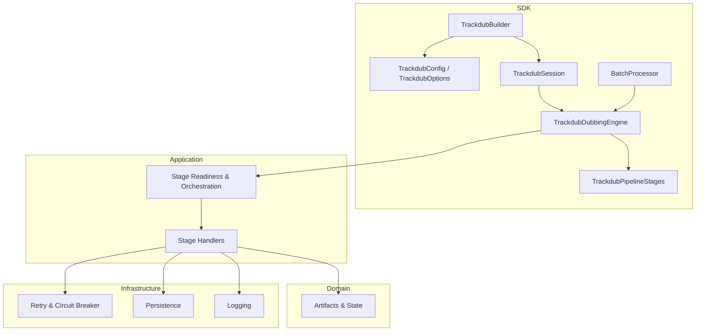
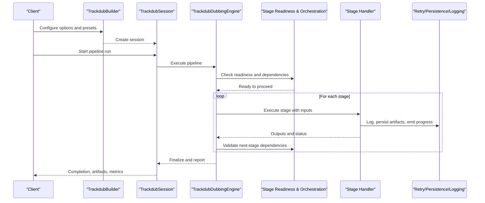
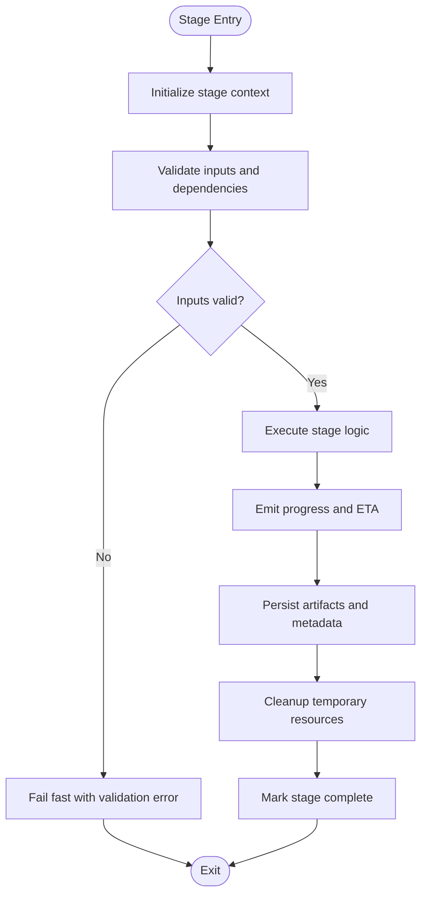
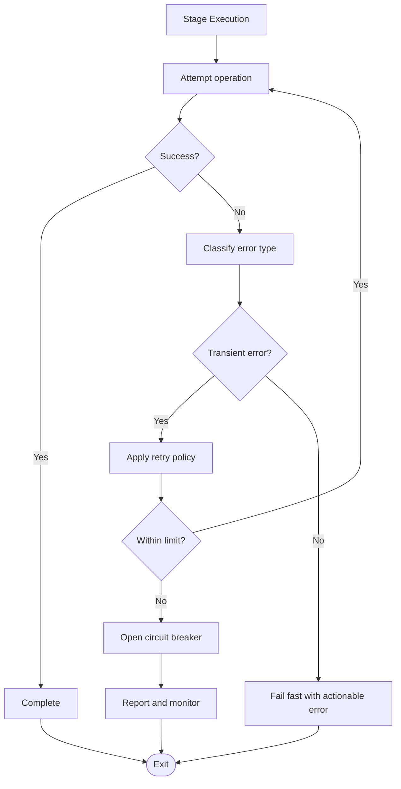
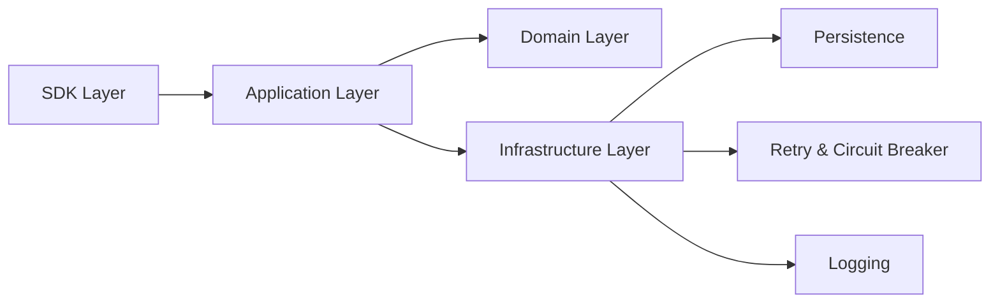

# Pipeline Processing Model

<cite>
**Referenced Files in This Document**
- [TrackdubPipelineStages.cs](file://src/Trackdub.Sdk/TrackdubPipelineStages.cs)
- [TrackdubDubbingEngine.cs](file://src/Trackdub.Sdk/TrackdubDubbingEngine.cs)
- [TrackdubSession.cs](file://src/Trackdub.Sdk/TrackdubSession.cs)
- [TrackdubSessionFactory.cs](file://src/Trackdub.Sdk/TrackdubSessionFactory.cs)
- [BatchProcessor.cs](file://src/Trackdub.Sdk/BatchProcessor.cs)
- [TrackdubBuilder.cs](file://src/Trackdub.Sdk/TrackdubBuilder.cs)
- [TrackdubConfig.cs](file://src/Trackdub.Sdk/TrackdubConfig.cs)
- [TrackdubOptions.cs](file://src/Trackdub.Sdk/TrackdubOptions.cs)
- [StageReadinessOrchestratorTests.cs](file://tests/Trackdub.Application.Tests/StageReadinessOrchestratorTests.cs)
- [AsrStageHandlerTests.cs](file://tests/Trackdub.Application.Tests/AsrStageHandlerTests.cs)
- [StartTtsStageHandlerLifecycleTests.cs](file://tests/Trackdub.Application.Tests/StartTtsStageHandlerLifecycleTests.cs)
- [TextRefinementStageHandlerFailureTests.cs](file://tests/Trackdub.Application.Tests/TextRefinementStageHandlerFailureTests.cs)
- [StageRunHelperTests.cs](file://tests/Trackdub.Application.Tests/StageRunHelperTests.cs)
- [StageContractsTests.cs](file://tests/Trackdub.Application.Tests/StageContractsTests.cs)
- [pipeline-principles-review-grok-2026-07-08.md](file://docs/architecture/pipeline-principles-review-grok-2026-07-08.md)
- [ADR-0010-event-sourced-pipeline.md](file://docs/decisions/ADR-0010-event-sourced-pipeline.md)
- [ADR-0008-inference-retry-circuit-breaker.md](file://docs/decisions/ADR-0008-inference-retry-circuit-breaker.md)
- [design-g4-run-progress-eta.md](file://docs/reference/impl-plan-g4-run-progress-eta.md)
- [design-g5-readiness-gate.md](file://docs/reference/impl-plan-g5-readiness-gate.md)
- [pipeline-readiness-spec.md](file://docs/specs/pipeline-readiness-spec.md)
</cite>

## Table of Contents
1. [Introduction](#introduction)
2. [Project Structure](#project-structure)
3. [Core Components](#core-components)
4. [Architecture Overview](#architecture-overview)
5. [Detailed Component Analysis](#detailed-component-analysis)
6. [Dependency Analysis](#dependency-analysis)
7. [Performance Considerations](#performance-considerations)
8. [Troubleshooting Guide](#troubleshooting-guide)
9. [Conclusion](#conclusion)
10. [Appendices](#appendices)

## Introduction
This document explains Trackdub’s pipeline processing model for dubbing operations. It focuses on the sequential, stage-based architecture where each dubbing job flows through well-defined stages such as transcription, translation, text refinement, TTS synthesis, lip-sync, and export. The documentation covers the stage lifecycle, data transformation between stages, error handling and retry mechanisms, progress tracking, cancellation support, orchestration, dependency management, failure recovery, custom stage implementation, configuration options, performance optimization, parallel processing, resource management, and monitoring strategies.

## Project Structure
The pipeline is implemented across several layers:
- SDK entry points define how to configure and run pipelines (builder, session, engine).
- Stage definitions enumerate supported stages and their order.
- Application layer implements stage handlers and orchestrators.
- Contracts define interfaces and data models used by stages.
- Domain models represent artifacts and state transitions.
- Infrastructure provides persistence, retry, logging, and runtime services.
- Tests validate behavior, readiness checks, and failure scenarios.

**Diagram sources**
- [TrackdubBuilder.cs](file://src/Trackdub.Sdk/TrackdubBuilder.cs)
- [TrackdubConfig.cs](file://src/Trackdub.Sdk/TrackdubConfig.cs)
- [TrackdubOptions.cs](file://src/Trackdub.Sdk/TrackdubOptions.cs)
- [TrackdubSession.cs](file://src/Trackdub.Sdk/TrackdubSession.cs)
- [TrackdubDubbingEngine.cs](file://src/Trackdub.Sdk/TrackdubDubbingEngine.cs)
- [TrackdubPipelineStages.cs](file://src/Trackdub.Sdk/TrackdubPipelineStages.cs)
- [BatchProcessor.cs](file://src/Trackdub.Sdk/BatchProcessor.cs)

**Section sources**
- [TrackdubPipelineStages.cs](file://src/Trackdub.Sdk/TrackdubPipelineStages.cs)
- [TrackdubDubbingEngine.cs](file://src/Trackdub.Sdk/TrackdubDubbingEngine.cs)
- [TrackdubSession.cs](file://src/Trackdub.Sdk/TrackdubSession.cs)
- [TrackdubSessionFactory.cs](file://src/Trackdub.Sdk/TrackdubSessionFactory.cs)
- [BatchProcessor.cs](file://src/Trackdub.Sdk/BatchProcessor.cs)
- [TrackdubBuilder.cs](file://src/Trackdub.Sdk/TrackdubBuilder.cs)
- [TrackdubConfig.cs](file://src/Trackdub.Sdk/TrackdubConfig.cs)
- [TrackdubOptions.cs](file://src/Trackdub.Sdk/TrackdubOptions.cs)

## Core Components
- Pipeline Stages: Enumerates and orders stages like transcription, translation, text refinement, TTS synthesis, lip-sync, and export.
- Session and Engine: Manage lifecycle, context, and execution of a pipeline run.
- Builder and Configuration: Provide declarative setup for engines, options, and presets.
- Batch Processor: Coordinates multiple runs with concurrency control and reporting.
- Readiness and Orchestration: Ensure prerequisites are met before executing stages and manage dependencies.

Key responsibilities:
- Define stage sequence and constraints.
- Initialize and dispose resources per run.
- Execute stages sequentially or conditionally based on dependencies.
- Emit progress events and handle cancellation.
- Persist intermediate artifacts and final outputs.

**Section sources**
- [TrackdubPipelineStages.cs](file://src/Trackdub.Sdk/TrackdubPipelineStages.cs)
- [TrackdubDubbingEngine.cs](file://src/Trackdub.Sdk/TrackdubDubbingEngine.cs)
- [TrackdubSession.cs](file://src/Trackdub.Sdk/TrackdubSession.cs)
- [TrackdubSessionFactory.cs](file://src/Trackdub.Sdk/TrackdubSessionFactory.cs)
- [BatchProcessor.cs](file://src/Trackdub.Sdk/BatchProcessor.cs)
- [TrackdubBuilder.cs](file://src/Trackdub.Sdk/TrackdubBuilder.cs)
- [TrackdubConfig.cs](file://src/Trackdub.Sdk/TrackdubConfig.cs)
- [TrackdubOptions.cs](file://src/Trackdub.Sdk/TrackdubOptions.cs)

## Architecture Overview
The pipeline follows an event-sourced, stage-driven design. Each stage transforms input artifacts into outputs consumed by subsequent stages. Orchestration ensures readiness gates pass before execution, and failures trigger retries or circuit breaking as configured. Progress and ETA are emitted throughout the run, supporting UI updates and external monitoring.

**Diagram sources**
- [TrackdubBuilder.cs](file://src/Trackdub.Sdk/TrackdubBuilder.cs)
- [TrackdubSession.cs](file://src/Trackdub.Sdk/TrackdubSession.cs)
- [TrackdubDubbingEngine.cs](file://src/Trackdub.Sdk/TrackdubDubbingEngine.cs)
- [StageReadinessOrchestratorTests.cs](file://tests/Trackdub.Application.Tests/StageReadinessOrchestratorTests.cs)

**Section sources**
- [ADR-0010-event-sourced-pipeline.md](file://docs/decisions/ADR-0010-event-sourced-pipeline.md)
- [design-g4-run-progress-eta.md](file://docs/reference/impl-plan-g4-run-progress-eta.md)
- [design-g5-readiness-gate.md](file://docs/reference/impl-plan-g5-readiness-gate.md)
- [pipeline-readiness-spec.md](file://docs/specs/pipeline-readiness-spec.md)

## Detailed Component Analysis

### Pipeline Stages and Lifecycle
- Stages are enumerated and ordered to reflect the typical dubbing workflow: transcription, translation, text refinement, TTS synthesis, lip-sync, mixing, and export.
- Each stage has a defined input contract and output artifact set.
- Lifecycle includes initialization, execution, progress emission, cleanup, and error handling.

**Diagram sources**
- [TrackdubPipelineStages.cs](file://src/Trackdub.Sdk/TrackdubPipelineStages.cs)
- [AsrStageHandlerTests.cs](file://tests/Trackdub.Application.Tests/AsrStageHandlerTests.cs)
- [StartTtsStageHandlerLifecycleTests.cs](file://tests/Trackdub.Application.Tests/StartTtsStageHandlerLifecycleTests.cs)

**Section sources**
- [TrackdubPipelineStages.cs](file://src/Trackdub.Sdk/TrackdubPipelineStages.cs)
- [AsrStageHandlerTests.cs](file://tests/Trackdub.Application.Tests/AsrStageHandlerTests.cs)
- [StartTtsStageHandlerLifecycleTests.cs](file://tests/Trackdub.Application.Tests/StartTtsStageHandlerLifecycleTests.cs)

### Data Transformation Between Stages
- Transcription converts audio to text segments with timing.
- Translation maps source text to target language while preserving alignment.
- Text refinement adjusts phrasing for TTS readability and lip-sync accuracy.
- TTS synthesis generates audio from refined text using voice models.
- Lip-sync aligns generated audio with video frames.
- Mixing combines dubbed audio with original tracks.
- Export packages final artifacts for delivery.

Each stage validates its inputs and produces outputs consumed by the next stage. Intermediate artifacts are persisted to ensure resilience and reproducibility.

**Section sources**
- [TrackdubPipelineStages.cs](file://src/Trackdub.Sdk/TrackdubPipelineStages.cs)
- [StageContractsTests.cs](file://tests/Trackdub.Application.Tests/StageContractsTests.cs)

### Error Handling and Retry Mechanisms
- Failures at stage level are captured and logged.
- Retry policies apply to transient errors with backoff and limits.
- Circuit breaker patterns prevent cascading failures during sustained issues.
- Validation errors fail fast without retries.
- Recovery strategies include re-running failed stages or rolling back partial work.

**Diagram sources**
- [ADR-0008-inference-retry-circuit-breaker.md](file://docs/decisions/ADR-0008-inference-retry-circuit-breaker.md)
- [TextRefinementStageHandlerFailureTests.cs](file://tests/Trackdub.Application.Tests/TextRefinementStageHandlerFailureTests.cs)

**Section sources**
- [ADR-0008-inference-retry-circuit-breaker.md](file://docs/decisions/ADR-0008-inference-retry-circuit-breaker.md)
- [TextRefinementStageHandlerFailureTests.cs](file://tests/Trackdub.Application.Tests/TextRefinementStageHandlerFailureTests.cs)

### Progress Tracking and Cancellation Support
- Progress events include percentage, ETA, and stage-specific metrics.
- Cancellation tokens allow graceful shutdown of long-running stages.
- UI and external systems subscribe to progress streams for real-time feedback.
- Cancellation propagates through the pipeline to stop dependent stages.

**Section sources**
- [design-g4-run-progress-eta.md](file://docs/reference/impl-plan-g4-run-progress-eta.md)
- [StageRunHelperTests.cs](file://tests/Trackdub.Application.Tests/StageRunHelperTests.cs)

### Orchestration and Dependencies Management
- Readiness gates verify prerequisites like model availability, device capabilities, and license tiers.
- Dependency graphs determine which stages can run and in what order.
- Conditional execution allows skipping optional stages based on configuration.
- Orchestration ensures consistent state across runs and supports resuming from checkpoints.

**Section sources**
- [design-g5-readiness-gate.md](file://docs/reference/impl-plan-g5-readiness-gate.md)
- [pipeline-readiness-spec.md](file://docs/specs/pipeline-readiness-spec.md)
- [StageReadinessOrchestratorTests.cs](file://tests/Trackdub.Application.Tests/StageReadinessOrchestratorTests.cs)

### Custom Stage Implementation
To implement a custom stage:
- Define stage metadata and ordering relative to existing stages.
- Implement input validation and output generation adhering to contracts.
- Integrate with progress emission and cancellation.
- Handle errors and retries according to policy.
- Persist artifacts and update provenance metadata.

Best practices:
- Keep stages idempotent where possible.
- Use streaming APIs to reduce memory pressure.
- Log detailed diagnostics for troubleshooting.
- Test edge cases and failure modes thoroughly.

**Section sources**
- [TrackdubPipelineStages.cs](file://src/Trackdub.Sdk/TrackdubPipelineStages.cs)
- [StageContractsTests.cs](file://tests/Trackdub.Application.Tests/StageContractsTests.cs)

### Configuration Options and Presets
- TrackdubConfig and TrackdubOptions provide centralized settings for engines, providers, and runtime behavior.
- Presets bundle common configurations for quick setup.
- Builder pattern enables fluent configuration of sessions and engines.
- Environment variables and files can override defaults.

Key options include:
- Execution provider preferences (CPU, GPU, specialized accelerators).
- Model selection and caching policies.
- Concurrency limits and resource budgets.
- Logging verbosity and telemetry endpoints.

**Section sources**
- [TrackdubConfig.cs](file://src/Trackdub.Sdk/TrackdubConfig.cs)
- [TrackdubOptions.cs](file://src/Trackdub.Sdk/TrackdubOptions.cs)
- [TrackdubBuilder.cs](file://src/Trackdub.Sdk/TrackdubBuilder.cs)

### Parallel Processing Capabilities
- BatchProcessor coordinates multiple pipeline runs with controlled concurrency.
- Resource-aware scheduling prevents overcommitment of CPU/GPU/memory.
- Independent jobs can run concurrently; dependent stages within a job remain sequential.
- Throughput scales with available hardware and configured limits.

**Section sources**
- [BatchProcessor.cs](file://src/Trackdub.Sdk/BatchProcessor.cs)

### Resource Management and Monitoring
- Resource managers allocate and release GPU/CPU/memory per stage.
- Monitoring emits metrics for latency, throughput, and error rates.
- Health checks validate component readiness before execution.
- Telemetry integrates with external observability platforms.

**Section sources**
- [TrackdubDubbingEngine.cs](file://src/Trackdub.Sdk/TrackdubDubbingEngine.cs)
- [TrackdubSession.cs](file://src/Trackdub.Sdk/TrackdubSession.cs)

## Dependency Analysis
The pipeline components exhibit clear separation of concerns:
- SDK layer abstracts configuration and execution.
- Application layer encapsulates business logic and orchestration.
- Domain layer defines core entities and state transitions.
- Infrastructure provides cross-cutting services like persistence and retry.

**Diagram sources**
- [TrackdubSdk.slnx](file://Trackdub.Sdk.slnx)
- [Trackdub.Application.csproj](file://src/Trackdub.Application/Trackdub.Application.csproj)
- [Trackdub.Domain.csproj](file://src/Trackdub.Domain/Trackdub.Domain.csproj)
- [Trackdub.Infrastructure.csproj](file://src/Trackdub.Infrastructure/Trackdub.Infrastructure.csproj)

**Section sources**
- [Trackdub.Sdk.slnx](file://Trackdub.Sdk.slnx)
- [Trackdub.Application.csproj](file://src/Trackdub.Application/Trackdub.Application.csproj)
- [Trackdub.Domain.csproj](file://src/Trackdub.Domain/Trackdub.Domain.csproj)
- [Trackdub.Infrastructure.csproj](file://src/Trackdub.Infrastructure/Trackdub.Infrastructure.csproj)

## Performance Considerations
- Prefer streaming I/O to minimize memory usage during large media processing.
- Cache reusable models and intermediate results to avoid recomputation.
- Tune concurrency levels based on hardware capacity and workload characteristics.
- Use optimized execution providers (e.g., TensorRT, CUDA) for compute-heavy stages.
- Profile critical paths and identify bottlenecks with telemetry and benchmarks.
- Apply batching and pipelining where possible to improve throughput.

[No sources needed since this section provides general guidance]

## Troubleshooting Guide
Common issues and resolutions:
- Readiness failures: Verify model availability, device drivers, and license tiers.
- Transient errors: Check network connectivity and service health; adjust retry policies.
- Memory exhaustion: Reduce batch sizes, enable streaming, and monitor GPU memory usage.
- Cancellation not respected: Ensure stages poll cancellation tokens and propagate them.
- Progress stalls: Inspect logs for blocked I/O or long-running computations.

Diagnostic tools:
- Enable verbose logging and collect telemetry.
- Use batch reports to analyze run outcomes and durations.
- Validate contracts and artifacts with test utilities.

**Section sources**
- [StageRunHelperTests.cs](file://tests/Trackdub.Application.Tests/StageRunHelperTests.cs)
- [TextRefinementStageHandlerFailureTests.cs](file://tests/Trackdub.Application.Tests/TextRefinementStageHandlerFailureTests.cs)

## Conclusion
Trackdub’s pipeline processing model provides a robust, extensible framework for dubbing workflows. Its stage-based architecture ensures clear separation of responsibilities, predictable data flow, and resilient error handling. With configurable options, parallel processing, and comprehensive monitoring, it supports both local development and production deployments. Custom stages can be integrated seamlessly, enabling tailored workflows while maintaining consistency and reliability.

[No sources needed since this section summarizes without analyzing specific files]

## Appendices
- References to architectural decisions and specifications guide design choices and evolution.
- Test suites validate correctness and resilience under various conditions.
- Documentation links provide deeper insights into readiness gates, progress tracking, and event sourcing.

**Section sources**
- [pipeline-principles-review-grok-2026-07-08.md](file://docs/architecture/pipeline-principles-review-grok-2026-07-08.md)
- [ADR-0010-event-sourced-pipeline.md](file://docs/decisions/ADR-0010-event-sourced-pipeline.md)
- [design-g4-run-progress-eta.md](file://docs/reference/impl-plan-g4-run-progress-eta.md)
- [design-g5-readiness-gate.md](file://docs/reference/impl-plan-g5-readiness-gate.md)
- [pipeline-readiness-spec.md](file://docs/specs/pipeline-readiness-spec.md)