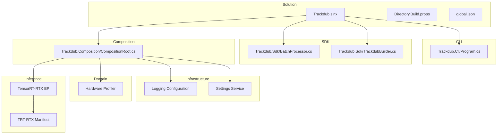
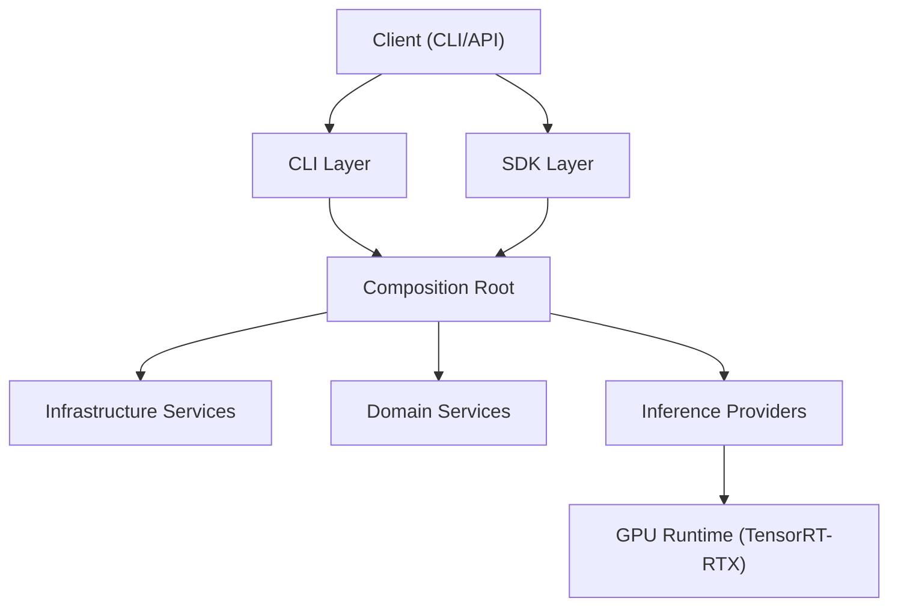
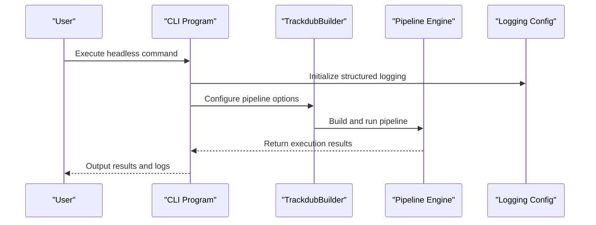
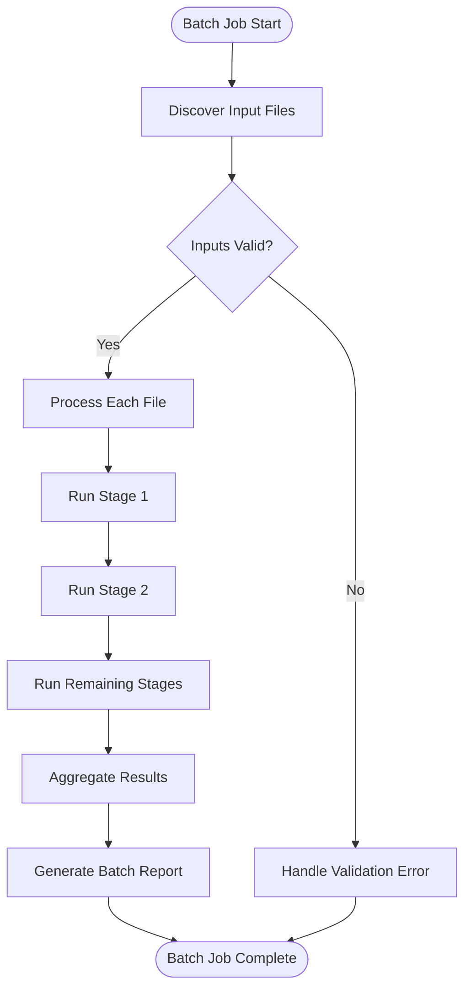
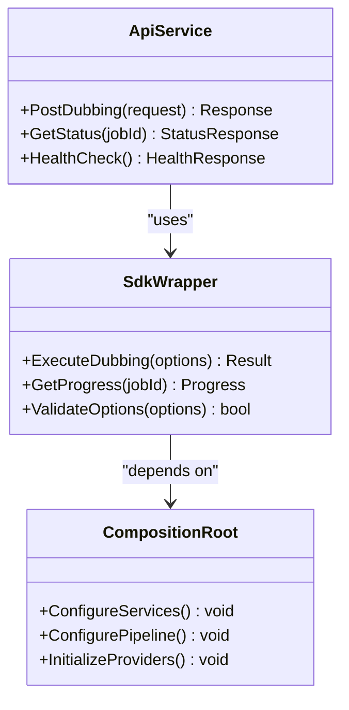
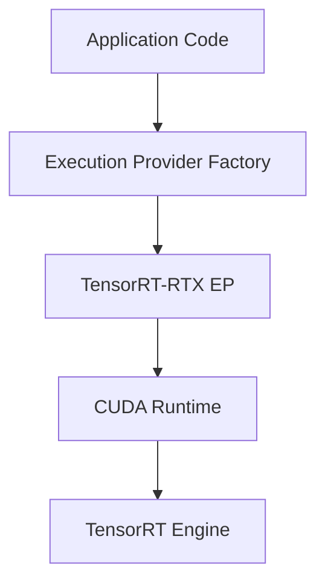
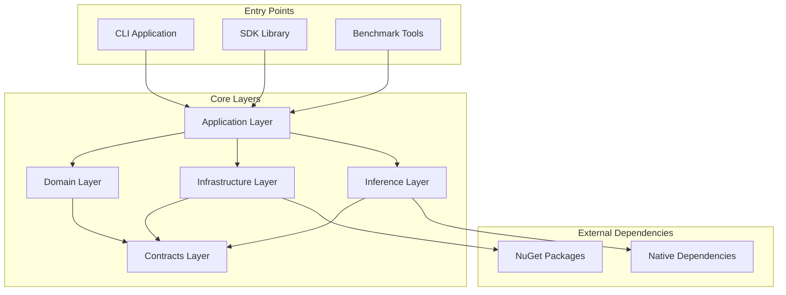

# Containerization & Cloud Deployment

<cite>
**Referenced Files in This Document**
- [README.md](file://README.md)
- [Trackdub.slnx](file://Trackdub.slnx)
- [Directory.Build.props](file://Directory.Build.props)
- [global.json](file://global.json)
- [Trackdub.Cli/Program.cs](file://src/Trackdub.Cli/Program.cs)
- [Trackdub.Benchmarks/Program.cs](file://src/Trackdub.Benchmarks/Program.cs)
- [Trackdub.Sdk/BatchProcessor.cs](file://src/Trackdub.Sdk/BatchProcessor.cs)
- [Trackdub.Sdk/TrackdubBuilder.cs](file://src/Trackdub.Sdk/TrackdubBuilder.cs)
- [Trackdub.Composition/CompositionRoot.cs](file://src/Trackdub.Composition/CompositionRoot.cs)
- [Trackdub.Infrastructure/Logging/CliLoggingConfiguration.cs](file://src/Trackdub.Infrastructure/Logging/CliLoggingConfiguration.cs)
- [Trackdub.Infrastructure/Settings/SettingsService.cs](file://src/Trackdub.Infrastructure/Settings/SettingsService.cs)
- [Trackdub.Domain/HardwareProfiler.cs](file://src/Trackdub.Domain/HardwareProfiler.cs)
- [Trackdub.Inference.Onnx/TensorRtRtx/TensorRtRtxExecutionProvider.cs](file://src/Trackdub.Inference.Onnx/TensorRtRtx/TensorRtRtxExecutionProvider.cs)
- [runtime/trt-rtx-ep.manifest.json](file://runtime/trt-rtx-ep.manifest.json)
- [.github/workflows/build.yml](file://.github/workflows/build.yml)
- [docs/architecture/ARCHITECTURE.md](file://docs/architecture/ARCHITECTURE.md)
- [docs/specs/service-blueprint-first-dub.md](file://docs/specs/service-blueprint-first-dub.md)
- [docs/decisions/ADR-0009-gpu-memory-budget-planner.md](file://docs/decisions/ADR-0009-gpu-memory-budget-planner.md)
- [docs/reference/tensorrt-rtx-ep-abstraction.md](file://docs/reference/tensorrt-rtx-ep-abstraction.md)
</cite>

## Table of Contents
1. [Introduction](#introduction)
2. [Project Structure](#project-structure)
3. [Core Components](#core-components)
4. [Architecture Overview](#architecture-overview)
5. [Detailed Component Analysis](#detailed-component-analysis)
6. [Dependency Analysis](#dependency-analysis)
7. [Performance Considerations](#performance-considerations)
8. [Troubleshooting Guide](#troubleshooting-guide)
9. [Conclusion](#conclusion)
10. [Appendices](#appendices)

## Introduction
This document provides a comprehensive guide to containerizing and deploying Trackdub in cloud environments. It covers Docker image strategies for headless processing, batch operations, and API services; Kubernetes deployment manifests; scaling and resource optimization; cloud-native patterns including microservice decomposition and service mesh integration; GPU acceleration with TensorRT-RTX; memory management and performance tuning; monitoring and logging; health checks and auto-scaling policies; and provider-specific considerations for AWS, Azure, and Google Cloud. It also includes cost optimization techniques such as spot instances and disaster recovery procedures.

## Project Structure
Trackdub is a multi-project .NET solution organized into application, domain, infrastructure, inference, SDK, CLI, and benchmarks layers. The CLI entry points enable headless and batch execution, while the SDK exposes programmatic interfaces suitable for building API services. Composition and configuration are centralized to support consistent runtime behavior across environments.

**Diagram sources**
- [Trackdub.slnx:1-20](file://Trackdub.slnx#L1-L20)
- [Directory.Build.props:1-30](file://Directory.Build.props#L1-L30)
- [global.json:1-20](file://global.json#L1-L20)
- [Trackdub.Cli/Program.cs:1-40](file://src/Trackdub.Cli/Program.cs#L1-L40)
- [Trackdub.Sdk/BatchProcessor.cs:1-60](file://src/Trackdub.Sdk/BatchProcessor.cs#L1-L60)
- [Trackdub.Sdk/TrackdubBuilder.cs:1-80](file://src/Trackdub.Sdk/TrackdubBuilder.cs#L1-L80)
- [Trackdub.Composition/CompositionRoot.cs:1-100](file://src/Trackdub.Composition/CompositionRoot.cs#L1-L100)
- [Trackdub.Infrastructure/Logging/CliLoggingConfiguration.cs:1-60](file://src/Trackdub.Infrastructure/Logging/CliLoggingConfiguration.cs#L1-L60)
- [Trackdub.Infrastructure/Settings/SettingsService.cs:1-80](file://src/Trackdub.Infrastructure/Settings/SettingsService.cs#L1-L80)
- [Trackdub.Domain/HardwareProfiler.cs:1-60](file://src/Trackdub.Domain/HardwareProfiler.cs#L1-L60)
- [Trackdub.Inference.Onnx/TensorRtRtx/TensorRtRtxExecutionProvider.cs:1-80](file://src/Trackdub.Inference.Onnx/TensorRtRtx/TensorRtRtxExecutionProvider.cs#L1-L80)
- [runtime/trt-rtx-ep.manifest.json:1-40](file://runtime/trt-rtx-ep.manifest.json#L1-L40)

**Section sources**
- [README.md:1-50](file://README.md#L1-L50)
- [Trackdub.slnx:1-20](file://Trackdub.slnx#L1-L20)
- [Directory.Build.props:1-30](file://Directory.Build.props#L1-L30)
- [global.json:1-20](file://global.json#L1-L20)

## Core Components
- CLI Entry Points: Provide headless and batch command-line interfaces for running dubbing pipelines without UI.
- SDK Batch Processor: Orchestrates batch jobs, manages inputs/outputs, and reports outcomes.
- Composition Root: Wires dependencies, configures logging, settings, hardware profiling, and inference providers.
- Infrastructure Services: Centralized logging configuration and settings management ensure consistent runtime behavior.
- Domain Hardware Profiler: Detects available devices and capabilities to optimize pipeline execution.
- Inference Providers: TensorRT-RTX execution provider enables GPU-accelerated ONNX model execution.

Key responsibilities:
- Headless Processing: CLI commands execute stages sequentially or in parallel based on configuration.
- Batch Operations: SDK batch processor handles job queues, progress tracking, and result aggregation.
- API Services: Build REST endpoints around SDK methods to expose dubbing capabilities as microservices.

**Section sources**
- [Trackdub.Cli/Program.cs:1-40](file://src/Trackdub.Cli/Program.cs#L1-L40)
- [Trackdub.Sdk/BatchProcessor.cs:1-60](file://src/Trackdub.Sdk/BatchProcessor.cs#L1-L60)
- [Trackdub.Composition/CompositionRoot.cs:1-100](file://src/Trackdub.Composition/CompositionRoot.cs#L1-L100)
- [Trackdub.Infrastructure/Logging/CliLoggingConfiguration.cs:1-60](file://src/Trackdub.Infrastructure/Logging/CliLoggingConfiguration.cs#L1-L60)
- [Trackdub.Infrastructure/Settings/SettingsService.cs:1-80](file://src/Trackdub.Infrastructure/Settings/SettingsService.cs#L1-L80)
- [Trackdub.Domain/HardwareProfiler.cs:1-60](file://src/Trackdub.Domain/HardwareProfiler.cs#L1-L60)
- [Trackdub.Inference.Onnx/TensorRtRtx/TensorRtRtxExecutionProvider.cs:1-80](file://src/Trackdub.Inference.Onnx/TensorRtRtx/TensorRtRtxExecutionProvider.cs#L1-L80)

## Architecture Overview
Trackdub follows a layered architecture with clear separation between CLI, SDK, composition, infrastructure, domain, and inference layers. The composition root orchestrates dependency injection and runtime configuration. GPU acceleration is provided via TensorRT-RTX execution provider for ONNX models.

**Diagram sources**
- [Trackdub.Cli/Program.cs:1-40](file://src/Trackdub.Cli/Program.cs#L1-L40)
- [Trackdub.Sdk/BatchProcessor.cs:1-60](file://src/Trackdub.Sdk/BatchProcessor.cs#L1-L60)
- [Trackdub.Composition/CompositionRoot.cs:1-100](file://src/Trackdub.Composition/CompositionRoot.cs#L1-L100)
- [Trackdub.Infrastructure/Logging/CliLoggingConfiguration.cs:1-60](file://src/Trackdub.Infrastructure/Logging/CliLoggingConfiguration.cs#L1-L60)
- [Trackdub.Domain/HardwareProfiler.cs:1-60](file://src/Trackdub.Domain/HardwareProfiler.cs#L1-L60)
- [Trackdub.Inference.Onnx/TensorRtRtx/TensorRtRtxExecutionProvider.cs:1-80](file://src/Trackdub.Inference.Onnx/TensorRtRtx/TensorRtRtxExecutionProvider.cs#L1-L80)

## Detailed Component Analysis

### CLI Headless Processing
The CLI provides commands for headless execution of dubbing pipelines. It supports batch processing, progress reporting, and structured logging output suitable for containerized environments.

**Diagram sources**
- [Trackdub.Cli/Program.cs:1-40](file://src/Trackdub.Cli/Program.cs#L1-L40)
- [Trackdub.Infrastructure/Logging/CliLoggingConfiguration.cs:1-60](file://src/Trackdub.Infrastructure/Logging/CliLoggingConfiguration.cs#L1-L60)
- [Trackdub.Sdk/TrackdubBuilder.cs:1-80](file://src/Trackdub.Sdk/TrackdubBuilder.cs#L1-L80)

**Section sources**
- [Trackdub.Cli/Program.cs:1-40](file://src/Trackdub.Cli/Program.cs#L1-L40)
- [Trackdub.Infrastructure/Logging/CliLoggingConfiguration.cs:1-60](file://src/Trackdub.Infrastructure/Logging/CliLoggingConfiguration.cs#L1-L60)

### Batch Operations with SDK
The SDK batch processor manages batch job execution, handling input discovery, stage orchestration, and outcome reporting. It supports configurable concurrency and error handling strategies.

**Diagram sources**
- [Trackdub.Sdk/BatchProcessor.cs:1-60](file://src/Trackdub.Sdk/BatchProcessor.cs#L1-L60)

**Section sources**
- [Trackdub.Sdk/BatchProcessor.cs:1-60](file://src/Trackdub.Sdk/BatchProcessor.cs#L1-L60)

### API Service Microservice
To create an API service, wrap SDK functionality behind REST endpoints. Use dependency injection through the composition root and configure logging and settings appropriately for containerized deployments.

**Diagram sources**
- [Trackdub.Composition/CompositionRoot.cs:1-100](file://src/Trackdub.Composition/CompositionRoot.cs#L1-L100)
- [Trackdub.Sdk/TrackdubBuilder.cs:1-80](file://src/Trackdub.Sdk/TrackdubBuilder.cs#L1-L80)

**Section sources**
- [Trackdub.Composition/CompositionRoot.cs:1-100](file://src/Trackdub.Composition/CompositionRoot.cs#L1-L100)
- [Trackdub.Sdk/TrackdubBuilder.cs:1-80](file://src/Trackdub.Sdk/TrackdubBuilder.cs#L1-L80)

### GPU Acceleration with TensorRT-RTX
Trackdub integrates TensorRT-RTX execution provider for GPU-accelerated ONNX model inference. The runtime manifest defines provider configuration and capabilities.

**Diagram sources**
- [Trackdub.Inference.Onnx/TensorRtRtx/TensorRtRtxExecutionProvider.cs:1-80](file://src/Trackdub.Inference.Onnx/TensorRtRtx/TensorRtRtxExecutionProvider.cs#L1-L80)
- [runtime/trt-rtx-ep.manifest.json:1-40](file://runtime/trt-rtx-ep.manifest.json#L1-L40)

**Section sources**
- [Trackdub.Inference.Onnx/TensorRtRtx/TensorRtRtxExecutionProvider.cs:1-80](file://src/Trackdub.Inference.Onnx/TensorRtRtx/TensorRtRtxExecutionProvider.cs#L1-L80)
- [runtime/trt-rtx-ep.manifest.json:1-40](file://runtime/trt-rtx-ep.manifest.json#L1-L40)

## Dependency Analysis
Trackdub's dependency structure follows clean architecture principles with clear separation of concerns. The composition root manages all dependencies and ensures proper initialization order.

**Diagram sources**
- [Trackdub.slnx:1-20](file://Trackdub.slnx#L1-L20)
- [Directory.Build.props:1-30](file://Directory.Build.props#L1-L30)

**Section sources**
- [Trackdub.slnx:1-20](file://Trackdub.slnx#L1-L20)
- [Directory.Build.props:1-30](file://Directory.Build.props#L1-L30)

## Performance Considerations
- GPU Memory Management: Implement memory budget planning to prevent OOM errors during large batch processing.
- Concurrency Control: Tune parallelism levels based on available CPU cores and GPU memory capacity.
- Model Optimization: Use quantized models and optimized execution providers for better performance.
- Resource Limits: Set appropriate CPU and memory requests/limits in Kubernetes deployments.
- Caching Strategies: Implement model caching and artifact reuse to reduce startup times.

[No sources needed since this section provides general guidance]

## Troubleshooting Guide
Common issues and their resolutions:
- GPU Initialization Failures: Verify CUDA driver compatibility and TensorRT installation.
- Memory Allocation Errors: Adjust batch sizes and implement memory cleanup strategies.
- Logging Issues: Ensure structured logging is properly configured for container environments.
- Network Connectivity: Check proxy settings and network policies for model downloads.

**Section sources**
- [Trackdub.Infrastructure/Logging/CliLoggingConfiguration.cs:1-60](file://src/Trackdub.Infrastructure/Logging/CliLoggingConfiguration.cs#L1-L60)
- [Trackdub.Domain/HardwareProfiler.cs:1-60](file://src/Trackdub.Domain/HardwareProfiler.cs#L1-L60)

## Conclusion
Trackdub provides a robust foundation for containerized AI-powered dubbing services. Its modular architecture supports multiple deployment patterns from single-container applications to distributed microservices. With proper GPU acceleration, resource management, and monitoring, it can scale effectively in cloud environments while maintaining high performance and reliability.

[No sources needed since this section summarizes without analyzing specific files]

## Appendices

### Docker Image Strategies
- Base Images: Use official .NET runtime images with minimal footprint
- Multi-stage Builds: Separate build and runtime stages for smaller images
- GPU Support: Include CUDA and TensorRT dependencies for GPU-enabled containers
- Security Scanning: Integrate vulnerability scanning in CI/CD pipelines

### Kubernetes Deployment Patterns
- StatefulSets: For persistent model caching and artifact storage
- Horizontal Pod Autoscaling: Scale based on CPU/memory utilization or custom metrics
- Resource Quotas: Define limits to prevent resource exhaustion
- Service Mesh Integration: Use Istio or Linkerd for traffic management and observability

### Cloud Provider Specifics
- AWS: Use ECS/EKS with GPU instances and ECR for container registry
- Azure: Deploy to AKS with GPU node pools and ACR for container storage
- Google Cloud: Utilize GKE with GPU nodes and Artifact Registry

### Monitoring and Observability
- Structured Logging: JSON format for log aggregation platforms
- Metrics Export: Prometheus-compatible metrics for performance monitoring
- Health Checks: Readiness and liveness probes for container orchestration
- Distributed Tracing: OpenTelemetry integration for request tracing

### Cost Optimization
- Spot Instances: Use preemptible instances for non-critical workloads
- Auto-scaling: Scale down during low usage periods
- Model Caching: Share models across pods using persistent volumes
- Right-sizing: Monitor resource utilization and adjust instance types

### Disaster Recovery
- Backup Strategies: Regular backups of models and artifacts
- Multi-region Deployment: Deploy across availability zones for redundancy
- Rollback Procedures: Versioned deployments with quick rollback capability
- Data Replication: Cross-region replication for critical data

[No sources needed since this section provides general guidance]