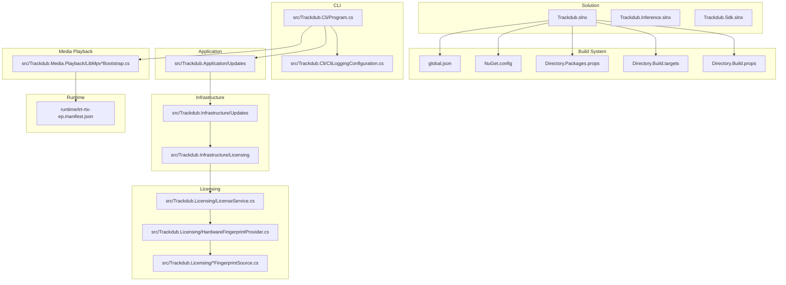
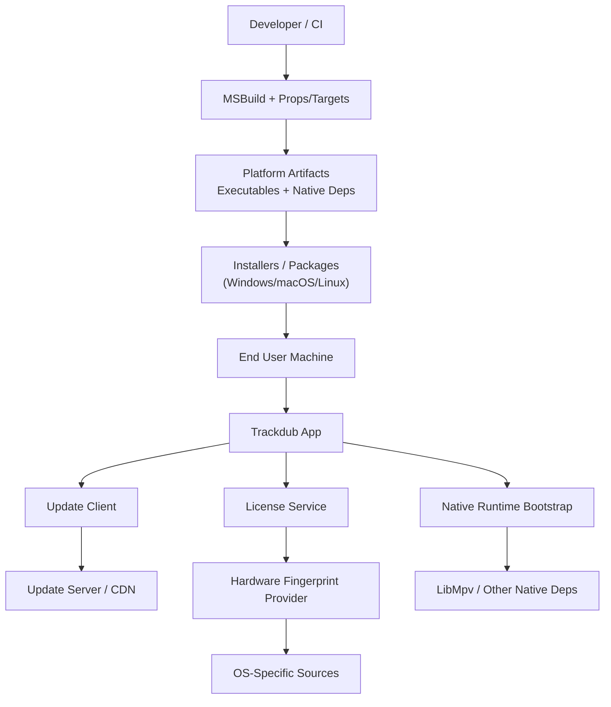
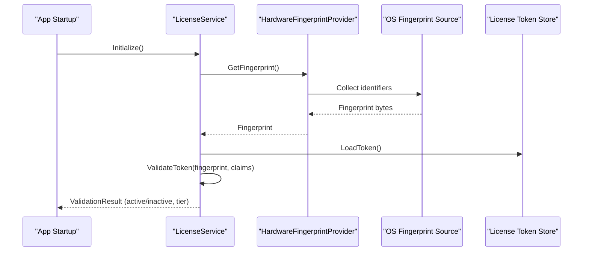
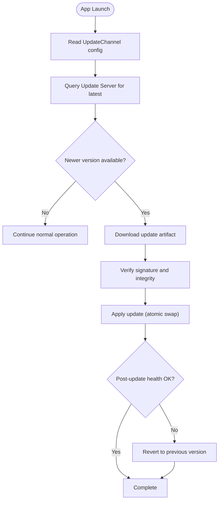
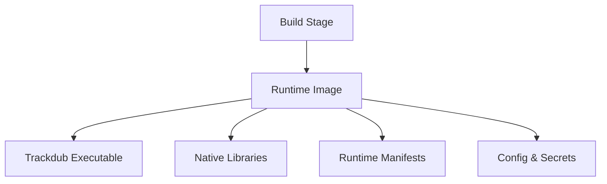
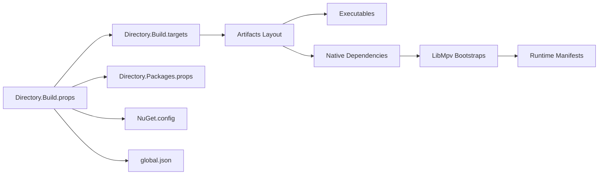

# Deployment & Distribution

<cite>
**Referenced Files in This Document**
- [README.md](file://README.md)
- [CONTRIBUTING.md](file://CONTRIBUTING.md)
- [AGENTS.md](file://AGENTS.md)
- [Directory.Build.props](file://Directory.Build.props)
- [Directory.Build.targets](file://Directory.Build.targets)
- [Directory.Packages.props](file://Directory.Packages.props)
- [NuGet.config](file://NuGet.config)
- [global.json](file://global.json)
- [Trackdub.slnx](file://Trackdub.slnx)
- [Trackdub.Inference.slnx](file://Trackdub.Inference.slnx)
- [Trackdub.Sdk.slnx](file://Trackdub.Sdk.slnx)
- [mise.toml](file://mise.toml)
- [.github/workflows](file://.github/workflows)
- [.github/dependabot.yml](file://.github/dependabot.yml)
- [.github/FUNDING.yml](file://.github/FUNDING.yml)
- [scripts/ci/check-repository-boundary.py](file://scripts/ci/check-repository-boundary.py)
- [scripts/ci/run-avslnf-tests-sequential.sh](file://scripts/ci/run-avslnf-tests-sequential.sh)
- [scripts/lib/RalphLoop.ps1](file://scripts/lib/RalphLoop.ps1)
- [scripts/lib/SpecQueue.ps1](file://scripts/lib/SpecQueue.ps1)
- [scripts/lib/spec_queue.sh](file://scripts/lib/spec_queue.sh)
- [src/Trackdub.Cli/Program.cs](file://src/Trackdub.Cli/Program.cs)
- [src/Trackdub.Cli/CliLoggingConfiguration.cs](file://src/Trackdub.Cli/CliLoggingConfiguration.cs)
- [src/Trackdub.Application/Updates](file://src/Trackdub.Application/Updates)
- [src/Trackdub.Infrastructure/Updates](file://src/Trackdub.Infrastructure/Updates)
- [src/Trackdub.Licensing/LicenseService.cs](file://src/Trackdub.Licensing/LicenseService.cs)
- [src/Trackdub.Licensing/HardwareFingerprintProvider.cs](file://src/Trackdub.Licensing/HardwareFingerprintProvider.cs)
- [src/Trackdub.Licensing/LinuxFingerprintSource.cs](file://src/Trackdub.Licensing/LinuxFingerprintSource.cs)
- [src/Trackdub.Licensing/MacOsFingerprintSource.cs](file://src/Trackdub.Licensing/MacOsFingerprintSource.cs)
- [src/Trackdub.Licensing/WindowsFingerprintSource.cs](file://src/Trackdub.Licensing/WindowsFingerprintSource.cs)
- [src/Trackdub.Infrastructure/Licensing](file://src/Trackdub.Infrastructure/Licensing)
- [src/Trackdub.Contracts/UpdateChannel.cs](file://src/Trackdub.Contracts/UpdateChannel.cs)
- [src/Trackdub.Media.Playback/LibMpvLinuxBootstrap.cs](file://src/Trackdub.Media.Playback/LibMpvLinuxBootstrap.cs)
- [src/Trackdub.Media.Playback/LibMpvMacBootstrap.cs](file://src/Trackdub.Media.Playback/LibMpvMacBootstrap.cs)
- [src/Trackdub.Media.Playback/LibMpvWindowsBootstrap.cs](file://src/Trackdub.Media.Playback/LibMpvWindowsBootstrap.cs)
- [runtime/trt-rtx-ep.manifest.json](file://runtime/trt-rtx-ep.manifest.json)
- [docs/operations/macos-deployment-notes.md](file://docs/operations/macos-deployment-notes.md)
- [docs/operations/GITHUB_ACTIONS.md](file://docs/operations/GITHUB_ACTIONS.md)
- [docs/legal/LICENSE-HISTORY.md](file://docs/legal/LICENSE-HISTORY.md)
- [docs/legal/MODEL_LICENSE_POLICY.md](file://docs/legal/MODEL_LICENSE_POLICY.md)
- [docs/legal/THIRD_PARTY_NOTICES.md](file://docs/legal/THIRD_PARTY_NOTICES.md)
- [tools/trackdub-optimize.ps1](file://tools/trackdub-optimize.ps1)
- [tools/trackdub-optimize.sh](file://tools/trackdub-optimize.sh)
</cite>

## Table of Contents
1. Introduction
2. Project Structure
3. Core Components
4. Architecture Overview
5. Detailed Component Analysis
6. Dependency Analysis
7. Performance Considerations
8. Troubleshooting Guide
9. Conclusion
10. Appendices

## Introduction
This document provides a comprehensive guide to deploying and distributing Trackdub applications across Windows, macOS, and Linux. It covers packaging strategies for standalone executables and installers, licensing integration and activation workflows, update mechanisms, version management, rollback procedures, containerization, cloud deployment patterns, scaling considerations, security hardening, compliance requirements, audit logging, distribution channels, digital signing, code obfuscation techniques, troubleshooting, enterprise deployment patterns, centralized management, and monitoring integration. The guidance is grounded in the repository’s build system, CI configuration, CLI entry points, licensing modules, update subsystems, and platform-specific bootstraps.

## Project Structure
Trackdub is a multi-project .NET solution with clear separation between application layers, infrastructure, contracts, and tooling:
- Application layer (business logic, services, pipelines)
- Infrastructure layer (persistence, settings, updates, diagnostics)
- Contracts (interfaces and shared models)
- Licensing module (hardware fingerprinting, token parsing/validation)
- Media playback bootstrap per platform
- CLI entry point and configuration
- Build and packaging props/targets
- CI and automation scripts
- Documentation and legal notices

**Diagram sources**
- [Trackdub.slnx](file://Trackdub.slnx)
- [Directory.Build.props](file://Directory.Build.props)
- [Directory.Build.targets](file://Directory.Build.targets)
- [Directory.Packages.props](file://Directory.Packages.props)
- [NuGet.config](file://NuGet.config)
- [global.json](file://global.json)
- [src/Trackdub.Cli/Program.cs](file://src/Trackdub.Cli/Program.cs)
- [src/Trackdub.Cli/CliLoggingConfiguration.cs](file://src/Trackdub.Cli/CliLoggingConfiguration.cs)
- [src/Trackdub.Application/Updates](file://src/Trackdub.Application/Updates)
- [src/Trackdub.Infrastructure/Updates](file://src/Trackdub.Infrastructure/Updates)
- [src/Trackdub.Infrastructure/Licensing](file://src/Trackdub.Infrastructure/Licensing)
- [src/Trackdub.Licensing/LicenseService.cs](file://src/Trackdub.Licensing/LicenseService.cs)
- [src/Trackdub.Licensing/HardwareFingerprintProvider.cs](file://src/Trackdub.Licensing/HardwareFingerprintProvider.cs)
- [src/Trackdub.Licensing/LinuxFingerprintSource.cs](file://src/Trackdub.Licensing/LinuxFingerprintSource.cs)
- [src/Trackdub.Licensing/MacOsFingerprintSource.cs](file://src/Trackdub.Licensing/MacOsFingerprintSource.cs)
- [src/Trackdub.Licensing/WindowsFingerprintSource.cs](file://src/Trackdub.Licensing/WindowsFingerprintSource.cs)
- [src/Trackdub.Media.Playback/LibMpvLinuxBootstrap.cs](file://src/Trackdub.Media.Playback/LibMpvLinuxBootstrap.cs)
- [src/Trackdub.Media.Playback/LibMpvMacBootstrap.cs](file://src/Trackdub.Media.Playback/LibMpvMacBootstrap.cs)
- [src/Trackdub.Media.Playback/LibMpvWindowsBootstrap.cs](file://src/Trackdub.Media.Playback/LibMpvWindowsBootstrap.cs)
- [runtime/trt-rtx-ep.manifest.json](file://runtime/trt-rtx-ep.manifest.json)

**Section sources**
- [README.md](file://README.md)
- [CONTRIBUTING.md](file://CONTRIBUTING.md)
- [AGENTS.md](file://AGENTS.md)
- [Directory.Build.props](file://Directory.Build.props)
- [Directory.Build.targets](file://Directory.Build.targets)
- [Directory.Packages.props](file://Directory.Packages.props)
- [NuGet.config](file://NuGet.config)
- [global.json](file://global.json)
- [Trackdub.slnx](file://Trackdub.slnx)
- [Trackdub.Inference.slnx](file://Trackdub.Inference.slnx)
- [Trackdub.Sdk.slnx](file://Trackdub.Sdk.slnx)
- [mise.toml](file://mise.toml)

## Core Components
- CLI Entry Point: Initializes logging, parses options, and boots the application pipeline.
- Updates Subsystem: Provides update channel selection, availability checks, and download orchestration.
- Licensing Module: Generates hardware fingerprints, validates license tokens, and enforces tier-based features.
- Platform Bootstraps: Locates and initializes native runtime dependencies for media playback on each OS.
- Build Props/Targets: Centralize cross-cutting build behavior, package metadata, and output layout.

Key responsibilities:
- Packaging: Use MSBuild targets and props to produce platform-specific outputs and embed required assets.
- Licensing: Integrate fingerprint providers and token validation into startup flow.
- Updates: Expose channels and implement safe upgrade paths with rollback support.
- Runtime: Ensure native libraries are present and correctly resolved at runtime.

**Section sources**
- [src/Trackdub.Cli/Program.cs](file://src/Trackdub.Cli/Program.cs)
- [src/Trackdub.Cli/CliLoggingConfiguration.cs](file://src/Trackdub.Cli/CliLoggingConfiguration.cs)
- [src/Trackdub.Application/Updates](file://src/Trackdub.Application/Updates)
- [src/Trackdub.Infrastructure/Updates](file://src/Trackdub.Infrastructure/Updates)
- [src/Trackdub.Licensing/LicenseService.cs](file://src/Trackdub.Licensing/LicenseService.cs)
- [src/Trackdub.Licensing/HardwareFingerprintProvider.cs](file://src/Trackdub.Licensing/HardwareFingerprintProvider.cs)
- [src/Trackdub.Licensing/LinuxFingerprintSource.cs](file://src/Trackdub.Licensing/LinuxFingerprintSource.cs)
- [src/Trackdub.Licensing/MacOsFingerprintSource.cs](file://src/Trackdub.Licensing/MacOsFingerprintSource.cs)
- [src/Trackdub.Licensing/WindowsFingerprintSource.cs](file://src/Trackdub.Licensing/WindowsFingerprintSource.cs)
- [src/Trackdub.Media.Playback/LibMpvLinuxBootstrap.cs](file://src/Trackdub.Media.Playback/LibMpvLinuxBootstrap.cs)
- [src/Trackdub.Media.Playback/LibMpvMacBootstrap.cs](file://src/Trackdub.Media.Playback/LibMpvMacBootstrap.cs)
- [src/Trackdub.Media.Playback/LibMpvWindowsBootstrap.cs](file://src/Trackdub.Media.Playback/LibMpvWindowsBootstrap.cs)
- [Directory.Build.props](file://Directory.Build.props)
- [Directory.Build.targets](file://Directory.Build.targets)

## Architecture Overview
The deployment architecture spans build-time packaging, runtime dependency resolution, licensing enforcement, and update delivery.

**Diagram sources**
- [Directory.Build.props](file://Directory.Build.props)
- [Directory.Build.targets](file://Directory.Build.targets)
- [src/Trackdub.Cli/Program.cs](file://src/Trackdub.Cli/Program.cs)
- [src/Trackdub.Application/Updates](file://src/Trackdub.Application/Updates)
- [src/Trackdub.Infrastructure/Updates](file://src/Trackdub.Infrastructure/Updates)
- [src/Trackdub.Licensing/LicenseService.cs](file://src/Trackdub.Licensing/LicenseService.cs)
- [src/Trackdub.Licensing/HardwareFingerprintProvider.cs](file://src/Trackdub.Licensing/HardwareFingerprintProvider.cs)
- [src/Trackdub.Licensing/LinuxFingerprintSource.cs](file://src/Trackdub.Licensing/LinuxFingerprintSource.cs)
- [src/Trackdub.Licensing/MacOsFingerprintSource.cs](file://src/Trackdub.Licensing/MacOsFingerprintSource.cs)
- [src/Trackdub.Licensing/WindowsFingerprintSource.cs](file://src/Trackdub.Licensing/WindowsFingerprintSource.cs)
- [src/Trackdub.Media.Playback/LibMpvLinuxBootstrap.cs](file://src/Trackdub.Media.Playback/LibMpvLinuxBootstrap.cs)
- [src/Trackdub.Media.Playback/LibMpvMacBootstrap.cs](file://src/Trackdub.Media.Playback/LibMpvMacBootstrap.cs)
- [src/Trackdub.Media.Playback/LibMpvWindowsBootstrap.cs](file://src/Trackdub.Media.Playback/LibMpvWindowsBootstrap.cs)

## Detailed Component Analysis

### Packaging Strategy by Platform
- Windows: Produce standalone executables with embedded native dependencies; create installers using standard packaging tools integrated via MSBuild targets.
- macOS: Bundle app bundles with signed frameworks and resources; ensure notarization steps are included in CI.
- Linux: Generate tarballs or packages (e.g., deb/rpm) with correct library paths and systemd service files if applicable.

Packaging inputs:
- Directory.Build.props/targets define common properties, output layouts, and artifact naming.
- NuGet.config controls package sources and lockfiles.
- global.json pins SDK/runtime versions for deterministic builds.

**Section sources**
- [Directory.Build.props](file://Directory.Build.props)
- [Directory.Build.targets](file://Directory.Build.targets)
- [NuGet.config](file://NuGet.config)
- [global.json](file://global.json)

### Licensing Integration and Activation Workflows
- LicenseService orchestrates initialization, token parsing, and validation.
- HardwareFingerprintProvider abstracts OS-specific fingerprint sources.
- Startup sequence integrates licensing checks before enabling premium features.

**Diagram sources**
- [src/Trackdub.Licensing/LicenseService.cs](file://src/Trackdub.Licensing/LicenseService.cs)
- [src/Trackdub.Licensing/HardwareFingerprintProvider.cs](file://src/Trackdub.Licensing/HardwareFingerprintProvider.cs)
- [src/Trackdub.Licensing/LinuxFingerprintSource.cs](file://src/Trackdub.Licensing/LinuxFingerprintSource.cs)
- [src/Trackdub.Licensing/MacOsFingerprintSource.cs](file://src/Trackdub.Licensing/MacOsFingerprintSource.cs)
- [src/Trackdub.Licensing/WindowsFingerprintSource.cs](file://src/Trackdub.Licensing/WindowsFingerprintSource.cs)

**Section sources**
- [src/Trackdub.Licensing/LicenseService.cs](file://src/Trackdub.Licensing/LicenseService.cs)
- [src/Trackdub.Licensing/HardwareFingerprintProvider.cs](file://src/Trackdub.Licensing/HardwareFingerprintProvider.cs)
- [src/Trackdub.Licensing/LinuxFingerprintSource.cs](file://src/Trackdub.Licensing/LinuxFingerprintSource.cs)
- [src/Trackdub.Licensing/MacOsFingerprintSource.cs](file://src/Trackdub.Licensing/MacOsFingerprintSource.cs)
- [src/Trackdub.Licensing/WindowsFingerprintSource.cs](file://src/Trackdub.Licensing/WindowsFingerprintSource.cs)

### Update Mechanisms and Version Management
- UpdateChannel defines available channels (e.g., stable, beta).
- Application and Infrastructure layers coordinate checking for updates, downloading artifacts, and applying upgrades safely.
- Rollback strategy ensures previous version remains available until new version stability is confirmed.

**Diagram sources**
- [src/Trackdub.Contracts/UpdateChannel.cs](file://src/Trackdub.Contracts/UpdateChannel.cs)
- [src/Trackdub.Application/Updates](file://src/Trackdub.Application/Updates)
- [src/Trackdub.Infrastructure/Updates](file://src/Trackdub.Infrastructure/Updates)

**Section sources**
- [src/Trackdub.Contracts/UpdateChannel.cs](file://src/Trackdub.Contracts/UpdateChannel.cs)
- [src/Trackdub.Application/Updates](file://src/Trackdub.Application/Updates)
- [src/Trackdub.Infrastructure/Updates](file://src/Trackdub.Infrastructure/Updates)

### Containerization and Cloud Deployment
- Container images should include only necessary runtime dependencies and native libraries.
- Use multi-stage Docker builds to minimize image size and attack surface.
- For GPU acceleration, ensure appropriate drivers and NVIDIA TensorRT RTX runtime manifests are included.

[No sources needed since this diagram shows conceptual workflow, not actual code structure]

### Security Hardening and Compliance
- Enforce code signing for all distributables.
- Include third-party notices and model license policies.
- Audit logging should capture licensing events, update actions, and critical errors.

**Section sources**
- [docs/legal/LICENSE-HISTORY.md](file://docs/legal/LICENSE-HISTORY.md)
- [docs/legal/MODEL_LICENSE_POLICY.md](file://docs/legal/MODEL_LICENSE_POLICY.md)
- [docs/legal/THIRD_PARTY_NOTICES.md](file://docs/legal/THIRD_PARTY_NOTICES.md)

### Distribution Channels and Digital Signing
- Publish artifacts through secure channels (GitHub Releases, private feeds).
- Sign binaries and packages using platform-native tools integrated into CI.
- Maintain checksums and signatures alongside releases.

**Section sources**
- [docs/operations/GITHUB_ACTIONS.md](file://docs/operations/GITHUB_ACTIONS.md)

### Code Obfuscation Techniques
- Apply obfuscation during publish for protected distributions.
- Ensure obfuscation does not break reflection or plugin loading used by inference runtimes.

[No sources needed since this section provides general guidance]

### Enterprise Deployment Patterns
- Centralized management via configuration servers or policy engines.
- Batch deployment using scripting and automation tools.
- Monitoring integration with telemetry endpoints and log aggregation.

[No sources needed since this section provides general guidance]

## Dependency Analysis
Trackdub’s build and runtime dependencies are orchestrated through MSBuild props/targets, NuGet configuration, and platform-specific bootstraps.

**Diagram sources**
- [Directory.Build.props](file://Directory.Build.props)
- [Directory.Build.targets](file://Directory.Build.targets)
- [Directory.Packages.props](file://Directory.Packages.props)
- [NuGet.config](file://NuGet.config)
- [global.json](file://global.json)
- [src/Trackdub.Media.Playback/LibMpvLinuxBootstrap.cs](file://src/Trackdub.Media.Playback/LibMpvLinuxBootstrap.cs)
- [src/Trackdub.Media.Playback/LibMpvMacBootstrap.cs](file://src/Trackdub.Media.Playback/LibMpvMacBootstrap.cs)
- [src/Trackdub.Media.Playback/LibMpvWindowsBootstrap.cs](file://src/Trackdub.Media.Playback/LibMpvWindowsBootstrap.cs)
- [runtime/trt-rtx-ep.manifest.json](file://runtime/trt-rtx-ep.manifest.json)

**Section sources**
- [Directory.Build.props](file://Directory.Build.props)
- [Directory.Build.targets](file://Directory.Build.targets)
- [Directory.Packages.props](file://Directory.Packages.props)
- [NuGet.config](file://NuGet.config)
- [global.json](file://global.json)

## Performance Considerations
- Optimize native runtime initialization and avoid redundant library loads.
- Cache model artifacts and pre-warm playback backends where feasible.
- Use GPU acceleration selectively based on device capabilities and memory budgets.

[No sources needed since this section provides general guidance]

## Troubleshooting Guide
Common issues and resolutions:
- Licensing failures: Verify hardware fingerprint consistency and token validity; check license store permissions.
- Update failures: Inspect network connectivity, server availability, and signature verification logs.
- Playback issues: Confirm native library presence and correct bootstrap execution per platform.
- Build/packaging problems: Validate SDK version, NuGet sources, and props/targets configurations.

Operational references:
- CI workflows and GitHub Actions documentation provide insights into automated checks and release processes.
- macOS deployment notes outline platform-specific packaging and signing steps.

**Section sources**
- [src/Trackdub.Licensing/LicenseService.cs](file://src/Trackdub.Licensing/LicenseService.cs)
- [src/Trackdub.Infrastructure/Updates](file://src/Trackdub.Infrastructure/Updates)
- [src/Trackdub.Media.Playback/LibMpvLinuxBootstrap.cs](file://src/Trackdub.Media.Playback/LibMpvLinuxBootstrap.cs)
- [src/Trackdub.Media.Playback/LibMpvMacBootstrap.cs](file://src/Trackdub.Media.Playback/LibMpvMacBootstrap.cs)
- [src/Trackdub.Media.Playback/LibMpvWindowsBootstrap.cs](file://src/Trackdub.Media.Playback/LibMpvWindowsBootstrap.cs)
- [docs/operations/GITHUB_ACTIONS.md](file://docs/operations/GITHUB_ACTIONS.md)
- [docs/operations/macos-deployment-notes.md](file://docs/operations/macos-deployment-notes.md)

## Conclusion
Trackdub’s deployment and distribution strategy leverages a robust .NET build system, modular licensing, and platform-aware bootstraps to deliver reliable, secure, and maintainable applications across Windows, macOS, and Linux. By integrating updates, signing, and compliance artifacts into CI/CD, teams can automate consistent releases while ensuring enterprise-grade operational practices.

[No sources needed since this section summarizes without analyzing specific files]

## Appendices

### CI and Automation
- GitHub Actions workflows define build, test, and release pipelines.
- Dependabot manages dependency updates.
- Custom scripts assist with repository boundary checks and spec queueing.

**Section sources**
- [.github/workflows](file://.github/workflows)
- [.github/dependabot.yml](file://.github/dependabot.yml)
- [scripts/ci/check-repository-boundary.py](file://scripts/ci/check-repository-boundary.py)
- [scripts/ci/run-avslnf-tests-sequential.sh](file://scripts/ci/run-avslnf-tests-sequential.sh)
- [scripts/lib/RalphLoop.ps1](file://scripts/lib/RalphLoop.ps1)
- [scripts/lib/SpecQueue.ps1](file://scripts/lib/SpecQueue.ps1)
- [scripts/lib/spec_queue.sh](file://scripts/lib/spec_queue.sh)

### Optimization Scripts
- Cross-platform optimization scripts streamline asset preparation and runtime tuning.

**Section sources**
- [tools/trackdub-optimize.ps1](file://tools/trackdub-optimize.ps1)
- [tools/trackdub-optimize.sh](file://tools/trackdub-optimize.sh)

### Legal and Notices
- License history, model license policy, and third-party notices ensure compliance.

**Section sources**
- [docs/legal/LICENSE-HISTORY.md](file://docs/legal/LICENSE-HISTORY.md)
- [docs/legal/MODEL_LICENSE_POLICY.md](file://docs/legal/MODEL_LICENSE_POLICY.md)
- [docs/legal/THIRD_PARTY_NOTICES.md](file://docs/legal/THIRD_PARTY_NOTICES.md)