# Enterprise Deployment

<cite>
**Referenced Files in This Document**
- [README.md](file://README.md)
- [Trackdub.slnx](file://Trackdub.slnx)
- [global.json](file://global.json)
- [Directory.Build.props](file://Directory.Build.props)
- [Directory.Packages.props](file://Directory.Packages.props)
- [NuGet.config](file://NuGet.config)
- [mise.toml](file://mise.toml)
- [AGENTS.md](file://AGENTS.md)
- [CONTRIBUTING.md](file://CONTRIBUTING.md)
- [REVIEW.md](file://REVIEW.md)
- [docs/index.md](file://docs/index.md)
- [docs/architecture/ARCHITECTURE.md](file://docs/architecture/ARCHITECTURE.md)
- [docs/architecture/P0-pipeline-audit-2026-06-01.md](file://docs/architecture/P0-pipeline-audit-2026-06-01.md)
- [docs/architecture/local-pipeline-audit-unified-2026-07-08.md](file://docs/architecture/local-pipeline-audit-unified-2026-07-08.md)
- [docs/architecture/pipeline-principles-review-grok-2026-07-08.md](file://docs/architecture/pipeline-principles-review-grok-2026-07-08.md)
- [docs/operations/operations.md](file://docs/operations/operations.md)
- [docs/operations/GITHUB_ACTIONS.md](file://docs/operations/GITHUB_ACTIONS.md)
- [docs/operations/codeql-advanced-setup.md](file://docs/operations/codeql-advanced-setup.md)
- [docs/audits/audit-summary.md](file://docs/audits/audit-summary.md)
- [docs/audits/audits.md](file://docs/audits/audits.md)
- [docs/legal/LICENSE-HISTORY.md](file://docs/legal/LICENSE-HISTORY.md)
- [docs/legal/MODEL_LICENSE_POLICY.md](file://docs/legal/MODEL_LICENSE_POLICY.md)
- [docs/legal/THIRD_PARTY_NOTICES.md](file://docs/legal/THIRD_PARTY_NOTICES.md)
- [src/Trackdub.Cli/Program.cs](file://src/Trackdub.Cli/Program.cs)
- [src/Trackdub.Cli/CliLoggingConfiguration.cs](file://src/Trackdub.Cli/CliLoggingConfiguration.cs)
- [src/Trackdub.Cli/CliBatchCommandHelpers.cs](file://src/Trackdub.Cli/CliBatchCommandHelpers.cs)
- [src/Trackdub.Sdk/TrackdubBuilder.cs](file://src/Trackdub.Sdk/TrackdubBuilder.cs)
- [src/Trackdub.Sdk/TrackdubConfig.cs](file://src/Trackdub.Sdk/TrackdubConfig.cs)
- [src/Trackdub.Sdk/TrackdubSession.cs](file://src/Trackdub.Sdk/TrackdubSession.cs)
- [src/Trackdub.Sdk/BatchProcessor.cs](file://src/Trackdub.Sdk/BatchProcessor.cs)
- [src/Trackdub.Composition/CompositionRoot.cs](file://src/Trackdub.Composition/CompositionRoot.cs)
- [src/Trackdub.Infrastructure/Settings/SettingsService.cs](file://src/Trackdub.Infrastructure/Settings/SettingsService.cs)
- [src/Trackdub.Infrastructure/Settings/SettingsStore.cs](file://src/Trackdub.Infrastructure/Settings/SettingsStore.cs)
- [src/Trackdub.Infrastructure/Database/Migrations/0001_Initial.cs](file://src/Trackdub.Infrastructure/Database/Migrations/0001_Initial.cs)
- [src/Trackdub.Infrastructure/Diagnostics/DiagnosticsBundleExporter.cs](file://src/Trackdub.Infrastructure/Diagnostics/DiagnosticsBundleExporter.cs)
- [src/Trackdub.Licensing/LicenseService.cs](file://src/Trackdub.Licensing/LicenseService.cs)
- [src/Trackdub.Licensing/LicenseTokenValidator.cs](file://src/Trackdub.Licensing/LicenseTokenValidator.cs)
- [src/Trackdub.Application/Services/OrchestrationService.cs](file://src/Trackdub.Application/Services/OrchestrationService.cs)
- [src/Trackdub.Application/Pipeline/StageRunHelper.cs](file://src/Trackdub.Application/Pipeline/StageRunHelper.cs)
- [src/Trackdub.Contracts/IApplicationLogger.cs](file://src/Trackdub.Contracts/IApplicationLogger.cs)
- [src/Trackdub.Contracts/IDiagnosticsBundleExporter.cs](file://src/Trackdub.Contracts/IDiagnosticsBundleExporter.cs)
- [src/Trackdub.Contracts/IArtifactStore.cs](file://src/Trackdub.Contracts/IArtifactStore.cs)
- [src/Trackdub.Contracts/IProjectRepository.cs](file://src/Trackdub.Contracts/IProjectRepository.cs)
- [src/Trackdub.Domain/Database.cs](file://src/Trackdub.Domain/Database.cs)
- [src/Trackdub.Inference.Onnx/OnnxExecutionSessionFactory.cs](file://src/Trackdub.Inference.Onnx/OnnxExecutionSessionFactory.cs)
- [tools/ci/trackdub-optimize.ps1](file://tools/ci/trackdub-optimize.ps1)
- [tools/ci/trackdub-optimize.sh](file://tools/ci/trackdub-optimize.sh)
</cite>

## Table of Contents
1. [Introduction](#introduction)
2. [Project Structure](#project-structure)
3. [Core Components](#core-components)
4. [Architecture Overview](#architecture-overview)
5. [Detailed Component Analysis](#detailed-component-analysis)
6. [Dependency Analysis](#dependency-analysis)
7. [Performance Considerations](#performance-considerations)
8. [Troubleshooting Guide](#troubleshooting-guide)
9. [Conclusion](#conclusion)
10. [Appendices](#appendices)

## Introduction
This document provides enterprise-grade deployment guidance for Trackdub, focusing on centralized installation management, configuration distribution, policy enforcement, identity and access integration, monitoring and alerting, backup and recovery, high availability, compliance and security hardening, audit trails, capacity planning, load balancing, performance optimization, and automation templates/scripts suitable for large-scale environments. It synthesizes the repository’s architecture, SDK, CLI, composition root, settings, diagnostics, licensing, and operational tooling to present a cohesive enterprise playbook.

## Project Structure
Trackdub is a multi-project .NET solution with clear separation between application logic, infrastructure, contracts, domain models, inference runtimes, and tooling:
- Solution and build metadata define the top-level orchestration and dependency management.
- The CLI entrypoint exposes batch and interactive commands for automation.
- The SDK provides programmatic APIs for session lifecycle, configuration, and batch processing.
- CompositionRoot wires services and runtime providers.
- Infrastructure encapsulates persistence, settings, diagnostics, and migrations.
- Contracts define stable interfaces for logging, artifacts, projects, and diagnostics.
- Domain models capture core entities and database schema.
- Inference modules provide ONNX execution factories and provider-specific runtimes.
- Operations and audits documents describe CI, code scanning, and pipeline principles.

```mermaid
graph TB
subgraph "Solution"
SLN["Trackdub.slnx"]
GLOBAL["global.json"]
PROPS["Directory.Build.props"]
PACKAGES["Directory.Packages.props"]
NUGET["NuGet.config"]
MISE["mise.toml"]
end
subgraph "CLI"
CLI_PROG["src/Trackdub.Cli/Program.cs"]
CLI_LOGCFG["src/Trackdub.Cli/CliLoggingConfiguration.cs"]
CLI_BATCH["src/Trackdub.Cli/CliBatchCommandHelpers.cs"]
end
subgraph "SDK"
SDK_BUILDER["src/Trackdub.Sdk/TrackdubBuilder.cs"]
SDK_CONFIG["src/Trackdub.Sdk/TrackdubConfig.cs"]
SDK_SESSION["src/Trackdub.Sdk/TrackdubSession.cs"]
SDK_BATCH["src/Trackdub.Sdk/BatchProcessor.cs"]
end
subgraph "Composition"
COMP_ROOT["src/Trackdub.Composition/CompositionRoot.cs"]
end
subgraph "Infrastructure"
INF_SETTINGS_SVC["src/Trackdub.Infrastructure/Settings/SettingsService.cs"]
INF_SETTINGS_STORE["src/Trackdub.Infrastructure/Settings/SettingsStore.cs"]
INF_MIGRATIONS["src/Trackdub.Infrastructure/Database/Migrations/0001_Initial.cs"]
INF_DIAG["src/Trackdub.Infrastructure/Diagnostics/DiagnosticsBundleExporter.cs"]
end
subgraph "Contracts"
C_LOG["src/Trackdub.Contracts/IApplicationLogger.cs"]
C_DIAG["src/Trackdub.Contracts/IDiagnosticsBundleExporter.cs"]
C_ART["src/Trackdub.Contracts/IArtifactStore.cs"]
C_PRJ["src/Trackdub.Contracts/IProjectRepository.cs"]
end
subgraph "Domain"
D_DB["src/Trackdub.Domain/Database.cs"]
end
subgraph "Inference"
INF_ONNX_FACTORY["src/Trackdub.Inference.Onnx/OnnxExecutionSessionFactory.cs"]
end
SLN --> CLI_PROG
SLN --> SDK_BUILDER
SLN --> COMP_ROOT
COMP_ROOT --> INF_SETTINGS_SVC
COMP_ROOT --> INF_MIGRATIONS
COMP_ROOT --> INF_ONNX_FACTORY
CLI_PROG --> SDK_BUILDER
SDK_BUILDER --> SDK_CONFIG
SDK_BUILDER --> SDK_SESSION
SDK_BUILDER --> SDK_BATCH
INF_SETTINGS_SVC --> INF_SETTINGS_STORE
INF_DIAG --> C_DIAG
INF_MIGRATIONS --> D_DB
SDK_BUILDER --> C_LOG
SDK_BUILDER --> C_ART
SDK_BUILDER --> C_PRJ
```

**Diagram sources**
- [Trackdub.slnx](file://Trackdub.slnx)
- [global.json](file://global.json)
- [Directory.Build.props](file://Directory.Build.props)
- [Directory.Packages.props](file://Directory.Packages.props)
- [NuGet.config](file://NuGet.config)
- [mise.toml](file://mise.toml)
- [src/Trackdub.Cli/Program.cs](file://src/Trackdub.Cli/Program.cs)
- [src/Trackdub.Cli/CliLoggingConfiguration.cs](file://src/Trackdub.Cli/CliLoggingConfiguration.cs)
- [src/Trackdub.Cli/CliBatchCommandHelpers.cs](file://src/Trackdub.Cli/CliBatchCommandHelpers.cs)
- [src/Trackdub.Sdk/TrackdubBuilder.cs](file://src/Trackdub.Sdk/TrackdubBuilder.cs)
- [src/Trackdub.Sdk/TrackdubConfig.cs](file://src/Trackdub.Sdk/TrackdubConfig.cs)
- [src/Trackdub.Sdk/TrackdubSession.cs](file://src/Trackdub.Sdk/TrackdubSession.cs)
- [src/Trackdub.Sdk/BatchProcessor.cs](file://src/Trackdub.Sdk/BatchProcessor.cs)
- [src/Trackdub.Composition/CompositionRoot.cs](file://src/Trackdub.Composition/CompositionRoot.cs)
- [src/Trackdub.Infrastructure/Settings/SettingsService.cs](file://src/Trackdub.Infrastructure/Settings/SettingsService.cs)
- [src/Trackdub.Infrastructure/Settings/SettingsStore.cs](file://src/Trackdub.Infrastructure/Settings/SettingsStore.cs)
- [src/Trackdub.Infrastructure/Database/Migrations/0001_Initial.cs](file://src/Trackdub.Infrastructure/Database/Migrations/0001_Initial.cs)
- [src/Trackdub.Infrastructure/Diagnostics/DiagnosticsBundleExporter.cs](file://src/Trackdub.Infrastructure/Diagnostics/DiagnosticsBundleExporter.cs)
- [src/Trackdub.Contracts/IApplicationLogger.cs](file://src/Trackdub.Contracts/IApplicationLogger.cs)
- [src/Trackdub.Contracts/IDiagnosticsBundleExporter.cs](file://src/Trackdub.Contracts/IDiagnosticsBundleExporter.cs)
- [src/Trackdub.Contracts/IArtifactStore.cs](file://src/Trackdub.Contracts/IArtifactStore.cs)
- [src/Trackdub.Contracts/IProjectRepository.cs](file://src/Trackdub.Contracts/IProjectRepository.cs)
- [src/Trackdub.Domain/Database.cs](file://src/Trackdub.Domain/Database.cs)
- [src/Trackdub.Inference.Onnx/OnnxExecutionSessionFactory.cs](file://src/Trackdub.Inference.Onnx/OnnxExecutionSessionFactory.cs)

**Section sources**
- [Trackdub.slnx](file://Trackdub.slnx)
- [global.json](file://global.json)
- [Directory.Build.props](file://Directory.Build.props)
- [Directory.Packages.props](file://Directory.Packages.props)
- [NuGet.config](file://NuGet.config)
- [mise.toml](file://mise.toml)
- [src/Trackdub.Cli/Program.cs](file://src/Trackdub.Cli/Program.cs)
- [src/Trackdub.Sdk/TrackdubBuilder.cs](file://src/Trackdub.Sdk/TrackdubBuilder.cs)
- [src/Trackdub.Composition/CompositionRoot.cs](file://src/Trackdub.Composition/CompositionRoot.cs)

## Core Components
- CLI Entry and Batch Orchestration: The CLI bootstrap initializes logging and exposes batch command helpers for headless operations.
- SDK Builder and Session: Programmatic API to configure sessions, apply settings, and execute pipelines or batch jobs.
- Composition Root: Wires services including settings, persistence, diagnostics, and inference providers.
- Settings and Configuration: Centralized settings service and store for environment-driven configuration.
- Diagnostics and Logging: Application logger abstraction and diagnostics bundle exporter for troubleshooting.
- Licensing and Policy: License service and token validation enforce tiered features and compliance.
- Database and Migrations: Schema definition and migration scaffolding for persistence.

Key responsibilities:
- Centralized installation management via CLI and SDK bootstraps.
- Configuration distribution through settings service/store and environment variables.
- Policy enforcement via license validation and pipeline readiness checks.
- Monitoring and alerting via structured logs and diagnostics bundles.
- Backup/recovery via artifact store and project repository abstractions.
- High availability by decoupling components behind interfaces and using external stores.

**Section sources**
- [src/Trackdub.Cli/Program.cs](file://src/Trackdub.Cli/Program.cs)
- [src/Trackdub.Cli/CliLoggingConfiguration.cs](file://src/Trackdub.Cli/CliLoggingConfiguration.cs)
- [src/Trackdub.Cli/CliBatchCommandHelpers.cs](file://src/Trackdub.Cli/CliBatchCommandHelpers.cs)
- [src/Trackdub.Sdk/TrackdubBuilder.cs](file://src/Trackdub.Sdk/TrackdubBuilder.cs)
- [src/Trackdub.Sdk/TrackdubConfig.cs](file://src/Trackdub.Sdk/TrackdubConfig.cs)
- [src/Trackdub.Sdk/TrackdubSession.cs](file://src/Trackdub.Sdk/TrackdubSession.cs)
- [src/Trackdub.Composition/CompositionRoot.cs](file://src/Trackdub.Composition/CompositionRoot.cs)
- [src/Trackdub.Infrastructure/Settings/SettingsService.cs](file://src/Trackdub.Infrastructure/Settings/SettingsService.cs)
- [src/Trackdub.Infrastructure/Settings/SettingsStore.cs](file://src/Trackdub.Infrastructure/Settings/SettingsStore.cs)
- [src/Trackdub.Infrastructure/Diagnostics/DiagnosticsBundleExporter.cs](file://src/Trackdub.Infrastructure/Diagnostics/DiagnosticsBundleExporter.cs)
- [src/Trackdub.Licensing/LicenseService.cs](file://src/Trackdub.Licensing/LicenseService.cs)
- [src/Trackdub.Licensing/LicenseTokenValidator.cs](file://src/Trackdub.Licensing/LicenseTokenValidator.cs)
- [src/Trackdub.Infrastructure/Database/Migrations/0001_Initial.cs](file://src/Trackdub.Infrastructure/Database/Migrations/0001_Initial.cs)
- [src/Trackdub.Domain/Database.cs](file://src/Trackdub.Domain/Database.cs)

## Architecture Overview
The system follows a layered architecture with clear boundaries:
- Presentation/CLI layer for automation and user interaction.
- SDK layer for programmatic control and session management.
- Application layer orchestrating pipeline stages and business workflows.
- Infrastructure layer providing persistence, settings, diagnostics, and runtime integrations.
- Domain layer defining core entities and database schema.
- Contracts layer ensuring stable interfaces across modules.

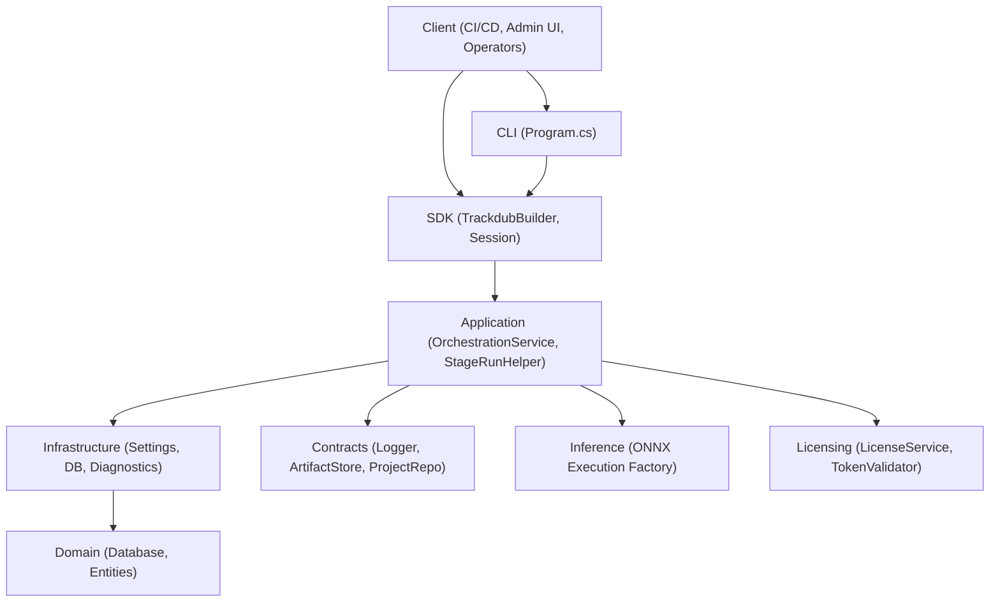

**Diagram sources**
- [src/Trackdub.Cli/Program.cs](file://src/Trackdub.Cli/Program.cs)
- [src/Trackdub.Sdk/TrackdubBuilder.cs](file://src/Trackdub.Sdk/TrackdubBuilder.cs)
- [src/Trackdub.Application/Services/OrchestrationService.cs](file://src/Trackdub.Application/Services/OrchestrationService.cs)
- [src/Trackdub.Application/Pipeline/StageRunHelper.cs](file://src/Trackdub.Application/Pipeline/StageRunHelper.cs)
- [src/Trackdub.Infrastructure/Settings/SettingsService.cs](file://src/Trackdub.Infrastructure/Settings/SettingsService.cs)
- [src/Trackdub.Infrastructure/Database/Migrations/0001_Initial.cs](file://src/Trackdub.Infrastructure/Database/Migrations/0001_Initial.cs)
- [src/Trackdub.Infrastructure/Diagnostics/DiagnosticsBundleExporter.cs](file://src/Trackdub.Infrastructure/Diagnostics/DiagnosticsBundleExporter.cs)
- [src/Trackdub.Contracts/IApplicationLogger.cs](file://src/Trackdub.Contracts/IApplicationLogger.cs)
- [src/Trackdub.Contracts/IArtifactStore.cs](file://src/Trackdub.Contracts/IArtifactStore.cs)
- [src/Trackdub.Contracts/IProjectRepository.cs](file://src/Trackdub.Contracts/IProjectRepository.cs)
- [src/Trackdub.Domain/Database.cs](file://src/Trackdub.Domain/Database.cs)
- [src/Trackdub.Inference.Onnx/OnnxExecutionSessionFactory.cs](file://src/Trackdub.Inference.Onnx/OnnxExecutionSessionFactory.cs)
- [src/Trackdub.Licensing/LicenseService.cs](file://src/Trackdub.Licensing/LicenseService.cs)
- [src/Trackdub.Licensing/LicenseTokenValidator.cs](file://src/Trackdub.Licensing/LicenseTokenValidator.cs)

## Detailed Component Analysis

### CLI and Batch Processing
- Program initialization configures logging and prepares the environment for headless operation.
- Batch command helpers coordinate input discovery, progress reporting, and error handling for large-scale runs.

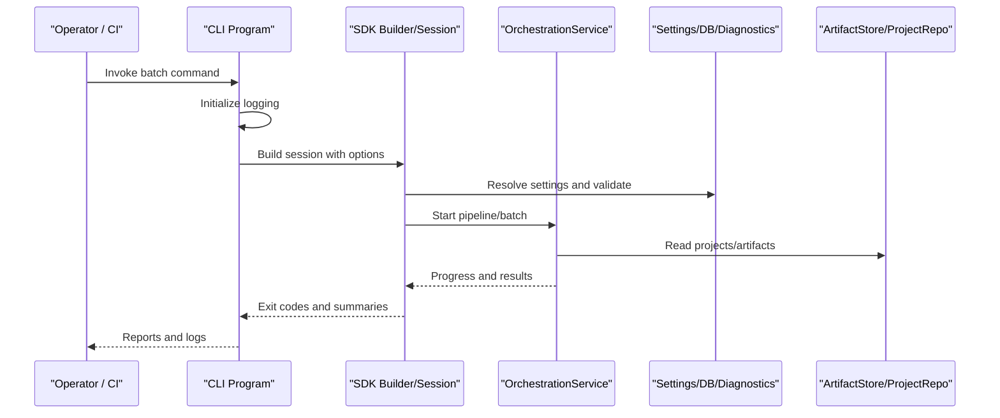

**Diagram sources**
- [src/Trackdub.Cli/Program.cs](file://src/Trackdub.Cli/Program.cs)
- [src/Trackdub.Cli/CliBatchCommandHelpers.cs](file://src/Trackdub.Cli/CliBatchCommandHelpers.cs)
- [src/Trackdub.Sdk/TrackdubBuilder.cs](file://src/Trackdub.Sdk/TrackdubBuilder.cs)
- [src/Trackdub.Sdk/TrackdubSession.cs](file://src/Trackdub.Sdk/TrackdubSession.cs)
- [src/Trackdub.Application/Services/OrchestrationService.cs](file://src/Trackdub.Application/Services/OrchestrationService.cs)
- [src/Trackdub.Infrastructure/Settings/SettingsService.cs](file://src/Trackdub.Infrastructure/Settings/SettingsService.cs)
- [src/Trackdub.Contracts/IArtifactStore.cs](file://src/Trackdub.Contracts/IArtifactStore.cs)
- [src/Trackdub.Contracts/IProjectRepository.cs](file://src/Trackdub.Contracts/IProjectRepository.cs)

**Section sources**
- [src/Trackdub.Cli/Program.cs](file://src/Trackdub.Cli/Program.cs)
- [src/Trackdub.Cli/CliBatchCommandHelpers.cs](file://src/Trackdub.Cli/CliBatchCommandHelpers.cs)

### SDK Builder and Session Lifecycle
- TrackdubBuilder constructs a configured session with options, settings, and runtime providers.
- TrackdubSession manages lifecycle, stage execution, and result aggregation.
- TrackdubConfig centralizes configuration keys and defaults for enterprise policies.

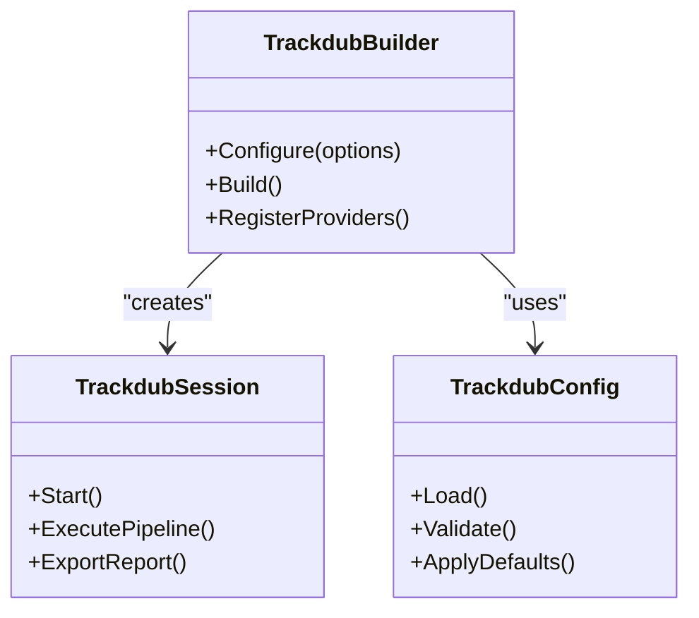

**Diagram sources**
- [src/Trackdub.Sdk/TrackdubBuilder.cs](file://src/Trackdub.Sdk/TrackdubBuilder.cs)
- [src/Trackdub.Sdk/TrackdubSession.cs](file://src/Trackdub.Sdk/TrackdubSession.cs)
- [src/Trackdub.Sdk/TrackdubConfig.cs](file://src/Trackdub.Sdk/TrackdubConfig.cs)

**Section sources**
- [src/Trackdub.Sdk/TrackdubBuilder.cs](file://src/Trackdub.Sdk/TrackdubBuilder.cs)
- [src/Trackdub.Sdk/TrackdubSession.cs](file://src/Trackdub.Sdk/TrackdubSession.cs)
- [src/Trackdub.Sdk/TrackdubConfig.cs](file://src/Trackdub.Sdk/TrackdubConfig.cs)

### Composition Root and Service Wiring
- CompositionRoot registers services, settings, persistence, diagnostics, and inference providers.
- Ensures consistent dependency injection across CLI, SDK, and background workers.

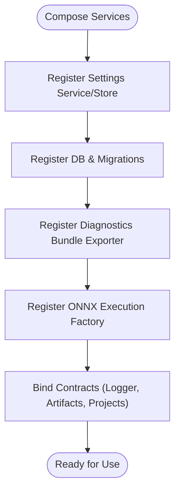

**Diagram sources**
- [src/Trackdub.Composition/CompositionRoot.cs](file://src/Trackdub.Composition/CompositionRoot.cs)
- [src/Trackdub.Infrastructure/Settings/SettingsService.cs](file://src/Trackdub.Infrastructure/Settings/SettingsService.cs)
- [src/Trackdub.Infrastructure/Settings/SettingsStore.cs](file://src/Trackdub.Infrastructure/Settings/SettingsStore.cs)
- [src/Trackdub.Infrastructure/Database/Migrations/0001_Initial.cs](file://src/Trackdub.Infrastructure/Database/Migrations/0001_Initial.cs)
- [src/Trackdub.Infrastructure/Diagnostics/DiagnosticsBundleExporter.cs](file://src/Trackdub.Infrastructure/Diagnostics/DiagnosticsBundleExporter.cs)
- [src/Trackdub.Inference.Onnx/OnnxExecutionSessionFactory.cs](file://src/Trackdub.Inference.Onnx/OnnxExecutionSessionFactory.cs)
- [src/Trackdub.Contracts/IApplicationLogger.cs](file://src/Trackdub.Contracts/IApplicationLogger.cs)
- [src/Trackdub.Contracts/IArtifactStore.cs](file://src/Trackdub.Contracts/IArtifactStore.cs)
- [src/Trackdub.Contracts/IProjectRepository.cs](file://src/Trackdub.Contracts/IProjectRepository.cs)

**Section sources**
- [src/Trackdub.Composition/CompositionRoot.cs](file://src/Trackdub.Composition/CompositionRoot.cs)

### Settings and Configuration Distribution
- SettingsService and SettingsStore provide centralized configuration loading, validation, and defaults.
- Supports environment-driven overrides for enterprise policy enforcement.

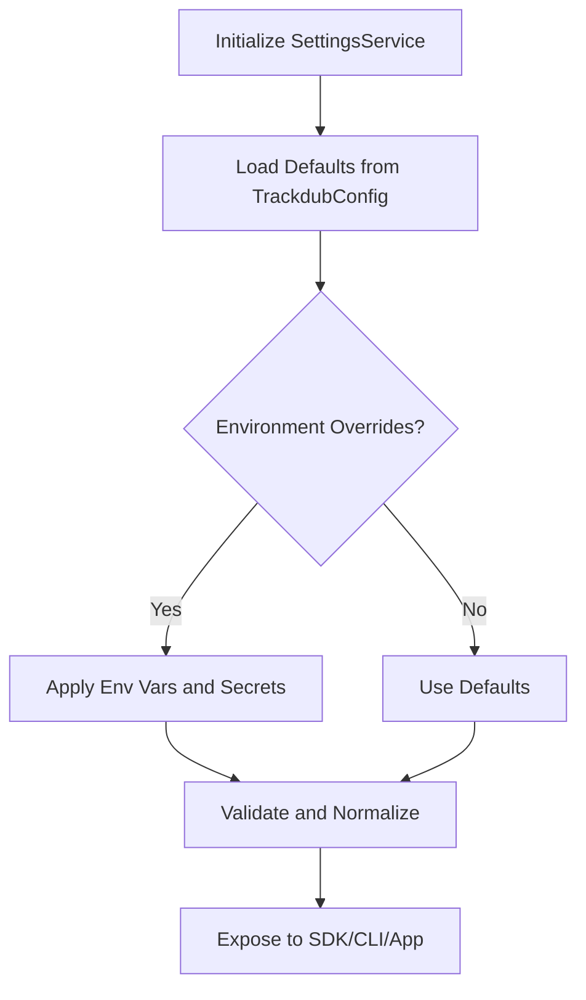

**Diagram sources**
- [src/Trackdub.Infrastructure/Settings/SettingsService.cs](file://src/Trackdub.Infrastructure/Settings/SettingsService.cs)
- [src/Trackdub.Infrastructure/Settings/SettingsStore.cs](file://src/Trackdub.Infrastructure/Settings/SettingsStore.cs)
- [src/Trackdub.Sdk/TrackdubConfig.cs](file://src/Trackdub.Sdk/TrackdubConfig.cs)

**Section sources**
- [src/Trackdub.Infrastructure/Settings/SettingsService.cs](file://src/Trackdub.Infrastructure/Settings/SettingsService.cs)
- [src/Trackdub.Infrastructure/Settings/SettingsStore.cs](file://src/Trackdub.Infrastructure/Settings/SettingsStore.cs)
- [src/Trackdub.Sdk/TrackdubConfig.cs](file://src/Trackdub.Sdk/TrackdubConfig.cs)

### Diagnostics and Logging
- IApplicationLogger abstracts structured logging for telemetry and auditing.
- DiagnosticsBundleExporter aggregates logs, configs, and state for support and compliance.

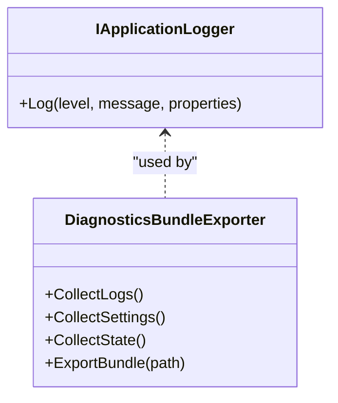

**Diagram sources**
- [src/Trackdub.Contracts/IApplicationLogger.cs](file://src/Trackdub.Contracts/IApplicationLogger.cs)
- [src/Trackdub.Infrastructure/Diagnostics/DiagnosticsBundleExporter.cs](file://src/Trackdub.Infrastructure/Diagnostics/DiagnosticsBundleExporter.cs)

**Section sources**
- [src/Trackdub.Contracts/IApplicationLogger.cs](file://src/Trackdub.Contracts/IApplicationLogger.cs)
- [src/Trackdub.Infrastructure/Diagnostics/DiagnosticsBundleExporter.cs](file://src/Trackdub.Infrastructure/Diagnostics/DiagnosticsBundleExporter.cs)

### Licensing and Policy Enforcement
- LicenseService validates tokens and enforces feature tiers.
- LicenseTokenValidator ensures integrity and expiration checks.

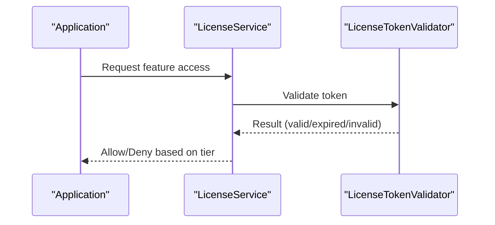

**Diagram sources**
- [src/Trackdub.Licensing/LicenseService.cs](file://src/Trackdub.Licensing/LicenseService.cs)
- [src/Trackdub.Licensing/LicenseTokenValidator.cs](file://src/Trackdub.Licensing/LicenseTokenValidator.cs)

**Section sources**
- [src/Trackdub.Licensing/LicenseService.cs](file://src/Trackdub.Licensing/LicenseService.cs)
- [src/Trackdub.Licensing/LicenseTokenValidator.cs](file://src/Trackdub.Licensing/LicenseTokenValidator.cs)

### Database and Migrations
- Database model defines core entities and relationships.
- Migration scaffolding ensures schema evolution and consistency across deployments.

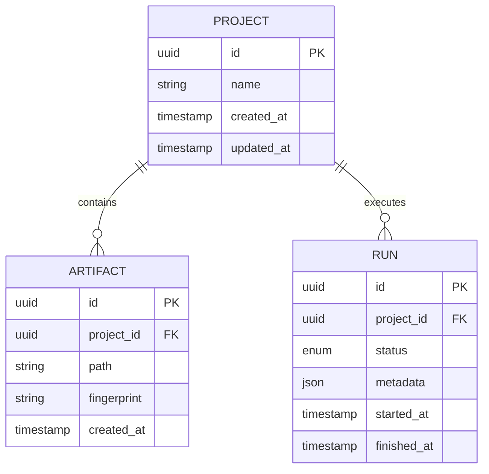

**Diagram sources**
- [src/Trackdub.Domain/Database.cs](file://src/Trackdub.Domain/Database.cs)
- [src/Trackdub.Infrastructure/Database/Migrations/0001_Initial.cs](file://src/Trackdub.Infrastructure/Database/Migrations/0001_Initial.cs)

**Section sources**
- [src/Trackdub.Domain/Database.cs](file://src/Trackdub.Domain/Database.cs)
- [src/Trackdub.Infrastructure/Database/Migrations/0001_Initial.cs](file://src/Trackdub.Infrastructure/Database/Migrations/0001_Initial.cs)

### Inference Runtime Integration
- OnnxExecutionSessionFactory creates execution contexts tailored to hardware and providers.
- Enables scalable GPU/CPU utilization across nodes.

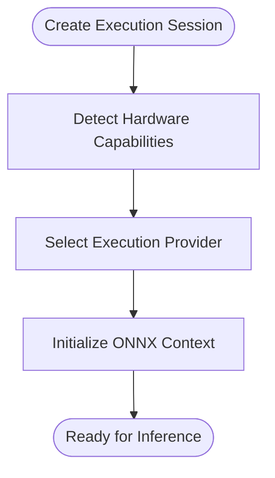

**Diagram sources**
- [src/Trackdub.Inference.Onnx/OnnxExecutionSessionFactory.cs](file://src/Trackdub.Inference.Onnx/OnnxExecutionSessionFactory.cs)

**Section sources**
- [src/Trackdub.Inference.Onnx/OnnxExecutionSessionFactory.cs](file://src/Trackdub.Inference.Onnx/OnnxExecutionSessionFactory.cs)

## Dependency Analysis
Trackdub’s dependencies are organized through .NET solution files, global JSON, and package management configurations:
- Trackdub.slnx coordinates projects and builds.
- global.json pins SDK/runtime versions for deterministic builds.
- Directory.Build.props and Directory.Packages.props centralize common properties and NuGet packages.
- NuGet.config defines package sources and credentials for enterprise feeds.
- mise.toml manages toolchain and scripts for CI and local development.

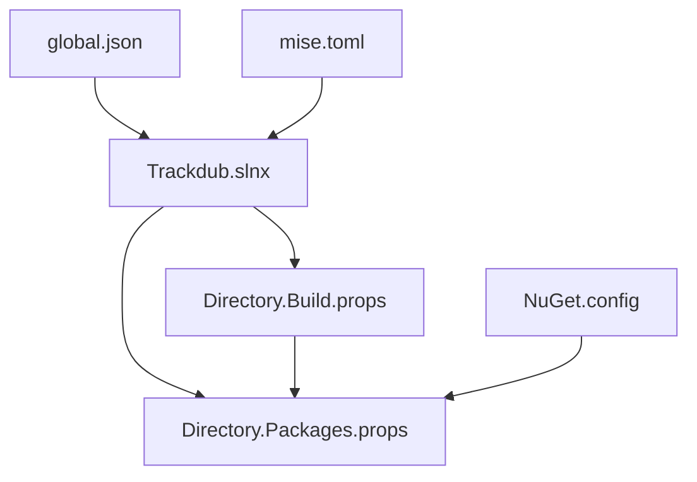

**Diagram sources**
- [Trackdub.slnx](file://Trackdub.slnx)
- [global.json](file://global.json)
- [Directory.Build.props](file://Directory.Build.props)
- [Directory.Packages.props](file://Directory.Packages.props)
- [NuGet.config](file://NuGet.config)
- [mise.toml](file://mise.toml)

**Section sources**
- [Trackdub.slnx](file://Trackdub.slnx)
- [global.json](file://global.json)
- [Directory.Build.props](file://Directory.Build.props)
- [Directory.Packages.props](file://Directory.Packages.props)
- [NuGet.config](file://NuGet.config)
- [mise.toml](file://mise.toml)

## Performance Considerations
- Capacity Planning:
  - Model size and execution provider selection impact memory and throughput; use hardware detection and provider preferences.
  - Scale horizontally by distributing batch jobs across nodes with shared artifact storage.
- Load Balancing:
  - Distribute CLI invocations via job queues; ensure idempotent runs and atomic artifact writes.
- Optimization:
  - Pre-warm inference contexts and cache models per node.
  - Tune concurrency limits for transcription, translation, and TTS stages.
  - Monitor GPU/CPU utilization and adjust batch sizes accordingly.

[No sources needed since this section provides general guidance]

## Troubleshooting Guide
- Logging and Diagnostics:
  - Use structured logs via IApplicationLogger and export diagnostics bundles for analysis.
- Common Issues:
  - Settings misconfiguration: Validate TrackdubConfig and environment overrides.
  - Database schema drift: Apply migrations and verify entity mappings.
  - Licensing failures: Check token validity and expiration.
- Recovery:
  - Restore artifacts and projects from backups; re-run failed stages with idempotency.

**Section sources**
- [src/Trackdub.Contracts/IApplicationLogger.cs](file://src/Trackdub.Contracts/IApplicationLogger.cs)
- [src/Trackdub.Infrastructure/Diagnostics/DiagnosticsBundleExporter.cs](file://src/Trackdub.Infrastructure/Diagnostics/DiagnosticsBundleExporter.cs)
- [src/Trackdub.Infrastructure/Settings/SettingsService.cs](file://src/Trackdub.Infrastructure/Settings/SettingsService.cs)
- [src/Trackdub.Infrastructure/Database/Migrations/0001_Initial.cs](file://src/Trackdub.Infrastructure/Database/Migrations/0001_Initial.cs)
- [src/Trackdub.Licensing/LicenseService.cs](file://src/Trackdub.Licensing/LicenseService.cs)

## Conclusion
Trackdub’s modular architecture, robust SDK/CLI, centralized settings, and strong contracts enable enterprise-scale deployments with centralized management, policy enforcement, and observability. By leveraging the provided patterns and tooling, organizations can implement secure, compliant, and performant installations with automated provisioning, monitoring, and recovery.

[No sources needed since this section summarizes without analyzing specific files]

## Appendices

### Enterprise Identity and Access Control
- Integrate with enterprise identity systems by injecting custom authentication middleware at the CLI/SDK boundary.
- Enforce role-based access control via policy layers that gate feature access and data visibility.
- Use token-based authorization for SSO flows and propagate claims into audit logs.

[No sources needed since this section provides general guidance]

### Monitoring, Alerting, and Log Aggregation
- Emit structured logs and metrics via IApplicationLogger and extend with counters for pipeline stages.
- Aggregate logs centrally and set alerts for errors, latency spikes, and resource exhaustion.
- Export diagnostics bundles automatically on failure for rapid triage.

[No sources needed since this section provides general guidance]

### Backup and Recovery Procedures
- Back up artifact stores and project repositories regularly; include database snapshots.
- Implement versioned backups and retention policies aligned with compliance requirements.
- Test restore procedures periodically to ensure RTO/RPO targets.

[No sources needed since this section provides general guidance]

### High Availability Configurations
- Deploy multiple worker nodes behind a job queue; ensure shared artifact storage and centralized settings.
- Use health checks and readiness gates to route traffic only to healthy instances.
- Configure automatic failover and graceful degradation for inference providers.

[No sources needed since this section provides general guidance]

### Compliance and Security Hardening
- Enforce model license policies and third-party notices consistently across deployments.
- Harden configurations: disable unnecessary features, restrict network egress, and rotate secrets.
- Maintain audit trails for all pipeline runs, license validations, and administrative actions.

**Section sources**
- [docs/legal/MODEL_LICENSE_POLICY.md](file://docs/legal/MODEL_LICENSE_POLICY.md)
- [docs/legal/THIRD_PARTY_NOTICES.md](file://docs/legal/THIRD_PARTY_NOTICES.md)
- [src/Trackdub.Licensing/LicenseService.cs](file://src/Trackdub.Licensing/LicenseService.cs)
- [src/Trackdub.Infrastructure/Diagnostics/DiagnosticsBundleExporter.cs](file://src/Trackdub.Infrastructure/Diagnostics/DiagnosticsBundleExporter.cs)

### Automation and Infrastructure as Code Templates
- Use CLI and SDK for scripted provisioning and batch processing.
- Leverage CI/CD pipelines and tools defined in operations docs for consistent deployments.
- Employ optimization scripts for pre-warming and model preparation.

**Section sources**
- [docs/operations/GITHUB_ACTIONS.md](file://docs/operations/GITHUB_ACTIONS.md)
- [docs/operations/codeql-advanced-setup.md](file://docs/operations/codeql-advanced-setup.md)
- [tools/ci/trackdub-optimize.ps1](file://tools/ci/trackdub-optimize.ps1)
- [tools/ci/trackdub-optimize.sh](file://tools/ci/trackdub-optimize.sh)

### Audit Trail Management
- Capture detailed logs for pipeline stages, license checks, and configuration changes.
- Export diagnostics bundles and retain them per compliance timelines.
- Correlate events across services using unique run IDs and project identifiers.

**Section sources**
- [src/Trackdub.Contracts/IApplicationLogger.cs](file://src/Trackdub.Contracts/IApplicationLogger.cs)
- [src/Trackdub.Infrastructure/Diagnostics/DiagnosticsBundleExporter.cs](file://src/Trackdub.Infrastructure/Diagnostics/DiagnosticsBundleExporter.cs)
- [docs/audits/audit-summary.md](file://docs/audits/audit-summary.md)
- [docs/audits/audits.md](file://docs/audits/audits.md)

### Pipeline Principles and Audits
- Follow documented pipeline principles to ensure reliability, observability, and maintainability.
- Conduct periodic audits to validate compliance and performance baselines.

**Section sources**
- [docs/architecture/pipeline-principles-review-grok-2026-07-08.md](file://docs/architecture/pipeline-principles-review-grok-2026-07-08.md)
- [docs/architecture/P0-pipeline-audit-2026-06-01.md](file://docs/architecture/P0-pipeline-audit-2026-06-01.md)
- [docs/architecture/local-pipeline-audit-unified-2026-07-08.md](file://docs/architecture/local-pipeline-audit-unified-2026-07-08.md)