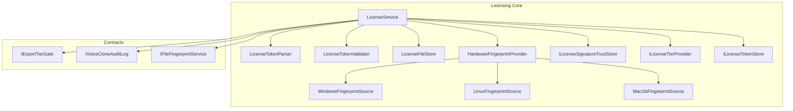
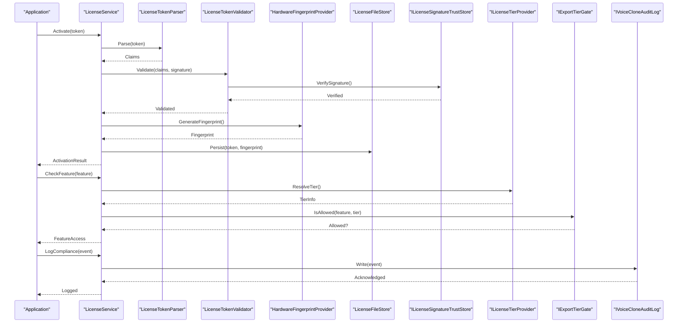
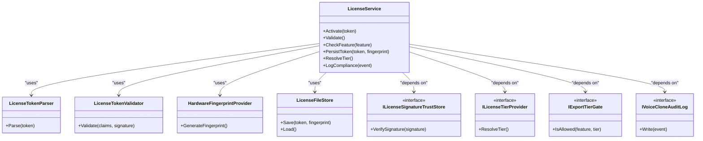
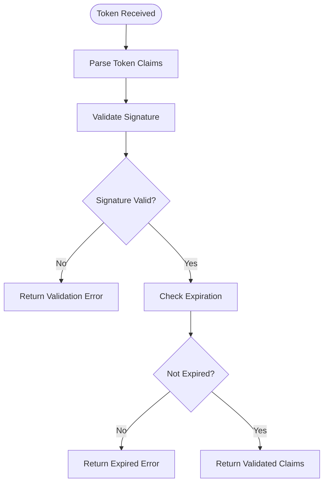
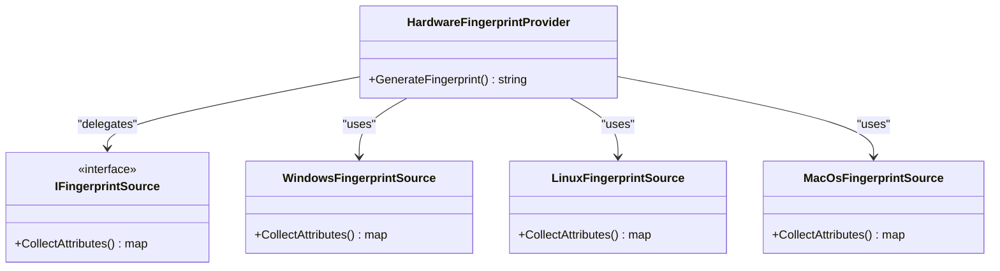
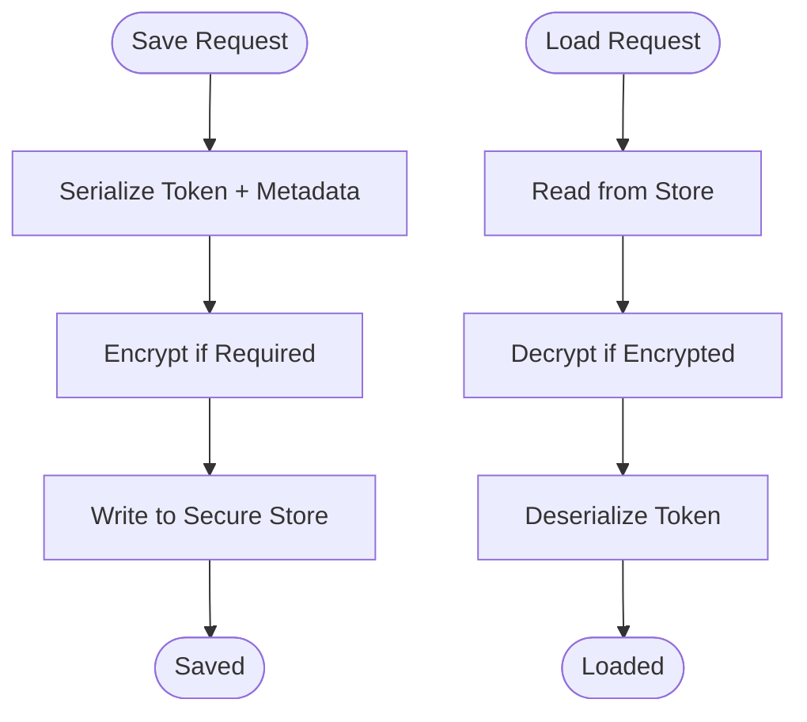
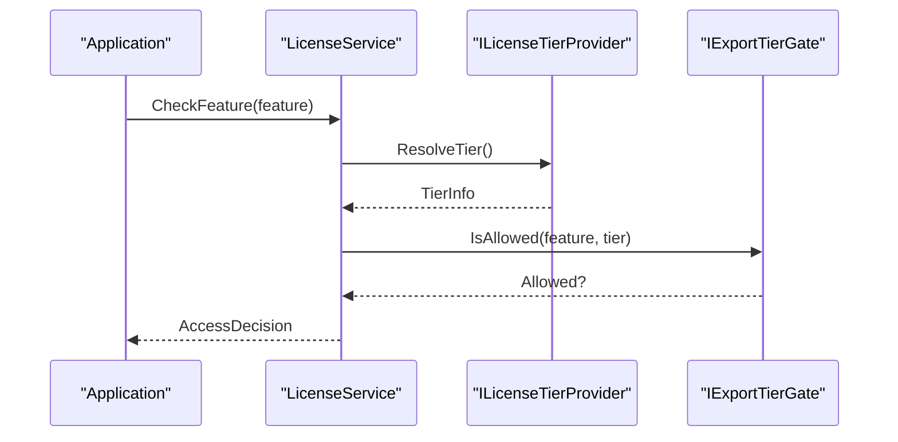
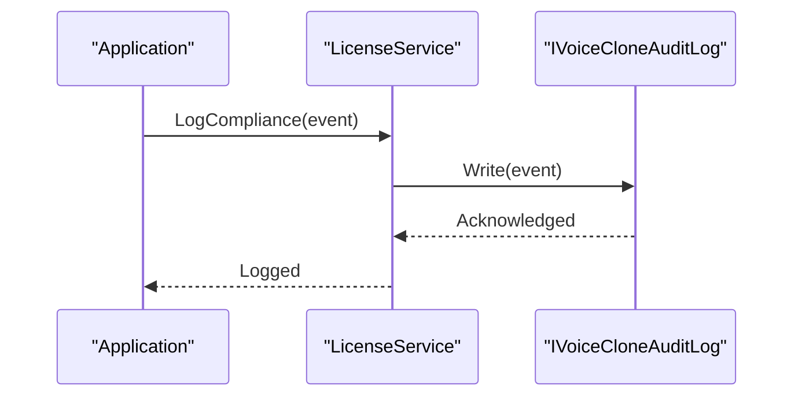
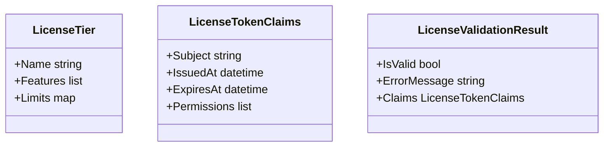
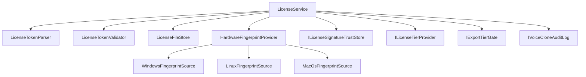

# Licensing & Activation

<cite>
**Referenced Files in This Document**
- [Trackdub.Licensing.csproj](file://src/Trackdub.Licensing/Trackdub.Licensing.csproj)
- [LicenseService.cs](file://src/Trackdub.Licensing/LicenseService.cs)
- [LicenseTokenParser.cs](file://src/Trackdub.Licensing/LicenseTokenParser.cs)
- [LicenseTokenValidator.cs](file://src/Trackdub.Licensing/LicenseTokenValidator.cs)
- [LicenseFileStore.cs](file://src/Trackdub.Licensing/LicenseFileStore.cs)
- [HardwareFingerprintProvider.cs](file://src/Trackdub.Licensing/HardwareFingerprintProvider.cs)
- [WindowsFingerprintSource.cs](file://src/Trackdub.Licensing/WindowsFingerprintSource.cs)
- [LinuxFingerprintSource.cs](file://src/Trackdub.Licensing/LinuxFingerprintSource.cs)
- [MacOsFingerprintSource.cs](file://src/Trackdub.Licensing/MacOsFingerprintSource.cs)
- [IFingerprintSource.cs](file://src/Trackdub.Licensing/IFingerprintSource.cs)
- [IHardwareFingerprintProvider.cs](file://src/Trackdub.Licensing/IHardwareFingerprintProvider.cs)
- [ILicenseSignatureTrustStore.cs](file://src/Trackdub.Licensing/ILicenseSignatureTrustStore.cs)
- [ILicenseTierProvider.cs](file://src/Trackdub.Licensing/ILicenseTierProvider.cs)
- [ILicenseTokenStore.cs](file://src/Trackdub.Licensing/ILicenseTokenStore.cs)
- [LicenseTier.cs](file://src/Trackdub.Licensing/LicenseTier.cs)
- [LicenseTokenClaims.cs](file://src/Trackdub.Licensing/LicenseTokenClaims.cs)
- [LicenseValidationResult.cs](file://src/Trackdub.Licensing/LicenseValidationResult.cs)
- [FingerprintException.cs](file://src/Trackdub.Licensing/FingerprintException.cs)
- [IExportTierGate.cs](file://src/Trackdub.Contracts/IExportTierGate.cs)
- [IVoiceCloneAuditLog.cs](file://src/Trackdub.Contracts/IVoiceCloneAuditLog.cs)
- [IFileFingerprintService.cs](file://src/Trackdub.Contracts/IFileFingerprintService.cs)
</cite>

## Table of Contents
1. [Introduction](#introduction)
2. [Project Structure](#project-structure)
3. [Core Components](#core-components)
4. [Architecture Overview](#architecture-overview)
5. [Detailed Component Analysis](#detailed-component-analysis)
6. [Dependency Analysis](#dependency-analysis)
7. [Performance Considerations](#performance-considerations)
8. [Troubleshooting Guide](#troubleshooting-guide)
9. [Conclusion](#conclusion)
10. [Appendices](#appendices)

## Introduction
This document explains how licensing and activation are implemented and managed in Trackdub deployments. It covers the license model architecture, token-based authentication, hardware fingerprinting, activation workflows (online and offline), tier management, feature gating, compliance enforcement, enterprise integration patterns, centralized license management, audit logging, validation and renewal processes, and troubleshooting guidance. The goal is to enable operators and integrators to deploy, configure, and maintain a robust licensing system that scales across environments while preserving security and compliance.

## Project Structure
The licensing subsystem is primarily implemented in the Trackdub.Licensing project and integrates with contracts defined in Trackdub.Contracts. Key responsibilities include:
- License token parsing and validation
- Hardware fingerprint generation and provider abstraction
- License storage and retrieval
- Tier resolution and feature gating hooks
- Audit logging interfaces for compliance

**Diagram sources**
- [LicenseService.cs](file://src/Trackdub.Licensing/LicenseService.cs)
- [LicenseTokenParser.cs](file://src/Trackdub.Licensing/LicenseTokenParser.cs)
- [LicenseTokenValidator.cs](file://src/Trackdub.Licensing/LicenseTokenValidator.cs)
- [LicenseFileStore.cs](file://src/Trackdub.Licensing/LicenseFileStore.cs)
- [HardwareFingerprintProvider.cs](file://src/Trackdub.Licensing/HardwareFingerprintProvider.cs)
- [WindowsFingerprintSource.cs](file://src/Trackdub.Licensing/WindowsFingerprintSource.cs)
- [LinuxFingerprintSource.cs](file://src/Trackdub.Licensing/LinuxFingerprintSource.cs)
- [MacOsFingerprintSource.cs](file://src/Trackdub.Licensing/MacOsFingerprintSource.cs)
- [ILicenseSignatureTrustStore.cs](file://src/Trackdub.Licensing/ILicenseSignatureTrustStore.cs)
- [ILicenseTierProvider.cs](file://src/Trackdub.Licensing/ILicenseTierProvider.cs)
- [ILicenseTokenStore.cs](file://src/Trackdub.Licensing/ILicenseTokenStore.cs)
- [IExportTierGate.cs](file://src/Trackdub.Contracts/IExportTierGate.cs)
- [IVoiceCloneAuditLog.cs](file://src/Trackdub.Contracts/IVoiceCloneAuditLog.cs)
- [IFileFingerprintService.cs](file://src/Trackdub.Contracts/IFileFingerprintService.cs)

**Section sources**
- [Trackdub.Licensing.csproj](file://src/Trackdub.Licensing/Trackdub.Licensing.csproj)

## Core Components
- LicenseService: Orchestrates license operations including validation, activation, and tier checks. It coordinates token parsing, signature trust verification, hardware fingerprinting, and persistence.
- LicenseTokenParser: Extracts claims from license tokens and maps them into structured representations.
- LicenseTokenValidator: Validates token signatures, expiration, and integrity using the trust store.
- LicenseFileStore: Persists license tokens and related metadata securely.
- HardwareFingerprintProvider: Generates stable device identifiers by delegating to platform-specific sources.
- Platform Fingerprint Sources: WindowsFingerprintSource, LinuxFingerprintSource, MacOsFingerprintSource implement IFingerprintSource to gather OS-specific hardware attributes.
- Interfaces:
  - ILicenseSignatureTrustStore: Provides cryptographic trust anchors for validating license signatures.
  - ILicenseTierProvider: Supplies tier information and entitlements for features.
  - ILicenseTokenStore: Abstraction over license token persistence.
  - IExportTierGate: Gate used by export flows to enforce tier restrictions.
  - IVoiceCloneAuditLog: Records voice cloning events for compliance.
  - IFileFingerprintService: Computes file fingerprints for audit or matching purposes.

**Section sources**
- [LicenseService.cs](file://src/Trackdub.Licensing/LicenseService.cs)
- [LicenseTokenParser.cs](file://src/Trackdub.Licensing/LicenseTokenParser.cs)
- [LicenseTokenValidator.cs](file://src/Trackdub.Licensing/LicenseTokenValidator.cs)
- [LicenseFileStore.cs](file://src/Trackdub.Licensing/LicenseFileStore.cs)
- [HardwareFingerprintProvider.cs](file://src/Trackdub.Licensing/HardwareFingerprintProvider.cs)
- [WindowsFingerprintSource.cs](file://src/Trackdub.Licensing/WindowsFingerprintSource.cs)
- [LinuxFingerprintSource.cs](file://src/Trackdub.Licensing/LinuxFingerprintSource.cs)
- [MacOsFingerprintSource.cs](file://src/Trackdub.Licensing/MacOsFingerprintSource.cs)
- [ILicenseSignatureTrustStore.cs](file://src/Trackdub.Licensing/ILicenseSignatureTrustStore.cs)
- [ILicenseTierProvider.cs](file://src/Trackdub.Licensing/ILicenseTierProvider.cs)
- [ILicenseTokenStore.cs](file://src/Trackdub.Licensing/ILicenseTokenStore.cs)
- [IExportTierGate.cs](file://src/Trackdub.Contracts/IExportTierGate.cs)
- [IVoiceCloneAuditLog.cs](file://src/Trackdub.Contracts/IVoiceCloneAuditLog.cs)
- [IFileFingerprintService.cs](file://src/Trackdub.Contracts/IFileFingerprintService.cs)

## Architecture Overview
The licensing architecture follows a layered approach:
- Token Layer: Parses and validates license tokens, ensuring cryptographic integrity and correct claims.
- Fingerprint Layer: Produces stable hardware identifiers per platform to bind licenses to devices.
- Persistence Layer: Stores tokens and metadata securely.
- Policy Layer: Enforces tier-based feature access via gates and providers.
- Compliance Layer: Emits audit logs for sensitive operations.

**Diagram sources**
- [LicenseService.cs](file://src/Trackdub.Licensing/LicenseService.cs)
- [LicenseTokenParser.cs](file://src/Trackdub.Licensing/LicenseTokenParser.cs)
- [LicenseTokenValidator.cs](file://src/Trackdub.Licensing/LicenseTokenValidator.cs)
- [HardwareFingerprintProvider.cs](file://src/Trackdub.Licensing/HardwareFingerprintProvider.cs)
- [LicenseFileStore.cs](file://src/Trackdub.Licensing/LicenseFileStore.cs)
- [ILicenseSignatureTrustStore.cs](file://src/Trackdub.Licensing/ILicenseSignatureTrustStore.cs)
- [ILicenseTierProvider.cs](file://src/Trackdub.Licensing/ILicenseTierProvider.cs)
- [IExportTierGate.cs](file://src/Trackdub.Contracts/IExportTierGate.cs)
- [IVoiceCloneAuditLog.cs](file://src/Trackdub.Contracts/IVoiceCloneAuditLog.cs)

## Detailed Component Analysis

### License Service Orchestration
LicenseService coordinates activation, validation, and feature checks. It composes token parsing, signature verification, hardware fingerprinting, and persistence. It also integrates with tier providers and export gates to enforce policy.

**Diagram sources**
- [LicenseService.cs](file://src/Trackdub.Licensing/LicenseService.cs)
- [LicenseTokenParser.cs](file://src/Trackdub.Licensing/LicenseTokenParser.cs)
- [LicenseTokenValidator.cs](file://src/Trackdub.Licensing/LicenseTokenValidator.cs)
- [HardwareFingerprintProvider.cs](file://src/Trackdub.Licensing/HardwareFingerprintProvider.cs)
- [LicenseFileStore.cs](file://src/Trackdub.Licensing/LicenseFileStore.cs)
- [ILicenseSignatureTrustStore.cs](file://src/Trackdub.Licensing/ILicenseSignatureTrustStore.cs)
- [ILicenseTierProvider.cs](file://src/Trackdub.Licensing/ILicenseTierProvider.cs)
- [IExportTierGate.cs](file://src/Trackdub.Contracts/IExportTierGate.cs)
- [IVoiceCloneAuditLog.cs](file://src/Trackdub.Contracts/IVoiceCloneAuditLog.cs)

**Section sources**
- [LicenseService.cs](file://src/Trackdub.Licensing/LicenseService.cs)

### Token Parsing and Validation
LicenseTokenParser extracts claims from tokens, while LicenseTokenValidator ensures signatures are valid and tokens are not expired or tampered with. The trust store provides cryptographic anchors.

**Diagram sources**
- [LicenseTokenParser.cs](file://src/Trackdub.Licensing/LicenseTokenParser.cs)
- [LicenseTokenValidator.cs](file://src/Trackdub.Licensing/LicenseTokenValidator.cs)
- [ILicenseSignatureTrustStore.cs](file://src/Trackdub.Licensing/ILicenseSignatureTrustStore.cs)

**Section sources**
- [LicenseTokenParser.cs](file://src/Trackdub.Licensing/LicenseTokenParser.cs)
- [LicenseTokenValidator.cs](file://src/Trackdub.Licensing/LicenseTokenValidator.cs)

### Hardware Fingerprinting
HardwareFingerprintProvider abstracts platform-specific fingerprint generation. Each OS source implements IFingerprintSource to collect stable identifiers.

**Diagram sources**
- [HardwareFingerprintProvider.cs](file://src/Trackdub.Licensing/HardwareFingerprintProvider.cs)
- [IFingerprintSource.cs](file://src/Trackdub.Licensing/IFingerprintSource.cs)
- [WindowsFingerprintSource.cs](file://src/Trackdub.Licensing/WindowsFingerprintSource.cs)
- [LinuxFingerprintSource.cs](file://src/Trackdub.Licensing/LinuxFingerprintSource.cs)
- [MacOsFingerprintSource.cs](file://src/Trackdub.Licensing/MacOsFingerprintSource.cs)

**Section sources**
- [HardwareFingerprintProvider.cs](file://src/Trackdub.Licensing/HardwareFingerprintProvider.cs)
- [WindowsFingerprintSource.cs](file://src/Trackdub.Licensing/WindowsFingerprintSource.cs)
- [LinuxFingerprintSource.cs](file://src/Trackdub.Licensing/LinuxFingerprintSource.cs)
- [MacOsFingerprintSource.cs](file://src/Trackdub.Licensing/MacOsFingerprintSource.cs)

### License Storage and Retrieval
LicenseFileStore persists tokens and associated metadata. It should ensure secure storage and provide methods to save and load tokens alongside fingerprint bindings.

**Diagram sources**
- [LicenseFileStore.cs](file://src/Trackdub.Licensing/LicenseFileStore.cs)

**Section sources**
- [LicenseFileStore.cs](file://src/Trackdub.Licensing/LicenseFileStore.cs)

### Tier Management and Feature Gating
ILicenseTierProvider supplies tier information, while IExportTierGate enforces feature access based on tiers. LicenseService uses these to gate features like exports or advanced capabilities.

**Diagram sources**
- [ILicenseTierProvider.cs](file://src/Trackdub.Licensing/ILicenseTierProvider.cs)
- [IExportTierGate.cs](file://src/Trackdub.Contracts/IExportTierGate.cs)
- [LicenseService.cs](file://src/Trackdub.Licensing/LicenseService.cs)

**Section sources**
- [ILicenseTierProvider.cs](file://src/Trackdub.Licensing/ILicenseTierProvider.cs)
- [IExportTierGate.cs](file://src/Trackdub.Contracts/IExportTierGate.cs)

### Compliance and Audit Logging
IVoiceCloneAuditLog records sensitive operations such as voice cloning events. LicenseService can emit compliance events through this interface to maintain an audit trail.

**Diagram sources**
- [IVoiceCloneAuditLog.cs](file://src/Trackdub.Contracts/IVoiceCloneAuditLog.cs)
- [LicenseService.cs](file://src/Trackdub.Licensing/LicenseService.cs)

**Section sources**
- [IVoiceCloneAuditLog.cs](file://src/Trackdub.Contracts/IVoiceCloneAuditLog.cs)

### Data Models
LicenseTier defines tier categories; LicenseTokenClaims represents parsed token data; LicenseValidationResult encapsulates validation outcomes.

**Diagram sources**
- [LicenseTier.cs](file://src/Trackdub.Licensing/LicenseTier.cs)
- [LicenseTokenClaims.cs](file://src/Trackdub.Licensing/LicenseTokenClaims.cs)
- [LicenseValidationResult.cs](file://src/Trackdub.Licensing/LicenseValidationResult.cs)

**Section sources**
- [LicenseTier.cs](file://src/Trackdub.Licensing/LicenseTier.cs)
- [LicenseTokenClaims.cs](file://src/Trackdub.Licensing/LicenseTokenClaims.cs)
- [LicenseValidationResult.cs](file://src/Trackdub.Licensing/LicenseValidationResult.cs)

## Dependency Analysis
The licensing module depends on contracts for cross-cutting concerns like tier gating and audit logging. Internal dependencies include token parsing, validation, fingerprinting, and storage. External dependencies may include cryptographic libraries for signature verification and OS APIs for hardware attributes.

**Diagram sources**
- [LicenseService.cs](file://src/Trackdub.Licensing/LicenseService.cs)
- [LicenseTokenParser.cs](file://src/Trackdub.Licensing/LicenseTokenParser.cs)
- [LicenseTokenValidator.cs](file://src/Trackdub.Licensing/LicenseTokenValidator.cs)
- [LicenseFileStore.cs](file://src/Trackdub.Licensing/LicenseFileStore.cs)
- [HardwareFingerprintProvider.cs](file://src/Trackdub.Licensing/HardwareFingerprintProvider.cs)
- [WindowsFingerprintSource.cs](file://src/Trackdub.Licensing/WindowsFingerprintSource.cs)
- [LinuxFingerprintSource.cs](file://src/Trackdub.Licensing/LinuxFingerprintSource.cs)
- [MacOsFingerprintSource.cs](file://src/Trackdub.Licensing/MacOsFingerprintSource.cs)
- [ILicenseSignatureTrustStore.cs](file://src/Trackdub.Licensing/ILicenseSignatureTrustStore.cs)
- [ILicenseTierProvider.cs](file://src/Trackdub.Licensing/ILicenseTierProvider.cs)
- [IExportTierGate.cs](file://src/Trackdub.Contracts/IExportTierGate.cs)
- [IVoiceCloneAuditLog.cs](file://src/Trackdub.Contracts/IVoiceCloneAuditLog.cs)

**Section sources**
- [Trackdub.Licensing.csproj](file://src/Trackdub.Licensing/Trackdub.Licensing.csproj)

## Performance Considerations
- Token parsing and validation should be cached where appropriate to avoid repeated cryptographic operations.
- Hardware fingerprint generation must be efficient and resilient to transient OS API failures.
- License storage operations should batch writes and minimize disk I/O during high-frequency calls.
- Tier resolution and feature gating should use lightweight lookups to prevent bottlenecks in hot paths.
- Audit logging should be asynchronous to avoid blocking critical workflows.

[No sources needed since this section provides general guidance]

## Troubleshooting Guide
Common issues and resolutions:
- Invalid signature errors: Ensure the trust store contains the correct public keys and certificates. Verify token integrity and issuer identity.
- Expired tokens: Implement renewal workflows and check expiration before feature access. Provide user prompts for reactivation.
- Fingerprint mismatches: Confirm platform-specific sources return consistent attributes. Handle edge cases like VM migrations or hardware changes.
- Storage failures: Validate secure storage permissions and encryption keys. Implement fallback mechanisms and error reporting.
- Tier gating denials: Review tier definitions and feature mappings. Ensure tier provider returns accurate entitlements.
- Audit log gaps: Verify audit logging is enabled and configured. Check for async write failures and retry policies.

Relevant exceptions and diagnostics:
- FingerprintException indicates issues during hardware attribute collection or normalization.

**Section sources**
- [FingerprintException.cs](file://src/Trackdub.Licensing/FingerprintException.cs)

## Conclusion
Trackdub’s licensing subsystem provides a modular, extensible framework for token-based authentication, hardware-bound activation, tiered feature gating, and compliance auditing. By leveraging well-defined interfaces and clear separation of concerns, it supports enterprise-grade deployments with centralized management, robust validation, and comprehensive audit trails. Operators can integrate custom providers for trust stores, tier resolution, and audit logging to align with organizational policies and existing systems.

[No sources needed since this section summarizes without analyzing specific files]

## Appendices

### License Server Setup and Activation Workflows
- Online activation: Application sends token to license server, which verifies signature and binds to hardware fingerprint. Result stored locally for subsequent validations.
- Offline activation: Operator obtains an offline activation code, applies it locally, and validates against embedded trust anchors. Fingerprint binding occurs without network calls.

[No sources needed since this section provides conceptual guidance]

### Enterprise Integration Patterns
- Centralized license management: Integrate with enterprise identity providers and license servers via ILicenseSignatureTrustStore and ILicenseTierProvider.
- Audit consolidation: Route IVoiceCloneAuditLog events to centralized logging systems for compliance reporting.
- Custom fingerprint sources: Implement IFingerprintSource for specialized hardware environments or virtualized platforms.

[No sources needed since this section provides conceptual guidance]

### Examples of Custom Providers
- Custom trust store: Implement ILicenseSignatureTrustStore to integrate with corporate PKI or key management services.
- Custom tier provider: Implement ILicenseTierProvider to fetch entitlements from enterprise subscription systems.
- Custom audit logger: Implement IVoiceCloneAuditLog to forward events to SIEM or compliance databases.

[No sources needed since this section provides conceptual guidance]