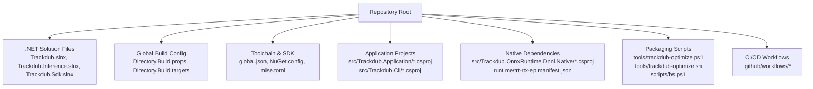
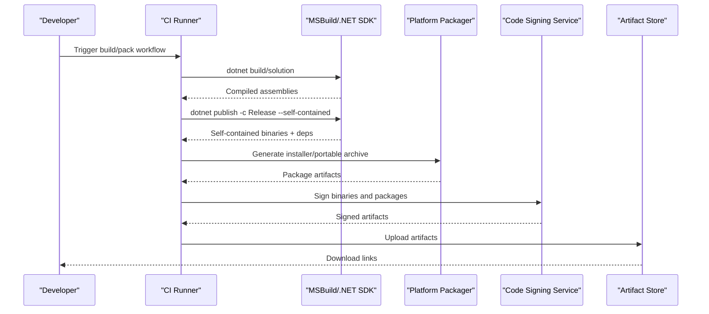
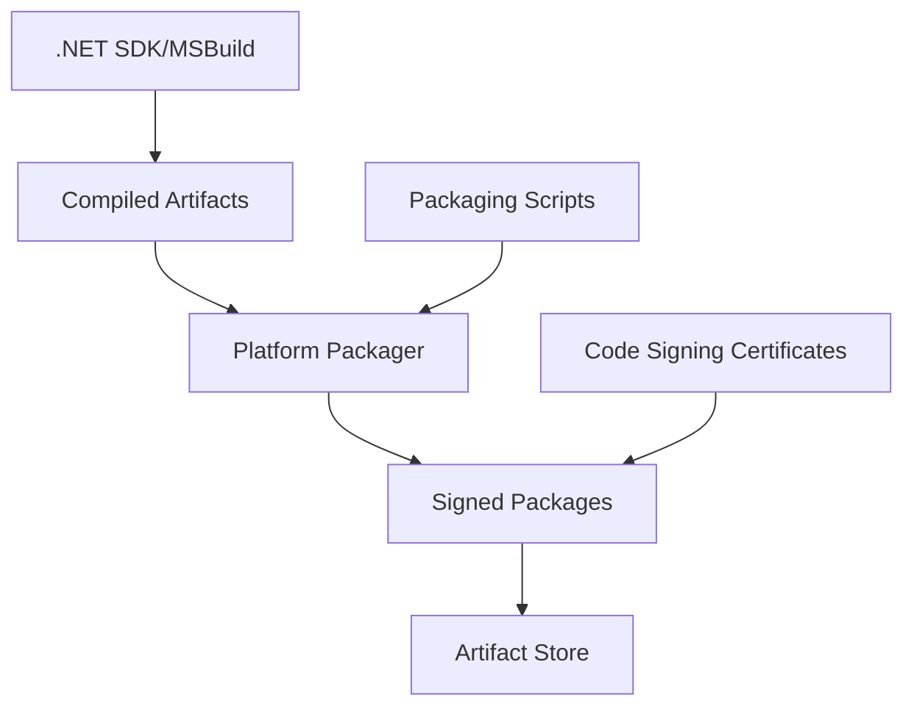

# Platform Packaging

<cite>
**Referenced Files in This Document**
- [README.md](file://README.md)
- [Directory.Build.props](file://Directory.Build.props)
- [Directory.Build.targets](file://Directory.Build.targets)
- [global.json](file://global.json)
- [Trackdub.slnx](file://Trackdub.slnx)
- [Trackdub.Inference.slnx](file://Trackdub.Inference.slnx)
- [Trackdub.Sdk.slnx](file://Trackdub.Sdk.slnx)
- [NuGet.config](file://NuGet.config)
- [mise.toml](file://mise.toml)
- [CONTRIBUTING.md](file://CONTRIBUTING.md)
- [REVIEW.md](file://REVIEW.md)
- [AGENTS.md](file://AGENTS.md)
- [scripts/bs.ps1](file://scripts/bs.ps1)
- [tools/ci/*](file://tools/ci/)
- [tools/dev/*](file://tools/dev/)
- [tools/trackdub-optimize.ps1](file://tools/trackdub-optimize.ps1)
- [tools/trackdub-optimize.sh](file://tools/trackdub-optimize.sh)
- [src/Trackdub.Application/Trackdub.Application.csproj](file://src/Trackdub.Application/Trackdub.Application.csproj)
- [src/Trackdub.Cli/Trackdub.Cli.csproj](file://src/Trackdub.Cli/Trackdub.Cli.csproj)
- [src/Trackdub.Media.Playback/Trackdub.Media.Playback.csproj](file://src/Trackdub.Media.Playback/Trackdub.Media.Playback.csproj)
- [src/Trackdub.OnnxRuntime.Dnnl.Native/Trackdub.OnnxRuntime.Dnnl.Native.csproj](file://src/Trackdub.OnnxRuntime.Dnnl.Native/Trackdub.OnnxRuntime.Dnnl.Native.csproj)
- [src/Trackdub.Licensing/MacOsFingerprintSource.cs](file://src/Trackdub.Licensing/MacOsFingerprintSource.cs)
- [src/Trackdub.Licensing/LinuxFingerprintSource.cs](file://src/Trackdub.Licensing/LinuxFingerprintSource.cs)
- [src/Trackdub.Licensing/WindowsFingerprintSource.cs](file://src/Trackdub.Licensing/WindowsFingerprintSource.cs)
- [runtime/trt-rtx-ep.manifest.json](file://runtime/trt-rtx-ep.manifest.json)
- [.github/workflows/*](file://.github/workflows/)
- [docs/operations/macos-deployment-notes.md](file://docs/operations/macos-deployment-notes.md)
- [docs/development/TROUBLESHOOTING.md](file://docs/development/TROUBLESHOOTING.md)
</cite>

## Table of Contents
1. [Introduction](#introduction)
2. [Project Structure](#project-structure)
3. [Core Components](#core-components)
4. [Architecture Overview](#architecture-overview)
5. [Detailed Component Analysis](#detailed-component-analysis)
6. [Dependency Analysis](#dependency-analysis)
7. [Performance Considerations](#performance-considerations)
8. [Troubleshooting Guide](#troubleshooting-guide)
9. [Conclusion](#conclusion)
10. [Appendices](#appendices)

## Introduction
This document provides comprehensive guidance for packaging Trackdub applications across Windows, macOS, and Linux using the .NET SDK and MSBuild. It covers standalone executable creation, installer generation, portable distribution formats, platform-specific considerations (native dependencies, runtime requirements, file system paths), code signing procedures, digital certificates, security validation, automated packaging scripts, CI/CD integration, version management strategies, and troubleshooting common packaging issues and cross-platform compatibility problems.

## Project Structure
The repository is a multi-project .NET solution with shared build properties and targets that centralize configuration. The top-level files define global settings, toolchain versions, and package sources, while per-project .csproj files define application entry points and native dependencies. Build orchestration is supported by PowerShell and shell scripts under tools and scripts directories, and CI workflows are defined under .github/workflows.

**Diagram sources**
- [Trackdub.slnx:1-20](file://Trackdub.slnx#L1-L20)
- [Directory.Build.props:1-50](file://Directory.Build.props#L1-L50)
- [global.json:1-20](file://global.json#L1-L20)
- [NuGet.config:1-20](file://NuGet.config#L1-L20)
- [tools/trackdub-optimize.ps1:1-50](file://tools/trackdub-optimize.ps1#L1-L50)
- [tools/trackdub-optimize.sh:1-50](file://tools/trackdub-optimize.sh#L1-L50)
- [runtime/trt-rtx-ep.manifest.json:1-50](file://runtime/trt-rtx-ep.manifest.json#L1-L50)

**Section sources**
- [README.md:1-100](file://README.md#L1-L100)
- [CONTRIBUTING.md:1-100](file://CONTRIBUTING.md#L1-L100)
- [REVIEW.md:1-100](file://REVIEW.md#L1-L100)
- [AGENTS.md:1-100](file://AGENTS.md#L1-L100)

## Core Components
- Global build configuration: Centralized MSBuild props/targets ensure consistent output, framework references, and packaging behavior across projects.
- Application projects: Entry points for UI and CLI apps, each with their own project file defining outputs and dependencies.
- Native dependency packages: Projects encapsulate native libraries and manifests required at runtime.
- Packaging scripts: Cross-platform scripts to optimize artifacts and prepare distributions.
- CI/CD workflows: Automated builds and packaging triggered on events.

Key responsibilities:
- Define target frameworks and publish modes for standalone executables.
- Include native dependencies and runtime manifests.
- Generate installers or portable archives.
- Enforce versioning and signing policies.

**Section sources**
- [Directory.Build.props:1-120](file://Directory.Build.props#L1-L120)
- [Directory.Build.targets:1-120](file://Directory.Build.targets#L1-L120)
- [src/Trackdub.Application/Trackdub.Application.csproj:1-120](file://src/Trackdub.Application/Trackdub.Application.csproj#L1-L120)
- [src/Trackdub.Cli/Trackdub.Cli.csproj:1-120](file://src/Trackdub.Cli/Trackdub.Cli.csproj#L1-L120)
- [src/Trackdub.OnnxRuntime.Dnnl.Native/Trackdub.OnnxRuntime.Dnnl.Native.csproj:1-120](file://src/Trackdub.OnnxRuntime.Dnnl.Native/Trackdub.OnnxRuntime.Dnnl.Native.csproj#L1-L120)
- [tools/trackdub-optimize.ps1:1-120](file://tools/trackdub-optimize.ps1#L1-L120)
- [tools/trackdub-optimize.sh:1-120](file://tools/trackdub-optimize.sh#L1-L120)

## Architecture Overview
The packaging pipeline integrates .NET SDK publishing with MSBuild configurations and platform-specific packaging tools. The flow includes building the solution, publishing self-contained executables, bundling native dependencies, generating installers/portable archives, and signing artifacts.

**Diagram sources**
- [Trackdub.slnx:1-20](file://Trackdub.slnx#L1-L20)
- [Directory.Build.props:1-120](file://Directory.Build.props#L1-L120)
- [tools/trackdub-optimize.ps1:1-120](file://tools/trackdub-optimize.ps1#L1-L120)
- [tools/trackdub-optimize.sh:1-120](file://tools/trackdub-optimize.sh#L1-L120)
- [.github/workflows/*:1-200](file://.github/workflows/*#L1-L200)

## Detailed Component Analysis

### Build Configuration and MSBuild Targets
Centralized MSBuild props and targets enforce consistent build behavior, including target frameworks, output types, and packaging flags. These files are referenced by all projects to ensure uniformity.

- Key aspects:
  - Target frameworks selection per platform.
  - Publish mode configuration for standalone executables.
  - Inclusion of native assets and runtime manifests.
  - Versioning metadata propagation.

**Section sources**
- [Directory.Build.props:1-120](file://Directory.Build.props#L1-L120)
- [Directory.Build.targets:1-120](file://Directory.Build.targets#L1-L120)

### Application Projects and Outputs
Each application project defines its entry point and dependencies. For example:
- Trackdub.Application: Main UI application.
- Trackdub.Cli: Command-line interface.
- Trackdub.Media.Playback: Playback backends with native dependencies.

Publishing these projects produces self-contained executables when configured appropriately.

**Section sources**
- [src/Trackdub.Application/Trackdub.Application.csproj:1-120](file://src/Trackdub.Application/Trackdub.Application.csproj#L1-L120)
- [src/Trackdub.Cli/Trackdub.Cli.csproj:1-120](file://src/Trackdub.Cli/Trackdub.Cli.csproj#L1-L120)
- [src/Trackdub.Media.Playback/Trackdub.Media.Playback.csproj:1-120](file://src/Trackdub.Media.Playback/Trackdub.Media.Playback.csproj#L1-L120)

### Native Dependencies and Runtime Manifests
Native libraries are packaged via dedicated projects and manifests. For example:
- OnnxRuntime DNNL native package.
- TensorRT RTX execution provider manifest.

These ensure correct deployment of native components alongside managed code.

**Section sources**
- [src/Trackdub.OnnxRuntime.Dnnl.Native/Trackdub.OnnxRuntime.Dnnl.Native.csproj:1-120](file://src/Trackdub.OnnxRuntime.Dnnl.Native/Trackdub.OnnxRuntime.Dnnl.Native.csproj#L1-L120)
- [runtime/trt-rtx-ep.manifest.json:1-120](file://runtime/trt-rtx-ep.manifest.json#L1-L120)

### Code Signing and Security Validation
Signing ensures authenticity and integrity. Use platform-appropriate tools:
- Windows: signtool with PKCS#12 certificate.
- macOS: codesign with Apple Developer ID.
- Linux: gpg signature for packages.

Validation steps include verifying signatures post-signing and during installation.

**Section sources**
- [tools/trackdub-optimize.ps1:1-120](file://tools/trackdub-optimize.ps1#L1-L120)
- [tools/trackdub-optimize.sh:1-120](file://tools/trackdub-optimize.sh#L1-L120)

### Automated Packaging Scripts
Cross-platform scripts automate artifact preparation:
- PowerShell script for Windows packaging.
- Shell script for macOS/Linux packaging.
- Additional helper scripts for batch operations.

These scripts handle publishing, bundling, signing, and uploading.

**Section sources**
- [tools/trackdub-optimize.ps1:1-120](file://tools/trackdub-optimize.ps1#L1-L120)
- [tools/trackdub-optimize.sh:1-120](file://tools/trackdub-optimize.sh#L1-L120)
- [scripts/bs.ps1:1-120](file://scripts/bs.ps1#L1-L120)

### CI/CD Integration
GitHub Actions workflows automate builds and packaging on pushes and releases. They invoke MSBuild, run tests, generate artifacts, and sign them before upload.

**Section sources**
- [.github/workflows/*:1-200](file://.github/workflows/*#L1-L200)

### Version Management Strategies
Versioning is centralized via global.json and project properties. Semantic versioning is recommended, with tags driving release artifacts.

**Section sources**
- [global.json:1-20](file://global.json#L1-L20)
- [Directory.Build.props:1-120](file://Directory.Build.props#L1-L120)

## Dependency Analysis
The packaging pipeline depends on:
- .NET SDK and MSBuild for compilation and publishing.
- Platform packagers (e.g., WiX for Windows, pkgbuild for macOS, dpkg/rpm for Linux).
- Code signing services and certificate stores.
- Artifact storage (e.g., GitHub Releases, Azure Blob).

**Diagram sources**
- [Directory.Build.props:1-120](file://Directory.Build.props#L1-L120)
- [tools/trackdub-optimize.ps1:1-120](file://tools/trackdub-optimize.ps1#L1-L120)
- [tools/trackdub-optimize.sh:1-120](file://tools/trackdub-optimize.sh#L1-L120)

**Section sources**
- [Trackdub.slnx:1-20](file://Trackdub.slnx#L1-L20)
- [NuGet.config:1-20](file://NuGet.config#L1-L20)

## Performance Considerations
- Use incremental builds and caching in CI to speed up packaging.
- Optimize publish profiles to exclude unnecessary files.
- Pre-warm native dependencies where applicable.
- Minimize artifact size through compression and selective inclusion.

[No sources needed since this section provides general guidance]

## Troubleshooting Guide
Common issues and resolutions:
- Missing native dependencies: Ensure runtime manifests and native packages are included.
- Signature verification failures: Validate certificate chain and timestamp servers.
- Cross-platform path issues: Use platform-agnostic paths and environment variables.
- Installer launch failures: Check OS-specific prerequisites and permissions.

For detailed diagnostics, consult development and operations documentation.

**Section sources**
- [docs/development/TROUBLESHOOTING.md:1-120](file://docs/development/TROUBLESHOOTING.md#L1-L120)
- [docs/operations/macos-deployment-notes.md:1-120](file://docs/operations/macos-deployment-notes.md#L1-L120)

## Conclusion
Packaging Trackdub applications requires coordinated use of .NET SDK, MSBuild, and platform-specific tools. By centralizing configuration, automating scripts, and integrating CI/CD, teams can produce reliable, signed, and distributable artifacts across Windows, macOS, and Linux. Adhering to best practices for native dependencies, versioning, and security ensures robust deployments.

[No sources needed since this section summarizes without analyzing specific files]

## Appendices
- Quick reference commands for local builds and publishes.
- Example CI workflow snippets for triggering packaging.
- Links to external documentation for platform packagers and signing tools.

[No sources needed since this section provides general guidance]