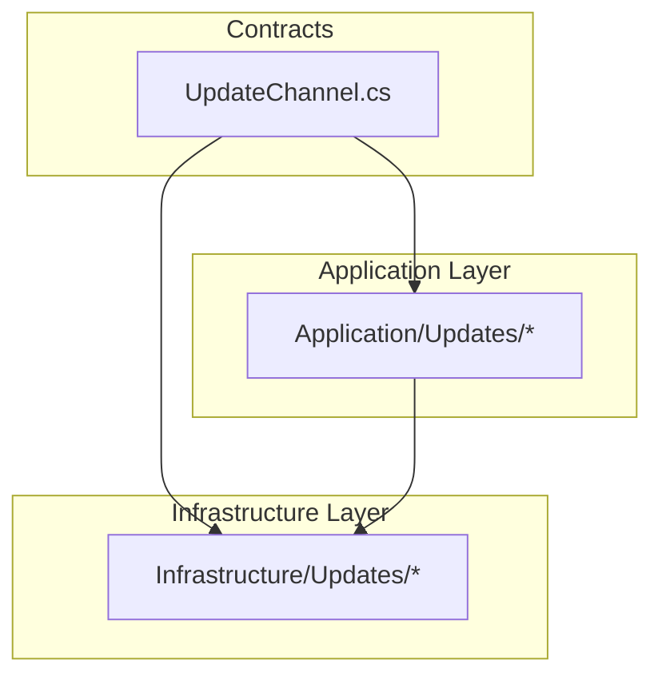
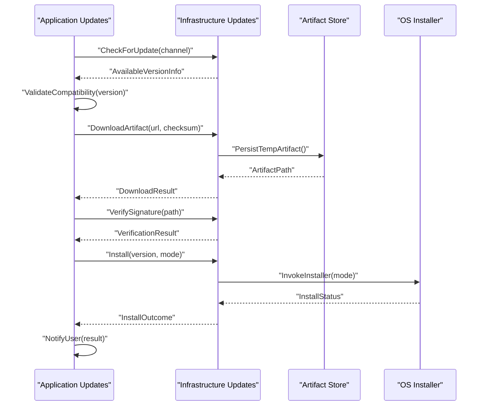
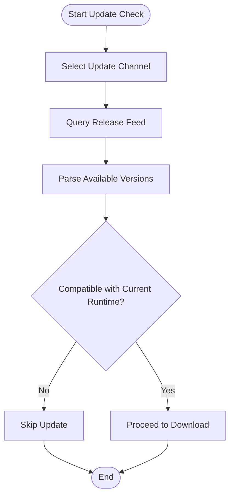
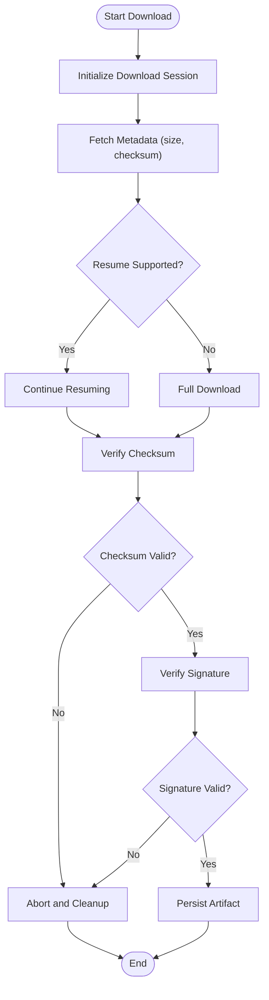
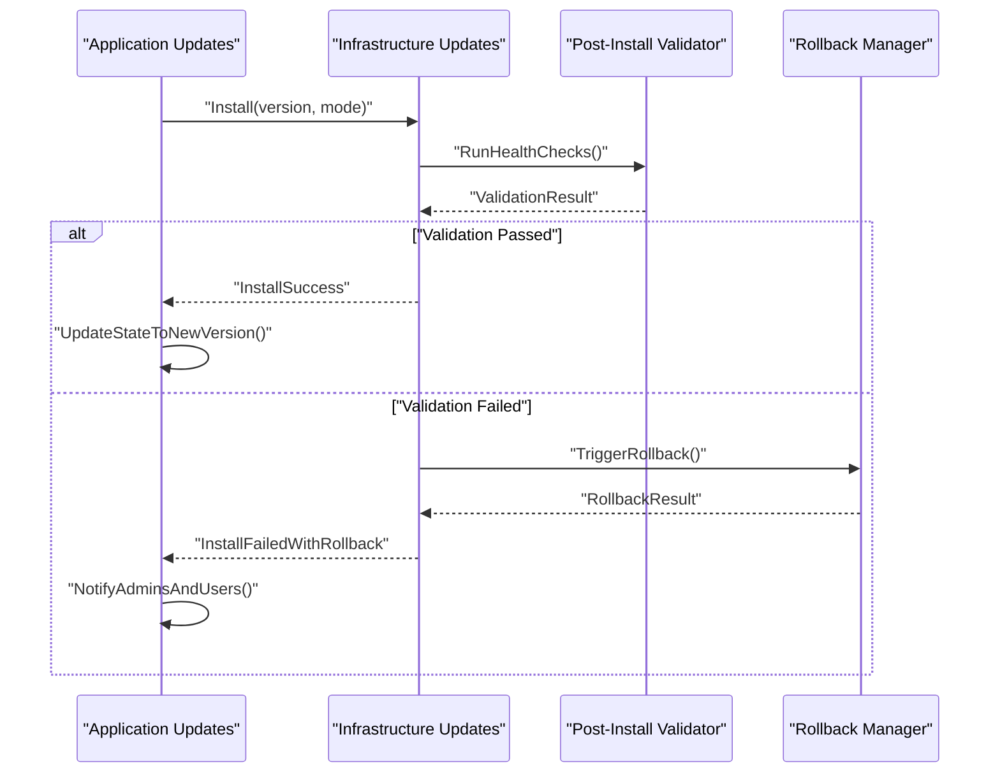
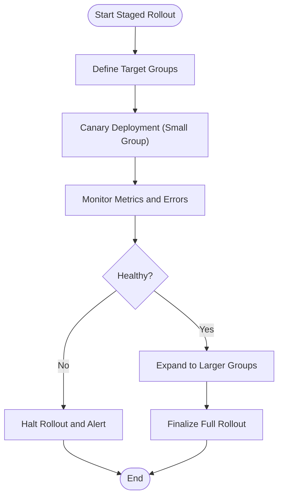
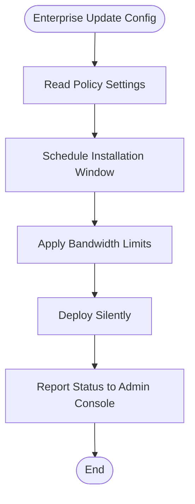
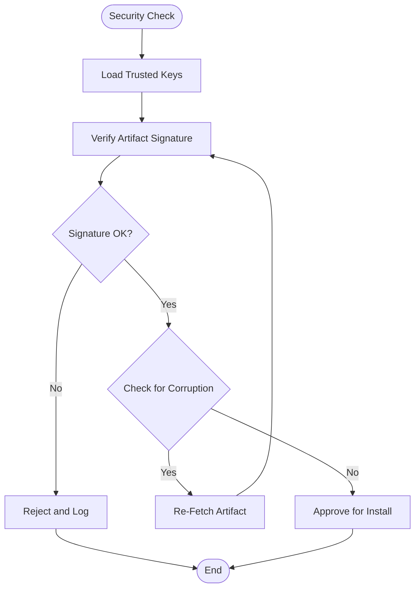
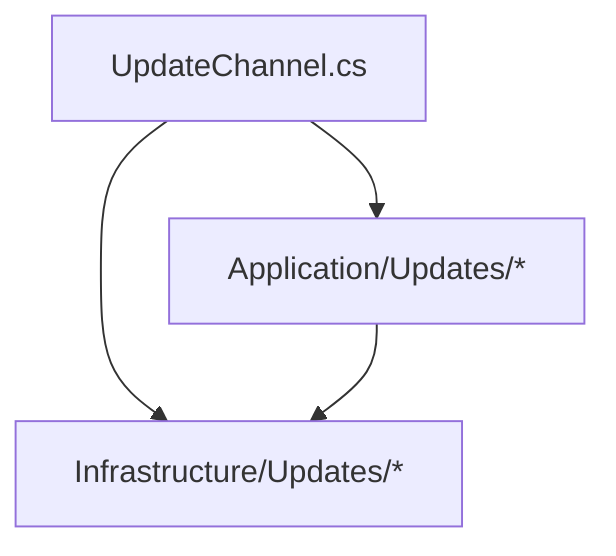

# Update Management

<cite>
**Referenced Files in This Document**
- [UpdateChannel.cs](file://src/Trackdub.Contracts/UpdateChannel.cs)
- [Updates directory (Application)](file://src/Trackdub.Application/Updates)
- [Updates directory (Infrastructure)](file://src/Trackdub.Infrastructure/Updates)
</cite>

## Table of Contents
1. [Introduction](#introduction)
2. [Project Structure](#project-structure)
3. [Core Components](#core-components)
4. [Architecture Overview](#architecture-overview)
5. [Detailed Component Analysis](#detailed-component-analysis)
6. [Dependency Analysis](#dependency-analysis)
7. [Performance Considerations](#performance-considerations)
8. [Troubleshooting Guide](#troubleshooting-guide)
9. [Conclusion](#conclusion)
10. [Appendices](#appendices)

## Introduction
This document provides comprehensive guidance for implementing update mechanisms in Trackdub deployments. It covers automatic update detection, download management, installation procedures, version compatibility checks, rollback strategies, and validation processes. It also details update channels (stable, beta, development), staged rollouts, user notifications, silent updates for enterprise environments, scheduling, bandwidth management, security measures including signature verification and corruption recovery, and troubleshooting update failures, network connectivity issues, and manual update procedures.

## Project Structure
The update-related code is organized across two primary layers:
- Contracts layer defines the shared abstractions and enums used by both application and infrastructure layers.
- Application and Infrastructure layers implement the update orchestration, storage, networking, and platform-specific behaviors.

**Diagram sources**
- [UpdateChannel.cs](file://src/Trackdub.Contracts/UpdateChannel.cs)
- [Updates directory (Application)](file://src/Trackdub.Application/Updates)
- [Updates directory (Infrastructure)](file://src/Trackdub.Infrastructure/Updates)

**Section sources**
- [UpdateChannel.cs](file://src/Trackdub.Contracts/UpdateChannel.cs)
- [Updates directory (Application)](file://src/Trackdub.Application/Updates)
- [Updates directory (Infrastructure)](file://src/Trackdub.Infrastructure/Updates)

## Core Components
- Update Channel Enumeration: Defines supported channels such as stable, beta, and development to control which releases are considered during update checks.
- Application Updates Module: Orchestrates update workflows, including checking for new versions, coordinating downloads, validating artifacts, and managing installation prompts or silent installs.
- Infrastructure Updates Module: Provides low-level capabilities like artifact downloading, checksum/signature verification, temporary storage management, and platform-specific installation routines.

Key responsibilities:
- Automatic detection of available updates based on configured channel.
- Secure download with integrity and authenticity verification.
- Version compatibility checks against current runtime and OS constraints.
- Rollback support to revert to a known-good state if post-installation validation fails.
- User notification and consent flows for non-silent updates.
- Enterprise-friendly silent deployment with scheduling and bandwidth controls.

**Section sources**
- [UpdateChannel.cs](file://src/Trackdub.Contracts/UpdateChannel.cs)
- [Updates directory (Application)](file://src/Trackdub.Application/Updates)
- [Updates directory (Infrastructure)](file://src/Trackdub.Infrastructure/Updates)

## Architecture Overview
The update system follows a layered architecture:
- The Application layer composes services to manage update lifecycle events and user interactions.
- The Infrastructure layer implements concrete operations for networking, file handling, and platform-specific installers.
- Contracts define shared types and enumerations consumed by both layers.

**Diagram sources**
- [Updates directory (Application)](file://src/Trackdub.Application/Updates)
- [Updates directory (Infrastructure)](file://src/Trackdub.Infrastructure/Updates)

## Detailed Component Analysis

### Update Channels and Version Compatibility
- Channels: Stable, Beta, Development determine which release feed is queried.
- Compatibility Checks: Ensure the target version supports the current OS, hardware capabilities, and runtime dependencies before proceeding.

**Diagram sources**
- [UpdateChannel.cs](file://src/Trackdub.Contracts/UpdateChannel.cs)
- [Updates directory (Application)](file://src/Trackdub.Application/Updates)

**Section sources**
- [UpdateChannel.cs](file://src/Trackdub.Contracts/UpdateChannel.cs)
- [Updates directory (Application)](file://src/Trackdub.Application/Updates)

### Download Management and Integrity Verification
- Downloads: Use resumable transfers with progress reporting and retry policies.
- Integrity: Validate checksums and verify digital signatures before accepting artifacts.
- Storage: Persist artifacts to secure temporary locations until installation completes successfully.

**Diagram sources**
- [Updates directory (Infrastructure)](file://src/Trackdub.Infrastructure/Updates)

**Section sources**
- [Updates directory (Infrastructure)](file://src/Trackdub.Infrastructure/Updates)

### Installation Procedures and Rollback Strategies
- Installation Modes: Interactive (user confirmation) and Silent (enterprise automation).
- Post-Install Validation: Run health checks and feature gates to ensure the new version operates correctly.
- Rollback: If validation fails, revert to the previous version and notify administrators.

**Diagram sources**
- [Updates directory (Application)](file://src/Trackdub.Application/Updates)
- [Updates directory (Infrastructure)](file://src/Trackdub.Infrastructure/Updates)

**Section sources**
- [Updates directory (Application)](file://src/Trackdub.Application/Updates)
- [Updates directory (Infrastructure)](file://src/Trackdub.Infrastructure/Updates)

### Staged Rollouts and Notification Systems
- Staged Rollouts: Gradually increase exposure to new versions using percentage-based targeting and feature flags.
- Notifications: Inform users about upcoming updates, pending installations, and outcomes via UI or system messages.

**Diagram sources**
- [Updates directory (Application)](file://src/Trackdub.Application/Updates)

**Section sources**
- [Updates directory (Application)](file://src/Trackdub.Application/Updates)

### Silent Updates for Enterprise Environments
- Configuration: Centralized policy files or environment variables dictate update behavior.
- Scheduling: Install at defined maintenance windows to minimize disruption.
- Bandwidth Management: Throttle download speeds and prioritize critical traffic.

**Diagram sources**
- [Updates directory (Infrastructure)](file://src/Trackdub.Infrastructure/Updates)

**Section sources**
- [Updates directory (Infrastructure)](file://src/Trackdub.Infrastructure/Updates)

### Security Measures: Signature Verification and Corruption Recovery
- Signature Verification: Ensure artifacts are signed by trusted authorities before installation.
- Corruption Recovery: Detect partial or corrupted downloads and automatically re-fetch from reliable sources.

**Diagram sources**
- [Updates directory (Infrastructure)](file://src/Trackdub.Infrastructure/Updates)

**Section sources**
- [Updates directory (Infrastructure)](file://src/Trackdub.Infrastructure/Updates)

## Dependency Analysis
The update system depends on contracts for shared types and orchestrates between application and infrastructure modules.

**Diagram sources**
- [UpdateChannel.cs](file://src/Trackdub.Contracts/UpdateChannel.cs)
- [Updates directory (Application)](file://src/Trackdub.Application/Updates)
- [Updates directory (Infrastructure)](file://src/Trackdub.Infrastructure/Updates)

**Section sources**
- [UpdateChannel.cs](file://src/Trackdub.Contracts/UpdateChannel.cs)
- [Updates directory (Application)](file://src/Trackdub.Application/Updates)
- [Updates directory (Infrastructure)](file://src/Trackdub.Infrastructure/Updates)

## Performance Considerations
- Efficient Downloads: Implement chunked transfers and resume capability to reduce bandwidth usage and improve reliability.
- Caching: Cache metadata and previously verified artifacts to avoid redundant downloads.
- Background Processing: Perform updates asynchronously to maintain application responsiveness.
- Resource Limits: Enforce CPU and memory limits during verification and installation to prevent resource contention.

[No sources needed since this section provides general guidance]

## Troubleshooting Guide
Common issues and resolutions:
- Network Connectivity: Verify proxy settings, firewall rules, and DNS resolution. Retry with exponential backoff.
- Signature Failures: Confirm trusted key stores are up-to-date and that artifacts originate from expected sources.
- Corrupted Artifacts: Enable automatic re-download and validate checksums before installation.
- Installation Failures: Review logs for permission errors, disk space issues, and dependency conflicts. Use rollback to restore stability.
- Manual Update Procedures: Provide CLI commands or scripts for administrators to force-update or downgrade when automated processes fail.

**Section sources**
- [Updates directory (Infrastructure)](file://src/Trackdub.Infrastructure/Updates)

## Conclusion
The Trackdub update system is designed to be secure, resilient, and adaptable to diverse deployment scenarios. By leveraging channels, staged rollouts, robust verification, and enterprise-friendly features, it ensures reliable software delivery while maintaining user experience and operational efficiency.

[No sources needed since this section summarizes without analyzing specific files]

## Appendices
- Glossary: Definitions of terms such as “artifact,” “signature verification,” and “staged rollout.”
- References: Links to external documentation on update best practices and security guidelines.

[No sources needed since this section provides general content]