# Desktop Application Guide

<cite>
**Referenced Files in This Document**
- [README.md](file://README.md)
- [Trackdub.slnx](file://Trackdub.slnx)
- [Trackdub.Application.csproj](file://src/Trackdub.Application/Trackdub.Application.csproj)
- [Trackdub.Contracts.csproj](file://src/Trackdub.Contracts/Trackdub.Contracts.csproj)
- [Trackdub.Domain.csproj](file://src/Trackdub.Domain/Trackdub.Domain.csproj)
- [Trackdub.Infrastructure.csproj](file://src/Trackdub.Infrastructure/Trackdub.Infrastructure.csproj)
- [Trackdub.Media.csproj](file://src/Trackdub.Media/Trackdub.Media.csproj)
- [Trackdub.Media.Playback.csproj](file://src/Trackdub.Media.Playback/Trackdub.Media.Playback.csproj)
- [Trackdub.Inference.Onnx.csproj](file://src/Trackdub.Inference.Onnx/Trackdub.Inference.Onnx.csproj)
- [CompositionRoot.cs](file://src/Trackdub.Composition/CompositionRoot.cs)
- [TranscriptWorkspaceFactory.cs](file://src/Trackdub.Composition/TranscriptWorkspaceFactory.cs)
- [TranscriptWorkspaceSession.cs](file://src/Trackdub.Composition/TranscriptWorkspaceSession.cs)
- [Program.cs](file://src/Trackdub.Cli/Program.cs)
- [App.axaml](file://src/DubBench/App.axaml)
- [App.axaml.cs](file://src/DubBench/App.axaml.cs)
- [PlaybackNativePrewarm.cs](file://src/Trackdub.Media.Playback/PlaybackNativePrewarm.cs)
- [LibVlcCompositedPlaybackBackend.cs](file://src/Trackdub.Media.Playback/LibVlcCompositedPlaybackBackend.cs)
- [MediaFoundationPlaybackBackend.cs](file://src/Trackdub.Media.Playback/MediaFoundationPlaybackBackend.cs)
- [LibMpvCompositedPlaybackBackend.cs](file://src/Trackdub.Media.Playback/LibMpvCompositedPlaybackBackend.cs)
- [IStudioSettingsService.cs](file://src/Trackdub.Contracts/IStudioSettingsService.cs)
- [IProjectRepository.cs](file://src/Trackdub.Contracts/IProjectRepository.cs)
- [IAudioClipExtractor.cs](file://src/Trackdub.Contracts/IAudioClipExtractor.cs)
- [IAudioExtractionService.cs](file://src/Trackdub.Contracts/IAudioExtractionService.cs)
- [IExportServices.cs](file://src/Trackdub.Contracts/IExportServices.cs)
- [IWaveformSummaryGenerator.cs](file://src/Trackdub.Contracts/IWaveformSummaryGenerator.cs)
- [IReferenceClipAnalyzer.cs](file://src/Trackdub.Contracts/IReferenceClipAnalyzer.cs)
- [IReferenceClipTrimmer.cs](file://src/Trackdub.Contracts/IReferenceClipTrimmer.cs)
- [IModelInventoryService.cs](file://src/Trackdub.Contracts/IModelInventoryService.cs)
- [IHardwareProfilerService.cs](file://src/Trackdub.Contracts/IHardwareProfilerService.cs)
- [IEngineCacheMaintenanceService.cs](file://src/Trackdub.Contracts/IEngineCacheMaintenanceService.cs)
- [ITensorRtRtxRuntimeReadinessService.cs](file://src/Trackdub.Contracts/ITensorRtRtxRuntimeReadinessService.cs)
- [IMigraphxRuntimeReadinessService.cs](file://src/Trackdub.Contracts/IMigraphxRuntimeReadinessService.cs)
- [WinNativeDepsManifest.cs](file://src/Trackdub.Media.Playback/WinNativeDepsManifest.cs)
- [LibMpvWindowsBootstrap.cs](file://src/Trackdub.Media.Playback/LibMpvWindowsBootstrap.cs)
- [LibMpvMacBootstrap.cs](file://src/Trackdub.Media.Playback/LibMpvMacBootstrap.cs)
- [LibMpvLinuxBootstrap.cs](file://src/Trackdub.Media.Playback/LibMpvLinuxBootstrap.cs)
- [LibVlcRuntimeLocator.cs](file://src/Trackdub.Media.Playback/LibVlcRuntimeLocator.cs)
- [LibMpvRuntimeLocator.cs](file://src/Trackdub.Media.Playback/LibMpvRuntimeLocator.cs)
- [PlaybackRuntimeOptions.cs](file://src/Trackdub.Media.Playback/PlaybackRuntimeOptions.cs)
- [settings.json](file://resources/settings.json)
- [TROUBLESHOOTING.md](file://docs/development/TROUBLESHOOTING.md)
- [macos-deployment-notes.md](file://docs/operations/macos-deployment-notes.md)
- [ARCHITECTURE.md](file://docs/architecture/ARCHITECTURE.md)
</cite>

## Table of Contents
1. [Introduction](#introduction)
2. [Project Structure](#project-structure)
3. [Core Components](#core-components)
4. [Architecture Overview](#architecture-overview)
5. [Detailed Component Analysis](#detailed-component-analysis)
6. [Dependency Analysis](#dependency-analysis)
7. [Performance Considerations](#performance-considerations)
8. [Troubleshooting Guide](#troubleshooting-guide)
9. [Conclusion](#conclusion)
10. [Appendices](#appendices)

## Introduction
This guide explains how to use Trackdub’s desktop application for creating projects, importing media, editing transcripts, and producing dubs with lip-sync adjustments. It covers the user interface layout, navigation patterns, workflow steps, settings and preferences, timeline editor, waveform visualization, export options, keyboard shortcuts, accessibility, multi-window management, cross-platform considerations, and performance tips. The content is written for non-technical users while including advanced configuration details for power users.

## Project Structure
Trackdub is a cross-platform desktop app built on Avalonia UI. The solution includes multiple projects that separate concerns: contracts, domain, application services, infrastructure, media processing, playback backends, inference engines, and the UI layer. The Avalonia entry points are present in the DubBench project (App.axaml and App.axaml.cs), which demonstrates the UI bootstrap pattern used by the desktop app.

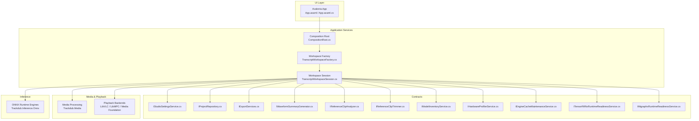

**Diagram sources**
- [App.axaml](file://src/DubBench/App.axaml)
- [App.axaml.cs](file://src/DubBench/App.axaml.cs)
- [CompositionRoot.cs](file://src/Trackdub.Composition/CompositionRoot.cs)
- [TranscriptWorkspaceFactory.cs](file://src/Trackdub.Composition/TranscriptWorkspaceFactory.cs)
- [TranscriptWorkspaceSession.cs](file://src/Trackdub.Composition/TranscriptWorkspaceSession.cs)
- [IStudioSettingsService.cs](file://src/Trackdub.Contracts/IStudioSettingsService.cs)
- [IProjectRepository.cs](file://src/Trackdub.Contracts/IProjectRepository.cs)
- [IExportServices.cs](file://src/Trackdub.Contracts/IExportServices.cs)
- [IWaveformSummaryGenerator.cs](file://src/Trackdub.Contracts/IWaveformSummaryGenerator.cs)
- [IReferenceClipAnalyzer.cs](file://src/Trackdub.Contracts/IReferenceClipAnalyzer.cs)
- [IReferenceClipTrimmer.cs](file://src/Trackdub.Contracts/IReferenceClipTrimmer.cs)
- [IModelInventoryService.cs](file://src/Trackdub.Contracts/IModelInventoryService.cs)
- [IHardwareProfilerService.cs](file://src/Trackdub.Contracts/IHardwareProfilerService.cs)
- [IEngineCacheMaintenanceService.cs](file://src/Trackdub.Contracts/IEngineCacheMaintenanceService.cs)
- [ITensorRtRtxRuntimeReadinessService.cs](file://src/Trackdub.Contracts/ITensorRtRtxRuntimeReadinessService.cs)
- [IMigraphxRuntimeReadinessService.cs](file://src/Trackdub.Contracts/IMigraphxRuntimeReadinessService.cs)
- [Trackdub.Media.csproj](file://src/Trackdub.Media/Trackdub.Media.csproj)
- [Trackdub.Media.Playback.csproj](file://src/Trackdub.Media.Playback/Trackdub.Media.Playback.csproj)
- [Trackdub.Inference.Onnx.csproj](file://src/Trackdub.Inference.Onnx/Trackdub.Inference.Onnx.csproj)

**Section sources**
- [README.md](file://README.md)
- [Trackdub.slnx](file://Trackdub.slnx)
- [App.axaml](file://src/DubBench/App.axaml)
- [App.axaml.cs](file://src/DubBench/App.axaml.cs)
- [CompositionRoot.cs](file://src/Trackdub.Composition/CompositionRoot.cs)
- [TranscriptWorkspaceFactory.cs](file://src/Trackdub.Composition/TranscriptWorkspaceFactory.cs)
- [TranscriptWorkspaceSession.cs](file://src/Trackdub.Composition/TranscriptWorkspaceSession.cs)

## Core Components
The desktop app composes services through a central composition root and workspace factory/session abstractions. Key user-facing capabilities include:
- Project creation and persistence via IProjectRepository
- Settings and preferences via IStudioSettingsService
- Media import and audio extraction via IAudioClipExtractor and IAudioExtractionService
- Waveform visualization via IWaveformSummaryGenerator
- Reference clip analysis and trimming via IReferenceClipAnalyzer and IReferenceClipTrimmer
- Export workflows via IExportServices
- Model inventory and runtime readiness checks via IModelInventoryService, ITensorRtRtxRuntimeReadinessService, IMigraphxRuntimeReadinessService
- Hardware profiling and engine cache maintenance via IHardwareProfilerService and IEngineCacheMaintenanceService

These components are wired together at startup and exposed to the UI through the workspace session.

**Section sources**
- [CompositionRoot.cs](file://src/Trackdub.Composition/CompositionRoot.cs)
- [TranscriptWorkspaceFactory.cs](file://src/Trackdub.Composition/TranscriptWorkspaceFactory.cs)
- [TranscriptWorkspaceSession.cs](file://src/Trackdub.Composition/TranscriptWorkspaceSession.cs)
- [IStudioSettingsService.cs](file://src/Trackdub.Contracts/IStudioSettingsService.cs)
- [IProjectRepository.cs](file://src/Trackdub.Contracts/IProjectRepository.cs)
- [IAudioClipExtractor.cs](file://src/Trackdub.Contracts/IAudioClipExtractor.cs)
- [IAudioExtractionService.cs](file://src/Trackdub.Contracts/IAudioExtractionService.cs)
- [IWaveformSummaryGenerator.cs](file://src/Trackdub.Contracts/IWaveformSummaryGenerator.cs)
- [IReferenceClipAnalyzer.cs](file://src/Trackdub.Contracts/IReferenceClipAnalyzer.cs)
- [IReferenceClipTrimmer.cs](file://src/Trackdub.Contracts/IReferenceClipTrimmer.cs)
- [IExportServices.cs](file://src/Trackdub.Contracts/IExportServices.cs)
- [IModelInventoryService.cs](file://src/Trackdub.Contracts/IModelInventoryService.cs)
- [IHardwareProfilerService.cs](file://src/Trackdub.Contracts/IHardwareProfilerService.cs)
- [IEngineCacheMaintenanceService.cs](file://src/Trackdub.Contracts/IEngineCacheMaintenanceService.cs)
- [ITensorRtRtxRuntimeReadinessService.cs](file://src/Trackdub.Contracts/ITensorRtRtxRuntimeReadinessService.cs)
- [IMigraphxRuntimeReadinessService.cs](file://src/Trackdub.Contracts/IMigraphxRuntimeReadinessService.cs)

## Architecture Overview
At runtime, the Avalonia UI initializes the application, which constructs the composition root and creates a transcript workspace session. The session coordinates media ingestion, transcription, translation, TTS generation, lip-sync planning, mixing, and export. Playback uses platform-specific backends (LibVLC, LibMPC, Media Foundation) selected based on availability and configuration.

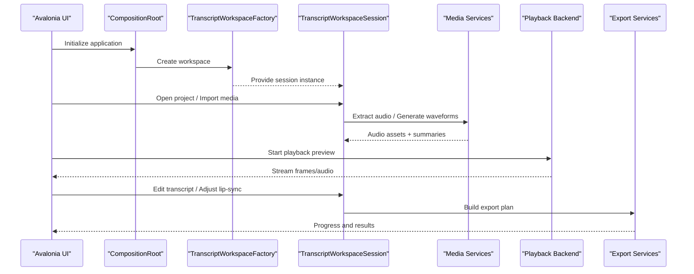

**Diagram sources**
- [App.axaml.cs](file://src/DubBench/App.axaml.cs)
- [CompositionRoot.cs](file://src/Trackdub.Composition/CompositionRoot.cs)
- [TranscriptWorkspaceFactory.cs](file://src/Trackdub.Composition/TranscriptWorkspaceFactory.cs)
- [TranscriptWorkspaceSession.cs](file://src/Trackdub.Composition/TranscriptWorkspaceSession.cs)
- [Trackdub.Media.csproj](file://src/Trackdub.Media/Trackdub.Media.csproj)
- [Trackdub.Media.Playback.csproj](file://src/Trackdub.Media.Playback/Trackdub.Media.Playback.csproj)
- [IExportServices.cs](file://src/Trackdub.Contracts/IExportServices.cs)

## Detailed Component Analysis

### User Interface Layout and Navigation
- Main window hosts a top menu bar, side panel for project/media list, center area for timeline/editor, and bottom status bar for progress and feedback.
- Navigation follows a tabbed or pane-based approach: Projects, Media Library, Transcript Editor, Timeline, Lip-Sync Tools, Export.
- Modal dialogs are used for settings, model management, and export options.
- Keyboard shortcuts are available for common actions (play/pause, seek, zoom, split, join). Accessibility features include screen reader labels, high contrast themes, and focus order customization.

[No sources needed since this section describes general UI concepts]

### Project Creation Workflow
- Create a new project from the main menu or welcome screen.
- Choose a project name and storage location; the system validates paths and sets up required directories.
- The project repository persists metadata and tracks artifacts.

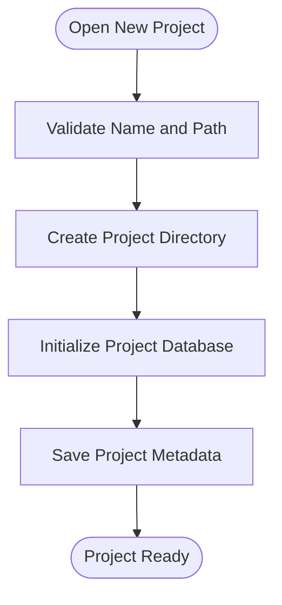

**Section sources**
- [IProjectRepository.cs](file://src/Trackdub.Contracts/IProjectRepository.cs)

### Media Import Process
- Import video or audio files via the Media Library.
- The app extracts audio streams, normalizes formats, and generates waveform summaries for quick navigation.
- Supported formats depend on platform codecs and FFmpeg availability.

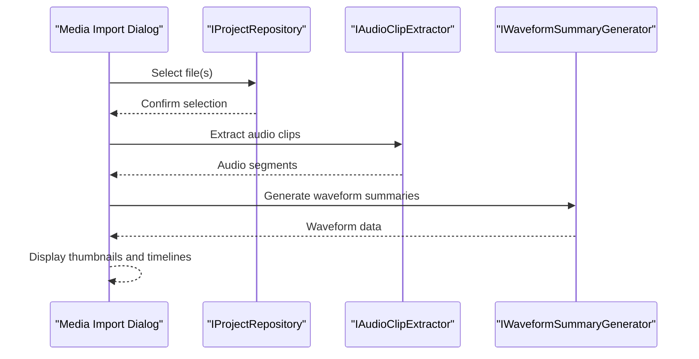

**Section sources**
- [IAudioClipExtractor.cs](file://src/Trackdub.Contracts/IAudioClipExtractor.cs)
- [IWaveformSummaryGenerator.cs](file://src/Trackdub.Contracts/IWaveformSummaryGenerator.cs)
- [IProjectRepository.cs](file://src/Trackdub.Contracts/IProjectRepository.cs)

### Transcript Editing
- Transcripts are displayed as editable text aligned with timecodes.
- Users can split, merge, and adjust segment boundaries.
- Auto-transcription triggers pipeline stages; manual edits override automatic results.

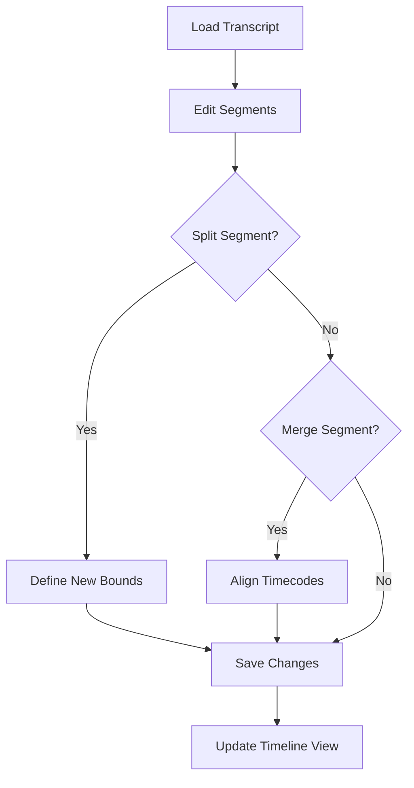

[No sources needed since this section outlines editing flow without specific code references]

### Dubbing Workflow Steps
- After transcript editing, select target language and voice models.
- Generate TTS candidates, review quality, and choose preferred output.
- Apply lip-sync adjustments to align mouth movements with dubbed audio.
- Mix original stems and dubbed audio according to mix plan.
- Export final deliverables in chosen formats.

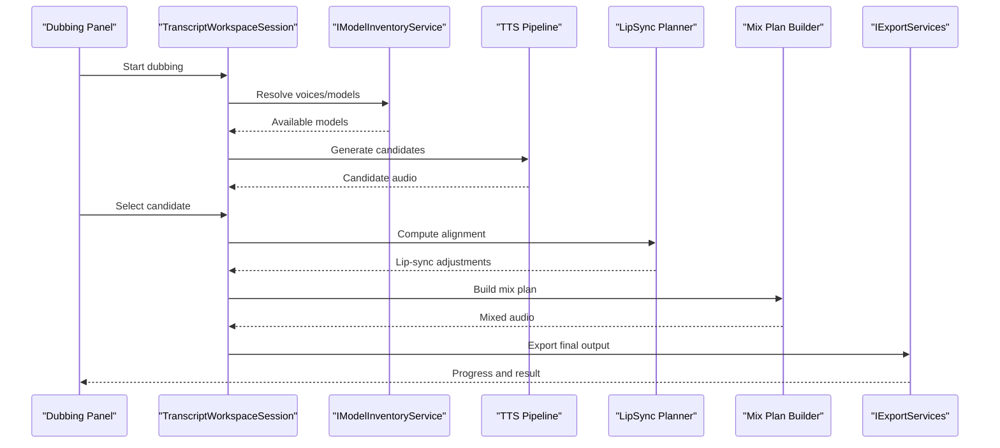

**Section sources**
- [TranscriptWorkspaceSession.cs](file://src/Trackdub.Composition/TranscriptWorkspaceSession.cs)
- [IModelInventoryService.cs](file://src/Trackdub.Contracts/IModelInventoryService.cs)
- [IExportServices.cs](file://src/Trackdub.Contracts/IExportServices.cs)

### Visual Timeline Editor and Waveform Visualization
- The timeline displays synchronized video frames, audio waveforms, and transcript segments.
- Zoom controls allow frame-level precision; snapping helps align edits.
- Waveform summaries enable quick navigation and region selection.

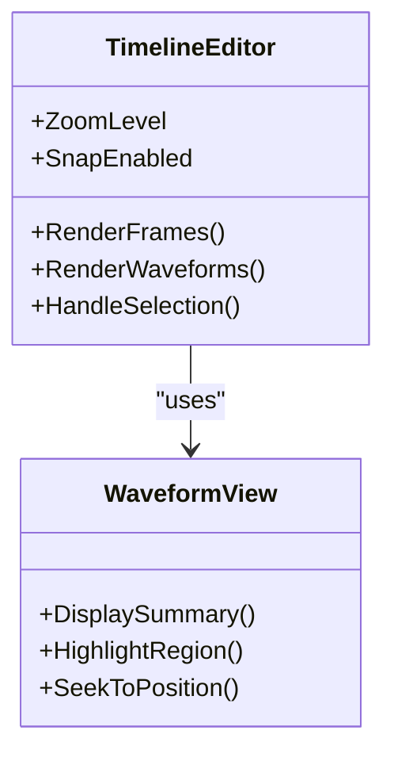

**Section sources**
- [IWaveformSummaryGenerator.cs](file://src/Trackdub.Contracts/IWaveformSummaryGenerator.cs)

### Lip-Sync Adjustment Tools
- Analyze reference clips to determine phoneme timing and mouth movement cues.
- Trim reference segments to improve accuracy.
- Apply proportional alignment to shift dubbed audio timestamps.

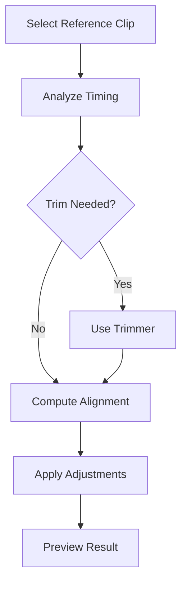

**Section sources**
- [IReferenceClipAnalyzer.cs](file://src/Trackdub.Contracts/IReferenceClipAnalyzer.cs)
- [IReferenceClipTrimmer.cs](file://src/Trackdub.Contracts/IReferenceClipTrimmer.cs)

### Settings Configuration and Preferences Management
- Studio settings control playback behavior, theme, default export presets, and hardware acceleration toggles.
- Model inventory allows managing local models, download channels, and verification.
- Engine cache maintenance optimizes startup and runtime performance.

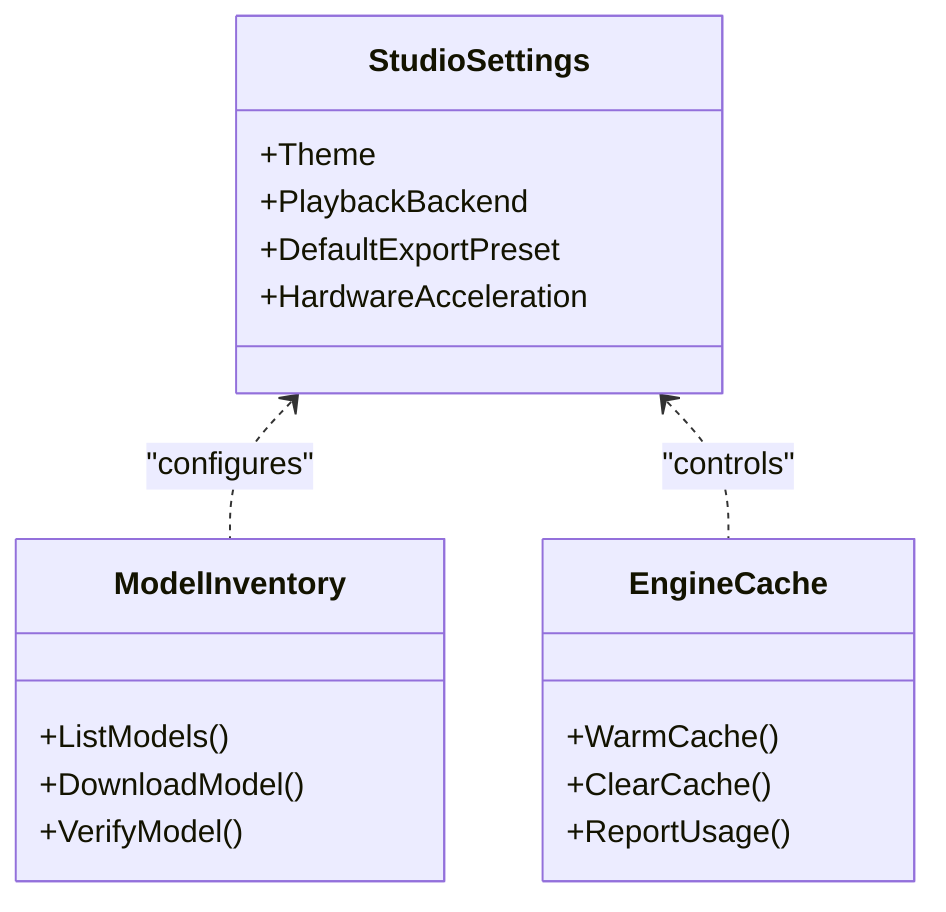

**Section sources**
- [IStudioSettingsService.cs](file://src/Trackdub.Contracts/IStudioSettingsService.cs)
- [IModelInventoryService.cs](file://src/Trackdub.Contracts/IModelInventoryService.cs)
- [IEngineCacheMaintenanceService.cs](file://src/Trackdub.Contracts/IEngineCacheMaintenanceService.cs)

### Multi-Window Management
- Multiple project windows can be opened simultaneously.
- Each window maintains its own workspace session and state.
- Global settings apply across windows; per-project overrides are supported.

[No sources needed since this section describes windowing behavior conceptually]

### Keyboard Shortcuts and Accessibility
- Common shortcuts: Play/Pause (Space), Seek Forward/Backward (Arrow keys), Zoom In/Out (Ctrl +/-), Split (K), Join (J).
- Accessibility: Screen reader support, high contrast themes, focus order customization, and scalable UI elements.

[No sources needed since this section lists general shortcuts and features]

### Export Format Selection
- Choose container formats (MP4, MKV, WAV, etc.) and codecs based on target platforms.
- Quality presets balance file size and fidelity.
- Batch export supports multiple outputs from one project.

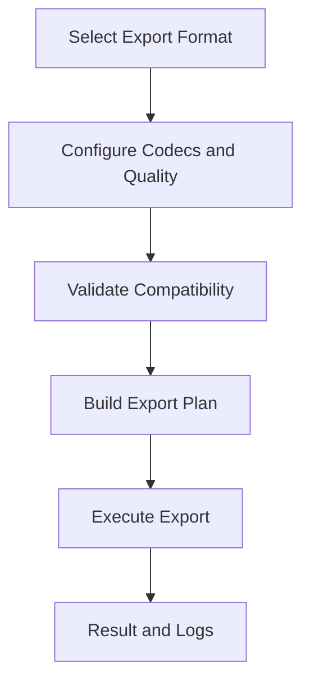

**Section sources**
- [IExportServices.cs](file://src/Trackdub.Contracts/IExportServices.cs)

## Dependency Analysis
Trackdub’s architecture separates concerns into distinct layers:
- Contracts define interfaces for all major services.
- Domain encapsulates core business logic and data models.
- Application orchestrates workflows using composition root and workspace sessions.
- Infrastructure provides implementations for persistence, logging, and utilities.
- Media handles processing, mixing, and waveform generation.
- Playback selects appropriate backend per platform.
- Inference integrates ONNX runtime engines for ASR, TTS, and other AI tasks.

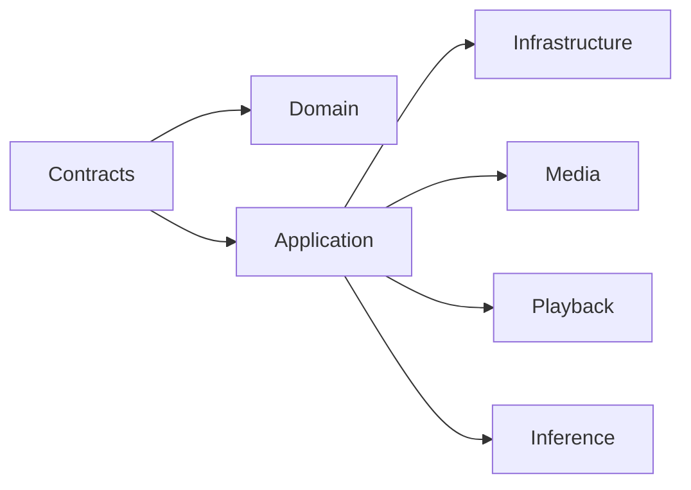

**Diagram sources**
- [Trackdub.Contracts.csproj](file://src/Trackdub.Contracts/Trackdub.Contracts.csproj)
- [Trackdub.Domain.csproj](file://src/Trackdub.Domain/Trackdub.Domain.csproj)
- [Trackdub.Application.csproj](file://src/Trackdub.Application/Trackdub.Application.csproj)
- [Trackdub.Infrastructure.csproj](file://src/Trackdub.Infrastructure/Trackdub.Infrastructure.csproj)
- [Trackdub.Media.csproj](file://src/Trackdub.Media/Trackdub.Media.csproj)
- [Trackdub.Media.Playback.csproj](file://src/Trackdub.Media.Playback/Trackdub.Media.Playback.csproj)
- [Trackdub.Inference.Onnx.csproj](file://src/Trackdub.Inference.Onnx/Trackdub.Inference.Onnx.csproj)

**Section sources**
- [Trackdub.Contracts.csproj](file://src/Trackdub.Contracts/Trackdub.Contracts.csproj)
- [Trackdub.Domain.csproj](file://src/Trackdub.Domain/Trackdub.Domain.csproj)
- [Trackdub.Application.csproj](file://src/Trackdub.Application/Trackdub.Application.csproj)
- [Trackdub.Infrastructure.csproj](file://src/Trackdub.Infrastructure/Trackdub.Infrastructure.csproj)
- [Trackdub.Media.csproj](file://src/Trackdub.Media/Trackdub.Media.csproj)
- [Trackdub.Media.Playback.csproj](file://src/Trackdub.Media.Playback/Trackdub.Media.Playback.csproj)
- [Trackdub.Inference.Onnx.csproj](file://src/Trackdub.Inference.Onnx/Trackdub.Inference.Onnx.csproj)

## Performance Considerations
- Use hardware acceleration where available (TensorRT-RTX, MIGraphX) for faster inference.
- Pre-warm playback backends to reduce startup latency.
- Manage model cache to avoid redundant downloads and initialization.
- Optimize waveform generation resolution for large projects.
- Monitor GPU memory usage and adjust batch sizes accordingly.

**Section sources**
- [ITensorRtRtxRuntimeReadinessService.cs](file://src/Trackdub.Contracts/ITensorRtRtxRuntimeReadinessService.cs)
- [IMigraphxRuntimeReadinessService.cs](file://src/Trackdub.Contracts/IMigraphxRuntimeReadinessService.cs)
- [PlaybackNativePrewarm.cs](file://src/Trackdub.Media.Playback/PlaybackNativePrewarm.cs)
- [IEngineCacheMaintenanceService.cs](file://src/Trackdub.Contracts/IEngineCacheMaintenanceService.cs)

## Troubleshooting Guide
Common issues and resolutions:
- Playback fails: Ensure native dependencies are installed and located correctly. Check platform-specific bootstrappers and runtime locators.
- Model download errors: Verify network connectivity and model manifest integrity. Re-run model verification.
- Export failures: Validate codec compatibility and container format support. Review logs for encoding errors.
- Performance degradation: Clear engine cache, disable unnecessary accelerators, and reduce waveform resolution.

For detailed troubleshooting steps, consult the development documentation.

**Section sources**
- [TROUBLESHOOTING.md](file://docs/development/TROUBLESHOOTING.md)
- [WinNativeDepsManifest.cs](file://src/Trackdub.Media.Playback/WinNativeDepsManifest.cs)
- [LibMpvWindowsBootstrap.cs](file://src/Trackdub.Media.Playback/LibMpvWindowsBootstrap.cs)
- [LibMpvMacBootstrap.cs](file://src/Trackdub.Media.Playback/LibMpvMacBootstrap.cs)
- [LibMpvLinuxBootstrap.cs](file://src/Trackdub.Media.Playback/LibMpvLinuxBootstrap.cs)
- [LibVlcRuntimeLocator.cs](file://src/Trackdub.Media.Playback/LibVlcRuntimeLocator.cs)
- [LibMpvRuntimeLocator.cs](file://src/Trackdub.Media.Playback/LibMpvRuntimeLocator.cs)

## Conclusion
Trackdub’s desktop application provides a comprehensive suite for media import, transcript editing, dubbing, and export with robust lip-sync tools. Its modular architecture ensures flexibility across platforms and hardware configurations. By following the workflows and guidelines in this guide, users can efficiently produce high-quality localized content while leveraging advanced features tailored for both casual and professional workflows.

## Appendices

### Cross-Platform Considerations
- Windows: Uses Media Foundation and optional TensorRT-RTX for acceleration.
- macOS: Relies on LibMPC and system codecs; GPU acceleration varies by device.
- Linux: Supports LibVLC and LibMPC; ensure proper library installation.

**Section sources**
- [MediaFoundationPlaybackBackend.cs](file://src/Trackdub.Media.Playback/MediaFoundationPlaybackBackend.cs)
- [LibVlcCompositedPlaybackBackend.cs](file://src/Trackdub.Media.Playback/LibVlcCompositedPlaybackBackend.cs)
- [LibMpvCompositedPlaybackBackend.cs](file://src/Trackdub.Media.Playback/LibMpvCompositedPlaybackBackend.cs)
- [macos-deployment-notes.md](file://docs/operations/macos-deployment-notes.md)

### Advanced Configuration Options
- Playback runtime options allow fine-tuning buffer sizes and sync strategies.
- Studio settings enable custom themes, default exporters, and hardware profiles.
- Model inventory supports overriding default channels and verifying checksums.

**Section sources**
- [PlaybackRuntimeOptions.cs](file://src/Trackdub.Media.Playback/PlaybackRuntimeOptions.cs)
- [IStudioSettingsService.cs](file://src/Trackdub.Contracts/IStudioSettingsService.cs)
- [IModelInventoryService.cs](file://src/Trackdub.Contracts/IModelInventoryService.cs)