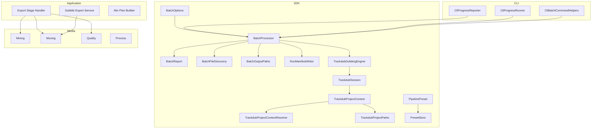
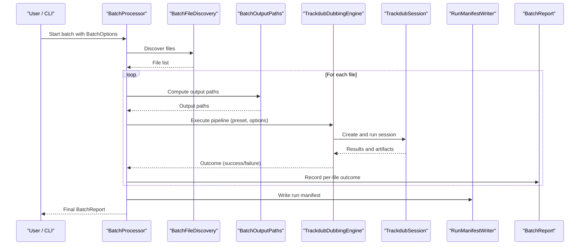
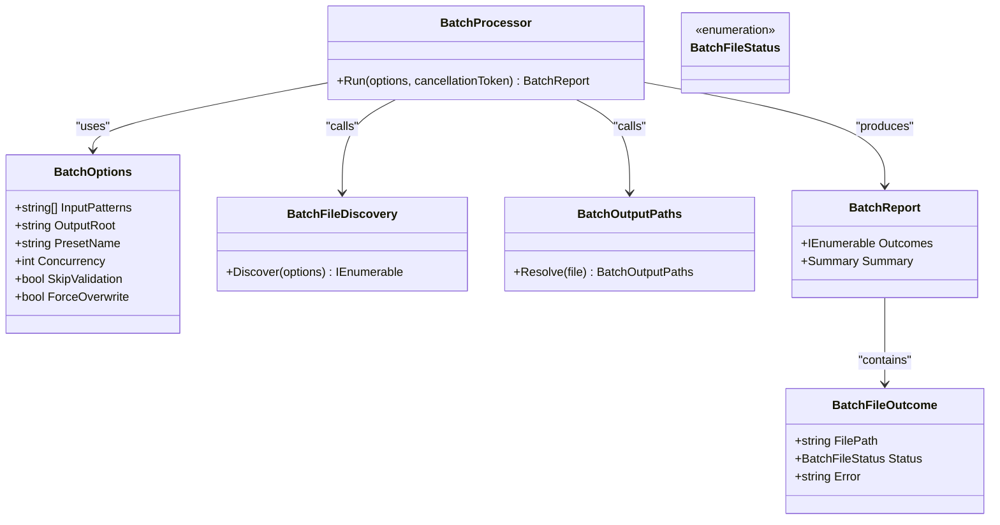
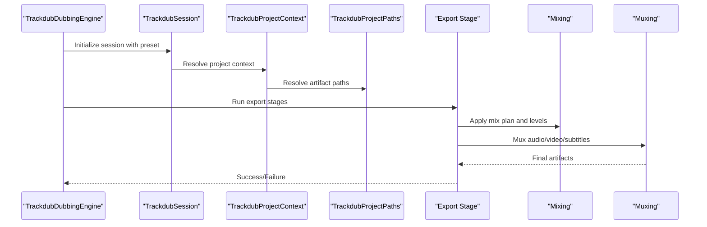
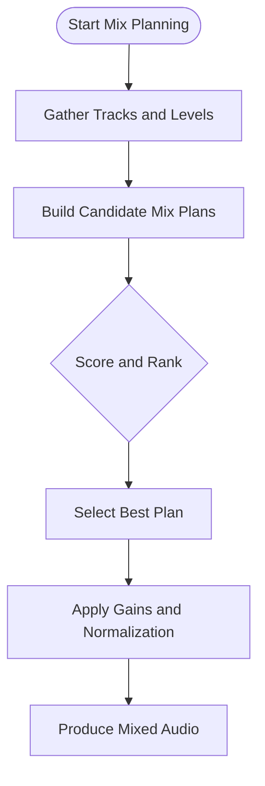
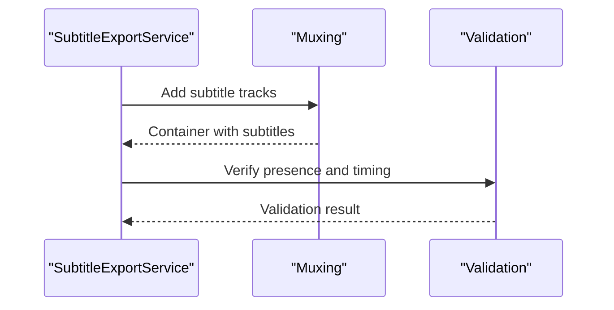
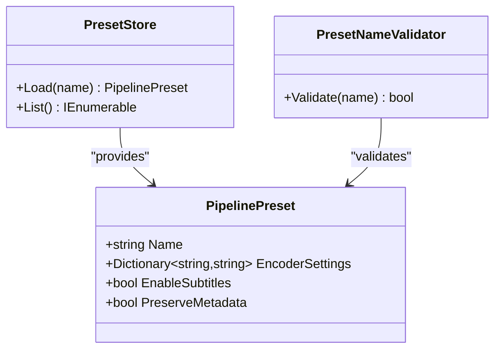
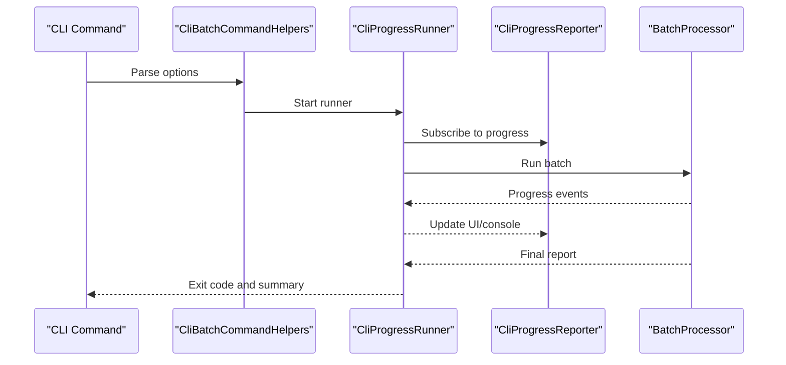

# Export Options & Batch Processing

<cite>
**Referenced Files in This Document**
- [Trackdub.Sdk.csproj](file://src/Trackdub.Sdk/Trackdub.Sdk.csproj)
- [BatchOptions.cs](file://src/Trackdub.Sdk/BatchOptions.cs)
- [BatchProcessor.cs](file://src/Trackdub.Sdk/BatchProcessor.cs)
- [BatchReport.cs](file://src/Trackdub.Sdk/BatchReport.cs)
- [BatchFileStatus.cs](file://src/Trackdub.Sdk/BatchFileStatus.cs)
- [BatchFileOutcome.cs](file://src/Trackdub.Sdk/BatchFileOutcome.cs)
- [BatchOutputPaths.cs](file://src/Trackdub.Sdk/BatchOutputPaths.cs)
- [BatchFileDiscovery.cs](file://src/Trackdub.Sdk/BatchFileDiscovery.cs)
- [RunManifestWriter.cs](file://src/Trackdub.Sdk/RunManifestWriter.cs)
- [TrackdubDubbingEngine.cs](file://src/Trackdub.Sdk/TrackdubDubbingEngine.cs)
- [TrackdubSession.cs](file://src/Trackdub.Sdk/TrackdubSession.cs)
- [TrackdubSessionFactory.cs](file://src/Trackdub.Sdk/TrackdubSessionFactory.cs)
- [TrackdubProjectContext.cs](file://src/Trackdub.Sdk/TrackdubProjectContext.cs)
- [TrackdubProjectContextResolver.cs](file://src/Trackdub.Sdk/TrackdubProjectContextResolver.cs)
- [TrackdubProjectPaths.cs](file://src/Trackdub.Sdk/TrackdubProjectPaths.cs)
- [PipelinePreset.cs](file://src/Trackdub.Sdk/PipelinePreset.cs)
- [PresetStore.cs](file://src/Trackdub.Sdk/PresetStore.cs)
- [PresetNameValidator.cs](file://src/Trackdub.Sdk/PresetNameValidator.cs)
- [ErrorCode.cs](file://src/Trackdub.Sdk/ErrorCode.cs)
- [ExportStageHandlerTests.cs](file:///tests/Trackdub.Application.Tests/ExportStageHandlerTests.cs)
- [SubtitleExportServiceTests.cs](file://tests/Trackdub.Application.Tests/SubtitleExportServiceTests.cs)
- [ExportManifestBuilderTests.cs](file://tests/Trackdub.Application.Tests/ExportManifestBuilderTests.cs)
- [LipSynthesisExportRecompositionTests.cs](file://tests/Trackdub.Application.Tests/LipSynthesisExportRecompositionTests.cs)
- [MixPlanBuilderTests.cs](file://tests/Trackdub.Application.Tests/MixPlanBuilderTests.cs)
- [MixPlanBuilderCandidateTests.cs](file://tests/Trackdub.Application.Tests/MixPlanBuilderCandidateTests.cs)
- [CliProgressReporter.cs](file://src/Trackdub.Cli/CliProgressReporter.cs)
- [CliProgressRunner.cs](file://src/Trackdub.Cli/CliProgressRunner.cs)
- [CliBatchCommandHelpers.cs](file://src/Trackdub.Cli/CliBatchCommandHelpers.cs)
</cite>

## Table of Contents
1. [Introduction](#introduction)
2. [Project Structure](#project-structure)
3. [Core Components](#core-components)
4. [Architecture Overview](#architecture-overview)
5. [Detailed Component Analysis](#detailed-component-analysis)
6. [Dependency Analysis](#dependency-analysis)
7. [Performance Considerations](#performance-considerations)
8. [Troubleshooting Guide](#troubleshooting-guide)
9. [Conclusion](#conclusion)
10. [Appendices](#appendices)

## Introduction
This document explains the export options and batch processing capabilities available in the project. It covers output formats, quality settings, compression options, audio mixing controls, subtitle embedding, metadata preservation, batch job creation, queue management, progress monitoring, templates/presets, automated workflows, error handling, retry mechanisms, result validation, and performance optimization for large batches. The content is derived from the SDK and related modules that implement export, mixing, muxing, and batch orchestration.

## Project Structure
The export and batch features are primarily implemented in the SDK layer with supporting services in Application, Media, and CLI layers:
- SDK: Batch orchestration, presets, session/project context, and manifest writing
- Application: Export stages, mix planning, subtitle export, and tests validating behavior
- Media: Mixing, muxing, quality, and process utilities
- CLI: Progress reporting and batch command helpers



**Diagram sources**
- [BatchOptions.cs](file://src/Trackdub.Sdk/BatchOptions.cs)
- [BatchProcessor.cs](file://src/Trackdub.Sdk/BatchProcessor.cs)
- [BatchReport.cs](file://src/Trackdub.Sdk/BatchReport.cs)
- [BatchFileDiscovery.cs](file://src/Trackdub.Sdk/BatchFileDiscovery.cs)
- [BatchOutputPaths.cs](file://src/Trackdub.Sdk/BatchOutputPaths.cs)
- [RunManifestWriter.cs](file://src/Trackdub.Sdk/RunManifestWriter.cs)
- [TrackdubDubbingEngine.cs](file://src/Trackdub.Sdk/TrackdubDubbingEngine.cs)
- [TrackdubSession.cs](file://src/Trackdub.Sdk/TrackdubSession.cs)
- [TrackdubProjectContext.cs](file://src/Trackdub.Sdk/TrackdubProjectContext.cs)
- [TrackdubProjectContextResolver.cs](file://src/Trackdub.Sdk/TrackdubProjectContextResolver.cs)
- [TrackdubProjectPaths.cs](file://src/Trackdub.Sdk/TrackdubProjectPaths.cs)
- [PipelinePreset.cs](file://src/Trackdub.Sdk/PipelinePreset.cs)
- [PresetStore.cs](file://src/Trackdub.Sdk/PresetStore.cs)
- [ExportStageHandlerTests.cs](file://tests/Trackdub.Application.Tests/ExportStageHandlerTests.cs)
- [SubtitleExportServiceTests.cs](file://tests/Trackdub.Application.Tests/SubtitleExportServiceTests.cs)
- [MixPlanBuilderTests.cs](file://tests/Trackdub.Application.Tests/MixPlanBuilderTests.cs)
- [CliProgressReporter.cs](file://src/Trackdub.Cli/CliProgressReporter.cs)
- [CliProgressRunner.cs](file://src/Trackdub.Cli/CliProgressRunner.cs)
- [CliBatchCommandHelpers.cs](file://src/Trackdub.Cli/CliBatchCommandHelpers.cs)

**Section sources**
- [Trackdub.Sdk.csproj](file://src/Trackdub.Sdk/Trackdub.Sdk.csproj)

## Core Components
- BatchOptions: Defines input discovery patterns, output root, preset selection, concurrency, and other batch-level parameters.
- BatchProcessor: Orchestrates file discovery, job scheduling, per-file execution via TrackdubDubbingEngine, and report generation.
- BatchReport and BatchFileStatus/Outcome: Capture per-file results, errors, and overall summary.
- BatchOutputPaths: Computes deterministic output paths for artifacts per file.
- RunManifestWriter: Persists run manifests to support auditability and re-run capability.
- TrackdubDubbingEngine and TrackdubSession: Provide the runtime pipeline execution for each item (transcription, translation, TTS, lip synthesis, export).
- TrackdubProjectContext and TrackdubProjectPaths: Resolve project roots and artifact locations for each batch item.
- PipelinePreset and PresetStore: Define and manage export templates and pipeline configurations.
- CLI helpers and progress reporters: Expose batch commands and real-time progress updates.

Key responsibilities:
- Input discovery and filtering
- Job queueing and concurrency control
- Per-item pipeline execution with retries and error capture
- Output path resolution and artifact writing
- Report generation and manifest persistence
- Progress reporting and cancellation support

**Section sources**
- [BatchOptions.cs](file://src/Trackdub.Sdk/BatchOptions.cs)
- [BatchProcessor.cs](file://src/Trackdub.Sdk/BatchProcessor.cs)
- [BatchReport.cs](file://src/Trackdub.Sdk/BatchReport.cs)
- [BatchFileStatus.cs](file://src/Trackdub.Sdk/BatchFileStatus.cs)
- [BatchFileOutcome.cs](file://src/Trackdub.Sdk/BatchFileOutcome.cs)
- [BatchOutputPaths.cs](file://src/Trackdub.Sdk/BatchOutputPaths.cs)
- [RunManifestWriter.cs](file://src/Trackdub.Sdk/RunManifestWriter.cs)
- [TrackdubDubbingEngine.cs](file://src/Trackdub.Sdk/TrackdubDubbingEngine.cs)
- [TrackdubSession.cs](file://src/Trackdub.Sdk/TrackdubSession.cs)
- [TrackdubProjectContext.cs](file://src/Trackdub.Sdk/TrackdubProjectContext.cs)
- [TrackdubProjectContextResolver.cs](file://src/Trackdub.Sdk/TrackdubProjectContextResolver.cs)
- [TrackdubProjectPaths.cs](file://src/Trackdub.Sdk/TrackdubProjectPaths.cs)
- [PipelinePreset.cs](file://src/Trackdub.Sdk/PipelinePreset.cs)
- [PresetStore.cs](file://src/Trackdub.Sdk/PresetStore.cs)
- [CliProgressReporter.cs](file://src/Trackdub.Cli/CliProgressReporter.cs)
- [CliProgressRunner.cs](file://src/Trackdub.Cli/CliProgressRunner.cs)
- [CliBatchCommandHelpers.cs](file://src/Trackdub.Cli/CliBatchCommandHelpers.cs)

## Architecture Overview
The batch export architecture composes a pipeline-driven engine with a queue-based processor. Each batch item follows these phases:
- Discovery: Identify files matching criteria
- Resolution: Resolve project context and output paths
- Execution: Run the full dubbing/export pipeline using presets
- Reporting: Write per-file outcomes and aggregate reports
- Persistence: Emit run manifests for traceability



**Diagram sources**
- [BatchProcessor.cs](file://src/Trackdub.Sdk/BatchProcessor.cs)
- [BatchFileDiscovery.cs](file://src/Trackdub.Sdk/BatchFileDiscovery.cs)
- [BatchOutputPaths.cs](file://src/Trackdub.Sdk/BatchOutputPaths.cs)
- [TrackdubDubbingEngine.cs](file://src/Trackdub.Sdk/TrackdubDubbingEngine.cs)
- [TrackdubSession.cs](file://src/Trackdub.Sdk/TrackdubSession.cs)
- [RunManifestWriter.cs](file://src/Trackdub.Sdk/RunManifestWriter.cs)
- [BatchReport.cs](file://src/Trackdub.Sdk/BatchReport.cs)

## Detailed Component Analysis

### Batch Orchestration
- BatchOptions: Configures input patterns, output root, preset name, concurrency, and flags controlling which pipeline stages to run or skip.
- BatchFileDiscovery: Scans directories and filters files based on patterns and constraints.
- BatchOutputPaths: Derives deterministic output directories and filenames for all artifacts per item.
- BatchProcessor: Manages the job queue, executes items concurrently within limits, handles cancellation, and aggregates results into BatchReport.



**Diagram sources**
- [BatchOptions.cs](file://src/Trackdub.Sdk/BatchOptions.cs)
- [BatchFileDiscovery.cs](file://src/Trackdub.Sdk/BatchFileDiscovery.cs)
- [BatchOutputPaths.cs](file://src/Trackdub.Sdk/BatchOutputPaths.cs)
- [BatchProcessor.cs](file://src/Trackdub.Sdk/BatchProcessor.cs)
- [BatchReport.cs](file://src/Trackdub.Sdk/BatchReport.cs)
- [BatchFileStatus.cs](file://src/Trackdub.Sdk/BatchFileStatus.cs)
- [BatchFileOutcome.cs](file://src/Trackdub.Sdk/BatchFileOutcome.cs)

**Section sources**
- [BatchOptions.cs](file://src/Trackdub.Sdk/BatchOptions.cs)
- [BatchFileDiscovery.cs](file://src/Trackdub.Sdk/BatchFileDiscovery.cs)
- [BatchOutputPaths.cs](file://src/Trackdub.Sdk/BatchOutputPaths.cs)
- [BatchProcessor.cs](file://src/Trackdub.Sdk/BatchProcessor.cs)
- [BatchReport.cs](file://src/Trackdub.Sdk/BatchReport.cs)
- [BatchFileStatus.cs](file://src/Trackdub.Sdk/BatchFileStatus.cs)
- [BatchFileOutcome.cs](file://src/Trackdub.Sdk/BatchFileOutcome.cs)

### Export Pipeline and Stages
- TrackdubDubbingEngine: Executes the full pipeline for a single item, including transcription, translation, TTS, lip synthesis, and export.
- TrackdubSession: Manages lifecycle and state for a single run.
- TrackdubProjectContext and TrackdubProjectPaths: Resolve project roots and artifact locations.
- Export stage handlers (validated by tests): Perform final muxing, subtitle embedding, metadata preservation, and format-specific encoding.



**Diagram sources**
- [TrackdubDubbingEngine.cs](file://src/Trackdub.Sdk/TrackdubDubbingEngine.cs)
- [TrackdubSession.cs](file://src/Trackdub.Sdk/TrackdubSession.cs)
- [TrackdubProjectContext.cs](file://src/Trackdub.Sdk/TrackdubProjectContext.cs)
- [TrackdubProjectPaths.cs](file://src/Trackdub.Sdk/TrackdubProjectPaths.cs)
- [ExportStageHandlerTests.cs](file://tests/Trackdub.Application.Tests/ExportStageHandlerTests.cs)

**Section sources**
- [TrackdubDubbingEngine.cs](file://src/Trackdub.Sdk/TrackdubDubbingEngine.cs)
- [TrackdubSession.cs](file://src/Trackdub.Sdk/TrackdubSession.cs)
- [TrackdubProjectContext.cs](file://src/Trackdub.Sdk/TrackdubProjectContext.cs)
- [TrackdubProjectPaths.cs](file://src/Trackdub.Sdk/TrackdubProjectPaths.cs)
- [ExportStageHandlerTests.cs](file://tests/Trackdub.Application.Tests/ExportStageHandlerTests.cs)

### Audio Mixing Controls
- MixPlanBuilder and candidates define how multiple audio tracks are combined, balanced, and normalized.
- Tests validate candidate selection and plan construction for consistent mixes across batch runs.



**Diagram sources**
- [MixPlanBuilderTests.cs](file://tests/Trackdub.Application.Tests/MixPlanBuilderTests.cs)
- [MixPlanBuilderCandidateTests.cs](file://tests/Trackdub.Application.Tests/MixPlanBuilderCandidateTests.cs)

**Section sources**
- [MixPlanBuilderTests.cs](file://tests/Trackdub.Application.Tests/MixPlanBuilderTests.cs)
- [MixPlanBuilderCandidateTests.cs](file://tests/Trackdub.Application.Tests/MixPlanBuilderCandidateTests.cs)

### Subtitle Embedding and Metadata Preservation
- Subtitle export service ensures subtitles are embedded into final containers and validated against expected outputs.
- Export manifest builder and recomposition tests confirm metadata integrity and correct track ordering.



**Diagram sources**
- [SubtitleExportServiceTests.cs](file://tests/Trackdub.Application.Tests/SubtitleExportServiceTests.cs)
- [ExportManifestBuilderTests.cs](file://tests/Trackdub.Application.Tests/ExportManifestBuilderTests.cs)
- [LipSynthesisExportRecompositionTests.cs](file://tests/Trackdub.Application.Tests/LipSynthesisExportRecompositionTests.cs)

**Section sources**
- [SubtitleExportServiceTests.cs](file://tests/Trackdub.Application.Tests/SubtitleExportServiceTests.cs)
- [ExportManifestBuilderTests.cs](file://tests/Trackdub.Application.Tests/ExportManifestBuilderTests.cs)
- [LipSynthesisExportRecompositionTests.cs](file://tests/Trackdub.Application.Tests/LipSynthesisExportRecompositionTests.cs)

### Export Templates and Presets
- PipelinePreset defines reusable configurations for encoder settings, quality, and stage toggles.
- PresetStore manages loading and validation of preset names.
- PresetNameValidator enforces naming rules and availability checks.



**Diagram sources**
- [PipelinePreset.cs](file://src/Trackdub.Sdk/PipelinePreset.cs)
- [PresetStore.cs](file://src/Trackdub.Sdk/PresetStore.cs)
- [PresetNameValidator.cs](file://src/Trackdub.Sdk/PresetNameValidator.cs)

**Section sources**
- [PipelinePreset.cs](file://src/Trackdub.Sdk/PipelinePreset.cs)
- [PresetStore.cs](file://src/Trackdub.Sdk/PresetStore.cs)
- [PresetNameValidator.cs](file://src/Trackdub.Sdk/PresetNameValidator.cs)

### Automated Processing Workflows
- CLI integration exposes batch commands and progress reporting.
- CliBatchCommandHelpers coordinates arguments and invokes BatchProcessor.
- CliProgressReporter and CliProgressRunner stream status updates during long-running jobs.



**Diagram sources**
- [CliBatchCommandHelpers.cs](file://src/Trackdub.Cli/CliBatchCommandHelpers.cs)
- [CliProgressRunner.cs](file://src/Trackdub.Cli/CliProgressRunner.cs)
- [CliProgressReporter.cs](file://src/Trackdub.Cli/CliProgressReporter.cs)
- [BatchProcessor.cs](file://src/Trackdub.Sdk/BatchProcessor.cs)

**Section sources**
- [CliBatchCommandHelpers.cs](file://src/Trackdub.Cli/CliBatchCommandHelpers.cs)
- [CliProgressRunner.cs](file://src/Trackdub.Cli/CliProgressRunner.cs)
- [CliProgressReporter.cs](file://src/Trackdub.Cli/CliProgressReporter.cs)

## Dependency Analysis
The following diagram highlights key dependencies between SDK components and their roles in export and batch processing.

```mermaid
graph LR
BO["BatchOptions"] --> BP["BatchProcessor"]
BFD["BatchFileDiscovery"] --> BP
BOP["BatchOutputPaths"] --> BP
BR["BatchReport"] <-- BP
RMW["RunManifestWriter"] <-- BP
TDE["TrackdubDubbingEngine"] <-- BP
TS["TrackdubSession"] <-- TDE
TSC["TrackdubProjectContext"] <-- TS
TPR["TrackdubProjectContextResolver"] <-- TSC
TP["TrackdubProjectPaths"] <-- TSC
PP["PipelinePreset"] --> PS["PresetStore"]
PN["PresetNameValidator"] --> PP
```

**Diagram sources**
- [BatchOptions.cs](file://src/Trackdub.Sdk/BatchOptions.cs)
- [BatchProcessor.cs](file://src/Trackdub.Sdk/BatchProcessor.cs)
- [BatchFileDiscovery.cs](file://src/Trackdub.Sdk/BatchFileDiscovery.cs)
- [BatchOutputPaths.cs](file://src/Trackdub.Sdk/BatchOutputPaths.cs)
- [BatchReport.cs](file://src/Trackdub.Sdk/BatchReport.cs)
- [RunManifestWriter.cs](file://src/Trackdub.Sdk/RunManifestWriter.cs)
- [TrackdubDubbingEngine.cs](file://src/Trackdub.Sdk/TrackdubDubbingEngine.cs)
- [TrackdubSession.cs](file://src/Trackdub.Sdk/TrackdubSession.cs)
- [TrackdubProjectContext.cs](file://src/Trackdub.Sdk/TrackdubProjectContext.cs)
- [TrackdubProjectContextResolver.cs](file://src/Trackdub.Sdk/TrackdubProjectContextResolver.cs)
- [TrackdubProjectPaths.cs](file://src/Trackdub.Sdk/TrackdubProjectPaths.cs)
- [PipelinePreset.cs](file://src/Trackdub.Sdk/PipelinePreset.cs)
- [PresetStore.cs](file://src/Trackdub.Sdk/PresetStore.cs)
- [PresetNameValidator.cs](file://src/Trackdub.Sdk/PresetNameValidator.cs)

**Section sources**
- [BatchProcessor.cs](file://src/Trackdub.Sdk/BatchProcessor.cs)
- [TrackdubDubbingEngine.cs](file://src/Trackdub.Sdk/TrackdubDubbingEngine.cs)
- [TrackdubSession.cs](file://src/Trackdub.Sdk/TrackdubSession.cs)
- [TrackdubProjectContext.cs](file://src/Trackdub.Sdk/TrackdubProjectContext.cs)
- [TrackdubProjectContextResolver.cs](file://src/Trackdub.Sdk/TrackdubProjectContextResolver.cs)
- [TrackdubProjectPaths.cs](file://src/Trackdub.Sdk/TrackdubProjectPaths.cs)
- [PipelinePreset.cs](file://src/Trackdub.Sdk/PipelinePreset.cs)
- [PresetStore.cs](file://src/Trackdub.Sdk/PresetStore.cs)
- [PresetNameValidator.cs](file://src/Trackdub.Sdk/PresetNameValidator.cs)

## Performance Considerations
- Concurrency tuning: Adjust BatchOptions.Concurrency to match CPU/GPU capacity; avoid oversubscription on shared devices.
- Memory management: Prefer streaming where possible; ensure temporary artifacts are cleaned up after successful export.
- Disk space: Pre-check available disk space at OutputRoot; consider staging writes to a high-throughput volume.
- I/O parallelism: Use separate disks for inputs and outputs to reduce contention.
- Encoding backends: Choose appropriate encoders via presets; prefer hardware-accelerated paths when available.
- Batch sizing: Split very large batches into smaller chunks to improve resilience and observability.
- Cancellation: Propagate cancellation tokens to stop long-running jobs promptly.

[No sources needed since this section provides general guidance]

## Troubleshooting Guide
Common issues and resolutions:
- Invalid preset name: Validate preset names using PresetNameValidator; ensure presets exist in PresetStore.
- Missing input files: Confirm BatchOptions.InputPatterns match actual files; verify directory permissions.
- Insufficient disk space: Check free space at BatchOutputPaths.OutputRoot before starting.
- Export failures: Inspect BatchReport.Outcomes for per-file errors; check logs from TrackdubSession and TrackdubDubbingEngine.
- Subtitle embedding problems: Validate subtitle tracks with SubtitleExportService tests logic; ensure container supports desired subtitle format.
- Mixing anomalies: Review MixPlanBuilder decisions and candidate scoring; adjust levels and normalization parameters.
- Progress stalls: Ensure progress reporting is enabled; verify cancellation token propagation.

Error codes and statuses:
- ErrorCode: Centralized error categorization for diagnostics and user feedback.
- BatchFileStatus: Indicates success, failure, skipped, or pending states per file.

Retry mechanisms:
- Implement retry policies around transient failures (e.g., I/O timeouts, model load failures) in the engine/session layer.
- Use exponential backoff and maximum retry limits to prevent runaway loops.

Result validation tools:
- Use manifest inspection via RunManifestWriter outputs to verify completeness.
- Cross-check exported artifacts against expected paths and metadata using validation routines similar to those in tests.

**Section sources**
- [ErrorCode.cs](file://src/Trackdub.Sdk/ErrorCode.cs)
- [BatchFileStatus.cs](file://src/Trackdub.Sdk/BatchFileStatus.cs)
- [BatchReport.cs](file://src/Trackdub.Sdk/BatchReport.cs)
- [RunManifestWriter.cs](file://src/Trackdub.Sdk/RunManifestWriter.cs)
- [SubtitleExportServiceTests.cs](file://tests/Trackdub.Application.Tests/SubtitleExportServiceTests.cs)
- [MixPlanBuilderTests.cs](file://tests/Trackdub.Application.Tests/MixPlanBuilderTests.cs)
- [ExportManifestBuilderTests.cs](file://tests/Trackdub.Application.Tests/ExportManifestBuilderTests.cs)

## Conclusion
The export and batch processing system provides a robust, configurable pipeline for producing high-quality media exports at scale. With presets, mixing controls, subtitle embedding, and metadata preservation, it supports diverse workflows. Batch orchestration offers concurrency, progress reporting, and resilient error handling. By tuning concurrency, managing memory and disk resources, and leveraging validation tools, users can achieve reliable, efficient large-batch processing.

[No sources needed since this section summarizes without analyzing specific files]

## Appendices

### Output Formats, Quality Settings, and Compression
- Supported formats and codecs are controlled through PipelinePreset encoder settings.
- Quality and compression parameters are specified in preset configurations; choose presets aligned with target platforms and bandwidth constraints.
- Subtitle formats and embedding options are defined by the muxing stage and validated by tests.

[No sources needed since this section provides general guidance]

### Batch Job Creation, Queue Management, and Progress Monitoring
- Create jobs by configuring BatchOptions and invoking BatchProcessor.Run.
- Queue management is handled internally by BatchProcessor with concurrency limits.
- Monitor progress via CliProgressReporter and CliProgressRunner for console/UI updates.

**Section sources**
- [BatchOptions.cs](file://src/Trackdub.Sdk/BatchOptions.cs)
- [BatchProcessor.cs](file://src/Trackdub.Sdk/BatchProcessor.cs)
- [CliProgressReporter.cs](file://src/Trackdub.Cli/CliProgressReporter.cs)
- [CliProgressRunner.cs](file://src/Trackdub.Cli/CliProgressRunner.cs)

### Export Templates and Preset Configurations
- Define templates using PipelinePreset; store them via PresetStore.
- Enforce naming conventions with PresetNameValidator.
- Reuse presets across batch runs for consistency.

**Section sources**
- [PipelinePreset.cs](file://src/Trackdub.Sdk/PipelinePreset.cs)
- [PresetStore.cs](file://src/Trackdub.Sdk/PresetStore.cs)
- [PresetNameValidator.cs](file://src/Trackdub.Sdk/PresetNameValidator.cs)

### Automated Processing Workflows
- Integrate CLI commands with batch helpers to automate end-to-end pipelines.
- Combine preset selection, input discovery, and progress reporting for fully automated runs.

**Section sources**
- [CliBatchCommandHelpers.cs](file://src/Trackdub.Cli/CliBatchCommandHelpers.cs)
- [BatchProcessor.cs](file://src/Trackdub.Sdk/BatchProcessor.cs)