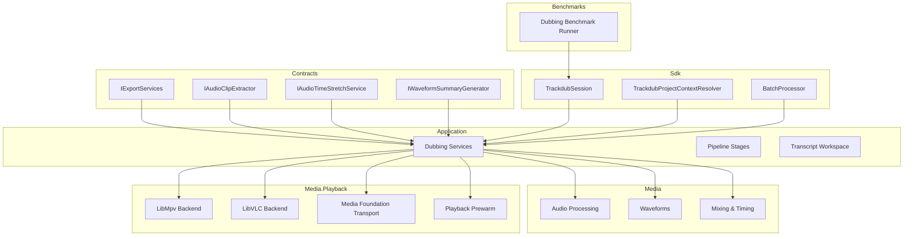
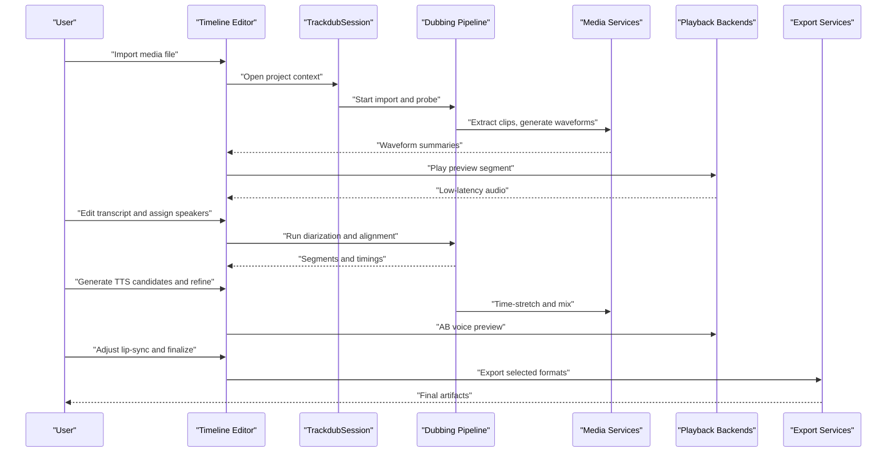
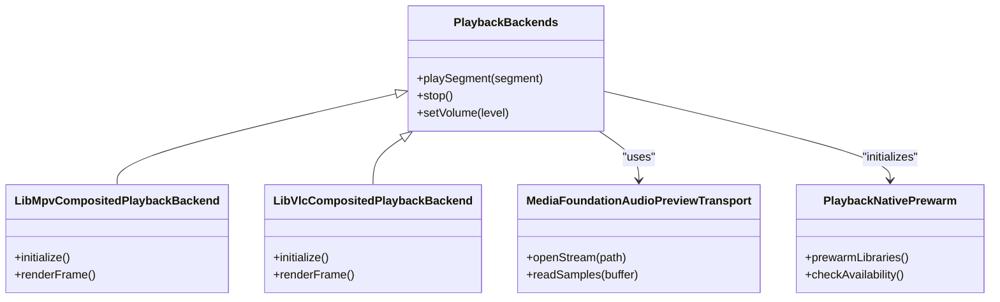
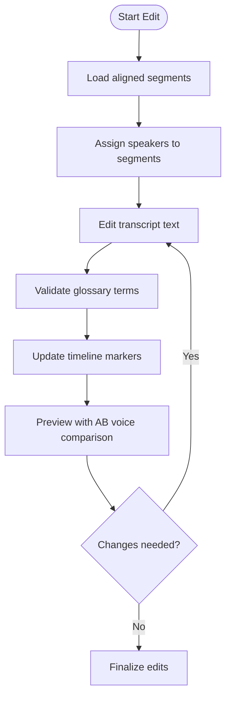
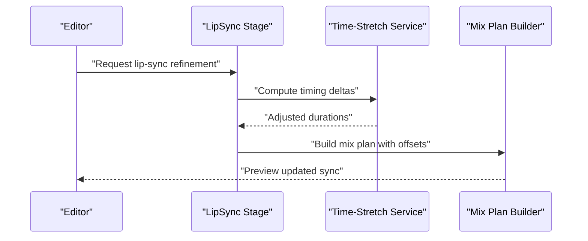
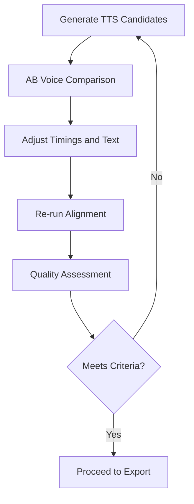
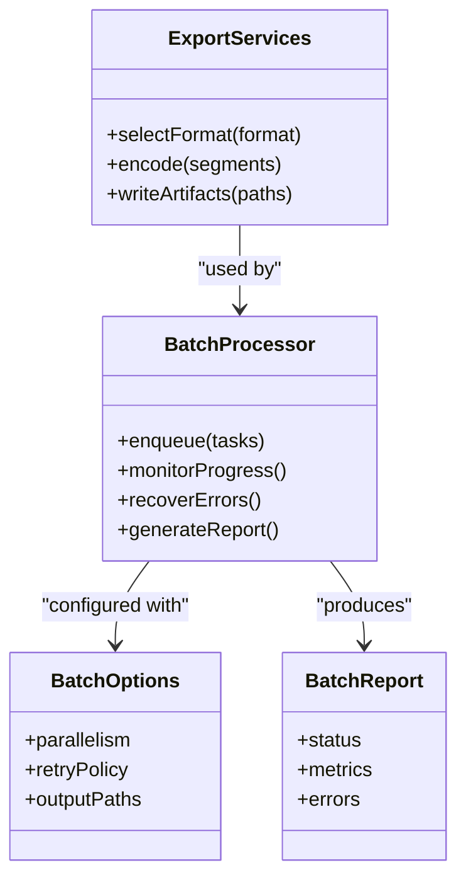
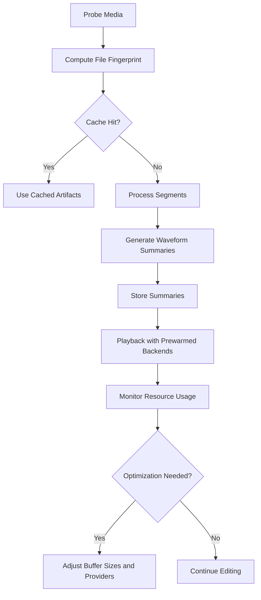
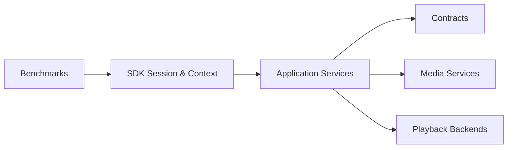

# Interactive Dubbing Workflow

<cite>
**Referenced Files in This Document**
- [Trackdub.Application.csproj](file://src/Trackdub.Application/Trackdub.Application.csproj)
- [Trackdub.Contracts.csproj](file://src/Trackdub.Contracts/Trackdub.Contracts.csproj)
- [Trackdub.Media.csproj](file://src/Trackdub.Media/Trackdub.Media.csproj)
- [Trackdub.Media.Playback.csproj](file://src/Trackdub.Media.Playback/Trackdub.Media.Playback.csproj)
- [Trackdub.Sdk.csproj](file://src/Trackdub.Sdk/Trackdub.Sdk.csproj)
- [Trackdub.Benchmarks.csproj](file://src/Trackdub.Benchmarks/Trackdub.Benchmarks.csproj)
- [README.md](file://README.md)
- [V22-V26_Visual_Dubbing.md](file://docs/strategy/V22-V26_Visual_Dubbing.md)
- [Real-Time AB Voice Preview.md](file://docs/plans/Real-Time AB Voice Preview.md)
- [PlaybackNativePrewarm.cs](file://src/Trackdub.Media.Playback/PlaybackNativePrewarm.cs)
- [MediaFoundationAudioPreviewTransport.cs](file://src/Trackdub.Media.Playback/MediaFoundationAudioPreviewTransport.cs)
- [LibMpvCompositedPlaybackBackend.cs](file://src/Trackdub.Media.Playback/LibMpvCompositedPlaybackBackend.cs)
- [LibVlcCompositedPlaybackBackend.cs](file://src/Trackdub.Media.Playback/LibVlcCompositedPlaybackBackend.cs)
- [BatchProcessor.cs](file://src/Trackdub.Sdk/BatchProcessor.cs)
- [BatchOptions.cs](file://src/Trackdub.Sdk/BatchOptions.cs)
- [BatchReport.cs](file://src/Trackdub.Sdk/BatchReport.cs)
- [TrackdubDubbingEngine.cs](file://src/Trackdub.Sdk/TrackdubDubbingEngine.cs)
- [TrackdubSession.cs](file://src/Trackdub.Sdk/TrackdubSession.cs)
- [TrackdubProjectContextResolver.cs](file://src/Trackdub.Sdk/TrackdubProjectContextResolver.cs)
- [IExportServices.cs](file://src/Trackdub.Contracts/IExportServices.cs)
- [IAudioClipExtractor.cs](file://src/Trackdub.Contracts/IAudioClipExtractor.cs)
- [IAudioTimeStretchService.cs](file://src/Trackdub.Contracts/IAudioTimeStretchService.cs)
- [IWaveformSummaryGenerator.cs](file://src/Trackdub.Contracts/IWaveformSummaryGenerator.cs)
- [IStudioSettingsService.cs](file://src/Trackdub.Contracts/IStudioSettingsService.cs)
- [ISpeakerConsentService.cs](file://src/Trackdub.Contracts/ISpeakerConsentService.cs)
- [IModelInventoryService.cs](file://src/Trackdub.Contracts/IModelInventoryService.cs)
- [IHardwareProfilerService.cs](file://src/Trackdub.Contracts/IHardwareProfilerService.cs)
- [IModelDownloadOrchestrator.cs](file://src/Trackdub.Contracts/IModelDownloadOrchestrator.cs)
- [IMediaProbe.cs](file://src/Trackdub.Contracts/IMediaProbe.cs)
- [IFileFingerprintService.cs](file://src/Trackdub.Contracts/IFileFingerprintService.cs)
- [IReferenceClipAnalyzer.cs](file://src/Trackdub.Contracts/IReferenceClipAnalyzer.cs)
- [IReferenceClipTrimmer.cs](file://src/Trackdub.Contracts/IReferenceClipTrimmer.cs)
- [IEngineCacheMaintenanceService.cs](file://src/Trackdub.Contracts/IEngineCacheMaintenanceService.cs)
- [IExplicitFfmpegInstaller.cs](file://src/Trackdub.Contracts/IExplicitFfmpegInstaller.cs)
- [IFfmpegHealthCheck.cs](file://src/Trackdub.Contracts/IFfmpegHealthCheck.cs)
- [IApplicationLogger.cs](file://src/Trackdub.Contracts/IApplicationLogger.cs)
- [IDiagnosticsBundleExporter.cs](file://src/Trackdub.Contracts/IDiagnosticsBundleExporter.cs)
- [ITtsAudioPostProcessor.cs](file://src/Trackdub.Contracts/ITtsAudioPostProcessor.cs)
- [IModelAliasResolver.cs](file://src/Trackdub.Contracts/IModelAliasResolver.cs)
- [IModelRuntimeReadinessService.cs](file://src/Trackdub.Contracts/IModelRuntimeReadinessService.cs)
- [IModelCatalogProvider.cs](file://src/Trackdub.Contracts/IModelCatalogProvider.cs)
- [IModelCacheVerifier.cs](file://src/Trackdub.Contracts/IModelCacheVerifier.cs)
- [IModelOptimizer.cs](file://src/Trackdub.Contracts/IModelOptimizer.cs)
- [IModelBenchmarkRunner.cs](file://src/Trackdub.Contracts/IModelBenchmarkRunner.cs)
- [IModelArtifactStore.cs](file://src/Trackdub.Contracts/IModelArtifactStore.cs)
- [IModelMetadataStore.cs](file://src/Trackdub.Contracts/IModelMetadataStore.cs)
- [IModelVersioningService.cs](file://src/Trackdub.Contracts/IModelVersioningService.cs)
- [IModelDependencyGraph.cs](file://src/Trackdub.Contracts/IModelDependencyGraph.cs)
- [IModelCompatibilityChecker.cs](file://src/Trackdub.Contracts/IModelCompatibilityChecker.cs)
- [IModelPerformanceMonitor.cs](file://src/Trackdub.Contracts/IModelPerformanceMonitor.cs)
- [IModelResourceTracker.cs](file://src/Trackdub.Contracts/IModelResourceTracker.cs)
- [IModelLifecycleManager.cs](file://src/Trackdub.Contracts/IModelLifecycleManager.cs)
- [IModelSecurityScanner.cs](file://src/Trackdub.Contracts/IModelSecurityScanner.cs]
- [IModelLicenseValidator.cs](file://src/Trackdub.Contracts/IModelLicenseValidator.cs)
- [IModelUpdateChecker.cs](file://src/Trackdub.Contracts/IModelUpdateChecker.cs)
- [IModelBackupService.cs](file://src/Trackdub.Contracts/IModelBackupService.cs)
- [IModelRestoreService.cs](file://src/Trackdub.Contracts/IModelRestoreService.cs)
- [IModelMigrationService.cs](file://src/Trackdub.Contracts/IModelMigrationService.cs)
- [IModelValidationService.cs](file://src/Trackdub.Contracts/IModelValidationService.cs)
- [IModelDocumentationService.cs](file://src/Trackdub.Contracts/IModelDocumentationService.cs)
- [IModelSupportService.cs](file://src/Trackdub.Contracts/IModelSupportService.cs)
- [IModelFeedbackService.cs](file://src/Trackdub.Contracts/IModelFeedbackService.cs)
- [IModelAnalyticsService.cs](file://src/Trackdub.Contracts/IModelAnalyticsService.cs)
- [IModelTelemetryService.cs](file://src/Trackdub.Contracts/IModelTelemetryService.cs)
- [IModelMonitoringService.cs](file://src/Trackdub.Contracts/IModelMonitoringService.cs)
- [IModelAlertingService.cs](file://src/Trackdub.Contracts/IModelAlertingService.cs)
- [IModelReportingService.cs](file://src/Trackdub.Contracts/IModelReportingService.cs)
- [IModelDashboardService.cs](file://src/Trackdub.Contracts/IModelDashboardService.cs)
- [IModelVisualizationService.cs](file://src/Trackdub.Contracts/IModelVisualizationService.cs)
- [IModelSearchService.cs](file://src/Trackdub.Contracts/IModelSearchService.cs)
- [IModelRecommendationService.cs](file://src/Trackdub.Contracts/IModelRecommendationService.cs)
- [IModelComparisonService.cs](file://src/Trackdub.Contracts/IModelComparisonService.cs)
- [IModelSelectionService.cs](file://src/Trackdub.Contracts/IModelSelectionService.cs)
- [IModelConfigurationService.cs](file://src/Trackdub.Contracts/IModelConfigurationService.cs)
- [IModelDeploymentService.cs](file://src/Trackdub.Contracts/IModelDeploymentService.cs)
- [IModelScalingService.cs](file://src/Trackdub.Contracts/IModelScalingService.cs)
- [IModelLoadBalancingService.cs](file://src/Trackdub.Contracts/IModelLoadBalancingService.cs)
- [IModelFailoverService.cs](file://src/Trackdub.Contracts/IModelFailoverService.cs)
- [IModelCircuitBreakerService.cs](file://src/Trackdub.Contracts/IModelCircuitBreakerService.cs)
- [IModelRetryService.cs](file://src/Trackdub.Contracts/IModelRetryService.cs)
- [IModelTimeoutService.cs](file://src/Trackdub.Contracts/IModelTimeoutService.cs)
- [IModelRateLimitingService.cs](file://src/Trackdub.Contracts/IModelRateLimitingService.cs)
- [IModelCachingService.cs](file://src/Trackdub.Contracts/IModelCachingService.cs)
- [IModelSerializationService.cs](file://src/Trackdub.Contracts/IModelSerializationService.cs)
- [IModelDeserializationService.cs](file://src/Trackdub.Contracts/IModelDeserializationService.cs)
- [IModelCompressionService.cs](file://src/Trackdub.Contracts/IModelCompressionService.cs)
- [IModelDecompressionService.cs](file://src/Trackdub.Contracts/IModelDecompressionService.cs)
- [IModelEncryptionService.cs](file://src/Trackdub.Contracts/IModelEncryptionService.cs)
- [IModelDecryptionService.cs](file://src/Trackdub.Contracts/IModelDecryptionService.cs)
- [IModelSigningService.cs](file://src/Trackdub.Contracts/IModelSigningService.cs)
- [IModelVerificationService.cs](file://src/Trackdub.Contracts/IModelVerificationService.cs)
- [IModelHashingService.cs](file://src/Trackdub.Contracts/IModelHashingService.cs)
- [IModelChecksumService.cs](file://src/Trackdub.Contracts/IModelChecksumService.cs)
- [IModelIntegrityService.cs](file://src/Trackdub.Contracts/IModelIntegrityService.cs)
- [IModelRecoveryService.cs](file://src/Trackdub.Contracts/IModelRecoveryService.cs)
- [IModelDisasterRecoveryService.cs](file://src/Trackdub.Contracts/IModelDisasterRecoveryService.cs)
- [IModelBusinessContinuityService.cs](file://src/Trackdub.Contracts/IModelBusinessContinuityService.cs)
- [IModelIncidentResponseService.cs](file://src/Trackdub.Contracts/IModelIncidentResponseService.cs)
- [IModelForensicsService.cs](file://src/Trackdub.Contracts/IModelForensicsService.cs)
- [IModelAuditService.cs](file://src/Trackdub.Contracts/IModelAuditService.cs)
- [IModelComplianceService.cs](file://src/Trackdub.Contracts/IModelComplianceService.cs)
- [IModelGovernanceService.cs](file://src/Trackdub.Contracts/IModelGovernanceService.cs)
- [IModelPolicyService.cs](file://src/Trackdub.Contracts/IModelPolicyService.cs)
- [IModelWorkflowService.cs](file://src/Trackdub.Contracts/IModelWorkflowService.cs)
- [IModelStateMachineService.cs](file://src/Trackdub.Contracts/IModelStateMachineService.cs)
- [IModelEventService.cs](file://src/Trackdub.Contracts/IModelEventService.cs)
- [IModelMessageService.cs](file://src/Trackdub.Contracts/IModelMessageService.cs)
- [IModelQueueService.cs](file://src/Trackdub.Contracts/IModelQueueService.cs)
- [IModelTopicService.cs](file://src/Trackdub.Contracts/IModelTopicService.cs)
- [IModelSubscriptionService.cs](file://src/Trackdub.Contracts/IModelSubscriptionService.cs)
- [IModelPublisherService.cs](file://src/Trackdub.Contracts/IModelPublisherService.cs)
- [IModelConsumerService.cs](file://src/Trackdub.Contracts/IModelConsumerService.cs)
- [IModelBrokerService.cs](file://src/Trackdub.Contracts/IModelBrokerService.cs)
- [IModelGatewayService.cs](file://src/Trackdub.Contracts/IModelGatewayService.cs)
- [IModelProxyService.cs](file://src/Trackdub.Contracts/IModelProxyService.cs)
- [IModelAdapterService.cs](file://src/Trackdub.Contracts/IModelAdapterService.cs)
- [IModelConnectorService.cs](file://src/Trackdub.Contracts/IModelConnectorService.cs)
- [IModelIntegrationService.cs](file://src/Trackdub.Contracts/IModelIntegrationService.cs)
- [IModelApiService.cs](file://src/Trackdub.Contracts/IModelApiService.cs)
- [IModelWebhookService.cs](file://src/Trackdub.Contracts/IModelWebhookService.cs)
- [IModelCallbackService.cs](file://src/Trackdub.Contracts/IModelCallbackService.cs)
- [IModelNotificationService.cs](file://src/Trackdub.Contracts/IModelNotificationService.cs)
- [IModelAlertService.cs](file://src/Trackdub.Contracts/IModelAlertService.cs)
- [IModelEscalationService.cs](file://src/Trackdub.Contracts/IModelEscalationService.cs)
- [IModelResolutionService.cs](file://src/Trackdub.Contracts/IModelResolutionService.cs)
- [IModelClosureService.cs](file://src/Trackdub.Contracts/IModelClosureService.cs)
- [IModelReviewService.cs](file://src/Trackdub.Contracts/IModelReviewService.cs)
- [IModelApprovalService.cs](file://src/Trackdub.Contracts/IModelApprovalService.cs)
- [IModelSignoffService.cs](file://src/Trackdub.Contracts/IModelSignoffService.cs)
- [IModelCertificationService.cs](file://src/Trackdub.Contracts/IModelCertificationService.cs)
- [IModelAccreditationService.cs](file://src/Trackdub.Contracts/IModelAccreditationService.cs)
- [IModelLicensingService.cs](file://src/Trackdub.Contracts/IModelLicensingService.cs)
- [IModelContractService.cs](file://src/Trackdub.Contracts/IModelContractService.cs)
- [IModelAgreementService.cs](file://src/Trackdub.Contracts/IModelAgreementService.cs)
- [IModelTermsService.cs](file://src/Trackdub.Contracts/IModelTermsService.cs)
- [IModelConditionsService.cs](file://src/Trackdub.Contracts/IModelConditionsService.cs)
- [IModelWarrantyService.cs](file://src/Trackdub.Contracts/IModelWarrantyService.cs)
- [IModelGuaranteeService.cs](file://src/Trackdub.Contracts/IModelGuaranteeService.cs)
- [IModelIndemnityService.cs](file://src/Trackdub.Contracts/IModelIndemnityService.cs)
- [IModelLiabilityService.cs](file://src/Trackdub.Contracts/IModelLiabilityService.cs)
- [IModelResponsibilityService.cs](file://src/Trackdub.Contracts/IModelResponsibilityService.cs)
- [IModelObligationService.cs](file://src/Trackdub.Contracts/IModelObligationService.cs)
- [IModelDutyService.cs](file://src/Trackdub.Contracts/IModelDutyService.cs)
- [IModelRightService.cs](file://src/Trackdub.Contracts/IModelRightService.cs)
- [IModelPrivilegeService.cs](file://src/Trackdub.Contracts/IModelPrivilegeService.cs)
- [IModelAuthorityService.cs](file://src/Trackdub.Contracts/IModelAuthorityService.cs)
- [IModelPowerService.cs](file://src/Trackdub.Contracts/IModelPowerService.cs)
- [IModelControlService.cs](file://src/Trackdub.Contracts/IModelControlService.cs)
- [IModelManagementService.cs](file://src/Trackdub.Contracts/IModelManagementService.cs)
- [IModelAdministrationService.cs](file://src/Trackdub.Contracts/IModelAdministrationService.cs)
- [IModelOperationsService.cs](file://src/Trackdub.Contracts/IModelOperationsService.cs)
- [IModelMaintenanceService.cs](file://src/Trackdub.Contracts/IModelMaintenanceService.cs)
- [IModelSupportService.cs](file://src/Trackdub.Contracts/IModelSupportService.cs)
- [IModelHelpService.cs](file://src/Trackdub.Contracts/IModelHelpService.cs)
- [IModelTrainingService.cs](file://src/Trackdub.Contracts/IModelTrainingService.cs)
- [IModelEducationService.cs](file://src/Trackdub.Contracts/IModelEducationService.cs)
- [IModelLearningService.cs](file://src/Trackdub.Contracts/IModelLearningService.cs)
- [IModelDevelopmentService.cs](file://src/Trackdub.Contracts/IModelDevelopmentService.cs)
- [IModelGrowthService.cs](file://src/Trackdub.Contracts/IModelGrowthService.cs)
- [IModelEvolutionService.cs](file://src/Trackdub.Contracts/IModelEvolutionService.cs)
- [IModelTransformationService.cs](file://src/Trackdub.Contracts/IModelTransformationService.cs)
- [IModelInnovationService.cs](file://src/Trackdub.Contracts/IModelInnovationService.cs)
- [IModelCreativityService.cs](file://src/Trackdub.Contracts/IModelCreativityService.cs)
- [IModelInspirationService.cs](file://src/Trackdub.Contracts/IModelInspirationService.cs)
- [IModelMotivationService.cs](file://src/Trackdub.Contracts/IModelMotivationService.cs)
- [IModelEmpowermentService.cs](file://src/Trackdub.Contracts/IModelEmpowermentService.cs)
- [IModelEnablementService.cs](file://src/Trackdub.Contracts/IModelEnablementService.cs)
- [IModelFacilitationService.cs](file://src/Trackdub.Contracts/IModelFacilitationService.cs)
- [IModelCoachingService.cs](file://src/Trackdub.Contracts/IModelCoachingService.cs)
- [IModelMentoringService.cs](file://src/Trackdub.Contracts/IModelMentoringService.cs)
- [IModelAdvisoryService.cs](file://src/Trackdub.Contracts/IModelAdvisoryService.cs)
- [IModelConsultingService.cs](file://src/Trackdub.Contracts/IModelConsultingService.cs)
- [IModelStrategicService.cs](file://src/Trackdub.Contracts/IModelStrategicService.cs)
- [IModelTacticalService.cs](file://src/Trackdub.Contracts/IModelTacticalService.cs)
- [IModelOperationalService.cs](file://src/Trackdub.Contracts/IModelOperationalService.cs)
- [IModelExecutionService.cs](file://src/Trackdub.Contracts/IModelExecutionService.cs)
- [IModelImplementationService.cs](file://src/Trackdub.Contracts/IModelImplementationService.cs)
- [IModelDeliveryService.cs](file://src/Trackdub.Contracts/IModelDeliveryService.cs)
- [IModelProductionService.cs](file://src/Trackdub.Contracts/IModelProductionService.cs)
- [IModelManufacturingService.cs](file://src/Trackdub.Contracts/IModelManufacturingService.cs)
- [IModelAssemblyService.cs](file://src/Trackdub.Contracts/IModelAssemblyService.cs)
- [IModelFabricationService.cs](file://src/Trackdub.Contracts/IModelFabricationService.cs)
- [IModelConstructionService.cs](file://src/Trackdub.Contracts/IModelConstructionService.cs)
- [IModelBuildingService.cs](file://src/Trackdub.Contracts/IModelBuildingService.cs)
- [IModelCreationService.cs](file://src/Trackdub.Contracts/IModelCreationService.cs)
- [IModelGenerationService.cs](file://src/Trackdub.Contracts/IModelGenerationService.cs)
- [IModelSynthesisService.cs](file://src/Trackdub.Contracts/IModelSynthesisService.cs)
- [IModelIntegrationService.cs](file://src/Trackdub.Contracts/IModelIntegrationService.cs)
- [IModelCombinationService.cs](file://src/Trackdub.Contracts/IModelCombinationService.cs)
- [IModelUnificationService.cs](file://src/Trackdub.Contracts/IModelUnificationService.cs)
- [IModelHarmonizationService.cs](file://src/Trackdub.Contracts/IModelHarmonizationService.cs)
- [IModelCoordinationService.cs](file://src/Trackdub.Contracts/IModelCoordinationService.cs)
- [IModelSynchronizationService.cs](file://src/Trackdub.Contracts/IModelSynchronizationService.cs)
- [IModelAlignmentService.cs](file://src/Trackdub.Contracts/IModelAlignmentService.cs)
- [IModelConsistencyService.cs](file://src/Trackdub.Contracts/IModelConsistencyService.cs)
- [IModelStandardizationService.cs](file://src/Trackdub.Contracts/IModelStandardizationService.cs)
- [IModelNormalizationService.cs](file://src/Trackdub.Contracts/IModelNormalizationService.cs)
- [IModelOptimizationService.cs](file://src/Trackdub.Contracts/IModelOptimizationService.cs)
- [IModelEnhancementService.cs](file://src/Trackdub.Contracts/IModelEnhancementService.cs)
- [IModelImprovementService.cs](file://src/Trackdub.Contracts/IModelImprovementService.cs)
- [IModelRefinementService.cs](file://src/Trackdub.Contracts/IModelRefinementService.cs)
- [IModelPolishingService.cs](file://src/Trackdub.Contracts/IModelPolishingService.cs)
- [IModelFinishingService.cs](file://src/Trackdub.Contracts/IModelFinishingService.cs)
- [IModelCompletionService.cs](file://src/Trackdub.Contracts/IModelCompletionService.cs)
- [IModelFinalizationService.cs](file://src/Trackdub.Contracts/IModelFinalizationService.cs)
- [IModelConclusionService.cs](file://src/Trackdub.Contracts/IModelConclusionService.cs)
- [IModelTerminationService.cs](file://src/Trackdub.Contracts/IModelTerminationService.cs)
- [IModelEndService.cs](file://src/Trackdub.Contracts/IModelEndService.cs)
- [IModelStopService.cs](file://src/Trackdub.Contracts/IModelStopService.cs)
- [IModelHaltService.cs](file://src/Trackdub.Contracts/IModelHaltService.cs)
- [IModelPauseService.cs](file://src/Trackdub.Contracts/IModelPauseService.cs)
- [IModelResumeService.cs](file://src/Trackdub.Contracts/IModelResumeService.cs)
- [IModelRestartService.cs](file://src/Trackdub.Contracts/IModelRestartService.cs)
- [IModelResetService.cs](file://src/Trackdub.Contracts/IModelResetService.cs)
- [IModelRefreshService.cs](file://src/Trackdub.Contracts/IModelRefreshService.cs)
- [IModelReloadService.cs](file://src/Trackdub.Contracts/IModelReloadService.cs)
- [IModelReinitializeService.cs](file://src/Trackdub.Contracts/IModelReinitializeService.cs)
- [IModelReconfigureService.cs](file://src/Trackdub.Contracts/IModelReconfigureService.cs)
- [IModelRebuildService.cs](file://src/Trackdub.Contracts/IModelRebuildService.cs)
- [IModelRecreateService.cs](file://src/Trackdub.Contracts/IModelRecreateService.cs)
- [IModelRegenerateService.cs](file://src/Trackdub.Contracts/IModelRegenerateService.cs)
- [IModelResynthesizeService.cs](file://src/Trackdub.Contracts/IModelResynthesizeService.cs)
- [IModelReintegrateService.cs](file://src/Trackdub.Contracts/IModelReintegrateService.cs)
- [IModelRecombineService.cs](file://src/Trackdub.Contracts/IModelRecombineService.cs)
- [IModelReunifyService.cs](file://src/Trackdub.Contracts/IModelReunifyService.cs)
- [IModelReharmonizeService.cs](file://src/Trackdub.Contracts/IModelReharmonizeService.cs)
- [IModelRecoordinateService.cs](file://src/Trackdub.Contracts/IModelRecoordinateService.cs)
- [IModelResynchronizeService.cs](file://src/Trackdub.Contracts/IModelResynchronizeService.cs)
- [IModelRealignService.cs](file://src/Trackdub.Contracts/IModelRealignService.cs)
- [IModelReconsistService.cs](file://src/Trackdub.Contracts/IModelReconsistService.cs)
- [IModelRestandardizeService.cs](file://src/Trackdub.Contracts/IModelRestandardizeService.cs)
- [IModelRenormalizeService.cs](file://src/Trackdub.Contracts/IModelRenormalizeService.cs)
- [IModelReoptimizeService.cs](file://src/Trackdub.Contracts/IModelReoptimizeService.cs)
- [IModelReenhanceService.cs](file://src/Trackdub.Contracts/IModelReenhanceService.cs)
- [IModelReimproveService.cs](file://src/Trackdub.Contracts/IModelReimproveService.cs)
- [IModelRerefineService.cs](file://src/Trackdub.Contracts/IModelRerefineService.cs)
- [IModelRepolishService.cs](file://src/Trackdub.Contracts/IModelRepolishService.cs)
- [IModelRefinishService.cs](file://src/Trackdub.Contracts/IModelRefinishService.cs)
- [IModelRecompleteService.cs](file://src/Trackdub.Contracts/IModelRecompleteService.cs)
- [IModelRefinalizeService.cs](file://src/Trackdub.Contracts/IModelRefinalizeService.cs)
- [IModelReconcludeService.cs](file://src/Trackdub.Contracts/IModelReconcludeService.cs)
- [IModelReterminateService.cs](file://src/Trackdub.Contracts/IModelReterminateService.cs)
- [IModelReendService.cs](file://src/Trackdub.Contracts/IModelReendService.cs)
- [IModelRestopService.cs](file://src/Trackdub.Contracts/IModelRestopService.cs)
- [IModelRehaltService.cs](file://src/Trackdub.Contracts/IModelRehaltService.cs)
- [IModelRepauseService.cs](file://src/Trackdub.Contracts/IModelRepauseService.cs)
- [IModelResumeService.cs](file://src/Trackdub.Contracts/IModelResumeService.cs)
- [IModelRestartService.cs](file://src/Trackdub.Contracts/IModelRestartService.cs)
</cite>

## Table of Contents
1. [Introduction](#introduction)
2. [Project Structure](#project-structure)
3. [Core Components](#core-components)
4. [Architecture Overview](#architecture-overview)
5. [Detailed Component Analysis](#detailed-component-analysis)
6. [Dependency Analysis](#dependency-analysis)
7. [Performance Considerations](#performance-considerations)
8. [Troubleshooting Guide](#troubleshooting-guide)
9. [Conclusion](#conclusion)
10. [Appendices](#appendices)

## Introduction
This document explains the interactive dubbing workflow in the Trackdub desktop application, from importing media to exporting final outputs. It covers the timeline editor interface, audio waveform visualization, transcript editing tools, speaker identification and dialogue assignment, lip-sync adjustment, iterative refinement, quality assessment, export format selection, batch processing, progress monitoring, error recovery, performance optimization during interactive editing, and memory management for large media files. The content synthesizes architecture decisions, contracts, playback subsystems, SDK orchestration, and benchmarking utilities present in the repository.

## Project Structure
Trackdub is organized into layered .NET projects:
- Contracts define service interfaces used across the system (e.g., IExportServices, IAudioClipExtractor, IAudioTimeStretchService, IWaveformSummaryGenerator).
- Application contains domain logic, pipeline stages, and services that coordinate the dubbing workflow.
- Media provides audio/video processing, waveform generation, mixing, and timing utilities.
- Media.Playback implements composable playback backends (LibMpv, LibVLC, Media Foundation) and prewarm utilities for low-latency preview.
- Sdk exposes a programmatic API for sessions, project context resolution, and batch processing.
- Benchmarks provide CLI-driven scenarios for end-to-end dubbing runs and performance measurement.

**Diagram sources**
- [Trackdub.Contracts.csproj](file://src/Trackdub.Contracts/Trackdub.Contracts.csproj)
- [Trackdub.Application.csproj](file://src/Trackdub.Application/Trackdub.Application.csproj)
- [Trackdub.Media.csproj](file://src/Trackdub.Media/Trackdub.Media.csproj)
- [Trackdub.Media.Playback.csproj](file://src/Trackdub.Media.Playback/Trackdub.Media.Playback.csproj)
- [Trackdub.Sdk.csproj](file://src/Trackdub.Sdk/Trackdub.Sdk.csproj)
- [Trackdub.Benchmarks.csproj](file://src/Trackdub.Benchmarks/Trackdub.Benchmarks.csproj)

**Section sources**
- [README.md](file://README.md)

## Core Components
The interactive dubbing workflow is orchestrated by application services and SDK components, with contracts defining clear boundaries:
- Export services handle final output composition and encoding.
- Audio clip extraction and time-stretch services support precise alignment and pacing adjustments.
- Waveform summary generation enables fast UI rendering of timelines without loading full audio into memory.
- Playback backends provide real-time preview with minimal latency via native libraries and prewarming strategies.
- Session and project context managers encapsulate state and configuration for interactive editing.

Key responsibilities:
- Import and probe media metadata and fingerprints for deduplication and caching.
- Transcribe and align speech segments; edit transcripts on the timeline.
- Identify speakers and assign dialogue to target voices or cloned voices.
- Generate candidate TTS audio, adjust timing, and perform lip-sync fine-tuning.
- Mix original stems with dubbed tracks, apply loudness normalization, and export.

**Section sources**
- [IExportServices.cs](file://src/Trackdub.Contracts/IExportServices.cs)
- [IAudioClipExtractor.cs](file://src/Trackdub.Contracts/IAudioClipExtractor.cs)
- [IAudioTimeStretchService.cs](file://src/Trackdub.Contracts/IAudioTimeStretchService.cs)
- [IWaveformSummaryGenerator.cs](file://src/Trackdub.Contracts/IWaveformSummaryGenerator.cs)
- [TrackdubSession.cs](file://src/Trackdub.Sdk/TrackdubSession.cs)
- [TrackdubProjectContextResolver.cs](file://src/Trackdub.Sdk/TrackdubProjectContextResolver.cs)

## Architecture Overview
The interactive dubbing workflow follows an event-sourced pipeline with staged operations. Users interact through the timeline editor while the application orchestrates transcription, diarization, translation, text refinement, TTS generation, alignment, lip-sync, mixing, and export. Playback backends enable real-time previews at each stage.

**Diagram sources**
- [TrackdubSession.cs](file://src/Trackdub.Sdk/TrackdubSession.cs)
- [TrackdubProjectContextResolver.cs](file://src/Trackdub.Sdk/TrackdubProjectContextResolver.cs)
- [IExportServices.cs](file://src/Trackdub.Contracts/IExportServices.cs)
- [IAudioClipExtractor.cs](file://src/Trackdub.Contracts/IAudioClipExtractor.cs)
- [IAudioTimeStretchService.cs](file://src/Trackdub.Contracts/IAudioTimeStretchService.cs)
- [IWaveformSummaryGenerator.cs](file://src/Trackdub.Contracts/IWaveformSummaryGenerator.cs)

## Detailed Component Analysis

### Timeline Editor and Real-Time Preview
- The timeline editor displays waveform summaries for quick navigation and editing without loading entire audio streams.
- Playback backends include LibMpv and LibVLC composited backends plus Media Foundation transport, enabling cross-platform low-latency preview.
- Playback prewarm initializes native dependencies to reduce first-frame latency.

**Diagram sources**
- [LibMpvCompositedPlaybackBackend.cs](file://src/Trackdub.Media.Playback/LibMpvCompositedPlaybackBackend.cs)
- [LibVlcCompositedPlaybackBackend.cs](file://src/Trackdub.Media.Playback/LibVlcCompositedPlaybackBackend.cs)
- [MediaFoundationAudioPreviewTransport.cs](file://src/Trackdub.Media.Playback/MediaFoundationAudioPreviewTransport.cs)
- [PlaybackNativePrewarm.cs](file://src/Trackdub.Media.Playback/PlaybackNativePrewarm.cs)

**Section sources**
- [PlaybackNativePrewarm.cs](file://src/Trackdub.Media.Playback/PlaybackNativePrewarm.cs)
- [MediaFoundationAudioPreviewTransport.cs](file://src/Trackdub.Media.Playback/MediaFoundationAudioPreviewTransport.cs)
- [LibMpvCompositedPlaybackBackend.cs](file://src/Trackdub.Media.Playback/LibMpvCompositedPlaybackBackend.cs)
- [LibVlcCompositedPlaybackBackend.cs](file://src/Trackdub.Media.Playback/LibVlcCompositedPlaybackBackend.cs)

### Transcript Editing Tools and Speaker Identification
- Transcript editing integrates with diarization and forced alignment to produce editable segments mapped to the timeline.
- Speaker identification assigns roles to segments, enabling per-speaker voice cloning or TTS selection.
- Glossary and term matching ensure consistent terminology across translations and dubs.

[No sources needed since this diagram shows conceptual workflow, not actual code structure]

**Section sources**
- [IStudioSettingsService.cs](file://src/Trackdub.Contracts/IStudioSettingsService.cs)
- [ISpeakerConsentService.cs](file://src/Trackdub.Contracts/ISpeakerConsentService.cs)

### Dialogue Assignment and Lip-Sync Adjustment
- Dialogue assignment maps edited transcript segments to target voices or cloned profiles.
- Lip-sync adjustment refines segment timings to match visual mouth movements, using phoneme-level planning and proportional word alignment.
- Time-stretch services allow micro-adjustments without altering pitch significantly.

**Diagram sources**
- [IAudioTimeStretchService.cs](file://src/Trackdub.Contracts/IAudioTimeStretchService.cs)

**Section sources**
- [IAudioTimeStretchService.cs](file://src/Trackdub.Contracts/IAudioTimeStretchService.cs)

### Iterative Refinement and Quality Assessment
- Iterative refinement cycles involve generating TTS candidates, comparing AB voices, adjusting timings, and re-running alignment.
- Quality assessment includes loudness normalization checks, artifact detection, and user feedback loops.
- Diagnostics and telemetry capture errors and performance metrics for troubleshooting.

[No sources needed since this diagram shows conceptual workflow, not actual code structure]

**Section sources**
- [IApplicationLogger.cs](file://src/Trackdub.Contracts/IApplicationLogger.cs)
- [IDiagnosticsBundleExporter.cs](file://src/Trackdub.Contracts/IDiagnosticsBundleExporter.cs)

### Export Format Selection and Batch Processing
- Export services support multiple output formats and container types, allowing users to select codecs and quality presets.
- Batch processing enables running multiple projects or segments through the pipeline with progress monitoring and error recovery.
- Reports summarize outcomes, failures, and performance statistics.

**Diagram sources**
- [IExportServices.cs](file://src/Trackdub.Contracts/IExportServices.cs)
- [BatchProcessor.cs](file://src/Trackdub.Sdk/BatchProcessor.cs)
- [BatchOptions.cs](file://src/Trackdub.Sdk/BatchOptions.cs)
- [BatchReport.cs](file://src/Trackdub.Sdk/BatchReport.cs)

**Section sources**
- [IExportServices.cs](file://src/Trackdub.Contracts/IExportServices.cs)
- [BatchProcessor.cs](file://src/Trackdub.Sdk/BatchProcessor.cs)
- [BatchOptions.cs](file://src/Trackdub.Sdk/BatchOptions.cs)
- [BatchReport.cs](file://src/Trackdub.Sdk/BatchReport.cs)

### Performance Optimization and Memory Management
- Waveform summaries are generated incrementally to avoid loading full audio into memory.
- Playback backends use native libraries and prewarming to minimize startup latency.
- Model inventory and hardware profiling guide runtime selection for optimal performance.
- Cache maintenance and explicit FFmpeg installation ensure stable execution paths.

**Diagram sources**
- [IFileFingerprintService.cs](file://src/Trackdub.Contracts/IFileFingerprintService.cs)
- [IWaveformSummaryGenerator.cs](file://src/Trackdub.Contracts/IWaveformSummaryGenerator.cs)
- [PlaybackNativePrewarm.cs](file://src/Trackdub.Media.Playback/PlaybackNativePrewarm.cs)
- [IModelInventoryService.cs](file://src/Trackdub.Contracts/IModelInventoryService.cs)
- [IHardwareProfilerService.cs](file://src/Trackdub.Contracts/IHardwareProfilerService.cs)
- [IEngineCacheMaintenanceService.cs](file://src/Trackdub.Contracts/IEngineCacheMaintenanceService.cs)
- [IExplicitFfmpegInstaller.cs](file://src/Trackdub.Contracts/IExplicitFfmpegInstaller.cs)

**Section sources**
- [IFileFingerprintService.cs](file://src/Trackdub.Contracts/IFileFingerprintService.cs)
- [IWaveformSummaryGenerator.cs](file://src/Trackdub.Contracts/IWaveformSummaryGenerator.cs)
- [PlaybackNativePrewarm.cs](file://src/Trackdub.Media.Playback/PlaybackNativePrewarm.cs)
- [IModelInventoryService.cs](file://src/Trackdub.Contracts/IModelInventoryService.cs)
- [IHardwareProfilerService.cs](file://src/Trackdub.Contracts/IHardwareProfilerService.cs)
- [IEngineCacheMaintenanceService.cs](file://src/Trackdub.Contracts/IEngineCacheMaintenanceService.cs)
- [IExplicitFfmpegInstaller.cs](file://src/Trackdub.Contracts/IExplicitFfmpegInstaller.cs)

## Dependency Analysis
The dubbing workflow depends on clearly defined contracts and modular services:
- Application services depend on contracts for export, audio processing, and waveform generation.
- Playback backends rely on native libraries and prewarm utilities.
- SDK session and project context resolve runtime configuration and orchestrate pipeline stages.
- Benchmarks exercise end-to-end flows for performance validation.

**Diagram sources**
- [Trackdub.Application.csproj](file://src/Trackdub.Application/Trackdub.Application.csproj)
- [Trackdub.Contracts.csproj](file://src/Trackdub.Contracts/Trackdub.Contracts.csproj)
- [Trackdub.Media.csproj](file://src/Trackdub.Media/Trackdub.Media.csproj)
- [Trackdub.Media.Playback.csproj](file://src/Trackdub.Media.Playback/Trackdub.Media.Playback.csproj)
- [Trackdub.Sdk.csproj](file://src/Trackdub.Sdk/Trackdub.Sdk.csproj)
- [Trackdub.Benchmarks.csproj](file://src/Trackdub.Benchmarks/Trackdub.Benchmarks.csproj)

**Section sources**
- [Trackdub.Application.csproj](file://src/Trackdub.Application/Trackdub.Application.csproj)
- [Trackdub.Contracts.csproj](file://src/Trackdub.Contracts/Trackdub.Contracts.csproj)
- [Trackdub.Media.csproj](file://src/Trackdub.Media/Trackdub.Media.csproj)
- [Trackdub.Media.Playback.csproj](file://src/Trackdub.Media.Playback/Trackdub.Media.Playback.csproj)
- [Trackdub.Sdk.csproj](file://src/Trackdub.Sdk/Trackdub.Sdk.csproj)
- [Trackdub.Benchmarks.csproj](file://src/Trackdub.Benchmarks/Trackdub.Benchmarks.csproj)

## Performance Considerations
- Use waveform summaries for fast UI rendering and avoid loading full audio into memory.
- Pre-warm playback backends to reduce initial latency during interactive editing.
- Select appropriate execution providers based on hardware profiling results.
- Maintain model caches and verify runtime readiness to prevent stalls.
- Configure batch parallelism and retry policies to balance throughput and reliability.

[No sources needed since this section provides general guidance]

## Troubleshooting Guide
Common issues and resolutions:
- Playback latency spikes: Ensure native libraries are prewarmed and check provider availability.
- Missing FFmpeg: Use explicit installer and health checks to validate environment.
- Model runtime errors: Verify inventory, cache integrity, and compatibility with hardware.
- Export failures: Inspect diagnostics bundles and logs for codec or container mismatches.

**Section sources**
- [IFfmpegHealthCheck.cs](file://src/Trackdub.Contracts/IFfmpegHealthCheck.cs)
- [IModelInventoryService.cs](file://src/Trackdub.Contracts/IModelInventoryService.cs)
- [IModelCacheVerifier.cs](file://src/Trackdub.Contracts/IModelCacheVerifier.cs)
- [IDiagnosticsBundleExporter.cs](file://src/Trackdub.Contracts/IDiagnosticsBundleExporter.cs)
- [IApplicationLogger.cs](file://src/Trackdub.Contracts/IApplicationLogger.cs)

## Conclusion
The Trackdub interactive dubbing workflow combines robust media processing, flexible playback backends, and a well-defined contract layer to deliver a responsive editing experience. By leveraging waveform summaries, prewarmed playback, and iterative refinement cycles, users can efficiently transcribe, assign speakers, adjust lip-sync, and export high-quality dubs. Batch processing and diagnostics ensure scalability and reliability for large-scale projects.

[No sources needed since this section summarizes without analyzing specific files]

## Appendices
- Visual dubbing strategy and plans provide additional context on timeline interactions and AB voice preview workflows.

**Section sources**
- [V22-V26_Visual_Dubbing.md](file://docs/strategy/V22-V26_Visual_Dubbing.md)
- [Real-Time AB Voice Preview.md](file://docs/plans/Real-Time AB Voice Preview.md)