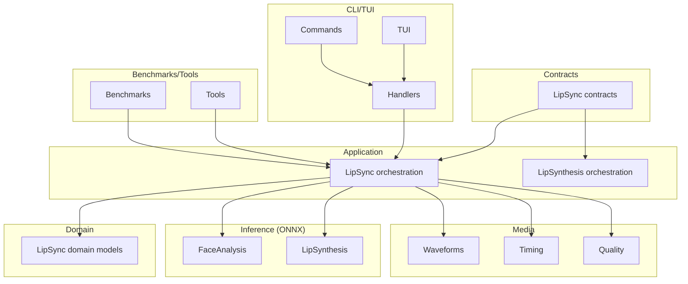
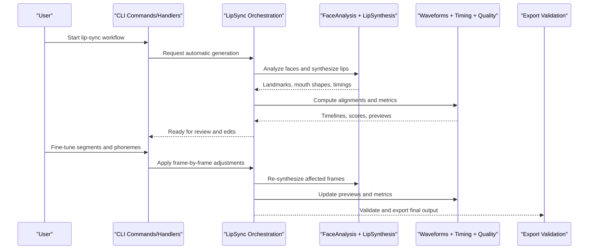
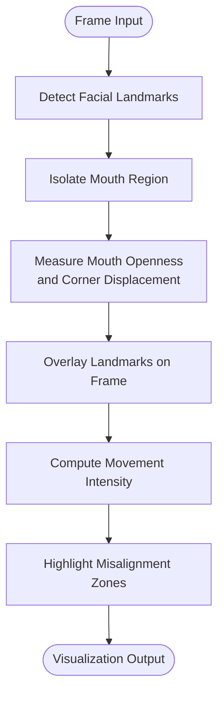
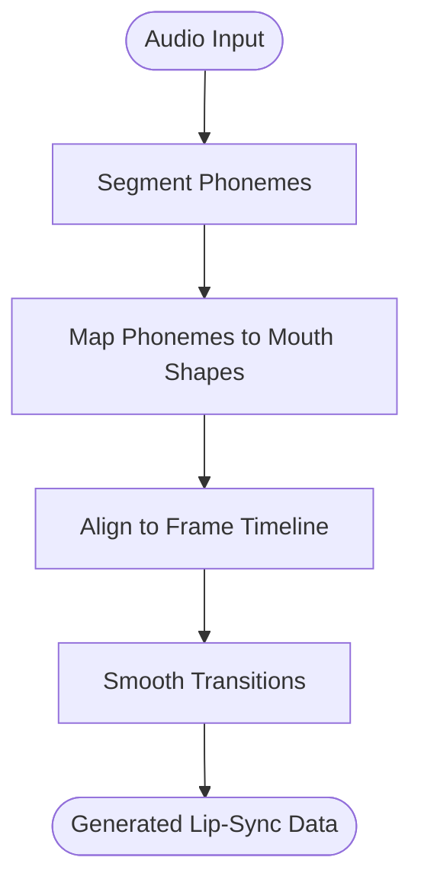
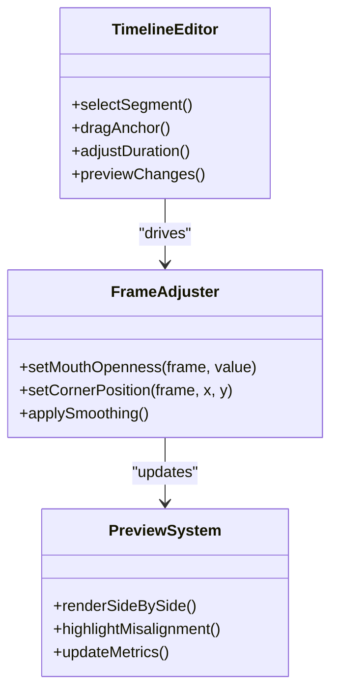
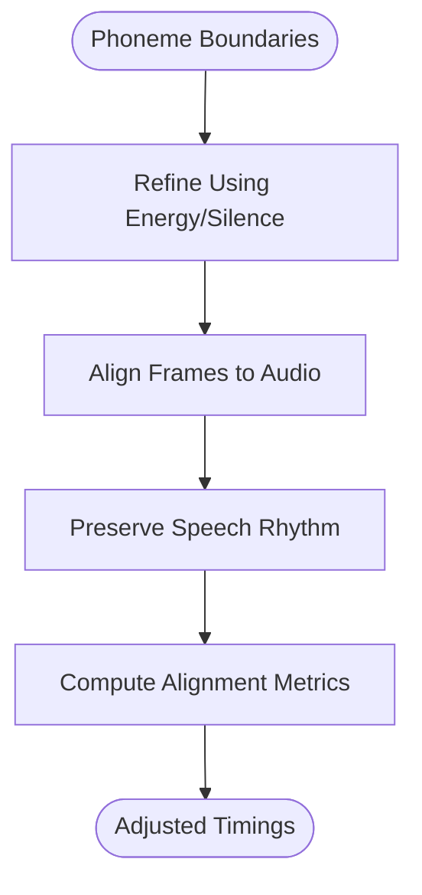
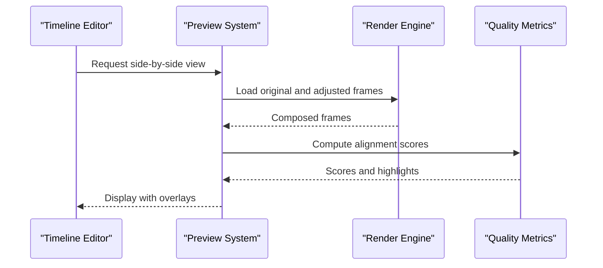
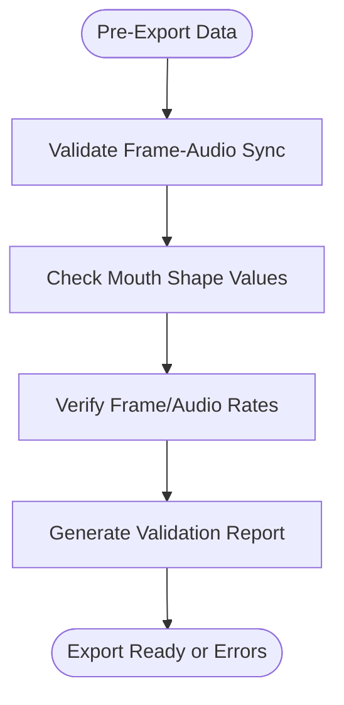
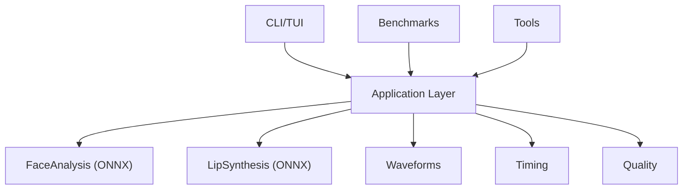

# Lip-Sync Adjustment & Quality Control

<cite>
**Referenced Files in This Document**
- [Trackdub.Application/LipSync](file://src/Trackdub.Application/LipSync)
- [Trackdub.Application/LipSynthesis](file://src/Trackdub.Application/LipSynthesis)
- [Trackdub.Contracts/LipSync](file://src/Trackdub.Contracts/LipSync)
- [Trackdub.Domain/LipSync](file://src/Trackdub.Domain/LipSync)
- [Trackdub.Inference.Onnx/FaceAnalysis](file://src/Trackdub.Inference.Onnx/FaceAnalysis)
- [Trackdub.Inference.Onnx/LipSynthesis](file://src/Trackdub.Inference.Onnx/LipSynthesis)
- [Trackdub.Media/Waveforms](file://src/Trackdub.Media/Waveforms)
- [Trackdub.Media/Timing](file://src/Trackdub.Media/Timing)
- [Trackdub.Media/Quality](file://src/Trackdub.Media/Quality)
- [Trackdub.Benchmarks](file://src/Trackdub.Benchmarks)
- [Trackdub.Cli/Commands](file://src/Trackdub.Cli/Commands)
- [Trackdub.Cli/Handlers](file://src/Trackdub.Cli/Handlers)
- [Trackdub.Cli/Tui](file://src/Trackdub.Cli/Tui)
- [Trackdub.Tools](file://src/Trackdub.Tools)
</cite>

## Table of Contents
1. Introduction
2. Project Structure
3. Core Components
4. Architecture Overview
5. Detailed Component Analysis
6. Dependency Analysis
7. Performance Considerations
8. Troubleshooting Guide
9. Conclusion

## Introduction
This document explains the lip-sync adjustment and quality control capabilities available in the project, focusing on:
- Facial landmark visualization for precise mouth movement analysis
- Automatic lip-sync generation from audio and transcripts
- Manual fine-tuning tools for frame-by-frame adjustments
- Timing adjustments, phoneme alignment, and natural speech rhythm preservation
- Preview system, side-by-side comparison, and export validation
- Quality assessment metrics and benchmarking procedures
- Common issues and performance optimization tips

The goal is to help users achieve accurate, natural-looking lip movements synchronized with dialogue while maintaining high visual and audio quality.

## Project Structure
Lip-sync functionality spans multiple layers:
- Contracts define interfaces and data models for lip-sync operations
- Application layer orchestrates stages and services
- Domain layer encapsulates core business logic and entities
- Inference layer provides ONNX-based face analysis and lip synthesis
- Media layer handles waveforms, timing, and quality utilities
- CLI and TUI provide interactive workflows and commands
- Benchmarks and Tools support evaluation and diagnostics

**Diagram sources**
- [Trackdub.Contracts/LipSync](file://src/Trackdub.Contracts/LipSync)
- [Trackdub.Application/LipSync](file://src/Trackdub.Application/LipSync)
- [Trackdub.Application/LipSynthesis](file://src/Trackdub.Application/LipSynthesis)
- [Trackdub.Domain/LipSync](file://src/Trackdub.Domain/LipSync)
- [Trackdub.Inference.Onnx/FaceAnalysis](file://src/Trackdub.Inference.Onnx/FaceAnalysis)
- [Trackdub.Inference.Onnx/LipSynthesis](file://src/Trackdub.Inference.Onnx/LipSynthesis)
- [Trackdub.Media/Waveforms](file://src/Trackdub.Media/Waveforms)
- [Trackdub.Media/Timing](file://src/Trackdub.Media/Timing)
- [Trackdub.Media/Quality](file://src/Trackdub.Media/Quality)
- [Trackdub.Cli/Commands](file://src/Trackdub.Cli/Commands)
- [Trackdub.Cli/Handlers](file://src/Trackdub.Cli/Handlers)
- [Trackdub.Cli/Tui](file://src/Trackdub.Cli/Tui)
- [Trackdub.Benchmarks](file://src/Trackdub.Benchmarks)
- [Trackdub.Tools](file://src/Trackdub.Tools)

**Section sources**
- [Trackdub.Contracts/LipSync](file://src/Trackdub.Contracts/LipSync)
- [Trackdub.Application/LipSync](file://src/Trackdub.Application/LipSync)
- [Trackdub.Application/LipSynthesis](file://src/Trackdub.Application/LipSynthesis)
- [Trackdub.Domain/LipSync](file://src/Trackdub.Domain/LipSync)
- [Trackdub.Inference.Onnx/FaceAnalysis](file://src/Trackdub.Inference.Onnx/FaceAnalysis)
- [Trackdub.Inference.Onnx/LipSynthesis](file://src/Trackdub.Inference.Onnx/LipSynthesis)
- [Trackdub.Media/Waveforms](file://src/Trackdub.Media/Waveforms)
- [Trackdub.Media/Timing](file://src/Trackdub.Media/Timing)
- [Trackdub.Media/Quality](file://src/Trackdub.Media/Quality)
- [Trackdub.Cli/Commands](file://src/Trackdub.Cli/Commands)
- [Trackdub.Cli/Handlers](file://src/Trackdub.Cli/Handlers)
- [Trackdub.Cli/Tui](file://src/Trackdub.Cli/Tui)
- [Trackdub.Benchmarks](file://src/Trackdub.Benchmarks)
- [Trackdub.Tools](file://src/Trackdub.Tools)

## Core Components
- LipSync contracts and domain models define the data structures and operations for lip-sync tasks, including segment boundaries, phoneme timings, and mouth shape parameters.
- Application-level LipSync and LipSynthesis orchestrate processing stages, manage state transitions, and coordinate inference calls.
- FaceAnalysis provides facial landmark detection and mouth region extraction for visualization and analysis.
- LipSynthesis generates mouth motion sequences aligned to audio segments and phonemes.
- Waveforms and Timing utilities visualize audio energy and compute precise frame-to-audio alignments.
- Quality utilities assess lip-sync accuracy and naturalness through measurable metrics.
- CLI commands and handlers expose user workflows for automatic generation and manual refinement.
- Benchmarks and Tools enable performance measurement and diagnostic inspection.

Key responsibilities:
- Automatic lip-sync generation from audio and transcript inputs
- Frame-by-frame adjustment via timeline editing and phoneme anchors
- Visualization of landmarks and mouth movement intensity
- Side-by-side preview and comparison of original vs adjusted results
- Export validation ensuring consistency between video frames and audio tracks

**Section sources**
- [Trackdub.Contracts/LipSync](file://src/Trackdub.Contracts/LipSync)
- [Trackdub.Application/LipSync](file://src/Trackdub.Application/LipSync)
- [Trackdub.Application/LipSynthesis](file://src/Trackdub.Application/LipSynthesis)
- [Trackdub.Domain/LipSync](file://src/Trackdub.Domain/LipSync)
- [Trackdub.Inference.Onnx/FaceAnalysis](file://src/Trackdub.Inference.Onnx/FaceAnalysis)
- [Trackdub.Inference.Onnx/LipSynthesis](file://src/Trackdub.Inference.Onnx/LipSynthesis)
- [Trackdub.Media/Waveforms](file://src/Trackdub.Media/Waveforms)
- [Trackdub.Media/Timing](file://src/Trackdub.Media/Timing)
- [Trackdub.Media/Quality](file://src/Trackdub.Media/Quality)
- [Trackdub.Cli/Commands](file://src/Trackdub.Cli/Commands)
- [Trackdub.Cli/Handlers](file://src/Trackdub.Cli/Handlers)
- [Trackdub.Cli/Tui](file://src/Trackdub.Cli/Tui)
- [Trackdub.Benchmarks](file://src/Trackdub.Benchmarks)
- [Trackdub.Tools](file://src/Trackdub.Tools)

## Architecture Overview
The lip-sync pipeline integrates audio analysis, face modeling, and video rendering:
- Audio input is segmented and analyzed for phoneme timing and energy peaks
- Face analysis extracts landmarks and mouth geometry per frame
- Lip synthesis computes mouth shapes aligned to phonemes and timing
- Adjustments are applied at frame granularity, preserving natural speech rhythm
- Preview renders side-by-side comparisons and highlights misalignments
- Export validates synchronization and produces final assets

**Diagram sources**
- [Trackdub.Cli/Commands](file://src/Trackdub.Cli/Commands)
- [Trackdub.Cli/Handlers](file://src/Trackdub.Cli/Handlers)
- [Trackdub.Application/LipSync](file://src/Trackdub.Application/LipSync)
- [Trackdub.Inference.Onnx/FaceAnalysis](file://src/Trackdub.Inference.Onnx/FaceAnalysis)
- [Trackdub.Inference.Onnx/LipSynthesis](file://src/Trackdub.Inference.Onnx/LipSynthesis)
- [Trackdub.Media/Waveforms](file://src/Trackdub.Media/Waveforms)
- [Trackdub.Media/Timing](file://src/Trackdub.Media/Timing)
- [Trackdub.Media/Quality](file://src/Trackdub.Media/Quality)

## Detailed Component Analysis

### Facial Landmark Visualization and Mouth Movement Analysis
- Face analysis detects facial landmarks and isolates mouth regions for each frame
- Landmarks are overlaid on video frames to visualize mouth opening, corner positions, and symmetry
- Mouth movement intensity is derived from landmark displacement and shape changes
- Visual indicators highlight potential misalignment zones where mouth motion does not match audio cues

**Diagram sources**
- [Trackdub.Inference.Onnx/FaceAnalysis](file://src/Trackdub.Inference.Onnx/FaceAnalysis)
- [Trackdub.Media/Waveforms](file://src/Trackdub.Media/Waveforms)

**Section sources**
- [Trackdub.Inference.Onnx/FaceAnalysis](file://src/Trackdub.Inference.Onnx/FaceAnalysis)
- [Trackdub.Media/Waveforms](file://src/Trackdub.Media/Waveforms)

### Automatic Lip-Sync Generation
- Audio segmentation identifies phoneme boundaries and energy peaks
- Phoneme-to-mouth-shape mapping generates initial lip movements
- Timing alignment ensures mouth shapes correspond to spoken segments
- Natural speech rhythm is preserved by smoothing transitions and avoiding abrupt changes

**Diagram sources**
- [Trackdub.Application/LipSync](file://src/Trackdub.Application/LipSync)
- [Trackdub.Application/LipSynthesis](file://src/Trackdub.Application/LipSynthesis)
- [Trackdub.Media/Timing](file://src/Trackdub.Media/Timing)

**Section sources**
- [Trackdub.Application/LipSync](file://src/Trackdub.Application/LipSync)
- [Trackdub.Application/LipSynthesis](file://src/Trackdub.Application/LipSynthesis)
- [Trackdub.Media/Timing](file://src/Trackdub.Media/Timing)

### Manual Fine-Tuning and Frame-by-Frame Adjustment
- Timeline editor allows dragging phoneme anchors and adjusting segment durations
- Frame-level controls enable precise modifications to mouth openness and corner positions
- Real-time preview updates reflect changes immediately
- Undo/redo supports iterative refinement without losing progress

**Diagram sources**
- [Trackdub.Cli/Tui](file://src/Trackdub.Cli/Tui)
- [Trackdub.Media/Waveforms](file://src/Trackdub.Media/Waveforms)
- [Trackdub.Media/Timing](file://src/Trackdub.Media/Timing)

**Section sources**
- [Trackdub.Cli/Tui](file://src/Trackdub.Cli/Tui)
- [Trackdub.Media/Waveforms](file://src/Trackdub.Media/Waveforms)
- [Trackdub.Media/Timing](file://src/Trackdub.Media/Timing)

### Timing Adjustments and Phoneme Alignment
- Phoneme boundaries are refined using audio energy and silence detection
- Frame-to-audio alignment ensures mouth shapes match spoken syllables
- Rhythm preservation avoids unnatural pauses or rushed articulation
- Metrics quantify alignment accuracy and suggest corrections

**Diagram sources**
- [Trackdub.Media/Timing](file://src/Trackdub.Media/Timing)
- [Trackdub.Media/Quality](file://src/Trackdub.Media/Quality)

**Section sources**
- [Trackdub.Media/Timing](file://src/Trackdub.Media/Timing)
- [Trackdub.Media/Quality](file://src/Trackdub.Media/Quality)

### Preview System and Side-by-Side Comparison
- Preview renders original and adjusted frames simultaneously
- Highlights indicate misaligned segments and low-confidence areas
- Interactive scrubbing allows detailed inspection of specific moments
- Metrics overlay shows real-time quality scores during adjustments

**Diagram sources**
- [Trackdub.Cli/Tui](file://src/Trackdub.Cli/Tui)
- [Trackdub.Media/Waveforms](file://src/Trackdub.Media/Waveforms)
- [Trackdub.Media/Quality](file://src/Trackdub.Media/Quality)

**Section sources**
- [Trackdub.Cli/Tui](file://src/Trackdub.Cli/Tui)
- [Trackdub.Media/Waveforms](file://src/Trackdub.Media/Waveforms)
- [Trackdub.Media/Quality](file://src/Trackdub.Media/Quality)

### Export Validation
- Validates synchronization between video frames and audio tracks
- Checks for missing or out-of-range mouth shape values
- Ensures consistent frame rates and audio sample rates
- Produces reports highlighting any discrepancies before final export

**Diagram sources**
- [Trackdub.Media/Timing](file://src/Trackdub.Media/Timing)
- [Trackdub.Media/Quality](file://src/Trackdub.Media/Quality)

**Section sources**
- [Trackdub.Media/Timing](file://src/Trackdub.Media/Timing)
- [Trackdub.Media/Quality](file://src/Trackdub.Media/Quality)

## Dependency Analysis
Lip-sync components depend on inference models, media utilities, and UI layers:
- FaceAnalysis and LipSynthesis rely on ONNX runtime for efficient computation
- Waveforms and Timing provide foundational audio and frame alignment utilities
- Quality metrics integrate with preview and export systems for feedback loops
- CLI and TUI orchestrate user interactions and command execution

**Diagram sources**
- [Trackdub.Application/LipSync](file://src/Trackdub.Application/LipSync)
- [Trackdub.Inference.Onnx/FaceAnalysis](file://src/Trackdub.Inference.Onnx/FaceAnalysis)
- [Trackdub.Inference.Onnx/LipSynthesis](file://src/Trackdub.Inference.Onnx/LipSynthesis)
- [Trackdub.Media/Waveforms](file://src/Trackdub.Media/Waveforms)
- [Trackdub.Media/Timing](file://src/Trackdub.Media/Timing)
- [Trackdub.Media/Quality](file://src/Trackdub.Media/Quality)
- [Trackdub.Cli/Commands](file://src/Trackdub.Cli/Commands)
- [Trackdub.Cli/Handlers](file://src/Trackdub.Cli/Handlers)
- [Trackdub.Cli/Tui](file://src/Trackdub.Cli/Tui)
- [Trackdub.Benchmarks](file://src/Trackdub.Benchmarks)
- [Trackdub.Tools](file://src/Trackdub.Tools)

**Section sources**
- [Trackdub.Application/LipSync](file://src/Trackdub.Application/LipSync)
- [Trackdub.Inference.Onnx/FaceAnalysis](file://src/Trackdub.Inference.Onnx/FaceAnalysis)
- [Trackdub.Inference.Onnx/LipSynthesis](file://src/Trackdub.Inference.Onnx/LipSynthesis)
- [Trackdub.Media/Waveforms](file://src/Trackdub.Media/Waveforms)
- [Trackdub.Media/Timing](file://src/Trackdub.Media/Timing)
- [Trackdub.Media/Quality](file://src/Trackdub.Media/Quality)
- [Trackdub.Cli/Commands](file://src/Trackdub.Cli/Commands)
- [Trackdub.Cli/Handlers](file://src/Trackdub.Cli/Handlers)
- [Trackdub.Cli/Tui](file://src/Trackdub.Cli/Tui)
- [Trackdub.Benchmarks](file://src/Trackdub.Benchmarks)
- [Trackdub.Tools](file://src/Trackdub.Tools)

## Performance Considerations
- Use GPU acceleration for face analysis and lip synthesis when available
- Batch process frames to reduce overhead during large-scale adjustments
- Cache intermediate results like landmarks and mouth shapes to avoid recomputation
- Optimize audio segmentation parameters for faster phoneme detection
- Limit preview resolution during interactive editing to improve responsiveness
- Profile memory usage to prevent bottlenecks during long sessions

[No sources needed since this section provides general guidance]

## Troubleshooting Guide
Common lip-sync issues and resolutions:
- Misaligned phonemes: Recalculate boundaries using energy thresholds and silence gaps
- Unnatural mouth movements: Apply smoothing filters and adjust transition speeds
- Poor landmark detection: Improve lighting conditions or use higher-resolution frames
- Export errors: Verify frame rate consistency and validate mouth shape ranges
- Slow performance: Enable hardware acceleration and reduce batch sizes

Diagnostic steps:
- Inspect waveform and timing overlays for anomalies
- Review quality metrics for low-scoring segments
- Compare original and adjusted previews to identify discrepancies
- Use benchmarks to measure performance regressions

**Section sources**
- [Trackdub.Media/Quality](file://src/Trackdub.Media/Quality)
- [Trackdub.Benchmarks](file://src/Trackdub.Benchmarks)
- [Trackdub.Tools](file://src/Trackdub.Tools)

## Conclusion
The lip-sync adjustment and quality control system provides a comprehensive toolkit for achieving accurate and natural-looking mouth movements synchronized with dialogue. By combining automatic generation, manual fine-tuning, visualization, and robust validation, users can produce high-quality lip-synced content efficiently. Continuous benchmarking and troubleshooting ensure optimal performance and reliability across diverse scenarios.

[No sources needed since this section summarizes without analyzing specific files]