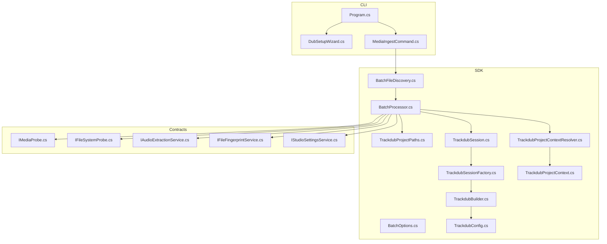
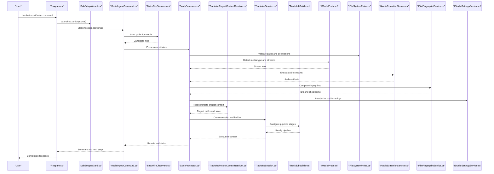
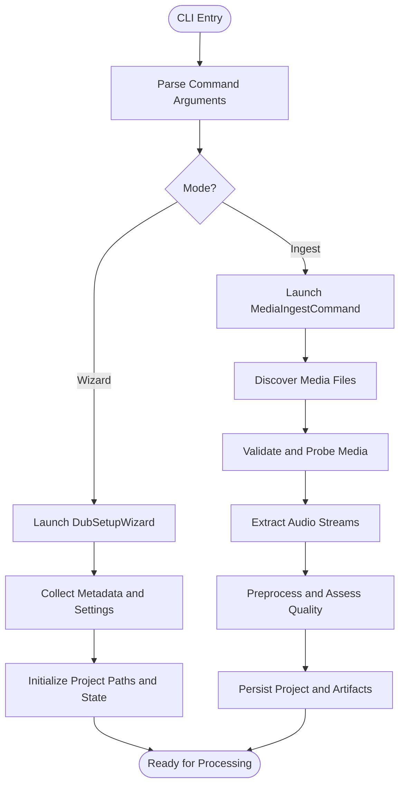
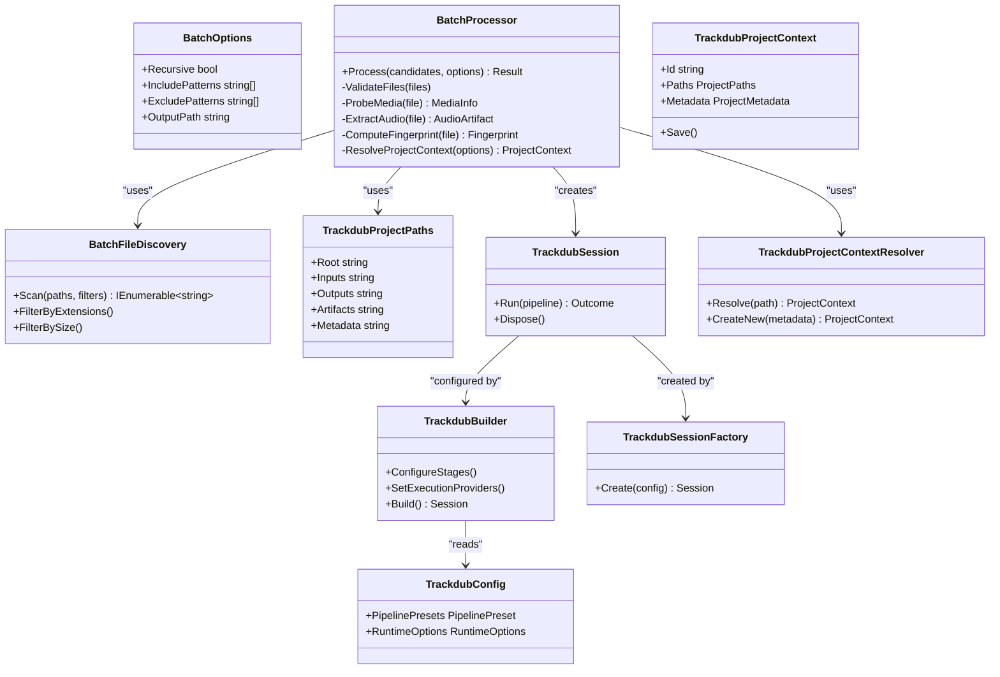
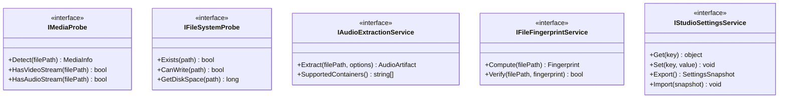
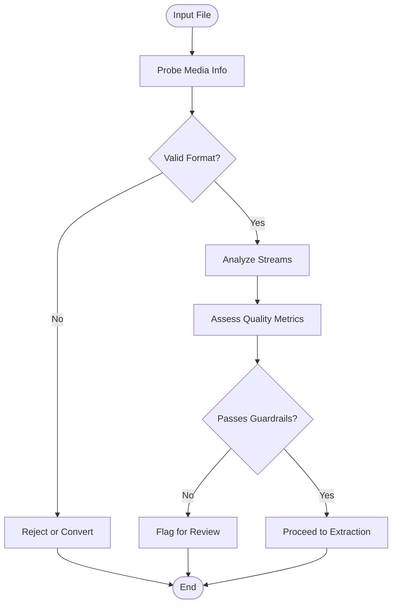
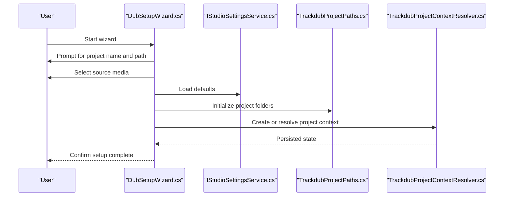
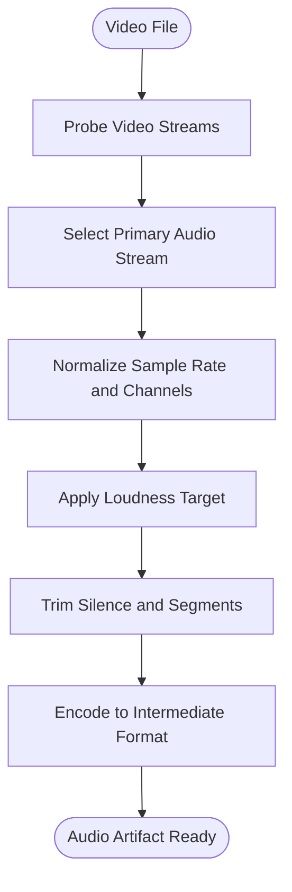
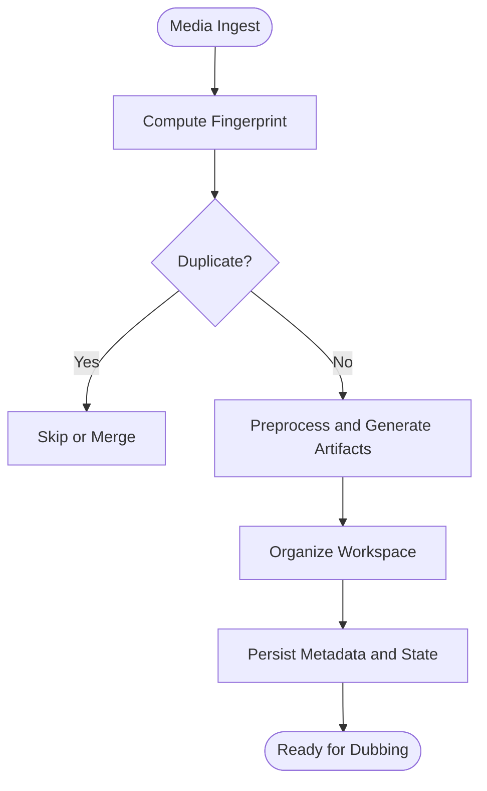
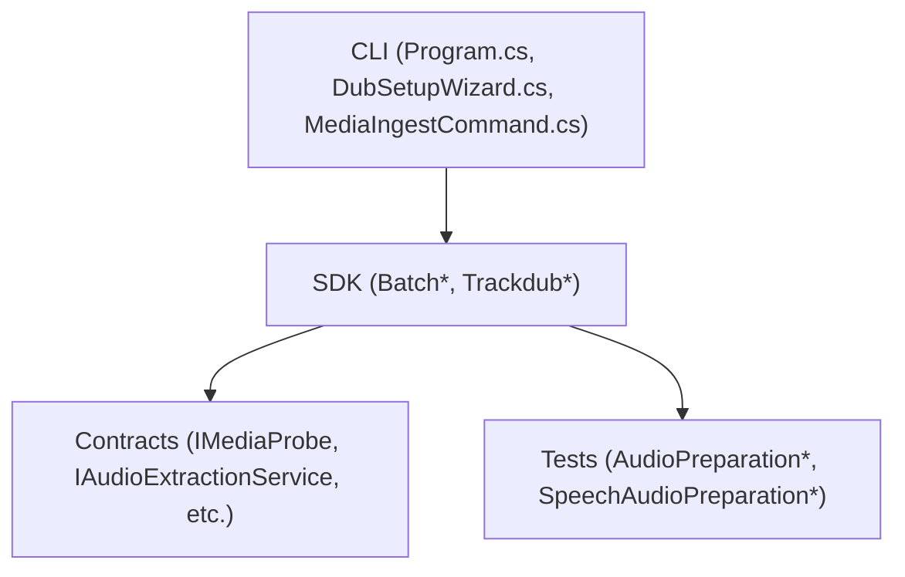

# Media Import & Setup

<cite>
**Referenced Files in This Document**
- [MediaIngestCommand.cs](file://src/Trackdub.Tools/MediaIngestCommand.cs)
- [Program.cs](file://src/Trackdub.Cli/Program.cs)
- [DubSetupWizard.cs](file://src/Trackdub.Cli/DubSetupWizard.cs)
- [BatchFileDiscovery.cs](file://src/Trackdub.Sdk/BatchFileDiscovery.cs)
- [BatchOptions.cs](file://src/Trackdub.Sdk/BatchOptions.cs)
- [BatchProcessor.cs](file://src/Trackdub.Sdk/BatchProcessor.cs)
- [TrackdubProjectPaths.cs](file://src/Trackdub.Sdk/TrackdubProjectPaths.cs)
- [IMediaProbe.cs](file://src/Trackdub.Contracts/IMediaProbe.cs)
- [IFileSystemProbe.cs](file://src/Trackdub.Contracts/IFileSystemProbe.cs)
- [IAudioExtractionService.cs](file://src/Trackdub.Contracts/IAudioExtractionService.cs)
- [IFileFingerprintService.cs](file://src/Trackdub.Contracts/IFileFingerprintService.cs)
- [IStudioSettingsService.cs](file://src/Trackdub.Contracts/IStudioSettingsService.cs)
- [TrackdubBuilder.cs](file://src/Trackdub.Sdk/TrackdubBuilder.cs)
- [TrackdubConfig.cs](file://src/Trackdub.Sdk/TrackdubConfig.cs)
- [TrackdubSession.cs](file://src/Trackdub.Sdk/TrackdubSession.cs)
- [TrackdubSessionFactory.cs](file://src/Trackdub.Sdk/TrackdubSessionFactory.cs)
- [TrackdubProjectContextResolver.cs](file://src/Trackdub.Sdk/TrackdubProjectContextResolver.cs)
- [TrackdubProjectContext.cs](file://src/Trackdub.Sdk/TrackdubProjectContext.cs)
- [AudioPreparationTests.cs](file://tests/Trackdub.Application.Tests/AudioPreparationTests.cs)
- [SpeechAudioPreparationGuardrailTests.cs](file://tests/Trackdub.Application.Tests/SpeechAudioPreparationGuardrailTests.cs)
- [ProjectMediaIngestServiceTests.cs](file://tests/Trackdub.Application.Tests/ProjectMediaIngestServiceTests.cs)
</cite>

## Table of Contents
1. [Introduction](#introduction)
2. [Project Structure](#project-structure)
3. [Core Components](#core-components)
4. [Architecture Overview](#architecture-overview)
5. [Detailed Component Analysis](#detailed-component-analysis)
6. [Dependency Analysis](#dependency-analysis)
7. [Performance Considerations](#performance-considerations)
8. [Troubleshooting Guide](#troubleshooting-guide)
9. [Conclusion](#conclusion)

## Introduction
This document explains Trackdub’s media import and setup process for interactive dubbing workflows. It covers supported file formats, automatic media detection, quality assessment during import, the project creation wizard, metadata configuration, initial settings, audio extraction options, video format handling, preprocessing steps, workspace organization, and performance optimization for large files. It also provides guidance on common import issues, error recovery strategies, and best practices for organizing assets.

## Project Structure
The media import and setup flow spans several layers:
- CLI entry points and wizards for user-driven setup
- SDK orchestration for batch discovery, session/project context resolution, and processing pipelines
- Contracts that define interfaces for probing, extraction, fingerprinting, and settings
- Domain and application services that perform validation, preparation, and quality checks
- Tools for one-off ingestion tasks

**Diagram sources**
- [Program.cs](file://src/Trackdub.Cli/Program.cs)
- [DubSetupWizard.cs](file://src/Trackdub.Cli/DubSetupWizard.cs)
- [MediaIngestCommand.cs](file://src/Trackdub.Tools/MediaIngestCommand.cs)
- [BatchFileDiscovery.cs](file://src/Trackdub.Sdk/BatchFileDiscovery.cs)
- [BatchOptions.cs](file://src/Trackdub.Sdk/BatchOptions.cs)
- [BatchProcessor.cs](file://src/Trackdub.Sdk/BatchProcessor.cs)
- [TrackdubProjectPaths.cs](file://src/Trackdub.Sdk/TrackdubProjectPaths.cs)
- [TrackdubBuilder.cs](file://src/Trackdub.Sdk/TrackdubBuilder.cs)
- [TrackdubConfig.cs](file://src/Trackdub.Sdk/TrackdubConfig.cs)
- [TrackdubSession.cs](file://src/Trackdub.Sdk/TrackdubSession.cs)
- [TrackdubSessionFactory.cs](file://src/Trackdub.Sdk/TrackdubSessionFactory.cs)
- [TrackdubProjectContextResolver.cs](file://src/Trackdub.Sdk/TrackdubProjectContextResolver.cs)
- [TrackdubProjectContext.cs](file://src/Trackdub.Sdk/TrackdubProjectContext.cs)
- [IMediaProbe.cs](file://src/Trackdub.Contracts/IMediaProbe.cs)
- [IFileSystemProbe.cs](file://src/Trackdub.Contracts/IFileSystemProbe.cs)
- [IAudioExtractionService.cs](file://src/Trackdub.Contracts/IAudioExtractionService.cs)
- [IFileFingerprintService.cs](file://src/Trackdub.Contracts/IFileFingerprintService.cs)
- [IStudioSettingsService.cs](file://src/Trackdub.Contracts/IStudioSettingsService.cs)

**Section sources**
- [Program.cs](file://src/Trackdub.Cli/Program.cs)
- [DubSetupWizard.cs](file://src/Trackdub.Cli/DubSetupWizard.cs)
- [MediaIngestCommand.cs](file://src/Trackdub.Tools/MediaIngestCommand.cs)
- [BatchFileDiscovery.cs](file://src/Trackdub.Sdk/BatchFileDiscovery.cs)
- [BatchOptions.cs](file://src/Trackdub.Sdk/BatchOptions.cs)
- [BatchProcessor.cs](file://src/Trackdub.Sdk/BatchProcessor.cs)
- [TrackdubProjectPaths.cs](file://src/Trackdub.Sdk/TrackdubProjectPaths.cs)
- [TrackdubBuilder.cs](file://src/Trackdub.Sdk/TrackdubBuilder.cs)
- [TrackdubConfig.cs](file://src/Trackdub.Sdk/TrackdubConfig.cs)
- [TrackdubSession.cs](file://src/Trackdub.Sdk/TrackdubSession.cs)
- [TrackdubSessionFactory.cs](file://src/Trackdub.Sdk/TrackdubSessionFactory.cs)
- [TrackdubProjectContextResolver.cs](file://src/Trackdub.Sdk/TrackdubProjectContextResolver.cs)
- [TrackdubProjectContext.cs](file://src/Trackdub.Sdk/TrackdubProjectContext.cs)
- [IMediaProbe.cs](file://src/Trackdub.Contracts/IMediaProbe.cs)
- [IFileSystemProbe.cs](file://src/Trackdub.Contracts/IFileSystemProbe.cs)
- [IAudioExtractionService.cs](file://src/Trackdub.Contracts/IAudioExtractionService.cs)
- [IFileFingerprintService.cs](file://src/Trackdub.Contracts/IFileFingerprintService.cs)
- [IStudioSettingsService(IStudioSettingsService.cs)](file://src/Trackdub.Contracts/IStudioSettingsService.cs)

## Core Components
- CLI Entry Points
  - Program orchestrates command routing and launches wizards or tools.
  - DubSetupWizard guides users through project creation, metadata, and initial settings.
  - MediaIngestCommand performs one-shot ingestion with configurable options.

- SDK Orchestration
  - BatchFileDiscovery scans directories to find candidate media files.
  - BatchProcessor coordinates discovery, validation, extraction, and preprocessing.
  - TrackdubProjectPaths defines canonical folder layout for projects and artifacts.
  - TrackdubBuilder/Config configure pipeline stages, providers, and runtime options.
  - TrackdubSession/Factory manage lifecycle and context per run.
  - TrackdubProjectContextResolver/Context resolve and persist project state.

- Contracts
  - IMediaProbe and IFileSystemProbe provide media and filesystem introspection.
  - IAudioExtractionService handles audio stream extraction from containers.
  - IFileFingerprintService computes stable identifiers for deduplication and integrity.
  - IStudioSettingsService manages global and per-project settings.

**Section sources**
- [Program.cs](file://src/Trackdub.Cli/Program.cs)
- [DubSetupWizard.cs](file://src/Trackdub.Cli/DubSetupWizard.cs)
- [MediaIngestCommand.cs](file://src/Trackdub.Tools/MediaIngestCommand.cs)
- [BatchFileDiscovery.cs](file://src/Trackdub.Sdk/BatchFileDiscovery.cs)
- [BatchOptions.cs](file://src/Trackdub.Sdk/BatchOptions.cs)
- [BatchProcessor.cs](file://src/Trackdub.Sdk/BatchProcessor.cs)
- [TrackdubProjectPaths.cs](file://src/Trackdub.Sdk/TrackdubProjectPaths.cs)
- [TrackdubBuilder.cs](file://src/Trackdub.Sdk/TrackdubBuilder.cs)
- [TrackdubConfig.cs](file://src/Trackdub.Sdk/TrackdubConfig.cs)
- [TrackdubSession.cs](file://src/Trackdub.Sdk/TrackdubSession.cs)
- [TrackdubSessionFactory.cs](file://src/Trackdub.Sdk/TrackdubSessionFactory.cs)
- [TrackdubProjectContextResolver.cs](file://src/Trackdub.Sdk/TrackdubProjectContextResolver.cs)
- [TrackdubProjectContext.cs](file://src/Trackdub.Sdk/TrackdubProjectContext.cs)
- [IMediaProbe.cs](file://src/Trackdub.Contracts/IMediaProbe.cs)
- [IFileSystemProbe.cs](file://src/Trackdub.Contracts/IFileSystemProbe.cs)
- [IAudioExtractionService.cs](file://src/Trackdub.Contracts/IAudioExtractionService.cs)
- [IFileFingerprintService.cs](file://src/Trackdub.Contracts/IFileFingerprintService.cs)
- [IStudioSettingsService.cs](file://src/Trackdub.Contracts/IStudioSettingsService.cs)

## Architecture Overview
The import and setup architecture follows a layered approach:
- User interaction via CLI commands and wizards
- Discovery and validation of media assets
- Extraction and preprocessing (audio/video)
- Quality assessment and guardrails
- Project initialization and persistence
- Pipeline configuration and execution readiness

**Diagram sources**
- [Program.cs](file://src/Trackdub.Cli/Program.cs)
- [DubSetupWizard.cs](file://src/Trackdub.Cli/DubSetupWizard.cs)
- [MediaIngestCommand.cs](file://src/Trackdub.Tools/MediaIngestCommand.cs)
- [BatchFileDiscovery.cs](file://src/Trackdub.Sdk/BatchFileDiscovery.cs)
- [BatchProcessor.cs](file://src/Trackdub.Sdk/BatchProcessor.cs)
- [TrackdubProjectContextResolver.cs](file://src/Trackdub.Sdk/TrackdubProjectContextResolver.cs)
- [TrackdubSession.cs](file://src/Trackdub.Sdk/TrackdubSession.cs)
- [TrackdubBuilder.cs](file://src/Trackdub.Sdk/TrackdubBuilder.cs)
- [IMediaProbe.cs](file://src/Trackdub.Contracts/IMediaProbe.cs)
- [IFileSystemProbe.cs](file://src/Trackdub.Contracts/IFileSystemProbe.cs)
- [IAudioExtractionService.cs](file://src/Trackdub.Contracts/IAudioExtractionService.cs)
- [IFileFingerprintService.cs](file://src/Trackdub.Contracts/IFileFingerprintService.cs)
- [IStudioSettingsService.cs](file://src/Trackdub.Contracts/IStudioSettingsService.cs)

## Detailed Component Analysis

### CLI Entry Points and Wizards
- Program coordinates command parsing and delegates to wizards or tools.
- DubSetupWizard walks users through:
  - Selecting source media
  - Creating or selecting a project directory
  - Configuring metadata (title, language, description)
  - Setting initial preferences (output format, loudness target, etc.)
- MediaIngestCommand supports non-interactive ingestion with flags for:
  - Input paths and filters
  - Output directory structure
  - Extraction and preprocessing options

**Diagram sources**
- [Program.cs](file://src/Trackdub.Cli/Program.cs)
- [DubSetupWizard.cs](file://src/Trackdub.Cli/DubSetupWizard.cs)
- [MediaIngestCommand.cs](file://src/Trackdub.Tools/MediaIngestCommand.cs)

**Section sources**
- [Program.cs](file://src/Trackdub.Cli/Program.cs)
- [DubSetupWizard.cs](file://src/Trackdub.Cli/DubSetupWizard.cs)
- [MediaIngestCommand.cs](file://src/Trackdub.Tools/MediaIngestCommand.cs)

### SDK Orchestration: Discovery, Processing, and Context Resolution
- BatchFileDiscovery enumerates directories and applies filters to identify candidate media files.
- BatchOptions configures behavior such as recursion, inclusion/exclusion patterns, and output targets.
- BatchProcessor orchestrates:
  - Filesystem validation
  - Media probing and stream detection
  - Audio extraction and preprocessing
  - Fingerprinting for deduplication and integrity
  - Project context resolution and persistence
- TrackdubProjectPaths standardizes folder layout for inputs, outputs, artifacts, and metadata.
- TrackdubBuilder/Config set up pipeline stages, execution providers, and runtime options.
- TrackdubSession/Factory manage per-run lifecycle and resource management.
- TrackdubProjectContextResolver/Context resolve existing projects or create new ones based on inputs.

**Diagram sources**
- [BatchFileDiscovery.cs](file://src/Trackdub.Sdk/BatchFileDiscovery.cs)
- [BatchOptions.cs](file://src/Trackdub.Sdk/BatchOptions.cs)
- [BatchProcessor.cs](file://src/Trackdub.Sdk/BatchProcessor.cs)
- [TrackdubProjectPaths.cs](file://src/Trackdub.Sdk/TrackdubProjectPaths.cs)
- [TrackdubBuilder.cs](file://src/Trackdub.Sdk/TrackdubBuilder.cs)
- [TrackdubConfig.cs](file://src/Trackdub.Sdk/TrackdubConfig.cs)
- [TrackdubSession.cs](file://src/Trackdub.Sdk/TrackdubSession.cs)
- [TrackdubSessionFactory.cs](file://src/Trackdub.Sdk/TrackdubSessionFactory.cs)
- [TrackdubProjectContextResolver.cs](file://src/Trackdub.Sdk/TrackdubProjectContextResolver.cs)
- [TrackdubProjectContext.cs](file://src/Trackdub.Sdk/TrackdubProjectContext.cs)

**Section sources**
- [BatchFileDiscovery.cs](file://src/Trackdub.Sdk/BatchFileDiscovery.cs)
- [BatchOptions.cs](file://src/Trackdub.Sdk/BatchOptions.cs)
- [BatchProcessor.cs](file://src/Trackdub.Sdk/BatchProcessor.cs)
- [TrackdubProjectPaths.cs](file://src/Trackdub.Sdk/TrackdubProjectPaths.cs)
- [TrackdubBuilder.cs](file://src/Trackdub.Sdk/TrackdubBuilder.cs)
- [TrackdubConfig.cs](file://src/Trackdub.Sdk/TrackdubConfig.cs)
- [TrackdubSession.cs](file://src/Trackdub.Sdk/TrackdubSession.cs)
- [TrackdubSessionFactory.cs](file://src/Trackdub.Sdk/TrackdubSessionFactory.cs)
- [TrackdubProjectContextResolver.cs](file://src/Trackdub.Sdk/TrackdubProjectContextResolver.cs)
- [TrackdubProjectContext.cs](file://src/Trackdub.Sdk/TrackdubProjectContext.cs)

### Contracts: Probing, Extraction, Fingerprinting, and Settings
- IMediaProbe exposes methods to detect container formats, codecs, and stream types.
- IFileSystemProbe validates paths, permissions, and disk availability.
- IAudioExtractionService extracts audio streams from video containers into normalized formats.
- IFileFingerprintService computes stable identifiers and checksums for deduplication and integrity verification.
- IStudioSettingsService reads/writes global and per-project settings affecting import behavior.

**Diagram sources**
- [IMediaProbe.cs](file://src/Trackdub.Contracts/IMediaProbe.cs)
- [IFileSystemProbe.cs](file://src/Trackdub.Contracts/IFileSystemProbe.cs)
- [IAudioExtractionService.cs](file://src/Trackdub.Contracts/IAudioExtractionService.cs)
- [IFileFingerprintService.cs](file://src/Trackdub.Contracts/IFileFingerprintService.cs)
- [IStudioSettingsService.cs](file://src/Trackdub.Contracts/IStudioSettingsService.cs)

**Section sources**
- [IMediaProbe.cs](file://src/Trackdub.Contracts/IMediaProbe.cs)
- [IFileSystemProbe.cs](file://src/Trackdub.Contracts/IFileSystemProbe.cs)
- [IAudioExtractionService.cs](file://src/Trackdub.Contracts/IAudioExtractionService.cs)
- [IFileFingerprintService.cs](file://src/Trackdub.Contracts/IFileFingerprintService.cs)
- [IStudioSettingsService.cs](file://src/Trackdub.Contracts/IStudioSettingsService.cs)

### Supported Formats, Automatic Detection, and Quality Assessment
- Supported formats are determined by IMediaProbe and IAudioExtractionService implementations. Typical containers include widely used video/audio formats; codecs vary by platform and runtime.
- Automatic detection uses probe services to identify:
  - Container type and version
  - Presence and count of audio/video streams
  - Codec details and bitrates
  - Duration and sample rates
- Quality assessment includes:
  - Loudness normalization targets
  - Peak and RMS checks
  - Silence detection and segment trimming
  - Guardrails to reject or flag low-quality inputs

[No sources needed since this diagram shows conceptual workflow, not actual code structure]

**Section sources**
- [IMediaProbe.cs](file://src/Trackdub.Contracts/IMediaProbe.cs)
- [IAudioExtractionService.cs](file://src/Trackdub.Contracts/IAudioExtractionService.cs)
- [AudioPreparationTests.cs](file://tests/Trackdub.Application.Tests/AudioPreparationTests.cs)
- [SpeechAudioPreparationGuardrailTests.cs](file://tests/Trackdub.Application.Tests/SpeechAudioPreparationGuardrailTests.cs)

### Project Creation Wizard and Metadata Configuration
- The wizard collects:
  - Source media selection
  - Project name and root path
  - Language and target locale
  - Output preferences (format, loudness, bitrate)
  - Optional glossary or reference clips
- Metadata is persisted alongside project paths and settings for reproducibility.

**Diagram sources**
- [DubSetupWizard.cs](file://src/Trackdub.Cli/DubSetupWizard.cs)
- [IStudioSettingsService.cs](file://src/Trackdub.Contracts/IStudioSettingsService.cs)
- [TrackdubProjectPaths.cs](file://src/Trackdub.Sdk/TrackdubProjectPaths.cs)
- [TrackdubProjectContextResolver.cs](file://src/Trackdub.Sdk/TrackdubProjectContextResolver.cs)

**Section sources**
- [DubSetupWizard.cs](file://src/Trackdub.Cli/DubSetupWizard.cs)
- [IStudioSettingsService.cs](file://src/Trackdub.Contracts/IStudioSettingsService.cs)
- [TrackdubProjectPaths.cs](file://src/Trackdub.Sdk/TrackdubProjectPaths.cs)
- [TrackdubProjectContextResolver.cs](file://src/Trackdub.Sdk/TrackdubProjectContextResolver.cs)

### Audio Extraction Options and Video Format Handling
- Extraction options include:
  - Target sample rate and channel layout
  - Normalization and loudness targets
  - Segment trimming and silence removal
  - Codec selection for intermediate artifacts
- Video format handling involves:
  - Container probing and codec compatibility checks
  - Stream selection (primary audio track)
  - Fallback conversions when necessary

**Diagram sources**
- [IAudioExtractionService.cs](file://src/Trackdub.Contracts/IAudioExtractionService.cs)
- [IMediaProbe.cs](file://src/Trackdub.Contracts/IMediaProbe.cs)

**Section sources**
- [IAudioExtractionService.cs](file://src/Trackdub.Contracts/IAudioExtractionService.cs)
- [IMediaProbe.cs](file://src/Trackdub.Contracts/IMediaProbe.cs)

### Preprocessing Steps and Workspace Organization
- Preprocessing includes:
  - Fingerprint computation for deduplication
  - Quality checks and guardrails
  - Artifact generation (waveforms, summaries)
- Workspace organization follows TrackdubProjectPaths:
  - Inputs: original media
  - Outputs: final artifacts
  - Artifacts: intermediates and metadata
  - Metadata: project settings and logs

**Diagram sources**
- [IFileFingerprintService.cs](file://src/Trackdub.Contracts/IFileFingerprintService.cs)
- [TrackdubProjectPaths.cs](file://src/Trackdub.Sdk/TrackdubProjectPaths.cs)

**Section sources**
- [IFileFingerprintService.cs](file://src/Trackdub.Contracts/IFileFingerprintService.cs)
- [TrackdubProjectPaths.cs](file://src/Trackdub.Sdk/TrackdubProjectPaths.cs)

## Dependency Analysis
Key dependencies and relationships:
- CLI depends on SDK for orchestration and contracts for abstractions.
- SDK depends on contracts for probing, extraction, fingerprinting, and settings.
- Application tests validate preprocessing and guardrails.

**Diagram sources**
- [Program.cs](file://src/Trackdub.Cli/Program.cs)
- [DubSetupWizard.cs](file://src/Trackdub.Cli/DubSetupWizard.cs)
- [MediaIngestCommand.cs](file://src/Trackdub.Tools/MediaIngestCommand.cs)
- [BatchFileDiscovery.cs](file://src/Trackdub.Sdk/BatchFileDiscovery.cs)
- [BatchProcessor.cs](file://src/Trackdub.Sdk/BatchProcessor.cs)
- [TrackdubProjectPaths.cs](file://src/Trackdub.Sdk/TrackdubProjectPaths.cs)
- [IMediaProbe.cs](file://src/Trackdub.Contracts/IMediaProbe.cs)
- [IAudioExtractionService.cs](file://src/Trackdub.Contracts/IAudioExtractionService.cs)
- [AudioPreparationTests.cs](file://tests/Trackdub.Application.Tests/AudioPreparationTests.cs)
- [SpeechAudioPreparationGuardrailTests.cs](file://tests/Trackdub.Application.Tests/SpeechAudioPreparationGuardrailTests.cs)

**Section sources**
- [Program.cs](file://src/Trackdub.Cli/Program.cs)
- [DubSetupWizard.cs](file://src/Trackdub.Cli/DubSetupWizard.cs)
- [MediaIngestCommand.cs](file://src/Trackdub.Tools/MediaIngestCommand.cs)
- [BatchFileDiscovery.cs](file://src/Trackdub.Sdk/BatchFileDiscovery.cs)
- [BatchProcessor.cs](file://src/Trackdub.Sdk/BatchProcessor.cs)
- [TrackdubProjectPaths.cs](file://src/Trackdub.Sdk/TrackdubProjectPaths.cs)
- [IMediaProbe.cs](file://src/Trackdub.Contracts/IMediaProbe.cs)
- [IAudioExtractionService.cs](file://src/Trackdub.Contracts/IAudioExtractionService.cs)
- [AudioPreparationTests.cs](file://tests/Trackdub.Application.Tests/AudioPreparationTests.cs)
- [SpeechAudioPreparationGuardrailTests.cs](file://tests/Trackdub.Application.Tests/SpeechAudioPreparationGuardrailTests.cs)

## Performance Considerations
- Large file handling:
  - Use streaming extraction where possible to avoid loading entire files into memory.
  - Prefer lossless intermediate formats for speed and fidelity.
  - Enable parallel processing for independent segments when safe.
- Disk and I/O:
  - Ensure sufficient free space in output directories.
  - Use fast storage for temporary artifacts to reduce latency.
- GPU/CPU utilization:
  - Configure execution providers appropriately via TrackdubBuilder/Config.
  - Monitor device readiness and fallback gracefully.
- Caching and deduplication:
  - Leverage fingerprinting to skip redundant work.
  - Cache probe results for repeated operations.

[No sources needed since this section provides general guidance]

## Troubleshooting Guide
Common import issues and recovery strategies:
- Unsupported or corrupted files:
  - Verify container and codec support via IMediaProbe.
  - Attempt conversion or re-encode using external tools if necessary.
- Permission or path errors:
  - Use IFileSystemProbe to check existence and write permissions.
  - Adjust paths or run with appropriate privileges.
- Low-quality audio:
  - Review guardrail thresholds and adjust normalization targets.
  - Inspect waveforms and segment trimming results.
- Memory or performance issues:
  - Reduce concurrency or segment size.
  - Optimize execution provider settings.

**Section sources**
- [IMediaProbe.cs](file://src/Trackdub.Contracts/IMediaProbe.cs)
- [IFileSystemProbe.cs](file://src/Trackdub.Contracts/IFileSystemProbe.cs)
- [AudioPreparationTests.cs](file://tests/Trackdub.Application.Tests/AudioPreparationTests.cs)
- [SpeechAudioPreparationGuardrailTests.cs](file://tests/Trackdub.Application.Tests/SpeechAudioPreparationGuardrailTests.cs)
- [ProjectMediaIngestServiceTests.cs](file://tests/Trackdub.Application.Tests/ProjectMediaIngestServiceTests.cs)

## Conclusion
Trackdub’s media import and setup process combines robust CLI tools, flexible SDK orchestration, and well-defined contracts to deliver a reliable workflow for interactive dubbing. By leveraging automatic detection, quality assessment, and standardized project structures, users can efficiently prepare media assets for dubbing while maintaining control over metadata, settings, and performance characteristics.

[No sources needed since this section summarizes without analyzing specific files]