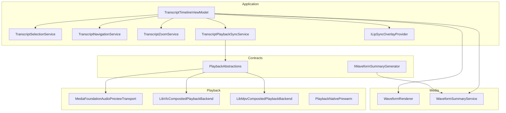
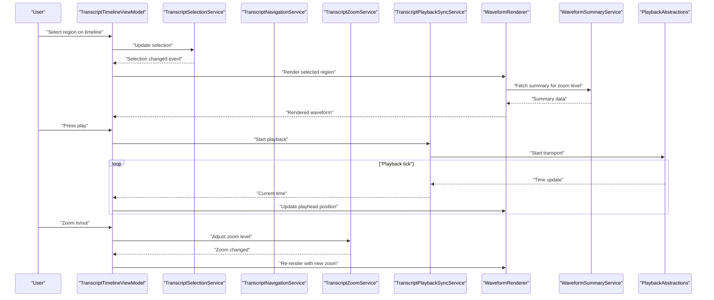
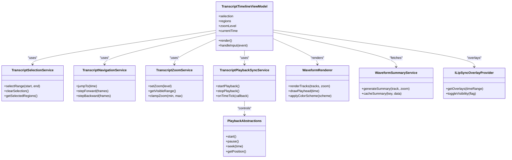

# Timeline Editor & Waveform Visualization

<cite>
**Referenced Files in This Document**
- [Trackdub.Application.csproj](file://src/Trackdub.Application/Trackdub.Application.csproj)
- [IWaveformSummaryGenerator.cs](file://src/Trackdub.Contracts/IWaveformSummaryGenerator.cs)
- [MediaFoundationAudioPreviewTransport.cs](file://src/Trackdub.Media.Playback/MediaFoundationAudioPreviewTransport.cs)
- [PlaybackAbstractions.cs](file://src/Trackdub.Media.Playback/PlaybackAbstractions.cs)
- [LibVlcCompositedPlaybackBackend.cs](file://src/Trackdub.Media.Playback/LibVlcCompositedPlaybackBackend.cs)
- [LibMpvCompositedPlaybackBackend.cs](file://src/Trackdub.Media.Playback/LibMpvCompositedPlaybackBackend.cs)
- [PlaybackNativePrewarm.cs](file://src/Trackdub.Media.Playback/PlaybackNativePrewarm.cs)
- [Waveforms/WaveformRenderer.cs](file://src/Trackdub.Media/Waveforms/WaveformRenderer.cs)
- [Waveforms/WaveformSummaryService.cs](file://src/Trackdub.Media/Waveforms/WaveformSummaryService.cs)
- [LipSync/ILipSyncOverlayProvider.cs](file://src/Trackdub.Application/LipSync/ILipSyncOverlayProvider.cs)
- [Transcripts/TranscriptTimelineViewModel.cs](file://src/Trackdub.Application/Transcripts/TranscriptTimelineViewModel.cs)
- [Transcripts/TranscriptSegment.cs](file://src/Trackdub.Application/Transcripts/TranscriptSegment.cs)
- [Transcripts/TranscriptRegion.cs](file://src/Trackdub.Application/Transcripts/TranscriptRegion.cs)
- [Transcripts/TranscriptSelectionService.cs](file://src/Trackdub.Application/Transcripts/TranscriptSelectionService.cs)
- [Transcripts/TranscriptNavigationService.cs](file://src/Trackdub.Application/Transcripts/TranscriptNavigationService.cs)
- [Transcripts/TranscriptZoomService.cs](file://src/Trackdub.Application/Transcripts/TranscriptZoomService.cs)
- [Transcripts/TranscriptPlaybackSyncService.cs](file://src/Trackdub.Application/Transcripts/TranscriptPlaybackSyncService.cs)
</cite>

## Table of Contents
1. [Introduction](#introduction)
2. [Project Structure](#project-structure)
3. [Core Components](#core-components)
4. [Architecture Overview](#architecture-overview)
5. [Detailed Component Analysis](#detailed-component-analysis)
6. [Dependency Analysis](#dependency-analysis)
7. [Performance Considerations](#performance-considerations)
8. [Troubleshooting Guide](#troubleshooting-guide)
9. [Conclusion](#conclusion)
10. [Appendices](#appendices)

## Introduction
This document explains the timeline editor and waveform visualization interface used for multi-track audio editing, precise alignment, and lip-sync workflows. It covers the multi-track timeline layout, zoom controls, navigation features, waveform display options, color coding for different audio types, real-time playback synchronization, selection tools, region marking, precise editing capabilities, lip-sync overlays, frame-by-frame analysis tools, visual alignment aids, keyboard shortcuts, mouse gestures, and productivity tips.

## Project Structure
The timeline and waveform features are implemented across several layers:
- Contracts define interfaces for waveform generation and playback abstractions.
- Application layer provides view models and services for timeline state, selection, navigation, zoom, and playback sync.
- Media layer implements waveform rendering and summary generation.
- Playback layer integrates with native backends (LibVLC, LibMpv, Media Foundation) to provide synchronized playback.

**Diagram sources**
- [IWaveformSummaryGenerator.cs](file://src/Trackdub.Contracts/IWaveformSummaryGenerator.cs)
- [PlaybackAbstractions.cs](file://src/Trackdub.Media.Playback/PlaybackAbstractions.cs)
- [TranscriptTimelineViewModel.cs](file://src/Trackdub.Application/Transcripts/TranscriptTimelineViewModel.cs)
- [TranscriptSelectionService.cs](file://src/Trackdub.Application/Transcripts/TranscriptSelectionService.cs)
- [TranscriptNavigationService.cs](file://src/Trackdub.Application/Transcripts/TranscriptNavigationService.cs)
- [TranscriptZoomService.cs](file://src/Trackdub.Application/Transcripts/TranscriptZoomService.cs)
- [TranscriptPlaybackSyncService.cs](file://src/Trackdub.Application/Transcripts/TranscriptPlaybackSyncService.cs)
- [ILipSyncOverlayProvider.cs](file://src/Trackdub.Application/LipSync/ILipSyncOverlayProvider.cs)
- [WaveformRenderer.cs](file://src/Trackdub.Media/Waveforms/WaveformRenderer.cs)
- [WaveformSummaryService.cs](file://src/Trackdub.Media/Waveforms/WaveformSummaryService.cs)
- [MediaFoundationAudioPreviewTransport.cs](file://src/Trackdub.Media.Playback/MediaFoundationAudioPreviewTransport.cs)
- [LibVlcCompositedPlaybackBackend.cs](file://src/Trackdub.Media.Playback/LibVlcCompositedPlaybackBackend.cs)
- [LibMpvCompositedPlaybackBackend.cs](file://src/Trackdub.Media.Playback/LibMpvCompositedPlaybackBackend.cs)
- [PlaybackNativePrewarm.cs](file://src/Trackdub.Media.Playback/PlaybackNativePrewarm.cs)

**Section sources**
- [Trackdub.Application.csproj](file://src/Trackdub.Application/Trackdub.Application.csproj)

## Core Components
- TranscriptTimelineViewModel: Central UI model coordinating timeline state, selections, regions, zoom, and playback synchronization.
- WaveformRenderer: Renders waveforms per track with configurable colors and detail levels.
- WaveformSummaryService: Generates summaries for efficient rendering at various zoom levels.
- PlaybackAbstractions and transports: Provide synchronized playback via native backends.
- LipSyncOverlayProvider: Supplies lip-sync overlay data aligned to frames and time.
- Selection, Navigation, Zoom, and Playback Sync Services: Manage user interactions and state transitions.

Key responsibilities:
- Multi-track timeline layout and rendering.
- Zoom and pan controls for efficient navigation.
- Real-time playback synchronization with accurate time updates.
- Region marking and selection tools for precise editing.
- Color-coded waveform display for different audio types.
- Lip-sync overlays and frame-aligned markers.

**Section sources**
- [TranscriptTimelineViewModel.cs](file://src/Trackdub.Application/Transcripts/TranscriptTimelineViewModel.cs)
- [WaveformRenderer.cs](file://src/Trackdub.Media/Waveforms/WaveformRenderer.cs)
- [WaveformSummaryService.cs](file://src/Trackdub.Media/Waveforms/WaveformSummaryService.cs)
- [PlaybackAbstractions.cs](file://src/Trackdub.Media.Playback/PlaybackAbstractions.cs)
- [ILipSyncOverlayProvider.cs](file://src/Trackdub.Application/LipSync/ILipSyncOverlayProvider.cs)

## Architecture Overview
The timeline editor composes multiple services and renderers to deliver a responsive, synchronized editing experience. The ViewModel orchestrates user actions and delegates to specialized services. Waveform rendering is decoupled from playback, allowing independent scaling and optimization. Playback backends abstract native libraries to ensure cross-platform compatibility.

**Diagram sources**
- [TranscriptTimelineViewModel.cs](file://src/Trackdub.Application/Transcripts/TranscriptTimelineViewModel.cs)
- [TranscriptSelectionService.cs](file://src/Trackdub.Application/Transcripts/TranscriptSelectionService.cs)
- [TranscriptNavigationService.cs](file://src/Trackdub.Application/Transcripts/TranscriptNavigationService.cs)
- [TranscriptZoomService.cs](file://src/Trackdub.Application/Transcripts/TranscriptZoomService.cs)
- [TranscriptPlaybackSyncService.cs](file://src/Trackdub.Application/Transcripts/TranscriptPlaybackSyncService.cs)
- [WaveformRenderer.cs](file://src/Trackdub.Media/Waveforms/WaveformRenderer.cs)
- [WaveformSummaryService.cs](file://src/Trackdub.Media/Waveforms/WaveformSummaryService.cs)
- [PlaybackAbstractions.cs](file://src/Trackdub.Media.Playback/PlaybackAbstractions.cs)

## Detailed Component Analysis

### Multi-Track Timeline Layout
- Tracks are stacked vertically with labels and mute/solo toggles.
- Each track displays its waveform and associated transcript segments.
- Regions can be marked per track or globally; selections highlight ranges.
- Time ruler supports zoomed views with frame markers.

Implementation highlights:
- Track list management and visibility.
- Region storage and rendering.
- Alignment with playback time.

**Section sources**
- [TranscriptTimelineViewModel.cs](file://src/Trackdub.Application/Transcripts/TranscriptTimelineViewModel.cs)
- [TranscriptRegion.cs](file://src/Trackdub.Application/Transcripts/TranscriptRegion.cs)

### Zoom Controls and Navigation
- Zoom levels adjust waveform detail and visible time range.
- Pan operations shift viewport while maintaining selection context.
- Keyboard shortcuts enable rapid navigation (e.g., jump to start/end, step by frame).

Behavioral flow:
- Zoom changes trigger re-rendering with appropriate summary granularity.
- Navigation updates current time and playhead position.

**Section sources**
- [TranscriptZoomService.cs](file://src/Trackdub.Application/Transcripts/TranscriptZoomService.cs)
- [TranscriptNavigationService.cs](file://src/Trackdub.Application/Transcripts/TranscriptNavigationService.cs)

### Waveform Display Options and Color Coding
- Waveforms support multiple color schemes per audio type (e.g., dialogue, music, effects).
- Detail levels adapt to zoom: full samples at high zoom, aggregated summaries at low zoom.
- Rendering pipeline uses precomputed summaries for performance.

Rendering process:
- Summary service computes min/max/avg per bin.
- Renderer draws paths based on zoom and color mapping.

**Section sources**
- [WaveformRenderer.cs](file://src/Trackdub.Media/Waveforms/WaveformRenderer.cs)
- [WaveformSummaryService.cs](file://src/Trackdub.Media/Waveforms/WaveformSummaryService.cs)
- [IWaveformSummaryGenerator.cs](file://src/Trackdub.Contracts/IWaveformSummaryGenerator.cs)

### Real-Time Playback Synchronization
- Playback backend provides time updates at a steady rate.
- Sync service maps transport time to timeline coordinates.
- Playhead updates are throttled to avoid jank during heavy rendering.

Synchronization sequence:
- Start playback triggers transport initialization.
- Time ticks update current time and redraw playhead.
- Selections and regions remain stable across zoom changes.

**Section sources**
- [TranscriptPlaybackSyncService.cs](file://src/Trackdub.Application/Transcripts/TranscriptPlaybackSyncService.cs)
- [PlaybackAbstractions.cs](file://src/Trackdub.Media.Playback/PlaybackAbstractions.cs)
- [MediaFoundationAudioPreviewTransport.cs](file://src/Trackdub.Media.Playback/MediaFoundationAudioPreviewTransport.cs)
- [LibVlcCompositedPlaybackBackend.cs](file://src/Trackdub.Media.Playback/LibVlcCompositedPlaybackBackend.cs)
- [LibMpvCompositedPlaybackBackend.cs](file://src/Trackdub.Media.Playback/LibMpvCompositedPlaybackBackend.cs)

### Selection Tools and Region Marking
- Click-drag selects a range; double-click snaps to nearest segment boundary.
- Region markers persist across sessions and can be labeled.
- Selection affects which tracks are edited and rendered prominently.

Interaction flow:
- Mouse events create temporary selection.
- Committing selection stores region metadata.
- Editing operations apply only within selected ranges.

**Section sources**
- [TranscriptSelectionService.cs](file://src/Trackdub.Application/Transcripts/TranscriptSelectionService.cs)
- [TranscriptRegion.cs](file://src/Trackdub.Application/Transcripts/TranscriptRegion.cs)

### Precise Editing Capabilities
- Frame-accurate trimming and splitting using snap-to-grid.
- Cut/copy/paste operations respect selection boundaries.
- Undo/redo stack preserves timeline state.

Editing algorithm:
- Validate operation against constraints (duration, overlap).
- Apply mutations and publish change events.
- Re-render affected regions efficiently.

**Section sources**
- [TranscriptTimelineViewModel.cs](file://src/Trackdub.Application/Transcripts/TranscriptTimelineViewModel.cs)

### Lip-Sync Visualization Overlays
- Overlay provider supplies phoneme timings and mouth shapes aligned to frames.
- Visual guides indicate expected lip positions for each word/phoneme.
- Overlays can be toggled and adjusted for opacity.

Overlay integration:
- Time-based queries return relevant lip-sync data.
- Renderer composites overlays above waveforms.

**Section sources**
- [ILipSyncOverlayProvider.cs](file://src/Trackdub.Application/LipSync/ILipSyncOverlayProvider.cs)

### Frame-by-Frame Analysis Tools
- Step forward/backward by single frames for meticulous edits.
- Highlight frames where significant audio changes occur.
- Optional frame grid overlay for alignment.

Analysis workflow:
- Compute frame deltas from waveform gradients.
- Annotate frames with change indicators.
- Allow snapping to annotated frames.

**Section sources**
- [TranscriptNavigationService.cs](file://src/Trackdub.Application/Transcripts/TranscriptNavigationService.cs)

### Visual Alignment Aids
- Vertical guides mark segment boundaries and region edges.
- Horizontal rulers show time markers and frame counts.
- Snap-to-feature aligns edits to peaks or silence gaps.

Aid rendering:
- Guides are drawn relative to current zoom and viewport.
- Snapping logic evaluates proximity thresholds.

**Section sources**
- [TranscriptTimelineViewModel.cs](file://src/Trackdub.Application/Transcripts/TranscriptTimelineViewModel.cs)

### Keyboard Shortcuts and Mouse Gestures
- Common shortcuts:
  - Space: Play/Pause
  - Left/Right Arrow: Step by frame
  - Home/End: Jump to start/end
  - Ctrl+Z/Ctrl+Y: Undo/Redo
  - Shift+Click: Extend selection
- Mouse gestures:
  - Scroll wheel: Zoom in/out centered on cursor
  - Middle-click drag: Pan horizontally
  - Double-click: Snap to nearest segment

Productivity tips:
- Use regions to isolate repetitive edits.
- Combine zoom and frame stepping for precision.
- Toggle overlays to focus on specific alignment cues.

**Section sources**
- [TranscriptNavigationService.cs](file://src/Trackdub.Application/Transcripts/TranscriptNavigationService.cs)
- [TranscriptSelectionService.cs](file://src/Trackdub.Application/Transcripts/TranscriptSelectionService.cs)

## Dependency Analysis
The timeline editor depends on contracts for waveform generation and playback abstractions, while application services coordinate user interactions and state. Media components handle rendering and summary computation, and playback backends encapsulate native integrations.

**Diagram sources**
- [TranscriptTimelineViewModel.cs](file://src/Trackdub.Application/Transcripts/TranscriptTimelineViewModel.cs)
- [TranscriptSelectionService.cs](file://src/Trackdub.Application/Transcripts/TranscriptSelectionService.cs)
- [TranscriptNavigationService.cs](file://src/Trackdub.Application/Transcripts/TranscriptNavigationService.cs)
- [TranscriptZoomService.cs](file://src/Trackdub.Application/Transcripts/TranscriptZoomService.cs)
- [TranscriptPlaybackSyncService.cs](file://src/Trackdub.Application/Transcripts/TranscriptPlaybackSyncService.cs)
- [WaveformRenderer.cs](file://src/Trackdub.Media/Waveforms/WaveformRenderer.cs)
- [WaveformSummaryService.cs](file://src/Trackdub.Media/Waveforms/WaveformSummaryService.cs)
- [PlaybackAbstractions.cs](file://src/Trackdub.Media.Playback/PlaybackAbstractions.cs)
- [ILipSyncOverlayProvider.cs](file://src/Trackdub.Application/LipSync/ILipSyncOverlayProvider.cs)

**Section sources**
- [PlaybackAbstractions.cs](file://src/Trackdub.Media.Playback/PlaybackAbstractions.cs)
- [MediaFoundationAudioPreviewTransport.cs](file://src/Trackdub.Media.Playback/MediaFoundationAudioPreviewTransport.cs)
- [LibVlcCompositedPlaybackBackend.cs](file://src/Trackdub.Media.Playback/LibVlcCompositedPlaybackBackend.cs)
- [LibMpvCompositedPlaybackBackend.cs](file://src/Trackdub.Media.Playback/LibMpvCompositedPlaybackBackend.cs)
- [PlaybackNativePrewarm.cs](file://src/Trackdub.Media.Playback/PlaybackNativePrewarm.cs)

## Performance Considerations
- Use waveform summaries to reduce rendering load at low zoom levels.
- Throttle playback tick updates to match UI refresh rates.
- Cache frequently accessed summaries and overlay data.
- Pre-warm playback backends to minimize startup latency.
- Optimize selection and region hit-testing with spatial indexing.

[No sources needed since this section provides general guidance]

## Troubleshooting Guide
Common issues and resolutions:
- Playback desynchronization: Verify transport backend initialization and time source consistency.
- Waveform flickering: Ensure summary caching is enabled and re-renders are batched.
- Slow zoom response: Check summary generation pipeline and consider increasing cache size.
- Lip-sync misalignment: Confirm frame rate settings and timebase conversion accuracy.

Debugging steps:
- Inspect playback time updates and compare with timeline coordinates.
- Log summary generation durations and memory usage.
- Validate overlay timestamps against media timestamps.

**Section sources**
- [PlaybackAbstractions.cs](file://src/Trackdub.Media.Playback/PlaybackAbstractions.cs)
- [WaveformSummaryService.cs](file://src/Trackdub.Media/Waveforms/WaveformSummaryService.cs)
- [ILipSyncOverlayProvider.cs](file://src/Trackdub.Application/LipSync/ILipSyncOverlayProvider.cs)

## Conclusion
The timeline editor and waveform visualization system combines robust rendering, precise synchronization, and intuitive interaction patterns to support professional audio editing workflows. By leveraging summaries, decoupled playback backends, and layered overlays, it delivers both performance and flexibility. Adopting the recommended shortcuts and techniques enhances productivity and ensures accurate edits.

[No sources needed since this section summarizes without analyzing specific files]

## Appendices
- Glossary:
  - Waveform summary: Aggregated sample statistics for efficient rendering.
  - Playback transport: Abstraction over native media players.
  - Lip-sync overlay: Visual guide indicating expected mouth shapes per phoneme.
- Quick reference:
  - Zoom: Scroll wheel or Ctrl+mouse wheel.
  - Navigate: Arrow keys for frame stepping; Home/End for boundaries.
  - Select: Click-drag; Shift+click to extend.
  - Regions: Double-click to snap; label for quick access.

[No sources needed since this section provides general guidance]