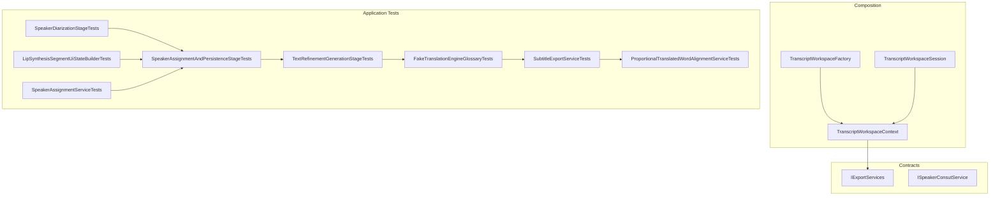
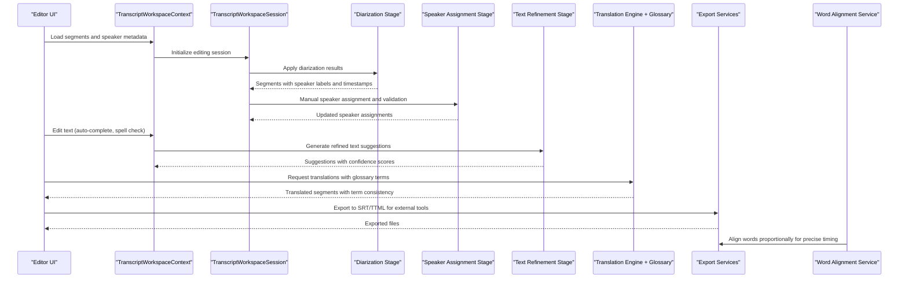
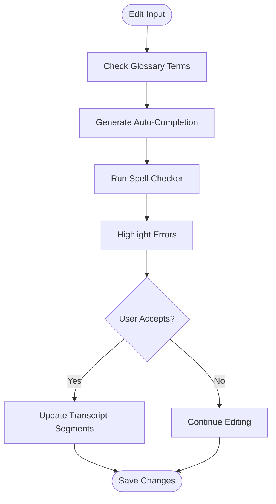
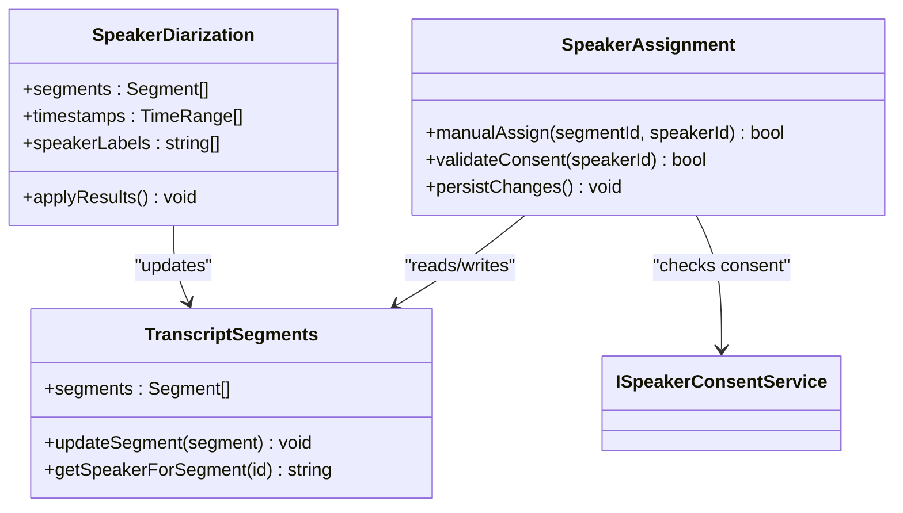
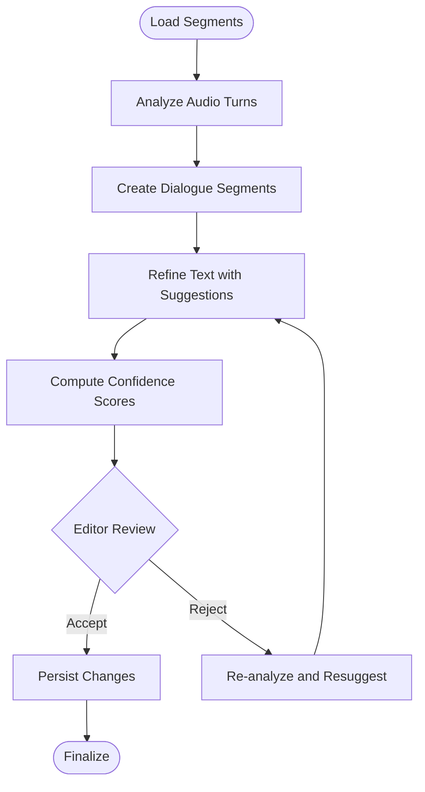
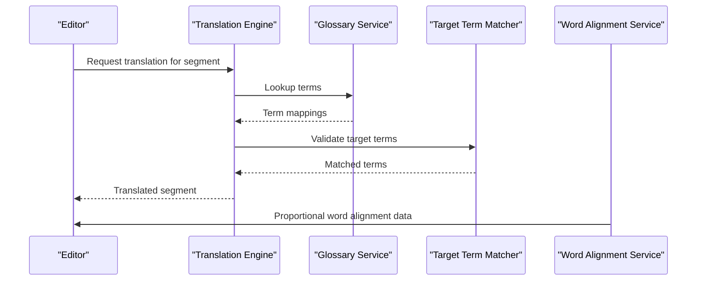
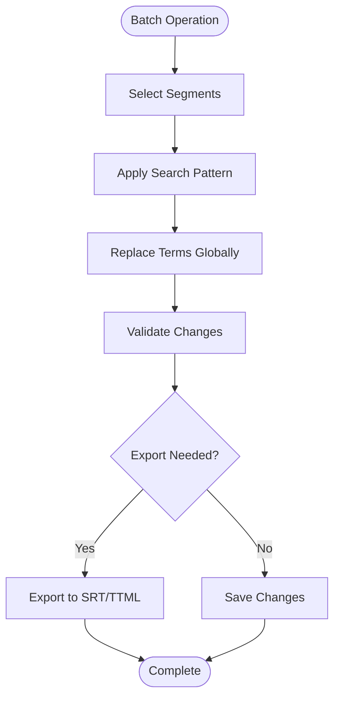
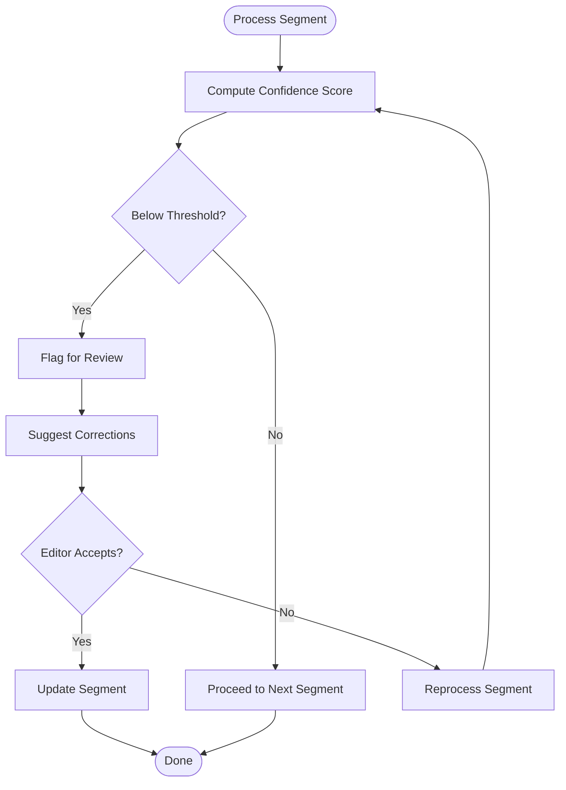
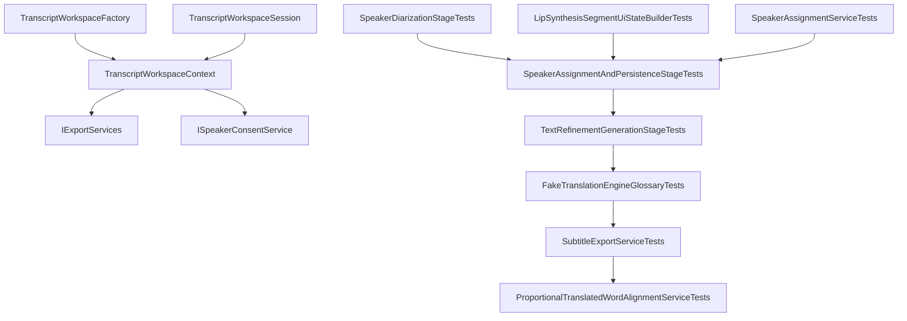

# Transcript Editing & Speaker Management

<cite>
**Referenced Files in This Document**
- [TranscriptWorkspaceContext.cs](file://src/Trackdub.Composition/TranscriptWorkspaceContext.cs)
- [TranscriptWorkspaceFactory.cs](file://src/Trackdub.Composition/TranscriptWorkspaceFactory.cs)
- [TranscriptWorkspaceSession.cs](file://src/Trackdub.Composition/TranscriptWorkspaceSession.cs)
- [IExportServices.cs](file://src/Trackdub.Contracts/IExportServices.cs)
- [ISpeakerConsentService.cs](file://src/Trackdub.Contracts/ISpeakerConsentService.cs)
- [GlossaryServiceTests.cs](file://tests/Trackdub.Application.Tests/GlossaryServiceTests.cs)
- [GlossaryTargetTermMatcherTests.cs](file://tests/Trackdub.Application.Tests/GlossaryTargetTermMatcherTests.cs)
- [SpeakerAssignmentAndPersistenceStageTests.cs](file://tests/Trackdub.Application.Tests/SpeakerAssignmentAndPersistenceStageTests.cs)
- [SpeakerDiarizationStageTests.cs](file://tests/Trackdub.Application.Tests/SpeakerDiarizationStageTests.cs)
- [SubtitleExportServiceTests.cs](file://tests/Trackdub.Application.Tests/SubtitleExportServiceTests.cs)
- [ProportionalTranslatedWordAlignmentServiceTests.cs](file://tests/Trackdub.Application.Tests/ProportionalTranslatedWordAlignmentServiceTests.cs)
- [TextRefinementGenerationStageTests.cs](file://tests/Trackdub.Application.Tests/TextRefinementGenerationStageTests.cs)
- [TextRefinementStageHandlerFailureTests.cs](file://tests/Trackdub.Application.Tests/TextRefinementStageHandlerFailureTests.cs)
- [FakeTranslationEngineGlossaryTests.cs](file://tests/Trackdub.Application.Tests/FakeTranslationEngineGlossaryTests.cs)
- [LipSynthesisSegmentUiStateBuilderTests.cs](file://tests/Trackdub.Application.Tests/LipSynthesisSegmentUiStateBuilderTests.cs)
- [SpeakerAssignmentServiceTests.cs](file://tests/Trackdub.Application.Tests/SpeakerAssignmentServiceTests.cs)
- [Subtitles (SRT)](file://docs/specs/subtitles-srt-spec.md)
</cite>

## Table of Contents
1. Introduction
2. Project Structure
3. Core Components
4. Architecture Overview
5. Detailed Component Analysis
6. Dependency Analysis
7. Performance Considerations
8. Troubleshooting Guide
9. Conclusion

## Introduction
This document explains the transcript editing and speaker management capabilities within the project, focusing on:
- Text editor interface behaviors such as auto-completion and spell checking
- Speaker diarization results and manual speaker assignment
- Dialogue segmentation and iterative refinement workflows
- Translation integration with glossaries and terminology consistency tools
- Confidence scoring and error correction processes
- Batch editing operations, search and replace, and export options for external tools

The goal is to provide both a high-level understanding and detailed technical insights for developers and editors working with transcripts and speakers.

## Project Structure
Transcript editing and speaker management span multiple layers:
- Composition layer provides workspace context and session lifecycle
- Contracts define interfaces for export services and speaker consent
- Application tests cover diarization, speaker assignment, text refinement, translation, and subtitle export
- Domain and infrastructure modules support persistence and processing pipelines

**Diagram sources**
- [TranscriptWorkspaceContext.cs](file://src/Trackdub.Composition/TranscriptWorkspaceContext.cs)
- [TranscriptWorkspaceFactory.cs](file://src/Trackdub.Composition/TranscriptWorkspaceFactory.cs)
- [TranscriptWorkspaceSession.cs](file://src/Trackdub.Composition/TranscriptWorkspaceSession.cs)
- [IExportServices.cs](file://src/Trackdub.Contracts/IExportServices.cs)
- [ISpeakerConsentService.cs](file://src/Trackdub.Contracts/ISpeakerConsentService.cs)
- [SpeakerDiarizationStageTests.cs](file://tests/Trackdub.Application.Tests/SpeakerDiarizationStageTests.cs)
- [SpeakerAssignmentAndPersistenceStageTests.cs](file://tests/Trackdub.Application.Tests/SpeakerAssignmentAndPersistenceStageTests.cs)
- [TextRefinementGenerationStageTests.cs](file://tests/Trackdub.Application.Tests/TextRefinementGenerationStageTests.cs)
- [FakeTranslationEngineGlossaryTests.cs](file://tests/Trackdub.Application.Tests/FakeTranslationEngineGlossaryTests.cs)
- [SubtitleExportServiceTests.cs](file://tests/Trackdub.Application.Tests/SubtitleExportServiceTests.cs)
- [ProportionalTranslatedWordAlignmentServiceTests.cs](file://tests/Trackdub.Application.Tests/ProportionalTranslatedWordAlignmentServiceTests.cs)
- [LipSynthesisSegmentUiStateBuilderTests.cs](file://tests/Trackdub.Application.Tests/LipSynthesisSegmentUiStateBuilderTests.cs)
- [SpeakerAssignmentServiceTests.cs](file://tests/Trackdub.Application.Tests/SpeakerAssignmentServiceTests.cs)

**Section sources**
- [TranscriptWorkspaceContext.cs](file://src/Trackdub.Composition/TranscriptWorkspaceContext.cs)
- [TranscriptWorkspaceFactory.cs](file://src/Trackdub.Composition/TranscriptWorkspaceFactory.cs)
- [TranscriptWorkspaceSession.cs](file://src/Trackdub.Composition/TranscriptWorkspaceSession.cs)
- [IExportServices.cs](file://src/Trackdub.Contracts/IExportServices.cs)
- [ISpeakerConsentService.cs](file://src/Trackdub.Contracts/ISpeakerConsentService.cs)

## Core Components
- Transcript Workspace Context: Provides shared state and accessors for transcript editing sessions, including segment lists, speaker metadata, and export hooks.
- Transcript Workspace Factory: Creates and configures workspace instances for different editing scenarios.
- Transcript Workspace Session: Manages lifecycle events, persistence, and synchronization between UI and backend services.
- Export Services Interface: Defines contracts for exporting transcripts and subtitles to various formats suitable for external editing tools.
- Speaker Consent Service: Ensures compliance and permissions when assigning or modifying speaker identities.

These components collaborate to enable robust editing workflows, from initial diarization through final export.

**Section sources**
- [TranscriptWorkspaceContext.cs](file://src/Trackdub.Composition/TranscriptWorkspaceContext.cs)
- [TranscriptWorkspaceFactory.cs](file://src/Trackdub.Composition/TranscriptWorkspaceFactory.cs)
- [TranscriptWorkspaceSession.cs](file://src/Trackdub.Composition/TranscriptWorkspaceSession.cs)
- [IExportServices.cs](file://src/Trackdub.Contracts/IExportServices.cs)
- [ISpeakerConsentService.cs](file://src/Trackdub.Contracts/ISpeakerConsentService.cs)

## Architecture Overview
The editing pipeline integrates diarization, speaker assignment, text refinement, translation, and export stages. The sequence below shows how user edits flow through the system and how confidence and alignment are maintained.

**Diagram sources**
- [TranscriptWorkspaceContext.cs](file://src/Trackdub.Composition/TranscriptWorkspaceContext.cs)
- [TranscriptWorkspaceSession.cs](file://src/Trackdub.Composition/TranscriptWorkspaceSession.cs)
- [SpeakerDiarizationStageTests.cs](file://tests/Trackdub.Application.Tests/SpeakerDiarizationStageTests.cs)
- [SpeakerAssignmentAndPersistenceStageTests.cs](file://tests/Trackdub.Application.Tests/SpeakerAssignmentAndPersistenceStageTests.cs)
- [TextRefinementGenerationStageTests.cs](file://tests/Trackdub.Application.Tests/TextRefinementGenerationStageTests.cs)
- [FakeTranslationEngineGlossaryTests.cs](file://tests/Trackdub.Application.Tests/FakeTranslationEngineGlossaryTests.cs)
- [SubtitleExportServiceTests.cs](file://tests/Trackdub.Application.Tests/SubtitleExportServiceTests.cs)
- [ProportionalTranslatedWordAlignmentServiceTests.cs](file://tests/Trackdub.Application.Tests/ProportionalTranslatedWordAlignmentServiceTests.cs)

## Detailed Component Analysis

### Text Editor Interface: Auto-Completion and Spell Checking
- Auto-completion: Suggests terms based on glossary and recent usage; integrates with text refinement to propose corrections and expansions.
- Spell checking: Highlights misspellings and offers corrections aligned with domain-specific vocabulary.
- Integration points: The editor consumes suggestions from refinement stages and applies them via workspace context updates.

**Diagram sources**
- [TextRefinementGenerationStageTests.cs](file://tests/Trackdub.Application.Tests/TextRefinementGenerationStageTests.cs)
- [GlossaryServiceTests.cs](file://tests/Trackdub.Application.Tests/GlossaryServiceTests.cs)
- [GlossaryTargetTermMatcherTests.cs](file://tests/Trackdub.Application.Tests/GlossaryTargetTermMatcherTests.cs)

**Section sources**
- [TextRefinementGenerationStageTests.cs](file://tests/Trackdub.Application.Tests/TextRefinementGenerationStageTests.cs)
- [GlossaryServiceTests.cs](file://tests/Trackdub.Application.Tests/GlossaryServiceTests.cs)
- [GlossaryTargetTermMatcherTests.cs](file://tests/Trackdub.Application.Tests/GlossaryTargetTermMatcherTests.cs)

### Speaker Diarization and Manual Assignment
- Diarization stage produces segments with speaker labels and timestamps.
- Manual assignment allows editors to correct or reassign speakers per segment.
- Persistence ensures changes are saved and synchronized across sessions.

**Diagram sources**
- [SpeakerDiarizationStageTests.cs](file://tests/Trackdub.Application.Tests/SpeakerDiarizationStageTests.cs)
- [SpeakerAssignmentAndPersistenceStageTests.cs](file://tests/Trackdub.Application.Tests/SpeakerAssignmentAndPersistenceStageTests.cs)
- [ISpeakerConsentService.cs](file://src/Trackdub.Contracts/ISpeakerConsentService.cs)

**Section sources**
- [SpeakerDiarizationStageTests.cs](file://tests/Trackdub.Application.Tests/SpeakerDiarizationStageTests.cs)
- [SpeakerAssignmentAndPersistenceStageTests.cs](file://tests/Trackdub.Application.Tests/SpeakerAssignmentAndPersistenceStageTests.cs)
- [SpeakerAssignmentServiceTests.cs](file://tests/Trackdub.Application.Tests/SpeakerAssignmentServiceTests.cs)
- [ISpeakerConsentService.cs](file://src/Trackdub.Contracts/ISpeakerConsentService.cs)

### Dialogue Segmentation and Iterative Refinement
- Segmentation divides audio into dialogue turns, preserving speaker boundaries and timing.
- Iterative refinement improves text accuracy using AI-assisted suggestions and confidence scoring.
- Editors can accept or reject suggestions, driving continuous improvement.

**Diagram sources**
- [TextRefinementGenerationStageTests.cs](file://tests/Trackdub.Application.Tests/TextRefinementGenerationStageTests.cs)
- [TextRefinementStageHandlerFailureTests.cs](file://tests/Trackdub.Application.Tests/TextRefinementStageHandlerFailureTests.cs)

**Section sources**
- [TextRefinementGenerationStageTests.cs](file://tests/Trackdub.Application.Tests/TextRefinementGenerationStageTests.cs)
- [TextRefinementStageHandlerFailureTests.cs](file://tests/Trackdub.Application.Tests/TextRefinementStageTests.cs)

### Translation Integration, Glossary Usage, and Terminology Consistency
- Translation engine integrates with glossaries to enforce terminology consistency.
- Target term matching ensures specific phrases are translated according to predefined mappings.
- Proportional word alignment maintains timing accuracy across source and target texts.

**Diagram sources**
- [FakeTranslationEngineGlossaryTests.cs](file://tests/Trackdub.Application.Tests/FakeTranslationEngineGlossaryTests.cs)
- [GlossaryTargetTermMatcherTests.cs](file://tests/Trackdub.Application.Tests/GlossaryTargetTermMatcherTests.cs)
- [ProportionalTranslatedWordAlignmentServiceTests.cs](file://tests/Trackdub.Application.Tests/ProportionalTranslatedWordAlignmentServiceTests.cs)

**Section sources**
- [FakeTranslationEngineGlossaryTests.cs](file://tests/Trackdub.Application.Tests/FakeTranslationEngineGlossaryTests.cs)
- [GlossaryTargetTermMatcherTests.cs](file://tests/Trackdub.Application.Tests/GlossaryTargetTermMatcherTests.cs)
- [ProportionalTranslatedWordAlignmentServiceTests.cs](file://tests/Trackdub.Application.Tests/ProportionalTranslatedWordAlignmentServiceTests.cs)

### Batch Editing Operations, Search and Replace, and Export Options
- Batch editing supports applying changes across multiple segments efficiently.
- Search and replace functionality enables consistent updates throughout the transcript.
- Export services allow saving transcripts and subtitles in formats compatible with external editing tools.

**Diagram sources**
- [SubtitleExportServiceTests.cs](file://tests/Trackdub.Application.Tests/SubtitleExportServiceTests.cs)
- [IExportServices.cs](file://src/Trackdub.Contracts/IExportServices.cs)

**Section sources**
- [SubtitleExportServiceTests.cs](file://tests/Trackdub.Application.Tests/SubtitleExportServiceTests.cs)
- [IExportServices.cs](file://src/Trackdub.Contracts/IExportServices.cs)

### Confidence Scoring and Error Correction Workflows
- Confidence scores indicate reliability of transcription and translation outputs.
- Error correction workflows guide editors to focus on low-confidence segments first.
- Iterative refinement reduces errors by leveraging AI suggestions and human feedback.

**Diagram sources**
- [TextRefinementGenerationStageTests.cs](file://tests/Trackdub.Application.Tests/TextRefinementGenerationStageTests.cs)
- [TextRefinementStageHandlerFailureTests.cs](file://tests/Trackdub.Application.Tests/TextRefinementStageHandlerFailureTests.cs)

**Section sources**
- [TextRefinementGenerationStageTests.cs](file://tests/Trackdub.Application.Tests/TextRefinementGenerationStageTests.cs)
- [TextRefinementStageHandlerFailureTests.cs](file://tests/Trackdub.Application.Tests/TextRefinementStageHandlerFailureTests.cs)

## Dependency Analysis
The following diagram illustrates key dependencies between composition, contracts, and application test modules that drive transcript editing and speaker management.

**Diagram sources**
- [TranscriptWorkspaceContext.cs](file://src/Trackdub.Composition/TranscriptWorkspaceContext.cs)
- [TranscriptWorkspaceFactory.cs](file://src/Trackdub.Composition/TranscriptWorkspaceFactory.cs)
- [TranscriptWorkspaceSession.cs](file://src/Trackdub.Composition/TranscriptWorkspaceSession.cs)
- [IExportServices.cs](file://src/Trackdub.Contracts/IExportServices.cs)
- [ISpeakerConsentService.cs](file://src/Trackdub.Contracts/ISpeakerConsentService.cs)
- [SpeakerDiarizationStageTests.cs](file://tests/Trackdub.Application.Tests/SpeakerDiarizationStageTests.cs)
- [SpeakerAssignmentAndPersistenceStageTests.cs](file://tests/Trackdub.Application.Tests/SpeakerAssignmentAndPersistenceStageTests.cs)
- [TextRefinementGenerationStageTests.cs](file://tests/Trackdub.Application.Tests/TextRefinementGenerationStageTests.cs)
- [FakeTranslationEngineGlossaryTests.cs](file://tests/Trackdub.Application.Tests/FakeTranslationEngineGlossaryTests.cs)
- [SubtitleExportServiceTests.cs](file://tests/Trackdub.Application.Tests/SubtitleExportServiceTests.cs)
- [ProportionalTranslatedWordAlignmentServiceTests.cs](file://tests/Trackdub.Application.Tests/ProportionalTranslatedWordAlignmentServiceTests.cs)
- [LipSynthesisSegmentUiStateBuilderTests.cs](file://tests/Trackdub.Application.Tests/LipSynthesisSegmentUiStateBuilderTests.cs)
- [SpeakerAssignmentServiceTests.cs](file://tests/Trackdub.Application.Tests/SpeakerAssignmentServiceTests.cs)

**Section sources**
- [TranscriptWorkspaceContext.cs](file://src/Trackdub.Composition/TranscriptWorkspaceContext.cs)
- [TranscriptWorkspaceFactory.cs](file://src/Trackdub.Composition/TranscriptWorkspaceFactory.cs)
- [TranscriptWorkspaceSession.cs](file://src/Trackdub.Composition/TranscriptWorkspaceSession.cs)
- [IExportServices.cs](file://src/Trackdub.Contracts/IExportServices.cs)
- [ISpeakerConsentService.cs](file://src/Trackdub.Contracts/ISpeakerConsentService.cs)

## Performance Considerations
- Optimize diarization and refinement stages to minimize latency during editing sessions.
- Cache glossary lookups and translation results where appropriate to improve responsiveness.
- Use batch operations for large-scale edits to reduce overhead.
- Monitor confidence scores to prioritize high-impact corrections and avoid unnecessary reprocessing.

[No sources needed since this section provides general guidance]

## Troubleshooting Guide
Common issues and resolutions:
- Diarization misassignments: Re-run diarization with adjusted parameters and validate speaker consent before persisting changes.
- Low-confidence refinements: Focus on flagged segments and use targeted search-and-replace to correct recurring errors.
- Translation inconsistencies: Verify glossary mappings and ensure target term matching is enabled.
- Export failures: Confirm supported formats and validate segment timing alignment before exporting.

**Section sources**
- [SpeakerDiarizationStageTests.cs](file://tests/Trackdub.Application.Tests/SpeakerDiarizationStageTests.cs)
- [TextRefinementStageHandlerFailureTests.cs](file://tests/Trackdub.Application.Tests/TextRefinementStageHandlerFailureTests.cs)
- [SubtitleExportServiceTests.cs](file://tests/Trackdub.Application.Tests/SubtitleExportServiceTests.cs)

## Conclusion
The transcript editing and speaker management system combines robust diarization, intelligent text refinement, and precise translation workflows. By leveraging glossaries, confidence scoring, and flexible export options, editors can achieve high-quality results efficiently. The modular architecture ensures scalability and maintainability while supporting iterative improvements through user feedback and automated suggestions.

[No sources needed since this section summarizes without analyzing specific files]