# Voice Selection & TTS Configuration

<cite>
**Referenced Files in This Document**
- [Trackdub.Domain/Tts/](file://src/Trackdub.Domain/Tts)
- [Trackdub.Contracts/Pipeline/ITtsCandidateGroupRepository.cs](file://src/Trackdub.Contracts/Pipeline/ITtsCandidateGroupRepository.cs)
- [Trackdub.Contracts/IVoiceCloneAuditLog.cs](file://src/Trackdub.Contracts/IVoiceCloneAuditLog.cs)
- [Trackdub.Application/Dubbing/GenerateCandidatesHandler.cs](file://src/Trackdub.Application/Dubbing/GenerateCandidatesHandler.cs)
- [Trackdub.Inference.Onnx/Kokoro/](file://src/Trackdub.Inference.Onnx/Kokoro)
- [Trackdub.Inference.Onnx/Qwen3Tts/](file://src/Trackdub.Inference.Onnx/Qwen3Tts)
- [Trackdub.Infrastructure/Tts/](file://src/Trackdub.Infrastructure/Tts)
- [Trackdub.Media/Tts/](file://src/Trackdub.Media/Tts)
- [Trackdub.Cli/Interactive/](file://src/Trackdub.Cli/Interactive)
- [Trackdub.Benchmarks/DubbingBenchmarkRunner.cs](file://src/Trackdub.Benchmarks/DubbingBenchmarkRunner.cs)
- [Trackdub.Sdk/BatchProcessor.cs](file://src/Trackdub.Sdk/BatchProcessor.cs)
- [Trackdub.Sdk/BatchOptions.cs](file://src/Trackdub.Sdk/BatchOptions.cs)
- [Trackdub.Sdk/PresetStore.cs](file://src/Trackdub.Sdk/PresetStore.cs)
- [Trackdub.Sdk/PipelinePreset.cs](file://src/Trackdub.Sdk/PipelinePreset.cs)
- [Trackdub.Composition/StarterPacks/](file://src/Trackdub.Composition/StarterPacks)
- [Trackdub.Contracts/IModelInventoryService.cs](file://src/Trackdub.Contracts/IModelInventoryService.cs)
- [Trackdub.Contracts/IModelDownloadOrchestrator.cs](file://src/Trackdub.Contracts/IModelDownloadOrchestrator.cs)
- [Trackdub.Contracts/IStudioSettingsService.cs](file://src/Trackdub.Contracts/IStudioSettingsService.cs)
- [Trackdub.Contracts/IAudioPreviewTransport.cs](file://src/Trackdub.Contracts/IAudioPreviewTransport.cs)
- [Trackdub.Contracts/IWaveformSummaryGenerator.cs](file://src/Trackdub.Contracts/IWaveformSummaryGenerator.cs)
- [Trackdub.Contracts/ISpeechAudioEnhancementService.cs](file://src/Trackdub.Contracts/ISpeechAudioEnhancementService.cs)
- [Trackdub.Contracts/ITtsAudioPostProcessor.cs](file://src/Trackdub.Contracts/ITtsAudioPostProcessor.cs)
- [Trackdub.Contracts/ISpeakerConsentService.cs](file://src/Trackdub.Contracts/ISpeakerConsentService.cs)
- [Trackdub.Contracts/IDiagnosticsBundleExporter.cs](file://src/Trackdub.Contracts/IDiagnosticsBundleExporter.cs)
</cite>

## Table of Contents
1. [Introduction](#introduction)
2. [Project Structure](#project-structure)
3. [Core Components](#core-components)
4. [Architecture Overview](#architecture-overview)
5. [Detailed Component Analysis](#detailed-component-analysis)
6. [Dependency Analysis](#dependency-analysis)
7. [Performance Considerations](#performance-considerations)
8. [Troubleshooting Guide](#troubleshooting-guide)
9. [Conclusion](#conclusion)
10. [Appendices](#appendices)

## Introduction
This document explains how voice selection and text-to-speech (TTS) configuration work within the interactive workflow. It covers the voice catalog interface, preview capabilities, quality comparison tools, engine selection, parameter tuning, voice cloning options, emotional tone adjustment, speech rate control, pronunciation customization, real-time synthesis testing, batch application, template usage, and custom voice pack integration. The goal is to help both new users and advanced practitioners understand the end-to-end flow from selecting a voice to generating high-quality synthesized audio with full auditability and reproducibility.

## Project Structure
The TTS-related functionality spans multiple layers:
- Domain models for TTS entities and relationships
- Contracts that define interfaces for repositories, services, and diagnostics
- Application handlers orchestrating candidate generation and pipeline stages
- Inference implementations for specific TTS engines
- Infrastructure components for settings, persistence, and model management
- Media utilities for post-processing and waveform analysis
- CLI interactive modules for user workflows
- SDK and benchmarking for batch operations and performance evaluation

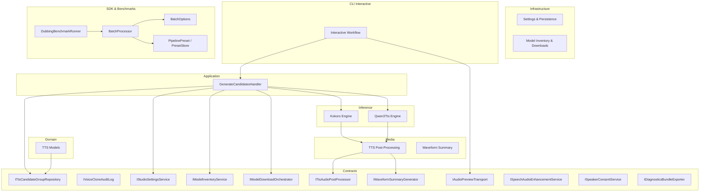

**Diagram sources**
- [Trackdub.Application/Dubbing/GenerateCandidatesHandler.cs](file://src/Trackdub.Application/Dubbing/GenerateCandidatesHandler.cs)
- [Trackdub.Contracts/Pipeline/ITtsCandidateGroupRepository.cs](file://src/Trackdub.Contracts/Pipeline/ITtsCandidateGroupRepository.cs)
- [Trackdub.Contracts/IVoiceCloneAuditLog.cs](file://src/Trackdub.Contracts/IVoiceCloneAuditLog.cs)
- [Trackdub.Contracts/IStudioSettingsService.cs](file://src/Trackdub.Contracts/IStudioSettingsService.cs)
- [Trackdub.Contracts/IModelInventoryService.cs](file://src/Trackdub.Contracts/IModelInventoryService.cs)
- [Trackdub.Contracts/IModelDownloadOrchestrator.cs](file://src/Trackdub.Contracts/IModelDownloadOrchestrator.cs)
- [Trackdub.Contracts/IAudioPreviewTransport.cs](file://src/Trackdub.Contracts/IAudioPreviewTransport.cs)
- [Trackdub.Contracts/IWaveformSummaryGenerator.cs](file://src/Trackdub.Contracts/IWaveformSummaryGenerator.cs)
- [Trackdub.Contracts/ISpeechAudioEnhancementService.cs](file://src/Trackdub.Contracts/ISpeechAudioEnhancementService.cs)
- [Trackdub.Contracts/ITtsAudioPostProcessor.cs](file://src/Trackdub.Contracts/ITtsAudioPostProcessor.cs)
- [Trackdub.Inference.Onnx/Kokoro/](file://src/Trackdub.Inference.Onnx/Kokoro)
- [Trackdub.Inference.Onnx/Qwen3Tts/](file://src/Trackdub.Inference.Onnx/Qwen3Tts)
- [Trackdub.Infrastructure/Tts/](file://src/Trackdub.Infrastructure/Tts)
- [Trackdub.Media/Tts/](file://src/Trackdub.Media/Tts)
- [Trackdub.Cli/Interactive/](file://src/Trackdub.Cli/Interactive)
- [Trackdub.Sdk/BatchProcessor.cs](file://src/Trackdub.Sdk/BatchProcessor.cs)
- [Trackdub.Sdk/BatchOptions.cs](file://src/Trackdub.Sdk/BatchOptions.cs)
- [Trackdub.Sdk/PresetStore.cs](file://src/Trackdub.Sdk/PresetStore.cs)
- [Trackdub.Sdk/PipelinePreset.cs](file://src/Trackdub.Sdk/PipelinePreset.cs)
- [Trackdub.Benchmarks/DubbingBenchmarkRunner.cs](file://src/Trackdub.Benchmarks/DubbingBenchmarkRunner.cs)

**Section sources**
- [Trackdub.Application/Dubbing/GenerateCandidatesHandler.cs](file://src/Trackdub.Application/Dubbing/GenerateCandidatesHandler.cs)
- [Trackdub.Contracts/Pipeline/ITtsCandidateGroupRepository.cs](file://src/Trackdub.Contracts/Pipeline/ITtsCandidateGroupRepository.cs)
- [Trackdub.Contracts/IVoiceCloneAuditLog.cs](file://src/Trackdub.Contracts/IVoiceCloneAuditLog.cs)
- [Trackdub.Contracts/IStudioSettingsService.cs](file://src/Trackdub.Contracts/IStudioSettingsService.cs)
- [Trackdub.Contracts/IModelInventoryService.cs](file://src/Trackdub.Contracts/IModelInventoryService.cs)
- [Trackdub.Contracts/IModelDownloadOrchestrator.cs](file://src/Trackdub.Contracts/IModelDownloadOrchestrator.cs)
- [Trackdub.Contracts/IAudioPreviewTransport.cs](file://src/Trackdub.Contracts/IAudioPreviewTransport.cs)
- [Trackdub.Contracts/IWaveformSummaryGenerator.cs](file://src/Trackdub.Contracts/IWaveformSummaryGenerator.cs)
- [Trackdub.Contracts/ISpeechAudioEnhancementService.cs](file://src/Trackdub.Contracts/ISpeechAudioEnhancementService.cs)
- [Trackdub.Contracts/ITtsAudioPostProcessor.cs](file://src/Trackdub.Contracts/ITtsAudioPostProcessor.cs)
- [Trackdub.Inference.Onnx/Kokoro/](file://src/Trackdub.Inference.Onnx/Kokoro)
- [Trackdub.Inference.Onnx/Qwen3Tts/](file://src/Trackdub.Inference.Onnx/Qwen3Tts)
- [Trackdub.Infrastructure/Tts/](file://src/Trackdub.Infrastructure/Tts)
- [Trackdub.Media/Tts/](file://src/Trackdub.Media/Tts)
- [Trackdub.Cli/Interactive/](file://src/Trackdub.Cli/Interactive)
- [Trackdub.Sdk/BatchProcessor.cs](file://src/Trackdub.Sdk/BatchProcessor.cs)
- [Trackdub.Sdk/BatchOptions.cs](file://src/Trackdub.Sdk/BatchOptions.cs)
- [Trackdub.Sdk/PresetStore.cs](file://src/Trackdub.Sdk/PresetStore.cs)
- [Trackdub.Sdk/PipelinePreset.cs](file://src/Trackdub.Sdk/PipelinePreset.cs)
- [Trackdub.Benchmarks/DubbingBenchmarkRunner.cs](file://src/Trackdub.Benchmarks/DubbingBenchmarkRunner.cs)

## Core Components
- TTS domain models encapsulate voice metadata, candidate groups, and synthesis parameters such as speed, emotion, and pronunciation rules.
- Candidate group repository provides access to grouped voice candidates for selection and comparison.
- Voice clone audit log records cloning actions for compliance and traceability.
- Studio settings service centralizes user preferences for TTS behavior and UI defaults.
- Model inventory and download orchestrator manage availability and lifecycle of TTS engines and voice packs.
- Audio preview transport streams synthesized previews to playback backends.
- Waveform summary generator computes metrics for quick visual assessment.
- Speech audio enhancement and TTS post-processing ensure consistent output quality.
- Speaker consent service enforces rights and permissions for cloned voices.
- Diagnostics bundle exporter aggregates logs and artifacts for troubleshooting.

**Section sources**
- [Trackdub.Domain/Tts/](file://src/Trackdub.Domain/Tts)
- [Trackdub.Contracts/Pipeline/ITtsCandidateGroupRepository.cs](file://src/Trackdub.Contracts/Pipeline/ITtsCandidateGroupRepository.cs)
- [Trackdub.Contracts/IVoiceCloneAuditLog.cs](file://src/Trackdub.Contracts/IVoiceCloneAuditLog.cs)
- [Trackdub.Contracts/IStudioSettingsService.cs](file://src/Trackdub.Contracts/IStudioSettingsService.cs)
- [Trackdub.Contracts/IModelInventoryService.cs](file://src/Trackdub.Contracts/IModelInventoryService.cs)
- [Trackdub.Contracts/IModelDownloadOrchestrator.cs](file://src/Trackdub.Contracts/IModelDownloadOrchestrator.cs)
- [Trackdub.Contracts/IAudioPreviewTransport.cs](file://src/Trackdub.Contracts/IAudioPreviewTransport.cs)
- [Trackdub.Contracts/IWaveformSummaryGenerator.cs](file://src/Trackdub.Contracts/IWaveformSummaryGenerator.cs)
- [Trackdub.Contracts/ISpeechAudioEnhancementService.cs](file://src/Trackdub.Contracts/ISpeechAudioEnhancementService.cs)
- [Trackdub.Contracts/ITtsAudioPostProcessor.cs](file://src/Trackdub.Contracts/ITtsAudioPostProcessor.cs)
- [Trackdub.Contracts/ISpeakerConsentService.cs](file://src/Trackdub.Contracts/ISpeakerConsentService.cs)
- [Trackdub.Contracts/IDiagnosticsBundleExporter.cs](file://src/Trackdub.Contracts/IDiagnosticsBundleExporter.cs)

## Architecture Overview
The interactive workflow begins with the CLI or UI prompting the user to select a voice and configure TTS parameters. The application handler coordinates candidate generation by consulting the candidate repository and model inventory, then invokes the selected TTS engine implementation. Synthesized audio passes through post-processing and enhancement services before being streamed to the preview transport. Quality metrics are computed via waveform summaries and stored alongside candidate groups for comparison.

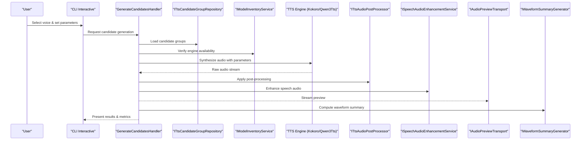

**Diagram sources**
- [Trackdub.Cli/Interactive/](file://src/Trackdub.Cli/Interactive)
- [Trackdub.Application/Dubbing/GenerateCandidatesHandler.cs](file://src/Trackdub.Application/Dubbing/GenerateCandidatesHandler.cs)
- [Trackdub.Contracts/Pipeline/ITtsCandidateGroupRepository.cs](file://src/Trackdub.Contracts/Pipeline/ITtsCandidateGroupRepository.cs)
- [Trackdub.Contracts/IModelInventoryService.cs](file://src/Trackdub.Contracts/IModelInventoryService.cs)
- [Trackdub.Inference.Onnx/Kokoro/](file://src/Trackdub.Inference.Onnx/Kokoro)
- [Trackdub.Inference.Onnx/Qwen3Tts/](file://src/Trackdub.Inference.Onnx/Qwen3Tts)
- [Trackdub.Contracts/ITtsAudioPostProcessor.cs](file://src/Trackdub.Contracts/ITtsAudioPostProcessor.cs)
- [Trackdub.Contracts/ISpeechAudioEnhancementService.cs](file://src/Trackdub.Contracts/ISpeechAudioEnhancementService.cs)
- [Trackdub.Contracts/IAudioPreviewTransport.cs](file://src/Trackdub.Contracts/IAudioPreviewTransport.cs)
- [Trackdub.Contracts/IWaveformSummaryGenerator.cs](file://src/Trackdub.Contracts/IWaveformSummaryGenerator.cs)

## Detailed Component Analysis

### Voice Catalog Interface
- Presents available voices grouped by engine, language, and style.
- Supports filtering by attributes like gender, age range, and accent.
- Displays metadata such as license status, source model, and version.
- Integrates with model inventory to reflect current availability and readiness.

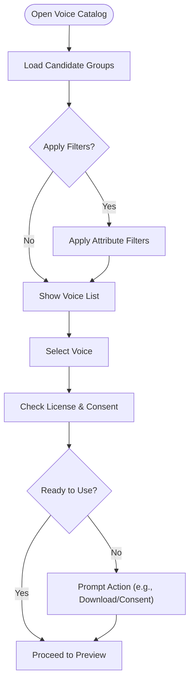

**Section sources**
- [Trackdub.Contracts/Pipeline/ITtsCandidateGroupRepository.cs](file://src/Trackdub.Contracts/Pipeline/ITtsCandidateGroupRepository.cs)
- [Trackdub.Contracts/IModelInventoryService.cs](file://src/Trackdub.Contracts/IModelInventoryService.cs)
- [Trackdub.Contracts/ISpeakerConsentService.cs](file://src/Trackdub.Contracts/ISpeakerConsentService.cs)

### Preview Capabilities
- Generates short audio snippets based on selected voice and parameters.
- Streams previews in real time using the audio preview transport.
- Provides waveform visualization and basic metrics for immediate feedback.
- Supports AB comparison mode to toggle between two candidates.

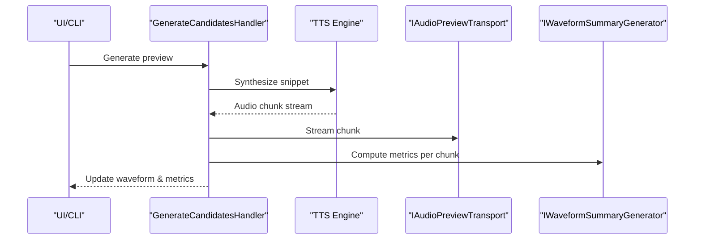

**Diagram sources**
- [Trackdub.Application/Dubbing/GenerateCandidatesHandler.cs](file://src/Trackdub.Application/Dubbing/GenerateCandidatesHandler.cs)
- [Trackdub.Contracts/IAudioPreviewTransport.cs](file://src/Trackdub.Contracts/IAudioPreviewTransport.cs)
- [Trackdub.Contracts/IWaveformSummaryGenerator.cs](file://src/Trackdub.Contracts/IWaveformSummaryGenerator.cs)

**Section sources**
- [Trackdub.Contracts/IAudioPreviewTransport.cs](file://src/Trackdub.Contracts/IAudioPreviewTransport.cs)
- [Trackdub.Contracts/IWaveformSummaryGenerator.cs](file://src/Trackdub.Contracts/IWaveformSummaryGenerator.cs)

### Quality Comparison Tools
- Computes objective metrics such as loudness, clarity, and stability.
- Visualizes waveforms side-by-side for subjective comparison.
- Stores comparison results alongside candidate groups for later review.
- Enables export of comparison reports for team collaboration.

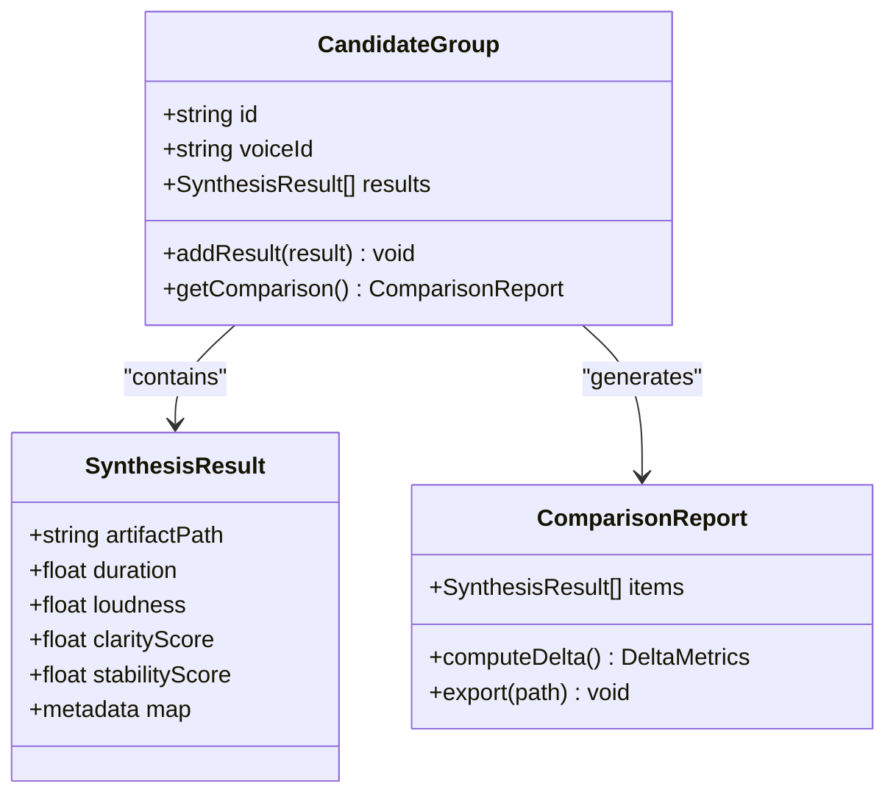

**Diagram sources**
- [Trackdub.Contracts/Pipeline/ITtsCandidateGroupRepository.cs](file://src/Trackdub.Contracts/Pipeline/ITtsCandidateGroupRepository.cs)

**Section sources**
- [Trackdub.Contracts/Pipeline/ITtsCandidateGroupRepository.cs](file://src/Trackdub.Contracts/Pipeline/ITtsCandidateGroupRepository.cs)

### TTS Engine Selection
- Chooses among supported engines (e.g., Kokoro, Qwen3Tts) based on availability, performance, and user preference.
- Validates runtime readiness and execution provider compatibility.
- Applies engine-specific defaults when parameters are unspecified.

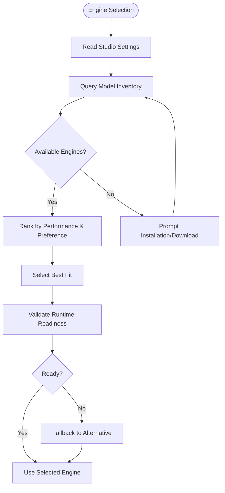

**Diagram sources**
- [Trackdub.Contracts/IStudioSettingsService.cs](file://src/Trackdub.Contracts/IStudioSettingsService.cs)
- [Trackdub.Contracts/IModelInventoryService.cs](file://src/Trackdub.Contracts/IModelInventoryService.cs)
- [Trackdub.Inference.Onnx/Kokoro/](file://src/Trackdub.Inference.Onnx/Kokoro)
- [Trackdub.Inference.Onnx/Qwen3Tts/](file://src/Trackdub.Inference.Onnx/Qwen3Tts)

**Section sources**
- [Trackdub.Contracts/IStudioSettingsService.cs](file://src/Trackdub.Contracts/IStudioSettingsService.cs)
- [Trackdub.Contracts/IModelInventoryService.cs](file://src/Trackdub.Contracts/IModelInventoryService.cs)
- [Trackdub.Inference.Onnx/Kokoro/](file://src/Trackdub.Inference.Onnx/Kokoro)
- [Trackdub.Inference.Onnx/Qwen3Tts/](file://src/Trackdub.Inference.Onnx/Qwen3Tts)

### Parameter Tuning
- Speed control adjusts speech rate while preserving natural prosody.
- Emotional tone modulation influences intonation and expressiveness.
- Pronunciation customization allows phoneme-level overrides for specific terms.
- Parameters are validated against engine constraints and persisted for reuse.

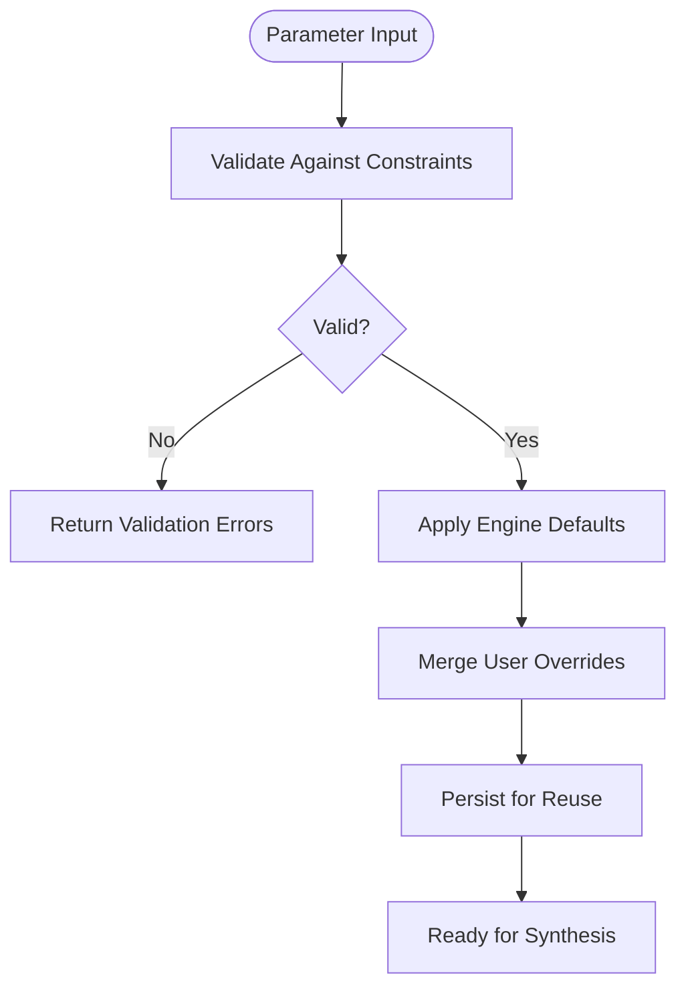

**Section sources**
- [Trackdub.Contracts/IStudioSettingsService.cs](file://src/Trackdub.Contracts/IStudioSettingsService.cs)
- [Trackdub.Inference.Onnx/Kokoro/](file://src/Trackdub.Inference.Onnx/Kokoro)
- [Trackdub.Inference.Onnx/Qwen3Tts/](file://src/Trackdub.Inference.Onnx/Qwen3Tts)

### Voice Cloning Options
- Captures reference audio samples and builds a voice profile.
- Enforces speaker consent checks before cloning proceeds.
- Records cloning actions in the audit log for compliance.
- Supports exporting cloned voice packs for distribution.

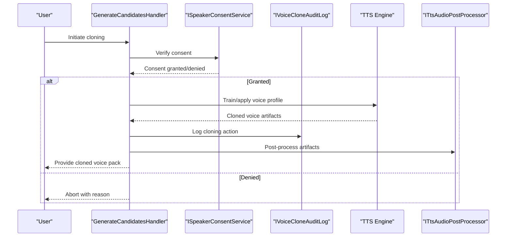

**Diagram sources**
- [Trackdub.Contracts/ISpeakerConsentService.cs](file://src/Trackdub.Contracts/ISpeakerConsentService.cs)
- [Trackdub.Contracts/IVoiceCloneAuditLog.cs](file://src/Trackdub.Contracts/IVoiceCloneAuditLog.cs)
- [Trackdub.Application/Dubbing/GenerateCandidatesHandler.cs](file://src/Trackdub.Application/Dubbing/GenerateCandidatesHandler.cs)
- [Trackdub.Inference.Onnx/Kokoro/](file://src/Trackdub.Inference.Onnx/Kokoro)
- [Trackdub.Inference.Onnx/Qwen3Tts/](file://src/Trackdub.Inference.Onnx/Qwen3Tts)
- [Trackdub.Contracts/ITtsAudioPostProcessor.cs](file://src/Trackdub.Contracts/ITtsAudioPostProcessor.cs)

**Section sources**
- [Trackdub.Contracts/ISpeakerConsentService.cs](file://src/Trackdub.Contracts/ISpeakerConsentService.cs)
- [Trackdub.Contracts/IVoiceCloneAuditLog.cs](file://src/Trackdub.Contracts/IVoiceCloneAuditLog.cs)
- [Trackdub.Application/Dubbing/GenerateCandidatesHandler.cs](file://src/Trackdub.Application/Dubbing/GenerateCandidatesHandler.cs)
- [Trackdub.Contracts/ITtsAudioPostProcessor.cs](file://src/Trackdub.Contracts/ITtsAudioPostProcessor.cs)

### Real-Time Synthesis Testing
- Streams audio chunks to the preview transport for immediate playback.
- Updates waveform and metrics in real time to guide parameter adjustments.
- Supports interruptible sessions to cancel ongoing synthesis.

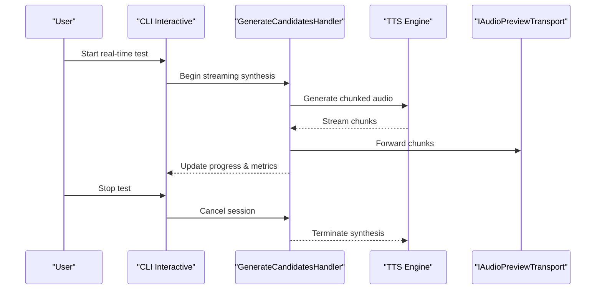

**Diagram sources**
- [Trackdub.Cli/Interactive/](file://src/Trackdub.Cli/Interactive)
- [Trackdub.Application/Dubbing/GenerateCandidatesHandler.cs](file://src/Trackdub.Application/Dubbing/GenerateCandidatesHandler.cs)
- [Trackdub.Contracts/IAudioPreviewTransport.cs](file://src/Trackdub.Contracts/IAudioPreviewTransport.cs)

**Section sources**
- [Trackdub.Cli/Interactive/](file://src/Trackdub.Cli/Interactive)
- [Trackdub.Application/Dubbing/GenerateCandidatesHandler.cs](file://src/Trackdub.Application/Dubbing/GenerateCandidatesHandler.cs)
- [Trackdub.Contracts/IAudioPreviewTransport.cs](file://src/Trackdub.Contracts/IAudioPreviewTransport.cs)

### Batch Voice Application
- Applies selected voice and parameters across multiple segments or projects.
- Uses batch options to control concurrency, output paths, and reporting.
- Integrates with preset store for reusable configurations.

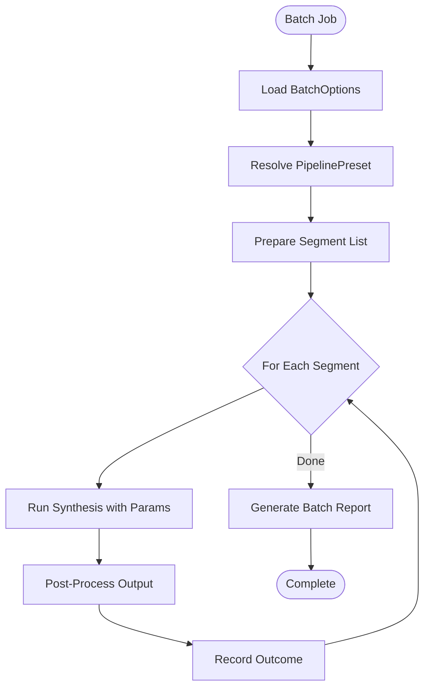

**Diagram sources**
- [Trackdub.Sdk/BatchProcessor.cs](file://src/Trackdub.Sdk/BatchProcessor.cs)
- [Trackdub.Sdk/BatchOptions.cs](file://src/Trackdub.Sdk/BatchOptions.cs)
- [Trackdub.Sdk/PresetStore.cs](file://src/Trackdub.Sdk/PresetStore.cs)
- [Trackdub.Sdk/PipelinePreset.cs](file://src/Trackdub.Sdk/PipelinePreset.cs)

**Section sources**
- [Trackdub.Sdk/BatchProcessor.cs](file://src/Trackdub.Sdk/BatchProcessor.cs)
- [Trackdub.Sdk/BatchOptions.cs](file://src/Trackdub.Sdk/BatchOptions.cs)
- [Trackdub.Sdk/PresetStore.cs](file://src/Trackdub.Sdk/PresetStore.cs)
- [Trackdub.Sdk/PipelinePreset.cs](file://src/Trackdub.Sdk/PipelinePreset.cs)

### Template Usage
- Templates encapsulate common voice and parameter sets for quick adoption.
- Stored as presets and can be extended or overridden per project.
- Facilitates consistency across teams and projects.

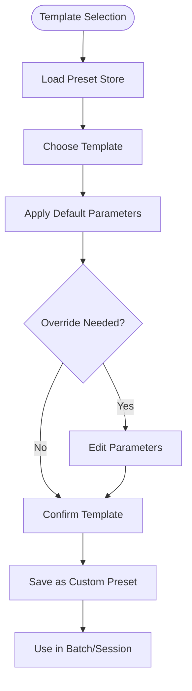

**Section sources**
- [Trackdub.Sdk/PresetStore.cs](file://src/Trackdub.Sdk/PresetStore.cs)
- [Trackdub.Sdk/PipelinePreset.cs](file://src/Trackdub.Sdk/PipelinePreset.cs)

### Custom Voice Pack Integration
- Imports external voice packs into the model inventory.
- Validates format and metadata before registration.
- Supports versioning and rollback for managed updates.

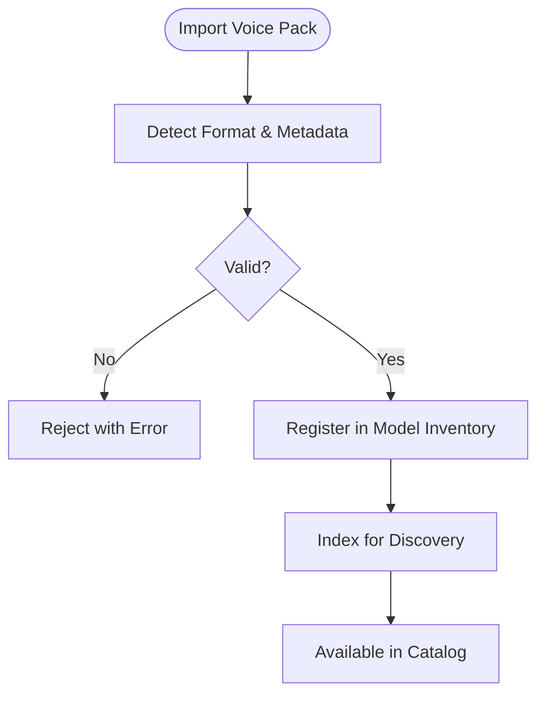

**Section sources**
- [Trackdub.Contracts/IModelInventoryService.cs](file://src/Trackdub.Contracts/IModelInventoryService.cs)
- [Trackdub.Contracts/IModelDownloadOrchestrator.cs](file://src/Trackdub.Contracts/IModelDownloadOrchestrator.cs)

## Dependency Analysis
The TTS subsystem depends on several cross-cutting services:
- Candidate group repository for data access
- Model inventory and download orchestrator for resource management
- Studio settings for user preferences
- Post-processing and enhancement services for audio quality
- Preview transport and waveform metrics for user feedback
- Consent and audit services for compliance

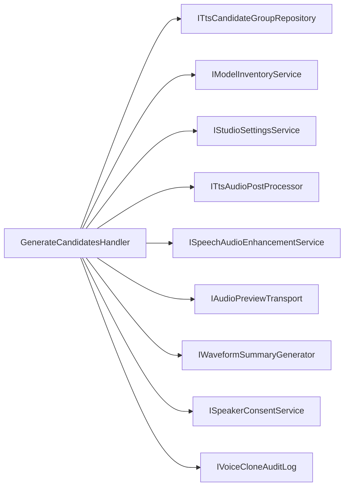

**Diagram sources**
- [Trackdub.Application/Dubbing/GenerateCandidatesHandler.cs](file://src/Trackdub.Application/Dubbing/GenerateCandidatesHandler.cs)
- [Trackdub.Contracts/Pipeline/ITtsCandidateGroupRepository.cs](file://src/Trackdub.Contracts/Pipeline/ITtsCandidateGroupRepository.cs)
- [Trackdub.Contracts/IModelInventoryService.cs](file://src/Trackdub.Contracts/IModelInventoryService.cs)
- [Trackdub.Contracts/IStudioSettingsService.cs](file://src/Trackdub.Contracts/IStudioSettingsService.cs)
- [Trackdub.Contracts/ITtsAudioPostProcessor.cs](file://src/Trackdub.Contracts/ITtsAudioPostProcessor.cs)
- [Trackdub.Contracts/ISpeechAudioEnhancementService.cs](file://src/Trackdub.Contracts/ISpeechAudioEnhancementService.cs)
- [Trackdub.Contracts/IAudioPreviewTransport.cs](file://src/Trackdub.Contracts/IAudioPreviewTransport.cs)
- [Trackdub.Contracts/IWaveformSummaryGenerator.cs](file://src/Trackdub.Contracts/IWaveformSummaryGenerator.cs)
- [Trackdub.Contracts/ISpeakerConsentService.cs](file://src/Trackdub.Contracts/ISpeakerConsentService.cs)
- [Trackdub.Contracts/IVoiceCloneAuditLog.cs](file://src/Trackdub.Contracts/IVoiceCloneAuditLog.cs)

**Section sources**
- [Trackdub.Application/Dubbing/GenerateCandidatesHandler.cs](file://src/Trackdub.Application/Dubbing/GenerateCandidatesHandler.cs)
- [Trackdub.Contracts/Pipeline/ITtsCandidateGroupRepository.cs](file://src/Trackdub.Contracts/Pipeline/ITtsCandidateGroupRepository.cs)
- [Trackdub.Contracts/IModelInventoryService.cs](file://src/Trackdub.Contracts/IModelInventoryService.cs)
- [Trackdub.Contracts/IStudioSettingsService.cs](file://src/Trackdub.Contracts/IStudioSettingsService.cs)
- [Trackdub.Contracts/ITtsAudioPostProcessor.cs](file://src/Trackdub.Contracts/ITtsAudioPostProcessor.cs)
- [Trackdub.Contracts/ISpeechAudioEnhancementService.cs](file://src/Trackdub.Contracts/ISpeechAudioEnhancementService.cs)
- [Trackdub.Contracts/IAudioPreviewTransport.cs](file://src/Trackdub.Contracts/IAudioPreviewTransport.cs)
- [Trackdub.Contracts/IWaveformSummaryGenerator.cs](file://src/Trackdub.Contracts/IWaveformSummaryGenerator.cs)
- [Trackdub.Contracts/ISpeakerConsentService.cs](file://src/Trackdub.Contracts/ISpeakerConsentService.cs)
- [Trackdub.Contracts/IVoiceCloneAuditLog.cs](file://src/Trackdub.Contracts/IVoiceCloneAuditLog.cs)

## Performance Considerations
- Prefer GPU-accelerated execution providers where available for faster synthesis.
- Cache frequently used voice profiles and templates to reduce startup latency.
- Stream previews incrementally to minimize perceived delay.
- Limit batch concurrency based on hardware capacity to avoid memory pressure.
- Use lightweight models for real-time testing and heavier models for final exports.

[No sources needed since this section provides general guidance]

## Troubleshooting Guide
- If previews fail to play, verify the audio preview transport backend and device availability.
- For synthesis errors, check engine readiness and model inventory status; re-download if necessary.
- When cloning fails, confirm speaker consent and inspect the audit log for details.
- Use diagnostics bundle exporter to collect logs and artifacts for support.
- Validate waveform metrics to identify issues like clipping or low loudness.

**Section sources**
- [Trackdub.Contracts/IAudioPreviewTransport.cs](file://src/Trackdub.Contracts/IAudioPreviewTransport.cs)
- [Trackdub.Contracts/IModelInventoryService.cs](file://src/Trackdub.Contracts/IModelInventoryService.cs)
- [Trackdub.Contracts/IVoiceCloneAuditLog.cs](file://src/Trackdub.Contracts/IVoiceCloneAuditLog.cs)
- [Trackdub.Contracts/IDiagnosticsBundleExporter.cs](file://src/Trackdub.Contracts/IDiagnosticsBundleExporter.cs)
- [Trackdub.Contracts/IWaveformSummaryGenerator.cs](file://src/Trackdub.Contracts/IWaveformSummaryGenerator.cs)

## Conclusion
The voice selection and TTS configuration system integrates domain models, contracts, application handlers, inference engines, infrastructure services, and media utilities to deliver a robust, auditable, and user-friendly workflow. By leveraging previews, quality metrics, and batch capabilities, users can efficiently explore voices, fine-tune parameters, and produce high-quality synthesized audio at scale.

[No sources needed since this section summarizes without analyzing specific files]

## Appendices
- Benchmark runner demonstrates performance evaluation across engines and configurations.
- Starter packs provide curated model sets for rapid onboarding.

**Section sources**
- [Trackdub.Benchmarks/DubbingBenchmarkRunner.cs](file://src/Trackdub.Benchmarks/DubbingBenchmarkRunner.cs)
- [Trackdub.Composition/StarterPacks/](file://src/Trackdub.Composition/StarterPacks)