# Project Management

<cite>
**Referenced Files in This Document**
- [Trackdub.Projects.cs](file://src/Trackdub.Domain/Projects/Trackdub.Projects.cs)
- [ProjectRepository.cs](file://src/Trackdub.Application/Projects/ProjectRepository.cs)
- [ProjectService.cs](file://src/Trackdub.Application/Projects/ProjectService.cs)
- [ProjectWizard.cs](file://src/Trackdub.Cli/DubSetupWizard.cs)
- [TrackdubProjectContext.cs](file://src/Trackdub.Sdk/TrackdubProjectContext.cs)
- [TrackdubProjectPaths.cs](file://src/Trackdub.Sdk/TrackdubProjectPaths.cs)
- [ProjectLock.cs](file://src/Trackdub.Sdk/ProjectLock.cs)
- [IProjectRepository.cs](file://src/Trackdub.Contracts/IProjectRepository.cs)
- [SettingsService.cs](file://src/Trackdub.Infrastructure/Settings/SettingsService.cs)
- [BackupService.cs](file://src/Trackdub.Infrastructure/Persistence/BackupService.cs)
- [MigrationService.cs](file://src/Trackdub.Infrastructure/Persistence/MigrationService.cs)
- [IntegrityChecker.cs](file://src/Trackdub.Infrastructure/Diagnostics/IntegrityChecker.cs)
</cite>

## Table of Contents
1. [Introduction](#introduction)
2. [Project Structure](#project-structure)
3. [Core Components](#core-components)
4. [Architecture Overview](#architecture-overview)
5. [Detailed Component Analysis](#detailed-component-analysis)
6. [Dependency Analysis](#dependency-analysis)
7. [Performance Considerations](#performance-considerations)
8. [Troubleshooting Guide](#troubleshooting-guide)
9. [Conclusion](#conclusion)
10. [Appendices](#appendices)

## Introduction
This document explains how Trackdub creates, manages, and organizes projects on the desktop application. It covers the project wizard workflow, template selection, initial configuration, project file structure, metadata management, version control integration, settings inheritance, default preferences, team collaboration features, import/export, backup strategies, migration between versions, best practices for organizing multiple projects, naming conventions, storage optimization, recovery, corruption handling, and data integrity verification.

## Project Structure
Trackdub’s project management spans domain models, application services, SDK context, CLI wizard, infrastructure persistence, and contracts. The key areas are:
- Domain model for project entities and relationships
- Application layer services for orchestration and repository access
- SDK project context and path resolution
- CLI wizard for interactive setup
- Infrastructure for settings, backups, migrations, and diagnostics
- Contracts defining interfaces for repositories and services

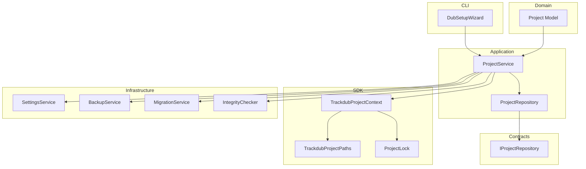

**Diagram sources**
- [Trackdub.Projects.cs](file://src/Trackdub.Domain/Projects/Trackdub.Projects.cs)
- [ProjectRepository.cs](file://src/Trackdub.Application/Projects/ProjectRepository.cs)
- [ProjectService.cs](file://src/Trackdub.Application/Projects/ProjectService.cs)
- [TrackdubProjectContext.cs](file://src/Trackdub.Sdk/TrackdubProjectContext.cs)
- [TrackdubProjectPaths.cs](file://src/Trackdub.Sdk/TrackdubProjectPaths.cs)
- [ProjectLock.cs](file://src/Trackdub.Sdk/ProjectLock.cs)
- [DubSetupWizard.cs](file://src/Trackdub.Cli/DubSetupWizard.cs)
- [SettingsService.cs](file://src/Trackdub.Infrastructure/Settings/SettingsService.cs)
- [BackupService.cs](file://src/Trackdub.Infrastructure/Persistence/BackupService.cs)
- [MigrationService.cs](file://src/Trackdub.Infrastructure/Persistence/MigrationService.cs)
- [IntegrityChecker.cs](file://src/Trackdub.Infrastructure/Diagnostics/IntegrityChecker.cs)
- [IProjectRepository.cs](file://src/Trackdub.Contracts/IProjectRepository.cs)

**Section sources**
- [Trackdub.Projects.cs](file://src/Trackdub.Domain/Projects/Trackdub.Projects.cs)
- [ProjectRepository.cs](file://src/Trackdub.Application/Projects/ProjectRepository.cs)
- [ProjectService.cs](file://src/Trackdub.Application/Projects/ProjectService.cs)
- [TrackdubProjectContext.cs](file://src/Trackdub.Sdk/TrackdubProjectContext.cs)
- [TrackdubProjectPaths.cs](file://src/Trackdub.Sdk/TrackdubProjectPaths.cs)
- [ProjectLock.cs](file://src/Trackdub.Sdk/ProjectLock.cs)
- [DubSetupWizard.cs](file://src/Trackdub.Cli/DubSetupWizard.cs)
- [SettingsService.cs](file://src/Trackdub.Infrastructure/Settings/SettingsService.cs)
- [BackupService.cs](file://src/Trackdub.Infrastructure/Persistence/BackupService.cs)
- [MigrationService.cs](file://src/Trackdub.Infrastructure/Persistence/MigrationService.cs)
- [IntegrityChecker.cs](file://src/Trackdub.Infrastructure/Diagnostics/IntegrityChecker.cs)
- [IProjectRepository.cs](file://src/Trackdub.Contracts/IProjectRepository.cs)

## Core Components
- Project model: Defines core project properties and relationships used across layers.
- Project repository: Persists and retrieves project metadata and state.
- Project service: Orchestrates creation, updates, imports/exports, backups, migrations, and integrity checks.
- SDK project context: Provides runtime paths, lock semantics, and environment-specific behavior.
- CLI wizard: Guides users through project creation, template selection, and initial configuration.
- Settings service: Manages default preferences and inheritance rules.
- Backup and migration services: Ensure safe transitions and recoverability.
- Integrity checker: Validates data consistency and detects corruption.

**Section sources**
- [Trackdub.Projects.cs](file://src/Trackdub.Domain/Projects/Trackdub.Projects.cs)
- [ProjectRepository.cs](file://src/Trackdub.Application/Projects/ProjectRepository.cs)
- [ProjectService.cs](file://src/Trackdub.Application/Projects/ProjectService.cs)
- [TrackdubProjectContext.cs](file://src/Trackdub.Sdk/TrackdubProjectContext.cs)
- [TrackdubProjectPaths.cs](file://src/Trackdub.Sdk/TrackdubProjectPaths.cs)
- [ProjectLock.cs](file://src/Trackdub.Sdk/ProjectLock.cs)
- [DubSetupWizard.cs](file://src/Trackdub.Cli/DubSetupWizard.cs)
- [SettingsService.cs](file://src/Trackdub.Infrastructure/Settings/SettingsService.cs)
- [BackupService.cs](file://src/Trackdub.Infrastructure/Persistence/BackupService.cs)
- [MigrationService.cs](file://src/Trackdub.Infrastructure/Persistence/MigrationService.cs)
- [IntegrityChecker.cs](file://src/Trackdub.Infrastructure/Diagnostics/IntegrityChecker.cs)
- [IProjectRepository.cs](file://src/Trackdub.Contracts/IProjectRepository.cs)

## Architecture Overview
The project management architecture follows a layered design with clear separation of concerns:
- Domain layer defines immutable or stable project entities.
- Application layer orchestrates workflows using services and repositories.
- SDK provides context and path resolution for project operations.
- CLI exposes user-facing wizards and commands.
- Infrastructure implements persistence, settings, backups, migrations, and diagnostics.
- Contracts define interfaces to decouple implementations.

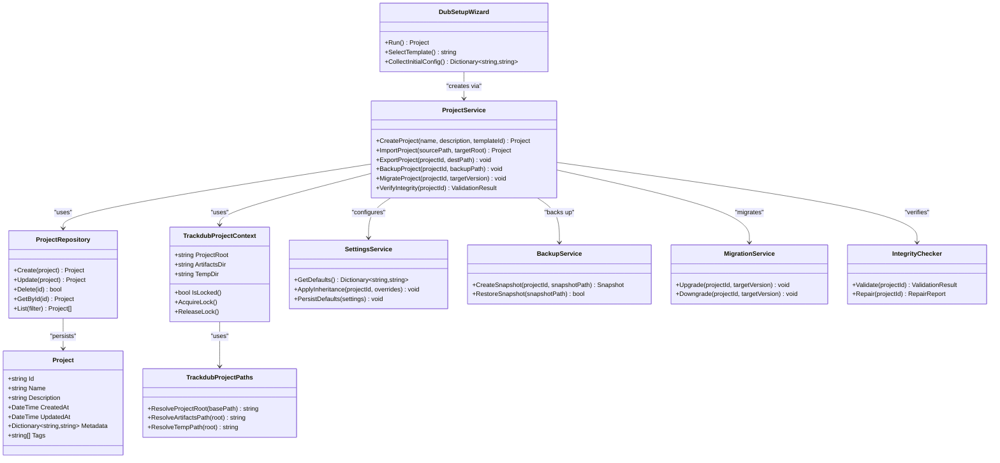

**Diagram sources**
- [Trackdub.Projects.cs](file://src/Trackdub.Domain/Projects/Trackdub.Projects.cs)
- [ProjectRepository.cs](file://src/Trackdub.Application/Projects/ProjectRepository.cs)
- [ProjectService.cs](file://src/Trackdub.Application/Projects/ProjectService.cs)
- [TrackdubProjectContext.cs](file://src/Trackdub.Sdk/TrackdubProjectContext.cs)
- [TrackdubProjectPaths.cs](file://src/Trackdub.Sdk/TrackdubProjectPaths.cs)
- [ProjectLock.cs](file://src/Trackdub.Sdk/ProjectLock.cs)
- [DubSetupWizard.cs](file://src/Trackdub.Cli/DubSetupWizard.cs)
- [SettingsService.cs](file://src/Trackdub.Infrastructure/Settings/SettingsService.cs)
- [BackupService.cs](file://src/Trackdub.Infrastructure/Persistence/BackupService.cs)
- [MigrationService.cs](file://src/Trackdub.Infrastructure/Persistence/MigrationService.cs)
- [IntegrityChecker.cs](file://src/Trackdub.Infrastructure/Diagnostics/IntegrityChecker.cs)
- [IProjectRepository.cs](file://src/Trackdub.Contracts/IProjectRepository.cs)

## Detailed Component Analysis

### Project Creation Wizard Workflow
The CLI wizard guides users through creating a new project:
- Prompt for project name and description
- Select a template (e.g., standard dubbing, voiceover, multilingual)
- Collect initial configuration (language pairs, output formats, quality presets)
- Validate inputs and create project metadata
- Initialize project directories and default settings
- Optionally run an initial integrity check

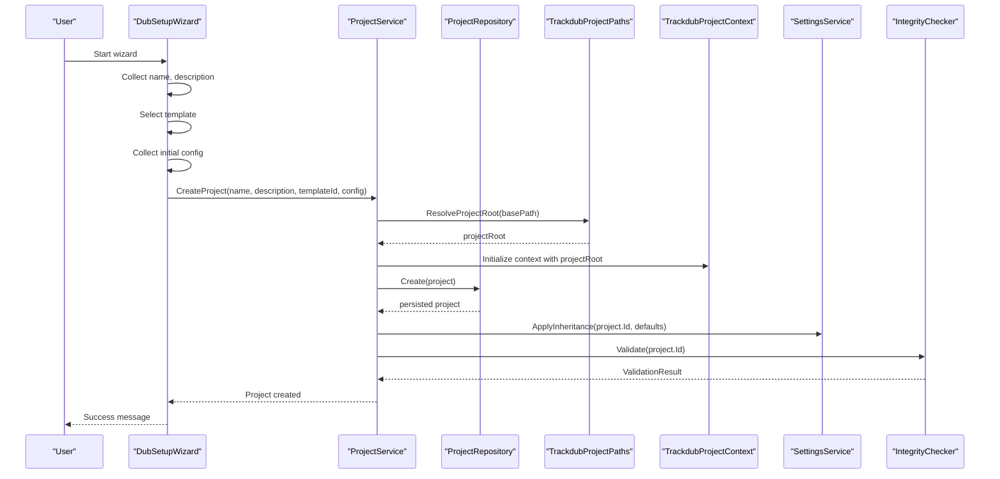

**Diagram sources**
- [DubSetupWizard.cs](file://src/Trackdub.Cli/DubSetupWizard.cs)
- [ProjectService.cs](file://src/Trackdub.Application/Projects/ProjectService.cs)
- [ProjectRepository.cs](file://src/Trackdub.Application/Projects/ProjectRepository.cs)
- [TrackdubProjectPaths.cs](file://src/Trackdub.Sdk/TrackdubProjectPaths.cs)
- [TrackdubProjectContext.cs](file://src/Trackdub.Sdk/TrackdubProjectContext.cs)
- [SettingsService.cs](file://src/Trackdub.Infrastructure/Settings/SettingsService.cs)
- [IntegrityChecker.cs](file://src/Trackdub.Infrastructure/Diagnostics/IntegrityChecker.cs)

**Section sources**
- [DubSetupWizard.cs](file://src/Trackdub.Cli/DubSetupWizard.cs)
- [ProjectService.cs](file://src/Trackdub.Application/Projects/ProjectService.cs)
- [ProjectRepository.cs](file://src/Trackdub.Application/Projects/ProjectRepository.cs)
- [TrackdubProjectPaths.cs](file://src/Trackdub.Sdk/TrackdubProjectPaths.cs)
- [TrackdubProjectContext.cs](file://src/Trackdub.Sdk/TrackdubProjectContext.cs)
- [SettingsService.cs](file://src/Trackdub.Infrastructure/Settings/SettingsService.cs)
- [IntegrityChecker.cs](file://src/Trackdub.Infrastructure/Diagnostics/IntegrityChecker.cs)

### Template Selection and Initial Configuration
Templates define baseline configurations such as language pairs, audio formats, transcription engines, and export presets. Initial configuration allows overriding defaults per project. The wizard validates selections and persists them into project metadata.

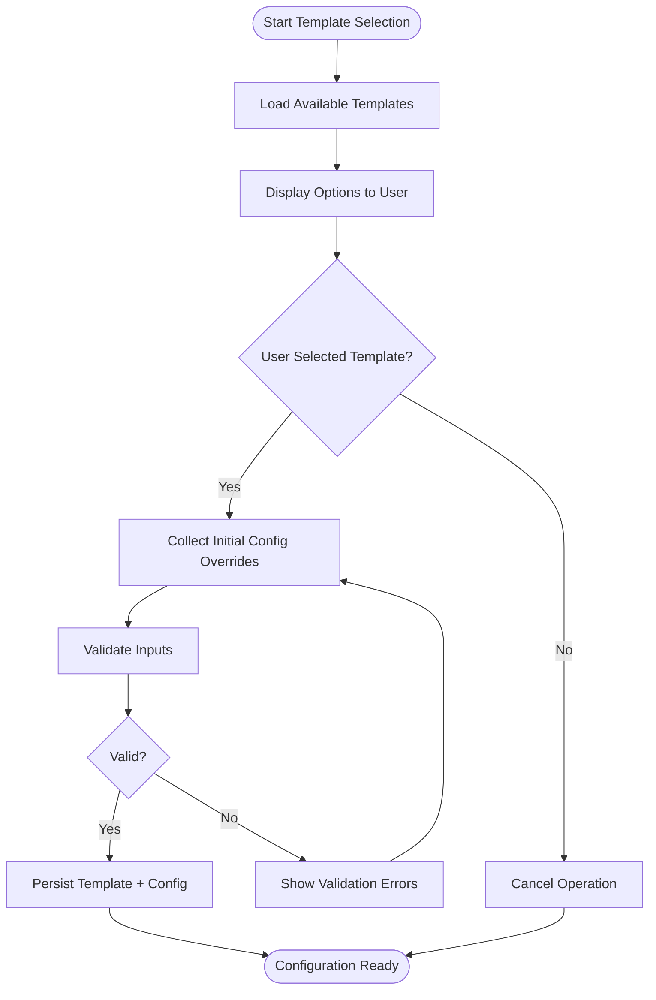

**Diagram sources**
- [DubSetupWizard.cs](file://src/Trackdub.Cli/DubSetupWizard.cs)
- [ProjectService.cs](file://src/Trackdub.Application/Projects/ProjectService.cs)

**Section sources**
- [DubSetupWizard.cs](file://src/Trackdub.Cli/DubSetupWizard.cs)
- [ProjectService.cs](file://src/Trackdub.Application/Projects/ProjectService.cs)

### Project File Structure and Metadata Management
A Trackdub project typically includes:
- Root directory with project metadata files
- Artifacts directory for generated outputs
- Temporary working directory for intermediate files
- Configuration files for settings and templates
- Version control hooks if enabled

Metadata is managed via the project model and persisted through the repository. Keys include identifiers, timestamps, tags, and custom fields.

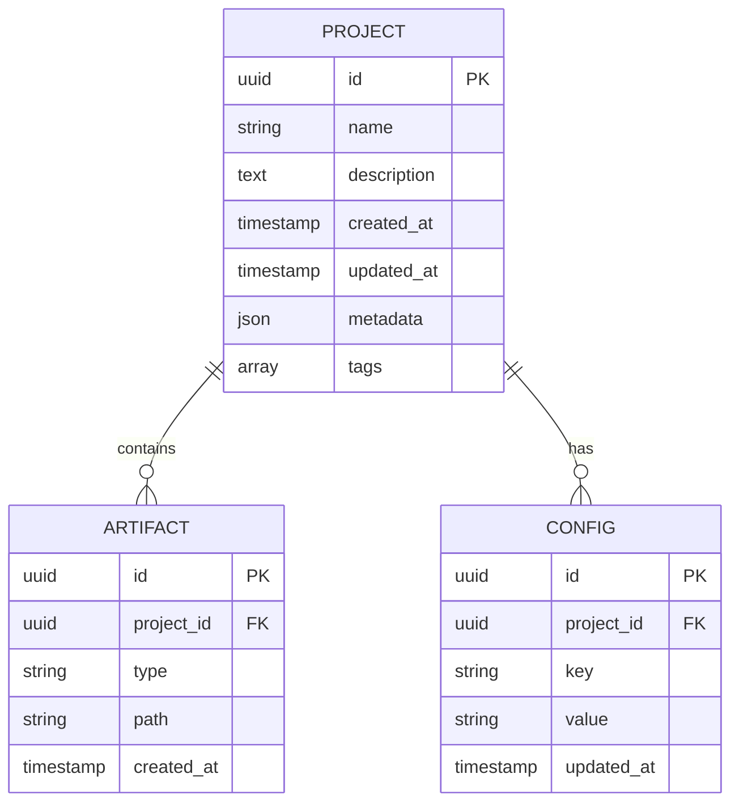

**Diagram sources**
- [Trackdub.Projects.cs](file://src/Trackdub.Domain/Projects/Trackdub.Projects.cs)
- [ProjectRepository.cs](file://src/Trackdub.Application/Projects/ProjectRepository.cs)

**Section sources**
- [Trackdub.Projects.cs](file://src/Trackdub.Domain/Projects/Trackdub.Projects.cs)
- [ProjectRepository.cs](file://src/Trackdub.Application/Projects/ProjectRepository.cs)

### Version Control Integration
Version control integration can be enabled at the project root level. Common practices include:
- Using Git hooks to track changes to project metadata and artifacts
- Excluding large binary artifacts from version control
- Committing configuration and template selections
- Tagging releases with version numbers

Best practices:
- Keep .gitignore updated to exclude temporary and artifact directories
- Use meaningful commit messages describing project changes
- Maintain separate branches for experiments and production-ready projects

[No sources needed since this section provides general guidance]

### Project Settings Inheritance and Default Preferences
Settings inheritance allows global defaults to be overridden by project-specific settings. The settings service applies inheritance rules when creating or updating projects. Defaults include:
- Audio processing parameters
- Transcription engine choices
- Export format and quality settings
- Language pair configurations

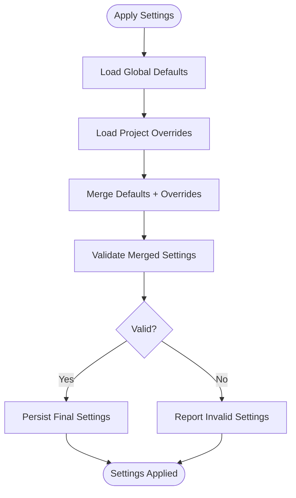

**Diagram sources**
- [SettingsService.cs](file://src/Trackdub.Infrastructure/Settings/SettingsService.cs)
- [ProjectService.cs](file://src/Trackdub.Application/Projects/ProjectService.cs)

**Section sources**
- [SettingsService.cs](file://src/Trackdub.Infrastructure/Settings/SettingsService.cs)
- [ProjectService.cs](file://src/Trackdub.Application/Projects/ProjectService.cs)

### Team Collaboration Features
Collaboration features may include:
- Shared project locations on network drives or cloud storage
- Access control via file system permissions
- Conflict resolution strategies for concurrent edits
- Audit logs for tracking changes

Recommendations:
- Use centralized storage with proper permissions
- Implement locking mechanisms to prevent concurrent modifications
- Maintain change logs and version history

[No sources needed since this section provides general guidance]

### Project Import/Export Functionality
Import functionality allows bringing external projects into Trackdub:
- Validate source project structure
- Convert legacy formats if necessary
- Map external metadata to internal schema
- Generate missing artifacts if possible

Export functionality enables sharing or archiving:
- Package project metadata and essential artifacts
- Exclude large temporary files
- Provide options for selective export

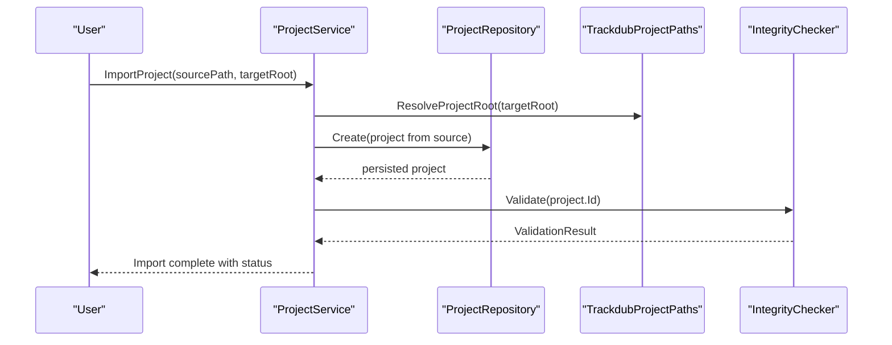

**Diagram sources**
- [ProjectService.cs](file://src/Trackdub.Application/Projects/ProjectService.cs)
- [ProjectRepository.cs](file://src/Trackdub.Application/Projects/ProjectRepository.cs)
- [TrackdubProjectPaths.cs](file://src/Trackdub.Sdk/TrackdubProjectPaths.cs)
- [IntegrityChecker.cs](file://src/Trackdub.Infrastructure/Diagnostics/IntegrityChecker.cs)

**Section sources**
- [ProjectService.cs](file://src/Trackdub.Application/Projects/ProjectService.cs)
- [ProjectRepository.cs](file://src/Trackdub.Application/Projects/ProjectRepository.cs)
- [TrackdubProjectPaths.cs](file://src/Trackdub.Sdk/TrackdubProjectPaths.cs)
- [IntegrityChecker.cs](file://src/Trackdub.Infrastructure/Diagnostics/IntegrityChecker.cs)

### Backup Strategies and Recovery
Backup strategies ensure data safety:
- Regular snapshots of project directories
- Incremental backups to minimize storage usage
- Encrypted backups for sensitive content
- Automated backup schedules

Recovery procedures:
- Restore from latest valid snapshot
- Verify integrity after restoration
- Rebuild missing artifacts if necessary

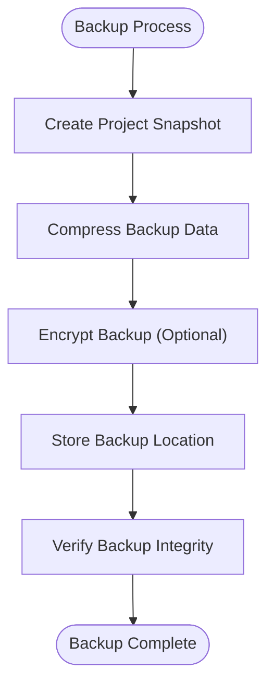

**Diagram sources**
- [BackupService.cs](file://src/Trackdub.Infrastructure/Persistence/BackupService.cs)
- [IntegrityChecker.cs](file://src/Trackdub.Infrastructure/Diagnostics/IntegrityChecker.cs)

**Section sources**
- [BackupService.cs](file://src/Trackdub.Infrastructure/Persistence/BackupService.cs)
- [IntegrityChecker.cs](file://src/Trackdub.Infrastructure/Diagnostics/IntegrityChecker.cs)

### Migration Between Versions
Migration services handle version upgrades and downgrades:
- Schema migrations for project metadata
- Data transformation for compatibility
- Rollback capabilities for failed migrations
- Validation after migration completion

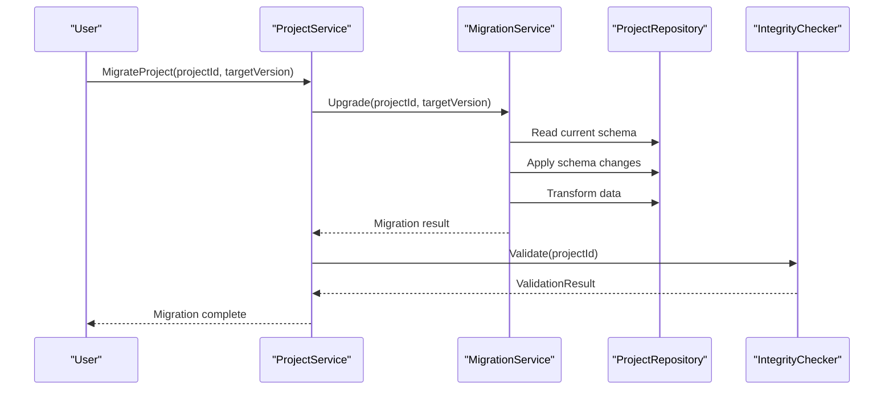

**Diagram sources**
- [ProjectService.cs](file://src/Trackdub.Application/Projects/ProjectService.cs)
- [MigrationService.cs](file://src/Trackdub.Infrastructure/Persistence/MigrationService.cs)
- [ProjectRepository.cs](file://src/Trackdub.Application/Projects/ProjectRepository.cs)
- [IntegrityChecker.cs](file://src/Trackdub.Infrastructure/Diagnostics/IntegrityChecker.cs)

**Section sources**
- [ProjectService.cs](file://src/Trackdub.Application/Projects/ProjectService.cs)
- [MigrationService.cs](file://src/Trackdub.Infrastructure/Persistence/MigrationService.cs)
- [ProjectRepository.cs](file://src/Trackdub.Application/Projects/ProjectRepository.cs)
- [IntegrityChecker.cs](file://src/Trackdub.Infrastructure/Diagnostics/IntegrityChecker.cs)

### Best Practices for Organizing Multiple Projects
Organizational best practices:
- Use consistent naming conventions (e.g., ProjectName_Version_Date)
- Group related projects in logical directories
- Maintain clear documentation for each project
- Use tags and metadata for easy filtering
- Implement standardized folder structures

Storage optimization:
- Archive completed projects
- Clean temporary files regularly
- Use compression for large artifacts
- Monitor disk usage and set alerts

[No sources needed since this section provides general guidance]

### Project Recovery and Corruption Handling
Recovery procedures for corrupted projects:
- Run integrity checks to identify issues
- Attempt automatic repairs where possible
- Restore from backups if manual repair fails
- Log all recovery actions for audit trails

Data integrity verification:
- Checksum validation for critical files
- Schema validation for metadata
- Reference integrity checks for relationships
- Performance monitoring during verification

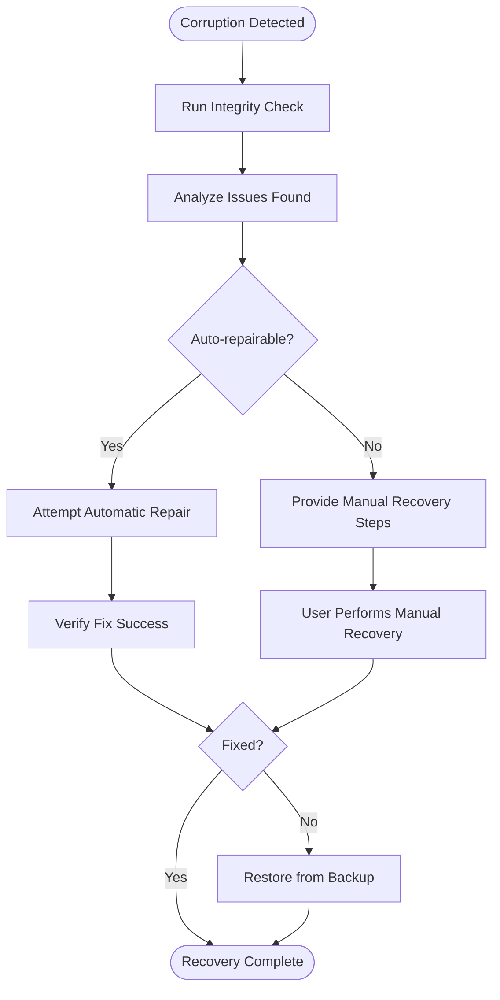

**Diagram sources**
- [IntegrityChecker.cs](file://src/Trackdub.Infrastructure/Diagnostics/IntegrityChecker.cs)
- [BackupService.cs](file://src/Trackdub.Infrastructure/Persistence/BackupService.cs)

**Section sources**
- [IntegrityChecker.cs](file://src/Trackdub.Infrastructure/Diagnostics/IntegrityChecker.cs)
- [BackupService.cs](file://src/Trackdub.Infrastructure/Persistence/BackupService.cs)

## Dependency Analysis
The project management system has clear dependency boundaries:
- Domain layer depends only on itself
- Application layer depends on domain and contracts
- SDK layer provides context without business logic
- Infrastructure implements concrete services
- CLI layer orchestrates user interactions

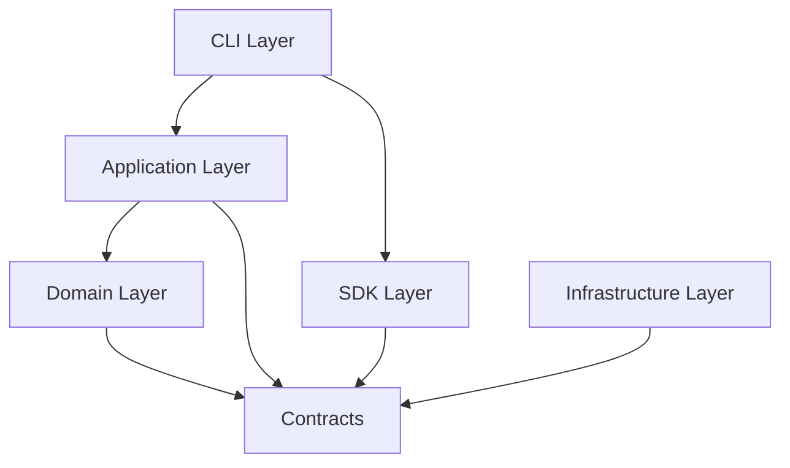

**Diagram sources**
- [Trackdub.Projects.cs](file://src/Trackdub.Domain/Projects/Trackdub.Projects.cs)
- [IProjectRepository.cs](file://src/Trackdub.Contracts/IProjectRepository.cs)
- [ProjectRepository.cs](file://src/Trackdub.Application/Projects/ProjectRepository.cs)
- [TrackdubProjectContext.cs](file://src/Trackdub.Sdk/TrackdubProjectContext.cs)
- [SettingsService.cs](file://src/Trackdub.Infrastructure/Settings/SettingsService.cs)
- [DubSetupWizard.cs](file://src/Trackdub.Cli/DubSetupWizard.cs)

**Section sources**
- [Trackdub.Projects.cs](file://src/Trackdub.Domain/Projects/Trackdub.Projects.cs)
- [IProjectRepository.cs](file://src/Trackdub.Contracts/IProjectRepository.cs)
- [ProjectRepository.cs](file://src/Trackdub.Application/Projects/ProjectRepository.cs)
- [TrackdubProjectContext.cs](file://src/Trackdub.Sdk/TrackdubProjectContext.cs)
- [SettingsService.cs](file://src/Trackdub.Infrastructure/Settings/SettingsService.cs)
- [DubSetupWizard.cs](file://src/Trackdub.Cli/DubSetupWizard.cs)

## Performance Considerations
Performance considerations for project management:
- Use lazy loading for large project artifacts
- Implement caching for frequently accessed metadata
- Optimize database queries for project listing and filtering
- Use asynchronous operations for long-running tasks
- Monitor memory usage during batch operations

[No sources needed since this section provides general guidance]

## Troubleshooting Guide
Common troubleshooting steps:
- Check project integrity using built-in validation tools
- Review application logs for error details
- Verify file permissions and disk space
- Test network connectivity for shared projects
- Validate configuration files syntax

Recovery procedures:
- Restore from last known good backup
- Rebuild project index if corrupted
- Reset project locks if stuck
- Clear temporary files and restart

**Section sources**
- [IntegrityChecker.cs](file://src/Trackdub.Infrastructure/Diagnostics/IntegrityChecker.cs)
- [ProjectLock.cs](file://src/Trackdub.Sdk/ProjectLock.cs)
- [BackupService.cs](file://src/Trackdub.Infrastructure/Persistence/BackupService.cs)

## Conclusion
Trackdub’s project management system provides comprehensive tools for creating, organizing, and maintaining projects. The layered architecture ensures maintainability and extensibility. Key features include wizard-driven project creation, template-based configuration, robust backup and migration capabilities, and strong data integrity verification. Following the recommended best practices will help teams manage multiple projects effectively while maintaining data safety and performance.

[No sources needed since this section summarizes without analyzing specific files]

## Appendices
Additional resources and references:
- API documentation for project services
- Configuration file schemas
- Template definitions and customization
- Migration scripts and upgrade guides

[No sources needed since this section provides general guidance]