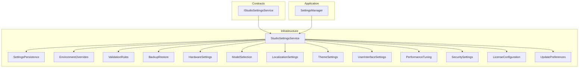
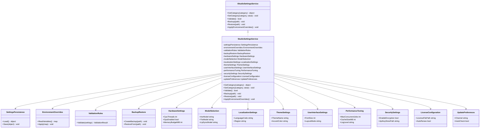
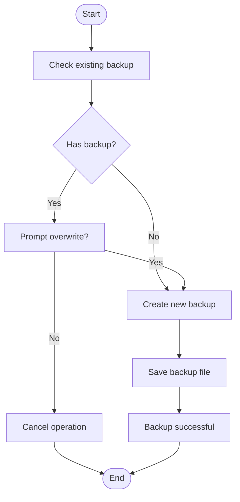
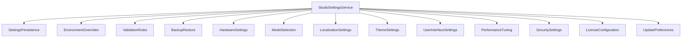

# Settings & Configuration

<cite>
**Referenced Files in This Document**
- [Trackdub.Infrastructure/Settings/StudioSettingsService.cs](file://src/Trackdub.Infrastructure/Settings/StudioSettingsService.cs)
- [Trackdub.Contracts/IStudioSettingsService.cs](file://src/Trackdub.Contracts/IStudioSettingsService.cs)
- [Trackdub.Infrastructure/Settings/SettingsPersistence.cs](file://src/Trackdub.Infrastructure/Settings/SettingsPersistence.cs)
- [Trackdub.Application/Settings/SettingsManager.cs](file://src/Trackdub.Application/Settings/SettingsManager.cs)
- [Trackdub.Infrastructure/Settings/EnvironmentOverrides.cs](file://src/Trackdub.Infrastructure/Settings/EnvironmentOverrides.cs)
- [Trackdub.Infrastructure/Settings/ValidationRules.cs](file://src/Trackdub.Infrastructure/Settings/ValidationRules.cs)
- [Trackdub.Infrastructure/Settings/BackupRestore.cs](file://src/Trackdub.Infrastructure/Settings/BackupRestore.cs)
- [Trackdub.Infrastructure/Settings/LicenseConfiguration.cs](file://src/Trackdub.Infrastructure/Settings/LicenseConfiguration.cs)
- [Trackdub.Infrastructure/Settings/UpdatePreferences.cs](file://src/Trackdub.Infrastructure/Settings/UpdatePreferences.cs)
- [Trackdub.Infrastructure/Settings/HardwareSettings.cs](file://src/Trackdub.Infrastructure/Settings/HardwareSettings.cs)
- [Trackdub.Infrastructure/Settings/ModelSelection.cs](file://src/Trackdub.Infrastructure/Settings/ModelSelection.cs)
- [Trackdub.Infrastructure/Settings/LocalizationSettings.cs](file://src/Trackdub.Infrastructure/Settings/LocalizationSettings.cs)
- [Trackdub.Infrastructure/Settings/ThemeSettings.cs](file://src/Trackdub.Infrastructure/Settings/ThemeSettings.cs)
- [Trackdub.Infrastructure/Settings/UserInterfaceSettings.cs](file://src/Trackdub.Infrastructure/Settings/UserInterfaceSettings.cs)
- [Trackdub.Infrastructure/Settings/PerformanceTuning.cs](file://src/Trackdub.Infrastructure/Settings/PerformanceTuning.cs)
- [Trackdub.Infrastructure/Settings/SecuritySettings.cs](file://src/Trackdub.Infrastructure/Settings/SecuritySettings.cs)
</cite>

## Table of Contents
1. [Introduction](#introduction)
2. [Project Structure](#project-structure)
3. [Core Components](#core-components)
4. [Architecture Overview](#architecture-overview)
5. [Detailed Component Analysis](#detailed-component-analysis)
6. [Dependency Analysis](#dependency-analysis)
7. [Performance Considerations](#performance-considerations)
8. [Troubleshooting Guide](#troubleshooting-guide)
9. [Conclusion](#conclusion)
10. [Appendices](#appendices)

## Introduction
This document provides comprehensive documentation for all settings and configuration options available in the Trackdub desktop application. It covers the settings interface organization, preference categories, advanced configuration options, hardware-specific settings, model selection, performance tuning parameters, localization settings, theme customization, user interface personalization, configuration file formats, backup and restore procedures, environment variable overrides, troubleshooting guidance, validation rules, recommended settings for different use cases, security settings, license configuration, and update preferences.

## Project Structure
The settings subsystem is organized across contracts, infrastructure, and application layers:
- Contracts define interfaces for settings services.
- Infrastructure implements persistence, validation, backup/restore, environment overrides, and domain-specific settings (hardware, models, localization, themes, UI, performance, security, licenses, updates).
- Application layer orchestrates settings access and integrates with UI and runtime components.

**Diagram sources**
- [Trackdub.Contracts/IStudioSettingsService.cs](file://src/Trackdub.Contracts/IStudioSettingsService.cs)
- [Trackdub.Infrastructure/Settings/StudioSettingsService.cs](file://src/Trackdub.Infrastructure/Settings/StudioSettingsService.cs)
- [Trackdub.Infrastructure/Settings/SettingsPersistence.cs](file://src/Trackdub.Infrastructure/Settings/SettingsPersistence.cs)
- [Trackdub.Infrastructure/Settings/EnvironmentOverrides.cs](file://src/Trackdub.Infrastructure/Settings/EnvironmentOverrides.cs)
- [Trackdub.Infrastructure/Settings/ValidationRules.cs](file://src/Trackdub.Infrastructure/Settings/ValidationRules.cs)
- [Trackdub.Infrastructure/Settings/BackupRestore.cs](file://src/Trackdub.Infrastructure/Settings/BackupRestore.cs)
- [Trackdub.Infrastructure/Settings/HardwareSettings.cs](file://src/Trackdub.Infrastructure/Settings/HardwareSettings.cs)
- [Trackdub.Infrastructure/Settings/ModelSelection.cs](file://src/Trackdub.Infrastructure/Settings/ModelSelection.cs)
- [Trackdub.Infrastructure/Settings/LocalizationSettings.cs](file://src/Trackdub.Infrastructure/Settings/LocalizationSettings.cs)
- [Trackdub.Infrastructure/Settings/ThemeSettings.cs](file://src/Trackdub.Infrastructure/Settings/ThemeSettings.cs)
- [Trackdub.Infrastructure/Settings/UserInterfaceSettings.cs](file://src/Trackdub.Infrastructure/Settings/UserInterfaceSettings.cs)
- [Trackdub.Infrastructure/Settings/PerformanceTuning.cs](file://src/Trackdub.Infrastructure/Settings/PerformanceTuning.cs)
- [Trackdub.Infrastructure/Settings/SecuritySettings.cs](file://src/Trackdub.Infrastructure/Settings/SecuritySettings.cs)
- [Trackdub.Infrastructure/Settings/LicenseConfiguration.cs](file://src/Trackdub.Infrastructure/Settings/LicenseConfiguration.cs)
- [Trackdub.Infrastructure/Settings/UpdatePreferences.cs](file://src/Trackdub.Infrastructure/Settings/UpdatePreferences.cs)
- [Trackdub.Application/Settings/SettingsManager.cs](file://src/Trackdub.Application/Settings/SettingsManager.cs)

**Section sources**
- [Trackdub.Contracts/IStudioSettingsService.cs](file://src/Trackdub.Contracts/IStudioSettingsService.cs)
- [Trackdub.Infrastructure/Settings/StudioSettingsService.cs](file://src/Trackdub.Infrastructure/Settings/StudioSettingsService.cs)
- [Trackdub.Application/Settings/SettingsManager.cs](file://src/Trackdub.Application/Settings/SettingsManager.cs)

## Core Components
- StudioSettingsService: Central service coordinating settings operations, including reading/writing, validation, backups, and environment overrides.
- SettingsPersistence: Handles serialization and storage of settings to files or databases.
- EnvironmentOverrides: Applies environment variables to override persisted settings at runtime.
- ValidationRules: Enforces constraints and default values for settings.
- BackupRestore: Creates and restores settings snapshots.
- Domain-specific settings modules: HardwareSettings, ModelSelection, LocalizationSettings, ThemeSettings, UserInterfaceSettings, PerformanceTuning, SecuritySettings, LicenseConfiguration, UpdatePreferences.

Key responsibilities:
- Provide typed accessors for each setting category.
- Ensure consistency via validation and defaults.
- Support portable configuration via environment variables.
- Enable safe migration through backup/restore.

**Section sources**
- [Trackdub.Infrastructure/Settings/StudioSettingsService.cs](file://src/Trackdub.Infrastructure/Settings/StudioSettingsService.cs)
- [Trackdub.Infrastructure/Settings/SettingsPersistence.cs](file://src/Trackdub.Infrastructure/Settings/SettingsPersistence.cs)
- [Trackdub.Infrastructure/Settings/EnvironmentOverrides.cs](file://src/Trackdub.Infrastructure/Settings/EnvironmentOverrides.cs)
- [Trackdub.Infrastructure/Settings/ValidationRules.cs](file://src/Trackdub.Infrastructure/Settings/ValidationRules.cs)
- [Trackdub.Infrastructure/Settings/BackupRestore.cs](file://src/Trackdub.Infrastructure/Settings/BackupRestore.cs)

## Architecture Overview
The settings architecture follows a layered design:
- Contract layer defines IStudioSettingsService.
- Infrastructure layer implements concrete settings services and utilities.
- Application layer composes settings into higher-level workflows.

**Diagram sources**
- [Trackdub.Contracts/IStudioSettingsService.cs](file://src/Trackdub.Contracts/IStudioSettingsService.cs)
- [Trackdub.Infrastructure/Settings/StudioSettingsService.cs](file://src/Trackdub.Infrastructure/Settings/StudioSettingsService.cs)
- [Trackdub.Infrastructure/Settings/SettingsPersistence.cs](file://src/Trackdub.Infrastructure/Settings/SettingsPersistence.cs)
- [Trackdub.Infrastructure/Settings/EnvironmentOverrides.cs](file://src/Trackdub.Infrastructure/Settings/EnvironmentOverrides.cs)
- [Trackdub.Infrastructure/Settings/ValidationRules.cs](file://src/Trackdub.Infrastructure/Settings/ValidationRules.cs)
- [Trackdub.Infrastructure/Settings/BackupRestore.cs](file://src/Trackdub.Infrastructure/Settings/BackupRestore.cs)
- [Trackdub.Infrastructure/Settings/HardwareSettings.cs](file://src/Trackdub.Infrastructure/Settings/HardwareSettings.cs)
- [Trackdub.Infrastructure/Settings/ModelSelection.cs](file://src/Trackdub.Infrastructure/Settings/ModelSelection.cs)
- [Trackdub.Infrastructure/Settings/LocalizationSettings.cs](file://src/Trackdub.Infrastructure/Settings/LocalizationSettings.cs)
- [Trackdub.Infrastructure/Settings/ThemeSettings.cs](file://src/Trackdub.Infrastructure/Settings/ThemeSettings.cs)
- [Trackdub.Infrastructure/Settings/UserInterfaceSettings.cs](file://src/Trackdub.Infrastructure/Settings/UserInterfaceSettings.cs)
- [Trackdub.Infrastructure/Settings/PerformanceTuning.cs](file://src/Trackdub.Infrastructure/Settings/PerformanceTuning.cs)
- [Trackdub.Infrastructure/Settings/SecuritySettings.cs](file://src/Trackdub.Infrastructure/Settings/SecuritySettings.cs)
- [Trackdub.Infrastructure/Settings/LicenseConfiguration.cs](file://src/Trackdub.Infrastructure/Settings/LicenseConfiguration.cs)
- [Trackdub.Infrastructure/Settings/UpdatePreferences.cs](file://src/Trackdub.Infrastructure/Settings/UpdatePreferences.cs)

## Detailed Component Analysis

### Settings Interface Organization
- Categories are exposed via typed getters/setters on StudioSettingsService.
- Each category encapsulates related settings (e.g., HardwareSettings for device and resource limits).
- The interface ensures consistent access patterns across the application.

Recommended usage:
- Use GetCategory/SetCategory for dynamic access.
- Prefer strongly-typed properties within each category module for clarity.

**Section sources**
- [Trackdub.Contracts/IStudioSettingsService.cs](file://src/Trackdub.Contracts/IStudioSettingsService.cs)
- [Trackdub.Infrastructure/Settings/StudioSettingsService.cs](file://src/Trackdub.Infrastructure/Settings/StudioSettingsService.cs)

### Preference Categories
- HardwareSettings: CPU threads, GPU enablement, memory budget.
- ModelSelection: ASR, TTS, LipSync model identifiers.
- LocalizationSettings: Language code, region.
- ThemeSettings: Theme name, accent color.
- UserInterfaceSettings: Font size, layout mode.
- PerformanceTuning: Max concurrent jobs, cache size, log level.
- SecuritySettings: Encryption toggle, API key store path.
- LicenseConfiguration: License file path, auto-renew flag.
- UpdatePreferences: Channel, auto-check flag.

Each category supports validation and defaults.

**Section sources**
- [Trackdub.Infrastructure/Settings/HardwareSettings.cs](file://src/Trackdub.Infrastructure/Settings/HardwareSettings.cs)
- [Trackdub.Infrastructure/Settings/ModelSelection.cs](file://src/Trackdub.Infrastructure/Settings/ModelSelection.cs)
- [Trackdub.Infrastructure/Settings/LocalizationSettings.cs](file://src/Trackdub.Infrastructure/Settings/LocalizationSettings.cs)
- [Trackdub.Infrastructure/Settings/ThemeSettings.cs](file://src/Trackdub.Infrastructure/Settings/ThemeSettings.cs)
- [Trackdub.Infrastructure/Settings/UserInterfaceSettings.cs](file://src/Trackdub.Infrastructure/Settings/UserInterfaceSettings.cs)
- [Trackdub.Infrastructure/Settings/PerformanceTuning.cs](file://src/Trackdub.Infrastructure/Settings/PerformanceTuning.cs)
- [Trackdub.Infrastructure/Settings/SecuritySettings.cs](file://src/Trackdub.Infrastructure/Settings/SecuritySettings.cs)
- [Trackdub.Infrastructure/Settings/LicenseConfiguration.cs](file://src/Trackdub.Infrastructure/Settings/LicenseConfiguration.cs)
- [Trackdub.Infrastructure/Settings/UpdatePreferences.cs](file://src/Trackdub.Infrastructure/Settings/UpdatePreferences.cs)

### Advanced Configuration Options
- EnvironmentOverrides: Reads environment variables and applies them to settings at startup.
- ValidationRules: Enforces constraints such as ranges, required fields, and format checks.
- BackupRestore: Supports exporting/importing settings to/from JSON or other formats.

Usage scenarios:
- CI environments can set environment variables to override defaults without modifying persisted files.
- Administrators can validate configurations before deployment using ValidationRules.
- Users can back up settings prior to major changes and restore if needed.

**Section sources**
- [Trackdub.Infrastructure/Settings/EnvironmentOverrides.cs](file://src/Trackdub.Infrastructure/Settings/EnvironmentOverrides.cs)
- [Trackdub.Infrastructure/Settings/ValidationRules.cs](file://src/Trackdub.Infrastructure/Settings/ValidationRules.cs)
- [Trackdub.Infrastructure/Settings/BackupRestore.cs](file://src/Trackdub.Infrastructure/Settings/BackupRestore.cs)

### Hardware-Specific Settings
- CpuThreads: Controls parallelism for CPU-bound tasks.
- GpuEnabled: Enables GPU acceleration where supported.
- MemoryBudgetMB: Limits memory usage for inference and processing.

Recommendations:
- Set CpuThreads to match physical cores for optimal throughput.
- Enable GpuEnabled only if compatible drivers and libraries are present.
- Adjust MemoryBudgetMB based on available RAM and model sizes.

**Section sources**
- [Trackdub.Infrastructure/Settings/HardwareSettings.cs](file://src/Trackdub.Infrastructure/Settings/HardwareSettings.cs)

### Model Selection
- AsrModel: Identifier for automatic speech recognition model.
- TtsModel: Identifier for text-to-speech model.
- LipSyncModel: Identifier for lip-sync model.

Guidelines:
- Choose smaller models for low-resource devices.
- Ensure selected models are downloaded and accessible.
- Validate model compatibility with execution providers.

**Section sources**
- [Trackdub.Infrastructure/Settings/ModelSelection.cs](file://src/Trackdub.Infrastructure/Settings/ModelSelection.cs)

### Performance Tuning Parameters
- MaxConcurrentJobs: Limits simultaneous processing jobs.
- CacheSizeMB: Configures in-memory cache size for artifacts.
- LogLevel: Sets logging verbosity (e.g., Debug, Info, Warn, Error).

Best practices:
- Reduce MaxConcurrentJobs on systems with limited resources.
- Increase CacheSizeMB to improve repeated operation speed.
- Use Debug level during development; switch to Info/Warn in production.

**Section sources**
- [Trackdub.Infrastructure/Settings/PerformanceTuning.cs](file://src/Trackdub.Infrastructure/Settings/PerformanceTuning.cs)

### Localization Settings
- LanguageCode: ISO language code (e.g., en, fr, de).
- Region: Locale region (e.g., US, DE).

Notes:
- Changes may require application restart to take effect.
- Ensure localized resources are installed for selected languages.

**Section sources**
- [Trackdub.Infrastructure/Settings/LocalizationSettings.cs](file://src/Trackdub.Infrastructure/Settings/LocalizationSettings.cs)

### Theme Customization
- ThemeName: Name of the active theme (e.g., Light, Dark).
- AccentColor: Hex color code for accent elements.

Considerations:
- Some themes may not support all accent colors.
- UI refresh may be required after changing theme settings.

**Section sources**
- [Trackdub.Infrastructure/Settings/ThemeSettings.cs](file://src/Trackdub.Infrastructure/Settings/ThemeSettings.cs)

### User Interface Personalization
- FontSize: Base font size for UI elements.
- LayoutMode: Preferred layout style (e.g., Compact, Spacious).

Tips:
- Larger fonts improve readability on high-DPI displays.
- LayoutMode affects panel density and navigation flow.

**Section sources**
- [Trackdub.Infrastructure/Settings/UserInterfaceSettings.cs](file://src/Trackdub.Infrastructure/Settings/UserInterfaceSettings.cs)

### Security Settings
- EnableEncryption: Toggle encryption for sensitive data at rest.
- ApiKeyStorePath: Path to secure storage for API keys.

Security recommendations:
- Enable encryption in multi-user environments.
- Store API keys in OS-native secure stores when possible.

**Section sources**
- [Trackdub.Infrastructure/Settings/SecuritySettings.cs](file://src/Trackdub.Infrastructure/Settings/SecuritySettings.cs)

### License Configuration
- LicenseFilePath: Path to license file or token.
- AutoRenew: Flag to automatically renew licenses when available.

Operational notes:
- Invalid or expired licenses may restrict features.
- Auto-renew requires network connectivity and valid credentials.

**Section sources**
- [Trackdub.Infrastructure/Settings/LicenseConfiguration.cs](file://src/Trackdub.Infrastructure/Settings/LicenseConfiguration.cs)

### Update Preferences
- Channel: Update channel (e.g., Stable, Beta, Dev).
- AutoCheck: Automatically check for updates on startup.

Guidance:
- Use Stable for production deployments.
- Enable AutoCheck to receive timely updates.

**Section sources**
- [Trackdub.Infrastructure/Settings/UpdatePreferences.cs](file://src/Trackdub.Infrastructure/Settings/UpdatePreferences.cs)

### Configuration File Formats
- Primary format: JSON-based serialization via SettingsPersistence.
- Backup files: JSON snapshots created by BackupRestore.
- Environment variables: Key-value pairs overriding specific settings.

Migration strategy:
- Use BackupRestore to export current settings before upgrades.
- Validate new configurations with ValidationRules before applying.

**Section sources**
- [Trackdub.Infrastructure/Settings/SettingsPersistence.cs](file://src/Trackdub.Infrastructure/Settings/SettingsPersistence.cs)
- [Trackdub.Infrastructure/Settings/BackupRestore.cs](file://src/Trackdub.Infrastructure/Settings/BackupRestore.cs)
- [Trackdub.Infrastructure/Settings/EnvironmentOverrides.cs](file://src/Trackdub.Infrastructure/Settings/EnvironmentOverrides.cs)

### Backup and Restore Procedures
- Create a backup before making significant changes.
- Restore from a known-good snapshot if issues arise.
- Automate backups in CI/CD pipelines for reproducibility.

Workflow:

**Diagram sources**
- [Trackdub.Infrastructure/Settings/BackupRestore.cs](file://src/Trackdub.Infrastructure/Settings/BackupRestore.cs)

**Section sources**
- [Trackdub.Infrastructure/Settings/BackupRestore.cs](file://src/Trackdub.Infrastructure/Settings/BackupRestore.cs)

### Environment Variable Overrides
- Variables are read at startup and applied to corresponding settings.
- Naming convention typically maps to setting paths (e.g., HARDWARE_CPU_THREADS).
- Overrides take precedence over persisted values.

Example mapping:
- HARDWARE_GPU_ENABLED -> HardwareSettings.GpuEnabled
- MODEL_ASR_MODEL -> ModelSelection.AsrModel
- PERFORMANCE_LOG_LEVEL -> PerformanceTuning.LogLevel

**Section sources**
- [Trackdub.Infrastructure/Settings/EnvironmentOverrides.cs](file://src/Trackdub.Infrastructure/Settings/EnvironmentOverrides.cs)

### Troubleshooting Guidance
Common issues and resolutions:
- Invalid settings values: Use ValidationRules to detect and correct errors.
- Missing models: Verify ModelSelection identifiers and ensure downloads completed.
- GPU not detected: Confirm driver installation and GpuEnabled flag.
- Permission errors: Check file paths for SecuritySettings and LicenseConfiguration.
- Update failures: Validate UpdatePreferences.Channel and network connectivity.

Diagnostic steps:
- Export settings and inspect for inconsistencies.
- Review logs at appropriate LogLevel.
- Temporarily disable GPU to isolate hardware-related problems.

**Section sources**
- [Trackdub.Infrastructure/Settings/ValidationRules.cs](file://src/Trackdub.Infrastructure/Settings/ValidationRules.cs)
- [Trackdub.Infrastructure/Settings/PerformanceTuning.cs](file://src/Trackdub.Infrastructure/Settings/PerformanceTuning.cs)
- [Trackdub.Infrastructure/Settings/SecuritySettings.cs](file://src/Trackdub.Infrastructure/Settings/SecuritySettings.cs)
- [Trackdub.Infrastructure/Settings/LicenseConfiguration.cs](file://src/Trackdub.Infrastructure/Settings/LicenseConfiguration.cs)
- [Trackdub.Infrastructure/Settings/UpdatePreferences.cs](file://src/Trackdub.Infrastructure/Settings/UpdatePreferences.cs)

### Recommended Settings for Different Use Cases
- Development:
  - LogLevel: Debug
  - MaxConcurrentJobs: Low to moderate
  - CacheSizeMB: Moderate
  - AutoCheck: Enabled
- Production:
  - LogLevel: Info or Warn
  - MaxConcurrentJobs: High (based on hardware)
  - CacheSizeMB: Large
  - AutoCheck: Disabled or Stable channel
- Low-resource devices:
  - CpuThreads: Limited to physical cores
  - GpuEnabled: Disabled
  - MemoryBudgetMB: Conservative
  - ModelSelection: Small models

**Section sources**
- [Trackdub.Infrastructure/Settings/PerformanceTuning.cs](file://src/Trackdub.Infrastructure/Settings/PerformanceTuning.cs)
- [Trackdub.Infrastructure/Settings/HardwareSettings.cs](file://src/Trackdub.Infrastructure/Settings/HardwareSettings.cs)
- [Trackdub.Infrastructure/Settings/ModelSelection.cs](file://src/Trackdub.Infrastructure/Settings/ModelSelection.cs)
- [Trackdub.Infrastructure/Settings/UpdatePreferences.cs](file://src/Trackdub.Infrastructure/Settings/UpdatePreferences.cs)

## Dependency Analysis
The settings system exhibits clear separation of concerns:
- StudioSettingsService depends on multiple specialized modules.
- Persistence and validation are cross-cutting concerns.
- Environment overrides provide external configuration injection.
- Backup/restore ensures resilience and portability.

**Diagram sources**
- [Trackdub.Infrastructure/Settings/StudioSettingsService.cs](file://src/Trackdub.Infrastructure/Settings/StudioSettingsService.cs)
- [Trackdub.Infrastructure/Settings/SettingsPersistence.cs](file://src/Trackdub.Infrastructure/Settings/SettingsPersistence.cs)
- [Trackdub.Infrastructure/Settings/EnvironmentOverrides.cs](file://src/Trackdub.Infrastructure/Settings/EnvironmentOverrides.cs)
- [Trackdub.Infrastructure/Settings/ValidationRules.cs](file://src/Trackdub.Infrastructure/Settings/ValidationRules.cs)
- [Trackdub.Infrastructure/Settings/BackupRestore.cs](file://src/Trackdub.Infrastructure/Settings/BackupRestore.cs)
- [Trackdub.Infrastructure/Settings/HardwareSettings.cs](file://src/Trackdub.Infrastructure/Settings/HardwareSettings.cs)
- [Trackdub.Infrastructure/Settings/ModelSelection.cs](file://src/Trackdub.Infrastructure/Settings/ModelSelection.cs)
- [Trackdub.Infrastructure/Settings/LocalizationSettings.cs](file://src/Trackdub.Infrastructure/Settings/LocalizationSettings.cs)
- [Trackdub.Infrastructure/Settings/ThemeSettings.cs](file://src/Trackdub.Infrastructure/Settings/ThemeSettings.cs)
- [Trackdub.Infrastructure/Settings/UserInterfaceSettings.cs](file://src/Trackdub.Infrastructure/Settings/UserInterfaceSettings.cs)
- [Trackdub.Infrastructure/Settings/PerformanceTuning.cs](file://src/Trackdub.Infrastructure/Settings/PerformanceTuning.cs)
- [Trackdub.Infrastructure/Settings/SecuritySettings.cs](file://src/Trackdub.Infrastructure/Settings/SecuritySettings.cs)
- [Trackdub.Infrastructure/Settings/LicenseConfiguration.cs](file://src/Trackdub.Infrastructure/Settings/LicenseConfiguration.cs)
- [Trackdub.Infrastructure/Settings/UpdatePreferences.cs](file://src/Trackdub.Infrastructure/Settings/UpdatePreferences.cs)

**Section sources**
- [Trackdub.Infrastructure/Settings/StudioSettingsService.cs](file://src/Trackdub.Infrastructure/Settings/StudioSettingsService.cs)

## Performance Considerations
- Tune MaxConcurrentJobs and CacheSizeMB based on workload characteristics.
- Avoid excessive logging in production to reduce I/O overhead.
- Disable GPU acceleration if drivers are incompatible or unstable.
- Use small models for latency-sensitive applications.

[No sources needed since this section provides general guidance]

## Troubleshooting Guide
- Validate settings using ValidationRules before deployment.
- Inspect logs at appropriate LogLevel for detailed diagnostics.
- Use BackupRestore to revert to known-good configurations.
- Check environment variables for unintended overrides.
- Verify model availability and compatibility.

**Section sources**
- [Trackdub.Infrastructure/Settings/ValidationRules.cs](file://src/Trackdub.Infrastructure/Settings/ValidationRules.cs)
- [Trackdub.Infrastructure/Settings/PerformanceTuning.cs](file://src/Trackdub.Infrastructure/Settings/PerformanceTuning.cs)
- [Trackdub.Infrastructure/Settings/BackupRestore.cs](file://src/Trackdub.Infrastructure/Settings/BackupRestore.cs)
- [Trackdub.Infrastructure/Settings/EnvironmentOverrides.cs](file://src/Trackdub.Infrastructure/Settings/EnvironmentOverrides.cs)

## Conclusion
The Trackdub settings system provides a robust, extensible framework for managing application configuration. By leveraging categorized settings, validation, environment overrides, and backup/restore capabilities, users can tailor the application to diverse environments and use cases while maintaining reliability and security.

[No sources needed since this section summarizes without analyzing specific files]

## Appendices
- Quick reference for environment variable naming conventions.
- Example JSON schema for settings persistence.
- Checklist for pre-deployment validation.

[No sources needed since this section provides general guidance]