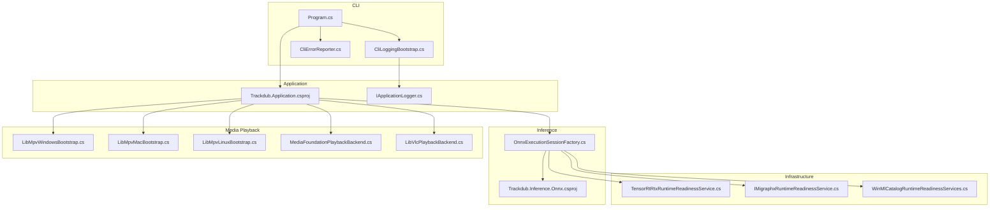
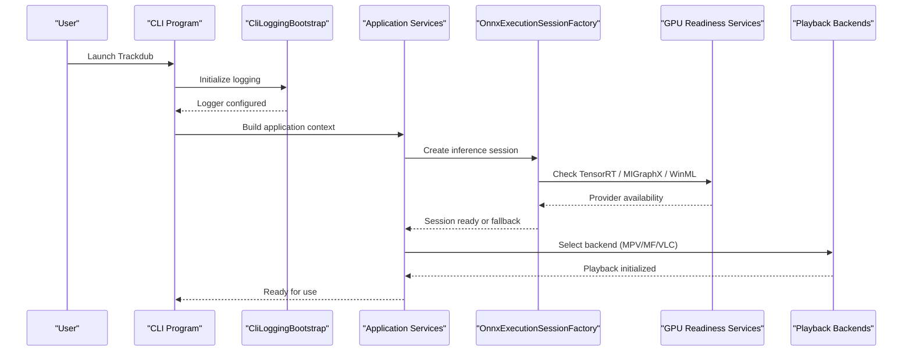
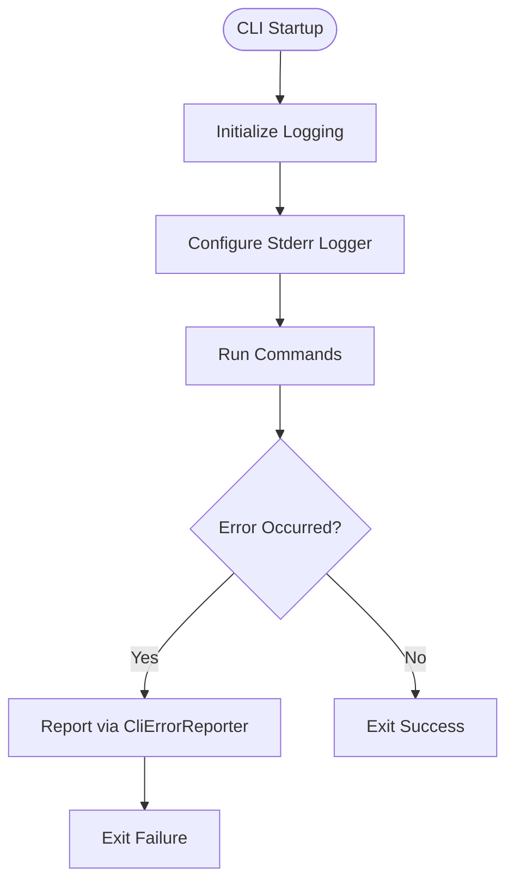
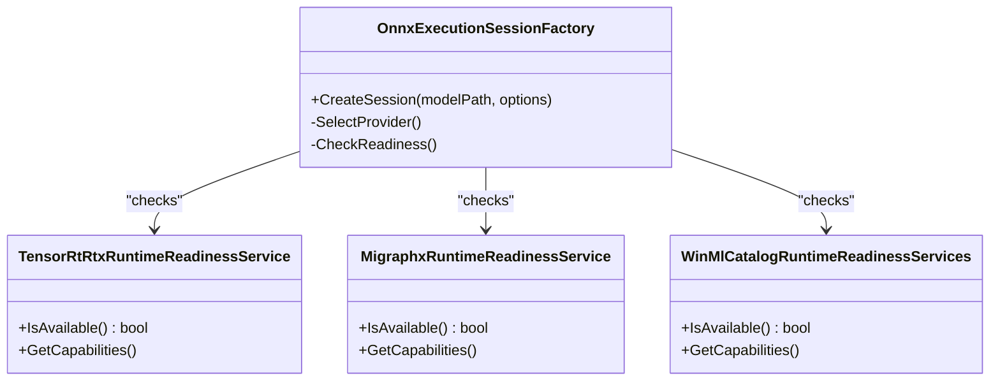
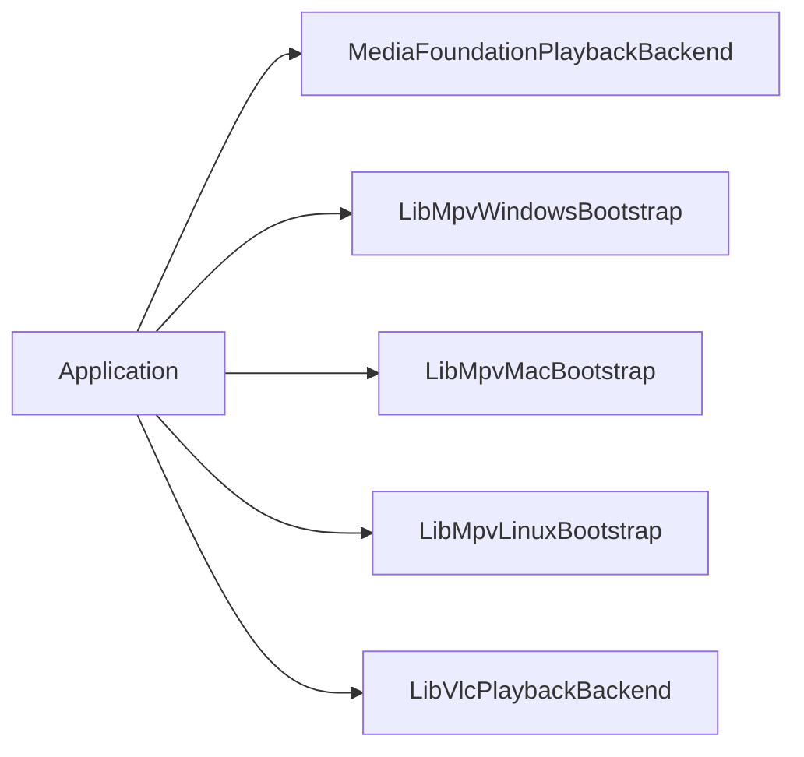
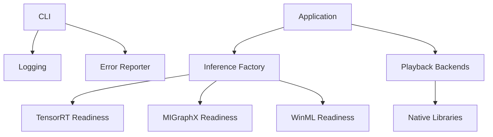

# Troubleshooting & FAQ

<cite>
**Referenced Files in This Document**
- [TROUBLESHOOTING.md](file://docs/development/TROUBLESHOOTING.md)
- [README.md](file://README.md)
- [Trackdub.Cli.csproj](file://src/Trackdub.Cli/Trackdub.Cli.csproj)
- [CliLoggingBootstrap.cs](file://src/Trackdub.Cli/CliLoggingBootstrap.cs)
- [StderrApplicationLogger.cs](file://src/Trackdub.Cli/StderrApplicationLogger.cs)
- [Trackdub.Application.csproj](file://src/Trackdub.Application/Trackdub.Application.csproj)
- [IApplicationLogger.cs](file://src/Trackdub.Contracts/IApplicationLogger.cs)
- [DiagnosticsBundleExporter.cs](file://src/Trackdub.Contracts/DiagnosticsBundleExporter.cs)
- [HardwareProfilerService.cs](file://src/Trackdub.Composition/HardwareProfiler/HardwareProfilerService.cs)
- [TensorRtRtxRuntimeReadinessService.cs](file://src/Trackdub.Infrastructure/Runtime/TrtRtxEp/TensorRtRtxRuntimeReadinessService.cs)
- [MigraphxRuntimeReadinessService.cs](file://src/Trackdub.Contracts/IMigraphxRuntimeReadinessService.cs)
- [WinMlCatalogRuntimeReadinessServices.cs](file://src/Trackdub.Contracts/WinMlCatalogRuntimeReadinessServices.cs)
- [LibMpvWindowsBootstrap.cs](file://src/Trackdub.Media.Playback/LibMpvWindowsBootstrap.cs)
- [LibMpvMacBootstrap.cs](file://src/Trackdub.Media.Playback/LibMpvMacBootstrap.cs)
- [LibMpvLinuxBootstrap.cs](file://src/Trackdub.Media.Playback/LibMpvLinuxBootstrap.cs)
- [MediaFoundationPlaybackBackend.cs](file://src/Trackdub.Media.Playback/MediaFoundationPlaybackBackend.cs)
- [LibVlcPlaybackBackend.cs](file://src/Trackdub.Media.Playback/LibVlcPlaybackBackend.cs)
- [AUR-0009-gpu-memory-budget-planner.md](file://docs/decisions/ADR-0009-gpu-memory-budget-planner.md)
- [windows-ml-phase-3-device-policies.md](file://docs/reference/windows-ml-phase-3-device-policies.md)
- [macos-deployment-notes.md](file://docs/operations/macos-deployment-notes.md)
- [GITHUB_ACTIONS.md](file://docs/operations/GITHUB_ACTIONS.md)
- [Trackdub.Inference.Onnx.csproj](file://src/Trackdub.Inference.Onnx/Trackdub.Inference.Onnx.csproj)
- [OnnxExecutionSessionFactory.cs](file://src/Trackdub.Inference.Onnx/OnnxExecutionSessionFactory.cs)
- [Program.cs (CLI)](file://src/Trackdub.Cli/Program.cs)
- [CliErrorReporter.cs](file://src/Trackdub.Cli/CliErrorReporter.cs)
</cite>

## Table of Contents
1. [Introduction](#introduction)
2. [Project Structure](#project-structure)
3. [Core Components](#core-components)
4. [Architecture Overview](#architecture-overview)
5. [Detailed Component Analysis](#detailed-component-analysis)
6. [Dependency Analysis](#dependency-analysis)
7. [Performance Considerations](#performance-considerations)
8. [Troubleshooting Guide](#troubleshooting-guide)
9. [Conclusion](#conclusion)
10. [Appendices](#appendices)

## Introduction
This document provides comprehensive troubleshooting guidance for the Trackdub desktop application. It covers common installation issues, startup problems, runtime errors, performance tuning, memory optimization, GPU acceleration setup, diagnostics and logging, platform-specific considerations, FAQs, and developer debugging techniques. The goal is to help users and developers quickly identify and resolve issues across Windows, macOS, and Linux environments.

## Project Structure
Trackdub is a multi-project solution with clear separation between application logic, inference engines, media playback, CLI entry points, and infrastructure services. For troubleshooting, focus on:
- CLI bootstrap and logging
- Application services and contracts
- Inference execution factories and runtime readiness checks
- Media playback backends and native bootstraps
- Diagnostics and hardware profiling utilities

**Diagram sources**
- [Program.cs (CLI)](file://src/Trackdub.Cli/Program.cs)
- [CliLoggingBootstrap.cs](file://src/Trackdub.Cli/CliLoggingBootstrap.cs)
- [CliErrorReporter.cs](file://src/Trackdub.Cli/CliErrorReporter.cs)
- [Trackdub.Application.csproj](file://src/Trackdub.Application/Trackdub.Application.csproj)
- [IApplicationLogger.cs](file://src/Trackdub.Contracts/IApplicationLogger.cs)
- [OnnxExecutionSessionFactory.cs](file://src/Trackdub.Inference.Onnx/OnnxExecutionSessionFactory.cs)
- [Trackdub.Inference.Onnx.csproj](file://src/Trackdub.Inference.Onnx/Trackdub.Inference.Onnx.csproj)
- [TensorRtRtxRuntimeReadinessService.cs](file://src/Trackdub.Infrastructure/Runtime/TrtRtxEp/TensorRtRtxRuntimeReadinessService.cs)
- [MigraphxRuntimeReadinessService.cs](file://src/Trackdub.Contracts/IMigraphxRuntimeReadinessService.cs)
- [WinMlCatalogRuntimeReadinessServices.cs](file://src/Trackdub.Contracts/WinMlCatalogRuntimeReadinessServices.cs)
- [LibMpvWindowsBootstrap.cs](file://src/Trackdub.Media.Playback/LibMpvWindowsBootstrap.cs)
- [LibMpvMacBootstrap.cs](file://src/Trackdub.Media.Playback/LibMpvMacBootstrap.cs)
- [LibMpvLinuxBootstrap.cs](file://src/Trackdub.Media.Playback/LibMpvLinuxBootstrap.cs)
- [MediaFoundationPlaybackBackend.cs](file://src/Trackdub.Media.Playback/MediaFoundationPlaybackBackend.cs)
- [LibVlcPlaybackBackend.cs](file://src/Trackdub.Media.Playback/LibVlcPlaybackBackend.cs)

**Section sources**
- [README.md](file://README.md)
- [Trackdub.Application.csproj](file://src/Trackdub.Application/Trackdub.Application.csproj)
- [Trackdub.Inference.Onnx.csproj](file://src/Trackdub.Inference.Onnx/Trackdub.Inference.Onnx.csproj)

## Core Components
Key components relevant to troubleshooting include:
- CLI logging and error reporting
- Application logger contract
- Inference session factory and execution providers
- Runtime readiness services for GPU accelerators
- Media playback backends and native library bootstraps
- Hardware profiler service

These components are central to diagnosing startup failures, GPU acceleration issues, and playback problems.

**Section sources**
- [CliLoggingBootstrap.cs](file://src/Trackdub.Cli/CliLoggingBootstrap.cs)
- [StderrApplicationLogger.cs](file://src/Trackdub.Cli/StderrApplicationLogger.cs)
- [IApplicationLogger.cs](file://src/Trackdub.Contracts/IApplicationLogger.cs)
- [OnnxExecutionSessionFactory.cs](file://src/Trackdub.Inference.Onnx/OnnxExecutionSessionFactory.cs)
- [TensorRtRtxRuntimeReadinessService.cs](file://src/Trackdub.Infrastructure/Runtime/TrtRtxEp/TensorRtRtxRuntimeReadinessService.cs)
- [MigraphxRuntimeReadinessService.cs](file://src/Trackdub.Contracts/IMigraphxRuntimeReadinessService.cs)
- [WinMlCatalogRuntimeReadinessServices.cs](file://src/Trackdub.Contracts/WinMlCatalogRuntimeReadinessServices.cs)
- [LibMpvWindowsBootstrap.cs](file://src/Trackdub.Media.Playback/LibMpvWindowsBootstrap.cs)
- [LibMpvMacBootstrap.cs](file://src/Trackdub.Media.Playback/LibMpvMacBootstrap.cs)
- [LibMpvLinuxBootstrap.cs](file://src/Trackdub.Media.Playback/LibMpvLinuxBootstrap.cs)
- [MediaFoundationPlaybackBackend.cs](file://src/Trackdub.Media.Playback/MediaFoundationPlaybackBackend.cs)
- [LibVlcPlaybackBackend.cs](file://src/Trackdub.Media.Playback/LibVlcPlaybackBackend.cs)
- [HardwareProfilerService.cs](file://src/Trackdub.Composition/HardwareProfiler/HardwareProfilerService.cs)

## Architecture Overview
The application initializes via the CLI, sets up logging, and then constructs application services. Inference sessions are created through an execution session factory that selects appropriate execution providers based on runtime readiness. Playback backends are selected per platform using native bootstraps.

**Diagram sources**
- [Program.cs (CLI)](file://src/Trackdub.Cli/Program.cs)
- [CliLoggingBootstrap.cs](file://src/Trackdub.Cli/CliLoggingBootstrap.cs)
- [OnnxExecutionSessionFactory.cs](file://src/Trackdub.Inference.Onnx/OnnxExecutionSessionFactory.cs)
- [TensorRtRtxRuntimeReadinessService.cs](file://src/Trackdub.Infrastructure/Runtime/TrtRtxEp/TensorRtRtxRuntimeReadinessService.cs)
- [MigraphxRuntimeReadinessService.cs](file://src/Trackdub.Contracts/IMigraphxRuntimeReadinessService.cs)
- [WinMlCatalogRuntimeReadinessServices.cs](file://src/Trackdub.Contracts/WinMlCatalogRuntimeReadinessServices.cs)
- [LibMpvWindowsBootstrap.cs](file://src/Trackdub.Media.Playback/LibMpvWindowsBootstrap.cs)
- [MediaFoundationPlaybackBackend.cs](file://src/Trackdub.Media.Playback/MediaFoundationPlaybackBackend.cs)
- [LibVlcPlaybackBackend.cs](file://src/Trackdub.Media.Playback/LibVlcPlaybackBackend.cs)

## Detailed Component Analysis

### CLI Logging and Error Reporting
- Logging bootstrap configures application logging early in startup.
- Stderr logger writes diagnostic output to standard error for easy capture in terminals and logs.
- Error reporter centralizes error formatting and reporting for CLI commands.

**Diagram sources**
- [CliLoggingBootstrap.cs](file://src/Trackdub.Cli/CliLoggingBootstrap.cs)
- [StderrApplicationLogger.cs](file://src/Trackdub.Cli/StderrApplicationLogger.cs)
- [CliErrorReporter.cs](file://src/Trackdub.Cli/CliErrorReporter.cs)

**Section sources**
- [CliLoggingBootstrap.cs](file://src/Trackdub.Cli/CliLoggingBootstrap.cs)
- [StderrApplicationLogger.cs](file://src/Trackdub.Cli/StderrApplicationLogger.cs)
- [CliErrorReporter.cs](file://src/Trackdub.Cli/CliErrorReporter.cs)

### Inference Execution Factory and Providers
- The execution session factory creates ONNX runtime sessions and selects execution providers based on availability.
- GPU readiness services check TensorRT RTX, MIGraphX, and Windows ML catalog support before enabling acceleration.

**Diagram sources**
- [OnnxExecutionSessionFactory.cs](file://src/Trackdub.Inference.Onnx/OnnxExecutionSessionFactory.cs)
- [TensorRtRtxRuntimeReadinessService.cs](file://src/Trackdub.Infrastructure/Runtime/TrtRtxEp/TensorRtRtxRuntimeReadinessService.cs)
- [MigraphxRuntimeReadinessService.cs](file://src/Trackdub.Contracts/IMigraphxRuntimeReadinessService.cs)
- [WinMlCatalogRuntimeReadinessServices.cs](file://src/Trackdub.Contracts/WinMlCatalogRuntimeReadinessServices.cs)

**Section sources**
- [OnnxExecutionSessionFactory.cs](file://src/Trackdub.Inference.Onnx/OnnxExecutionSessionFactory.cs)
- [TensorRtRtxRuntimeReadinessService.cs](file://src/Trackdub.Infrastructure/Runtime/TrtRtxEp/TensorRtRtxRuntimeReadinessService.cs)
- [MigraphxRuntimeReadinessService.cs](file://src/Trackdub.Contracts/IMigraphxRuntimeReadinessService.cs)
- [WinMlCatalogRuntimeReadinessServices.cs](file://src/Trackdub.Contracts/WinMlCatalogRuntimeReadinessServices.cs)

### Media Playback Backends and Native Bootstraps
- Playback backends vary by platform: Media Foundation on Windows, LibMpv cross-platform with native bootstraps, and LibVlc as alternative.
- Native bootstraps ensure required libraries are located and loaded correctly.

**Diagram sources**
- [MediaFoundationPlaybackBackend.cs](file://src/Trackdub.Media.Playback/MediaFoundationPlaybackBackend.cs)
- [LibMpvWindowsBootstrap.cs](file://src/Trackdub.Media.Playback/LibMpvWindowsBootstrap.cs)
- [LibMpvMacBootstrap.cs](file://src/Trackdub.Media.Playback/LibMpvMacBootstrap.cs)
- [LibMpvLinuxBootstrap.cs](file://src/Trackdub.Media.Playback/LibMpvLinuxBootstrap.cs)
- [LibVlcPlaybackBackend.cs](file://src/Trackdub.Media.Playback/LibVlcPlaybackBackend.cs)

**Section sources**
- [MediaFoundationPlaybackBackend.cs](file://src/Trackdub.Media.Playback/MediaFoundationPlaybackBackend.cs)
- [LibMpvWindowsBootstrap.cs](file://src/Trackdub.Media.Playback/LibMpvWindowsBootstrap.cs)
- [LibMpvMacBootstrap.cs](file://src/Trackdub.Media.Playback/LibMpvMacBootstrap.cs)
- [LibMpvLinuxBootstrap.cs](file://src/Trackdub.Media.Playback/LibMpvLinuxBootstrap.cs)
- [LibVlcPlaybackBackend.cs](file://src/Trackdub.Media.Playback/LibVlcPlaybackBackend.cs)

## Dependency Analysis
Trackdub’s dependencies span CLI, application services, inference engines, and playback backends. Understanding these relationships helps isolate failures:
- CLI depends on logging and error reporting
- Application services depend on inference session factory
- Inference factory depends on GPU readiness services
- Playback backends depend on platform-specific native libraries

**Diagram sources**
- [Program.cs (CLI)](file://src/Trackdub.Cli/Program.cs)
- [CliLoggingBootstrap.cs](file://src/Trackdub.Cli/CliLoggingBootstrap.cs)
- [CliErrorReporter.cs](file://src/Trackdub.Cli/CliErrorReporter.cs)
- [OnnxExecutionSessionFactory.cs](file://src/Trackdub.Inference.Onnx/OnnxExecutionSessionFactory.cs)
- [TensorRtRtxRuntimeReadinessService.cs](file://src/Trackdub.Infrastructure/Runtime/TrtRtxEp/TensorRtRtxRuntimeReadinessService.cs)
- [MigraphxRuntimeReadinessService.cs](file://src/Trackdub.Contracts/IMigraphxRuntimeReadinessService.cs)
- [WinMlCatalogRuntimeReadinessServices.cs](file://src/Trackdub.Contracts/WinMlCatalogRuntimeReadinessServices.cs)
- [MediaFoundationPlaybackBackend.cs](file://src/Trackdub.Media.Playback/MediaFoundationPlaybackBackend.cs)
- [LibMpvWindowsBootstrap.cs](file://src/Trackdub.Media.Playback/LibMpvWindowsBootstrap.cs)

**Section sources**
- [Trackdub.Cli.csproj](file://src/Trackdub.Cli/Trackdub.Cli.csproj)
- [Trackdub.Application.csproj](file://src/Trackdub.Application/Trackdub.Application.csproj)
- [Trackdub.Inference.Onnx.csproj](file://src/Trackdub.Inference.Onnx/Trackdub.Inference.Onnx.csproj)

## Performance Considerations
- GPU memory budget planning affects model loading and inference performance.
- Hardware profiling identifies bottlenecks in CPU, GPU, and I/O operations.
- Playback backend selection impacts UI responsiveness and media decoding efficiency.

Recommendations:
- Use smaller models for faster inference on limited hardware.
- Enable GPU acceleration when available and supported.
- Monitor memory usage during long-running tasks and adjust batch sizes accordingly.

[No sources needed since this section provides general guidance]

## Troubleshooting Guide

### Installation Issues
- Verify system requirements and dependencies for your platform.
- Ensure required native libraries are installed and accessible.
- Check file permissions and disk space availability.

Common resolutions:
- Reinstall missing dependencies or update drivers.
- Run installer with elevated privileges if permission errors occur.
- Clear temporary files and retry installation.

**Section sources**
- [TROUBLESHOOTING.md](file://docs/development/TROUBLESHOOTING.md)

### Startup Problems
- If the application fails to start, examine CLI logs for initialization errors.
- Check GPU readiness services to confirm acceleration availability.
- Validate playback backend selection and native library paths.

Steps:
- Capture stderr output during startup.
- Review application logs for provider selection failures.
- Test playback with alternative backends if needed.

**Section sources**
- [CliLoggingBootstrap.cs](file://src/Trackdub.Cli/CliLoggingBootstrap.cs)
- [StderrApplicationLogger.cs](file://src/Trackdub.Cli/StderrApplicationLogger.cs)
- [TensorRtRtxRuntimeReadinessService.cs](file://src/Trackdub.Infrastructure/Runtime/TrtRtxEp/TensorRtRtxRuntimeReadinessService.cs)

### Runtime Errors
- Inference failures often relate to model compatibility or insufficient resources.
- Playback errors may indicate codec or container format issues.
- Memory exhaustion can cause crashes or degraded performance.

Actions:
- Validate model versions and formats.
- Reduce concurrent processing tasks.
- Switch to CPU-only mode if GPU errors persist.

**Section sources**
- [OnnxExecutionSessionFactory.cs](file://src/Trackdub.Inference.Onnx/OnnxExecutionSessionFactory.cs)
- [MediaFoundationPlaybackBackend.cs](file://src/Trackdub.Media.Playback/MediaFoundationPlaybackBackend.cs)

### Performance Troubleshooting
- Use hardware profiler to identify bottlenecks.
- Monitor GPU utilization and memory consumption.
- Adjust pipeline stages to reduce load on critical resources.

Tools:
- Built-in profiling endpoints and metrics collection.
- System resource monitors for CPU, GPU, and memory.

**Section sources**
- [HardwareProfilerService.cs](file://src/Trackdub.Composition/HardwareProfiler/HardwareProfilerService.cs)

### Memory Usage Optimization
- Implement memory budget planning for large models.
- Release unused assets and intermediate results promptly.
- Use streaming where possible to avoid loading entire files into memory.

Guidelines:
- Profile memory allocation patterns during typical workflows.
- Tune batch sizes and concurrency levels based on available RAM.

**Section sources**
- [AUR-0009-gpu-memory-budget-planner.md](file://docs/decisions/ADR-0009-gpu-memory-budget-planner.md)

### GPU Acceleration Setup
- Confirm GPU drivers are up-to-date and compatible.
- Verify execution provider availability through readiness services.
- Fallback to CPU if GPU initialization fails.

Platform notes:
- Windows: Check Windows ML catalog support.
- macOS: Ensure Metal acceleration is enabled.
- Linux: Install required CUDA or ROCm libraries.

**Section sources**
- [TensorRtRtxRuntimeReadinessService.cs](file://src/Trackdub.Infrastructure/Runtime/TrtRtxEp/TensorRtRtxRuntimeReadinessService.cs)
- [WinMlCatalogRuntimeReadinessServices.cs](file://src/Trackdub.Contracts/WinMlCatalogRuntimeReadinessServices.cs)
- [windows-ml-phase-3-device-policies.md](file://docs/reference/windows-ml-phase-3-device-policies.md)

### Diagnostic Tools and Logs
- CLI logging captures detailed startup and runtime information.
- Standard error output can be redirected to files for analysis.
- Diagnostics bundle exporter collects relevant artifacts for support.

Locations:
- Application logs directory (platform-dependent).
- Temporary directories for crash dumps and traces.

**Section sources**
- [CliLoggingBootstrap.cs](file://src/Trackdub.Cli/CliLoggingBootstrap.cs)
- [StderrApplicationLogger.cs](file://src/Trackdub.Cli/StderrApplicationLogger.cs)
- [DiagnosticsBundleExporter.cs](file://src/Trackdub.Contracts/DiagnosticsBundleExporter.cs)

### Platform-Specific Issues

#### Windows
- Media Foundation playback requires specific codecs and filters.
- Windows ML catalog policies may restrict device usage.
- Driver updates often resolve GPU-related issues.

Resolutions:
- Install recommended codec packs.
- Adjust device policies in Windows settings.
- Update graphics drivers to latest stable version.

**Section sources**
- [MediaFoundationPlaybackBackend.cs](file://src/Trackdub.Media.Playback/MediaFoundationPlaybackBackend.cs)
- [windows-ml-phase-3-device-policies.md](file://docs/reference/windows-ml-phase-3-device-policies.md)

#### macOS
- LibMpv bootstrap ensures proper library loading.
- Metal acceleration may require specific OS versions.
- Sandboxing restrictions can affect file access.

Workarounds:
- Grant necessary permissions in System Preferences.
- Use Homebrew to manage dependencies.
- Disable sandboxing if permitted by policy.

**Section sources**
- [LibMpvMacBootstrap.cs](file://src/Trackdub.Media.Playback/LibMpvMacBootstrap.cs)
- [macos-deployment-notes.md](file://docs/operations/macos-deployment-notes.md)

#### Linux
- LibMpv bootstrap handles dynamic library discovery.
- CUDA/ROCm installations must match driver versions.
- Package managers may provide prebuilt binaries.

Troubleshooting:
- Verify library paths in LD_LIBRARY_PATH.
- Check dmesg for kernel-level errors.
- Use strace to trace system calls during failures.

**Section sources**
- [LibMpvLinuxBootstrap.cs](file://src/Trackdub.Media.Playback/LibMpvLinuxBootstrap.cs)

### Frequently Asked Questions

#### UI Responsiveness
- Causes: Heavy background processing, insufficient CPU/GPU resources.
- Solutions: Reduce concurrent tasks, enable hardware acceleration, close other applications.

#### Media Compatibility
- Issues: Unsupported codecs or container formats.
- Fixes: Convert media to supported formats, install additional codecs.

#### Model Loading Problems
- Reasons: Incompatible model versions, insufficient memory, corrupted downloads.
- Actions: Re-download models, verify checksums, free up memory.

[No sources needed since this section provides general guidance]

### Step-by-Step Resolution Guides

#### Common Installation Failures
1. Check system requirements and dependencies.
2. Verify installation path permissions.
3. Retry installation with administrator privileges.
4. Review log files for specific error messages.

#### Startup Crashes
1. Capture stderr output during launch.
2. Inspect application logs for initialization errors.
3. Test with minimal configuration to isolate issues.
4. Update drivers and dependencies as needed.

#### Playback Issues
1. Try alternative playback backends.
2. Verify codec availability and licenses.
3. Check file integrity and format compatibility.
4. Reset playback settings to defaults.

[No sources needed since this section provides general guidance]

### Workarounds for Limitations
- Use CPU-only mode when GPU acceleration is unavailable.
- Process media in smaller chunks to reduce memory pressure.
- Disable non-essential features to improve performance.

[No sources needed since this section provides general guidance]

### When to Seek Additional Support
- Collect diagnostic bundles and logs.
- Reproduce the issue in a clean environment.
- Document steps to reproduce and expected behavior.
- Contact support with detailed information and attachments.

**Section sources**
- [DiagnosticsBundleExporter.cs](file://src/Trackdub.Contracts/DiagnosticsBundleExporter.cs)

### Debugging Techniques for Developers and Power Users
- Enable verbose logging and capture full stack traces.
- Use profilers to analyze performance bottlenecks.
- Isolate components by disabling optional features.
- Leverage unit tests and integration tests for validation.

Best practices:
- Log contextual information around failures.
- Use structured logging for easier analysis.
- Implement health checks for critical services.

**Section sources**
- [CliLoggingBootstrap.cs](file://src/Trackdub.Cli/CliLoggingBootstrap.cs)
- [StderrApplicationLogger.cs](file://src/Trackdub.Cli/StderrApplicationLogger.cs)

## Conclusion
This troubleshooting guide provides actionable solutions for common Trackdub issues across installation, startup, runtime, and performance domains. By leveraging built-in diagnostics, understanding component dependencies, and following platform-specific recommendations, users and developers can effectively diagnose and resolve problems. For persistent issues, collect comprehensive logs and seek support with detailed reproduction steps.

[No sources needed since this section summarizes without analyzing specific files]

## Appendices

### Reference Links
- Development troubleshooting documentation
- Operations guides for deployment and maintenance
- GitHub Actions configuration for CI/CD pipelines

**Section sources**
- [TROUBLESHOOTING.md](file://docs/development/TROUBLESHOOTING.md)
- [GITHUB_ACTIONS.md](file://docs/operations/GITHUB_ACTIONS.md)