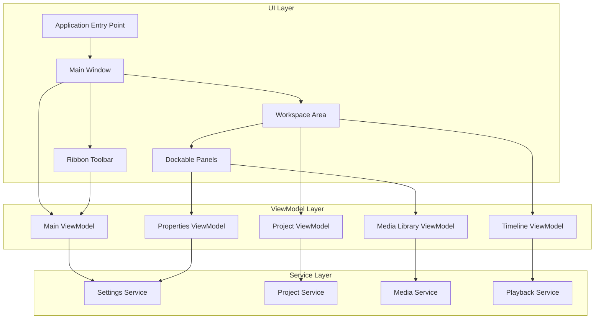
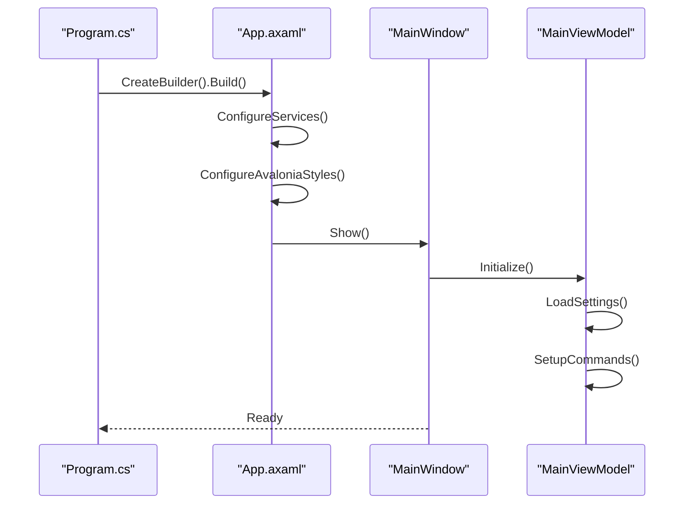
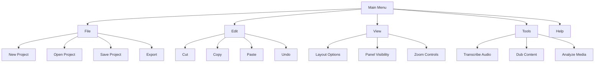
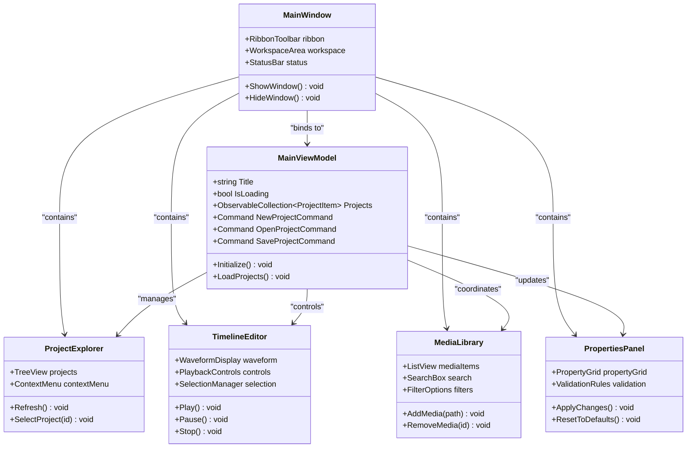
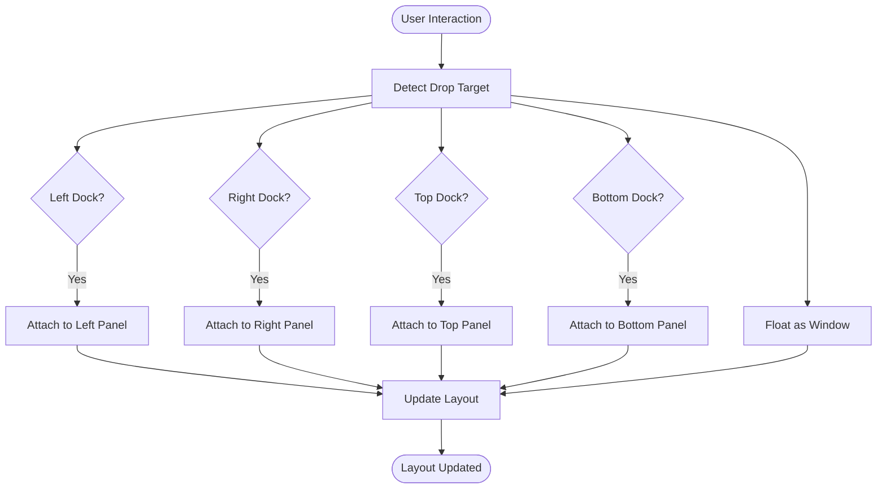
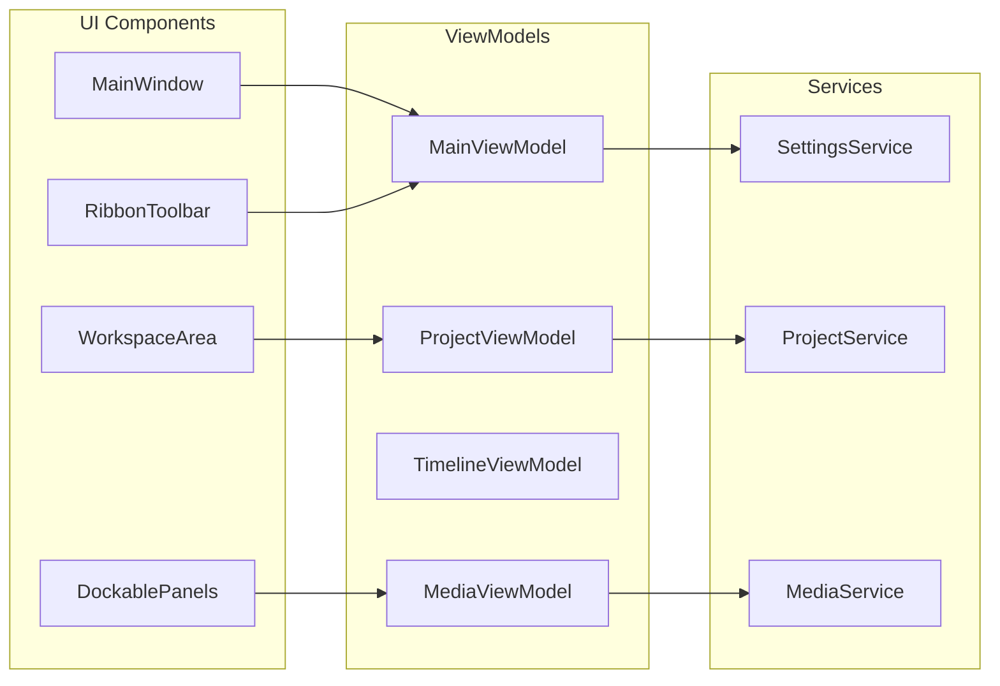

# User Interface Overview

<cite>
**Referenced Files in This Document**
- [Trackdub.DubBench/App.axaml](file://src/DubBench/App.axaml)
- [Trackdub.DubBench/App.axaml.cs](file://src/DubBench/App.axaml.cs)
- [Trackdub.DubBench/Program.cs](file://src/DubBench/Program.cs)
- [Trackdub.DubBench/Views/MainView.axaml](file://src/DubBench/Views/MainView.axaml)
- [Trackdub.DubBench/ViewModels/MainViewModel.cs](file://src/DubBench/ViewModels/MainViewModel.cs)
- [Trackdub.Application/Services/IStudioSettingsService.cs](file://src/Trackdub.Application/Services/IStudioSettingsService.cs)
- [Trackdub.Contracts/IStudioSettingsService.cs](file://src/Trackdub.Contracts/IStudioSettingsService.cs)
</cite>

## Table of Contents
1. [Introduction](#introduction)
2. [Project Structure](#project-structure)
3. [Core Components](#core-components)
4. [Architecture Overview](#architecture-overview)
5. [Detailed Component Analysis](#detailed-component-analysis)
6. [Dependency Analysis](#dependency-analysis)
7. [Performance Considerations](#performance-considerations)
8. [Troubleshooting Guide](#troubleshooting-guide)
9. [Conclusion](#conclusion)

## Introduction

Trackdub's desktop application is built using the Avalonia UI framework, providing a cross-platform professional audio dubbing and transcription interface. The application follows modern UI design principles with a ribbon-style toolbar organization, context-sensitive help system, and responsive workspace areas designed for media production workflows.

The user interface is structured around several key areas:
- **Ribbon-style Toolbar**: Organized tool categories with contextual commands
- **Menu Structure**: Hierarchical navigation with keyboard shortcuts
- **Workspace Areas**: Project explorer, timeline editor, media library, and properties panel
- **Docking System**: Flexible panel arrangement and window management
- **Responsive Design**: Adapts to different screen sizes and platform-specific requirements

## Project Structure

The Trackdub UI follows a clean separation of concerns with Avalonia's MVVM pattern:



**Diagram sources**
- [Trackdub.DubBench/App.axaml](file://src/DubBench/App.axaml)
- [Trackdub.DubBench/ViewModels/MainViewModel.cs](file://src/DubBench/ViewModels/MainViewModel.cs)

**Section sources**
- [Trackdub.DubBench/App.axaml](file://src/DubBench/App.axaml)
- [Trackdub.DubBench/App.axaml.cs](file://src/DubBench/App.axaml.cs)

## Core Components

### Application Entry Point and Initialization

The application starts with Avalonia's standard entry point, configuring the theme, services, and main window:



**Diagram sources**
- [Trackdub.DubBench/Program.cs](file://src/DubBench/Program.cs)
- [Trackdub.DubBench/App.axaml.cs](file://src/DubBench/App.axaml.cs)

### Main Window Layout

The main window implements a flexible layout system with:
- **Top Ribbon**: Contextual toolbar with categorized commands
- **Left Panel**: Project explorer and media library
- **Center Area**: Timeline editor and preview windows
- **Right Panel**: Properties and settings
- **Bottom Status Bar**: Playback controls and status information

### Ribbon Toolbar Organization

The ribbon-style toolbar is organized into logical categories:

| Category | Commands | Purpose |
|----------|----------|---------|
| File | New, Open, Save, Export | Project management operations |
| Edit | Cut, Copy, Paste, Undo, Redo | Content editing functions |
| View | Zoom, Layout, Panels | Interface customization |
| Tools | Transcribe, Dub, Analyze | Core processing features |
| Help | Documentation, Support | User assistance |

### Menu Structure

The menu system provides hierarchical access to all application features:



**Diagram sources**
- [Trackdub.DubBench/Views/MainView.axaml](file://src/DubBench/Views/MainView.axaml)

## Architecture Overview

The UI architecture follows Avalonia's MVVM pattern with clear separation between presentation logic and business logic:



**Diagram sources**
- [Trackdub.DubBench/Views/MainView.axaml](file://src/DubBench/Views/MainView.axaml)
- [Trackdub.DubBench/ViewModels/MainViewModel.cs](file://src/DubBench/ViewModels/MainViewModel.cs)

## Detailed Component Analysis

### Workspace Areas

#### Project Explorer
The project explorer provides hierarchical navigation of project files and assets:

- **Tree Structure**: Organizes projects, folders, and media files
- **Context Menu**: Right-click operations for file management
- **Drag & Drop**: Reorder items and move between folders
- **Search**: Filter projects by name or type

#### Timeline Editor
The central timeline editor supports multi-track audio and video editing:

- **Waveform Display**: Visual representation of audio content
- **Multi-Track Support**: Stack multiple audio/video tracks
- **Selection Tools**: Precise selection and trimming capabilities
- **Playback Controls**: Play, pause, stop, and scrub functionality

#### Media Library
The media library manages imported media assets:

- **Asset Grid**: Thumbnail view of media files
- **Metadata Display**: File information and properties
- **Import/Export**: Drag-and-drop media management
- **Search & Filter**: Find specific media quickly

#### Properties Panel
Context-sensitive properties panel for selected items:

- **Dynamic Properties**: Shows relevant properties based on selection
- **Validation**: Real-time input validation
- **Templates**: Quick apply common configurations
- **History**: Property change history and undo

### Navigation Patterns

The application implements several navigation patterns:

```mermaid
stateDiagram-v2
[*] --> Idle
Idle --> Loading : "Open Project"
Loading --> Ready : "Project Loaded"
Ready --> Editing : "Start Editing"
Editing --> Preview : "Preview Changes"
Preview --> Editing : "Apply Changes"
Editing --> Exporting : "Export Project"
Exporting --> Ready : "Export Complete"
Ready --> [*] : "Close Application"
state Editing {
[*] --> Selecting
Selecting --> Editing : "Edit Selected"
Editing --> Selecting : "Change Selection"
}
```

### Context-Sensitive Help System

The help system provides contextual assistance:

- **Tooltip System**: Hover hints for controls and commands
- **Inline Help**: Contextual help panels within the interface
- **Keyboard Shortcuts**: Comprehensive shortcut reference
- **Tutorial Mode**: Guided walkthrough for new users

### Responsive Design Behavior

The UI adapts to different screen sizes and orientations:

| Screen Size | Layout Adaptation | Features |
|-------------|-------------------|----------|
| Large (>1920px) | Full ribbon, all panels visible | Maximum workspace area |
| Medium (1280-1920px) | Compact ribbon, collapsible panels | Balanced workspace |
| Small (<1280px) | Minimal ribbon, single panel focus | Essential features only |
| Mobile (<768px) | Touch-optimized interface | Simplified workflow |

### Platform-Specific UI Adaptations

The application adapts to different operating systems:

- **Windows**: Native window chrome, system integration
- **macOS**: Native menu bar, dock integration
- **Linux**: Desktop environment integration, theme support

### Accessibility Features

Comprehensive accessibility support includes:

- **Screen Reader Support**: Full NVDA and VoiceOver compatibility
- **Keyboard Navigation**: Complete keyboard-only operation
- **High Contrast Themes**: WCAG 2.1 AA compliant color schemes
- **Focus Management**: Logical tab order and focus indicators
- **Text Scaling**: Dynamic font size adjustment

### Keyboard Shortcuts

Common keyboard shortcuts enhance productivity:

| Action | Shortcut | Description |
|--------|----------|-------------|
| New Project | Ctrl+N | Create new project |
| Open Project | Ctrl+O | Open existing project |
| Save Project | Ctrl+S | Save current project |
| Play/Pause | Space | Toggle playback |
| Zoom In | Ctrl++ | Increase zoom level |
| Zoom Out | Ctrl+- | Decrease zoom level |
| Undo | Ctrl+Z | Undo last action |
| Redo | Ctrl+Y | Redo last action |

### Customization Options

Users can customize the interface through:

- **Theme Selection**: Light, dark, and high contrast themes
- **Layout Presets**: Predefined workspace arrangements
- **Custom Toolbars**: Personalized command organization
- **Color Schemes**: Accent color customization
- **Font Preferences**: Typeface and size adjustments

### Window Management

Advanced window management features include:

- **Multi-Window Support**: Multiple project windows
- **Floating Panels**: Detachable and reattachable panels
- **Split Views**: Side-by-side comparison views
- **Fullscreen Mode**: Distraction-free editing mode

### Docking Panels

Flexible docking system for workspace customization:



### Multi-Monitor Support

Enhanced multi-monitor capabilities:

- **Independent Windows**: Each monitor can show different content
- **Extended Workspace**: Spread workspace across multiple displays
- **Primary Monitor Focus**: Main editing on primary display
- **Secondary Monitor Utilities**: Reference materials on secondary displays

## Dependency Analysis

The UI components have well-defined dependencies:



**Diagram sources**
- [Trackdub.DubBench/ViewModels/MainViewModel.cs](file://src/DubBench/ViewModels/MainViewModel.cs)
- [Trackdub.Application/Services/IStudioSettingsService.cs](file://src/Trackdub.Application/Services/IStudioSettingsService.cs)

## Performance Considerations

The UI is optimized for performance through:

- **Lazy Loading**: Deferred loading of large media files
- **Virtual Scrolling**: Efficient handling of large lists
- **Background Processing**: Non-blocking operations
- **Memory Management**: Proper disposal of resources
- **Rendering Optimization**: Hardware acceleration where available

## Troubleshooting Guide

Common UI issues and solutions:

### Layout Problems
- **Issue**: Panels not docking correctly
- **Solution**: Reset layout through View menu → Reset Layout
- **Prevention**: Avoid dragging panels during initialization

### Performance Issues
- **Issue**: Slow response times with large projects
- **Solution**: Enable hardware acceleration in settings
- **Optimization**: Close unused panels and reduce preview quality

### Accessibility Issues
- **Issue**: Screen reader not reading content
- **Solution**: Ensure proper ARIA labels are set
- **Verification**: Test with native screen readers

### Cross-Platform Issues
- **Issue**: Inconsistent appearance across platforms
- **Solution**: Use platform-specific styling overrides
- **Testing**: Test on target platforms regularly

## Conclusion

Trackdub's Avalonia-based user interface provides a professional, accessible, and customizable experience for audio dubbing and transcription workflows. The modular architecture ensures maintainability while the responsive design guarantees usability across different devices and platforms. The comprehensive feature set, from ribbon-style toolbars to advanced docking systems, supports both novice and expert users in their media production tasks.

The implementation follows modern UI development practices with clear separation of concerns, extensive accessibility support, and platform-specific optimizations. Future enhancements can build upon this solid foundation to add even more sophisticated features while maintaining the intuitive user experience that defines Trackdub.