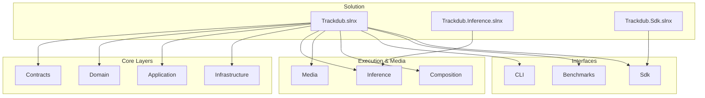
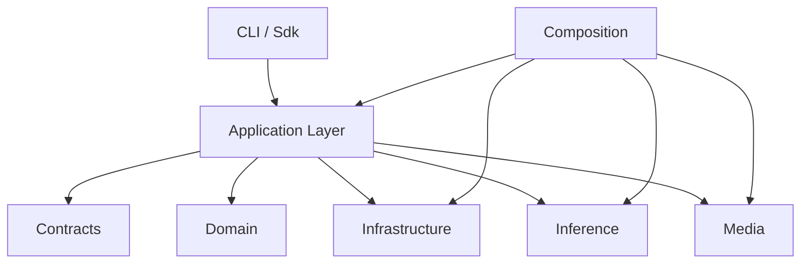
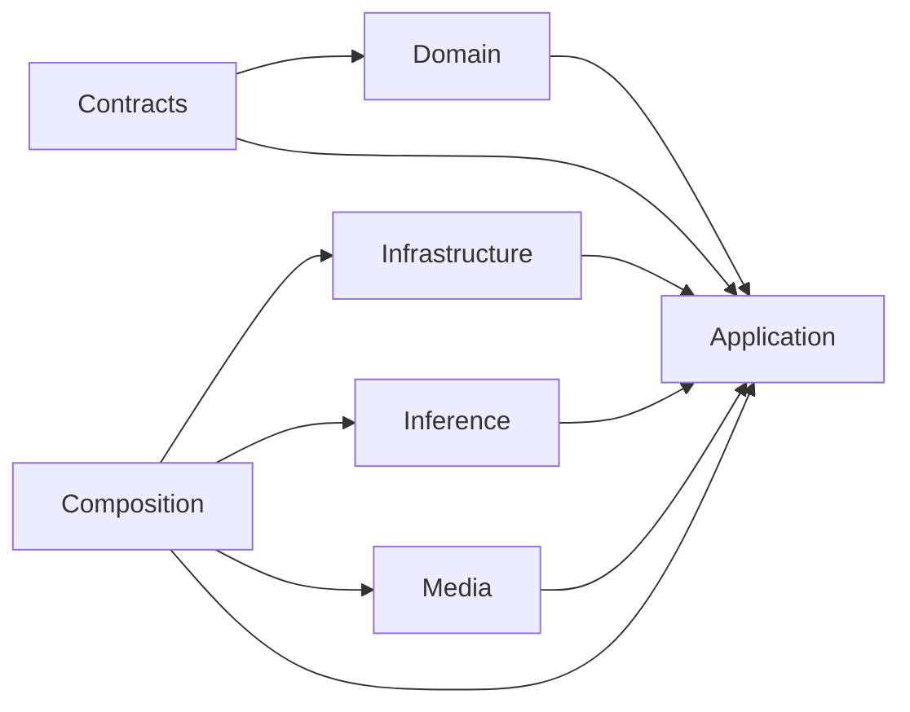

# Development & Contributing

<cite>
**Referenced Files in This Document**
- [CONTRIBUTING.md](file://CONTRIBUTING.md)
- [REVIEW.md](file://REVIEW.md)
- [README.md](file://README.md)
- [global.json](file://global.json)
- [Directory.Build.props](file://Directory.Build.props)
- [Directory.Build.targets](file://Directory.Build.targets)
- [Directory.Packages.props](file://Directory.Packages.props)
- [NuGet.config](file://NuGet.config)
- [Trackdub.slnx](file://Trackdub.slnx)
- [Trackdub.Inference.slnx](file://Trackdub.Inference.slnx)
- [Trackdub.Sdk.slnx](file://Trackdub.Sdk.slnx)
- [mise.toml](file://mise.toml)
- [.github/workflows](file://.github/workflows)
- [.github/pull_request_template.md](file://.github/pull_request_template.md)
- [docs/development/development.md](file://docs/development/development.md)
- [docs/development/TROUBLESHOOTING.md](file://docs/development/TROUBLESHOOTING.md)
- [scripts/ci/check-repository-boundary.py](file://scripts/ci/check-repository-boundary.py)
- [scripts/ci/run-avslnf-tests-sequential.sh](file://scripts/ci/run-avslnf-tests-sequential.sh)
- [src/Trackdub.Benchmarks/Program.cs](file://src/Trackdub.Benchmarks/Program.cs)
- [src/Trackdub.Benchmarks/BenchmarkOptions.cs](file://src/Trackdub.Benchmarks/BenchmarkOptions.cs)
- [src/Trackdub.Benchmarks/DubbingBenchmarkRunner.cs](file://src/Trackdub.Benchmarks/DubbingBenchmarkRunner.cs)
- [tests/Trackdub.Application.Tests/AsrStageHandlerTests.cs](file://tests/Trackdub.Application.Tests/AsrStageHandlerTests.cs)
- [tests/Trackdub.Infrastructure.Tests](file://tests/Trackdub.Infrastructure.Tests)
- [src/Trackdub.Cli/Program.cs](file://src/Trackdub.Cli/Program.cs)
- [src/Trackdub.Composition/CompositionRoot.cs](file://src/Trackdub.Composition/CompositionRoot.cs)
- [src/Trackdub.Application/GlobalUsings.cs](file://src/Trackdub.Application/GlobalUsings.cs)
- [src/Trackdub.Contracts/README.md](file://src/Trackdub.Contracts/README.md)
- [src/Trackdub.Domain/README.md](file://src/Trackdub.Domain/README.md)
- [src/Trackdub.Infrastructure/README.md](file://src/Trackdub.Infrastructure/README.md)
- [src/Trackdub.Media/README.md](file://src/Trackdub.Media/README.md)
- [src/Trackdub.Inference.Onnx/README.md](file://src/Trackdub.Inference.Onnx/README.md)
- [src/Trackdub.Inference/README.md](file://src/Trackdub.Inference/README.md)
- [src/Trackdub.Sdk/TrackdubBuilder.cs](file://src/Trackdub.Sdk/TrackdubBuilder.cs)
- [src/Trackdub.Sdk/TrackdubSession.cs](file://src/Trackdub.Sdk/TrackdubSession.cs)
</cite>

## Table of Contents
1. [Introduction](#introduction)
2. [Project Structure](#project-structure)
3. [Core Components](#core-components)
4. [Architecture Overview](#architecture-overview)
5. [Detailed Component Analysis](#detailed-component-analysis)
6. [Dependency Analysis](#dependency-analysis)
7. [Performance Considerations](#performance-considerations)
8. [Troubleshooting Guide](#troubleshooting-guide)
9. [Conclusion](#conclusion)
10. [Appendices](#appendices)

## Introduction
This document is a comprehensive development and contributing guide for the Trackdub project. It explains how to set up your development environment, configure the build system, run tests and benchmarks, debug issues, and follow contribution workflows. It also covers architectural patterns, coding standards, CI/CD pipelines, release processes, and best practices for extending functionality such as adding new models or custom processors.

## Project Structure
Trackdub is a multi-project .NET solution organized into clear layers:
- Contracts: Stable interfaces and shared data contracts
- Domain: Core domain models and business rules
- Application: Use cases, orchestration, and pipeline stages
- Infrastructure: Cross-cutting concerns (persistence, logging, settings, runtime bootstraps)
- Inference: Model execution abstractions and providers
- Media: Audio/video processing, muxing, playback
- Composition: Dependency injection composition root and runtime wiring
- CLI: Command-line interface and TUI
- Benchmarks: Performance benchmark harnesses
- Sdk: Public SDK surface for programmatic usage
- Tools: Developer utilities and helpers

**Diagram sources**
- [Trackdub.slnx](file://Trackdub.slnx)
- [Trackdub.Inference.slnx](file://Trackdub.Inference.slnx)
- [Trackdub.Sdk.slnx](file://Trackdub.Sdk.slnx)

**Section sources**
- [README.md](file://README.md)
- [Trackdub.slnx](file://Trackdub.slnx)
- [Trackdub.Inference.slnx](file://Trackdub.Inference.slnx)
- [Trackdub.Sdk.slnx](file://Trackdub.Sdk.slnx)

## Core Components
- Composition Root: Central DI configuration and runtime assembly wiring
- CLI Entry Point: Command parsing, progress reporting, and error handling
- Application Layer: Pipeline orchestration, stage handlers, and services
- Contracts: Interfaces defining stable boundaries between layers
- Domain: Entities and value objects representing core concepts
- Infrastructure: Persistence, logging, settings, and runtime bootstraps
- Inference: ONNX model execution, provider selection, and session management
- Media: Audio/video extraction, mixing, normalization, and playback
- Benchmarks: Benchmark runners and report writers
- Sdk: Programmatic API for building and running dubbing sessions

Key files:
- Composition root and context: [CompositionRoot.cs](file://src/Trackdub.Composition/CompositionRoot.cs)
- CLI entry point: [Program.cs](file://src/Trackdub.Cli/Program.cs)
- Application global usings: [GlobalUsings.cs](file://src/Trackdub.Application/GlobalUsings.cs)
- Contracts README: [README.md](file://src/Trackdub.Contracts/README.md)
- Domain README: [README.md](file://src/Trackdub.Domain/README.md)
- Infrastructure README: [README.md](file://src/Trackdub.Infrastructure/README.md)
- Media README: [README.md](file://src/Trackdub.Media/README.md)
- Inference READMEs: [README.md](file://src/Trackdub.Inference/README.md), [README.md](file://src/Trackdub.Inference.Onnx/README.md)

**Section sources**
- [src/Trackdub.Composition/CompositionRoot.cs](file://src/Trackdub.Composition/CompositionRoot.cs)
- [src/Trackdub.Cli/Program.cs](file://src/Trackdub.Cli/Program.cs)
- [src/Trackdub.Application/GlobalUsings.cs](file://src/Trackdub.Application/GlobalUsings.cs)
- [src/Trackdub.Contracts/README.md](file://src/Trackdub.Contracts/README.md)
- [src/Trackdub.Domain/README.md](file://src/Trackdub.Domain/README.md)
- [src/Trackdub.Infrastructure/README.md](file://src/Trackdub.Infrastructure/README.md)
- [src/Trackdub.Media/README.md](file://src/Trackdub.Media/README.md)
- [src/Trackdub.Inference/README.md](file://src/Trackdub.Inference/README.md)
- [src/Trackdub.Inference.Onnx/README.md](file://src/Trackdub.Inference.Onnx/README.md)

## Architecture Overview
Trackdub follows a layered architecture with clear separation of concerns:
- Contracts define stable APIs consumed by higher layers
- Domain encapsulates business logic and entities
- Application orchestrates use cases and pipeline stages
- Infrastructure provides cross-cutting capabilities
- Inference abstracts model execution across providers
- Media handles audio/video operations
- Composition wires dependencies at runtime
- CLI and Sdk provide user-facing entry points

**Diagram sources**
- [src/Trackdub.Composition/CompositionRoot.cs](file://src/Trackdub.Composition/CompositionRoot.cs)
- [src/Trackdub.Application/GlobalUsings.cs](file://src/Trackdub.Application/GlobalUsings.cs)
- [src/Trackdub.Contracts/README.md](file://src/Trackdub.Contracts/README.md)
- [src/Trackdub.Domain/README.md](file://src/Trackdub.Domain/README.md)
- [src/Trackdub.Infrastructure/README.md](file://src/Trackdub.Infrastructure/README.md)
- [src/Trackdub.Inference/README.md](file://src/Trackdub.Inference/README.md)
- [src/Trackdub.Media/README.md](file://src/Trackdub.Media/README.md)

## Detailed Component Analysis

### Build System and Environment Setup
- .NET SDK version is pinned via global.json
- Shared MSBuild properties and targets are centralized in Directory.Build.props and Directory.Build.targets
- Package versions are centrally managed in Directory.Packages.props
- NuGet sources configured in NuGet.config
- Solution files organize projects into logical groups

Recommended setup steps:
- Install the .NET SDK specified in global.json
- Restore packages using the provided solution files
- Ensure mise toolchain is available if used by scripts

Relevant files:
- [global.json](file://global.json)
- [Directory.Build.props](file://Directory.Build.props)
- [Directory.Build.targets](file://Directory.Build.targets)
- [Directory.Packages.props](file://Directory.Packages.props)
- [NuGet.config](file://NuGet.config)
- [Trackdub.slnx](file://Trackdub.slnx)
- [Trackdub.Inference.slnx](file://Trackdub.Inference.slnx)
- [Trackdub.Sdk.slnx](file://Trackdub.Sdk.slnx)
- [mise.toml](file://mise.toml)

**Section sources**
- [global.json](file://global.json)
- [Directory.Build.props](file://Directory.Build.props)
- [Directory.Build.targets](file://Directory.Build.targets)
- [Directory.Packages.props](file://Directory.Packages.props)
- [NuGet.config](file://NuGet.config)
- [Trackdub.slnx](file://Trackdub.slnx)
- [Trackdub.Inference.slnx](file://Trackdub.Inference.slnx)
- [Trackdub.Sdk.slnx](file://Trackdub.Sdk.slnx)
- [mise.toml](file://mise.toml)

### Testing Strategy
- Unit tests live under tests/ per layer (e.g., Application, Infrastructure, Inference, Media, Sdk)
- Integration tests validate end-to-end flows where appropriate
- Benchmarks provide performance regression checks and profiling inputs

Examples:
- Application unit tests: [AsrStageHandlerTests.cs](file://tests/Trackdub.Application.Tests/AsrStageHandlerTests.cs)
- Infrastructure tests directory: [tests/Trackdub.Infrastructure.Tests](file://tests/Trackdub.Infrastructure.Tests)
- Benchmark runner entry: [Program.cs](file://src/Trackdub.Benchmarks/Program.cs)
- Benchmark options: [BenchmarkOptions.cs](file://src/Trackdub.Benchmarks/BenchmarkOptions.cs)
- Dubbing benchmark runner: [DubbingBenchmarkRunner.cs](file://src/Trackdub.Benchmarks/DubbingBenchmarkRunner.cs)

Best practices:
- Keep tests deterministic and isolated
- Use test doubles for external dependencies
- Validate pipeline stages independently before integration tests
- Capture metrics and reports from benchmarks for trend analysis

**Section sources**
- [tests/Trackdub.Application.Tests/AsrStageHandlerTests.cs](file://tests/Trackdub.Application.Tests/AsrStageHandlerTests.cs)
- [tests/Trackdub.Infrastructure.Tests](file://tests/Trackdub.Infrastructure.Tests)
- [src/Trackdub.Benchmarks/Program.cs](file://src/Trackdub.Benchmarks/Program.cs)
- [src/Trackdub.Benchmarks/BenchmarkOptions.cs](file://src/Trackdub.Benchmarks/BenchmarkOptions.cs)
- [src/Trackdub.Benchmarks/DubbingBenchmarkRunner.cs](file://src/Trackdub.Benchmarks/DubbingBenchmarkRunner.cs)

### Debugging Techniques
- Use CLI logging and verbosity flags to capture detailed logs
- Inspect artifacts and intermediate outputs produced by pipeline stages
- Leverage diagnostic tools and exporters defined in infrastructure
- Profile CPU/memory hotspots using standard .NET profilers

Useful references:
- CLI entry point for logging and commands: [Program.cs](file://src/Trackdub.Cli/Program.cs)
- Troubleshooting guide: [TROUBLESHOOTING.md](file://docs/development/TROUBLESHOOTING.md)
- Development notes: [development.md](file://docs/development/development.md)

**Section sources**
- [src/Trackdub.Cli/Program.cs](file://src/Trackdub.Cli/Program.cs)
- [docs/development/TROUBLESHOOTING.md](file://docs/development/TROUBLESHOOTING.md)
- [docs/development/development.md](file://docs/development/development.md)

### Contribution Workflow and Code Review
- Follow the contribution guidelines and review process documented in the repository
- Use the pull request template to structure changes and rationale
- Adhere to code review standards and checklists

Key files:
- Contribution guidelines: [CONTRIBUTING.md](file://CONTRIBUTING.md)
- Review guidelines: [REVIEW.md](file://REVIEW.md)
- Pull request template: [pull_request_template.md](file://.github/pull_request_template.md)

**Section sources**
- [CONTRIBUTING.md](file://CONTRIBUTING.md)
- [REVIEW.md](file://REVIEW.md)
- [.github/pull_request_template.md](file://.github/pull_request_template.md)

### Extending Functionality
- Adding new models:
  - Define contracts and domain models as needed
  - Implement inference provider abstractions in the Inference layer
  - Register providers in the Composition root
- Implementing custom processors:
  - Create application-stage handlers that implement the expected interfaces
  - Wire them into the pipeline through composition
- Using the SDK:
  - Configure TrackdubBuilder and TrackdubSession for programmatic control

Key files:
- Composition root: [CompositionRoot.cs](file://src/Trackdub.Composition/CompositionRoot.cs)
- SDK builder: [TrackdubBuilder.cs](file://src/Trackdub.Sdk/TrackdubBuilder.cs)
- SDK session: [TrackdubSession.cs](file://src/Trackdub.Sdk/TrackdubSession.cs)

**Section sources**
- [src/Trackdub.Composition/CompositionRoot.cs](file://src/Trackdub.Composition/CompositionRoot.cs)
- [src/Trackdub.Sdk/TrackdubBuilder.cs](file://src/Trackdub.Sdk/TrackdubBuilder.cs)
- [src/Trackdub.Sdk/TrackdubSession.cs](file://src/Trackdub.Sdk/TrackdubSession.cs)

### Continuous Integration and Automated Testing
- GitHub Actions workflows automate builds, tests, and quality checks
- Scripts enforce repository boundary and run tests sequentially when needed

Key files:
- Workflows directory: [.github/workflows](file://.github/workflows)
- Repository boundary check: [check-repository-boundary.py](file://scripts/ci/check-repository-boundary.py)
- Sequential test runner: [run-avslnf-tests-sequential.sh](file://scripts/ci/run-avslnf-tests-sequential.sh)

**Section sources**
- [.github/workflows](file://.github/workflows)
- [scripts/ci/check-repository-boundary.py](file://scripts/ci/check-repository-boundary.py)
- [scripts/ci/run-avslnf-tests-sequential.sh](file://scripts/ci/run-avslnf-tests-sequential.sh)

## Dependency Analysis
Trackdub enforces strict layering and dependency direction:
- Contracts have no dependencies on higher layers
- Domain depends only on itself and common primitives
- Application depends on Contracts and Domain
- Infrastructure implements Contracts and supports Application
- Inference and Media are independent execution layers used by Application
- Composition wires all layers together

**Diagram sources**
- [src/Trackdub.Contracts/README.md](file://src/Trackdub.Contracts/README.md)
- [src/Trackdub.Domain/README.md](file://src/Trackdub.Domain/README.md)
- [src/Trackdub.Application/GlobalUsings.cs](file://src/Trackdub.Application/GlobalUsings.cs)
- [src/Trackdub.Infrastructure/README.md](file://src/Trackdub.Infrastructure/README.md)
- [src/Trackdub.Inference/README.md](file://src/Trackdub.Inference/README.md)
- [src/Trackdub.Media/README.md](file://src/Trackdub.Media/README.md)
- [src/Trackdub.Composition/CompositionRoot.cs](file://src/Trackdub.Composition/CompositionRoot.cs)

**Section sources**
- [src/Trackdub.Contracts/README.md](file://src/Trackdub.Contracts/README.md)
- [src/Trackdub.Domain/README.md](file://src/Trackdub.Domain/README.md)
- [src/Trackdub.Application/GlobalUsings.cs](file://src/Trackdub.Application/GlobalUsings.cs)
- [src/Trackdub.Infrastructure/README.md](file://src/Trackdub.Infrastructure/README.md)
- [src/Trackdub.Inference/README.md](file://src/Trackdub.Inference/README.md)
- [src/Trackdub.Media/README.md](file://src/Trackdub.Media/README.md)
- [src/Trackdub.Composition/CompositionRoot.cs](file://src/Trackdub.Composition/CompositionRoot.cs)

## Performance Considerations
- Use the benchmark harness to measure throughput and latency across different hardware configurations
- Prefer GPU acceleration where supported (e.g., TensorRT-RTX, Windows ML)
- Profile memory allocations and GC pressure during long-running pipelines
- Cache reusable resources (model sessions, codecs) to reduce startup overhead

References:
- Benchmark program: [Program.cs](file://src/Trackdub.Benchmarks/Program.cs)
- Benchmark options: [BenchmarkOptions.cs](file://src/Trackdub.Benchmarks/BenchmarkOptions.cs)
- Dubbing benchmark runner: [DubbingBenchmarkRunner.cs](file://src/Trackdub.Benchmarks/DubbingBenchmarkRunner.cs)

[No sources needed since this section provides general guidance]

## Troubleshooting Guide
Common issues and resolutions:
- SDK version mismatch: Align local .NET SDK with global.json
- Missing native dependencies: Ensure required runtimes and libraries are installed per platform
- Model loading failures: Verify model paths and provider availability
- Pipeline stage errors: Inspect logs and artifact outputs; use verbose CLI flags

Useful references:
- Troubleshooting guide: [TROUBLESHOOTING.md](file://docs/development/TROUBLESHOOTING.md)
- Development notes: [development.md](file://docs/development/development.md)
- CLI entry point for diagnostics: [Program.cs](file://src/Trackdub.Cli/Program.cs)

**Section sources**
- [docs/development/TROUBLESHOOTING.md](file://docs/development/TROUBLESHOOTING.md)
- [docs/development/development.md](file://docs/development/development.md)
- [src/Trackdub.Cli/Program.cs](file://src/Trackdub.Cli/Program.cs)

## Conclusion
This guide consolidates essential information for developing and contributing to Trackdub. By following the outlined setup, testing, debugging, and contribution practices, you can efficiently extend functionality, maintain code quality, and ensure reliable releases.

[No sources needed since this section summarizes without analyzing specific files]

## Appendices

### Coding Standards and Best Practices
- Favor small, focused classes and methods
- Use interfaces to decouple components and enable testability
- Centralize configuration and avoid magic strings
- Write meaningful tests covering edge cases and failure paths
- Document public APIs and complex logic inline

[No sources needed since this section provides general guidance]

### Templates for New Feature Development
- Start with contracts and domain models
- Implement application-stage handlers and register them in composition
- Add unit tests for new logic
- Include integration tests for end-to-end scenarios
- Update documentation and examples

[No sources needed since this section provides general guidance]