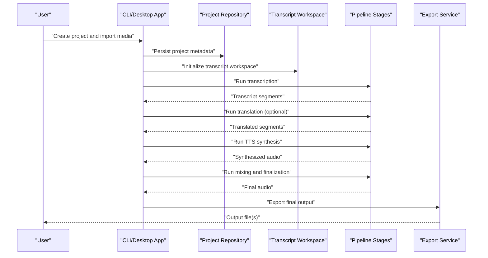
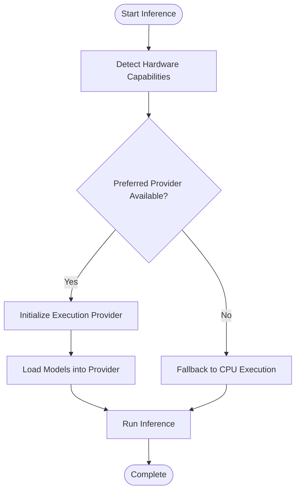
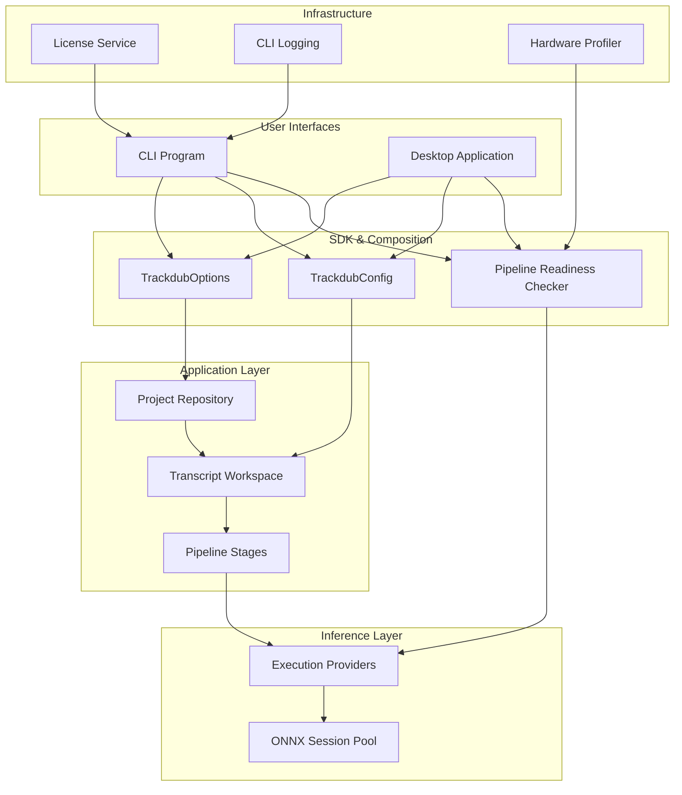

# Getting Started

<cite>
**Referenced Files in This Document**
- [README.md](file://README.md)
- [Program.cs](file://src/Trackdub.Cli/Program.cs)
- [CliLoggingConfiguration.cs](file://src/Trackdub.Cli/CliLoggingConfiguration.cs)
- [DubSetupWizard.cs](file://src/Trackdub.Cli/DubSetupWizard.cs)
- [TrackdubOptions.cs](file://src/Trackdub.Sdk/TrackdubOptions.cs)
- [TrackdubConfig.cs](file://src/Trackdub.Sdk/TrackdubConfig.cs)
- [TrackdubPipelineReadinessChecker.cs](file://src/Trackdub.Sdk/TrackdubPipelineReadinessChecker.cs)
- [HardwareProfiler.cs](file://src/Trackdub.Domain/HardwareProfiler.cs)
- [LicensingService.cs](file://src/Trackdub.Licensing/LicensingService.cs)
- [WindowsFingerprintSource.cs](file://src/Trackdub.Licensing/WindowsFingerprintSource.cs)
- [LinuxFingerprintSource.cs](file://src/Trackdub.Licensing/LinuxFingerprintSource.cs)
- [MacOsFingerprintSource.cs](file://src/Trackdub.Licensing/MacOsFingerprintSource.cs)
- [IModelDownloadOrchestrator.cs](file://src/Trackdub.Contracts/IModelDownloadOrchestrator.cs)
- [IModelInventoryService.cs](file://src/Trackdub.Contracts/IModelInventoryService.cs)
- [ITensorRtRtxRuntimeReadinessService.cs](file://src/Trackdub.Contracts/ITensorRtRtxRuntimeReadinessService.cs)
- [IMigraphxRuntimeReadinessService.cs](file://src/Trackdub.Contracts/IMigraphxRuntimeReadinessService.cs)
- [WinMlCatalogRuntimeReadinessServices.cs](file://src/Trackdub.Contracts/WinMlCatalogRuntimeReadinessServices.cs)
- [Trackdub.Media.Playback/LibMpvWindowsBootstrap.cs](file://src/Trackdub.Media.Playback/LibMpvWindowsBootstrap.cs)
- [Trackdub.Media.Playback/LibMpvMacBootstrap.cs](file://src/Trackdub.Media.Playback/LibMpvMacBootstrap.cs)
- [Trackdub.Media.Playback/LibMpvLinuxBootstrap.cs](file://src/Trackdub.Media.Playback/LibMpvLinuxBootstrap.cs)
- [Trackdub.Media.Playback/LibMpvRuntimeLocator.cs](file://src/Trackdub.Media.Playback/LibMpvRuntimeLocator.cs)
- [Trackdub.Media.Playback/MediaFoundationPlaybackBackend.cs](file://src/Trackdub.Media.Playback/MediaFoundationPlaybackBackend.cs)
- [Trackdub.Media.Playback/LibVlcPlaybackBackend.cs](file://src/Trackdub.Media.Playback/LibVlcPlaybackBackend.cs)
- [Trackdub.Media.Playback/PlaybackNativePrewarm.cs](file://src/Trackdub.Media.Playback/PlaybackNativePrewarm.cs)
- [Trackdub.Inference.Onnx/TensorRtRtx/TensorRtRtxExecutionProviderFactory.cs](file://src/Trackdub.Inference.Onnx/TensorRtRtx/TensorRtRtxExecutionProviderFactory.cs)
- [Trackdub.Inference.Onnx/WindowsMl/WindowsMlExecutionProviderFactory.cs](file://src/Trackdub.Inference.Onnx/WindowsMl/WindowsMlExecutionProviderFactory.cs)
- [Trackdub.Inference.Onnx/OpenVino/OpenVinoExecutionProviderFactory.cs](file://src/Trackdub.Inference.Onnx/OpenVino/OpenVinoExecutionProviderFactory.cs)
- [Trackdub.Inference.Onnx/Qnn/QnnExecutionProviderFactory.cs](file://src/Trackdub.Inference.Onnx/Qnn/QnnExecutionProviderFactory.cs)
- [Trackdub.Inference.Onnx/VitisAi/VitisAiExecutionProviderFactory.cs](file://src/Trackdub.Inference.Onnx/VitisAi/VitisAiExecutionProviderFactory.cs)
- [Trackdub.Inference.Onnx/Dnnl/DnnlExecutionProviderFactory.cs](file://src/Trackdub.Inference.Onnx/Dnnl/DnnlExecutionProviderFactory.cs)
- [Trackdub.Inference.Onnx/NativeCudaTensorRt/NativeCudaTensorRtExecutionProviderFactory.cs](file://src/Trackdub.Inference.Onnx/NativeCudaTensorRt/NativeCudaTensorRtExecutionProviderFactory.cs)
- [Trackdub.Inference.Onnx/Migraphx/MigraphxExecutionProviderFactory.cs](file://src/Trackdub.Inference.Onnx/Migraphx/MigraphxExecutionProviderFactory.cs)
- [Trackdub.Inference.Onnx/Pool/OnnxSessionPool.cs](file://src/Trackdub.Inference.Onnx/Pool/OnnxSessionPool.cs)
- [Trackdub.Application/Pipeline/StageRunHelper.cs](file://src/Trackdub.Application/Pipeline/StageRunHelper.cs)
- [Trackdub.Application/Pipeline/StageRunContext.cs](file://src/Trackdub.Application/Pipeline/StageRunContext.cs)
- [Trackdub.Application/Pipeline/StageRunResult.cs](file://src/Trackdub.Application/Pipeline/StageRunResult.cs)
- [Trackdub.Application/Projects/ProjectRepository.cs](file://src/Trackdub.Application/Projects/ProjectRepository.cs)
- [Trackdub.Application/Transcripts/TranscriptWorkspaceContext.cs](file://src/Trackdub.Application/Transcripts/TranscriptWorkspaceContext.cs)
- [Trackdub.Application/Transcripts/TranscriptWorkspaceFactory.cs](file://src/Trackdub.Application/Transcripts/TranscriptWorkspaceFactory.cs)
- [Trackdub.Application/Transcripts/TranscriptWorkspaceSession.cs](file://src/Trackdub.Application/Transcripts/TranscriptWorkspaceSession.cs)
- [Trackdub.Application/Transcripts/TranscriptWorkspace.cs](file://src/Trackdub.Application/Transcripts/TranscriptWorkspace.cs)
- [Trackdub.Application/Transcripts/TranscriptSegment.cs](file://src/Trackdub.Application/Transcripts/TranscriptSegment.cs)
- [Trackdub.Application/Transcripts/TranscriptSpeaker.cs](file://src/Trackdub.Application/Transcripts/TranscriptSpeaker.cs)
- [Trackdub.Application/Transcripts/TranscriptLanguage.cs](file://src/Trackdub.Application/Transcripts/TranscriptLanguage.cs)
- [Trackdub.Application/Transcripts/TranscriptExportService.cs](file://src/Trackdub.Application/Transcripts/TranscriptExportService.cs)
- [Trackdub.Application/Transcripts/TranscriptImportService.cs](file://src/Trackdub.Application/Transcripts/TranscriptImportService.cs)
- [Trackdub.Application/Transcripts/TranscriptValidationService.cs](file://src/Trackdub.Application/Transcripts/TranscriptValidationService.cs)
- [Trackdub.Application/Transcripts/TranscriptNormalizationService.cs](file://src/Trackdub.Application/Transcripts/TranscriptNormalizationService.cs)
- [Trackdub.Application/Transcripts/TranscriptAlignmentService.cs](file://src/Trackdub.Application/Transcripts/TranscriptAlignmentService.cs)
- [Trackdub.Application/Transcripts/TranscriptDiarizationService.cs](file://src/Trackdub.Application/Transcripts/TranscriptDiarizationService.cs)
- [Trackdub.Application/Transcripts/TranscriptTranslationService.cs](file://src/Trackdub.Application/Transcripts/TranscriptTranslationService.cs)
- [Trackdub.Application/Transcripts/TranscriptTtsService.cs](file://src/Trackdub.Application/Transcripts/TranscriptTtsService.cs)
- [Trackdub.Application/Transcripts/TranscriptMixingService.cs](file://src/Trackdub.Application/Transcripts/TranscriptMixingService.cs)
- [Trackdub.Application/Transcripts/TranscriptExportService.cs](file://src/Trackdub.Application/Transcripts/TranscriptExportService.cs)
- [Trackdub.Application/Transcripts/TranscriptImportService.cs](file://src/Trackdub.Application/Transcripts/TranscriptImportService.cs)
- [Trackdub.Application/Transcripts/TranscriptValidationService.cs](file://src/Trackdub.Application/Transcripts/TranscriptValidationService.cs)
- [Trackdub.Application/Transcripts/TranscriptNormalizationService.cs](file://src/Trackdub.Application/Transcripts/TranscriptNormalizationService.cs)
- [Trackdub.Application/Transcripts/TranscriptAlignmentService.cs](file://src/Trackdub.Application/Transcripts/TranscriptAlignmentService.cs)
- [Trackdub.Application/Transcripts/TranscriptDiarizationService.cs](file://src/Trackdub.Application/Transcripts/TranscriptDiarizationService.cs)
- [Trackdub.Application/Transcripts/TranscriptTranslationService.cs](file://src/Trackdub.Application/Transcripts/TranscriptTranslationService.cs)
- [Trackdub.Application/Transcripts/TranscriptTtsService.cs](file://src/Trackdub.Application/Transcripts/TranscriptTtsService.cs)
- [Trackdub.Application/Transcripts/TranscriptMixingService.cs](file://src/Trackdub.Application/Transcripts/TranscriptMixingService.cs)
</cite>

## Table of Contents
1. [Introduction](#introduction)
2. [System Requirements](#system-requirements)
3. [Installation](#installation)
4. [Initial Configuration](#initial-configuration)
5. [CLI Quick Start](#cli-quick-start)
6. [Desktop Application Quick Start](#desktop-application-quick-start)
7. [Creating Your First Dubbing Project](#creating-your-first-dubbing-project)
8. [GPU Acceleration Setup](#gpu-acceleration-setup)
9. [Licensing and Model Downloads](#licensing-and-model-downloads)
10. [Troubleshooting for First-Time Users](#troubleshooting-for-first-time-users)
11. [Architecture Overview](#architecture-overview)
12. [Conclusion](#conclusion)

## Introduction
This guide helps you get Trackdub up and running quickly on Windows, macOS, and Linux. You will install the software, configure it for your environment, run your first dubbing job via CLI or the desktop application, and understand how to enable GPU acceleration and manage licenses and models.

## System Requirements
- Operating systems: Windows 10/11, macOS (Intel and Apple Silicon), Linux (common distributions with standard system libraries).
- CPU: Multi-core modern processor recommended; AI inference can be CPU-only but is slower.
- Memory: At least 8 GB RAM; 16 GB+ recommended for larger media and models.
- Storage: Sufficient free space for project artifacts and model downloads (models can be several GB each).
- GPU (optional): NVIDIA GPU with CUDA support for TensorRT-RTX acceleration; other accelerators supported depending on platform.
- Media playback backends: Platform-native playback components are auto-detected and bootstrapped at runtime.

[No sources needed since this section provides general guidance]

## Installation
- Download the latest release for your platform from the official source referenced in the repository’s top-level documentation.
- Install dependencies as required by your platform:
  - Windows: Ensure Visual C++ redistributables and optional GPU drivers are installed.
  - macOS: Follow platform-specific instructions for native playback and runtime libraries.
  - Linux: Install required system libraries for media playback and inference providers.
- Verify installation by launching the CLI or desktop application and checking that the pipeline readiness check passes.

[No sources needed since this section provides general guidance]

## Initial Configuration
- Run the setup wizard to initialize settings, choose default execution providers, and prepare model directories.
- Configure logging verbosity if you need more diagnostic output during first runs.
- Set paths for project storage and model cache locations.
- Validate hardware capabilities and select preferred inference accelerators.

Key configuration entry points:
- CLI logging bootstrap and configuration
- SDK options and configuration objects
- Pipeline readiness checker to validate environment

**Section sources**
- [CliLoggingConfiguration.cs](file://src/Trackdub.Cli/CliLoggingConfiguration.cs)
- [TrackdubOptions.cs](file://src/Trackdub.Sdk/TrackdubOptions.cs)
- [TrackdubConfig.cs](file://src/Trackdub.Sdk/TrackdubConfig.cs)
- [TrackdubPipelineReadinessChecker.cs](file://src/Trackdub.Sdk/TrackdubPipelineReadinessChecker.cs)

## CLI Quick Start
- Launch the CLI executable and run the setup wizard to initialize your environment.
- Use commands to create a new project, import media, run transcription, translation, TTS synthesis, and export final audio/video.
- Monitor progress and logs; adjust verbosity as needed.

Entry points and helpers:
- CLI program entry point
- Logging configuration
- Setup wizard for initial configuration

**Section sources**
- [Program.cs](file://src/Trackdub.Cli/Program.cs)
- [CliLoggingConfiguration.cs](file://src/Trackdub.Cli/CliLoggingConfiguration.cs)
- [DubSetupWizard.cs](file://src/Trackdub.Cli/DubSetupWizard.cs)

## Desktop Application Quick Start
- Open the desktop application; the UI guides you through creating a project, importing media, and running the dubbing pipeline.
- The app auto-detects playback backends and displays status for model availability and GPU acceleration.
- Use built-in wizards to configure settings and start processing jobs.

Playback backend detection and bootstrapping:
- Windows, macOS, and Linux-specific playback bootstrappers
- Runtime locator for native playback libraries
- Native prewarm to ensure smooth playback

**Section sources**
- [LibMpvWindowsBootstrap.cs](file://src/Trackdub.Media.Playback/LibMpvWindowsBootstrap.cs)
- [LibMpvMacBootstrap.cs](file://src/Trackdub.Media.Playback/LibMpvMacBootstrap.cs)
- [LibMpvLinuxBootstrap.cs](file://src/Trackdub.Media.Playback/LibMpvLinuxBootstrap.cs)
- [LibMpvRuntimeLocator.cs](file://src/Trackdub.Media.Playback/LibMpvRuntimeLocator.cs)
- [MediaFoundationPlaybackBackend.cs](file://src/Trackdub.Media.Playback/MediaFoundationPlaybackBackend.cs)
- [LibVlcPlaybackBackend.cs](file://src/Trackdub.Media.Playback/LibVlcPlaybackBackend.cs)
- [PlaybackNativePrewarm.cs](file://src/Trackdub.Media.Playback/PlaybackNativePrewarm.cs)

## Creating Your First Dubbing Project
Follow these steps to produce a dubbed output:
1. Create a new project in CLI or the desktop app.
2. Import your media file (audio/video).
3. Run transcription to generate transcripts aligned with media segments.
4. Translate transcripts into target languages if needed.
5. Generate speech using TTS with chosen voices and settings.
6. Mix and finalize audio tracks; export the final output.

Core workflow components:
- Stage run helper and context for orchestrating pipeline stages
- Transcript workspace services for import, validation, normalization, alignment, diarization, translation, TTS, mixing, and export
- Project repository for persistence and management

**Diagram sources**
- [StageRunHelper.cs](file://src/Trackdub.Application/Pipeline/StageRunHelper.cs)
- [StageRunContext.cs](file://src/Trackdub.Application/Pipeline/StageRunContext.cs)
- [StageRunResult.cs](file://src/Trackdub.Application/Pipeline/StageRunResult.cs)
- [ProjectRepository.cs](file://src/Trackdub.Application/Projects/ProjectRepository.cs)
- [TranscriptWorkspaceContext.cs](file://src/Trackdub.Application/Transcripts/TranscriptWorkspaceContext.cs)
- [TranscriptWorkspaceFactory.cs](file://src/Trackdub.Application/Transcripts/TranscriptWorkspaceFactory.cs)
- [TranscriptWorkspaceSession.cs](file://src/Trackdub.Application/Transcripts/TranscriptWorkspaceSession.cs)
- [TranscriptWorkspace.cs](file://src/Trackdub.Application/Transcripts/TranscriptWorkspace.cs)
- [TranscriptSegment.cs](file://src/Trackdub.Application/Transcripts/TranscriptSegment.cs)
- [TranscriptSpeaker.cs](file://src/Trackdub.Application/Transcripts/TranscriptSpeaker.cs)
- [TranscriptLanguage.cs](file://src/Trackdub.Application/Transcripts/TranscriptLanguage.cs)
- [TranscriptExportService.cs](file://src/Trackdub.Application/Transcripts/TranscriptExportService.cs)
- [TranscriptImportService.cs](file://src/Trackdub.Application/Transcripts/TranscriptImportService.cs)
- [TranscriptValidationService.cs](file://src/Trackdub.Application/Transcripts/TranscriptValidationService.cs)
- [TranscriptNormalizationService.cs](file://src/Trackdub.Application/Transcripts/TranscriptNormalizationService.cs)
- [TranscriptAlignmentService.cs](file://src/Trackdub.Application/Transcripts/TranscriptAlignmentService.cs)
- [TranscriptDiarizationService.cs](file://src/Trackdub.Application/Transcripts/TranscriptDiarizationService.cs)
- [TranscriptTranslationService.cs](file://src/Trackdub.Application/Transcripts/TranscriptTranslationService.cs)
- [TranscriptTtsService.cs](file://src/Trackdub.Application/Transcripts/TranscriptTtsService.cs)
- [TranscriptMixingService.cs](file://src/Trackdub.Application/Transcripts/TranscriptMixingService.cs)

**Section sources**
- [StageRunHelper.cs](file://src/Trackdub.Application/Pipeline/StageRunHelper.cs)
- [StageRunContext.cs](file://src/Trackdub.Application/Pipeline/StageRunContext.cs)
- [StageRunResult.cs](file://src/Trackdub.Application/Pipeline/StageRunResult.cs)
- [ProjectRepository.cs](file://src/Trackdub.Application/Projects/ProjectRepository.cs)
- [TranscriptWorkspaceContext.cs](file://src/Trackdub.Application/Transcripts/TranscriptWorkspaceContext.cs)
- [TranscriptWorkspaceFactory.cs](file://src/Trackdub.Application/Transcripts/TranscriptWorkspaceFactory.cs)
- [TranscriptWorkspaceSession.cs](file://src/Trackdub.Application/Transcripts/TranscriptWorkspaceSession.cs)
- [TranscriptWorkspace.cs](file://src/Trackdub.Application/Transcripts/TranscriptWorkspace.cs)
- [TranscriptSegment.cs](file://src/Trackdub.Application/Transcripts/TranscriptSegment.cs)
- [TranscriptSpeaker.cs](file://src/Trackdub.Application/Transcripts/TranscriptSpeaker.cs)
- [TranscriptLanguage.cs](file://src/Trackdub.Application/Transcripts/TranscriptLanguage.cs)
- [TranscriptExportService.cs](file://src/Trackdub.Application/Transcripts/TranscriptExportService.cs)
- [TranscriptImportService.cs](file://src/Trackdub.Application/Transcripts/TranscriptImportService.cs)
- [TranscriptValidationService.cs](file://src/Trackdub.Application/Transcripts/TranscriptValidationService.cs)
- [TranscriptNormalizationService.cs](file://src/Trackdub.Application/Transcripts/TranscriptNormalizationService.cs)
- [TranscriptAlignmentService.cs](file://src/Trackdub.Application/Transcripts/TranscriptAlignmentService.cs)
- [TranscriptDiarizationService.cs](file://src/Trackdub.Application/Transcripts/TranscriptDiarizationService.cs)
- [TranscriptTranslationService.cs](file://src/Trackdub.Application/Transcripts/TranscriptTranslationService.cs)
- [TranscriptTtsService.cs](file://src/Trackdub.Application/Transcripts/TranscriptTtsService.cs)
- [TranscriptMixingService.cs](file://src/Trackdub.Application/Transcripts/TranscriptMixingService.cs)

## GPU Acceleration Setup
- Choose an execution provider based on your hardware:
  - NVIDIA GPUs: TensorRT-RTX or CUDA-backed providers for best performance.
  - Windows ML: Windows ML catalog providers when available.
  - OpenVINO: For Intel CPUs/GPUs where applicable.
  - QNN/VitisAI/DNNL: Depending on device capabilities.
- Validate provider readiness and memory budget planning.
- If GPU acceleration is not detected, the pipeline falls back to CPU execution.

Providers and readiness checks:
- Execution provider factories for various accelerators
- Readiness services for TensorRT-RTX and MIGraphX
- Windows ML catalog integration

**Diagram sources**
- [TensorRtRtxExecutionProviderFactory.cs](file://src/Trackdub.Inference.Onnx/TensorRtRtx/TensorRtRtxExecutionProviderFactory.cs)
- [WindowsMlExecutionProviderFactory.cs](file://src/Trackdub.Inference.Onnx/WindowsMl/WindowsMlExecutionProviderFactory.cs)
- [OpenVinoExecutionProviderFactory.cs](file://src/Trackdub.Inference.Onnx/OpenVino/OpenVinoExecutionProviderFactory.cs)
- [QnnExecutionProviderFactory.cs](file://src/Trackdub.Inference.Onnx/Qnn/QnnExecutionProviderFactory.cs)
- [VitisAiExecutionProviderFactory.cs](file://src/Trackdub.Inference.Onnx/VitisAi/VitisAiExecutionProviderFactory.cs)
- [DnnlExecutionProviderFactory.cs](file://src/Trackdub.Inference.Onnx/Dnnl/DnnlExecutionProviderFactory.cs)
- [NativeCudaTensorRtExecutionProviderFactory.cs](file://src/Trackdub.Inference.Onnx/NativeCudaTensorRt/NativeCudaTensorRtExecutionProviderFactory.cs)
- [MigraphxExecutionProviderFactory.cs](file://src/Trackdub.Inference.Onnx/Migraphx/MigraphxExecutionProviderFactory.cs)
- [OnnxSessionPool.cs](file://src/Trackdub.Inference.Onnx/Pool/OnnxSessionPool.cs)
- [ITensorRtRtxRuntimeReadinessService.cs](file://src/Trackdub.Contracts/ITensorRtRtxRuntimeReadinessService.cs)
- [IMigraphxRuntimeReadinessService.cs](file://src/Trackdub.Contracts/IMigraphxRuntimeReadinessService.cs)
- [WinMlCatalogRuntimeReadinessServices.cs](file://src/Trackdub.Contracts/WinMlCatalogRuntimeReadinessServices.cs)

**Section sources**
- [TensorRtRtxExecutionProviderFactory.cs](file://src/Trackdub.Inference.Onnx/TensorRtRtx/TensorRtRtxExecutionProviderFactory.cs)
- [WindowsMlExecutionProviderFactory.cs](file://src/Trackdub.Inference.Onnx/WindowsMl/WindowsMlExecutionProviderFactory.cs)
- [OpenVinoExecutionProviderFactory.cs](file://src/Trackdub.Inference.Onnx/OpenVino/OpenVinoExecutionProviderFactory.cs)
- [QnnExecutionProviderFactory.cs](file://src/Trackdub.Inference.Onnx/Qnn/QnnExecutionProviderFactory.cs)
- [VitisAiExecutionProviderFactory.cs](file://src/Trackdub.Inference.Onnx/VitisAi/VitisAiExecutionProviderFactory.cs)
- [DnnlExecutionProviderFactory.cs](file://src/Trackdub.Inference.Onnx/Dnnl/DnnlExecutionProviderFactory.cs)
- [NativeCudaTensorRtExecutionProviderFactory.cs](file://src/Trackdub.Inference.Onnx/NativeCudaTensorRt/NativeCudaTensorRtExecutionProviderFactory.cs)
- [MigraphxExecutionProviderFactory.cs](file://src/Trackdub.Inference.Onnx/Migraphx/MigraphxExecutionProviderFactory.cs)
- [OnnxSessionPool.cs](file://src/Trackdub.Inference.Onnx/Pool/OnnxSessionPool.cs)
- [ITensorRtRtxRuntimeReadinessService.cs](file://src/Trackdub.Contracts/ITensorRtRtxRuntimeReadinessService.cs)
- [IMigraphxRuntimeReadinessService.cs](file://src/Trackdub.Contracts/IMigraphxRuntimeReadinessService.cs)
- [WinMlCatalogRuntimeReadinessServices.cs](file://src/Trackdub.Contracts/WinMlCatalogRuntimeReadinessServices.cs)

## Licensing and Model Downloads
- Licensing:
  - License initialization and validation occur at startup.
  - Hardware fingerprinting ensures license binding to your machine.
- Model downloads:
  - Use the model download orchestrator to fetch required models.
  - Inventory service manages model availability and versions.
- Ensure you have sufficient disk space and network access for model downloads.

Licensing and model management:
- License service and token handling
- Platform-specific fingerprint sources
- Model download orchestration and inventory

**Section sources**
- [LicensingService.cs](file://src/Trackdub.Licensing/LicensingService.cs)
- [WindowsFingerprintSource.cs](file://src/Trackdub.Licensing/WindowsFingerprintSource.cs)
- [LinuxFingerprintSource.cs](file://src/Trackdub.Licensing/LinuxFingerprintSource.cs)
- [MacOsFingerprintSource.cs](file://src/Trackdub.Licensing/MacOsFingerprintSource.cs)
- [IModelDownloadOrchestrator.cs](file://src/Trackdub.Contracts/IModelDownloadOrchestrator.cs)
- [IModelInventoryService.cs](file://src/Trackdub.Contracts/IModelInventoryService.cs)

## Troubleshooting for First-Time Users
- Playback issues:
  - Verify native playback libraries are located and bootstrapped correctly.
  - Check platform-specific bootstrappers and runtime locators.
- GPU acceleration not detected:
  - Confirm driver installations and provider readiness services.
  - Review fallback behavior to CPU execution.
- Model download failures:
  - Check network connectivity and permissions for model cache directories.
  - Validate model inventory and manifest files.
- Licensing errors:
  - Re-run license initialization and verify hardware fingerprint generation.
  - Ensure license tokens are valid and stored correctly.

Playback and runtime diagnostics:
- Playback bootstrappers and locators
- Provider readiness services
- Hardware profiling utilities

**Section sources**
- [LibMpvWindowsBootstrap.cs](file://src/Trackdub.Media.Playback/LibMpvWindowsBootstrap.cs)
- [LibMpvMacBootstrap.cs](file://src/Trackdub.Media.Playback/LibMpvMacBootstrap.cs)
- [LibMpvLinuxBootstrap.cs](file://src/Trackdub.Media.Playback/LibMpvLinuxBootstrap.cs)
- [LibMpvRuntimeLocator.cs](file://src/Trackdub.Media.Playback/LibMpvRuntimeLocator.cs)
- [ITensorRtRtxRuntimeReadinessService.cs](file://src/Trackdub.Contracts/ITensorRtRtxRuntimeReadinessService.cs)
- [IMigraphxRuntimeReadinessService.cs](file://src/Trackdub.Contracts/IMigraphxRuntimeReadinessService.cs)
- [WinMlCatalogRuntimeReadinessServices.cs](file://src/Trackdub.Contracts/WinMlCatalogRuntimeReadinessServices.cs)
- [HardwareProfiler.cs](file://src/Trackdub.Domain/HardwareProfiler.cs)

## Architecture Overview
Trackdub composes multiple layers:
- CLI and desktop applications provide user entry points.
- SDK and composition layer assemble services and configurations.
- Application layer implements domain logic for projects, transcripts, and pipeline stages.
- Inference layer executes ONNX models with various execution providers.
- Infrastructure and licensing handle persistence, logging, and license management.

**Diagram sources**
- [Program.cs](file://src/Trackdub.Cli/Program.cs)
- [CliLoggingConfiguration.cs](file://src/Trackdub.Cli/CliLoggingConfiguration.cs)
- [TrackdubOptions.cs](file://src/Trackdub.Sdk/TrackdubOptions.cs)
- [TrackdubConfig.cs](file://src/Trackdub.Sdk/TrackdubConfig.cs)
- [TrackdubPipelineReadinessChecker.cs](file://src/Trackdub.Sdk/TrackdubPipelineReadinessChecker.cs)
- [ProjectRepository.cs](file://src/Trackdub.Application/Projects/ProjectRepository.cs)
- [TranscriptWorkspaceContext.cs](file://src/Trackdub.Application/Transcripts/TranscriptWorkspaceContext.cs)
- [TranscriptWorkspaceFactory.cs](file://src/Trackdub.Application/Transcripts/TranscriptWorkspaceFactory.cs)
- [TranscriptWorkspaceSession.cs](file://src/Trackdub.Application/Transcripts/TranscriptWorkspaceSession.cs)
- [TranscriptWorkspace.cs](file://src/Trackdub.Application/Transcripts/TranscriptWorkspace.cs)
- [StageRunHelper.cs](file://src/Trackdub.Application/Pipeline/StageRunHelper.cs)
- [StageRunContext.cs](file://src/Trackdub.Application/Pipeline/StageRunContext.cs)
- [StageRunResult.cs](file://src/Trackdub.Application/Pipeline/StageRunResult.cs)
- [OnnxSessionPool.cs](file://src/Trackdub.Inference.Onnx/Pool/OnnxSessionPool.cs)
- [LicensingService.cs](file://src/Trackdub.Licensing/LicensingService.cs)
- [HardwareProfiler.cs](file://src/Trackdub.Domain/HardwareProfiler.cs)

## Conclusion
You now have the essentials to install Trackdub, configure it for your platform, and run your first dubbing project. Use the CLI for automation and scripting, or the desktop application for guided workflows. Enable GPU acceleration where possible, manage licenses and models through the provided services, and consult the troubleshooting section for common issues.

[No sources needed since this section summarizes without analyzing specific files]