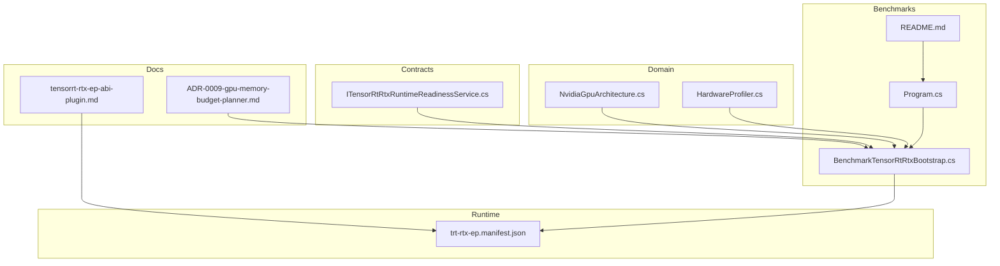
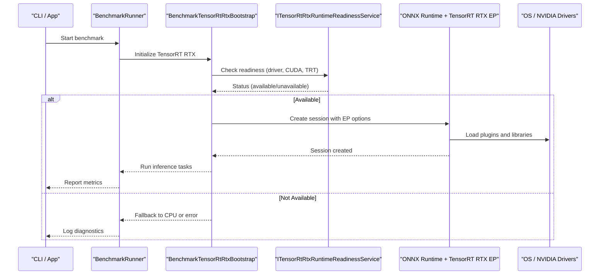
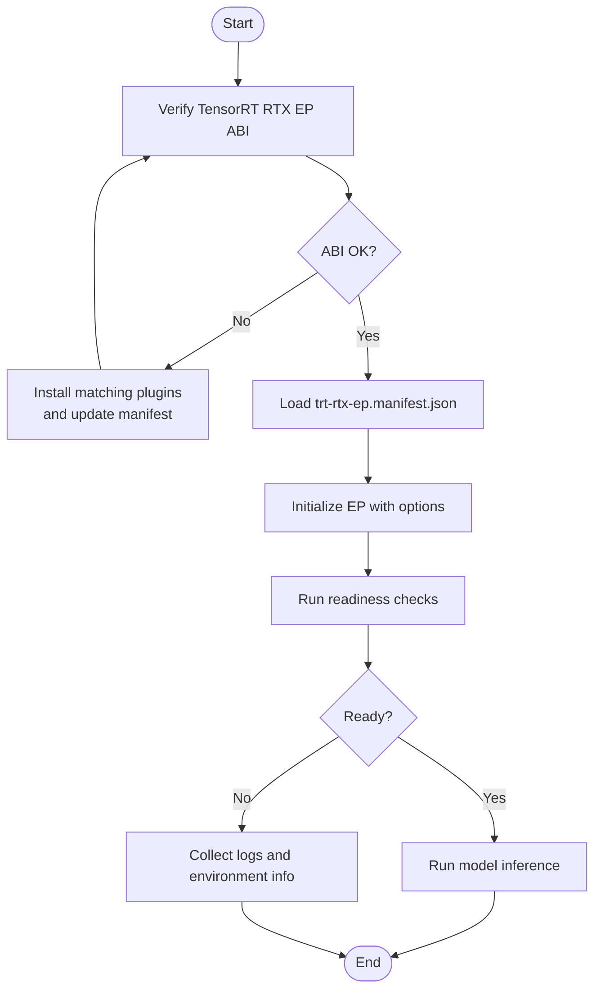
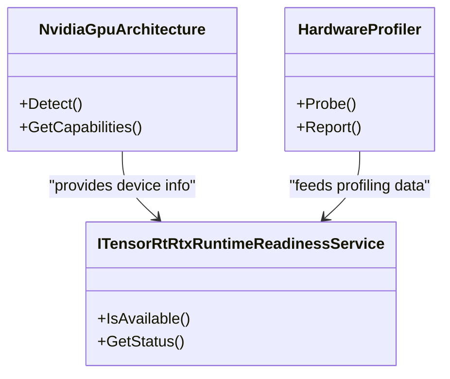
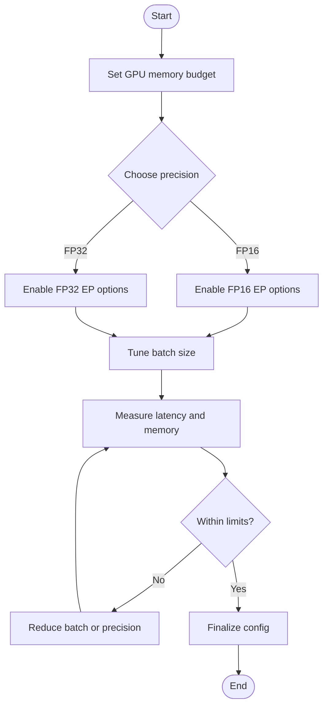
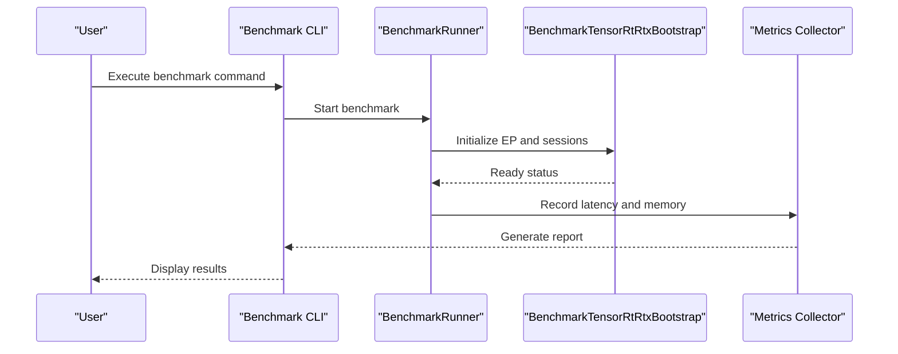
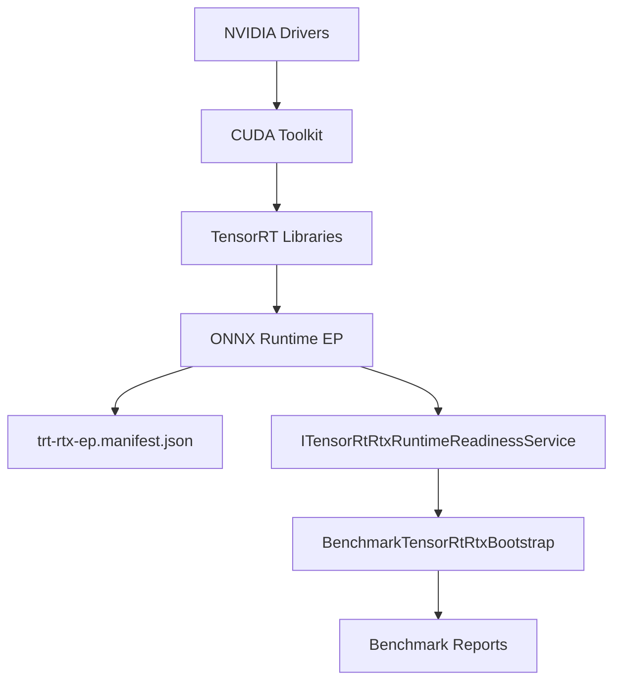

# CUDA & TensorRT Setup

<cite>
**Referenced Files in This Document**
- [tensorrt-rtx-ep-abi-plugin.md](file://docs/reference/tensorrt-rtx-ep-abi-plugin.md)
- [ADR-0009-gpu-memory-budget-planner.md](file://docs/decisions/ADR-0009-gpu-memory-budget-planner.md)
- [BenchmarkTensorRtRtxBootstrap.cs](file://src/Trackdub.Benchmarks/BenchmarkTensorRtRtxBootstrap.cs)
- [trt-rtx-ep.manifest.json](file://runtime/trt-rtx-ep.manifest.json)
- [ITensorRtRtxRuntimeReadinessService.cs](file://src/Trackdub.Contracts/ITensorRtRtxRuntimeReadinessService.cs)
- [NvidiaGpuArchitecture.cs](file://src/Trackdub.Domain/NvidiaGpuArchitecture.cs)
- [HardwareProfiler.cs](file://src/Trackdub.Domain/HardwareProfiler.cs)
- [Program.cs](file://src/Trackdub.Benchmarks/Program.cs)
- [README.md](file://src/Trackdub.Benchmarks/README.md)
</cite>

## Table of Contents
1. [Introduction](#introduction)
2. [Project Structure](#project-structure)
3. [Core Components](#core-components)
4. [Architecture Overview](#architecture-overview)
5. [Detailed Component Analysis](#detailed-component-analysis)
6. [Dependency Analysis](#dependency-analysis)
7. [Performance Considerations](#performance-considerations)
8. [Troubleshooting Guide](#troubleshooting-guide)
9. [Conclusion](#conclusion)
10. [Appendices](#appendices)

## Introduction
This document explains how to set up and optimize CUDA and TensorRT GPU acceleration in Trackdub. It covers NVIDIA driver and toolkit requirements, automatic GPU detection, manual configuration options, TensorRT RTX execution provider setup (including plugins and runtime dependencies), GPU memory optimization, batch size tuning, precision configurations (FP32/FP16), platform-specific installation steps, troubleshooting common issues, and performance benchmarking and monitoring guidance.

## Project Structure
Trackdub integrates TensorRT RTX via an ONNX Runtime execution provider with explicit readiness checks, a runtime manifest for plugin discovery, and benchmark tooling to validate performance. Key areas include:
- Reference documentation for the TensorRT RTX EP ABI and plugin compatibility
- ADRs describing GPU memory budget planning
- Benchmark bootstrap and runner code for TensorRT RTX
- Contracts defining readiness service interfaces
- Domain models for GPU architecture and profiling

**Diagram sources**
- [tensorrt-rtx-ep-abi-plugin.md](file://docs/reference/tensorrt-rtx-ep-abi-plugin.md)
- [ADR-0009-gpu-memory-budget-planner.md](file://docs/decisions/ADR-0009-gpu-memory-budget-planner.md)
- [trt-rtx-ep.manifest.json](file://runtime/trt-rtx-ep.manifest.json)
- [ITensorRtRtxRuntimeReadinessService.cs](file://src/Trackdub.Contracts/ITensorRtRtxRuntimeReadinessService.cs)
- [NvidiaGpuArchitecture.cs](file://src/Trackdub.Domain/NvidiaGpuArchitecture.cs)
- [HardwareProfiler.cs](file://src/Trackdub.Domain/HardwareProfiler.cs)
- [BenchmarkTensorRtRtxBootstrap.cs](file://src/Trackdub.Benchmarks/BenchmarkTensorRtRtxBootstrap.cs)
- [Program.cs](file://src/Trackdub.Benchmarks/Program.cs)
- [README.md](file://src/Trackdub.Benchmarks/README.md)

**Section sources**
- [tensorrt-rtx-ep-abi-plugin.md](file://docs/reference/tensorrt-rtx-ep-abi-plugin.md)
- [ADR-0009-gpu-memory-budget-planner.md](file://docs/decisions/ADR-0009-gpu-memory-budget-planner.md)
- [trt-rtx-ep.manifest.json](file://runtime/trt-rtx-ep.manifest.json)
- [ITensorRtRtxRuntimeReadinessService.cs](file://src/Trackdub.Contracts/ITensorRtRtxRuntimeReadinessService.cs)
- [NvidiaGpuArchitecture.cs](file://src/Trackdub.Domain/NvidiaGpuArchitecture.cs)
- [HardwareProfiler.cs](file://src/Trackdub.Domain/HardwareProfiler.cs)
- [BenchmarkTensorRtRtxBootstrap.cs](file://src/Trackdub.Benchmarks/BenchmarkTensorRtRtxBootstrap.cs)
- [Program.cs](file://src/Trackdub.Benchmarks/Program.cs)
- [README.md](file://src/Trackdub.Benchmarks/README.md)

## Core Components
- TensorRT RTX Execution Provider ABI and Plugin Compatibility: Defines required ABI versions and plugin libraries for successful initialization and model execution.
- GPU Readiness Service Contract: Declares the interface used by Trackdub to verify that TensorRT RTX is available and correctly configured at runtime.
- GPU Architecture and Profiling Models: Provide device capability detection and profiling hooks used by benchmarks and runtime selection logic.
- Benchmark Bootstrap for TensorRT RTX: Initializes providers, loads models, and runs latency/throughput tests to validate GPU acceleration.
- Runtime Manifest: Declares TensorRT RTX plugin paths and metadata needed for dynamic loading.

**Section sources**
- [tensorrt-rtx-ep-abi-plugin.md](file://docs/reference/tensorrt-rtx-ep-abi-plugin.md)
- [ITensorRtRtxRuntimeReadinessService.cs](file://src/Trackdub.Contracts/ITensorRtRtxRuntimeReadinessService.cs)
- [NvidiaGpuArchitecture.cs](file://src/Trackdub.Domain/NvidiaGpuArchitecture.cs)
- [HardwareProfiler.cs](file://src/Trackdub.Domain/HardwareProfiler.cs)
- [BenchmarkTensorRtRtxBootstrap.cs](file://src/Trackdub.Benchmarks/BenchmarkTensorRtRtxBootstrap.cs)
- [trt-rtx-ep.manifest.json](file://runtime/trt-rtx-ep.manifest.json)

## Architecture Overview
The following sequence shows how Trackdub detects and initializes TensorRT RTX during benchmarking or runtime startup.

**Diagram sources**
- [BenchmarkTensorRtRtxBootstrap.cs](file://src/Trackdub.Benchmarks/BenchmarkTensorRtRtxBootstrap.cs)
- [ITensorRtRtxRuntimeReadinessService.cs](file://src/Trackdub.Contracts/ITensorRtRtxRuntimeReadinessService.cs)
- [trt-rtx-ep.manifest.json](file://runtime/trt-rtx-ep.manifest.json)

## Detailed Component Analysis

### TensorRT RTX Execution Provider Setup
- ABI and Plugins: Ensure the TensorRT RTX EP ABI version matches installed plugins. The reference document details compatible plugin sets and expected library names.
- Runtime Manifest: The manifest file declares plugin locations and metadata; ensure it is discoverable by the application process.
- Initialization Flow: The bootstrap creates an ONNX Runtime session with EP options, validates availability via the readiness service, and proceeds to run inference if successful.

**Diagram sources**
- [tensorrt-rtx-ep-abi-plugin.md](file://docs/reference/tensorrt-rtx-ep-abi-plugin.md)
- [trt-rtx-ep.manifest.json](file://runtime/trt-rtx-ep.manifest.json)
- [BenchmarkTensorRtRtxBootstrap.cs](file://src/Trackdub.Benchmarks/BenchmarkTensorRtRtxBootstrap.cs)

**Section sources**
- [tensorrt-rtx-ep-abi-plugin.md](file://docs/reference/tensorrt-rtx-ep-abi-plugin.md)
- [trt-rtx-ep.manifest.json](file://runtime/trt-rtx-ep.manifest.json)
- [BenchmarkTensorRtRtxBootstrap.cs](file://src/Trackdub.Benchmarks/BenchmarkTensorRtRtxBootstrap.cs)

### Automatic GPU Detection and Manual Configuration
- Automatic Detection: Trackdub uses domain models to identify NVIDIA GPUs and capabilities. The readiness service verifies driver, CUDA, and TensorRT availability before enabling GPU acceleration.
- Manual Configuration: If automatic detection fails, users can override settings through environment variables or configuration files supported by ONNX Runtime EP options. Validate changes using the benchmark tool.

**Diagram sources**
- [NvidiaGpuArchitecture.cs](file://src/Trackdub.Domain/NvidiaGpuArchitecture.cs)
- [HardwareProfiler.cs](file://src/Trackdub.Domain/HardwareProfiler.cs)
- [ITensorRtRtxRuntimeReadinessService.cs](file://src/Trackdub.Contracts/ITensorRtRtxRuntimeReadinessService.cs)

**Section sources**
- [NvidiaGpuArchitecture.cs](file://src/Trackdub.Domain/NvidiaGpuArchitecture.cs)
- [HardwareProfiler.cs](file://src/Trackdub.Domain/HardwareProfiler.cs)
- [ITensorRtRtxRuntimeReadinessService.cs](file://src/Trackdub.Contracts/ITensorRtRtxRuntimeReadinessService.cs)

### GPU Memory Optimization and Batch Size Tuning
- Memory Budget Planning: Follow the ADR guidelines to allocate GPU memory budgets per stage and model, preventing OOM errors and ensuring stable throughput.
- Batch Size: Increase batch size incrementally while monitoring memory usage and latency. Use benchmark outputs to find the optimal balance between throughput and latency.
- Precision Configurations: Prefer FP16 where supported for speedups; fall back to FP32 if numerical stability is critical or hardware limitations exist.

**Diagram sources**
- [ADR-0009-gpu-memory-budget-planner.md](file://docs/decisions/ADR-0009-gpu-memory-budget-planner.md)

**Section sources**
- [ADR-0009-gpu-memory-budget-planner.md](file://docs/decisions/ADR-0009-gpu-memory-budget-planner.md)

### Installation Guides by Platform

#### Windows
- Install NVIDIA drivers compatible with your GPU generation.
- Install CUDA Toolkit 11.x or 12.x as required by your TensorRT version.
- Install TensorRT libraries and ensure the EP ABI matches the plugins referenced in the manifest.
- Verify the runtime manifest path is accessible to the application.
- Run the benchmark tool to confirm EP initialization and performance.

#### Linux
- Install NVIDIA drivers and CUDA Toolkit (11.x or 12.x).
- Install TensorRT libraries and place plugins where the runtime manifest expects them.
- Ensure library paths are exported so the process can load dependencies.
- Validate with the benchmark tool and review logs for any missing dependencies.

#### macOS
- Note: CUDA/TensorRT RTX typically targets NVIDIA GPUs on Windows/Linux. On macOS, use alternative accelerators or CPU fallback.
- If applicable, configure EP options to disable GPU acceleration and rely on CPU or other providers.
- Validate behavior using the benchmark tool and adjust settings accordingly.

[No sources needed since this section provides general guidance]

### Performance Benchmarking and Monitoring
- Benchmark Tool: Use the provided benchmark program to initialize TensorRT RTX, run inference tasks, and collect latency/throughput metrics.
- Monitoring: Inspect logs from the readiness service and profiler to understand initialization status and resource usage.
- Iterative Tuning: Adjust precision, batch size, and memory budget based on benchmark results until desired performance is achieved.

**Diagram sources**
- [Program.cs](file://src/Trackdub.Benchmarks/Program.cs)
- [BenchmarkTensorRtRtxBootstrap.cs](file://src/Trackdub.Benchmarks/BenchmarkTensorRtRtxBootstrap.cs)
- [README.md](file://src/Trackdub.Benchmarks/README.md)

**Section sources**
- [Program.cs](file://src/Trackdub.Benchmarks/Program.cs)
- [BenchmarkTensorRtRtxBootstrap.cs](file://src/Trackdub.Benchmarks/BenchmarkTensorRtRtxBootstrap.cs)
- [README.md](file://src/Trackdub.Benchmarks/README.md)

## Dependency Analysis
Trackdub’s GPU acceleration depends on:
- NVIDIA drivers and CUDA Toolkit for low-level GPU access
- TensorRT libraries and EP ABI-compatible plugins for optimized inference
- Runtime manifest for plugin discovery
- Readiness service to validate environment correctness
- Benchmark tooling to validate and tune performance

**Diagram sources**
- [trt-rtx-ep.manifest.json](file://runtime/trt-rtx-ep.manifest.json)
- [ITensorRtRtxRuntimeReadinessService.cs](file://src/Trackdub.Contracts/ITensorRtRtxRuntimeReadinessService.cs)
- [BenchmarkTensorRtRtxBootstrap.cs](file://src/Trackdub.Benchmarks/BenchmarkTensorRtRtxBootstrap.cs)

**Section sources**
- [trt-rtx-ep.manifest.json](file://runtime/trt-rtx-ep.manifest.json)
- [ITensorRtRtxRuntimeReadinessService.cs](file://src/Trackdub.Contracts/ITensorRtRtxRuntimeReadinessService.cs)
- [BenchmarkTensorRtRtxBootstrap.cs](file://src/Trackdub.Benchmarks/BenchmarkTensorRtRtxBootstrap.cs)

## Performance Considerations
- Prefer FP16 when supported to reduce memory bandwidth and improve throughput.
- Tune batch size to maximize utilization without exceeding GPU memory budgets.
- Monitor memory usage and latency to avoid bottlenecks and ensure stable operation.
- Validate EP ABI and plugin versions to prevent initialization failures.

[No sources needed since this section provides general guidance]

## Troubleshooting Guide
Common issues and resolutions:
- CUDA Initialization Errors:
  - Verify CUDA Toolkit installation and PATH configuration.
  - Confirm driver version compatibility with the CUDA version.
- Driver Version Mismatches:
  - Update NVIDIA drivers to a version supporting your CUDA and TensorRT releases.
  - Re-run readiness checks to confirm resolution.
- Memory Allocation Issues:
  - Reduce batch size or switch to FP32 if FP16 causes instability.
  - Apply GPU memory budget planning guidelines to prevent OOM conditions.
- Missing Plugins or ABI Mismatch:
  - Ensure TensorRT EP ABI matches installed plugins.
  - Validate the runtime manifest points to correct plugin locations.

[No sources needed since this section provides general guidance]

## Conclusion
Trackdub leverages TensorRT RTX for high-performance GPU inference through a structured initialization flow, readiness checks, and benchmark-driven tuning. By aligning NVIDIA drivers, CUDA, and TensorRT versions, configuring EP options, and applying memory and precision strategies, users can achieve reliable and accelerated performance across platforms.

[No sources needed since this section summarizes without analyzing specific files]

## Appendices
- Additional references and links to external documentation for NVIDIA drivers, CUDA Toolkit, and TensorRT installations.
- Tips for integrating custom models with TensorRT RTX EP and validating compatibility.

[No sources needed since this section provides general guidance]