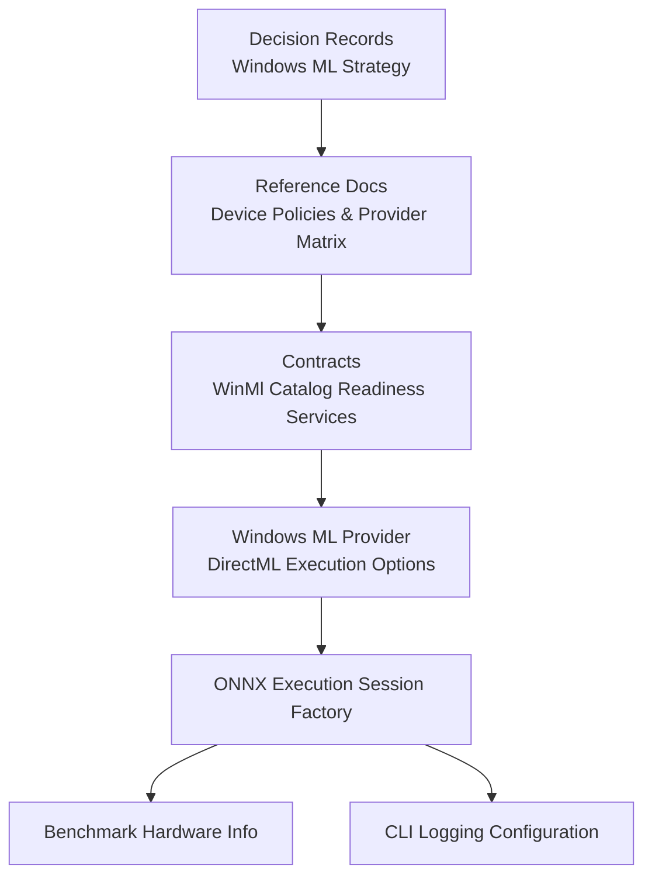
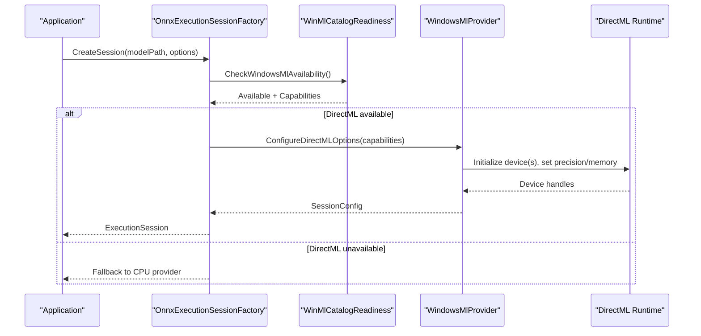
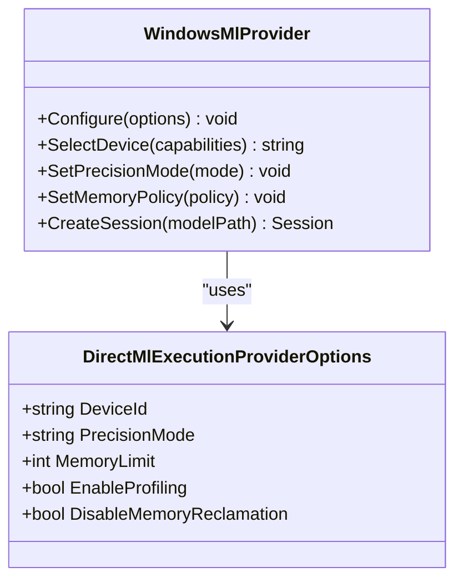
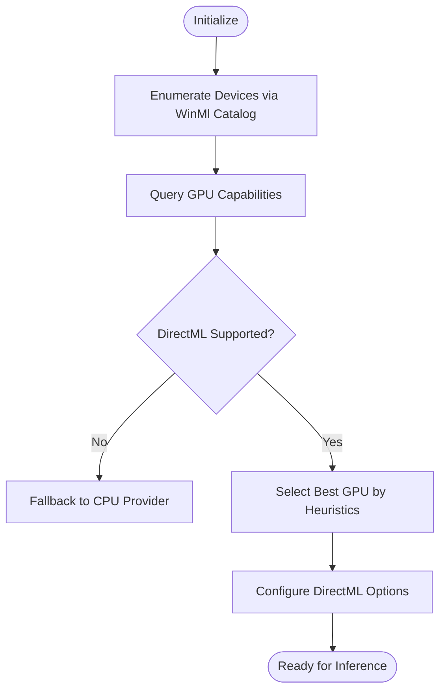
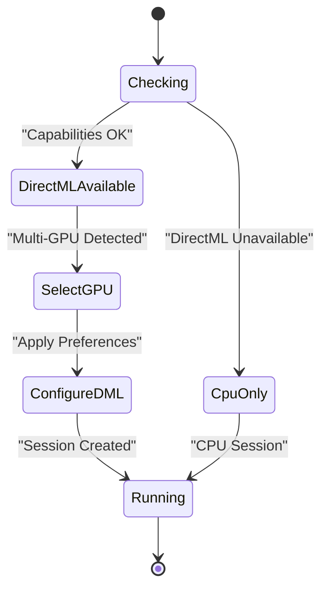
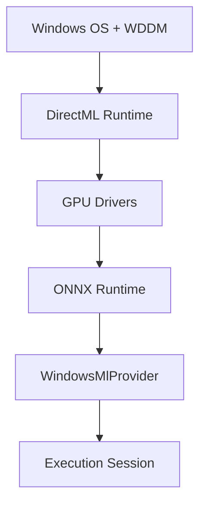

# DirectML Configuration

<cite>
**Referenced Files in This Document**
- [ADR-0001-winui3-windows-ml.md](file://docs/decisions/ADR-0001-winui3-windows-ml.md)
- [ADR-0002-windows-ml-provider-strategy.md](file://docs/decisions/ADR-0002-windows-ml-provider-strategy.md)
- [windows-ml-phase-3-device-policies.md](file://docs/reference/windows-ml-phase-3-device-policies.md)
- [windows-ml-stage-provider-matrix.md](file://docs/reference/windows-ml-stage-provider-matrix.md)
- [WinMlCatalogRuntimeReadinessServices.cs](file://src/Trackdub.Contracts/WinMlCatalogRuntimeReadinessServices.cs)
- [WindowsMlProvider.cs](file://src/Trackdub.Inference.Onnx/WindowsMl/WindowsMlProvider.cs)
- [DirectMlExecutionProviderOptions.cs](file://src/Trackdub.Inference.Onnx/ExecutionProviders/DirectMlExecutionProviderOptions.cs)
- [OnnxExecutionSessionFactory.cs](file://src/Trackdub.Inference.Onnx/OnnxExecutionSessionFactory.cs)
- [BenchmarkHardwareInfo.cs](file://src/Trackdub.Benchmarks/BenchmarkHardwareInfo.cs)
- [CliLoggingConfiguration.cs](file://src/Trackdub.Cli/CliLoggingConfiguration.cs)
</cite>

## Table of Contents
1. [Introduction](#introduction)
2. [Project Structure](#project-structure)
3. [Core Components](#core-components)
4. [Architecture Overview](#architecture-overview)
5. [Detailed Component Analysis](#detailed-component-analysis)
6. [Dependency Analysis](#dependency-analysis)
7. [Performance Considerations](#performance-considerations)
8. [Troubleshooting Guide](#troubleshooting-guide)
9. [Conclusion](#conclusion)
10. [Appendices](#appendices)

## Introduction
This document provides comprehensive guidance for enabling and configuring DirectML GPU acceleration on Windows platforms within the project’s ONNX Runtime execution provider ecosystem. It covers installation prerequisites, Windows version compatibility, graphics driver requirements, device enumeration and capability detection, multi-GPU selection strategies, CPU fallback behavior, performance tuning, memory management policies, precision options, integration with the Windows Graphics Driver Model and DirectX runtimes, and diagnostics/logging for troubleshooting initialization failures and driver compatibility issues.

## Project Structure
The DirectML configuration spans decision records, reference guides, contracts for runtime readiness, and concrete ONNX Runtime execution provider implementations:
- Decision records define strategy and constraints for Windows ML providers.
- Reference documents outline device policies and stage/provider matrices.
- Contracts expose readiness services to detect and validate Windows ML runtime availability.
- The Windows ML provider implementation configures DirectML execution options and integrates with ONNX Runtime.
- Factory classes orchestrate session creation and provider selection.
- Benchmark utilities capture hardware capabilities for informed decisions.
- CLI logging configuration enables detailed diagnostics.

**Diagram sources**
- [ADR-0002-windows-ml-provider-strategy.md](file://docs/decisions/ADR-0002-windows-ml-provider-strategy.md)
- [windows-ml-stage-provider-matrix.md](file://docs/reference/windows-ml-stage-provider-matrix.md)
- [WinMlCatalogRuntimeReadinessServices.cs](file://src/Trackdub.Contracts/WinMlCatalogRuntimeReadinessServices.cs)
- [WindowsMlProvider.cs](file://src/Trackdub.Inference.Onnx/WindowsMl/WindowsMlProvider.cs)
- [OnnxExecutionSessionFactory.cs](file://src/Trackdub.Inference.Onnx/OnnxExecutionSessionFactory.cs)
- [BenchmarkHardwareInfo.cs](file://src/Trackdub.Benchmarks/BenchmarkHardwareInfo.cs)
- [CliLoggingConfiguration.cs](file://src/Trackdub.Cli/CliLoggingConfiguration.cs)

**Section sources**
- [ADR-0001-winui3-windows-ml.md](file://docs/decisions/ADR-0001-winui3-windows-ml.md)
- [ADR-0002-windows-ml-provider-strategy.md](file://docs/decisions/ADR-0002-windows-ml-provider-strategy.md)
- [windows-ml-phase-3-device-policies.md](file://docs/reference/windows-ml-phase-3-device-policies.md)
- [windows-ml-stage-provider-matrix.md](file://docs/reference/windows-ml-stage-provider-matrix.md)

## Core Components
- Windows ML Provider: Configures DirectML execution options, selects devices, and manages precision/memory settings.
- WinMl Catalog Readiness Services: Detects Windows ML runtime presence and capability levels.
- ONNX Execution Session Factory: Orchestrates provider selection, session creation, and fallback logic.
- Benchmark Hardware Info: Captures GPU architecture, memory, and compute features to inform provider selection.
- CLI Logging Configuration: Enables structured logs for DirectML initialization and runtime diagnostics.

Key responsibilities:
- Device enumeration and capability detection via Windows ML catalog APIs.
- Multi-GPU selection based on performance heuristics and user preferences.
- Fallback to CPU when DirectML is unavailable or unsupported.
- Precision tuning (FP32/FP16) and memory budgeting aligned with model needs.
- Integration with Windows Graphics Driver Model and DirectX components.

**Section sources**
- [WindowsMlProvider.cs](file://src/Trackdub.Inference.Onnx/WindowsMl/WindowsMlProvider.cs)
- [WinMlCatalogRuntimeReadinessServices.cs](file://src/Trackdub.Contracts/WinMlCatalogRuntimeReadinessServices.cs)
- [OnnxExecutionSessionFactory.cs](file://src/Trackdub.Inference.Onnx/OnnxExecutionSessionFactory.cs)
- [BenchmarkHardwareInfo.cs](file://src/Trackdub.Benchmarks/BenchmarkHardwareInfo.cs)
- [CliLoggingConfiguration.cs](file://src/Trackdub.Cli/CliLoggingConfiguration.cs)

## Architecture Overview
The DirectML pipeline integrates ONNX Runtime with Windows ML through a provider abstraction. The factory selects the appropriate execution provider based on readiness checks and hardware capabilities, then constructs an execution session with configured DirectML options.

**Diagram sources**
- [OnnxExecutionSessionFactory.cs](file://src/Trackdub.Inference.Onnx/OnnxExecutionSessionFactory.cs)
- [WinMlCatalogRuntimeReadinessServices.cs](file://src/Trackdub.Contracts/WinMlCatalogRuntimeReadinessServices.cs)
- [WindowsMlProvider.cs](file://src/Trackdub.Inference.Onnx/WindowsMl/WindowsMlProvider.cs)

## Detailed Component Analysis

### Windows ML Provider and DirectML Execution Options
The Windows ML provider encapsulates DirectML-specific configuration, including device selection, precision modes, and memory policies. It translates high-level options into ONNX Runtime execution provider parameters.

**Diagram sources**
- [WindowsMlProvider.cs](file://src/Trackdub.Inference.Onnx/WindowsMl/WindowsMlProvider.cs)
- [DirectMlExecutionProviderOptions.cs](file://src/Trackdub.Inference.Onnx/ExecutionProviders/DirectMlExecutionProviderOptions.cs)

**Section sources**
- [WindowsMlProvider.cs](file://src/Trackdub.Inference.Onnx/WindowsMl/WindowsMlProvider.cs)
- [DirectMlExecutionProviderOptions.cs](file://src/Trackdub.Inference.Onnx/ExecutionProviders/DirectMlExecutionProviderOptions.cs)

### Device Enumeration and Capability Detection
Capability detection leverages Windows ML catalog services to enumerate GPUs, query supported features, and determine optimal execution paths.

**Diagram sources**
- [WinMlCatalogRuntimeReadinessServices.cs](file://src/Trackdub.Contracts/WinMlCatalogRuntimeReadinessServices.cs)
- [BenchmarkHardwareInfo.cs](file://src/Trackdub.Benchmarks/BenchmarkHardwareInfo.cs)

**Section sources**
- [WinMlCatalogRuntimeReadinessServices.cs](file://src/Trackdub.Contracts/WinMlCatalogRuntimeReadinessServices.cs)
- [BenchmarkHardwareInfo.cs](file://src/Trackdub.Benchmarks/BenchmarkHardwareInfo.cs)

### Multi-GPU Selection Strategies and CPU Fallback
Selection strategies prioritize performance while ensuring stability. If DirectML fails or is unsupported, the system falls back to CPU execution seamlessly.

**Diagram sources**
- [OnnxExecutionSessionFactory.cs](file://src/Trackdub.Inference.Onnx/OnnxExecutionSessionFactory.cs)
- [windows-ml-phase-3-device-policies.md](file://docs/reference/windows-ml-phase-3-device-policies.md)

**Section sources**
- [OnnxExecutionSessionFactory.cs](file://src/Trackdub.Inference.Onnx/OnnxExecutionSessionFactory.cs)
- [windows-ml-phase-3-device-policies.md](file://docs/reference/windows-ml-phase-3-device-policies.md)

### Performance Optimization Settings
Optimization knobs include precision mode selection (FP32/FP16), memory limits, profiling toggles, and memory reclamation policies. These are tuned based on model characteristics and hardware capabilities.

Key considerations:
- FP16 for speed on compatible GPUs; FP32 for numerical stability.
- Memory limits to prevent OOM on constrained systems.
- Profiling for bottleneck identification during development.
- Memory reclamation to balance throughput vs. latency.

**Section sources**
- [DirectMlExecutionProviderOptions.cs](file://src/Trackdub.Inference.Onnx/ExecutionProviders/DirectMlExecutionProviderOptions.cs)
- [windows-ml-stage-provider-matrix.md](file://docs/reference/windows-ml-stage-provider-matrix.md)

### Integration with Windows Graphics Driver Model and DirectX
DirectML integrates with the Windows Graphics Driver Model (WDDM) and DirectX runtimes. Compatibility depends on WDDM version, DirectX feature levels, and driver support for DirectML operations.

Prerequisites:
- Windows 10/11 with updated WDDM.
- DirectX 12-capable GPU with latest drivers.
- DirectML runtime installed via Windows Update or SDK.

**Section sources**
- [ADR-0001-winui3-windows-ml.md](file://docs/decisions/ADR-0001-winui3-windows-ml.md)
- [windows-ml-phase-3-device-policies.md](file://docs/reference/windows-ml-phase-3-device-policies.md)

## Dependency Analysis
DirectML configuration depends on Windows ML runtime availability, GPU capabilities, and ONNX Runtime provider interfaces. The factory orchestrates these dependencies to ensure robust session creation.

**Diagram sources**
- [OnnxExecutionSessionFactory.cs](file://src/Trackdub.Inference.Onnx/OnnxExecutionSessionFactory.cs)
- [WindowsMlProvider.cs](file://src/Trackdub.Inference.Onnx/WindowsMl/WindowsMlProvider.cs)

**Section sources**
- [OnnxExecutionSessionFactory.cs](file://src/Trackdub.Inference.Onnx/OnnxExecutionSessionFactory.cs)
- [WindowsMlProvider.cs](file://src/Trackdub.Inference.Onnx/WindowsMl/WindowsMlProvider.cs)

## Performance Considerations
- Prefer FP16 on modern GPUs for improved throughput.
- Tune memory limits based on model size and available VRAM.
- Use profiling to identify kernel bottlenecks and optimize input shapes.
- Avoid excessive memory reclamation in latency-sensitive scenarios.
- Monitor GPU utilization and temperature under load.

[No sources needed since this section provides general guidance]

## Troubleshooting Guide
Common issues and resolutions:
- Initialization failures: Verify DirectML runtime installation and driver updates.
- Driver compatibility: Ensure WDDM and DirectX versions meet minimum requirements.
- Hardware support verification: Use benchmark tools to confirm GPU capabilities.
- Logging configuration: Enable detailed logs to trace provider selection and errors.

Diagnostic steps:
- Check Windows ML catalog readiness services for capability reports.
- Review CLI logs for provider initialization sequences.
- Validate GPU driver versions and DirectX feature levels.
- Test with CPU-only mode to isolate GPU-related issues.

**Section sources**
- [CliLoggingConfiguration.cs](file://src/Trackdub.Cli/CliLoggingConfiguration.cs)
- [WinMlCatalogRuntimeReadinessServices.cs](file://src/Trackdub.Contracts/WinMlCatalogRuntimeReadinessServices.cs)
- [BenchmarkHardwareInfo.cs](file://src/Trackdub.Benchmarks/BenchmarkHardwareInfo.cs)

## Conclusion
DirectML GPU acceleration on Windows requires careful configuration of execution providers, device selection, and performance tuning. By leveraging Windows ML catalog services and ONNX Runtime abstractions, the system ensures robust operation across diverse hardware configurations. Proper diagnostics and logging enable effective troubleshooting and optimization.

[No sources needed since this section summarizes without analyzing specific files]

## Appendices
- Installation checklist for DirectML runtime and drivers.
- Command-line flags for enabling verbose logging.
- Sample configuration profiles for different GPU tiers.

[No sources needed since this section provides supplementary information]