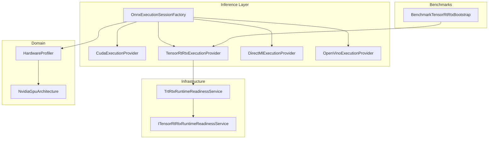
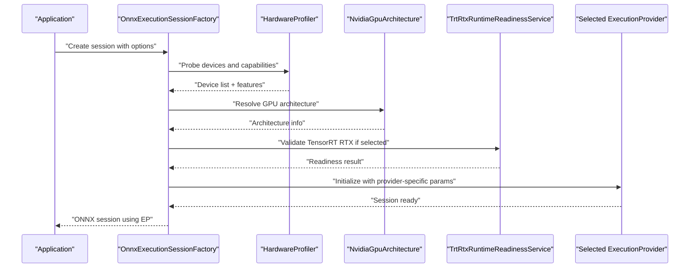
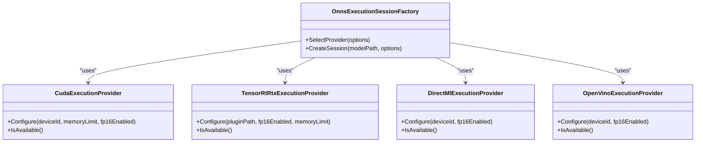
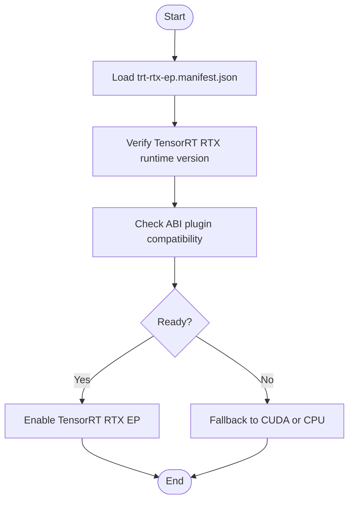
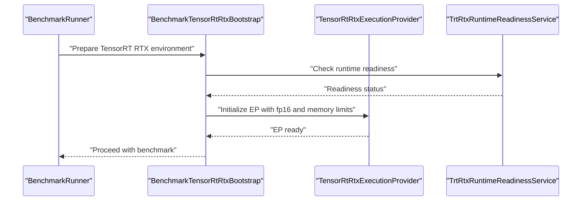
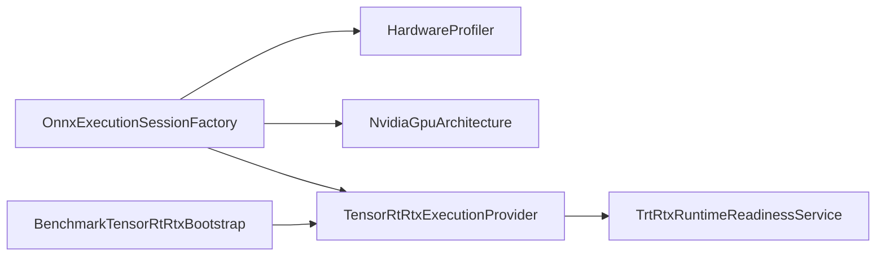

# GPU Acceleration Setup

<cite>
**Referenced Files in This Document**
- [Trackdub.Inference.Onnx/ExecutionProviders/CudaExecutionProvider.cs](file://src/Trackdub.Inference.Onnx/ExecutionProviders/CudaExecutionProvider.cs)
- [Trackdub.Inference.Onnx/ExecutionProviders/TensorRtRtxExecutionProvider.cs](file://src/Trackdub.Inference.Onnx/ExecutionProviders/TensorRtRtxExecutionProvider.cs)
- [Trackdub.Inference.Onnx/ExecutionProviders/DirectMlExecutionProvider.cs](file://src/Trackdub.Inference.Onnx/ExecutionProviders/DirectMlExecutionProvider.cs)
- [Trackdub.Inference.Onnx/OpenVino/OpenVinoExecutionProvider.cs](file://src/Trackdub.Inference.Onnx/OpenVino/OpenVinoExecutionProvider.cs)
- [Trackdub.Inference.Onnx/OnnxExecutionSessionFactory.cs](file://src/Trackdub.Inference.Onnx/OnnxExecutionSessionFactory.cs)
- [Trackdub.Infrastructure/Runtime/TrtRtxEp/TrtRtxRuntimeReadinessService.cs](file://src/Trackdub.Infrastructure/Runtime/TrtRtxEp/TrtRtxRuntimeReadinessService.cs)
- [Trackdub.Contracts/ITensorRtRtxRuntimeReadinessService.cs](file://src/Trackdub.Contracts/ITensorRtRtxRuntimeReadinessService.cs)
- [Trackdub.Domain/HardwareProfiler.cs](file://src/Trackdub.Domain/HardwareProfiler.cs)
- [Trackdub.Domain/NvidiaGpuArchitecture.cs](file://src/Trackdub.Domain/NvidiaGpuArchitecture.cs)
- [Trackdub.Benchmarks/BenchmarkTensorRtRtxBootstrap.cs](file://src/Trackdub.Benchmarks/BenchmarkTensorRtRtxBootstrap.cs)
- [runtime/trt-rtx-ep.manifest.json](file://runtime/trt-rtx-ep.manifest.json)
- [docs/reference/tensorrt-rtx-ep-abi-plugin.md](file://docs/reference/tensorrt-rtx-ep-abi-plugin.md)
- [docs/decisions/ADR-0009-gpu-memory-budget-planner.md](file://docs/decisions/ADR-0009-gpu-memory-budget-planner.md)
</cite>

## Table of Contents
1. [Introduction](#introduction)
2. [Project Structure](#project-structure)
3. [Core Components](#core-components)
4. [Architecture Overview](#architecture-overview)
5. [Detailed Component Analysis](#detailed-component-analysis)
6. [Dependency Analysis](#dependency-analysis)
7. [Performance Considerations](#performance-considerations)
8. [Troubleshooting Guide](#troubleshooting-guide)
9. [Conclusion](#conclusion)
10. [Appendices](#appendices)

## Introduction
This document explains how Trackdub discovers, configures, and uses GPU acceleration across multiple execution providers (EPs), including CUDA, TensorRT RTX, DirectML, OpenVINO, and others. It covers installation prerequisites per vendor, automatic provider discovery, manual overrides, memory management, batch sizing, precision settings (FP32, FP16, INT8), performance tuning, and troubleshooting for common setup issues.

## Project Structure
GPU acceleration is implemented primarily under the ONNX runtime integration layer and infrastructure readiness services:
- Execution provider implementations live in the ONNX inference module.
- Runtime readiness checks are provided by infrastructure services.
- Hardware profiling and architecture detection are handled in domain services.
- Benchmarks include a bootstrap helper for TensorRT RTX validation.
- A manifest file documents TensorRT RTX EP packaging.
- Reference docs describe ABI/plugin details for TensorRT RTX.

**Diagram sources**
- [Trackdub.Inference.Onnx/OnnxExecutionSessionFactory.cs](file://src/Trackdub.Inference.Onnx/OnnxExecutionSessionFactory.cs)
- [Trackdub.Inference.Onnx/ExecutionProviders/CudaExecutionProvider.cs](file://src/Trackdub.Inference.Onnx/ExecutionProviders/CudaExecutionProvider.cs)
- [Trackdub.Inference.Onnx/ExecutionProviders/TensorRtRtxExecutionProvider.cs](file://src/Trackdub.Inference.Onnx/ExecutionProviders/TensorRtRtxExecutionProvider.cs)
- [Trackdub.Inference.Onnx/ExecutionProviders/DirectMlExecutionProvider.cs](file://src/Trackdub.Inference.Onnx/ExecutionProviders/DirectMlExecutionProvider.cs)
- [Trackdub.Inference.Onnx/OpenVino/OpenVinoExecutionProvider.cs](file://src/Trackdub.Inference.Onnx/OpenVino/OpenVinoExecutionProvider.cs)
- [Trackdub.Infrastructure/Runtime/TrtRtxEp/TrtRtxRuntimeReadinessService.cs](file://src/Trackdub.Infrastructure/Runtime/TrtRtxEp/TrtRtxRuntimeReadinessService.cs)
- [Trackdub.Contracts/ITensorRtRtxRuntimeReadinessService.cs](file://src/Trackdub.Contracts/ITensorRtRtxRuntimeReadinessService.cs)
- [Trackdub.Domain/HardwareProfiler.cs](file://src/Trackdub.Domain/HardwareProfiler.cs)
- [Trackdub.Domain/NvidiaGpuArchitecture.cs](file://src/Trackdub.Domain/NvidiaGpuArchitecture.cs)
- [Trackdub.Benchmarks/BenchmarkTensorRtRtxBootstrap.cs](file://src/Trackdub.Benchmarks/BenchmarkTensorRtRtxBootstrap.cs)

**Section sources**
- [Trackdub.Inference.Onnx/OnnxExecutionSessionFactory.cs](file://src/Trackdub.Inference.Onnx/OnnxExecutionSessionFactory.cs)
- [Trackdub.Infrastructure/Runtime/TrtRtxEp/TrtRtxRuntimeReadinessService.cs](file://src/Trackdub.Infrastructure/Runtime/TrtRtxEp/TrtRtxRuntimeReadinessService.cs)
- [Trackdub.Domain/HardwareProfiler.cs](file://src/Trackdub.Domain/HardwareProfiler.cs)
- [Trackdub.Domain/NvidiaGpuArchitecture.cs](file://src/Trackdub.Domain/NvidiaGpuArchitecture.cs)
- [Trackdub.Benchmarks/BenchmarkTensorRtRtxBootstrap.cs](file://src/Trackdub.Benchmarks/BenchmarkTensorRtRtxBootstrap.cs)

## Core Components
- OnnxExecutionSessionFactory: Orchestrates EP selection based on environment availability and configuration.
- CudaExecutionProvider: Configures CUDA-based execution with device and memory options.
- TensorRtRtxExecutionProvider: Wraps TensorRT RTX EP with plugin and ABI handling.
- DirectMlExecutionProvider: Provides Windows ML GPU acceleration via DirectML.
- OpenVinoExecutionProvider: Enables OpenVINO GPU/NPU backends.
- TrtRtxRuntimeReadinessService: Validates TensorRT RTX runtime presence and compatibility.
- HardwareProfiler and NvidiaGpuArchitecture: Detect hardware capabilities and GPU architecture to guide EP selection and optimization.

Key responsibilities:
- Automatic discovery of available EPs at runtime.
- Manual override via configuration or environment variables.
- Provider-specific initialization parameters (device IDs, memory limits, precision).
- Readiness checks before use to fail fast on missing dependencies.

**Section sources**
- [Trackdub.Inference.Onnx/OnnxExecutionSessionFactory.cs](file://src/Trackdub.Inference.Onnx/OnnxExecutionSessionFactory.cs)
- [Trackdub.Inference.Onnx/ExecutionProviders/CudaExecutionProvider.cs](file://src/Trackdub.Inference.Onnx/ExecutionProviders/CudaExecutionProvider.cs)
- [Trackdub.Inference.Onnx/ExecutionProviders/TensorRtRtxExecutionProvider.cs](file://src/Trackdub.Inference.Onnx/ExecutionProviders/TensorRtRtxExecutionProvider.cs)
- [Trackdub.Inference.Onnx/ExecutionProviders/DirectMlExecutionProvider.cs](file://src/Trackdub.Inference.Onnx/ExecutionProviders/DirectMlExecutionProvider.cs)
- [Trackdub.Inference.Onnx/OpenVino/OpenVinoExecutionProvider.cs](file://src/Trackdub.Inference.Onnx/OpenVino/OpenVinoExecutionProvider.cs)
- [Trackdub.Infrastructure/Runtime/TrtRtxEp/TrtRtxRuntimeReadinessService.cs](file://src/Trackdub.Infrastructure/Runtime/TrtRtxEp/TrtRtxRuntimeReadinessService.cs)
- [Trackdub.Contracts/ITensorRtRtxRuntimeReadinessService.cs](file://src/Trackdub.Contracts/ITensorRtRtxRuntimeReadinessService.cs)
- [Trackdub.Domain/HardwareProfiler.cs](file://src/Trackdub.Domain/HardwareProfiler.cs)
- [Trackdub.Domain/NvidiaGpuArchitecture.cs](file://src/Trackdub.Domain/NvidiaGpuArchitecture.cs)

## Architecture Overview
The EP selection flow combines hardware probing, runtime readiness, and user preferences to choose the best available backend.

**Diagram sources**
- [Trackdub.Inference.Onnx/OnnxExecutionSessionFactory.cs](file://src/Trackdub.Inference.Onnx/OnnxExecutionSessionFactory.cs)
- [Trackdub.Domain/HardwareProfiler.cs](file://src/Trackdub.Domain/HardwareProfiler.cs)
- [Trackdub.Domain/NvidiaGpuArchitecture.cs](file://src/Trackdub.Domain/NvidiaGpuArchitecture.cs)
- [Trackdub.Infrastructure/Runtime/TrtRtxEp/TrtRtxRuntimeReadinessService.cs](file://src/Trackdub.Infrastructure/Runtime/TrtRtxEp/TrtRtxRuntimeReadinessService.cs)

## Detailed Component Analysis

### Execution Provider Implementations
Each EP class encapsulates provider-specific initialization, parameterization, and fallback behavior. The factory composes these into a coherent selection strategy.

**Diagram sources**
- [Trackdub.Inference.Onnx/OnnxExecutionSessionFactory.cs](file://src/Trackdub.Inference.Onnx/OnnxExecutionSessionFactory.cs)
- [Trackdub.Inference.Onnx/ExecutionProviders/CudaExecutionProvider.cs](file://src/Trackdub.Inference.Onnx/ExecutionProviders/CudaExecutionProvider.cs)
- [Trackdub.Inference.Onnx/ExecutionProviders/TensorRtRtxExecutionProvider.cs](file://src/Trackdub.Inference.Onnx/ExecutionProviders/TensorRtRtxExecutionProvider.cs)
- [Trackdub.Inference.Onnx/ExecutionProviders/DirectMlExecutionProvider.cs](file://src/Trackdub.Inference.Onnx/ExecutionProviders/DirectMlExecutionProvider.cs)
- [Trackdub.Inference.Onnx/OpenVino/OpenVinoExecutionProvider.cs](file://src/Trackdub.Inference.Onnx/OpenVino/OpenVinoExecutionProvider.cs)

**Section sources**
- [Trackdub.Inference.Onnx/OnnxExecutionSessionFactory.cs](file://src/Trackdub.Inference.Onnx/OnnxExecutionSessionFactory.cs)
- [Trackdub.Inference.Onnx/ExecutionProviders/CudaExecutionProvider.cs](file://src/Trackdub.Inference.Onnx/ExecutionProviders/CudaExecutionProvider.cs)
- [Trackdub.Inference.Onnx/ExecutionProviders/TensorRtRtxExecutionProvider.cs](file://src/Trackdub.Inference.Onnx/ExecutionProviders/TensorRtRtxExecutionProvider.cs)
- [Trackdub.Inference.Onnx/ExecutionProviders/DirectMlExecutionProvider.cs](file://src/Trackdub.Inference.Onnx/ExecutionProviders/DirectMlExecutionProvider.cs)
- [Trackdub.Inference.Onnx/OpenVino/OpenVinoExecutionProvider.cs](file://src/Trackdub.Inference.Onnx/OpenVino/OpenVinoExecutionProvider.cs)

### TensorRT RTX Readiness and ABI Plugin
TensorRT RTX requires a valid runtime and compatible ABI plugins. Trackdub validates this through a dedicated readiness service and references a manifest describing the bundled runtime.

**Diagram sources**
- [runtime/trt-rtx-ep.manifest.json](file://runtime/trt-rtx-ep.manifest.json)
- [Trackdub.Infrastructure/Runtime/TrtRtxEp/TrtRtxRuntimeReadinessService.cs](file://src/Trackdub.Infrastructure/Runtime/TrtRtxEp/TrtRtxRuntimeReadinessService.cs)
- [docs/reference/tensorrt-rtx-ep-abi-plugin.md](file://docs/reference/tensorrt-rtx-ep-abi-plugin.md)

**Section sources**
- [runtime/trt-rtx-ep.manifest.json](file://runtime/trt-rtx-ep.manifest.json)
- [Trackdub.Infrastructure/Runtime/TrtRtxEp/TrtRtxRuntimeReadinessService.cs](file://src/Trackdub.Infrastructure/Runtime/TrtRtxEp/TrtRtxRuntimeReadinessService.cs)
- [docs/reference/tensorrt-rtx-ep-abi-plugin.md](file://docs/reference/tensorrt-rtx-ep-abi-plugin.md)

### Benchmark Bootstrap for TensorRT RTX
A benchmark helper initializes and validates TensorRT RTX EP usage during performance testing, ensuring that runtime and plugins are correctly configured before running benchmarks.

**Diagram sources**
- [Trackdub.Benchmarks/BenchmarkTensorRtRtxBootstrap.cs](file://src/Trackdub.Benchmarks/BenchmarkTensorRtRtxBootstrap.cs)
- [Trackdub.Inference.Onnx/ExecutionProviders/TensorRtRtxExecutionProvider.cs](file://src/Trackdub.Inference.Onnx/ExecutionProviders/TensorRtRtxExecutionProvider.cs)
- [Trackdub.Infrastructure/Runtime/TrtRtxEp/TrtRtxRuntimeReadinessService.cs](file://src/Trackdub.Infrastructure/Runtime/TrtRtxEp/TrtRtxRuntimeReadinessService.cs)

**Section sources**
- [Trackdub.Benchmarks/BenchmarkTensorRtRtxBootstrap.cs](file://src/Trackdub.Benchmarks/BenchmarkTensorRtRtxBootstrap.cs)

## Dependency Analysis
- EP selection depends on hardware profiler outputs and architecture resolution.
- TensorRT RTX EP depends on runtime readiness validation and ABI plugin availability.
- Benchmarks depend on EP initialization helpers to validate environment.

**Diagram sources**
- [Trackdub.Inference.Onnx/OnnxExecutionSessionFactory.cs](file://src/Trackdub.Inference.Onnx/OnnxExecutionSessionFactory.cs)
- [Trackdub.Domain/HardwareProfiler.cs](file://src/Trackdub.Domain/HardwareProfiler.cs)
- [Trackdub.Domain/NvidiaGpuArchitecture.cs](file://src/Trackdub.Domain/NvidiaGpuArchitecture.cs)
- [Trackdub.Inference.Onnx/ExecutionProviders/TensorRtRtxExecutionProvider.cs](file://src/Trackdub.Inference.Onnx/ExecutionProviders/TensorRtRtxExecutionProvider.cs)
- [Trackdub.Infrastructure/Runtime/TrtRtxEp/TrtRtxRuntimeReadinessService.cs](file://src/Trackdub.Infrastructure/Runtime/TrtRtxEp/TrtRtxRuntimeReadinessService.cs)
- [Trackdub.Benchmarks/BenchmarkTensorRtRtxBootstrap.cs](file://src/Trackdub.Benchmarks/BenchmarkTensorRtRtxBootstrap.cs)

**Section sources**
- [Trackdub.Inference.Onnx/OnnxExecutionSessionFactory.cs](file://src/Trackdub.Inference.Onnx/OnnxExecutionSessionFactory.cs)
- [Trackdub.Domain/HardwareProfiler.cs](file://src/Trackdub.Domain/HardwareProfiler.cs)
- [Trackdub.Domain/NvidiaGpuArchitecture.cs](file://src/Trackdub.Domain/NvidiaGpuArchitecture.cs)
- [Trackdub.Inference.Onnx/ExecutionProviders/TensorRtRtxExecutionProvider.cs](file://src/Trackdub.Inference.Onnx/ExecutionProviders/TensorRtRtxExecutionProvider.cs)
- [Trackdub.Infrastructure/Runtime/TrtRtxEp/TrtRtxRuntimeReadinessService.cs](file://src/Trackdub.Infrastructure/Runtime/TrtRtxEp/TrtRtxRuntimeReadinessService.cs)
- [Trackdub.Benchmarks/BenchmarkTensorRtRtxBootstrap.cs](file://src/Trackdub.Benchmarks/BenchmarkTensorRtRtxBootstrap.cs)

## Performance Considerations
- Precision settings:
  - FP32 provides maximum accuracy; suitable when numerical stability is critical.
  - FP16 improves throughput on supported GPUs; ensure model ops are compatible.
  - INT8 offers further speedups but may require quantized models or calibration data.
- Batch size optimization:
  - Increase batch size to improve GPU utilization while monitoring memory pressure.
  - Use dynamic batching where supported by the EP and model.
- Memory management:
  - Set explicit memory limits per EP to avoid out-of-memory errors.
  - Prefer streaming inputs and releasing intermediate buffers promptly.
- Thermal throttling:
  - Monitor GPU temperatures; reduce workload intensity if throttling occurs.
  - Ensure adequate cooling and airflow in deployment environments.
- Tuning parameters:
  - Adjust EP-specific options such as workspace size, graph optimization level, and caching policies.
  - Profile with benchmarks to identify bottlenecks and validate improvements.

[No sources needed since this section provides general guidance]

## Troubleshooting Guide
Common issues and resolutions:
- Missing or incompatible drivers:
  - Verify GPU driver versions meet EP requirements.
  - Reinstall or update drivers to resolve conflicts.
- Runtime not found:
  - Ensure CUDA, TensorRT RTX, DirectML, or OpenVINO runtimes are installed and discoverable.
  - Check PATH and environment variables for library paths.
- ABI plugin mismatch (TensorRT RTX):
  - Confirm plugin version matches runtime expectations per manifest.
  - Replace or rebuild plugins as needed.
- Out-of-memory errors:
  - Reduce batch size or model precision.
  - Lower EP memory limits and enable memory cleanup strategies.
- Provider selection fallback:
  - If preferred EP fails readiness checks, verify logs and switch to a compatible EP.
- Benchmark failures:
  - Use the TensorRT RTX bootstrap to isolate environment issues before running full benchmarks.

**Section sources**
- [Trackdub.Infrastructure/Runtime/TrtRtxEp/TrtRtxRuntimeReadinessService.cs](file://src/Trackdub.Infrastructure/Runtime/TrtRtxEp/TrtRtxRuntimeReadinessService.cs)
- [Trackdub.Benchmarks/BenchmarkTensorRtRtxBootstrap.cs](file://src/Trackdub.Benchmarks/BenchmarkTensorRtRtxBootstrap.cs)

## Conclusion
Trackdub’s GPU acceleration framework integrates multiple execution providers with robust discovery, readiness validation, and configuration mechanisms. By leveraging hardware profiling, architecture detection, and provider-specific optimizations, it delivers high-performance inference across CUDA, TensorRT RTX, DirectML, and OpenVINO. Proper installation, configuration, and tuning ensure reliable and efficient GPU utilization.

[No sources needed since this section summarizes without analyzing specific files]

## Appendices

### Installation Requirements by Vendor
- CUDA:
  - Install NVIDIA GPU driver compatible with your GPU.
  - Install CUDA toolkit and cuDNN matching the required versions.
  - Ensure libraries are discoverable by the application.
- TensorRT RTX:
  - Install NVIDIA GPU driver and CUDA runtime.
  - Install TensorRT RTX runtime and ABI plugins as described in the manifest.
  - Validate readiness using the provided service.
- DirectML:
  - Ensure Windows is up to date and GPU drivers support DirectML.
  - No additional runtime installation is typically required.
- OpenVINO:
  - Install OpenVINO runtime and GPU drivers for Intel integrated/discrete GPUs.
  - Configure device IDs and precision settings as needed.

[No sources needed since this section provides general guidance]

### Automatic Provider Discovery and Manual Overrides
- Automatic discovery:
  - The factory probes hardware and runtime availability to select the best EP.
  - Readiness services validate EP prerequisites before use.
- Manual overrides:
  - Specify preferred EP via configuration or environment variables.
  - Override device IDs and precision settings per EP.

[No sources needed since this section provides general guidance]

### GPU Memory Management and Batch Size Optimization
- Set memory limits per EP to prevent OOM conditions.
- Tune batch sizes based on model size and GPU capacity.
- Use streaming and buffer reuse to minimize memory overhead.

[No sources needed since this section provides general guidance]

### Precision Settings (FP32, FP16, INT8)
- Choose FP32 for maximum accuracy.
- Enable FP16 for improved performance on supported GPUs.
- Use INT8 with quantized models or calibration pipelines for maximum throughput.

[No sources needed since this section provides general guidance]

### Performance Tuning Parameters and Thermal Throttling
- Adjust EP-specific parameters like workspace size and optimization levels.
- Monitor GPU temperatures and adjust workloads to avoid throttling.
- Profile with benchmarks to validate tuning effectiveness.

[No sources needed since this section provides general guidance]

### Step-by-Step Setup Instructions
- Windows:
  - Install NVIDIA drivers and CUDA toolkit.
  - For TensorRT RTX, install runtime and ABI plugins per manifest.
  - Validate readiness and run benchmarks.
- Linux:
  - Install GPU drivers and CUDA/OpenVINO runtimes.
  - Configure environment variables for library discovery.
  - Validate readiness and run benchmarks.

[No sources needed since this section provides general guidance]