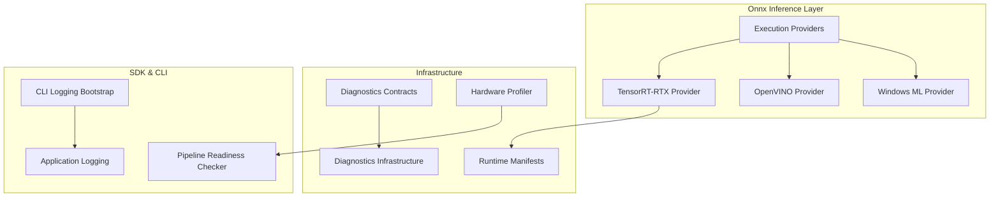
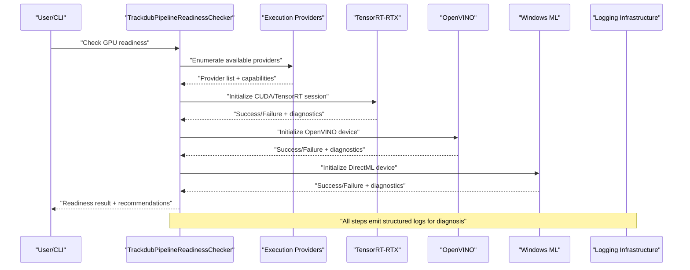
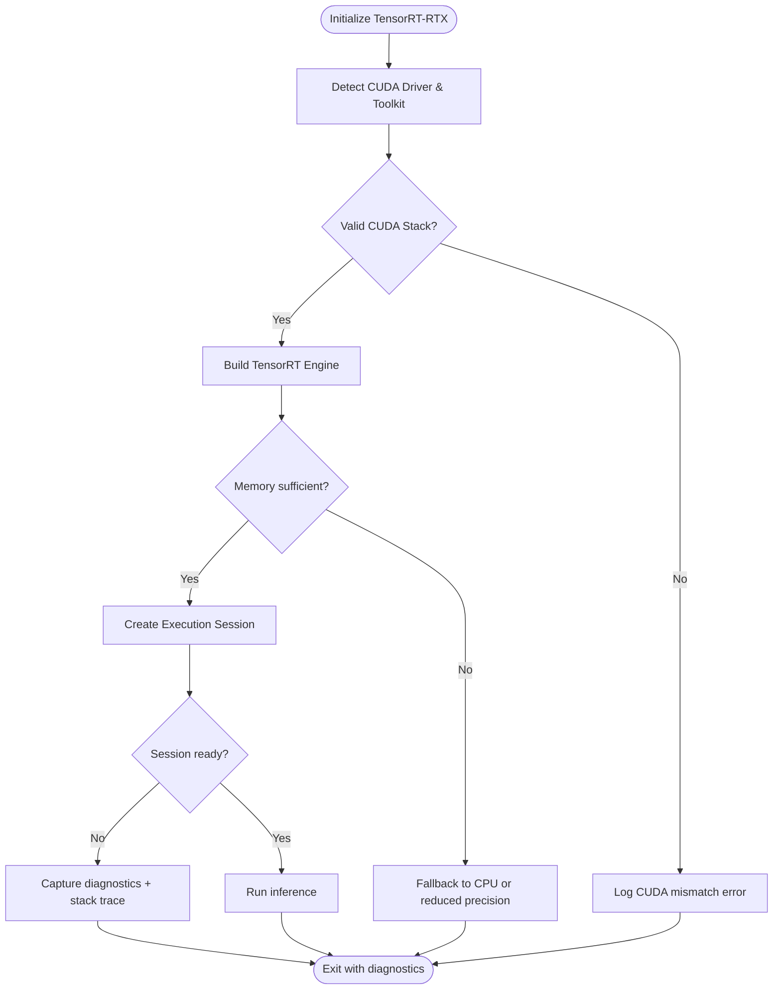
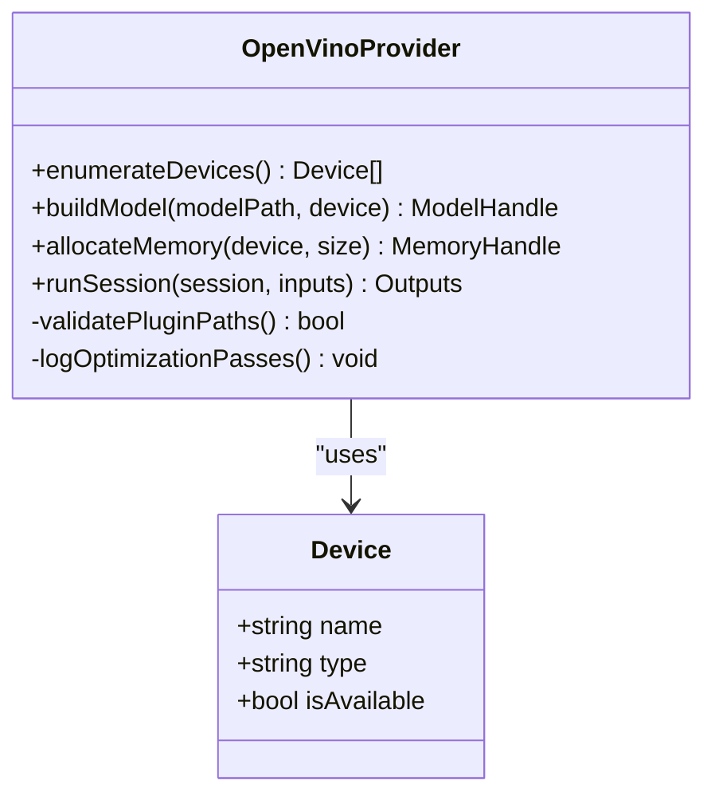
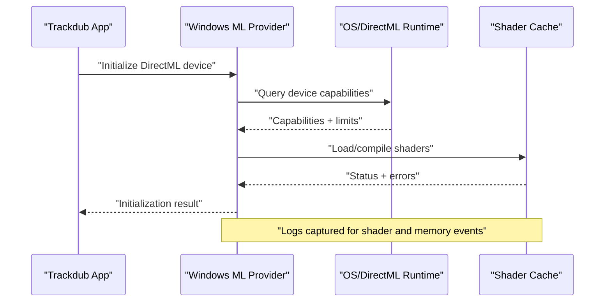
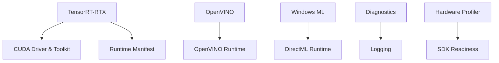

# GPU Troubleshooting & Diagnostics

<cite>
**Referenced Files in This Document**
- [Trackdub.Inference.Onnx/ExecutionProviders](file://src/Trackdub.Inference.Onnx/ExecutionProviders)
- [Trackdub.Inference.Onnx/TensorRtRtx](file://src/Trackdub.Inference.Onnx/TensorRtRtx)
- [Trackdub.Inference.Onnx/OpenVino](file://src/Trackdub.Inference.Onnx/OpenVino)
- [Trackdub.Inference.Onnx/WindowsMl](file://src/Trackdub.Inference.Onnx/WindowsMl)
- [Trackdub.Infrastructure/Runtime/TrtRtxEp](file://src/Trackdub.Infrastructure/Runtime/TrtRtxEp)
- [Trackdub.Contracts/Diagnostics](file://src/Trackdub.Contracts/Diagnostics)
- [Trackdub.Infrastructure/Diagnostics](file://src/Trackdub.Infrastructure/Diagnostics)
- [Trackdub.Benchmarks/BenchmarkHardwareInfo.cs](file://src/Trackdub.Benchmarks/BenchmarkHardwareInfo.cs)
- [Trackdub.Domain/HardwareProfiler.cs](file://src/Trackdub.Domain/HardwareProfiler.cs)
- [Trackdub.Domain/NvidiaGpuArchitecture.cs](file://src/Trackdub.Domain/NvidiaGpuArchitecture.cs)
- [Trackdub.Sdk/TrackdubPipelineReadinessChecker.cs](file://src/Trackdub.Sdk/TrackdubPipelineReadinessChecker.cs)
- [Trackdub.Cli/CliLoggingBootstrap.cs](file://src/Trackdub.Cli/CliLoggingBootstrap.cs)
- [Trackdub.Application/Logging](file://src/Trackdub.Application/Logging)
- [runtime/trt-rtx-ep.manifest.json](file://runtime/trt-rtx-ep.manifest.json)
- [docs/architecture/ADR-0009-gpu-memory-budget-planner.md](file://docs/decisions/ADR-0009-gpu-memory-budget-planner.md)
- [docs/reference/tensorrt-rtx-ep-abI-plugin.md](file://docs/reference/tensorrt-rtx-ep-abI-plugin.md)
- [docs/reference/windows-ml-phase-4-closeout.md](file://docs/reference/windows-ml-phase-4-closeout.md)
- [docs/reference/windows-ml-stage-provider-matrix.md](file://docs/reference/windows-ml-stage-provider-matrix.md)
</cite>

## Table of Contents
1. [Introduction](#introduction)
2. [Project Structure](#project-structure)
3. [Core Components](#core-components)
4. [Architecture Overview](#architecture-overview)
5. [Detailed Component Analysis](#detailed-component-analysis)
6. [Dependency Analysis](#dependency-analysis)
7. [Performance Considerations](#performance-considerations)
8. [Troubleshooting Guide](#troubleshooting-guide)
9. [Conclusion](#conclusion)
10. [Appendices](#appendices)

## Introduction
This document provides comprehensive troubleshooting and diagnostics guidance for GPU acceleration issues in Trackdub, focusing on CUDA (via TensorRT-RTX), DirectML (via Windows ML), and OpenVINO providers. It covers common error messages, diagnostic tools, logging mechanisms, hardware compatibility checks, driver validation, step-by-step debugging workflows, thermal throttling mitigation, resource conflict resolution, recovery procedures for failed sessions/memory leaks/provider crashes, and log analysis techniques to identify GPU-related bottlenecks. Community resources and support channels are included for complex setup issues.

## Project Structure
Trackdub organizes GPU execution provider logic across dedicated modules under the Onnx runtime integration layer, with infrastructure support for runtime manifests and diagnostics. Key areas include:
- Execution providers and provider-specific implementations
- TensorRT-RTX bootstrap and manifest management
- OpenVINO provider configuration
- Windows ML (DirectML) provider integration
- Diagnostics contracts and infrastructure utilities
- Hardware profiling and readiness checking
- CLI logging bootstrap and application logging

**Diagram sources**
- [Trackdub.Inference.Onnx/ExecutionProviders](file://src/Trackdub.Inference.Onnx/ExecutionProviders)
- [Trackdub.Inference.Onnx/TensorRtRtx](file://src/Trackdub.Inference.Onnx/TensorRtRtx)
- [Trackdub.Inference.Onnx/OpenVino](file://src/Trackdub.Inference.Onnx/OpenVino)
- [Trackdub.Inference.Onnx/WindowsMl](file://src/Trackdub.Inference.Onnx/WindowsMl)
- [Trackdub.Infrastructure/Runtime/TrtRtxEp](file://src/Trackdub.Infrastructure/Runtime/TrtRtxEp)
- [Trackdub.Contracts/Diagnostics](file://src/Trackdub.Contracts/Diagnostics)
- [Trackdub.Infrastructure/Diagnostics](file://src/Trackdub.Infrastructure/Diagnostics)
- [Trackdub.Domain/HardwareProfiler.cs](file://src/Trackdub.Domain/HardwareProfiler.cs)
- [Trackdub.Sdk/TrackdubPipelineReadinessChecker.cs](file://src/Trackdub.Sdk/TrackdubPipelineReadinessChecker.cs)
- [Trackdub.Cli/CliLoggingBootstrap.cs](file://src/Trackdub.Cli/CliLoggingBootstrap.cs)
- [Trackdub.Application/Logging](file://src/Trackdub.Application/Logging)

**Section sources**
- [Trackdub.Inference.Onnx/ExecutionProviders](file://src/Trackdub.Inference.Onnx/ExecutionProviders)
- [Trackdub.Infrastructure/Runtime/TrtRtxEp](file://src/Trackdub.Infrastructure/Runtime/TrtRtxEp)
- [Trackdub.Contracts/Diagnostics](file://src/Trackdub.Contracts/Diagnostics)
- [Trackdub.Infrastructure/Diagnostics](file://src/Trackdub.Infrastructure/Diagnostics)
- [Trackdub.Domain/HardwareProfiler.cs](file://src/Trackdub.Domain/HardwareProfiler.cs)
- [Trackdub.Sdk/TrackdubPipelineReadinessChecker.cs](file://src/Trackdub.Sdk/TrackdubPipelineReadinessChecker.cs)
- [Trackdub.Cli/CliLoggingBootstrap.cs](file://src/Trackdub.Cli/CliLoggingBootstrap.cs)
- [Trackdub.Application/Logging](file://src/Trackdub.Application/Logging)

## Core Components
- Execution Providers: Encapsulate GPU backend selection and initialization for CUDA/TensorRT-RTX, DirectML/Windows ML, and OpenVINO.
- TensorRT-RTX Runtime: Manages bootstrap, plugin ABI compatibility, and session lifecycle for NVIDIA GPUs.
- OpenVINO Provider: Configures device backends and model optimization settings for Intel accelerators.
- Windows ML Provider: Integrates DirectML execution paths and device policies.
- Diagnostics Contracts & Infrastructure: Provide standardized interfaces and utilities for capturing logs, metrics, and failure context.
- Hardware Profiler & Readiness Checker: Validate GPU capabilities, memory budgets, and pipeline readiness before inference.
- Logging Bootstrap: Initialize structured logging for CLI and application layers to capture GPU events.

**Section sources**
- [Trackdub.Inference.Onnx/ExecutionProviders](file://src/Trackdub.Inference.Onnx/ExecutionProviders)
- [Trackdub.Inference.Onnx/TensorRtRtx](file://src/Trackdub.Inference.Onnx/TensorRtRtx)
- [Trackdub.Inference.Onnx/OpenVino](file://src/Trackdub.Inference.Onnx/OpenVino)
- [Trackdub.Inference.Onnx/WindowsMl](file://src/Trackdub.Inference.Onnx/WindowsMl)
- [Trackdub.Infrastructure/Runtime/TrtRtxEp](file://src/Trackdub.Infrastructure/Runtime/TrtRtxEp)
- [Trackdub.Contracts/Diagnostics](file://src/Trackdub.Contracts/Diagnostics)
- [Trackdub.Infrastructure/Diagnostics](file://src/Trackdub.Infrastructure/Diagnostics)
- [Trackdub.Domain/HardwareProfiler.cs](file://src/Trackdub.Domain/HardwareProfiler.cs)
- [Trackdub.Sdk/TrackdubPipelineReadinessChecker.cs](file://src/Trackdub.Sdk/TrackdubPipelineReadinessChecker.cs)
- [Trackdub.Cli/CliLoggingBootstrap.cs](file://src/Trackdub.Cli/CliLoggingBootstrap.cs)
- [Trackdub.Application/Logging](file://src/Trackdub.Application/Logging)

## Architecture Overview
The GPU acceleration architecture integrates multiple execution providers through a unified Onnx runtime interface. Initialization flows from SDK readiness checks into provider-specific bootstrapping, with diagnostics and logging capturing failures and performance signals.

**Diagram sources**
- [Trackdub.Sdk/TrackdubPipelineReadinessChecker.cs](file://src/Trackdub.Sdk/TrackdubPipelineReadinessChecker.cs)
- [Trackdub.Inference.Onnx/ExecutionProviders](file://src/Trackdub.Inference.Onnx/ExecutionProviders)
- [Trackdub.Inference.Onnx/TensorRtRtx](file://src/Trackdub.Inference.Onnx/TensorRtRtx)
- [Trackdub.Inference.Onnx/OpenVino](file://src/Trackdub.Inference.Onnx/OpenVino)
- [Trackdub.Inference.Onnx/WindowsMl](file://src/Trackdub.Inference.Onnx/WindowsMl)
- [Trackdub.Cli/CliLoggingBootstrap.cs](file://src/Trackdub.Cli/CliLoggingBootstrap.cs)
- [Trackdub.Application/Logging](file://src/Trackdub.Application/Logging)

## Detailed Component Analysis

### TensorRT-RTX (CUDA) Provider
- Responsibilities: CUDA context creation, TensorRT engine building, plugin ABI validation, memory budgeting, and session lifecycle management.
- Common errors: CUDA driver mismatch, out-of-memory during engine build, plugin ABI incompatibility, session initialization timeouts.
- Diagnostics: Structured logs for CUDA version detection, memory allocation attempts, and engine build progress; runtime manifest validation for plugin versions.
- Recovery: Fallback to CPU or lower precision modes; clear cached engines; restart CUDA context; verify driver and toolkit versions.

**Diagram sources**
- [Trackdub.Inference.Onnx/TensorRtRtx](file://src/Trackdub.Inference.Onnx/TensorRtRtx)
- [Trackdub.Infrastructure/Runtime/TrtRtxEp](file://src/Trackdub.Infrastructure/Runtime/TrtRtxEp)
- [runtime/trt-rtx-ep.manifest.json](file://runtime/trt-rtx-ep.manifest.json)

**Section sources**
- [Trackdub.Inference.Onnx/TensorRtRtx](file://src/Trackdub.Inference.Onnx/TensorRtRtx)
- [Trackdub.Infrastructure/Runtime/TrtRtxEp](file://src/Trackdub.Infrastructure/Runtime/TrtRtxEp)
- [runtime/trt-rtx-ep.manifest.json](file://runtime/trt-rtx-ep.manifest.json)

### OpenVINO Provider
- Responsibilities: Device enumeration (CPU/GPU/NPU), model optimization flags, memory pooling, and session lifecycle.
- Common errors: Unsupported device, model op not supported by target device, memory allocation failures, incorrect plugin paths.
- Diagnostics: Logs for device selection, optimization passes, and runtime errors; environment variable inspection for plugin discovery.
- Recovery: Switch device type, adjust model quantization, update OpenVINO runtime, validate plugin installation.

**Diagram sources**
- [Trackdub.Inference.Onnx/OpenVino](file://src/Trackdub.Inference.Onnx/OpenVino)

**Section sources**
- [Trackdub.Inference.Onnx/OpenVino](file://src/Trackdub.Inference.Onnx/OpenVino)

### Windows ML (DirectML) Provider
- Responsibilities: DirectML device selection, shader compilation, memory management, and fallback strategies.
- Common errors: Shader compilation failures, insufficient VRAM, incompatible Windows ML runtime, device policy restrictions.
- Diagnostics: Logs for device capability queries, shader cache status, and runtime exceptions; system event logs for driver issues.
- Recovery: Update Windows ML runtime, clear shader cache, adjust device affinity, enable fallback to CPU.

**Diagram sources**
- [Trackdub.Inference.Onnx/WindowsMl](file://src/Trackdub.Inference.Onnx/WindowsMl)
- [docs/reference/windows-ml-phase-4-closeout.md](file://docs/reference/windows-ml-phase-4-closeout.md)

**Section sources**
- [Trackdub.Inference.Onnx/WindowsMl](file://src/Trackdub.Inference.Onnx/WindowsMl)
- [docs/reference/windows-ml-phase-4-closeout.md](file://docs/reference/windows-ml-phase-4-closeout.md)

## Dependency Analysis
GPU providers depend on external runtimes (CUDA, OpenVINO, Windows ML) and internal components for diagnostics, logging, and hardware profiling. Misalignment in versions or missing dependencies leads to initialization failures.

**Diagram sources**
- [Trackdub.Infrastructure/Runtime/TrtRtxEp](file://src/Trackdub.Infrastructure/Runtime/TrtRtxEp)
- [runtime/trt-rtx-ep.manifest.json](file://runtime/trt-rtx-ep.manifest.json)
- [Trackdub.Contracts/Diagnostics](file://src/Trackdub.Contracts/Diagnostics)
- [Trackdub.Infrastructure/Diagnostics](file://src/Trackdub.Infrastructure/Diagnostics)
- [Trackdub.Domain/HardwareProfiler.cs](file://src/Trackdub.Domain/HardwareProfiler.cs)
- [Trackdub.Sdk/TrackdubPipelineReadinessChecker.cs](file://src/Trackdub.Sdk/TrackdubPipelineReadinessChecker.cs)

**Section sources**
- [Trackdub.Infrastructure/Runtime/TrtRtxEp](file://src/Trackdub.Infrastructure/Runtime/TrtRtxEp)
- [runtime/trt-rtx-ep.manifest.json](file://runtime/trt-rtx-ep.manifest.json)
- [Trackdub.Contracts/Diagnostics](file://src/Trackdub.Contracts/Diagnostics)
- [Trackdub.Infrastructure/Diagnostics](file://src/Trackdub.Infrastructure/Diagnostics)
- [Trackdub.Domain/HardwareProfiler.cs](file://src/Trackdub.Domain/HardwareProfiler.cs)
- [Trackdub.Sdk/TrackdubPipelineReadinessChecker.cs](file://src/Trackdub.Sdk/TrackdubPipelineReadinessChecker.cs)

## Performance Considerations
- Memory Budgeting: Use ADR guidelines to set GPU memory budgets per provider to avoid OOM errors.
- Precision Modes: Prefer FP16 where supported to reduce memory usage and improve throughput.
- Caching: Enable model and shader caching to reduce cold-start latency.
- Throttling: Monitor thermal throttling and adjust workload pacing or cooling solutions.
- Parallelism: Balance concurrent sessions to avoid saturating GPU memory or compute units.

[No sources needed since this section provides general guidance]

## Troubleshooting Guide

### Common Error Messages & Solutions
- CUDA Initialization Failure
  - Symptoms: Errors indicating missing CUDA libraries, driver version mismatch, or toolkit path issues.
  - Solutions: Verify CUDA driver and toolkit installation; ensure PATH includes CUDA bin/lib; restart application after updates.
- Out-of-Memory (OOM)
  - Symptoms: Failures during model loading or inference due to insufficient VRAM.
  - Solutions: Reduce batch size, switch to lower precision (FP16), close other GPU applications, increase system swap if applicable.
- Plugin ABI Mismatch (TensorRT-RTX)
  - Symptoms: Errors related to plugin version or ABI incompatibility.
  - Solutions: Align plugin versions with runtime manifest; reinstall TensorRT-RTX components; clear cached engines.
- OpenVINO Device Not Found
  - Symptoms: Provider cannot enumerate GPU/NPU devices.
  - Solutions: Install OpenVINO runtime; verify device drivers; check environment variables for plugin paths.
- DirectML Shader Compilation Errors
  - Symptoms: Failures during shader cache population or device initialization.
  - Solutions: Update Windows ML runtime; clear shader cache; ensure compatible GPU drivers.

### Diagnostic Tools & Logging Mechanisms
- CLI Logging Bootstrap: Initializes structured logging for GPU events, provider initialization, and errors.
- Application Logging: Captures detailed traces, stack traces, and performance metrics.
- Diagnostics Contracts: Standardize error reporting and bundle generation for support cases.
- Hardware Profiler: Enumerates GPU capabilities, memory, and architecture details.

**Section sources**
- [Trackdub.Cli/CliLoggingBootstrap.cs](file://src/Trackdub.Cli/CliLoggingBootstrap.cs)
- [Trackdub.Application/Logging](file://src/Trackdub.Application/Logging)
- [Trackdub.Contracts/Diagnostics](file://src/Trackdub.Contracts/Diagnostics)
- [Trackdub.Infrastructure/Diagnostics](file://src/Trackdub.Infrastructure/Diagnostics)
- [Trackdub.Domain/HardwareProfiler.cs](file://src/Trackdub.Domain/HardwareProfiler.cs)

### Hardware Compatibility Verification
- GPU Architecture Detection: Validate supported architectures (e.g., NVIDIA Turing/Ampere).
- Driver Version Validation: Ensure minimum driver versions for CUDA, OpenVINO, and DirectML.
- System Requirements: Check RAM, VRAM, and storage space for model caching.

**Section sources**
- [Trackdub.Domain/NvidiaGpuArchitecture.cs](file://src/Trackdub.Domain/NvidiaGpuArchitecture.cs)
- [Trackdub.Benchmarks/BenchmarkHardwareInfo.cs](file://src/Trackdub.Benchmarks/BenchmarkHardwareInfo.cs)

### Step-by-Step Debugging Workflows
1. **GPU Initialization Failure**
   - Enable verbose logging via CLI bootstrap.
   - Check provider-specific logs for initialization errors.
   - Validate driver/toolkit versions and reinstall if necessary.
2. **Memory Allocation Errors**
   - Monitor VRAM usage during model load and inference.
   - Reduce model precision or batch size.
   - Clear caches and restart provider sessions.
3. **Performance Degradation**
   - Profile GPU utilization and memory bandwidth.
   - Adjust concurrency and disable unnecessary background processes.
   - Verify thermal throttling and improve cooling.
4. **Thermal Throttling Problems**
   - Monitor GPU temperature and clock speeds.
   - Reduce workload intensity or pause non-critical tasks.
   - Ensure adequate airflow and clean cooling systems.
5. **Resource Conflicts**
   - Identify competing GPU applications using task manager or system monitors.
   - Set device affinity to isolate Trackdub’s GPU usage.
   - Restart services to release locked resources.

### Recovery Procedures
- **Failed GPU Sessions**: Reset provider state, clear caches, and reinitialize sessions.
- **Memory Leaks**: Monitor memory growth over time; implement periodic session recycling.
- **Provider Crashes**: Capture crash dumps and logs; update provider versions; fall back to alternative providers.

### Diagnostic Commands & Log Analysis Techniques
- **Commands**:
  - Query GPU info: Use system tools to list GPU models, drivers, and memory.
  - Check CUDA version: Verify installed CUDA toolkit and driver versions.
  - Inspect OpenVINO devices: Enumerate available devices and plugins.
  - Validate DirectML runtime: Confirm Windows ML runtime installation and capabilities.
- **Log Analysis**:
  - Search for keywords like “error”, “fail”, “timeout”, “OOM”.
  - Correlate timestamps with system events (driver updates, thermal throttling).
  - Extract stack traces and provider-specific error codes.

### Community Resources & Support Channels
- Official documentation for CUDA, OpenVINO, and Windows ML.
- GitHub repositories for issue tracking and community discussions.
- Vendor forums and support channels for driver and runtime issues.

[No sources needed since this section provides general guidance]

## Conclusion
Effective GPU troubleshooting in Trackdub requires understanding provider-specific behaviors, leveraging diagnostics and logging, validating hardware and drivers, and following systematic debugging workflows. By applying the outlined procedures and utilizing community resources, users can resolve common issues, optimize performance, and maintain stable GPU acceleration across CUDA, DirectML, and OpenVINO providers.

[No sources needed since this section summarizes without analyzing specific files]

## Appendices

### ADR References & Best Practices
- GPU Memory Budget Planner: Guidelines for setting memory limits and avoiding OOM.
- TensorRT-RTX ABI Plugin: Ensuring compatibility between plugins and runtime.
- Windows ML Stage Provider Matrix: Mapping stages to supported providers.

**Section sources**
- [docs/decisions/ADR-0009-gpu-memory-budget-planner.md](file://docs/decisions/ADR-0009-gpu-memory-budget-planner.md)
- [docs/reference/tensorrt-rtx-ep-abI-plugin.md](file://docs/reference/tensorrt-rtx-ep-abI-plugin.md)
- [docs/reference/windows-ml-stage-provider-matrix.md](file://docs/reference/windows-ml-stage-provider-matrix.md)