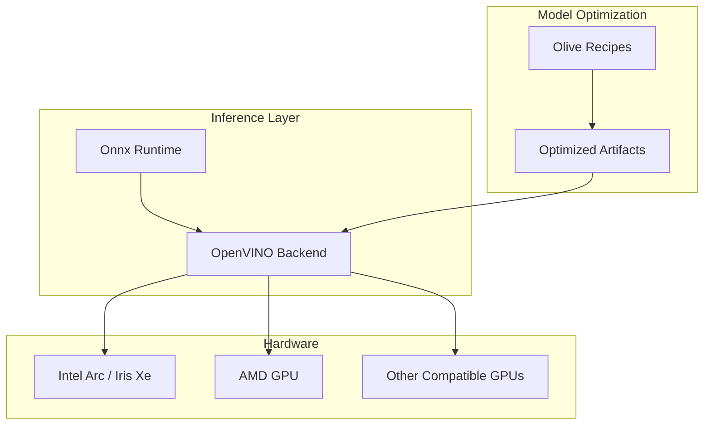
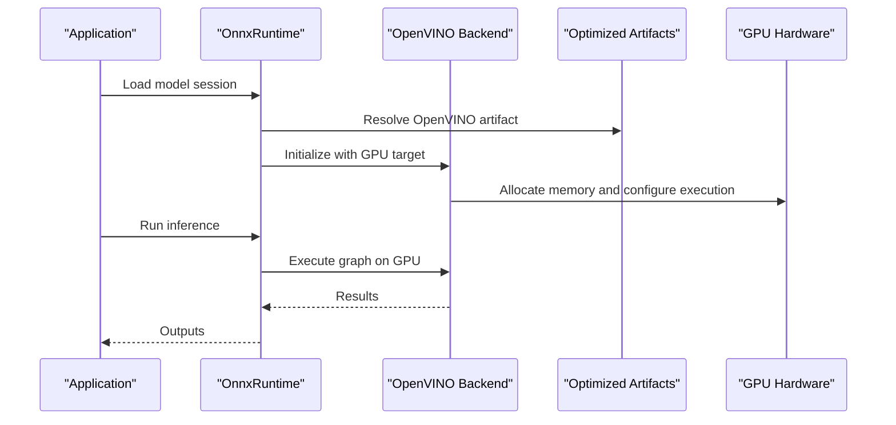
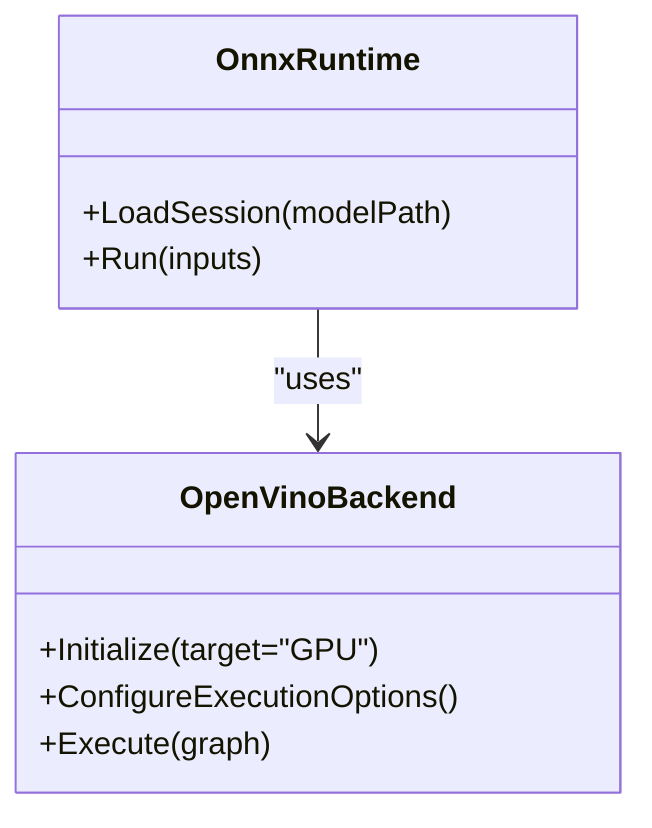
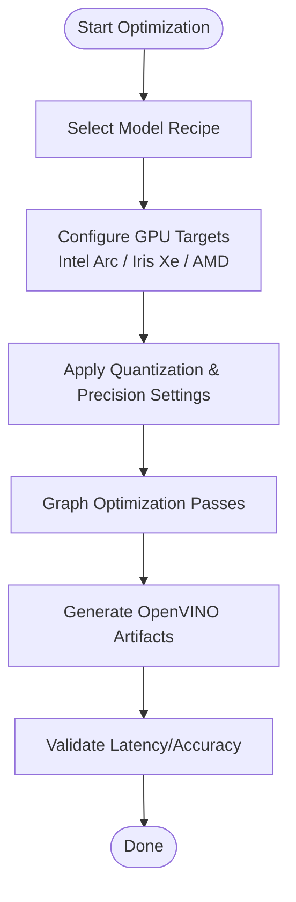
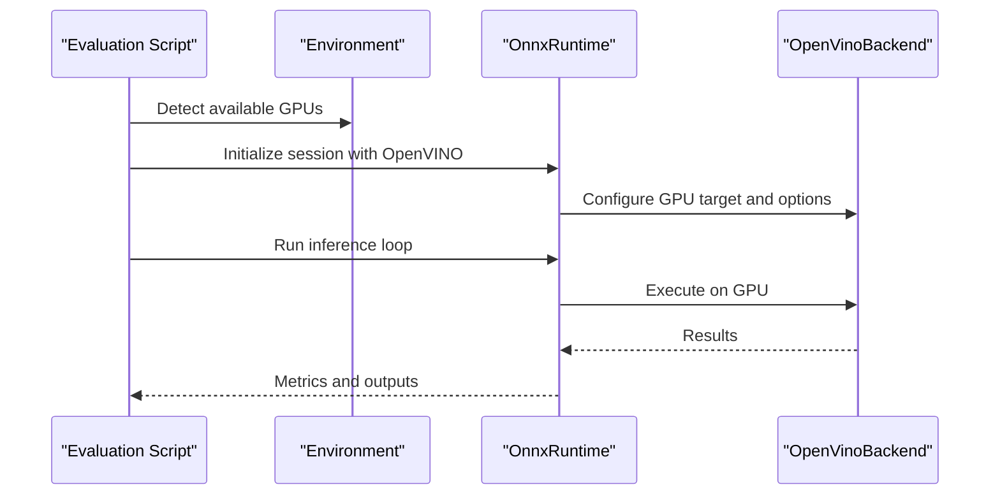
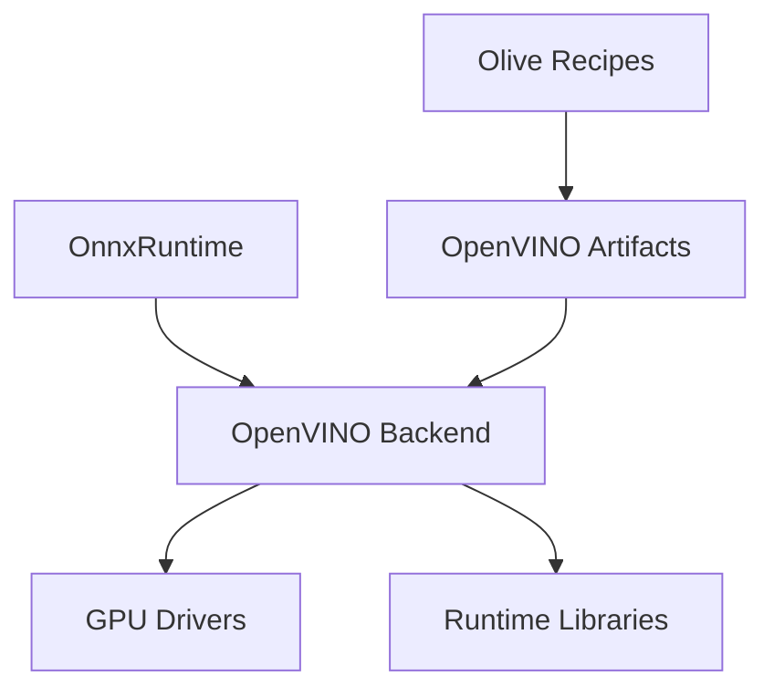

# OpenVINO GPU Support

<cite>
**Referenced Files in This Document**
- [README.md](file://README.md)
- [Trackdub.Inference.Onnx/OpenVino/README.md](file://src/Trackdub.Inference.Onnx/OpenVino/README.md)
- [google-gemma-4-E2B-it/README.md](file://resources/olive-recipes/google-gemma-4-E2B-it/README.md)
- [microsoft-Phi-4-mini-instruct/OpenVINO/info.yml](file://resources/olive-recipes/microsoft-Phi-4-mini-instruct/OpenVINO/info.yml)
- [microsoft-Phi-4-mini-reasoning/OpenVINO/info.yml](file://resources/olive-recipes/microsoft-Phi-4-mini-reasoning/OpenVINO/info.yml)
- [microsoft-Phi-4-reasoning/OpenVINO/info.yml](file://resources/olive-recipes/microsoft-Phi-4-reasoning/OpenVINO/info.yml)
- [microsoft-Phi-4-reasoning-plus/OpenVINO/info.yml](file://resources/olive-recipes/microsoft-Phi-4-reasoning-plus/OpenVINO/info.yml)
- [openai-whisper-large-v3-turbo/OpenVINO/eval_latency.json](file://resources/olive-recipes/openai-whisper-large-v3-turbo/OpenVINO/eval_latency.json)
- [openai-whisper-large-v3-turbo/OpenVINO/README.md](file://resources/olive-recipes/openai-whisper-large-v3-turbo/OpenVINO/README.md)
- [google-gemma-4-E2B-it/eval.py](file://resources/olive-recipes/google-gemma-4-E2B-it/eval.py)
- [google-gemma-4-E2B-it/inference.py](file://resources/olive-recipes/google-gemma-4-E2B-it/inference.py)
- [ADR-0009-gpu-memory-budget-planner.md](file://docs/decisions/ADR-0009-gpu-memory-budget-planner.md)
- [TROUBLESHOOTING.md](file://docs/development/TROUBLESHOOTING.md)
- [windows-ml-phase-3-device-policies.md](file://docs/reference/windows-ml-phase-3-device-policies.md)
- [tensorrt-rtx-ep-abi-plugin.md](file://docs/reference/tensorrt-rtx-ep-abi-plugin.md)
- [macos-deployment-notes.md](file://docs/operations/macos-deployment-notes.md)
- [GITHUB_ACTIONS.md](file://docs/operations/GITHUB_ACTIONS.md)
</cite>

## Table of Contents
1. [Introduction](#introduction)
2. [Project Structure](#project-structure)
3. [Core Components](#core-components)
4. [Architecture Overview](#architecture-overview)
5. [Detailed Component Analysis](#detailed-component-analysis)
6. [Dependency Analysis](#dependency-analysis)
7. [Performance Considerations](#performance-considerations)
8. [Troubleshooting Guide](#troubleshooting-guide)
9. [Conclusion](#conclusion)
10. [Appendices](#appendices)

## Introduction
This document provides comprehensive guidance for enabling and optimizing OpenVINO GPU acceleration across Intel, AMD, and other compatible hardware within the project. It covers installation prerequisites, device discovery, automatic model optimization, configuration options for Intel Arc, Iris Xe, and discrete GPUs, cross-platform setup (Windows, Linux, macOS), performance tuning, quantization and precision settings, troubleshooting, and integration with vendor-specific frameworks.

The repository includes OpenVINO-related recipes and example configurations that demonstrate how models are optimized and executed on GPU targets, as well as operational notes for deployment environments.

## Project Structure
OpenVINO support is primarily represented through:
- Inference runtime integration under Trackdub.Inference.Onnx/OpenVino
- Model optimization recipes and artifacts under resources/olive-recipes for various models
- Operational and reference documentation for deployment and device policies

[No sources needed since this diagram shows conceptual workflow, not actual code structure]

## Core Components
- OpenVINO backend integration for OnnxRuntime execution
- Olive-based model optimization recipes producing OpenVINO-compatible artifacts
- Example evaluation and inference scripts demonstrating GPU execution paths
- Device policy and deployment references for Windows, Linux, and macOS

Key areas to focus on:
- OpenVINO README and usage patterns
- Olive recipe directories containing OpenVINO configs and manifests
- Evaluation and inference scripts that select GPU devices and precision modes
- Operational docs for environment setup and compatibility

**Section sources**
- [Trackdub.Inference.Onnx/OpenVino/README.md](file://src/Trackdub.Inference.Onnx/OpenVino/README.md)
- [google-gemma-4-E2B-it/README.md](file://resources/olive-recipes/google-gemma-4-E2B-it/README.md)
- [microsoft-Phi-4-mini-instruct/OpenVINO/info.yml](file://resources/olive-recipes/microsoft-Phi-4-mini-instruct/OpenVINO/info.yml)
- [microsoft-Phi-4-mini-reasoning/OpenVINO/info.yml](file://resources/olive-recipes/microsoft-Phi-4-mini-reasoning/OpenVINO/info.yml)
- [microsoft-Phi-4-reasoning/OpenVINO/info.yml](file://resources/olive-recipes/microsoft-Phi-4-reasoning/OpenVINO/info.yml)
- [microsoft-Phi-4-reasoning-plus/OpenVINO/info.yml](file://resources/olive-recipes/microsoft-Phi-4-reasoning-plus/OpenVINO/info.yml)
- [openai-whisper-large-v3-turbo/OpenVINO/README.md](file://resources/olive-recipes/openai-whisper-large-v3-turbo/OpenVINO/README.md)
- [openai-whisper-large-v3-turbo/OpenVINO/eval_latency.json](file://resources/olive-recipes/openai-whisper-large-v3-turbo/OpenVINO/eval_latency.json)
- [google-gemma-4-E2B-it/eval.py](file://resources/olive-recipes/google-gemma-4-E2B-it/eval.py)
- [google-gemma-4-E2B-it/inference.py](file://resources/olive-recipes/google-gemma-4-E2B-it/inference.py)

## Architecture Overview
The OpenVINO GPU acceleration path integrates with OnnxRuntime via an OpenVINO backend. Models are pre-optimized using Olive recipes into OpenVINO-compatible formats, which are then loaded by the backend for execution on supported GPUs.

**Diagram sources**
- [Trackdub.Inference.Onnx/OpenVino/README.md](file://src/Trackdub.Inference.Onnx/OpenVino/README.md)
- [openai-whisper-large-v3-turbo/OpenVINO/README.md](file://resources/olive-recipes/openai-whisper-large-v3-turbo/OpenVINO/README.md)

## Detailed Component Analysis

### OpenVINO Backend Integration
- The OpenVINO backend is integrated within the OnnxRuntime layer to execute optimized models on GPU targets.
- Usage patterns and configuration are documented in the OpenVINO README under the Onnx module.

**Diagram sources**
- [Trackdub.Inference.Onnx/OpenVino/README.md](file://src/Trackdub.Inference.Onnx/OpenVino/README.md)

**Section sources**
- [Trackdub.Inference.Onnx/OpenVino/README.md](file://src/Trackdub.Inference.Onnx/OpenVino/README.md)

### Olive-Based Model Optimization for OpenVINO
- Olive recipes define optimization pipelines that produce OpenVINO-compatible artifacts for various models.
- Example directories include Microsoft Phi variants and Whisper models with OpenVINO folders containing config files and evaluation metrics.

**Diagram sources**
- [microsoft-Phi-4-mini-instruct/OpenVINO/info.yml](file://resources/olive-recipes/microsoft-Phi-4-mini-instruct/OpenVINO/info.yml)
- [microsoft-Phi-4-mini-reasoning/OpenVINO/info.yml](file://resources/olive-recipes/microsoft-Phi-4-mini-reasoning/OpenVINO/info.yml)
- [microsoft-Phi-4-reasoning/OpenVINO/info.yml](file://resources/olive-recipes/microsoft-Phi-4-reasoning/OpenVINO/info.yml)
- [microsoft-Phi-4-reasoning-plus/OpenVINO/info.yml](file://resources/olive-recipes/microsoft-Phi-4-reasoning-plus/OpenVINO/info.yml)
- [openai-whisper-large-v3-turbo/OpenVINO/README.md](file://resources/olive-recipes/openai-whisper-large-v3-turbo/OpenVINO/README.md)

**Section sources**
- [microsoft-Phi-4-mini-instruct/OpenVINO/info.yml](file://resources/olive-recipes/microsoft-Phi-4-mini-instruct/OpenVINO/info.yml)
- [microsoft-Phi-4-mini-reasoning/OpenVINO/info.yml](file://resources/olive-recipes/microsoft-Phi-4-mini-reasoning/OpenVINO/info.yml)
- [microsoft-Phi-4-reasoning/OpenVINO/info.yml](file://resources/olive-recipes/microsoft-Phi-4-reasoning/OpenVINO/info.yml)
- [microsoft-Phi-4-reasoning-plus/OpenVINO/info.yml](file://resources/olive-recipes/microsoft-Phi-4-reasoning-plus/OpenVINO/info.yml)
- [openai-whisper-large-v3-turbo/OpenVINO/README.md](file://resources/olive-recipes/openai-whisper-large-v3-turbo/OpenVINO/README.md)

### Evaluation and Inference Scripts
- Scripts demonstrate selecting GPU devices and running inference with OpenVINO backends.
- They illustrate how to configure execution parameters and validate performance.

**Diagram sources**
- [google-gemma-4-E2B-it/eval.py](file://resources/olive-recipes/google-gemma-4-E2B-it/eval.py)
- [google-gemma-4-E2B-it/inference.py](file://resources/olive-recipes/google-gemma-4-E2B-it/inference.py)

**Section sources**
- [google-gemma-4-E2B-it/eval.py](file://resources/olive-recipes/google-gemma-4-E2B-it/eval.py)
- [google-gemma-4-E2B-it/inference.py](file://resources/olive-recipes/google-gemma-4-E2B-it/inference.py)

## Dependency Analysis
OpenVINO GPU acceleration depends on:
- OnnxRuntime with OpenVINO backend support
- Optimized model artifacts produced by Olive
- GPU drivers and runtime libraries for Intel, AMD, and other vendors
- Cross-platform environment variables and configuration files

**Diagram sources**
- [Trackdub.Inference.Onnx/OpenVino/README.md](file://src/Trackdub.Inference.Onnx/OpenVino/README.md)
- [openai-whisper-large-v3-turbo/OpenVINO/README.md](file://resources/olive-recipes/openai-whisper-large-v3-turbo/OpenVINO/README.md)

**Section sources**
- [Trackdub.Inference.Onnx/OpenVino/README.md](file://src/Trackdub.Inference.Onnx/OpenVino/README.md)
- [openai-whisper-large-v3-turbo/OpenVINO/README.md](file://resources/olive-recipes/openai-whisper-large-v3-turbo/OpenVINO/README.md)

## Performance Considerations
- Use appropriate precision settings (FP16, INT8) based on GPU capabilities and model requirements.
- Apply quantization where possible to reduce memory footprint and improve throughput.
- Monitor GPU memory allocation and adjust batch sizes accordingly.
- Leverage device-specific optimizations for Intel Arc, Iris Xe, and AMD GPUs.

[No sources needed since this section provides general guidance]

## Troubleshooting Guide
Common issues and resolutions:
- Initialization failures: Verify OpenVINO backend availability and correct environment variables.
- Device compatibility: Ensure GPU drivers are up-to-date and supported by OpenVINO.
- Performance bottlenecks: Profile execution and adjust optimization passes or precision settings.
- Cross-platform differences: Review OS-specific deployment notes and device policies.

Relevant references:
- General troubleshooting guidance
- GPU memory budget planning
- Windows device policies
- macOS deployment notes

**Section sources**
- [TROUBLESHOOTING.md](file://docs/development/TROUBLESHOOTING.md)
- [ADR-0009-gpu-memory-budget-planner.md](file://docs/decisions/ADR-0009-gpu-memory-budget-planner.md)
- [windows-ml-phase-3-device-policies.md](file://docs/reference/windows-ml-phase-3-device-policies.md)
- [macos-deployment-notes.md](file://docs/operations/macos-deployment-notes.md)

## Conclusion
OpenVINO GPU acceleration in this project is enabled through OnnxRuntime integration and Olive-based model optimization. By following the provided recipes, scripts, and operational guidance, users can deploy efficient GPU-accelerated inference across Intel, AMD, and other compatible hardware. Proper configuration, quantization, and performance tuning are essential for optimal results.

[No sources needed since this section summarizes without analyzing specific files]

## Appendices
- Installation procedures for OpenVINO toolkit and GPU drivers should follow official vendor documentation and ensure compatibility with the selected GPU architecture.
- Environment setup varies by platform; consult OS-specific deployment notes for detailed steps.
- For advanced tuning, refer to OpenVINO backend configuration options and Olive recipe customization.

[No sources needed since this section provides general guidance]