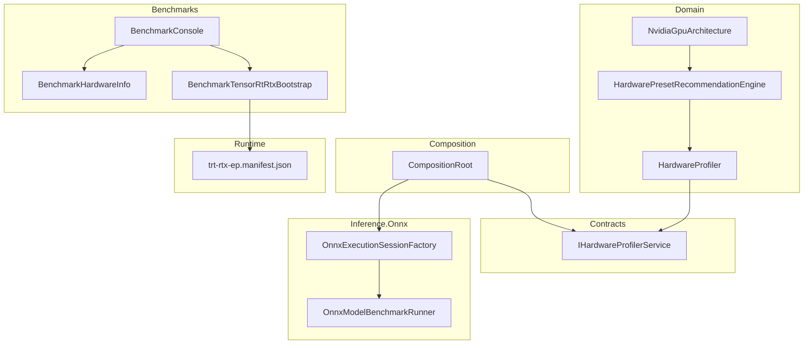
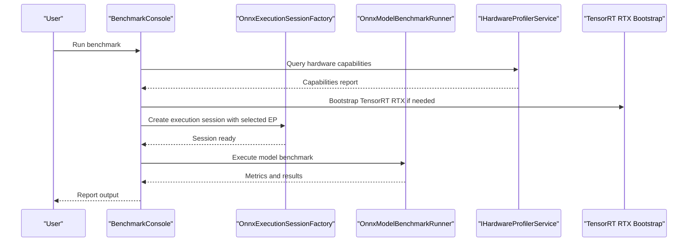
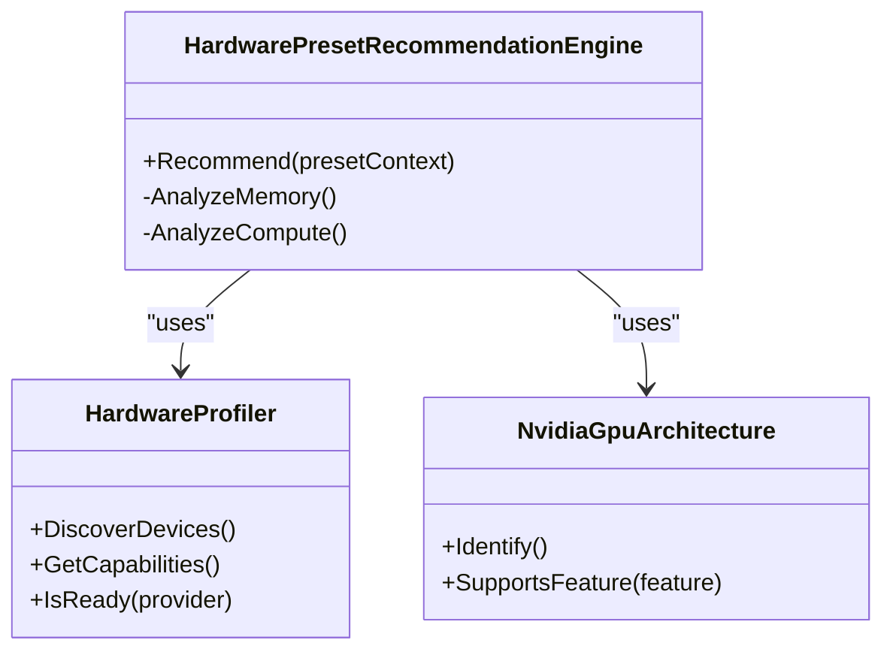
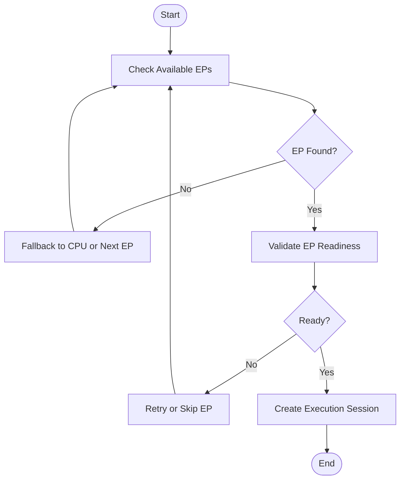
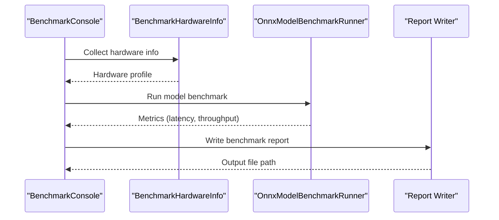
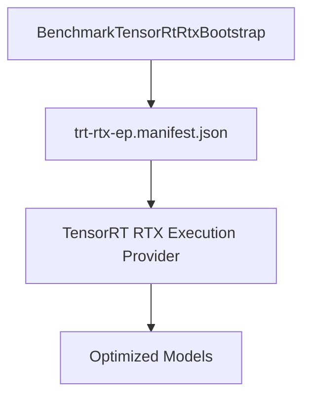
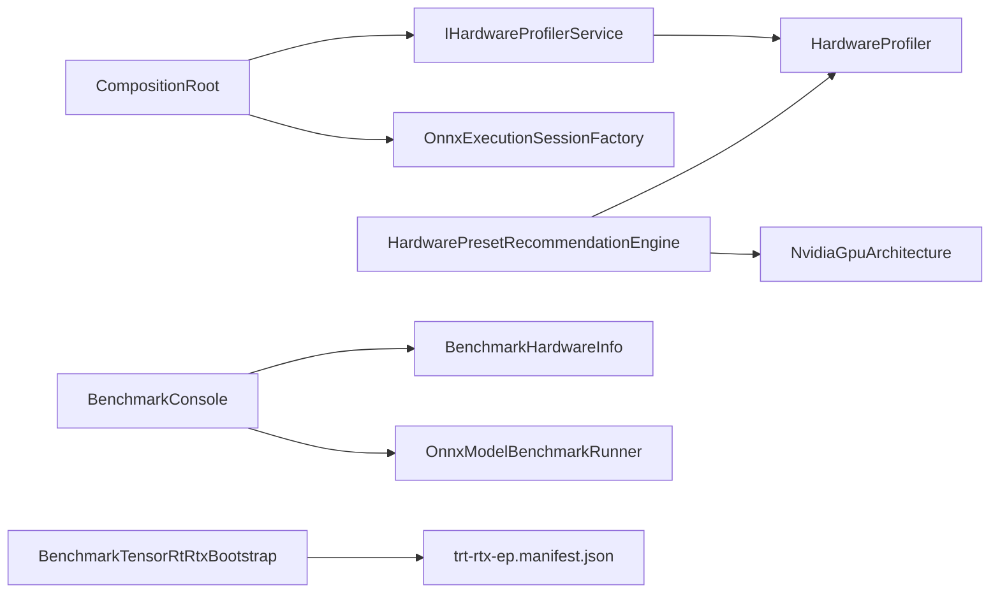

# Hardware & Performance Optimization

<cite>
**Referenced Files in This Document**
- [HardwareProfiler.cs](file://src/Trackdub.Domain/HardwareProfiler.cs)
- [HardwarePresetRecommendationEngine.cs](file://src/Trackdub.Domain/HardwarePresetRecommendationEngine.cs)
- [NvidiaGpuArchitecture.cs](file://src/Trackdub.Domain/NvidiaGpuArchitecture.cs)
- [IHardwareProfilerService.cs](file://src/Trackdub.Contracts/IHardwareProfilerService.cs)
- [CompositionRoot.cs](file://src/Trackdub.Composition/CompositionRoot.cs)
- [OnnxExecutionSessionFactory.cs](file://src/Trackdub.Inference.Onnx/OnnxExecutionSessionFactory.cs)
- [BenchmarkConsole.cs](file://src/Trackdub.Benchmarks/BenchmarkConsole.cs)
- [BenchmarkHardwareInfo.cs](file://src/Trackdub.Benchmarks/BenchmarkHardwareInfo.cs)
- [TensorRtRtxBootstrap.cs](file://src/Trackdub.Benchmarks/BenchmarkTensorRtRtxBootstrap.cs)
- [OnnxModelBenchmarkRunner.cs](file://src/Trackdub.Inference.Onnx/OnnxModelBenchmarkRunner.cs)
- [README.md](file://src/Trackdub.Benchmarks/README.md)
- [ADR-0009-gpu-memory-budget-planner.md](file://docs/decisions/ADR-0009-gpu-memory-budget-planner.md)
- [tensorrt-rtx-ep-ab-plugin.md](file://docs/reference/tensorrt-rtx-ep-ab-plugin.md)
- [profiling-report.md](file://docs/reference/profiling-report.md)
- [windows-ml-phase-5-catalog-eps.md](file://docs/reference/windows-ml-phase-5-catalog-eps.md)
- [runtime/trt-rtx-ep.manifest.json](file://runtime/trt-rtx-ep.manifest.json)
</cite>

## Table of Contents
1. [Introduction](#introduction)
2. [Project Structure](#project-structure)
3. [Core Components](#core-components)
4. [Architecture Overview](#architecture-overview)
5. [Detailed Component Analysis](#detailed-component-analysis)
6. [Dependency Analysis](#dependency-analysis)
7. [Performance Considerations](#performance-considerations)
8. [Troubleshooting Guide](#troubleshooting-guide)
9. [Conclusion](#conclusion)
10. [Appendices](#appendices)

## Introduction
This document explains Trackdub’s hardware profiling and performance optimization capabilities, focusing on:
- Hardware requirement detection and capability discovery
- GPU acceleration setup for CUDA, TensorRT (RTX), DirectML, and OpenVINO
- Execution provider selection and runtime readiness checks
- Memory management strategies and CPU/GPU workload balancing
- Performance monitoring, benchmarking utilities, and profiling techniques
- Hardware-specific optimizations, driver requirements, and compatibility matrices
- Guidance for selecting optimal configurations, cost-performance trade-offs, and scalability
- Troubleshooting hardware compatibility issues, driver conflicts, and bottlenecks
- Thermal management, power consumption optimization, and production deployment considerations

## Project Structure
Trackdub organizes hardware and performance features across several layers:
- Domain layer provides core profiling and recommendation logic
- Contracts define interfaces for hardware profiling services
- Composition wires providers and services at startup
- Inference layer integrates execution providers and model runners
- Benchmarks provide CLI tools and bootstrap routines for measurement
- Documentation and ADRs capture design decisions and compatibility matrices

**Diagram sources**
- [HardwareProfiler.cs](file://src/Trackdub.Domain/HardwareProfiler.cs)
- [HardwarePresetRecommendationEngine.cs](file://src/Trackdub.Domain/HardwarePresetRecommendationEngine.cs)
- [NvidiaGpuArchitecture.cs](file://src/Trackdub.Domain/NvidiaGpuArchitecture.cs)
- [IHardwareProfilerService.cs](file://src/Trackdub.Contracts/IHardwareProfilerService.cs)
- [CompositionRoot.cs](file://src/Trackdub.Composition/CompositionRoot.cs)
- [OnnxExecutionSessionFactory.cs](file://src/Trackdub.Inference.Onnx/OnnxExecutionSessionFactory.cs)
- [OnnxModelBenchmarkRunner.cs](file://src/Trackdub.Inference.Onnx/OnnxModelBenchmarkRunner.cs)
- [BenchmarkConsole.cs](file://src/Trackdub.Benchmarks/BenchmarkConsole.cs)
- [BenchmarkHardwareInfo.cs](file://src/Trackdub.Benchmarks/BenchmarkHardwareInfo.cs)
- [BenchmarkTensorRtRtxBootstrap.cs](file://src/Trackdub.Benchmarks/BenchmarkTensorRtRtxBootstrap.cs)
- [runtime/trt-rtx-ep.manifest.json](file://runtime/trt-rtx-ep.manifest.json)

**Section sources**
- [HardwareProfiler.cs](file://src/Trackdub.Domain/HardwareProfiler.cs)
- [HardwarePresetRecommendationEngine.cs](file://src/Trackdub.Domain/HardwarePresetRecommendationEngine.cs)
- [NvidiaGpuArchitecture.cs](file://src/Trackdub.Domain/NvidiaGpuArchitecture.cs)
- [IHardwareProfilerService.cs](file://src/Trackdub.Contracts/IHardwareProfilerService.cs)
- [CompositionRoot.cs](file://src/Trackdub.Composition/CompositionRoot.cs)
- [OnnxExecutionSessionFactory.cs](file://src/Trackdub.Inference.Onnx/OnnxExecutionSessionFactory.cs)
- [OnnxModelBenchmarkRunner.cs](file://src/Trackdub.Inference.Onnx/OnnxModelBenchmarkRunner.cs)
- [BenchmarkConsole.cs](file://src/Trackdub.Benchmarks/BenchmarkConsole.cs)
- [BenchmarkHardwareInfo.cs](file://src/Trackdub.Benchmarks/BenchmarkHardwareInfo.cs)
- [BenchmarkTensorRtRtxBootstrap.cs](file://src/Trackdub.Benchmarks/BenchmarkTensorRtRtxBootstrap.cs)
- [runtime/trt-rtx-ep.manifest.json](file://runtime/trt-rtx-ep.manifest.json)

## Core Components
- Hardware profiler and preset engine: Detects devices, enumerates capabilities, and recommends presets based on architecture and memory.
- Nvidia GPU architecture helper: Encapsulates GPU architecture identification used by recommendations.
- Hardware profiler service contract: Defines the interface for querying hardware capabilities and readiness.
- Execution factory and model runner: Selects execution providers and runs benchmarks to measure throughput and latency.
- Benchmark console and helpers: Provide CLI entry points, hardware info collection, and TensorRT RTX bootstrap.

Key responsibilities:
- Device enumeration and capability discovery
- Provider selection with fallbacks
- Model benchmarking and reporting
- Preset recommendation aligned with detected hardware

**Section sources**
- [HardwareProfiler.cs](file://src/Trackdub.Domain/HardwareProfiler.cs)
- [HardwarePresetRecommendationEngine.cs](file://src/Trackdub.Domain/HardwarePresetRecommendationEngine.cs)
- [NvidiaGpuArchitecture.cs](file://src/Trackdub.Domain/NvidiaGpuArchitecture.cs)
- [IHardwareProfilerService.cs](file://src/Trackdub.Contracts/IHardwareProfilerService.cs)
- [OnnxExecutionSessionFactory.cs](file://src/Trackdub.Inference.Onnx/OnnxExecutionSessionFactory.cs)
- [OnnxModelBenchmarkRunner.cs](file://src/Trackdub.Inference.Onnx/OnnxModelBenchmarkRunner.cs)
- [BenchmarkConsole.cs](file://src/Trackdub.Benchmarks/BenchmarkConsole.cs)
- [BenchmarkHardwareInfo.cs](file://src/Trackdub.Benchmarks/BenchmarkHardwareInfo.cs)
- [BenchmarkTensorRtRtxBootstrap.cs](file://src/Trackdub.Benchmarks/BenchmarkTensorRtRtxBootstrap.cs)

## Architecture Overview
The system composes hardware profiling and inference execution through a layered approach:
- The composition root registers the hardware profiler service and inference factories.
- The execution session factory selects execution providers based on availability and configuration.
- The model benchmark runner executes workloads and collects metrics.
- The benchmark console orchestrates hardware info gathering and TensorRT RTX bootstrap.

**Diagram sources**
- [BenchmarkConsole.cs](file://src/Trackdub.Benchmarks/BenchmarkConsole.cs)
- [OnnxExecutionSessionFactory.cs](file://src/Trackdub.Inference.Onnx/OnnxExecutionSessionFactory.cs)
- [OnnxModelBenchmarkRunner.cs](file://src/Trackdub.Inference.Onnx/OnnxModelBenchmarkRunner.cs)
- [IHardwareProfilerService.cs](file://src/Trackdub.Contracts/IHardwareProfilerService.cs)
- [BenchmarkTensorRtRtxBootstrap.cs](file://src/Trackdub.Benchmarks/BenchmarkTensorRtRtxBootstrap.cs)

**Section sources**
- [CompositionRoot.cs](file://src/Trackdub.Composition/CompositionRoot.cs)
- [OnnxExecutionSessionFactory.cs](file://src/Trackdub.Inference.Onnx/OnnxExecutionSessionFactory.cs)
- [OnnxModelBenchmarkRunner.cs](file://src/Trackdub.Inference.Onnx/OnnxModelBenchmarkRunner.cs)
- [BenchmarkConsole.cs](file://src/Trackdub.Benchmarks/BenchmarkConsole.cs)
- [BenchmarkTensorRtRtxBootstrap.cs](file://src/Trackdub.Benchmarks/BenchmarkTensorRtRtxBootstrap.cs)

## Detailed Component Analysis

### Hardware Profiler and Recommendation Engine
- HardwareProfiler: Enumerates devices, inspects capabilities, and exposes readiness signals.
- HardwarePresetRecommendationEngine: Maps detected hardware to optimized presets considering memory, compute, and architecture.
- NvidiaGpuArchitecture: Identifies NVIDIA GPU architectures to tailor TensorRT and CUDA settings.

**Diagram sources**
- [HardwareProfiler.cs](file://src/Trackdub.Domain/HardwareProfiler.cs)
- [HardwarePresetRecommendationEngine.cs](file://src/Trackdub.Domain/HardwarePresetRecommendationEngine.cs)
- [NvidiaGpuArchitecture.cs](file://src/Trackdub.Domain/NvidiaGpuArchitecture.cs)

**Section sources**
- [HardwareProfiler.cs](file://src/Trackdub.Domain/HardwareProfiler.cs)
- [HardwarePresetRecommendationEngine.cs](file://src/Trackdub.Domain/HardwarePresetRecommendationEngine.cs)
- [NvidiaGpuArchitecture.cs](file://src/Trackdub.Domain/NvidiaGpuArchitecture.cs)

### Execution Provider Selection and Runtime Readiness
- OnnxExecutionSessionFactory: Creates sessions with appropriate execution providers (CUDA, TensorRT RTX, DirectML, OpenVINO).
- IHardwareProfilerService: Provides readiness checks and capability queries to guide provider selection.
- TensorRT RTX bootstrap ensures required components are available before running accelerated workloads.

**Diagram sources**
- [OnnxExecutionSessionFactory.cs](file://src/Trackdub.Inference.Onnx/OnnxExecutionSessionFactory.cs)
- [IHardwareProfilerService.cs](file://src/Trackdub.Contracts/IHardwareProfilerService.cs)
- [BenchmarkTensorRtRtxBootstrap.cs](file://src/Trackdub.Benchmarks/BenchmarkTensorRtRtxBootstrap.cs)

**Section sources**
- [OnnxExecutionSessionFactory.cs](file://src/Trackdub.Inference.Onnx/OnnxExecutionSessionFactory.cs)
- [IHardwareProfilerService.cs](file://src/Trackdub.Contracts/IHardwareProfilerService.cs)
- [BenchmarkTensorRtRtxBootstrap.cs](file://src/Trackdub.Benchmarks/BenchmarkTensorRtRtxBootstrap.cs)

### Benchmarking Utilities and Profiling Techniques
- BenchmarkConsole: Entry point for running benchmarks and collecting results.
- BenchmarkHardwareInfo: Gathers hardware details for reports and diagnostics.
- OnnxModelBenchmarkRunner: Executes model workloads and measures latency/throughput.
- README in Benchmarks: Usage guidance and options for benchmarking workflows.

**Diagram sources**
- [BenchmarkConsole.cs](file://src/Trackdub.Benchmarks/BenchmarkConsole.cs)
- [BenchmarkHardwareInfo.cs](file://src/Trackdub.Benchmarks/BenchmarkHardwareInfo.cs)
- [OnnxModelBenchmarkRunner.cs](file://src/Trackdub.Inference.Onnx/OnnxModelBenchmarkRunner.cs)
- [README.md](file://src/Trackdub.Benchmarks/README.md)

**Section sources**
- [BenchmarkConsole.cs](file://src/Trackdub.Benchmarks/BenchmarkConsole.cs)
- [BenchmarkHardwareInfo.cs](file://src/Trackdub.Benchmarks/BenchmarkHardwareInfo.cs)
- [OnnxModelBenchmarkRunner.cs](file://src/Trackdub.Inference.Onnx/OnnxModelBenchmarkRunner.cs)
- [README.md](file://src/Trackdub.Benchmarks/README.md)

### TensorRT RTX Integration and Manifest
- TensorRT RTX bootstrap initializes necessary components for accelerated inference.
- trt-rtx-ep.manifest.json declares runtime dependencies and plugin ABI information.
- Reference documentation covers ABI/plugin specifics and Windows ML catalog execution providers.

**Diagram sources**
- [BenchmarkTensorRtRtxBootstrap.cs](file://src/Trackdub.Benchmarks/BenchmarkTensorRtRtxBootstrap.cs)
- [runtime/trt-rtx-ep.manifest.json](file://runtime/trt-rtx-ep.manifest.json)
- [tensorrt-rtx-ep-ab-plugin.md](file://docs/reference/tensorrt-rtx-ep-ab-plugin.md)
- [windows-ml-phase-5-catalog-eps.md](file://docs/reference/windows-ml-phase-5-catalog-eps.md)

**Section sources**
- [BenchmarkTensorRtRtxBootstrap.cs](file://src/Trackdub.Benchmarks/BenchmarkTensorRtRtxBootstrap.cs)
- [runtime/trt-rtx-ep.manifest.json](file://runtime/trt-rtx-ep.manifest.json)
- [tensorrt-rtx-ep-ab-plugin.md](file://docs/reference/tensorrt-rtx-ep-ab-plugin.md)
- [windows-ml-phase-5-catalog-eps.md](file://docs/reference/windows-ml-phase-5-catalog-eps.md)

## Dependency Analysis
- CompositionRoot wires IHardwareProfilerService and OnnxExecutionSessionFactory into the application lifecycle.
- HardwareProfiler depends on device enumeration APIs; recommendations depend on NvidiaGpuArchitecture.
- Benchmarks depend on hardware info and model runner; TensorRT bootstrap depends on manifest and runtime plugins.

**Diagram sources**
- [CompositionRoot.cs](file://src/Trackdub.Composition/CompositionRoot.cs)
- [IHardwareProfilerService.cs](file://src/Trackdub.Contracts/IHardwareProfilerService.cs)
- [HardwareProfiler.cs](file://src/Trackdub.Domain/HardwareProfiler.cs)
- [HardwarePresetRecommendationEngine.cs](file://src/Trackdub.Domain/HardwarePresetRecommendationEngine.cs)
- [NvidiaGpuArchitecture.cs](file://src/Trackdub.Domain/NvidiaGpuArchitecture.cs)
- [BenchmarkConsole.cs](file://src/Trackdub.Benchmarks/BenchmarkConsole.cs)
- [BenchmarkHardwareInfo.cs](file://src/Trackdub.Benchmarks/BenchmarkHardwareInfo.cs)
- [OnnxModelBenchmarkRunner.cs](file://src/Trackdub.Inference.Onnx/OnnxModelBenchmarkRunner.cs)
- [BenchmarkTensorRtRtxBootstrap.cs](file://src/Trackdub.Benchmarks/BenchmarkTensorRtRtxBootstrap.cs)
- [runtime/trt-rtx-ep.manifest.json](file://runtime/trt-rtx-ep.manifest.json)

**Section sources**
- [CompositionRoot.cs](file://src/Trackdub.Composition/CompositionRoot.cs)
- [IHardwareProfilerService.cs](file://src/Trackdub.Contracts/IHardwareProfilerService.cs)
- [HardwareProfiler.cs](file://src/Trackdub.Domain/HardwareProfiler.cs)
- [HardwarePresetRecommendationEngine.cs](file://src/Trackdub.Domain/HardwarePresetRecommendationEngine.cs)
- [NvidiaGpuArchitecture.cs](file://src/Trackdub.Domain/NvidiaGpuArchitecture.cs)
- [BenchmarkConsole.cs](file://src/Trackdub.Benchmarks/BenchmarkConsole.cs)
- [BenchmarkHardwareInfo.cs](file://src/Trackdub.Benchmarks/BenchmarkHardwareInfo.cs)
- [OnnxModelBenchmarkRunner.cs](file://src/Trackdub.Inference.Onnx/OnnxModelBenchmarkRunner.cs)
- [BenchmarkTensorRtRtxBootstrap.cs](file://src/Trackdub.Benchmarks/BenchmarkTensorRtRtxBootstrap.cs)
- [runtime/trt-rtx-ep.manifest.json](file://runtime/trt-rtx-ep.manifest.json)

## Performance Considerations
- Execution provider selection should prioritize GPU acceleration when available, falling back to CPU or alternative providers if readiness checks fail.
- Memory budget planning is critical for large models; use recommended presets that align with detected VRAM and system RAM.
- Batch sizes and precision (FP16/INT8) can significantly impact throughput; validate via benchmarking utilities.
- Thermal throttling and power limits affect sustained performance; monitor temperatures and adjust workloads accordingly.
- For production deployments, prefer deterministic provider selection and pre-warmed sessions to reduce cold-start latency.

[No sources needed since this section provides general guidance]

## Troubleshooting Guide
Common issues and resolutions:
- Driver conflicts: Ensure GPU drivers match the required versions for CUDA/TensorRT/DirectML/OpenVINO.
- EP readiness failures: Use hardware profiler readiness checks to identify missing components or incompatible versions.
- Performance bottlenecks: Profile model execution with benchmark runners; adjust batch size, precision, and provider.
- TensorRT RTX plugin errors: Verify manifest and ABI compatibility; re-run bootstrap to install/update plugins.
- Windows ML catalog EP issues: Consult catalog EP documentation for supported devices and policies.

Relevant references:
- ADR for GPU memory budget planner
- TensorRT RTX EP ABI plugin reference
- Windows ML Phase 5 catalog EPs
- Profiling report reference

**Section sources**
- [ADR-0009-gpu-memory-budget-planner.md](file://docs/decisions/ADR-0009-gpu-memory-budget-planner.md)
- [tensorrt-rtx-ep-ab-plugin.md](file://docs/reference/tensorrt-rtx-ep-ab-plugin.md)
- [windows-ml-phase-5-catalog-eps.md](file://docs/reference/windows-ml-phase-5-catalog-eps.md)
- [profiling-report.md](file://docs/reference/profiling-report.md)

## Conclusion
Trackdub’s hardware profiling and performance optimization stack combines robust device discovery, intelligent preset recommendations, and flexible execution provider selection. By leveraging benchmarking utilities and profiling reports, teams can select optimal configurations, balance CPU/GPU workloads, and ensure reliable performance across diverse environments. Adhering to driver requirements and using provided troubleshooting guides will help mitigate compatibility issues and maintain high throughput in production.

[No sources needed since this section summarizes without analyzing specific files]

## Appendices
- Compatibility matrices and driver requirements are documented in reference materials linked above.
- For detailed usage of benchmarking tools, consult the Benchmarks README and CLI options.
- Production deployment checklists should include provider readiness validation, thermal monitoring, and power management policies.

[No sources needed since this section provides general guidance]