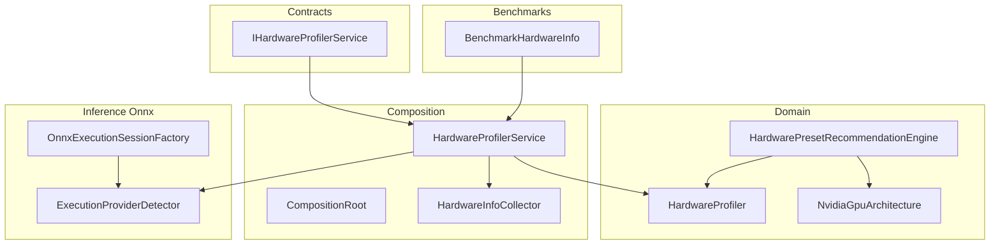
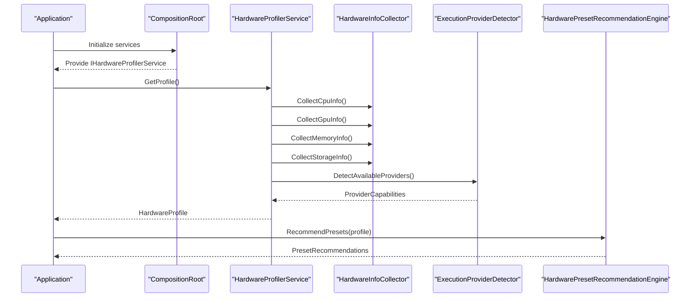
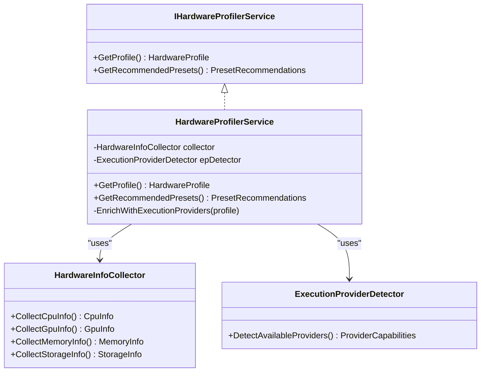
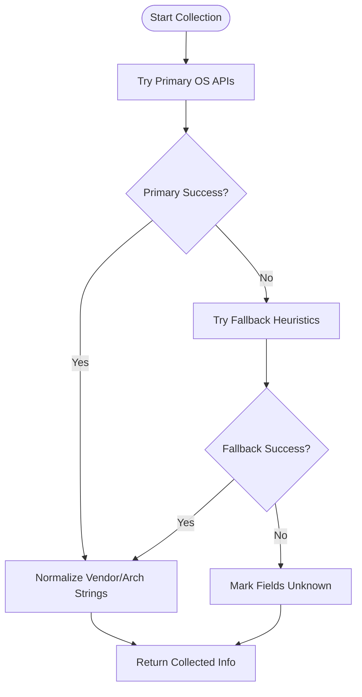
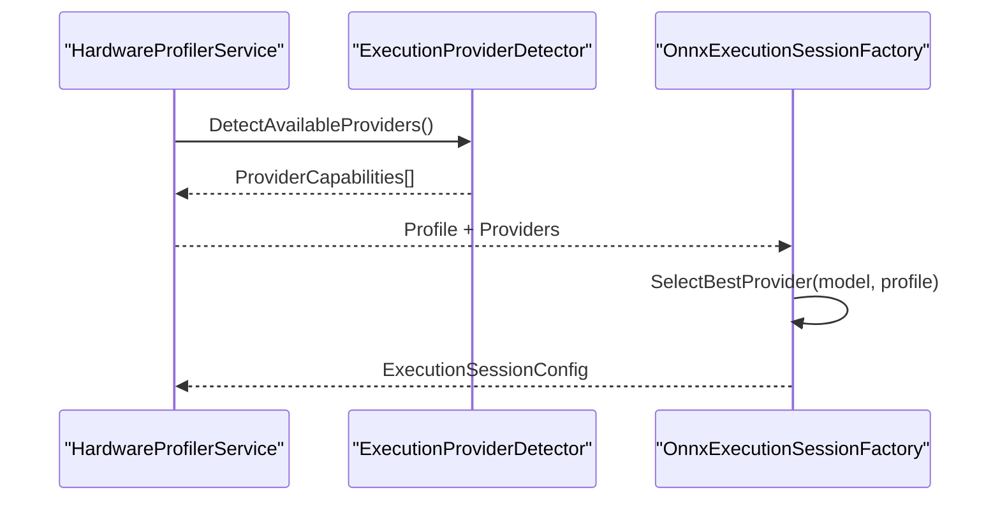
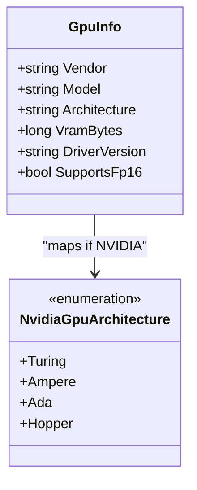
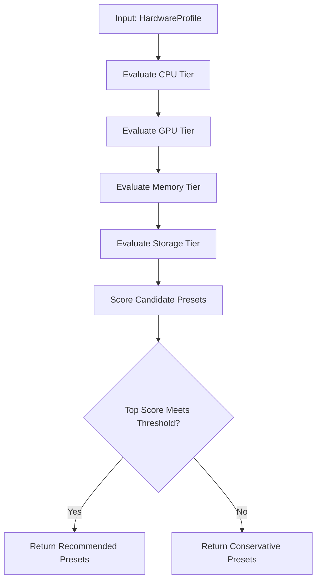
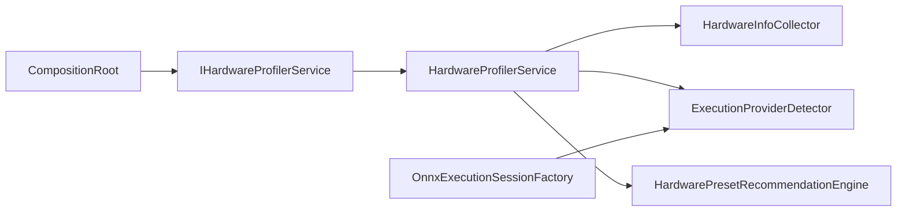

# Hardware Profiling & Detection

<cite>
**Referenced Files in This Document**
- [HardwareProfiler.cs](file://src/Trackdub.Domain/HardwareProfiler.cs)
- [HardwarePresetRecommendationEngine.cs](file://src/Trackdub.Domain/HardwarePresetRecommendationEngine.cs)
- [NvidiaGpuArchitecture.cs](file://src/Trackdub.Domain/NvidiaGpuArchitecture.cs)
- [IHardwareProfilerService.cs](file://src/Trackdub.Contracts/IHardwareProfilerService.cs)
- [CompositionRoot.cs](file://src/Trackdub.Composition/CompositionRoot.cs)
- [HardwareProfilerService.cs](file://src/Trackdub.Composition/HardwareProfiler/HardwareProfilerService.cs)
- [HardwareInfoCollector.cs](file://src/Trackdub.Composition/HardwareProfiler/HardwareInfoCollector.cs)
- [ExecutionProviderDetector.cs](file://src/Trackdub.Inference.Onnx/ExecutionProviders/ExecutionProviderDetector.cs)
- [OnnxExecutionSessionFactory.cs](file://src/Trackdub.Inference.Onnx/OnnxExecutionSessionFactory.cs)
- [BenchmarkHardwareInfo.cs](file://src/Trackdub.Benchmarks/BenchmarkHardwareInfo.cs)
</cite>

## Table of Contents
1. [Introduction](#introduction)
2. [Project Structure](#project-structure)
3. [Core Components](#core-components)
4. [Architecture Overview](#architecture-overview)
5. [Detailed Component Analysis](#detailed-component-analysis)
6. [Dependency Analysis](#dependency-analysis)
7. [Performance Considerations](#performance-considerations)
8. [Troubleshooting Guide](#troubleshooting-guide)
9. [Conclusion](#conclusion)

## Introduction
This document explains Trackdub’s hardware profiling and detection system, focusing on the HardwareProfiler service that automatically discovers CPU, GPU, memory, and storage capabilities. It covers how execution providers are identified, how GPU architectures (NVIDIA, AMD, Intel) and driver versions are detected, the preset recommendation engine for optimal configurations, the hardware matrix scoring system, compatibility checks, edge case handling (virtual machines and containers), platform-specific API integrations, and fallback mechanisms when information is unavailable.

## Project Structure
The hardware profiling capability spans multiple layers:
- Domain models and algorithms for profiling and recommendations live in the domain layer.
- Composition wires services and exposes a public interface contract.
- Inference integration detects available execution providers and selects runtimes.
- Benchmarks include utilities to capture hardware info for reporting.

**Diagram sources**
- [HardwareProfiler.cs](file://src/Trackdub.Domain/HardwareProfiler.cs)
- [HardwarePresetRecommendationEngine.cs](file://src/Trackdub.Domain/HardwarePresetRecommendationEngine.cs)
- [NvidiaGpuArchitecture.cs](file://src/Trackdub.Domain/NvidiaGpuArchitecture.cs)
- [IHardwareProfilerService.cs](file://src/Trackdub.Contracts/IHardwareProfilerService.cs)
- [CompositionRoot.cs](file://src/Trackdub.Composition/CompositionRoot.cs)
- [HardwareProfilerService.cs](file://src/Trackdub.Composition/HardwareProfiler/HardwareProfilerService.cs)
- [HardwareInfoCollector.cs](file://src/Trackdub.Composition/HardwareProfiler/HardwareInfoCollector.cs)
- [ExecutionProviderDetector.cs](file://src/Trackdub.Inference.Onnx/ExecutionProviders/ExecutionProviderDetector.cs)
- [OnnxExecutionSessionFactory.cs](file://src/Trackdub.Inference.Onnx/OnnxExecutionSessionFactory.cs)
- [BenchmarkHardwareInfo.cs](file://src/Trackdub.Benchmarks/BenchmarkHardwareInfo.cs)

**Section sources**
- [IHardwareProfilerService.cs](file://src/Trackdub.Contracts/IHardwareProfilerService.cs)
- [CompositionRoot.cs](file://src/Trackdub.Composition/CompositionRoot.cs)
- [HardwareProfilerService.cs](file://src/Trackdub.Composition/HardwareProfiler/HardwareProfilerService.cs)
- [HardwareInfoCollector.cs](file://src/Trackdub.Composition/HardwareProfiler/HardwareInfoCollector.cs)
- [ExecutionProviderDetector.cs](file://src/Trackdub.Inference.Onnx/ExecutionProviders/ExecutionProviderDetector.cs)
- [OnnxExecutionSessionFactory.cs](file://src/Trackdub.Inference.Onnx/OnnxExecutionSessionFactory.cs)
- [HardwareProfiler.cs](file://src/Trackdub.Domain/HardwareProfiler.cs)
- [HardwarePresetRecommendationEngine.cs](file://src/Trackdub.Domain/HardwarePresetRecommendationEngine.cs)
- [NvidiaGpuArchitecture.cs](file://src/Trackdub.Domain/NvidiaGpuArchitecture.cs)
- [BenchmarkHardwareInfo.cs](file://src/Trackdub.Benchmarks/BenchmarkHardwareInfo.cs)

## Core Components
- HardwareProfiler: Central profiler that aggregates CPU, GPU, memory, and storage characteristics into a unified profile used by downstream systems.
- HardwarePresetRecommendationEngine: Translates the hardware profile into optimized presets for inference and processing pipelines.
- NvidiaGpuArchitecture: Enumerates and classifies NVIDIA GPU architectures to inform performance and feature support.
- IHardwareProfilerService: Public interface exposing profiling capabilities to consumers.
- HardwareProfilerService (Composition): Orchestrates collection, caching, and exposure of the hardware profile; integrates with execution provider detection.
- HardwareInfoCollector: Platform-aware collector that queries OS and device APIs for CPU/GPU/memory/storage details.
- ExecutionProviderDetector: Detects available ONNX execution providers (CPU, CUDA/TensorRT, DirectML, etc.) and their capabilities.
- OnnxExecutionSessionFactory: Uses detected providers to construct suitable execution sessions based on model requirements and device capabilities.
- BenchmarkHardwareInfo: Utility to capture and report hardware info for benchmarking and diagnostics.

**Section sources**
- [HardwareProfiler.cs](file://src/Trackdub.Domain/HardwareProfiler.cs)
- [HardwarePresetRecommendationEngine.cs](file://src/Trackdub.Domain/HardwarePresetRecommendationEngine.cs)
- [NvidiaGpuArchitecture.cs](file://src/Trackdub.Domain/NvidiaGpuArchitecture.cs)
- [IHardwareProfilerService.cs](file://src/Trackdub.Contracts/IHardwareProfilerService.cs)
- [HardwareProfilerService.cs](file://src/Trackdub.Composition/HardwareProfiler/HardwareProfilerService.cs)
- [HardwareInfoCollector.cs](file://src/Trackdub.Composition/HardwareProfiler/HardwareInfoCollector.cs)
- [ExecutionProviderDetector.cs](file://src/Trackdub.Inference.Onnx/ExecutionProviders/ExecutionProviderDetector.cs)
- [OnnxExecutionSessionFactory.cs](file://src/Trackdub.Inference.Onnx/OnnxExecutionSessionFactory.cs)
- [BenchmarkHardwareInfo.cs](file://src/Trackdub.Benchmarks/BenchmarkHardwareInfo.cs)

## Architecture Overview
The profiling pipeline starts with composition wiring, which registers the HardwareProfilerService. The service delegates data collection to HardwareInfoCollector, then enriches results with execution provider availability via ExecutionProviderDetector. The resulting profile feeds the preset recommendation engine to suggest optimal configurations.

**Diagram sources**
- [CompositionRoot.cs](file://src/Trackdub.Composition/CompositionRoot.cs)
- [HardwareProfilerService.cs](file://src/Trackdub.Composition/HardwareProfiler/HardwareProfilerService.cs)
- [HardwareInfoCollector.cs](file://src/Trackdub.Composition/HardwareProfiler/HardwareInfoCollector.cs)
- [ExecutionProviderDetector.cs](file://src/Trackdub.Inference.Onnx/ExecutionProviders/ExecutionProviderDetector.cs)
- [HardwarePresetRecommendationEngine.cs](file://src/Trackdub.Domain/HardwarePresetRecommendationEngine.cs)

## Detailed Component Analysis

### HardwareProfiler Service
Responsibilities:
- Aggregate CPU, GPU, memory, and storage metrics into a single profile.
- Integrate execution provider detection to determine runtime acceleration options.
- Expose a stable interface for consumers such as UI, benchmarks, and pipeline configuration.

Key behaviors:
- Caches collected hardware info to avoid repeated expensive queries.
- Normalizes vendor and architecture strings for consistent comparisons.
- Provides compatibility flags based on detected capabilities (e.g., FP16 support).

**Diagram sources**
- [IHardwareProfilerService.cs](file://src/Trackdub.Contracts/IHardwareProfilerService.cs)
- [HardwareProfilerService.cs](file://src/Trackdub.Composition/HardwareProfiler/HardwareProfilerService.cs)
- [HardwareInfoCollector.cs](file://src/Trackdub.Composition/HardwareProfiler/HardwareInfoCollector.cs)
- [ExecutionProviderDetector.cs](file://src/Trackdub.Inference.Onnx/ExecutionProviders/ExecutionProviderDetector.cs)

**Section sources**
- [IHardwareProfilerService.cs](file://src/Trackdub.Contracts/IHardwareProfilerService.cs)
- [HardwareProfilerService.cs](file://src/Trackdub.Composition/HardwareProfiler/HardwareProfilerService.cs)
- [HardwareInfoCollector.cs](file://src/Trackdub.Composition/HardwareProfiler/HardwareInfoCollector.cs)
- [ExecutionProviderDetector.cs](file://src/Trackdub.Inference.Onnx/ExecutionProviders/ExecutionProviderDetector.cs)

### Hardware Info Collector
Responsibilities:
- Query platform-specific APIs to gather CPU model, cores, frequency, GPU vendor/model/architecture, VRAM, RAM size, and storage capacity/speed indicators.
- Handle virtualization/container signals (e.g., hypervisor presence, container environment variables) to adjust expectations.
- Provide fallback values when APIs are restricted or unavailable.

Typical flow:
- Attempt primary OS APIs first.
- If blocked or missing, fall back to secondary heuristics.
- Mark fields as unknown when no reliable data can be obtained.

**Diagram sources**
- [HardwareInfoCollector.cs](file://src/Trackdub.Composition/HardwareProfiler/HardwareInfoCollector.cs)

**Section sources**
- [HardwareInfoCollector.cs](file://src/Trackdub.Composition/HardwareProfiler/HardwareInfoCollector.cs)

### Execution Provider Detector
Responsibilities:
- Enumerate available ONNX execution providers (CPU, CUDA/TensorRT, DirectML, OpenVINO, etc.).
- Probe capabilities like supported precision (FP16/INT8), device memory, and driver version where possible.
- Report provider readiness and constraints to guide session creation.

Integration points:
- Used by HardwareProfilerService to augment the hardware profile.
- Consumed by OnnxExecutionSessionFactory to select appropriate providers per model.

**Diagram sources**
- [ExecutionProviderDetector.cs](file://src/Trackdub.Inference.Onnx/ExecutionProviders/ExecutionProviderDetector.cs)
- [OnnxExecutionSessionFactory.cs](file://src/Trackdub.Inference.Onnx/OnnxExecutionSessionFactory.cs)
- [HardwareProfilerService.cs](file://src/Trackdub.Composition/HardwareProfiler/HardwareProfilerService.cs)

**Section sources**
- [ExecutionProviderDetector.cs](file://src/Trackdub.Inference.Onnx/ExecutionProviders/ExecutionProviderDetector.cs)
- [OnnxExecutionSessionFactory.cs](file://src/Trackdub.Inference.Onnx/OnnxExecutionSessionFactory.cs)

### GPU Architecture and Driver Detection
Focus areas:
- Identify GPU vendor (NVIDIA, AMD, Intel) and specific architecture generation.
- For NVIDIA, map to known architecture enums to infer feature sets and performance tiers.
- Extract driver versions where accessible to validate compatibility and enable/disable features.

**Diagram sources**
- [NvidiaGpuArchitecture.cs](file://src/Trackdub.Domain/NvidiaGpuArchitecture.cs)
- [HardwareInfoCollector.cs](file://src/Trackdub.Composition/HardwareProfiler/HardwareInfoCollector.cs)

**Section sources**
- [NvidiaGpuArchitecture.cs](file://src/Trackdub.Domain/NvidiaGpuArchitecture.cs)
- [HardwareInfoCollector.cs](file://src/Trackdub.Composition/HardwareProfiler/HardwareInfoCollector.cs)

### Preset Recommendation Engine
Purpose:
- Translate the hardware profile into recommended presets for inference and processing pipelines.
- Consider CPU count/frequency, GPU type/architecture/VRAM, RAM, and storage speed.
- Output presets that balance quality, latency, and resource usage.

Inputs:
- Aggregated hardware profile from HardwareProfiler.
- Known capability matrices for different workloads.

Outputs:
- Preset names and associated configuration overrides.

**Diagram sources**
- [HardwarePresetRecommendationEngine.cs](file://src/Trackdub.Domain/HardwarePresetRecommendationEngine.cs)
- [HardwareProfiler.cs](file://src/Trackdub.Domain/HardwareProfiler.cs)

**Section sources**
- [HardwarePresetRecommendationEngine.cs](file://src/Trackdub.Domain/HardwarePresetRecommendationEngine.cs)
- [HardwareProfiler.cs](file://src/Trackdub.Domain/HardwareProfiler.cs)

### Compatibility Checking Mechanisms
Mechanisms:
- Validate model requirements against detected capabilities (precision, VRAM, provider availability).
- Enforce minimum thresholds for CPU/GPU/RAM before enabling certain presets.
- Flag unsupported combinations and suggest fallbacks.

Behavior:
- Returns explicit compatibility status and reasons for failures.
- Guides selection of alternative providers or reduced-quality presets.

**Section sources**
- [HardwarePresetRecommendationEngine.cs](file://src/Trackdub.Domain/HardwarePresetRecommendationEngine.cs)
- [ExecutionProviderDetector.cs](file://src/Trackdub.Inference.Onnx/ExecutionProviders/ExecutionProviderDetector.cs)

### Edge Cases: Virtual Machines and Containers
Handling:
- Detect virtualization signals (hypervisor presence, container markers).
- Adjust expectations for CPU/GPU visibility and driver access.
- Prefer CPU-only paths or conservative presets when GPU is emulated or inaccessible.

**Section sources**
- [HardwareInfoCollector.cs](file://src/Trackdub.Composition/HardwareProfiler/HardwareInfoCollector.cs)

### Platform-Specific Integrations and Fallbacks
Integrations:
- Windows: WMI, DirectX/DXGI, registry keys for drivers.
- Linux: sysfs, lshw, nvidia-smi, Vulkan/Mesa introspection.
- macOS: IOKit, Metal capabilities.

Fallbacks:
- When primary APIs fail, use heuristics (OS-reported specs, environment variables).
- Mark unknown fields explicitly to prevent incorrect assumptions.

**Section sources**
- [HardwareInfoCollector.cs](file://src/Trackdub.Composition/HardwareProfiler/HardwareInfoCollector.cs)

### Example Hardware Detection Output
Representative output structure (described conceptually):
- CPU: vendor, model, logical cores, base/boost frequency.
- GPU: vendor, model, architecture, VRAM, driver version, FP16 support.
- Memory: total RAM, available RAM.
- Storage: disk count, capacities, estimated throughput tier.
- Providers: list of available ONNX execution providers and capabilities.
- Recommendations: suggested presets and compatibility notes.

Note: Actual field names and values are defined by the implementation classes referenced above.

**Section sources**
- [HardwareProfiler.cs](file://src/Trackdub.Domain/HardwareProfiler.cs)
- [HardwareInfoCollector.cs](file://src/Trackdub.Composition/HardwareProfiler/HardwareInfoCollector.cs)
- [ExecutionProviderDetector.cs](file://src/Trackdub.Inference.Onnx/ExecutionProviders/ExecutionProviderDetector.cs)

## Dependency Analysis
High-level dependencies:
- CompositionRoot wires IHardwareProfilerService to its concrete implementation.
- HardwareProfilerService depends on HardwareInfoCollector and ExecutionProviderDetector.
- HardwarePresetRecommendationEngine consumes the aggregated profile to compute recommendations.
- OnnxExecutionSessionFactory uses provider detection to build execution sessions.

**Diagram sources**
- [CompositionRoot.cs](file://src/Trackdub.Composition/CompositionRoot.cs)
- [IHardwareProfilerService.cs](file://src/Trackdub.Contracts/IHardwareProfilerService.cs)
- [HardwareProfilerService.cs](file://src/Trackdub.Composition/HardwareProfiler/HardwareProfilerService.cs)
- [HardwareInfoCollector.cs](file://src/Trackdub.Composition/HardwareProfiler/HardwareInfoCollector.cs)
- [ExecutionProviderDetector.cs](file://src/Trackdub.Inference.Onnx/ExecutionProviders/ExecutionProviderDetector.cs)
- [HardwarePresetRecommendationEngine.cs](file://src/Trackdub.Domain/HardwarePresetRecommendationEngine.cs)
- [OnnxExecutionSessionFactory.cs](file://src/Trackdub.Inference.Onnx/OnnxExecutionSessionFactory.cs)

**Section sources**
- [CompositionRoot.cs](file://src/Trackdub.Composition/CompositionRoot.cs)
- [IHardwareProfilerService.cs](file://src/Trackdub.Contracts/IHardwareProfilerService.cs)
- [HardwareProfilerService.cs](file://src/Trackdub.Composition/HardwareProfiler/HardwareProfilerService.cs)
- [HardwareInfoCollector.cs](file://src/Trackdub.Composition/HardwareProfiler/HardwareInfoCollector.cs)
- [ExecutionProviderDetector.cs](file://src/Trackdub.Inference.Onnx/ExecutionProviders/ExecutionProviderDetector.cs)
- [HardwarePresetRecommendationEngine.cs](file://src/Trackdub.Domain/HardwarePresetRecommendationEngine.cs)
- [OnnxExecutionSessionFactory.cs](file://src/Trackdub.Inference.Onnx/OnnxExecutionSessionFactory.cs)

## Performance Considerations
- Cache hardware profiles across application lifetime to avoid repeated OS queries.
- Defer heavy provider probing until needed; cache results.
- Use conservative presets in constrained environments (VMs/containers) to reduce overhead.
- Avoid blocking calls during startup; perform non-critical probes asynchronously where possible.

[No sources needed since this section provides general guidance]

## Troubleshooting Guide
Common issues and resolutions:
- No GPU detected: Verify driver installation and permissions; check container VM passthrough settings; rely on CPU fallback.
- Missing provider: Ensure required runtime components are installed (CUDA/TensorRT, DirectML); confirm OS support.
- Incorrect architecture string: Normalize vendor strings; cross-check with known mappings.
- Low VRAM reported: Validate with native tools (nvidia-smi, dxdiag); consider reducing batch sizes or model complexity.

Diagnostic aids:
- Use BenchmarkHardwareInfo to capture current hardware state for reports.
- Inspect provider capabilities to understand limitations and enablement conditions.

**Section sources**
- [BenchmarkHardwareInfo.cs](file://src/Trackdub.Benchmarks/BenchmarkHardwareInfo.cs)
- [ExecutionProviderDetector.cs](file://src/Trackdub.Inference.Onnx/ExecutionProviders/ExecutionProviderDetector.cs)

## Conclusion
Trackdub’s hardware profiling system provides a robust foundation for automatic device discovery, execution provider detection, and intelligent preset recommendations. By combining platform-specific collectors with fallback strategies and compatibility checks, it ensures reliable operation across diverse environments, including virtualized and containerized setups. The modular design allows easy extension for new devices, providers, and workload-specific optimizations.