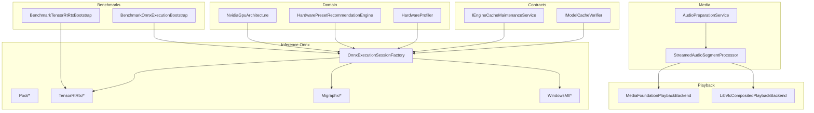
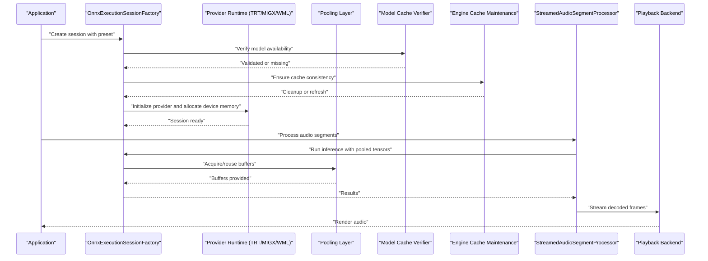

# Memory Optimization

<cite>
**Referenced Files in This Document**
- [ADR-0009-gpu-memory-budget-planner.md](file://docs/decisions/ADR-0009-gpu-memory-budget-planner.md)
- [OnnxExecutionSessionFactory.cs](file://src/Trackdub.Inference.Onnx/OnnxExecutionSessionFactory.cs)
- [Pool directory](file://src/Trackdub.Inference.Onnx/Pool/)
- [TensorRtRtx directory](file://src/Trackdub.Inference.Onnx/TensorRtRtx/)
- [Migraphx directory](file://src/Trackdub.Inference.Onnx/Migraphx/)
- [WindowsMl directory](file://src/Trackdub.Inference.Onnx/WindowsMl/)
- [WinMlCatalogRuntimeReadinessServices.cs](file://src/Trackdub.Contracts/WinMlCatalogRuntimeReadinessServices.cs)
- [BenchmarkOnnxExecutionBootstrap.cs](file://src/Trackdub.Benchmarks/BenchmarkOnnxExecutionBootstrap.cs)
- [BenchmarkTensorRtRtxBootstrap.cs](file://src/Trackdub.Benchmarks/BenchmarkTensorRtRtxBootstrap.cs)
- [HardwareProfiler.cs](file://src/Trackdub.Domain/HardwareProfiler.cs)
- [HardwarePresetRecommendationEngine.cs](file://src/Trackdub.Domain/HardwarePresetRecommendationEngine.cs)
- [NvidiaGpuArchitecture.cs](file://src/Trackdub.Domain/NvidiaGpuArchitecture.cs)
- [AudioPreparationService.cs](file://src/Trackdub.Application/Dubbing/AudioPreparationService.cs)
- [StreamedAudioSegmentProcessor.cs](file://src/Trackdub.Media/Process/StreamedAudioSegmentProcessor.cs)
- [MediaFoundationPlaybackBackend.cs](file://src/Trackdub.Media.Playback/MediaFoundationPlaybackBackend.cs)
- [LibVlcCompositedPlaybackBackend.cs](file://src/Trackdub.Media.Playback/LibVlcCompositedPlaybackBackend.cs)
- [IModelCacheVerifier.cs](file://src/Trackdub.Contracts/IModelCacheVerifier.cs)
- [IEngineCacheMaintenanceService.cs](file://src/Trackdub.Contracts/IEngineCacheMaintenanceService.cs)
- [TrackdubPipelineStages.cs](file://src/Trackdub.Sdk/TrackdubPipelineStages.cs)
- [TrackdubSession.cs](file://src/Trackdub.Sdk/TrackdubSession.cs)
</cite>

## Table of Contents
1. Introduction
2. Project Structure
3. Core Components
4. Architecture Overview
5. Detailed Component Analysis
6. Dependency Analysis
7. Performance Considerations
8. Troubleshooting Guide
9. Conclusion
10. Appendices

## Introduction
This document provides a comprehensive guide to memory optimization in Trackdub, focusing on ONNX session management, audio buffers, model weights, GPU memory allocation, memory mapping techniques, and garbage collection strategies. It also covers memory leak prevention, resource cleanup patterns, efficient streaming for large media files, memory budget planning across hardware configurations, out-of-memory (OOM) handling, graceful degradation, monitoring, bottleneck identification, and best practices for large models, batch processing, and concurrent operations.

## Project Structure
Memory-related functionality spans several layers:
- Contracts define interfaces for cache maintenance and readiness checks.
- Domain layer includes hardware profiling and GPU architecture utilities used for memory budgeting.
- Inference Onnx module implements session factories, execution providers, and pooling mechanisms.
- Media modules handle audio buffering and streaming.
- Playback backends manage media resources efficiently.
- Benchmarks bootstrap inference runtimes and can be used to validate memory behavior under load.

**Diagram sources**
- [OnnxExecutionSessionFactory.cs](file://src/Trackdub.Inference.Onnx/OnnxExecutionSessionFactory.cs)
- [Pool directory](file://src/Trackdub.Inference.Onnx/Pool/)
- [TensorRtRtx directory](file://src/Trackdub.Inference.Onnx/TensorRtRtx/)
- [Migraphx directory](file://src/Trackdub.Inference.Onnx/Migraphx/)
- [WindowsMl directory](file://src/Trackdub.Inference.Onnx/WindowsMl/)
- [IModelCacheVerifier.cs](file://src/Trackdub.Contracts/IModelCacheVerifier.cs)
- [IEngineCacheMaintenanceService.cs](file://src/Trackdub.Contracts/IEngineCacheMaintenanceService.cs)
- [HardwareProfiler.cs](file://src/Trackdub.Domain/HardwareProfiler.cs)
- [HardwarePresetRecommendationEngine.cs](file://src/Trackdub.Domain/HardwarePresetRecommendationEngine.cs)
- [NvidiaGpuArchitecture.cs](file://src/Trackdub.Domain/NvidiaGpuArchitecture.cs)
- [AudioPreparationService.cs](file://src/Trackdub.Application/Dubbing/AudioPreparationService.cs)
- [StreamedAudioSegmentProcessor.cs](file://src/Trackdub.Media/Process/StreamedAudioSegmentProcessor.cs)
- [MediaFoundationPlaybackBackend.cs](file://src/Trackdub.Media.Playback/MediaFoundationPlaybackBackend.cs)
- [LibVlcCompositedPlaybackBackend.cs](file://src/Trackdub.Media.Playback/LibVlcCompositedPlaybackBackend.cs)
- [BenchmarkOnnxExecutionBootstrap.cs](file://src/Trackdub.Benchmarks/BenchmarkOnnxExecutionBootstrap.cs)
- [BenchmarkTensorRtRtxBootstrap.cs](file://src/Trackdub.Benchmarks/BenchmarkTensorRtRtxBootstrap.cs)

**Section sources**
- [OnnxExecutionSessionFactory.cs](file://src/Trackdub.Inference.Onnx/OnnxExecutionSessionFactory.cs)
- [Pool directory](file://src/Trackdub.Inference.Onnx/Pool/)
- [TensorRtRtx directory](file://src/Trackdub.Inference.Onnx/TensorRtRtx/)
- [Migraphx directory](file://src/Trackdub.Inference.Onnx/Migraphx/)
- [WindowsMl directory](file://src/Trackdub.Inference.Onnx/WindowsMl/)
- [IModelCacheVerifier.cs](file://src/Trackdub.Contracts/IModelCacheVerifier.cs)
- [IEngineCacheMaintenanceService.cs](file://src/Trackdub.Contracts/IEngineCacheMaintenanceService.cs)
- [HardwareProfiler.cs](file://src/Trackdub.Domain/HardwareProfiler.cs)
- [HardwarePresetRecommendationEngine.cs](file://src/Trackdub.Domain/HardwarePresetRecommendationEngine.cs)
- [NvidiaGpuArchitecture.cs](file://src/Trackdub.Domain/NvidiaGpuArchitecture.cs)
- [AudioPreparationService.cs](file://src/Trackdub.Application/Dubbing/AudioPreparationService.cs)
- [StreamedAudioSegmentProcessor.cs](file://src/Trackdub.Media/Process/StreamedAudioSegmentProcessor.cs)
- [MediaFoundationPlaybackBackend.cs](file://src/Trackdub.Media.Playback/MediaFoundationPlaybackBackend.cs)
- [LibVlcCompositedPlaybackBackend.cs](file://src/Trackdub.Media.Playback/LibVlcCompositedPlaybackBackend.cs)
- [BenchmarkOnnxExecutionBootstrap.cs](file://src/Trackdub.Benchmarks/BenchmarkOnnxExecutionBootstrap.cs)
- [BenchmarkTensorRtRtxBootstrap.cs](file://src/Trackdub.Benchmarks/BenchmarkTensorRtRtxBootstrap.cs)

## Core Components
- ONNX Execution Session Factory: Centralizes creation, configuration, and lifecycle of ONNX sessions per execution provider. It coordinates with caching and hardware-aware selection to minimize redundant allocations.
- Pooling Layer: Reuses tensors and buffers to reduce GC pressure and avoid repeated allocations during inference loops.
- Execution Providers: TensorRT RTX, MIGraphX, Windows ML provide GPU/CPU acceleration paths with provider-specific memory behaviors.
- Hardware Profiling and Budgeting: Detects GPU capabilities and recommends presets that fit within available memory budgets.
- Audio Preparation and Streaming: Processes audio in segments, streams data, and avoids loading entire files into memory.
- Playback Backends: Efficiently stream and render audio while minimizing buffer copies and memory spikes.
- Cache Maintenance and Verification: Ensures model caches are consistent and cleans up stale artifacts to free memory.

**Section sources**
- [OnnxExecutionSessionFactory.cs](file://src/Trackdub.Inference.Onnx/OnnxExecutionSessionFactory.cs)
- [Pool directory](file://src/Trackdub.Inference.Onnx/Pool/)
- [TensorRtRtx directory](file://src/Trackdub.Inference.Onnx/TensorRtRtx/)
- [Migraphx directory](file://src/Trackdub.Inference.Onnx/Migraphx/)
- [WindowsMl directory](file://src/Trackdub.Inference.Onnx/WindowsMl/)
- [HardwareProfiler.cs](file://src/Trackdub.Domain/HardwareProfiler.cs)
- [HardwarePresetRecommendationEngine.cs](file://src/Trackdub.Domain/HardwarePresetRecommendationEngine.cs)
- [AudioPreparationService.cs](file://src/Trackdub.Application/Dubbing/AudioPreparationService.cs)
- [StreamedAudioSegmentProcessor.cs](file://src/Trackdub.Media/Process/StreamedAudioSegmentProcessor.cs)
- [MediaFoundationPlaybackBackend.cs](file://src/Trackdub.Media.Playback/MediaFoundationPlaybackBackend.cs)
- [LibVlcCompositedPlaybackBackend.cs](file://src/Trackdub.Media.Playback/LibVlcCompositedPlaybackBackend.cs)
- [IModelCacheVerifier.cs](file://src/Trackdub.Contracts/IModelCacheVerifier.cs)
- [IEngineCacheMaintenanceService.cs](file://src/Trackdub.Contracts/IEngineCacheMaintenanceService.cs)

## Architecture Overview
The memory optimization architecture integrates session factory orchestration, provider-specific runtime behavior, pooling, and streaming pipelines. Hardware profiling informs preset selection to keep memory usage within safe bounds. Caching ensures model weights are reused without reloading. Playback backends stream media to avoid full-file loads.

**Diagram sources**
- [OnnxExecutionSessionFactory.cs](file://src/Trackdub.Inference.Onnx/OnnxExecutionSessionFactory.cs)
- [TensorRtRtx directory](file://src/Trackdub.Inference.Onnx/TensorRtRtx/)
- [Migraphx directory](file://src/Trackdub.Inference.Onnx/Migraphx/)
- [WindowsMl directory](file://src/Trackdub.Inference.Onnx/WindowsMl/)
- [Pool directory](file://src/Trackdub.Inference.Onnx/Pool/)
- [IModelCacheVerifier.cs](file://src/Trackdub.Contracts/IModelCacheVerifier.cs)
- [IEngineCacheMaintenanceService.cs](file://src/Trackdub.Contracts/IEngineCacheMaintenanceService.cs)
- [StreamedAudioSegmentProcessor.cs](file://src/Trackdub.Media/Process/StreamedAudioSegmentProcessor.cs)
- [MediaFoundationPlaybackBackend.cs](file://src/Trackdub.Media.Playback/MediaFoundationPlaybackBackend.cs)
- [LibVlcCompositedPlaybackBackend.cs](file://src/Trackdub.Media.Playback/LibVlcCompositedPlaybackBackend.cs)

## Detailed Component Analysis

### ONNX Execution Session Factory
Responsibilities:
- Create and configure ONNX sessions tailored to the selected execution provider.
- Integrate with hardware profiling to choose appropriate presets and memory budgets.
- Coordinate with model cache verification and engine cache maintenance to avoid redundant allocations.
- Manage session lifetimes and ensure proper disposal to prevent leaks.

Optimization considerations:
- Use provider-specific initialization flags to control memory growth and fragmentation.
- Prefer session reuse where possible; create new sessions only when necessary.
- Align tensor shapes and dtypes with provider capabilities to reduce conversions.

**Section sources**
- [OnnxExecutionSessionFactory.cs](file://src/Trackdub.Inference.Onnx/OnnxExecutionSessionFactory.cs)
- [IModelCacheVerifier.cs](file://src/Trackdub.Contracts/IModelCacheVerifier.cs)
- [IEngineCacheMaintenanceService.cs](file://src/Trackdub.Contracts/IEngineCacheMaintenanceService.cs)
- [HardwareProfiler.cs](file://src/Trackdub.Domain/HardwareProfiler.cs)
- [HardwarePresetRecommendationEngine.cs](file://src/Trackdub.Domain/HardwarePresetRecommendationEngine.cs)

### Pooling Layer
Responsibilities:
- Provide reusable buffers for tensors and intermediate results.
- Reduce GC pressure by avoiding frequent allocations during inference loops.
- Support different dtypes and shapes with careful sizing policies.

Optimization considerations:
- Size pools based on expected max tensor dimensions to avoid resizing overhead.
- Implement eviction policies to release unused buffers under memory pressure.
- Ensure thread-safety if pools are shared across concurrent operations.

**Section sources**
- [Pool directory](file://src/Trackdub.Inference.Onnx/Pool/)

### Execution Providers (TensorRT RTX, MIGraphX, Windows ML)
Responsibilities:
- Execute ONNX models on GPU/CPU with provider-specific optimizations.
- Allocate and manage device memory for model weights and activations.
- Expose APIs for controlling memory behavior (e.g., graph optimization levels).

Optimization considerations:
- Select optimal precision (FP16/INT8) supported by the provider to reduce memory footprint.
- Tune compilation options to balance memory vs. performance.
- Monitor provider memory usage and fall back gracefully if OOM occurs.

**Section sources**
- [TensorRtRtx directory](file://src/Trackdub.Inference.Onnx/TensorRtRtx/)
- [Migraphx directory](file://src/Trackdub.Inference.Onnx/Migraphx/)
- [WindowsMl directory](file://src/Trackdub.Inference.Onnx/WindowsMl/)
- [WinMlCatalogRuntimeReadinessServices.cs](file://src/Trackdub.Contracts/WinMlCatalogRuntimeReadinessServices.cs)

### Hardware Profiling and Memory Budget Planning
Responsibilities:
- Detect GPU architecture and available memory.
- Recommend presets that fit within memory constraints.
- Provide guidance for selecting execution providers and model variants.

Optimization considerations:
- Use NvidiaGpuArchitecture to tailor memory settings per GPU generation.
- Apply ADR-0009 guidelines for budget planning and fallback strategies.
- Combine profiling with runtime telemetry to adjust budgets dynamically.

**Section sources**
- [HardwareProfiler.cs](file://src/Trackdub.Domain/HardwareProfiler.cs)
- [HardwarePresetRecommendationEngine.cs](file://src/Trackdub.Domain/HardwarePresetRecommendationEngine.cs)
- [NvidiaGpuArchitecture.cs](file://src/Trackdub.Domain/NvidiaGpuArchitecture.cs)
- [ADR-0009-gpu-memory-budget-planner.md](file://docs/decisions/ADR-0009-gpu-memory-budget-planner.md)

### Audio Preparation and Streaming
Responsibilities:
- Process audio in segments to avoid loading entire files into memory.
- Stream decoded frames to playback backends for low-latency rendering.
- Maintain consistent sample rates and formats to minimize conversions.

Optimization considerations:
- Use chunked reading and circular buffers to cap memory usage.
- Avoid unnecessary copies between buffers; prefer zero-copy where feasible.
- Handle backpressure from slow consumers to prevent unbounded growth.

**Section sources**
- [AudioPreparationService.cs](file://src/Trackdub.Application/Dubbing/AudioPreparationService.cs)
- [StreamedAudioSegmentProcessor.cs](file://src/Trackdub.Media/Process/StreamedAudioSegmentProcessor.cs)
- [MediaFoundationPlaybackBackend.cs](file://src/Trackdub.Media.Playback/MediaFoundationPlaybackBackend.cs)
- [LibVlcCompositedPlaybackBackend.cs](file://src/Trackdub.Media.Playback/LibVlcCompositedPlaybackBackend.cs)

### Playback Backends
Responsibilities:
- Render audio streams efficiently using platform-native libraries.
- Manage buffers and synchronization to avoid stuttering and memory spikes.
- Provide fallbacks when native components are unavailable.

Optimization considerations:
- Configure buffer sizes to balance latency and memory usage.
- Release resources promptly after playback ends.
- Monitor backend memory usage and switch providers if needed.

**Section sources**
- [MediaFoundationPlaybackBackend.cs](file://src/Trackdub.Media.Playback/MediaFoundationPlaybackBackend.cs)
- [LibVlcCompositedPlaybackBackend.cs](file://src/Trackdub.Media.Playback/LibVlcCompositedPlaybackBackend.cs)

### Benchmark Bootstraps
Responsibilities:
- Initialize inference runtimes for benchmarking scenarios.
- Validate memory behavior under controlled workloads.
- Provide insights into provider-specific memory characteristics.

Optimization considerations:
- Use benchmarks to measure peak memory and identify hotspots.
- Compare provider performance and memory footprints across datasets.
- Iterate on presets and pooling strategies based on benchmark results.

**Section sources**
- [BenchmarkOnnxExecutionBootstrap.cs](file://src/Trackdub.Benchmarks/BenchmarkOnnxExecutionBootstrap.cs)
- [BenchmarkTensorRtRtxBootstrap.cs](file://src/Trackdub.Benchmarks/BenchmarkTensorRtRtxBootstrap.cs)

## Dependency Analysis
Key dependencies and relationships:
- Session Factory depends on cache verifier and maintenance services to ensure model availability and consistency.
- Execution Providers depend on hardware profiling to select appropriate memory budgets and precisions.
- Audio streaming depends on playback backends to render frames without excessive buffering.
- Benchmarks depend on session factory and providers to validate memory behavior.

```mermaid
classDiagram
class OnnxExecutionSessionFactory {
+createSession(preset)
+dispose()
}
class IModelCacheVerifier {
+verify(modelPath) bool
}
class IEngineCacheMaintenanceService {
+maintain() void
}
class HardwareProfiler {
+detect() HardwareInfo
}
class HardwarePresetRecommendationEngine {
+recommend(info) Preset
}
class NvidiaGpuArchitecture {
+getCapabilities() GpuCaps
}
class TensorRtRtxProvider {
+init(options)
+run(inputs) outputs
}
class MigraphxProvider {
+init(options)
+run(inputs) outputs
}
class WindowsMlProvider {
+init(options)
+run(inputs) outputs
}
class StreamedAudioSegmentProcessor {
+processSegments(stream)
}
class MediaFoundationPlaybackBackend {
+play(buffer)
}
class LibVlcCompositedPlaybackBackend {
+play(buffer)
}
OnnxExecutionSessionFactory --> IModelCacheVerifier : "uses"
OnnxExecutionSessionFactory --> IEngineCacheMaintenanceService : "uses"
OnnxExecutionSessionFactory --> HardwareProfiler : "uses"
OnnxExecutionSessionFactory --> HardwarePresetRecommendationEngine : "uses"
OnnxExecutionSessionFactory --> NvidiaGpuArchitecture : "uses"
OnnxExecutionSessionFactory --> TensorRtRtxProvider : "initializes"
OnnxExecutionSessionFactory --> MigraphxProvider : "initializes"
OnnxExecutionSessionFactory --> WindowsMlProvider : "initializes"
StreamedAudioSegmentProcessor --> MediaFoundationPlaybackBackend : "streams to"
StreamedAudioSegmentProcessor --> LibVlcCompositedPlaybackBackend : "streams to"
```

**Diagram sources**
- [OnnxExecutionSessionFactory.cs](file://src/Trackdub.Inference.Onnx/OnnxExecutionSessionFactory.cs)
- [IModelCacheVerifier.cs](file://src/Trackdub.Contracts/IModelCacheVerifier.cs)
- [IEngineCacheMaintenanceService.cs](file://src/Trackdub.Contracts/IEngineCacheMaintenanceService.cs)
- [HardwareProfiler.cs](file://src/Trackdub.Domain/HardwareProfiler.cs)
- [HardwarePresetRecommendationEngine.cs](file://src/Trackdub.Domain/HardwarePresetRecommendationEngine.cs)
- [NvidiaGpuArchitecture.cs](file://src/Trackdub.Domain/NvidiaGpuArchitecture.cs)
- [TensorRtRtx directory](file://src/Trackdub.Inference.Onnx/TensorRtRtx/)
- [Migraphx directory](file://src/Trackdub.Inference.Onnx/Migraphx/)
- [WindowsMl directory](file://src/Trackdub.Inference.Onnx/WindowsMl/)
- [StreamedAudioSegmentProcessor.cs](file://src/Trackdub.Media/Process/StreamedAudioSegmentProcessor.cs)
- [MediaFoundationPlaybackBackend.cs](file://src/Trackdub.Media.Playback/MediaFoundationPlaybackBackend.cs)
- [LibVlcCompositedPlaybackBackend.cs](file://src/Trackdub.Media.Playback/LibVlcCompositedPlaybackBackend.cs)

**Section sources**
- [OnnxExecutionSessionFactory.cs](file://src/Trackdub.Inference.Onnx/OnnxExecutionSessionFactory.cs)
- [IModelCacheVerifier.cs](file://src/Trackdub.Contracts/IModelCacheVerifier.cs)
- [IEngineCacheMaintenanceService.cs](file://src/Trackdub.Contracts/IEngineCacheMaintenanceService.cs)
- [HardwareProfiler.cs](file://src/Trackdub.Domain/HardwareProfiler.cs)
- [HardwarePresetRecommendationEngine.cs](file://src/Trackdub.Domain/HardwarePresetRecommendationEngine.cs)
- [NvidiaGpuArchitecture.cs](file://src/Trackdub.Domain/NvidiaGpuArchitecture.cs)
- [TensorRtRtx directory](file://src/Trackdub.Inference.Onnx/TensorRtRtx/)
- [Migraphx directory](file://src/Trackdub.Inference.Onnx/Migraphx/)
- [WindowsMl directory](file://src/Trackdub.Inference.Onnx/WindowsMl/)
- [StreamedAudioSegmentProcessor.cs](file://src/Trackdub.Media/Process/StreamedAudioSegmentProcessor.cs)
- [MediaFoundationPlaybackBackend.cs](file://src/Trackdub.Media.Playback/MediaFoundationPlaybackBackend.cs)
- [LibVlcCompositedPlaybackBackend.cs](file://src/Trackdub.Media.Playback/LibVlcCompositedPlaybackBackend.cs)

## Performance Considerations
- Memory Pool Sizing: Size pools based on maximum expected tensor dimensions to avoid resizing overhead.
- Precision Selection: Use FP16 or INT8 where supported to reduce memory footprint and improve throughput.
- Session Reuse: Reuse sessions across batches to minimize allocation churn.
- Streaming Buffers: Keep buffer sizes small and aligned with consumer consumption rates to prevent spikes.
- Provider Tuning: Adjust provider options (e.g., graph optimization level) to balance memory vs. speed.
- Concurrency Control: Limit parallelism to stay within memory budgets; use backpressure to throttle producers.
- Garbage Collection: Minimize object churn by reusing buffers and avoiding temporary allocations in hot paths.

[No sources needed since this section provides general guidance]

## Troubleshooting Guide
Common issues and resolutions:
- Out-of-Memory Errors:
  - Reduce batch size or segment length.
  - Switch to lower precision models or smaller variants.
  - Increase pool eviction aggressiveness.
- Memory Leaks:
  - Ensure sessions and providers are disposed properly.
  - Verify buffers are released after use.
  - Check for long-lived references holding onto large objects.
- High GC Pressure:
  - Replace allocations with pooled buffers.
  - Avoid creating temporary arrays in tight loops.
  - Use struct-based data where possible.
- Slow Rendering or Stuttering:
  - Tune playback buffer sizes.
  - Ensure streaming rate matches consumer consumption.
  - Monitor CPU/GPU utilization to identify bottlenecks.

Monitoring and diagnostics:
- Use benchmarks to measure memory peaks and trends.
- Log provider memory usage and session lifecycle events.
- Track audio buffer sizes and frame rates to detect backpressure issues.

**Section sources**
- [ADR-0009-gpu-memory-budget-planner.md](file://docs/decisions/ADR-0009-gpu-memory-budget-planner.md)
- [BenchmarkOnnxExecutionBootstrap.cs](file://src/Trackdub.Benchmarks/BenchmarkOnnxExecutionBootstrap.cs)
- [BenchmarkTensorRtRtxBootstrap.cs](file://src/Trackdub.Benchmarks/BenchmarkTensorRtRtxBootstrap.cs)

## Conclusion
Effective memory optimization in Trackdub requires coordinated efforts across session management, pooling, provider tuning, streaming, and playback. By leveraging hardware profiling, adhering to budget planning guidelines, and implementing robust cleanup and monitoring practices, the system can maintain stable performance across diverse hardware configurations while handling large media files and concurrent operations efficiently.

[No sources needed since this section summarizes without analyzing specific files]

## Appendices

### Best Practices Summary
- Plan memory budgets per hardware profile and enforce them at runtime.
- Prefer streaming over full-file loads for large media.
- Reuse sessions and buffers to reduce allocations.
- Choose provider-specific optimizations aligned with device capabilities.
- Monitor memory usage continuously and adapt dynamically.

[No sources needed since this section provides general guidance]