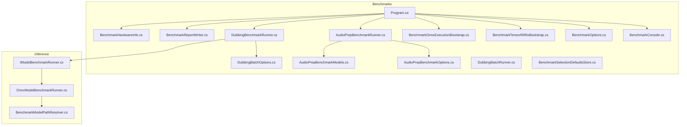
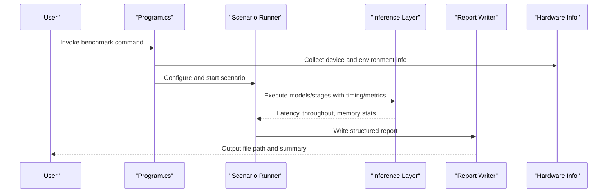
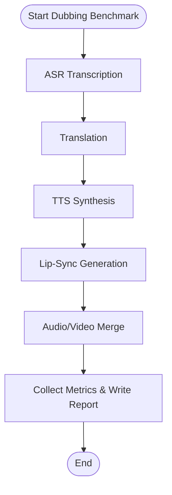
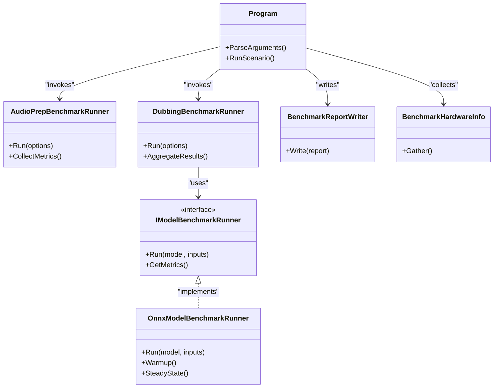

# Performance Monitoring & Benchmarking

<cite>
**Referenced Files in This Document**
- [Program.cs](file://src/Trackdub.Benchmarks/Program.cs)
- [BenchmarkConsole.cs](file://src/Trackdub.Benchmarks/BenchmarkConsole.cs)
- [BenchmarkOptions.cs](file://src/Trackdub.Benchmarks/BenchmarkOptions.cs)
- [BenchmarkReportWriter.cs](file://src/Trackdub.Benchmarks/BenchmarkReportWriter.cs)
- [BenchmarkHardwareInfo.cs](file://src/Trackdub.Benchmarks/BenchmarkHardwareInfo.cs)
- [AudioPrepBenchmarkRunner.cs](file://src/Trackdub.Benchmarks/AudioPrepBenchmarkRunner.cs)
- [DubbingBenchmarkRunner.cs](file://src/Trackdub.Benchmarks/DubbingBenchmarkRunner.cs)
- [AudioPrepBenchmarkModels.cs](file://src/Trackdub.Benchmarks/AudioPrepBenchmarkModels.cs)
- [AudioPrepBenchmarkOptions.cs](file://src/Trackdub.Benchmarks/AudioPrepBenchmarkOptions.cs)
- [DubbingBatchRunner.cs](file://src/Trackdub.Benchmarks/DubbingBatchRunner.cs)
- [DubbingBatchOptions.cs](file://src/Trackdub.Benchmarks/DubbingBatchOptions.cs)
- [BenchmarkSelectionDefaultsStore.cs](file://src/Trackdub.Benchmarks/BenchmarkSelectionDefaultsStore.cs)
- [BenchmarkTensorRtRtxBootstrap.cs](file://src/Trackdub.Benchmarks/BenchmarkTensorRtRtxBootstrap.cs)
- [BenchmarkOnnxExecutionBootstrap.cs](file://src/Trackdub.Benchmarks/BenchmarkOnnxExecutionBootstrap.cs)
- [IModelBenchmarkRunner.cs](file://src/Trackdub.Inference/IModelBenchmarkRunner.cs)
- [OnnxModelBenchmarkRunner.cs](file://src/Trackdub.Inference.Onnx/OnnxModelBenchmarkRunner.cs)
- [BenchmarkModelPathResolver.cs](file://src/Trackdub.Inference.Onnx/BenchmarkModelPathResolver.cs)
- [README.md](file://src/Trackdub.Benchmarks/README.md)
- [profiling-report.md](file://docs/reference/profiling-report.md)
- [Trackdub.Contracts.csproj](file://src/Trackdub.Contracts/Trackdub.Contracts.csproj)
- [Trackdub.Benchmarks.csproj](file://src/Trackdub.Benchmarks/Trackdub.Benchmarks.csproj)
</cite>

## Table of Contents
1. [Introduction](#introduction)
2. [Project Structure](#project-structure)
3. [Core Components](#core-components)
4. [Architecture Overview](#architecture-overview)
5. [Detailed Component Analysis](#detailed-component-analysis)
6. [Dependency Analysis](#dependency-analysis)
7. [Performance Considerations](#performance-considerations)
8. [Troubleshooting Guide](#troubleshooting-guide)
9. [Conclusion](#conclusion)
10. [Appendices](#appendices)

## Introduction
This document explains Trackdub’s performance monitoring and benchmarking capabilities for the ASR, translation, TTS, and lip-sync pipelines. It covers how to run benchmarks, interpret results, compare across hardware configurations, and use built-in monitoring tools to track GPU utilization, memory usage, CPU load, and pipeline throughput. It also documents custom benchmark creation, regression testing, continuous integration setup, bottleneck identification, profiling data analysis, optimization strategies, report formats, metrics collection, and visualization approaches.

## Project Structure
The benchmarking system is implemented primarily under src/Trackdub.Benchmarks with supporting runtime and inference components in src/Trackdub.Inference and src/Trackdub.Inference.Onnx. The CLI entry point for benchmarks is Program.cs, which wires options, bootstraps execution providers, and delegates to scenario runners (audio preparation and dubbing). Reports are written by a dedicated writer, and hardware information is collected via a hardware info utility.

**Diagram sources**
- [Program.cs](file://src/Trackdub.Benchmarks/Program.cs)
- [BenchmarkConsole.cs](file://src/Trackdub.Benchmarks/BenchmarkConsole.cs)
- [BenchmarkOptions.cs](file://src/Trackdub.Benchmarks/BenchmarkOptions.cs)
- [BenchmarkReportWriter.cs](file://src/Trackdub.Benchmarks/BenchmarkReportWriter.cs)
- [BenchmarkHardwareInfo.cs](file://src/Trackdub.Benchmarks/BenchmarkHardwareInfo.cs)
- [AudioPrepBenchmarkRunner.cs](file://src/Trackdub.Benchmarks/AudioPrepBenchmarkRunner.cs)
- [DubbingBenchmarkRunner.cs](file://src/Trackdub.Benchmarks/DubbingBenchmarkRunner.cs)
- [AudioPrepBenchmarkOptions.cs](file://src/Trackdub.Benchmarks/AudioPrepBenchmarkOptions.cs)
- [AudioPrepBenchmarkModels.cs](file://src/Trackdub.Benchmarks/AudioPrepBenchmarkModels.cs)
- [DubbingBatchOptions.cs](file://src/Trackdub.Benchmarks/DubbingBatchOptions.cs)
- [DubbingBatchRunner.cs](file://src/Trackdub.Benchmarks/DubbingBatchRunner.cs)
- [BenchmarkSelectionDefaultsStore.cs](file://src/Trackdub.Benchmarks/BenchmarkSelectionDefaultsStore.cs)
- [BenchmarkTensorRtRtxBootstrap.cs](file://src/Trackdub.Benchmarks/BenchmarkTensorRtRtxBootstrap.cs)
- [BenchmarkOnnxExecutionBootstrap.cs](file://src/Trackdub.Benchmarks/BenchmarkOnnxExecutionBootstrap.cs)
- [IModelBenchmarkRunner.cs](file://src/Trackdub.Inference/IModelBenchmarkRunner.cs)
- [OnnxModelBenchmarkRunner.cs](file://src/Trackdub.Inference.Onnx/OnnxModelBenchmarkRunner.cs)
- [BenchmarkModelPathResolver.cs](file://src/Trackdub.Inference.Onnx/BenchmarkModelPathResolver.cs)

**Section sources**
- [Program.cs](file://src/Trackdub.Benchmarks/Program.cs)
- [README.md](file://src/Trackdub.Benchmarks/README.md)

## Core Components
- Entry and orchestration: Program.cs initializes command-line parsing, selects scenarios, and invokes runners.
- Console and options: BenchmarkConsole.cs provides interactive or scripted flows; BenchmarkOptions.cs centralizes configuration.
- Scenario runners: AudioPrepBenchmarkRunner.cs measures audio preparation stages; DubbingBenchmarkRunner.cs measures full dubbing pipeline including ASR, translation, TTS, and lip-sync.
- Report writer: BenchmarkReportWriter.cs serializes results into structured reports for comparison and CI.
- Hardware info: BenchmarkHardwareInfo.cs collects device details (GPU/CPU/memory) to contextualize results.
- Execution provider bootstrap: BenchmarkTensorRtRtxBootstrap.cs and BenchmarkOnnxExecutionBootstrap.cs prepare ONNX Runtime environments for consistent runs.
- Inference-level benchmarking: IModelBenchmarkRunner.cs defines the interface; OnnxModelBenchmarkRunner.cs implements ONNX-based model benchmarking; BenchmarkModelPathResolver.cs resolves model paths for reproducible runs.

Key responsibilities:
- Metrics collection: latency, throughput, memory footprint, device utilization snapshots.
- Reproducibility: deterministic model resolution, fixed seeds where applicable, stable execution provider configuration.
- Extensibility: new scenarios can be added by implementing runner interfaces and wiring them in Program.cs.

**Section sources**
- [Program.cs](file://src/Trackdub.Benchmarks/Program.cs)
- [BenchmarkConsole.cs](file://src/Trackdub.Benchmarks/BenchmarkConsole.cs)
- [BenchmarkOptions.cs](file://src/Trackdub.Benchmarks/BenchmarkOptions.cs)
- [AudioPrepBenchmarkRunner.cs](file://src/Trackdub.Benchmarks/AudioPrepBenchmarkRunner.cs)
- [DubbingBenchmarkRunner.cs](file://src/Trackdub.Benchmarks/DubbingBenchmarkRunner.cs)
- [BenchmarkReportWriter.cs](file://src/Trackdub.Benchmarks/BenchmarkReportWriter.cs)
- [BenchmarkHardwareInfo.cs](file://src/Trackdub.Benchmarks/BenchmarkHardwareInfo.cs)
- [BenchmarkTensorRtRtxBootstrap.cs](file://src/Trackdub.Benchmarks/BenchmarkTensorRtRtxBootstrap.cs)
- [BenchmarkOnnxExecutionBootstrap.cs](file://src/Trackdub.Benchmarks/BenchmarkOnnxExecutionBootstrap.cs)
- [IModelBenchmarkRunner.cs](file://src/Trackdub.Inference/IModelBenchmarkRunner.cs)
- [OnnxModelBenchmarkRunner.cs](file://src/Trackdub.Inference.Onnx/OnnxModelBenchmarkRunner.cs)
- [BenchmarkModelPathResolver.cs](file://src/Trackdub.Inference.Onnx/BenchmarkModelPathResolver.cs)

## Architecture Overview
The benchmarking architecture separates concerns between orchestration, scenario execution, and reporting. Runners encapsulate pipeline-specific logic while leveraging shared infrastructure for model resolution, execution provider setup, and metrics capture.

**Diagram sources**
- [Program.cs](file://src/Trackdub.Benchmarks/Program.cs)
- [AudioPrepBenchmarkRunner.cs](file://src/Trackdub.Benchmarks/AudioPrepBenchmarkRunner.cs)
- [DubbingBenchmarkRunner.cs](file://src/Trackdub.Benchmarks/DubbingBenchmarkRunner.cs)
- [BenchmarkReportWriter.cs](file://src/Trackdub.Benchmarks/BenchmarkReportWriter.cs)
- [BenchmarkHardwareInfo.cs](file://src/Trackdub.Benchmarks/BenchmarkHardwareInfo.cs)
- [IModelBenchmarkRunner.cs](file://src/Trackdub.Inference/IModelBenchmarkRunner.cs)
- [OnnxModelBenchmarkRunner.cs](file://src/Trackdub.Inference.Onnx/OnnxModelBenchmarkRunner.cs)

## Detailed Component Analysis

### Benchmark Orchestration and Options
- Program.cs coordinates command parsing, scenario selection, and runner invocation.
- BenchmarkOptions.cs centralizes flags such as target devices, model variants, iteration counts, and output paths.
- BenchmarkConsole.cs supports both interactive prompts and non-interactive batch modes.

Best practices:
- Pin model versions and execution providers for reproducibility.
- Use consistent input media sizes and durations for fair comparisons.
- Enable detailed logging only when needed to avoid overhead.

**Section sources**
- [Program.cs](file://src/Trackdub.Benchmarks/Program.cs)
- [BenchmarkOptions.cs](file://src/Trackdub.Benchmarks/BenchmarkOptions.cs)
- [BenchmarkConsole.cs](file://src/Trackdub.Benchmarks/BenchmarkConsole.cs)

### Audio Preparation Benchmark Runner
- AudioPrepBenchmarkRunner.cs measures preprocessing steps like decoding, normalization, segmentation, and enhancement.
- AudioPrepBenchmarkOptions.cs configures segment lengths, sample rates, and processing chains.
- AudioPrepBenchmarkModels.cs provides default model selections for audio tasks.

Metrics captured:
- Stage-level latency percentiles (p50, p95, p99).
- Throughput (samples/sec, segments/sec).
- Memory growth per stage.

Optimization tips:
- Batch small segments to reduce overhead.
- Reuse decoders and buffers across segments.
- Prefer GPU-accelerated kernels where available.

**Section sources**
- [AudioPrepBenchmarkRunner.cs](file://src/Trackdub.Benchmarks/AudioPrepBenchmarkRunner.cs)
- [AudioPrepBenchmarkOptions.cs](file://src/Trackdub.Benchmarks/AudioPrepBenchmarkOptions.cs)
- [AudioPrepBenchmarkModels.cs](file://src/Trackdub.Benchmarks/AudioPrepBenchmarkModels.cs)

### Dubbing Pipeline Benchmark Runner
- DubbingBenchmarkRunner.cs orchestrates ASR, translation, TTS, and lip-sync stages, collecting end-to-end and per-stage metrics.
- DubbingBatchOptions.cs controls batch size, concurrency, and pipeline presets.
- DubbingBatchRunner.cs handles multi-file batches and aggregates results.

Pipeline flow:

**Diagram sources**
- [DubbingBenchmarkRunner.cs](file://src/Trackdub.Benchmarks/DubbingBenchmarkRunner.cs)
- [DubbingBatchOptions.cs](file://src/Trackdub.Benchmarks/DubbingBatchOptions.cs)
- [DubbingBatchRunner.cs](file://src/Trackdub.Benchmarks/DubbingBatchRunner.cs)

**Section sources**
- [DubbingBenchmarkRunner.cs](file://src/Trackdub.Benchmarks/DubbingBenchmarkRunner.cs)
- [DubbingBatchOptions.cs](file://src/Trackdub.Benchmarks/DubbingBatchOptions.cs)
- [DubbingBatchRunner.cs](file://src/Trackdub.Benchmarks/DubbingBatchRunner.cs)

### Model-Level Benchmarking Interface and ONNX Implementation
- IModelBenchmarkRunner.cs defines the contract for running model benchmarks with standardized metrics.
- OnnxModelBenchmarkRunner.cs implements ONNX Runtime-based execution, capturing warm-up, cold-start, and steady-state performance.
- BenchmarkModelPathResolver.cs ensures deterministic model resolution across runs.

Key behaviors:
- Warm-up iterations to stabilize JIT compilation and memory allocation.
- Iteration averaging and outlier filtering for robust statistics.
- Device affinity and execution provider selection for optimal performance.

**Section sources**
- [IModelBenchmarkRunner.cs](file://src/Trackdub.Inference/IModelBenchmarkRunner.cs)
- [OnnxModelBenchmarkRunner.cs](file://src/Trackdub.Inference.Onnx/OnnxModelBenchmarkRunner.cs)
- [BenchmarkModelPathResolver.cs](file://src/Trackdub.Inference.Onnx/BenchmarkModelPathResolver.cs)

### Reporting and Hardware Context
- BenchmarkReportWriter.cs outputs structured reports suitable for CI validation and trend analysis.
- BenchmarkHardwareInfo.cs captures CPU/GPU specs, driver versions, and memory capacity to contextualize results.
- BenchmarkSelectionDefaultsStore.cs provides baseline selections for consistent comparisons.

Report contents typically include:
- Environment metadata (OS, drivers, device list).
- Scenario configuration (models, options, inputs).
- Per-stage and end-to-end metrics (latency, throughput, memory).
- Aggregated summaries and pass/fail thresholds for regression detection.

**Section sources**
- [BenchmarkReportWriter.cs](file://src/Trackdub.Benchmarks/BenchmarkReportWriter.cs)
- [BenchmarkHardwareInfo.cs](file://src/Trackdub.Benchmarks/BenchmarkHardwareInfo.cs)
- [BenchmarkSelectionDefaultsStore.cs](file://src/Trackdub.Benchmarks/BenchmarkSelectionDefaultsStore.cs)

### Execution Provider Bootstrapping
- BenchmarkTensorRtRtxBootstrap.cs prepares TensorRT RTX execution provider for NVIDIA GPUs.
- BenchmarkOnnxExecutionBootstrap.cs sets up ONNX Runtime with appropriate providers and session options.

Recommendations:
- Validate provider availability before benchmark runs.
- Pin provider versions to avoid drift across environments.
- Log provider initialization failures clearly for troubleshooting.

**Section sources**
- [BenchmarkTensorRtRtxBootstrap.cs](file://src/Trackdub.Benchmarks/BenchmarkTensorRtRtxBootstrap.cs)
- [BenchmarkOnnxExecutionBootstrap.cs](file://src/Trackdub.Benchmarks/BenchmarkOnnxExecutionBootstrap.cs)

## Dependency Analysis
The benchmarking layer depends on inference abstractions and ONNX runtime implementations. Contracts define interfaces that ensure decoupling between benchmark orchestration and model execution.

**Diagram sources**
- [Program.cs](file://src/Trackdub.Benchmarks/Program.cs)
- [AudioPrepBenchmarkRunner.cs](file://src/Trackdub.Benchmarks/AudioPrepBenchmarkRunner.cs)
- [DubbingBenchmarkRunner.cs](file://src/Trackdub.Benchmarks/DubbingBenchmarkRunner.cs)
- [IModelBenchmarkRunner.cs](file://src/Trackdub.Inference/IModelBenchmarkRunner.cs)
- [OnnxModelBenchmarkRunner.cs](file://src/Trackdub.Inference.Onnx/OnnxModelBenchmarkRunner.cs)
- [BenchmarkReportWriter.cs](file://src/Trackdub.Benchmarks/BenchmarkReportWriter.cs)
- [BenchmarkHardwareInfo.cs](file://src/Trackdub.Benchmarks/BenchmarkHardwareInfo.cs)

**Section sources**
- [Trackdub.Contracts.csproj](file://src/Trackdub.Contracts/Trackdub.Contracts.csproj)
- [Trackdub.Benchmarks.csproj](file://src/Trackdub.Benchmarks/Trackdub.Benchmarks.csproj)

## Performance Considerations
- Warm-up and steady-state: Always include warm-up iterations to account for JIT compilation and memory allocator behavior. Measure steady-state after stabilization.
- Input consistency: Use fixed audio durations, sample rates, and content types to minimize variance.
- Concurrency control: Tune parallelism carefully; excessive concurrency can cause contention and inflate latencies.
- Execution provider selection: Prefer GPU providers when available; fall back to CPU with clear logging.
- Memory management: Monitor peak memory and leaks; reuse buffers where possible.
- Data movement: Minimize host-device transfers; batch operations to amortize overhead.
- Profiling overhead: Disable heavy logging during measurement passes; enable only for targeted investigations.

[No sources needed since this section provides general guidance]

## Troubleshooting Guide
Common issues and resolutions:
- Execution provider not found: Verify GPU drivers and provider DLLs; check bootstrap logs for initialization errors.
- Out-of-memory errors: Reduce batch size, lower precision, or switch to CPU if necessary; monitor memory peaks.
- High variance in results: Increase warm-up iterations, fix random seeds, and isolate background processes.
- Slow startup times: Pre-warm models and providers; cache compiled graphs where supported.
- Missing model files: Ensure BenchmarkModelPathResolver finds expected artifacts; validate manifests and paths.

Diagnostic resources:
- Review profiling report documentation for metric definitions and interpretation.
- Inspect generated benchmark reports for anomalies and trends.

**Section sources**
- [profiling-report.md](file://docs/reference/profiling-report.md)

## Conclusion
Trackdub’s benchmarking framework provides a comprehensive, extensible system for measuring ASR, translation, TTS, and lip-sync pipeline performance. By standardizing model resolution, execution provider setup, and metrics collection, it enables reliable comparisons across hardware configurations and supports continuous integration workflows. Use the runners and reporting tools to identify bottlenecks, validate optimizations, and maintain performance regressions over time.

[No sources needed since this section summarizes without analyzing specific files]

## Appendices

### How to Run Benchmarks
- Select scenario: audio preparation or full dubbing pipeline.
- Configure options: models, devices, iterations, input media, and output directory.
- Execute via Program.cs entry point; console mode supports interactive or scripted runs.
- Inspect generated reports for per-stage and end-to-end metrics.

**Section sources**
- [Program.cs](file://src/Trackdub.Benchmarks/Program.cs)
- [BenchmarkConsole.cs](file://src/Trackdub.Benchmarks/BenchmarkConsole.cs)
- [BenchmarkOptions.cs](file://src/Trackdub.Benchmarks/BenchmarkOptions.cs)

### Interpreting Results
- Latency percentiles: Focus on p95/p99 for tail latency-sensitive applications.
- Throughput: Evaluate samples/sec or segments/sec relative to hardware capabilities.
- Memory: Track peak usage and growth patterns; watch for leaks across long runs.
- Device utilization: Correlate GPU/CPU usage with stage timings to find underutilized components.

**Section sources**
- [BenchmarkReportWriter.cs](file://src/Trackdub.Benchmarks/BenchmarkReportWriter.cs)
- [BenchmarkHardwareInfo.cs](file://src/Trackdub.Benchmarks/BenchmarkHardwareInfo.cs)

### Custom Benchmark Creation
- Implement a new runner adhering to existing patterns: configure inputs, execute stages, collect metrics, and write reports.
- Wire the runner into Program.cs with appropriate options and defaults.
- Add scenario-specific options and model selections as needed.

**Section sources**
- [AudioPrepBenchmarkRunner.cs](file://src/Trackdub.Benchmarks/AudioPrepBenchmarkRunner.cs)
- [DubbingBenchmarkRunner.cs](file://src/Trackdub.Benchmarks/DubbingBenchmarkRunner.cs)
- [Program.cs](file://src/Trackdub.Benchmarks/Program.cs)

### Regression Testing and CI Setup
- Define baseline reports for each hardware profile.
- Use threshold checks on key metrics (latency, throughput, memory) to detect regressions.
- Automate runs in CI with pinned dependencies and execution providers.
- Archive reports and visualize trends over time.

**Section sources**
- [BenchmarkReportWriter.cs](file://src/Trackdub.Benchmarks/BenchmarkReportWriter.cs)
- [BenchmarkSelectionDefaultsStore.cs](file://src/Trackdub.Benchmarks/BenchmarkSelectionDefaultsStore.cs)

### Identifying Bottlenecks and Optimizing Critical Paths
- Analyze per-stage timings to locate hotspots.
- Profile memory allocations and data movement costs.
- Optimize batching, caching, and provider selection.
- Validate improvements with repeatable benchmark runs.

**Section sources**
- [OnnxModelBenchmarkRunner.cs](file://src/Trackdub.Inference.Onnx/OnnxModelBenchmarkRunner.cs)
- [BenchmarkModelPathResolver.cs](file://src/Trackdub.Inference.Onnx/BenchmarkModelPathResolver.cs)

### Benchmark Report Formats and Visualization
- Reports include environment metadata, scenario configuration, and aggregated metrics.
- Use structured formats for programmatic analysis and dashboards.
- Visualize trends across hardware profiles and model versions.

**Section sources**
- [BenchmarkReportWriter.cs](file://src/Trackdub.Benchmarks/BenchmarkReportWriter.cs)
- [profiling-report.md](file://docs/reference/profiling-report.md)