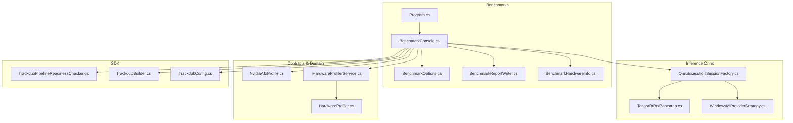
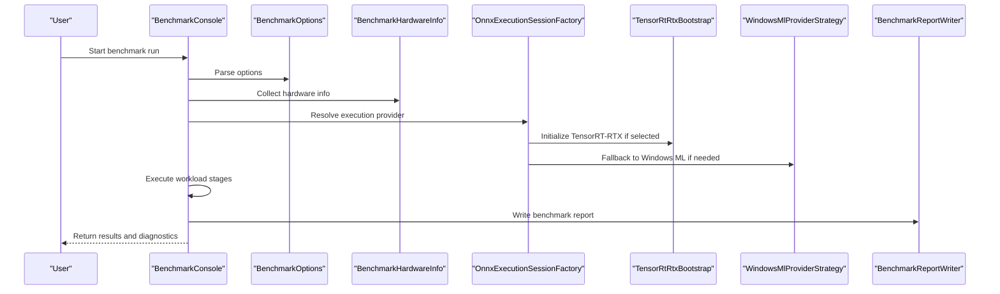
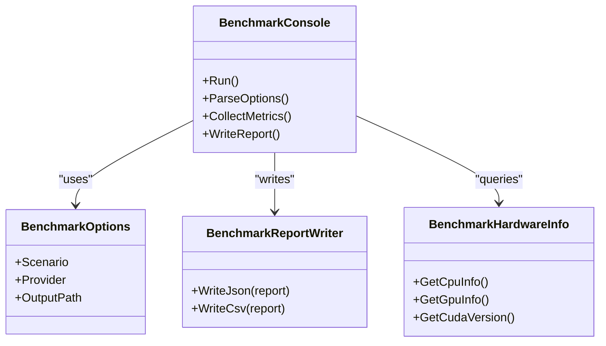
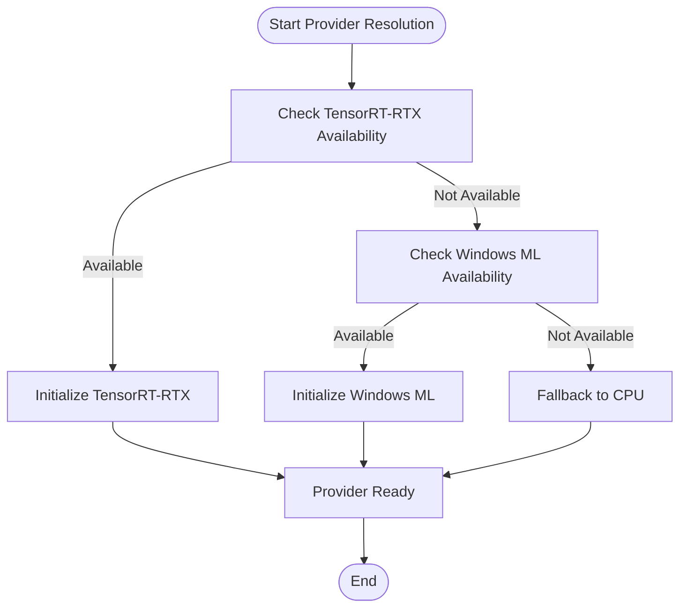
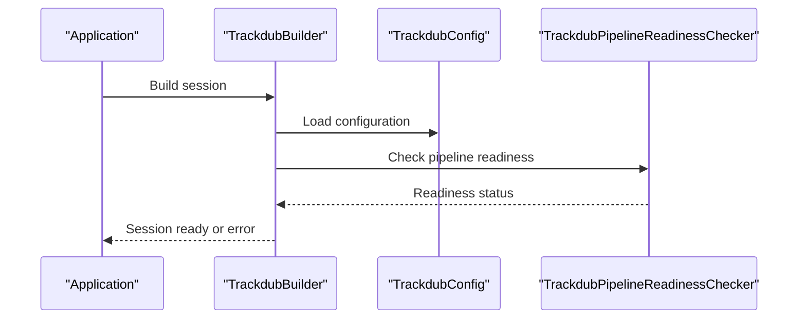
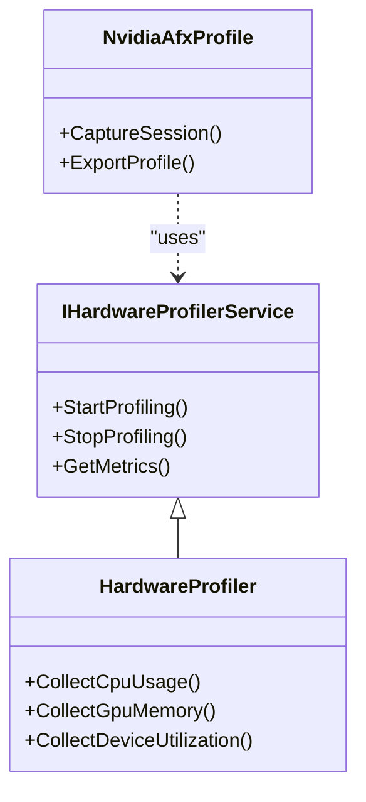
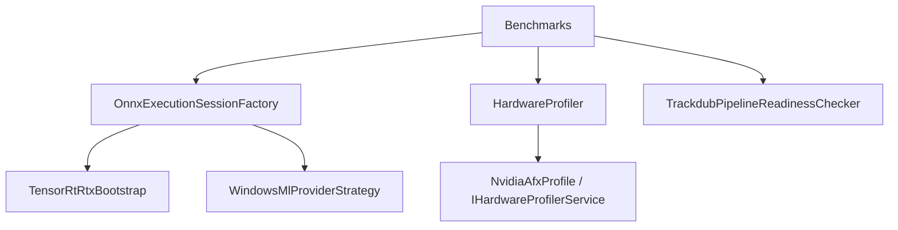

# Troubleshooting Performance Issues

<cite>
**Referenced Files in This Document**
- [TROUBLESHOOTING.md](file://docs/development/TROUBLESHOOTING.md)
- [profiling-report.md](file://docs/reference/profiling-report.md)
- [ADR-0009-gpu-memory-budget-planner.md](file://docs/decisions/ADR-0009-gpu-memory-budget-planner.md)
- [Trackdub.Benchmarks.csproj](file://src/Trackdub.Benchmarks/Trackdub.Benchmarks.csproj)
- [BenchmarkConsole.cs](file://src/Trackdub.Benchmarks/BenchmarkConsole.cs)
- [BenchmarkOptions.cs](file://src/Trackdub.Benchmarks/BenchmarkOptions.cs)
- [BenchmarkReportWriter.cs](file://src/Trackdub.Benchmarks/BenchmarkReportWriter.cs)
- [BenchmarkHardwareInfo.cs](file://src/Trackdub.Benchmarks/BenchmarkHardwareInfo.cs)
- [Program.cs](file://src/Trackdub.Benchmarks/Program.cs)
- [README.md](file://src/Trackdub.Benchmarks/README.md)
- [OnnxExecutionSessionFactory.cs](file://src/Trackdub.Inference.Onnx/OnnxExecutionSessionFactory.cs)
- [TensorRtRtxBootstrap.cs](file://src/Trackdub.Inference.Onnx/TensorRtRtx/TensorRtRtxBootstrap.cs)
- [WindowsMlProviderStrategy.cs](file://src/Trackdub.Inference.Onnx/WindowsMl/WindowsMlProviderStrategy.cs)
- [NvidiaAfxProfile.cs](file://src/Trackdub.Contracts/NvidiaAfxProfile.cs)
- [IHardwareProfilerService.cs](file://src/Trackdub.Contracts/IHardwareProfilerService.cs)
- [HardwareProfiler.cs](file://src/Trackdub.Domain/HardwareProfiler.cs)
- [TrackdubPipelineReadinessChecker.cs](file://src/Trackdub.Sdk/TrackdubPipelineReadinessChecker.cs)
- [TrackdubBuilder.cs](file://src/Trackdub.Sdk/TrackdubBuilder.cs)
- [TrackdubConfig.cs](file://src/Trackdub.Sdk/TrackdubConfig.cs)
- [execution-provider-preference.md](file://docs/reference/windows-ml-stage-provider-matrix.md)
- [tensorrt-rtx-ep-abi-plugin.md](file://docs/reference/tensorrt-rtx-ep-ab1-plugin.md)
</cite>

## Table of Contents
1. [Introduction](#introduction)
2. [Project Structure](#project-structure)
3. [Core Components](#core-components)
4. [Architecture Overview](#architecture-overview)
5. [Detailed Component Analysis](#detailed-component-analysis)
6. [Dependency Analysis](#dependency-analysis)
7. [Performance Considerations](#performance-considerations)
8. [Troubleshooting Guide](#troubleshooting-guide)
9. [Conclusion](#conclusion)
10. [Appendices](#appendices)

## Introduction
This document provides a comprehensive troubleshooting guide for performance-related issues in Trackdub, focusing on slow inference times, high memory usage, GPU underutilization, and pipeline bottlenecks. It explains diagnostic techniques using logs, profiling tools, and system monitoring; covers hardware-specific troubleshooting for GPU drivers, CUDA installations, and execution provider conflicts; and details performance regression detection, benchmark comparison methods, and optimization validation. It also includes step-by-step debugging procedures, baseline establishment, and production deployment considerations including scaling and capacity planning.

## Project Structure
Trackdub’s performance diagnostics and benchmarking capabilities are primarily implemented in the Benchmarks project and supported by contracts, domain services, and SDK configuration. The key areas include:
- Benchmark runner and reporting utilities
- Hardware information collection
- Execution provider selection and bootstrap logic
- Readiness checks for pipeline components
- Profiling and telemetry interfaces

**Diagram sources**
- [Program.cs](file://src/Trackdub.Benchmarks/Program.cs)
- [BenchmarkConsole.cs](file://src/Trackdub.Benchmarks/BenchmarkConsole.cs)
- [BenchmarkOptions.cs](file://src/Trackdub.Benchmarks/BenchmarkOptions.cs)
- [BenchmarkReportWriter.cs](file://src/Trackdub.Benchmarks/BenchmarkReportWriter.cs)
- [BenchmarkHardwareInfo.cs](file://src/Trackdub.Benchmarks/BenchmarkHardwareInfo.cs)
- [OnnxExecutionSessionFactory.cs](file://src/Trackdub.Inference.Onnx/OnnxExecutionSessionFactory.cs)
- [TensorRtRtxBootstrap.cs](file://src/Trackdub.Inference.Onnx/TensorRtRtx/TensorRtRtxBootstrap.cs)
- [WindowsMlProviderStrategy.cs](file://src/Trackdub.Inference.Onnx/WindowsMl/WindowsMlProviderStrategy.cs)
- [NvidiaAfxProfile.cs](file://src/Trackdub.Contracts/NvidiaAfxProfile.cs)
- [IHardwareProfilerService.cs](file://src/Trackdub.Contracts/IHardwareProfilerService.cs)
- [HardwareProfiler.cs](file://src/Trackdub.Domain/HardwareProfiler.cs)
- [TrackdubPipelineReadinessChecker.cs](file://src/Trackdub.Sdk/TrackdubPipelineReadinessChecker.cs)
- [TrackdubBuilder.cs](file://src/Trackdub.Sdk/TrackdubBuilder.cs)
- [TrackdubConfig.cs](file://src/Trackdub.Sdk/TrackdubConfig.cs)

**Section sources**
- [README.md](file://src/Trackdub.Benchmarks/README.md)
- [Trackdub.Benchmarks.csproj](file://src/Trackdub.Benchmarks/Trackdub.Benchmarks.csproj)

## Core Components
- Benchmark Console and Runner: Orchestrates benchmark scenarios, collects metrics, and writes reports.
- Hardware Info Collector: Gathers CPU/GPU/CUDA environment details to correlate performance with hardware.
- Execution Provider Factory: Selects and configures ONNX Runtime providers (CUDA, TensorRT-RTX, Windows ML).
- Readiness Checker: Validates that required runtime components are available before running workloads.
- Profiling Interfaces: Exposes Nvidia AFX profiles and hardware profiler services for deeper insights.

Key responsibilities:
- Establish baselines and detect regressions via structured reports.
- Provide actionable diagnostics through logs and profiling data.
- Ensure correct execution provider selection to avoid fallbacks or misconfigurations.

**Section sources**
- [BenchmarkConsole.cs](file://src/Trackdub.Benchmarks/BenchmarkConsole.cs)
- [BenchmarkOptions.cs](file://src/Trackdub.Benchmarks/BenchmarkOptions.cs)
- [BenchmarkReportWriter.cs](file://src/Trackdub.Benchmarks/BenchmarkReportWriter.cs)
- [BenchmarkHardwareInfo.cs](file://src/Trackdub.Benchmarks/BenchmarkHardwareInfo.cs)
- [OnnxExecutionSessionFactory.cs](file://src/Trackdub.Inference.Onnx/OnnxExecutionSessionFactory.cs)
- [TrackdubPipelineReadinessChecker.cs](file://src/Trackdub.Sdk/TrackdubPipelineReadinessChecker.cs)
- [NvidiaAfxProfile.cs](file://src/Trackdub.Contracts/NvidiaAfxProfile.cs)
- [IHardwareProfilerService.cs](file://src/Trackdub.Contracts/IHardwareProfilerService.cs)
- [HardwareProfiler.cs](file://src/Trackdub.Domain/HardwareProfiler.cs)

## Architecture Overview
The performance diagnostic flow integrates benchmark orchestration, hardware profiling, and execution provider selection. The console orchestrates runs, collects metrics, and writes reports while leveraging readiness checks and hardware info collectors.

**Diagram sources**
- [BenchmarkConsole.cs](file://src/Trackdub.Benchmarks/BenchmarkConsole.cs)
- [BenchmarkOptions.cs](file://src/Trackdub.Benchmarks/BenchmarkOptions.cs)
- [BenchmarkHardwareInfo.cs](file://src/Trackdub.Benchmarks/BenchmarkHardwareInfo.cs)
- [OnnxExecutionSessionFactory.cs](file://src/Trackdub.Inference.Onnx/OnnxExecutionSessionFactory.cs)
- [TensorRtRtxBootstrap.cs](file://src/Trackdub.Inference.Onnx/TensorRtRtx/TensorRtRtxBootstrap.cs)
- [WindowsMlProviderStrategy.cs](file://src/Trackdub.Inference.Onnx/WindowsMl/WindowsMlProviderStrategy.cs)
- [BenchmarkReportWriter.cs](file://src/Trackdub.Benchmarks/BenchmarkReportWriter.cs)

## Detailed Component Analysis

### Benchmark Console and Reporting
The benchmark console coordinates runs, parses options, and writes structured reports. It integrates hardware info collection and execution provider resolution to ensure accurate performance measurement.

**Diagram sources**
- [BenchmarkConsole.cs](file://src/Trackdub.Benchmarks/BenchmarkConsole.cs)
- [BenchmarkOptions.cs](file://src/Trackdub.Benchmarks/BenchmarkOptions.cs)
- [BenchmarkReportWriter.cs](file://src/Trackdub.Benchmarks/BenchmarkReportWriter.cs)
- [BenchmarkHardwareInfo.cs](file://src/Trackdub.Benchmarks/BenchmarkHardwareInfo.cs)

**Section sources**
- [BenchmarkConsole.cs](file://src/Trackdub.Benchmarks/BenchmarkConsole.cs)
- [BenchmarkOptions.cs](file://src/Trackdub.Benchmarks/BenchmarkOptions.cs)
- [BenchmarkReportWriter.cs](file://src/Trackdub.Benchmarks/BenchmarkReportWriter.cs)
- [BenchmarkHardwareInfo.cs](file://src/Trackdub.Benchmarks/BenchmarkHardwareInfo.cs)

### Execution Provider Selection and Bootstrap
The execution provider factory selects the optimal ONNX Runtime provider based on availability and configuration. TensorRT-RTX is prioritized when available; otherwise, Windows ML may be used as a fallback.

**Diagram sources**
- [OnnxExecutionSessionFactory.cs](file://src/Trackdub.Inference.Onnx/OnnxExecutionSessionFactory.cs)
- [TensorRtRtxBootstrap.cs](file://src/Trackdub.Inference.Onnx/TensorRtRtx/TensorRtRtxBootstrap.cs)
- [WindowsMlProviderStrategy.cs](file://src/Trackdub.Inference.Onnx/WindowsMl/WindowsMlProviderStrategy.cs)

**Section sources**
- [OnnxExecutionSessionFactory.cs](file://src/Trackdub.Inference.Onnx/OnnxExecutionSessionFactory.cs)
- [TensorRtRtxBootstrap.cs](file://src/Trackdub.Inference.Onnx/TensorRtRtx/TensorRtRtxBootstrap.cs)
- [WindowsMlProviderStrategy.cs](file://src/Trackdub.Inference.Onnx/WindowsMl/WindowsMlProviderStrategy.cs)

### Readiness Checks and Configuration
The readiness checker validates that required components (e.g., CUDA, TensorRT, Windows ML) are present and configured correctly before executing workloads. Configuration is managed via SDK builder and config objects.

**Diagram sources**
- [TrackdubPipelineReadinessChecker.cs](file://src/Trackdub.Sdk/TrackdubPipelineReadinessChecker.cs)
- [TrackdubBuilder.cs](file://src/Trackdub.Sdk/TrackdubBuilder.cs)
- [TrackdubConfig.cs](file://src/Trackdub.Sdk/TrackdubConfig.cs)

**Section sources**
- [TrackdubPipelineReadinessChecker.cs](file://src/Trackdub.Sdk/TrackdubPipelineReadinessChecker.cs)
- [TrackdubBuilder.cs](file://src/Trackdub.Sdk/TrackdubBuilder.cs)
- [TrackdubConfig.cs](file://src/Trackdub.Sdk/TrackdubConfig.cs)

### Profiling and Telemetry Integration
Trackdub exposes profiling interfaces such as Nvidia AFX profiles and hardware profiler services to capture detailed performance metrics during inference.

**Diagram sources**
- [NvidiaAfxProfile.cs](file://src/Trackdub.Contracts/NvidiaAfxProfile.cs)
- [IHardwareProfilerService.cs](file://src/Trackdub.Contracts/IHardwareProfilerService.cs)
- [HardwareProfiler.cs](file://src/Trackdub.Domain/HardwareProfiler.cs)

**Section sources**
- [NvidiaAfxProfile.cs](file://src/Trackdub.Contracts/NvidiaAfxProfile.cs)
- [IHardwareProfilerService.cs](file://src/Trackdub.Contracts/IHardwareProfilerService.cs)
- [HardwareProfiler.cs](file://src/Trackdub.Domain/HardwareProfiler.cs)

## Dependency Analysis
The benchmarks depend on execution provider factories, hardware profilers, and readiness checkers. Misconfigurations in these dependencies can lead to performance degradation or failures.

**Diagram sources**
- [BenchmarkConsole.cs](file://src/Trackdub.Benchmarks/BenchmarkConsole.cs)
- [OnnxExecutionSessionFactory.cs](file://src/Trackdub.Inference.Onnx/OnnxExecutionSessionFactory.cs)
- [TensorRtRtxBootstrap.cs](file://src/Trackdub.Inference.Onnx/TensorRtRtx/TensorRtRtxBootstrap.cs)
- [WindowsMlProviderStrategy.cs](file://src/Trackdub.Inference.Onnx/WindowsMl/WindowsMlProviderStrategy.cs)
- [HardwareProfiler.cs](file://src/Trackdub.Domain/HardwareProfiler.cs)
- [NvidiaAfxProfile.cs](file://src/Trackdub.Contracts/NvidiaAfxProfile.cs)
- [IHardwareProfilerService.cs](file://src/Trackdub.Contracts/IHardwareProfilerService.cs)
- [TrackdubPipelineReadinessChecker.cs](file://src/Trackdub.Sdk/TrackdubPipelineReadinessChecker.cs)

**Section sources**
- [BenchmarkConsole.cs](file://src/Trackdub.Benchmarks/BenchmarkConsole.cs)
- [OnnxExecutionSessionFactory.cs](file://src/Trackdub.Inference.Onnx/OnnxExecutionSessionFactory.cs)
- [TensorRtRtxBootstrap.cs](file://src/Trackdub.Inference.Onnx/TensorRtRtx/TensorRtRtxBootstrap.cs)
- [WindowsMlProviderStrategy.cs](file://src/Trackdub.Inference.Onnx/WindowsMl/WindowsMlProviderStrategy.cs)
- [HardwareProfiler.cs](file://src/Trackdub.Domain/HardwareProfiler.cs)
- [NvidiaAfxProfile.cs](file://src/Trackdub.Contracts/NvidiaAfxProfile.cs)
- [IHardwareProfilerService.cs](file://src/Trackdub.Contracts/IHardwareProfilerService.cs)
- [TrackdubPipelineReadinessChecker.cs](file://src/Trackdub.Sdk/TrackdubPipelineReadinessChecker.cs)

## Performance Considerations
- Inference Time: Optimize model loading, batch sizes, and execution provider selection. Use TensorRT-RTX for NVIDIA GPUs when available.
- Memory Usage: Monitor GPU memory via hardware profilers and adjust model precision or batch size to prevent OOM errors.
- GPU Underutilization: Ensure proper CUDA installation, driver compatibility, and provider initialization. Avoid unnecessary CPU-GPU data transfers.
- Pipeline Bottlenecks: Profile each stage to identify slow steps. Use readiness checks to validate component availability.

[No sources needed since this section provides general guidance]

## Troubleshooting Guide

### Common Performance Problems
- Slow Inference Times
  - Verify execution provider selection and initialization.
  - Check model optimization settings and batch sizes.
  - Use profiling tools to identify hotspots.
- High Memory Usage
  - Monitor GPU memory with hardware profilers.
  - Reduce model precision or batch size.
  - Clear caches and unused resources.
- GPU Underutilization
  - Validate CUDA and driver versions.
  - Ensure TensorRT-RTX is properly initialized.
  - Avoid CPU-bound preprocessing bottlenecks.
- Pipeline Bottlenecks
  - Profile individual stages to find delays.
  - Use readiness checks to confirm component health.
  - Adjust concurrency and resource limits.

**Section sources**
- [TROUBLESHOOTING.md](file://docs/development/TROUBLESHOOTING.md)
- [profiling-report.md](file://docs/reference/profiling-report.md)

### Diagnostic Tools and Techniques
- Log Analysis: Enable verbose logging to trace provider initialization and stage execution.
- Profiling Tools: Use Nvidia AFX profiles and hardware profiler services to capture metrics.
- System Monitoring: Monitor CPU/GPU utilization and memory usage during runs.

**Section sources**
- [NvidiaAfxProfile.cs](file://src/Trackdub.Contracts/NvidiaAfxProfile.cs)
- [IHardwareProfilerService.cs](file://src/Trackdub.Contracts/IHardwareProfilerService.cs)
- [HardwareProfiler.cs](file://src/Trackdub.Domain/HardwareProfiler.cs)

### Hardware-Specific Troubleshooting
- GPU Drivers: Ensure latest NVIDIA drivers are installed.
- CUDA Installation: Verify CUDA toolkit version matches requirements.
- Execution Provider Conflicts: Confirm only one provider is active per session.

**Section sources**
- [execution-provider-preference.md](file://docs/reference/windows-ml-stage-provider-matrix.md)
- [tensorrt-rtx-ep-abi-plugin.md](file://docs/reference/tensorrt-rtx-ep-ab1-plugin.md)

### Performance Regression Detection and Benchmark Comparison
- Establish Baselines: Run benchmarks on known-good configurations.
- Compare Reports: Use structured reports to compare runs across changes.
- Validate Optimizations: Re-run benchmarks after applying optimizations.

**Section sources**
- [BenchmarkReportWriter.cs](file://src/Trackdub.Benchmarks/BenchmarkReportWriter.cs)
- [BenchmarkOptions.cs](file://src/Trackdub.Benchmarks/BenchmarkOptions.cs)

### Step-by-Step Debugging Procedures
1. Run readiness checks to validate environment.
2. Capture hardware info and logs.
3. Execute benchmarks with verbose logging.
4. Analyze reports and profiling data.
5. Iterate on optimizations and re-test.

**Section sources**
- [TrackdubPipelineReadinessChecker.cs](file://src/Trackdub.Sdk/TrackdubPipelineReadinessChecker.cs)
- [BenchmarkConsole.cs](file://src/Trackdub.Benchmarks/BenchmarkConsole.cs)
- [BenchmarkHardwareInfo.cs](file://src/Trackdub.Benchmarks/BenchmarkHardwareInfo.cs)

### Production Deployment Considerations
- Scaling: Configure concurrency and resource limits based on hardware capacity.
- Capacity Planning: Use benchmarks to estimate throughput and latency.
- Monitoring: Integrate profiling and logging into production pipelines.

**Section sources**
- [TrackdubBuilder.cs](file://src/Trackdub.Sdk/TrackdubBuilder.cs)
- [TrackdubConfig.cs](file://src/Trackdub.Sdk/TrackdubConfig.cs)

## Conclusion
This guide provides a systematic approach to diagnosing and resolving performance issues in Trackdub. By leveraging benchmarking tools, profiling interfaces, and readiness checks, teams can identify bottlenecks, optimize execution providers, and ensure stable performance across diverse hardware configurations. Regular baseline comparisons and continuous monitoring are essential for maintaining performance in production environments.

[No sources needed since this section summarizes without analyzing specific files]

## Appendices
- Additional references to architecture decisions and profiling reports can be found in the documentation directory.
- For detailed API usage, consult the benchmark and SDK projects.

[No sources needed since this section provides general guidance]