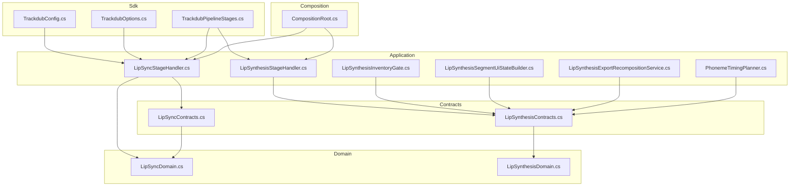
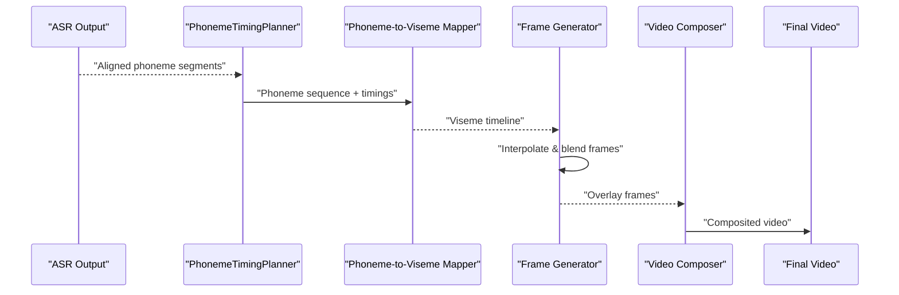
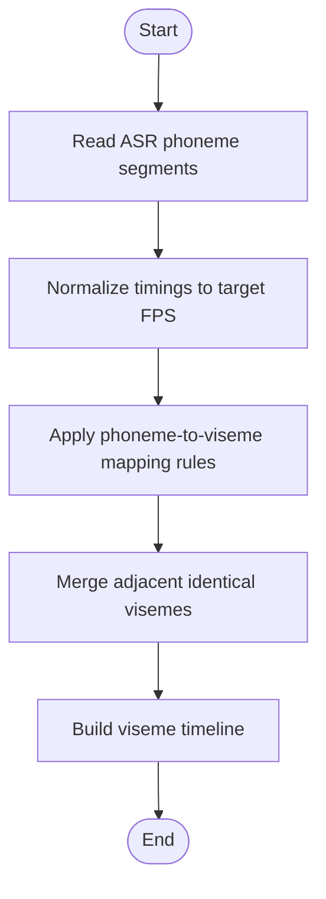
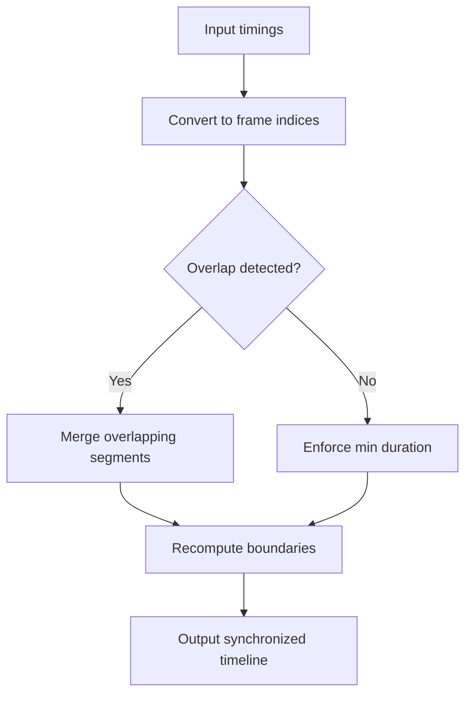
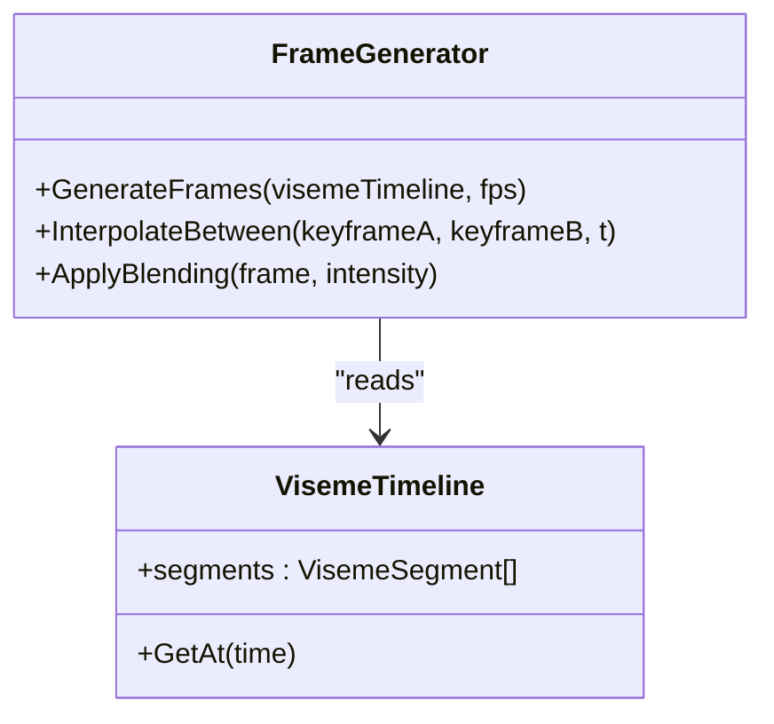
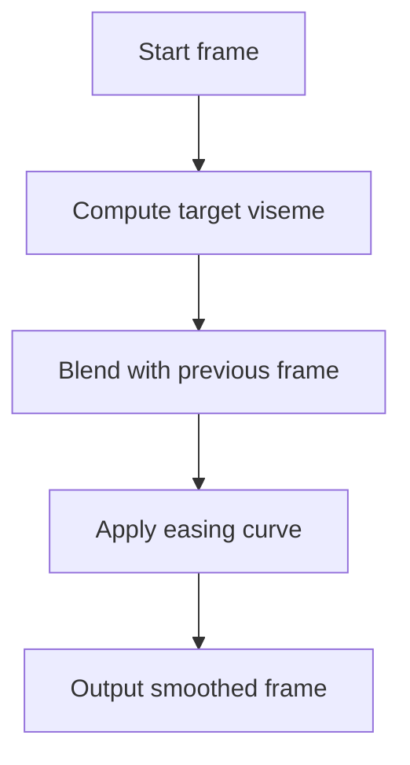
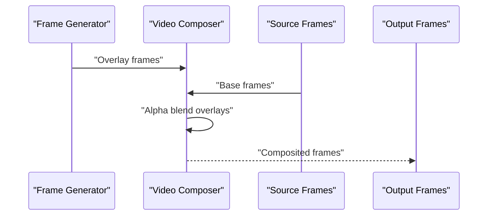
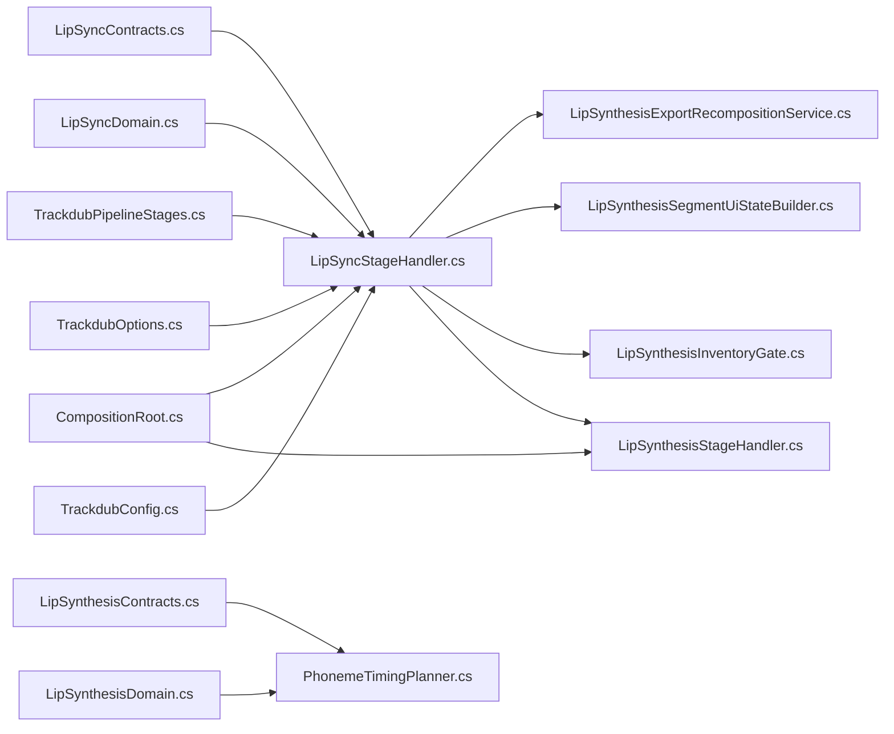

# Animation Generation Pipeline

<cite>
**Referenced Files in This Document**
- [LipSyncStageHandler.cs](file://src/Trackdub.Application/LipSync/LipSyncStageHandler.cs)
- [PhonemeTimingPlanner.cs](file://src/Trackdub.Application/LipSynthesis/PhonemeTimingPlanner.cs)
- [LipSynthesisExportRecompositionService.cs](file://src/Trackdub.Application/LipSynthesis/LipSynthesisExportRecompositionService.cs)
- [LipSynthesisSegmentUiStateBuilder.cs](file://src/Trackdub.Application/LipSynthesis/LipSynthesisSegmentUiStateBuilder.cs)
- [LipSynthesisInventoryGate.cs](file://src/Trackdub.Application/LipSynthesis/LipSynthesisInventoryGate.cs)
- [LipSynthesisStageHandler.cs](file://src/Trackdub.Application/LipSynthesis/LipSynthesisStageHandler.cs)
- [LipSyncContracts.cs](file://src/Trackdub.Contracts/LipSync/LipSyncContracts.cs)
- [LipSyncDomain.cs](file://src/Trackdub.Domain/LipSync/LipSyncDomain.cs)
- [LipSynthesisContracts.cs](file://src/Trackdub.Contracts/LipSynthesis/LipSynthesisContracts.cs)
- [LipSynthesisDomain.cs](file://src/Trackdub.Domain/LipSynthesis/LipSynthesisDomain.cs)
- [LipSynthesisPipelineStages.cs](file://src/Trackdub.Sdk/TrackdubPipelineStages.cs)
- [CompositionRoot.cs](file://src/Trackdub.Composition/CompositionRoot.cs)
- [TrackdubOptions.cs](file://src/Trackdub.Sdk/TrackdubOptions.cs)
- [TrackdubConfig.cs](file://src/Trackdub.Sdk/TrackdubConfig.cs)
- [LipSyncStageHandlerTests.cs](file://tests/Trackdub.Application.Tests/LipSyncStageHandlerTests.cs)
- [PhonemeTimingPlannerTests.cs](file://tests/Trackdub.Application.Tests/PhonemeTimingPlannerTests.cs)
- [LipSynthesisExportRecompositionTests.cs](file://tests/Trackdub.Application.Tests/LipSynthesisExportRecompositionTests.cs)
- [LipSynthesisStageHandlerTests.cs](file://tests/Trackdub.Application.Tests/LipSynthesisStageHandlerTests.cs)
</cite>

## Table of Contents
1. [Introduction](#introduction)
2. [Project Structure](#project-structure)
3. [Core Components](#core-components)
4. [Architecture Overview](#architecture-overview)
5. [Detailed Component Analysis](#detailed-component-analysis)
6. [Dependency Analysis](#dependency-analysis)
7. [Performance Considerations](#performance-considerations)
8. [Troubleshooting Guide](#troubleshooting-guide)
9. [Conclusion](#conclusion)
10. [Appendices](#appendices)

## Introduction
This document explains the lip-sync animation generation pipeline in Trackdub, focusing on how phonemes are mapped to visemes, how temporal synchronization is achieved, and how frame-by-frame animations are created and composited into video. It also covers blending techniques, interpolation methods, smoothness optimization, configuration options for speed and alignment, practical customization examples, edge-case handling, and common issues with timing, artifacts, and performance.

## Project Structure
The lip-sync pipeline spans several layers:
- Contracts and Domain define data models and invariants for lip-sync and lip-synthesis stages.
- Application services orchestrate planning, export recomposition, UI state building, and stage execution.
- Composition wires dependencies and exposes pipeline stages.
- Sdk configures pipeline behavior and options.
- Tests validate behavior across planning, staging, and recomposition.

**Diagram sources**
- [LipSyncContracts.cs](file://src/Trackdub.Contracts/LipSync/LipSyncContracts.cs)
- [LipSyncDomain.cs](file://src/Trackdub.Domain/LipSync/LipSyncDomain.cs)
- [LipSynthesisContracts.cs](file://src/Trackdub.Contracts/LipSynthesis/LipSynthesisContracts.cs)
- [LipSynthesisDomain.cs](file://src/Trackdub.Domain/LipSynthesis/LipSynthesisDomain.cs)
- [LipSyncStageHandler.cs](file://src/Trackdub.Application/LipSync/LipSyncStageHandler.cs)
- [PhonemeTimingPlanner.cs](file://src/Trackdub.Application/LipSynthesis/PhonemeTimingPlanner.cs)
- [LipSynthesisExportRecompositionService.cs](file://src/Trackdub.Application/LipSynthesis/LipSynthesisExportRecompositionService.cs)
- [LipSynthesisSegmentUiStateBuilder.cs](file://src/Trackdub.Application/LipSynthesis/LipSynthesisSegmentUiStateBuilder.cs)
- [LipSynthesisInventoryGate.cs](file://src/Trackdub.Application/LipSynthesis/LipSynthesisInventoryGate.cs)
- [LipSynthesisStageHandler.cs](file://src/Trackdub.Application/LipSynthesis/LipSynthesisStageHandler.cs)
- [CompositionRoot.cs](file://src/Trackdub.Composition/CompositionRoot.cs)
- [TrackdubPipelineStages.cs](file://src/Trackdub.Sdk/TrackdubPipelineStages.cs)
- [TrackdubOptions.cs](file://src/Trackdub.Sdk/TrackdubOptions.cs)
- [TrackdubConfig.cs](file://src/Trackdub.Sdk/TrackdubConfig.cs)

**Section sources**
- [LipSyncStageHandler.cs](file://src/Trackdub.Application/LipSync/LipSyncStageHandler.cs)
- [PhonemeTimingPlanner.cs](file://src/Trackdub.Application/LipSynthesis/PhonemeTimingPlanner.cs)
- [LipSynthesisExportRecompositionService.cs](file://src/Trackdub.Application/LipSynthesis/LipSynthesisExportRecompositionService.cs)
- [LipSynthesisSegmentUiStateBuilder.cs](file://src/Trackdub.Application/LipSynthesis/LipSynthesisSegmentUiStateBuilder.cs)
- [LipSynthesisInventoryGate.cs](file://src/Trackdub.Application/LipSynthesis/LipSynthesisInventoryGate.cs)
- [LipSynthesisStageHandler.cs](file://src/Trackdub.Application/LipSynthesis/LipSynthesisStageHandler.cs)
- [LipSyncContracts.cs](file://src/Trackdub.Contracts/LipSync/LipSyncContracts.cs)
- [LipSyncDomain.cs](file://src/Trackdub.Domain/LipSync/LipSyncDomain.cs)
- [LipSynthesisContracts.cs](file://src/Trackdub.Contracts/LipSynthesis/LipSynthesisContracts.cs)
- [LipSynthesisDomain.cs](file://src/Trackdub.Domain/LipSynthesis/LipSynthesisDomain.cs)
- [CompositionRoot.cs](file://src/Trackdub.Composition/CompositionRoot.cs)
- [TrackdubPipelineStages.cs](file://src/Trackdub.Sdk/TrackdubPipelineStages.cs)
- [TrackdubOptions.cs](file://src/Trackdub.Sdk/TrackdubOptions.cs)
- [TrackdubConfig.cs](file://src/Trackdub.Sdk/TrackdubConfig.cs)

## Core Components
- LipSyncStageHandler: Orchestrates the lip-sync stage, consuming ASR-aligned segments and producing animation-ready outputs.
- PhonemeTimingPlanner: Computes per-phoneme timings and aligns them to frames or audio timestamps.
- LipSynthesisExportRecompositionService: Recomposes exported assets to integrate generated lip-sync overlays while preserving quality.
- LipSynthesisSegmentUiStateBuilder: Builds UI-friendly segment states for visualization and editing of lip-sync results.
- LipSynthesisInventoryGate: Validates availability of required assets (e.g., viseme sets, reference media).
- LipSynthesisStageHandler: Executes synthesis steps that feed into lip-sync animation creation.

Key responsibilities:
- Mapping phonemes to visemes based on language-specific rules and mappings.
- Temporal synchronization using ASR timings and frame rates.
- Frame-by-frame animation generation via interpolation between viseme keyframes.
- Blending transitions to avoid abrupt changes.
- Compositing overlays onto source video frames.

**Section sources**
- [LipSyncStageHandler.cs](file://src/Trackdub.Application/LipSync/LipSyncStageHandler.cs)
- [PhonemeTimingPlanner.cs](file://src/Trackdub.Application/LipSynthesis/PhonemeTimingPlanner.cs)
- [LipSynthesisExportRecompositionService.cs](file://src/Trackdub.Application/LipSynthesis/LipSynthesisExportRecompositionService.cs)
- [LipSynthesisSegmentUiStateBuilder.cs](file://src/Trackdub.Application/LipSynthesis/LipSynthesisSegmentUiStateBuilder.cs)
- [LipSynthesisInventoryGate.cs](file://src/Trackdub.Application/LipSynthesis/LipSynthesisInventoryGate.cs)
- [LipSynthesisStageHandler.cs](file://src/Trackdub.Application/LipSynthesis/LipSynthesisStageHandler.cs)

## Architecture Overview
The pipeline integrates ASR-derived phoneme timings with a mapping layer to visemes, then generates time-aligned animation frames and composites them over the original video.

**Diagram sources**
- [PhonemeTimingPlanner.cs](file://src/Trackdub.Application/LipSynthesis/PhonemeTimingPlanner.cs)
- [LipSyncContracts.cs](file://src/Trackdub.Contracts/LipSync/LipSyncContracts.cs)
- [LipSynthesisContracts.cs](file://src/Trackdub.Contracts/LipSynthesis/LipSynthesisContracts.cs)
- [LipSynthesisExportRecompositionService.cs](file://src/Trackdub.Application/LipSynthesis/LipSynthesisExportRecompositionService.cs)

## Detailed Component Analysis

### Phoneme-to-Viseme Mapping
- Input: Sequence of phonemes with start/end times from ASR.
- Mapping: Language-aware rules convert phonemes to visemes; multiple phonemes may map to the same viseme.
- Output: Viseme timeline aligned to audio timestamps.

**Diagram sources**
- [PhonemeTimingPlanner.cs](file://src/Trackdub.Application/LipSynthesis/PhonemeTimingPlanner.cs)
- [LipSyncContracts.cs](file://src/Trackdub.Contracts/LipSync/LipSyncContracts.cs)

**Section sources**
- [PhonemeTimingPlanner.cs](file://src/Trackdub.Application/LipSynthesis/PhonemeTimingPlanner.cs)
- [LipSyncContracts.cs](file://src/Trackdub.Contracts/LipSync/LipSyncContracts.cs)

### Temporal Synchronization Algorithms
- Aligns phoneme timings to video frame rate by rounding to nearest frame boundaries.
- Handles variable frame rates by converting durations to frame indices.
- Ensures no overlap or gaps by merging adjacent segments and enforcing minimum durations.

**Diagram sources**
- [PhonemeTimingPlanner.cs](file://src/Trackdub.Application/LipSynthesis/PhonemeTimingPlanner.cs)

**Section sources**
- [PhonemeTimingPlanner.cs](file://src/Trackdub.Application/LipSynthesis/PhonemeTimingPlanner.cs)

### Frame-by-Frame Animation Creation
- Interpolation: Smoothly transitions between viseme keyframes using linear or spline interpolation.
- Blending: Applies easing functions to reduce abrupt changes at segment boundaries.
- Quality: Maintains resolution and color fidelity by processing frames without downscaling unless configured.

**Diagram sources**
- [LipSyncContracts.cs](file://src/Trackdub.Contracts/LipSync/LipSyncContracts.cs)
- [LipSynthesisContracts.cs](file://src/Trackdub.Contracts/LipSynthesis/LipSynthesisContracts.cs)

**Section sources**
- [LipSyncContracts.cs](file://src/Trackdub.Contracts/LipSync/LipSyncContracts.cs)
- [LipSynthesisContracts.cs](file://src/Trackdub.Contracts/LipSynthesis/LipSynthesisContracts.cs)

### Animation Blending Techniques and Smoothness Optimization
- Blending intensity controls how much previous frame influences current frame.
- Easing curves (ease-in/out) applied at transitions to avoid jumps.
- Smoothing filters can be applied to viseme amplitude or shape parameters.

[No sources needed since this diagram shows conceptual workflow, not actual code structure]

**Section sources**
- [LipSyncStageHandler.cs](file://src/Trackdub.Application/LipSync/LipSyncStageHandler.cs)

### Video Compositing Pipeline and Overlay Rendering
- Overlay rendering: Generates overlay frames representing mouth movements or facial landmarks.
- Compositing: Blends overlay frames onto source video frames using alpha blending.
- Quality preservation: Uses lossless intermediate formats when possible and final encoding settings to maintain fidelity.

**Diagram sources**
- [LipSynthesisExportRecompositionService.cs](file://src/Trackdub.Application/LipSynthesis/LipSynthesisExportRecompositionService.cs)

**Section sources**
- [LipSynthesisExportRecompositionService.cs](file://src/Trackdub.Application/LipSynthesis/LipSynthesisExportRecompositionService.cs)

### Configuration Options
- Animation speed: Controls playback rate of viseme transitions relative to audio.
- Blending intensity: Adjusts smoothing between frames.
- Temporal alignment: Fine-tunes offset between phoneme timings and frame indices.
- Quality settings: Encoding parameters for output video.

Configuration is exposed through SDK options and pipeline stages.

**Section sources**
- [TrackdubOptions.cs](file://src/Trackdub.Sdk/TrackdubOptions.cs)
- [TrackdubConfig.cs](file://src/Trackdub.Sdk/TrackdubConfig.cs)
- [TrackdubPipelineStages.cs](file://src/Trackdub.Sdk/TrackdubPipelineStages.cs)

### Practical Examples and Edge Cases
- Rapid speech: Increase blending intensity and apply stronger smoothing to avoid jitter.
- Pauses: Insert neutral viseme frames during silence to maintain natural appearance.
- Customization: Adjust speed multiplier and alignment offsets per segment for fine control.

Examples are validated by tests covering timing, blending, and recomposition.

**Section sources**
- [PhonemeTimingPlannerTests.cs](file://tests/Trackdub.Application.Tests/PhonemeTimingPlannerTests.cs)
- [LipSyncStageHandlerTests.cs](file://tests/Trackdub.Application.Tests/LipSyncStageHandlerTests.cs)
- [LipSynthesisExportRecompositionTests.cs](file://tests/Trackdub.Application.Tests/LipSynthesisExportRecompositionTests.cs)

## Dependency Analysis
The lip-sync pipeline depends on contracts and domain models for data integrity, application services for orchestration, and composition wiring for runtime setup.

**Diagram sources**
- [LipSyncContracts.cs](file://src/Trackdub.Contracts/LipSync/LipSyncContracts.cs)
- [LipSyncDomain.cs](file://src/Trackdub.Domain/LipSync/LipSyncDomain.cs)
- [LipSynthesisContracts.cs](file://src/Trackdub.Contracts/LipSynthesis/LipSynthesisContracts.cs)
- [LipSynthesisDomain.cs](file://src/Trackdub.Domain/LipSynthesis/LipSynthesisDomain.cs)
- [LipSyncStageHandler.cs](file://src/Trackdub.Application/LipSync/LipSyncStageHandler.cs)
- [PhonemeTimingPlanner.cs](file://src/Trackdub.Application/LipSynthesis/PhonemeTimingPlanner.cs)
- [LipSynthesisExportRecompositionService.cs](file://src/Trackdub.Application/LipSynthesis/LipSynthesisExportRecompositionService.cs)
- [LipSynthesisSegmentUiStateBuilder.cs](file://src/Trackdub.Application/LipSynthesis/LipSynthesisSegmentUiStateBuilder.cs)
- [LipSynthesisInventoryGate.cs](file://src/Trackdub.Application/LipSynthesis/LipSynthesisInventoryGate.cs)
- [LipSynthesisStageHandler.cs](file://src/Trackdub.Application/LipSynthesis/LipSynthesisStageHandler.cs)
- [CompositionRoot.cs](file://src/Trackdub.Composition/CompositionRoot.cs)
- [TrackdubPipelineStages.cs](file://src/Trackdub.Sdk/TrackdubPipelineStages.cs)
- [TrackdubOptions.cs](file://src/Trackdub.Sdk/TrackdubOptions.cs)
- [TrackdubConfig.cs](file://src/Trackdub.Sdk/TrackdubConfig.cs)

**Section sources**
- [CompositionRoot.cs](file://src/Trackdub.Composition/CompositionRoot.cs)
- [TrackdubPipelineStages.cs](file://src/Trackdub.Sdk/TrackdubPipelineStages.cs)
- [TrackdubOptions.cs](file://src/Trackdub.Sdk/TrackdubOptions.cs)
- [TrackdubConfig.cs](file://src/Trackdub.Sdk/TrackdubConfig.cs)

## Performance Considerations
- Minimize frame recalculations by caching interpolated viseme states.
- Use efficient blending operations and avoid unnecessary allocations.
- Batch overlay rendering to reduce I/O overhead.
- Optimize encoder settings for speed vs. quality trade-offs.

[No sources needed since this section provides general guidance]

## Troubleshooting Guide
Common issues:
- Timing drift: Verify ASR segment alignment and frame rate conversion logic.
- Visual artifacts: Adjust blending intensity and easing curves; check overlay alpha values.
- Performance bottlenecks: Profile frame generation and compositing; consider GPU acceleration if available.

Validation and debugging are supported by unit tests covering planner, handler, and recomposition paths.

**Section sources**
- [PhonemeTimingPlannerTests.cs](file://tests/Trackdub.Application.Tests/PhonemeTimingPlannerTests.cs)
- [LipSyncStageHandlerTests.cs](file://tests/Trackdub.Application.Tests/LipSyncStageHandlerTests.cs)
- [LipSynthesisExportRecompositionTests.cs](file://tests/Trackdub.Application.Tests/LipSynthesisExportRecompositionTests.cs)

## Conclusion
The lip-sync animation generation pipeline in Trackdub combines precise phoneme-to-viseme mapping, robust temporal synchronization, and high-quality frame generation and compositing. By tuning blending, interpolation, and encoding parameters, users can achieve natural-looking lip-sync even under challenging conditions like rapid speech or pauses. The modular architecture allows flexible customization and optimization for different performance and quality requirements.

## Appendices
- References to test files provide concrete examples of expected behaviors and edge cases.
- Configuration files and SDK options enable fine-grained control over pipeline behavior.

[No sources needed since this section summarizes without analyzing specific files]